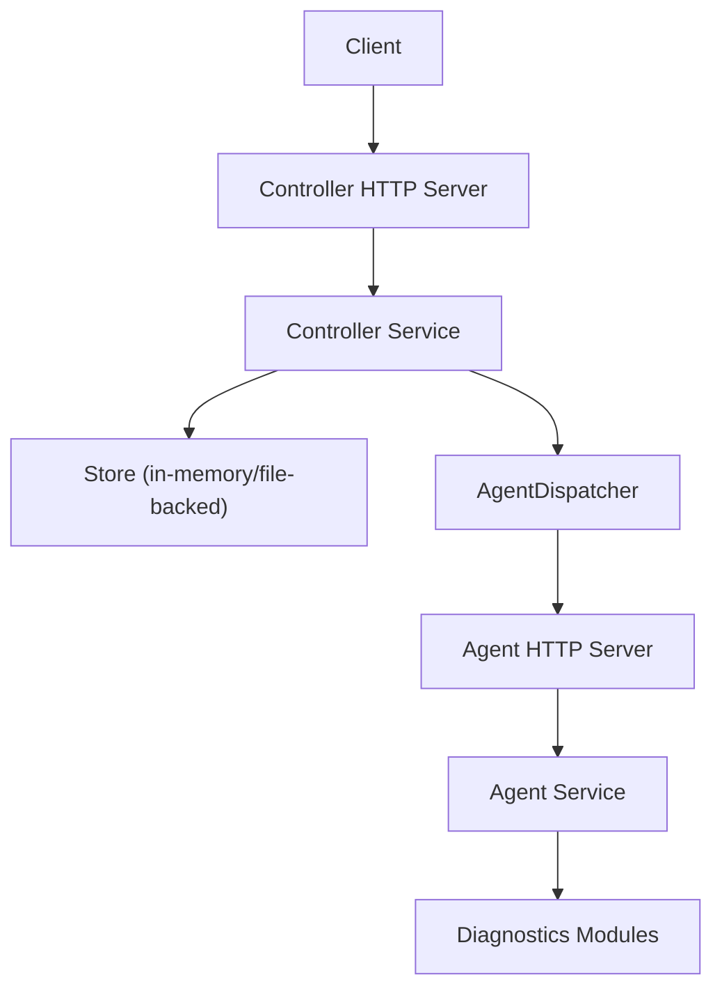
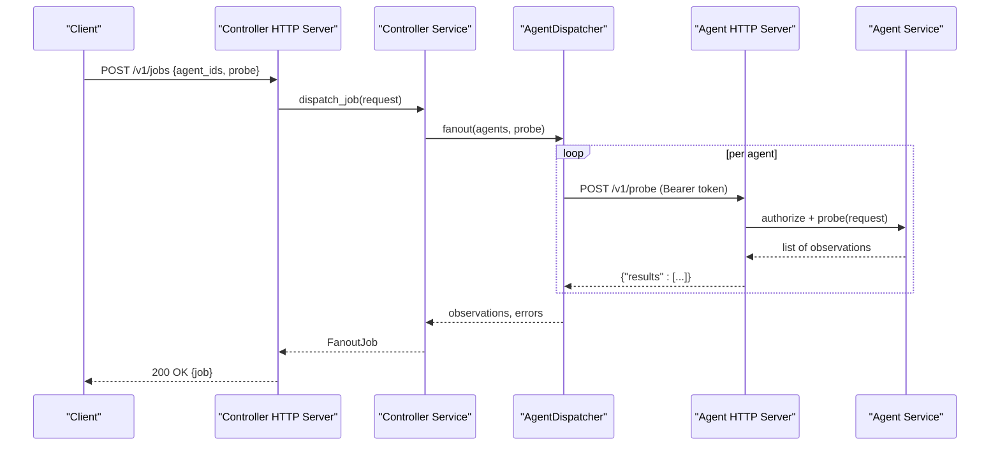
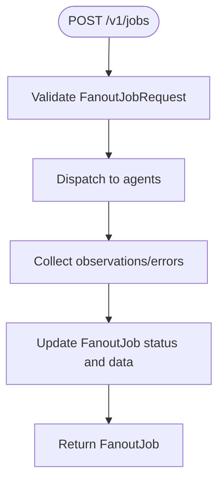
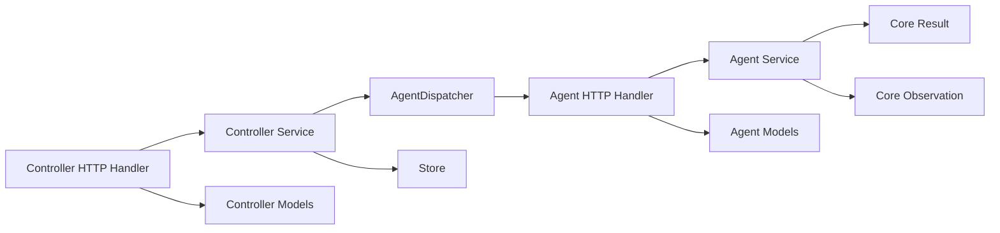

# API Reference

<cite>
**Referenced Files in This Document**
- [agent/http_server.py](file://agent/http_server.py)
- [agent/service.py](file://agent/service.py)
- [agent/models.py](file://agent/models.py)
- [agent/config.py](file://agent/config.py)
- [controller/http_server.py](file://controller/http_server.py)
- [controller/service.py](file://controller/service.py)
- [controller/models.py](file://controller/models.py)
- [controller/dispatch.py](file://controller/dispatch.py)
- [core/remote_observation.py](file://core/remote_observation.py)
- [core/result.py](file://core/result.py)
- [tests/test_agent_http.py](file://tests/test_agent_http.py)
</cite>

## Table of Contents
1. [Introduction](#introduction)
2. [Project Structure](#project-structure)
3. [Core Components](#core-components)
4. [Architecture Overview](#architecture-overview)
5. [Detailed Component Analysis](#detailed-component-analysis)
6. [Dependency Analysis](#dependency-analysis)
7. [Performance Considerations](#performance-considerations)
8. [Troubleshooting Guide](#troubleshooting-guide)
9. [Conclusion](#conclusion)
10. [Appendices](#appendices)

## Introduction
This document provides a comprehensive API reference for NetForge’s HTTP endpoints, covering both the Agent and Controller REST APIs. It specifies authentication, request/response schemas, error handling, and integration patterns. The current implementation uses HTTP/JSON with Bearer token authentication. There is no WebSocket or streaming support in this codebase; all interactions are synchronous HTTP requests.

## Project Structure
NetForge exposes two HTTP services:
- Agent service: runs on each host to perform diagnostics and expose inventory/health.
- Controller service: orchestrates jobs across multiple agents and stores job state.

**Diagram sources**
- [controller/http_server.py:16-68](file://controller/http_server.py#L16-L68)
- [controller/service.py:17-51](file://controller/service.py#L17-L51)
- [controller/dispatch.py:19-52](file://controller/dispatch.py#L19-L52)
- [agent/http_server.py:15-58](file://agent/http_server.py#L15-L58)
- [agent/service.py:33-111](file://agent/service.py#L33-L111)

**Section sources**
- [agent/http_server.py:15-62](file://agent/http_server.py#L15-L62)
- [controller/http_server.py:16-72](file://controller/http_server.py#L16-L72)

## Core Components
- Authentication: Both Agent and Controller use Bearer tokens via the Authorization header.
- Versioning: All endpoints are under /v1/.
- Content-Type: application/json for all JSON payloads.
- Error responses: JSON objects with an "error" field and appropriate HTTP status codes.

Key responsibilities:
- Agent: validates probe requests, executes diagnostics, returns observations.
- Controller: registers agents, dispatches fanout jobs, tracks job status and results.

**Section sources**
- [agent/http_server.py:29-45](file://agent/http_server.py#L29-L45)
- [controller/http_server.py:30-55](file://controller/http_server.py#L30-L55)
- [agent/service.py:37-40](file://agent/service.py#L37-L40)

## Architecture Overview
The Controller issues jobs that fan out to one or more Agents. Each Agent performs diagnostics and returns structured observations. The Controller aggregates results and errors per agent into a Job object.

**Diagram sources**
- [controller/http_server.py:43-45](file://controller/http_server.py#L43-L45)
- [controller/service.py:30-47](file://controller/service.py#L30-L47)
- [controller/dispatch.py:24-38](file://controller/dispatch.py#L24-L38)
- [agent/http_server.py:36-39](file://agent/http_server.py#L36-L39)
- [agent/service.py:58-63](file://agent/service.py#L58-L63)

## Detailed Component Analysis

### Agent REST API
Base URL: http(s)://{agent_host}:{port}/v1
Authentication: Bearer token via Authorization header.

Endpoints:
- GET /v1/health
  - Purpose: Health check and identity exposure.
  - Auth: Required.
  - Response: JSON with status, agent_id, schema_version.
  - Errors: 401 if unauthorized.

- GET /v1/inventory
  - Purpose: Host inventory including interfaces and capabilities.
  - Auth: Required.
  - Response: JSON with agent_id, hostname, topology_tags, interfaces[], capabilities[].

- POST /v1/probe
  - Purpose: Execute a diagnostic probe on the agent.
  - Auth: Required.
  - Request body: ProbeRequest schema.
  - Response: JSON with results array of AgentObservation.
  - Errors: 400 for validation or target policy violations; 401 for auth failures.

ProbeRequest schema:
- Fields:
  - probe_type: enum ["icmp","tcp","dns","traceroute","interfaces","route","gateway"]
  - target: string (required for icmp/tcp/dns/traceroute)
  - port: integer 1..65535 (only valid for tcp)
  - count: integer 1..20
  - max_hops: integer 1..64
  - timeout_seconds: float >0 and <=30
  - source_interface: string (optional)
- Validation rules:
  - target required for targeted probes
  - port only allowed for tcp
  - port required for tcp

AgentObservation envelope:
- context: RemoteObservationContext
- result: DiagnosticResult

RemoteObservationContext fields:
- schema_version, observation_id, timestamp (UTC), agent_id, hostname, probe_type, target, source_ip, source_interface, target_interface, sample_count, duration_ms, topology_tags, raw_evidence, evidence_quality, confidence

DiagnosticResult fields:
- module, category, status, severity, summary, target, metrics, evidence, warnings, errors, metadata

Status and Severity enums:
- DiagnosticStatus: healthy, degraded, failed, unknown
- Severity: info, low, medium, high, critical

Example client usage:
- Use any HTTP client to send a POST to /v1/probe with a ProbeRequest payload and Authorization: Bearer <token>.
- For health checks, send GET /v1/health with Authorization: Bearer <token>.

Rate limiting:
- Not implemented in the current codebase.

WebSocket/streaming:
- Not supported; all endpoints are synchronous HTTP.

Versioning and deprecation:
- Endpoints are versioned under /v1/. No deprecation mechanism is present.

Error handling:
- 401 Unauthorized when Authorization header is missing or invalid.
- 400 Bad Request for validation errors or disallowed targets.
- 404 Not Found for unknown endpoints.

**Section sources**
- [agent/http_server.py:15-58](file://agent/http_server.py#L15-L58)
- [agent/models.py:10-41](file://agent/models.py#L10-L41)
- [core/remote_observation.py:15-59](file://core/remote_observation.py#L15-L59)
- [core/result.py:9-47](file://core/result.py#L9-L47)
- [tests/test_agent_http.py:12-32](file://tests/test_agent_http.py#L12-L32)

### Controller REST API
Base URL: http(s)://{controller_host}:{port}/v1
Authentication: Bearer token configured at controller startup via Authorization header.

Endpoints:
- GET /v1/health
  - Purpose: Controller health check.
  - Auth: Required.
  - Response: JSON with status and service name.
  - Errors: 401 if unauthorized.

- GET /v1/agents
  - Purpose: List registered agents.
  - Auth: Required.
  - Response: JSON with agents array of RegisteredAgent.

- POST /v1/agents
  - Purpose: Register a new agent.
  - Auth: Required.
  - Request body: AgentRegistration schema.
  - Response: 201 Created with RegisteredAgent.
  - Errors: 400 for validation errors.

- POST /v1/jobs
  - Purpose: Dispatch a fanout job to one or more agents.
  - Auth: Required.
  - Request body: FanoutJobRequest schema.
  - Response: 200 OK with FanoutJob.
  - Errors: 400 for validation or unknown/disabled agent.

- GET /v1/jobs/{job_id}
  - Purpose: Retrieve job by ID.
  - Auth: Required.
  - Response: 200 OK with FanoutJob or 404 Not Found.

Schemas:
- AgentRegistration:
  - agent_id: string (min length 1)
  - url: valid HTTP(S) URL
  - topology_tags: map<string,string>

- RegisteredAgent:
  - extends AgentRegistration
  - enabled: boolean
  - last_seen_at: float or null

- FanoutJobRequest:
  - agent_ids: list<string> (length 1..32)
  - probe: ProbeRequest (same as Agent API)

- FanoutJob:
  - job_id: string
  - created_at: float
  - completed_at: float or null
  - request: FanoutJobRequest
  - status: string ("running", "completed", "partial", "failed")
  - observations: map<string, list<AgentObservation>>
  - errors: map<string, string>
  - metadata: map<string, any>

Example client usage:
- Register an agent with POST /v1/agents using AgentRegistration.
- Dispatch a job with POST /v1/jobs using FanoutJobRequest.
- Poll GET /v1/jobs/{job_id} until status indicates completion.

Rate limiting:
- Not implemented in the current codebase.

WebSocket/streaming:
- Not supported; polling is required to retrieve job results.

Versioning and deprecation:
- Endpoints are versioned under /v1/. No deprecation mechanism is present.

Error handling:
- 401 Unauthorized when Authorization header is missing or invalid.
- 400 Bad Request for validation errors or unknown/disabled agent.
- 404 Not Found for unknown endpoints or missing job IDs.

**Section sources**
- [controller/http_server.py:16-68](file://controller/http_server.py#L16-L68)
- [controller/models.py:13-38](file://controller/models.py#L13-L38)
- [controller/service.py:17-51](file://controller/service.py#L17-L51)

### Authentication Details
- Agent:
  - Expects Authorization: Bearer <token> where token matches the agent’s configured bearer_token.
  - Uses constant-time comparison to prevent timing attacks.

- Controller:
  - Expects Authorization: Bearer <token> set at server startup.
  - Uses constant-time comparison to prevent timing attacks.

Configuration:
- Agent token and identity are provided via environment variables.
- Controller tokens are provided via environment variables.

**Section sources**
- [agent/service.py:37-40](file://agent/service.py#L37-L40)
- [agent/config.py:18-34](file://agent/config.py#L18-L34)
- [controller/http_server.py:30-34](file://controller/http_server.py#L30-L34)
- [controller/config.py:9-21](file://controller/config.py#L9-L21)

### Data Flow and Envelope
When a job is dispatched, the Controller calls each Agent’s /v1/probe endpoint. The Agent returns observations wrapped in the standard envelope. The Controller aggregates these into a FanoutJob.

**Diagram sources**
- [controller/service.py:30-47](file://controller/service.py#L30-L47)
- [controller/dispatch.py:40-52](file://controller/dispatch.py#L40-L52)

**Section sources**
- [controller/service.py:30-47](file://controller/service.py#L30-L47)
- [controller/dispatch.py:24-52](file://controller/dispatch.py#L24-L52)

## Dependency Analysis
The following diagram shows how the HTTP handlers depend on services and models.

**Diagram sources**
- [agent/http_server.py:15-58](file://agent/http_server.py#L15-L58)
- [agent/service.py:33-111](file://agent/service.py#L33-L111)
- [controller/http_server.py:16-68](file://controller/http_server.py#L16-L68)
- [controller/service.py:17-51](file://controller/service.py#L17-L51)
- [controller/dispatch.py:19-52](file://controller/dispatch.py#L19-L52)
- [core/result.py:24-47](file://core/result.py#L24-L47)
- [core/remote_observation.py:15-59](file://core/remote_observation.py#L15-L59)

**Section sources**
- [agent/http_server.py:15-58](file://agent/http_server.py#L15-L58)
- [controller/http_server.py:16-68](file://controller/http_server.py#L16-L68)
- [controller/service.py:17-51](file://controller/service.py#L17-L51)
- [controller/dispatch.py:19-52](file://controller/dispatch.py#L19-L52)

## Performance Considerations
- Concurrency: The AgentDispatcher fans out requests to multiple agents using a thread pool with a configurable worker limit.
- Timeouts: Agent probe timeouts influence overall job latency; ensure reasonable timeout_seconds values.
- Payload size: Keep ProbeRequest minimal; large counts or hops increase response sizes and processing time.
- Rate limiting: Not implemented; consider adding rate limiting at the HTTP layer if needed.

[No sources needed since this section provides general guidance]

## Troubleshooting Guide
Common issues and resolutions:
- 401 Unauthorized:
  - Ensure Authorization: Bearer <token> is set correctly for both Agent and Controller endpoints.
  - Verify tokens match configured values.

- 400 Bad Request:
  - Validate ProbeRequest fields: target required for certain probe types; port only for TCP; ranges enforced.
  - Check agent registration details and enabled status.

- 404 Not Found:
  - Unknown endpoint or missing job ID.

- Job partial or failed:
  - Inspect errors map in FanoutJob to identify failing agents and reasons.

Integration tips:
- Always handle retries for transient network errors when calling the Controller.
- Poll job status until completion or failure.

**Section sources**
- [agent/http_server.py:29-45](file://agent/http_server.py#L29-L45)
- [controller/http_server.py:30-55](file://controller/http_server.py#L30-L55)
- [controller/service.py:30-47](file://controller/service.py#L30-L47)

## Conclusion
NetForge’s HTTP APIs provide a simple, authenticated interface for running diagnostics across hosts via Agents and orchestrating them through a Controller. The current implementation focuses on synchronous HTTP/JSON with robust validation and clear error semantics. Future enhancements may include rate limiting, WebSocket streaming, and additional authentication mechanisms.

[No sources needed since this section summarizes without analyzing specific files]

## Appendices

### Endpoint Summary

Agent API (/v1):
- GET /v1/health
  - Auth: Bearer token
  - Response: {status, agent_id, schema_version}
- GET /v1/inventory
  - Auth: Bearer token
  - Response: {agent_id, hostname, topology_tags, interfaces[], capabilities[]}
- POST /v1/probe
  - Auth: Bearer token
  - Request: ProbeRequest
  - Response: {results: [AgentObservation...]}

Controller API (/v1):
- GET /v1/health
  - Auth: Bearer token
  - Response: {status, service}
- GET /v1/agents
  - Auth: Bearer token
  - Response: {agents: [RegisteredAgent...]}
- POST /v1/agents
  - Auth: Bearer token
  - Request: AgentRegistration
  - Response: 201 Created {RegisteredAgent}
- POST /v1/jobs
  - Auth: Bearer token
  - Request: FanoutJobRequest
  - Response: 200 OK {FanoutJob}
- GET /v1/jobs/{job_id}
  - Auth: Bearer token
  - Response: 200 OK {FanoutJob} or 404

**Section sources**
- [agent/http_server.py:32-39](file://agent/http_server.py#L32-L39)
- [controller/http_server.py:36-51](file://controller/http_server.py#L36-L51)
- [controller/models.py:13-38](file://controller/models.py#L13-L38)
- [agent/models.py:23-41](file://agent/models.py#L23-L41)
- [core/remote_observation.py:15-59](file://core/remote_observation.py#L15-L59)
- [core/result.py:24-47](file://core/result.py#L24-L47)