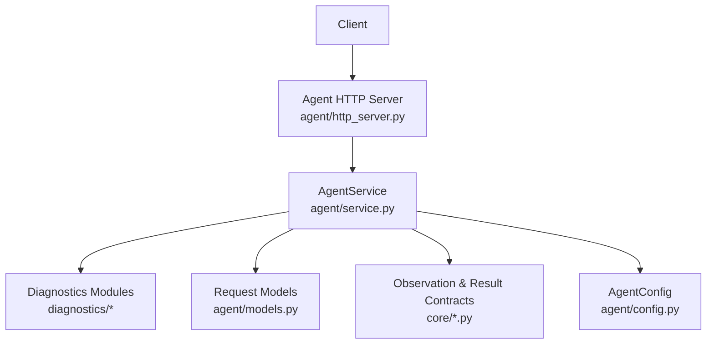
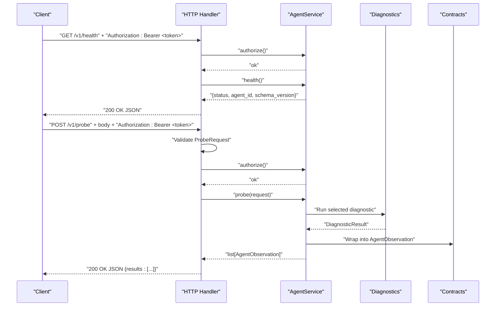
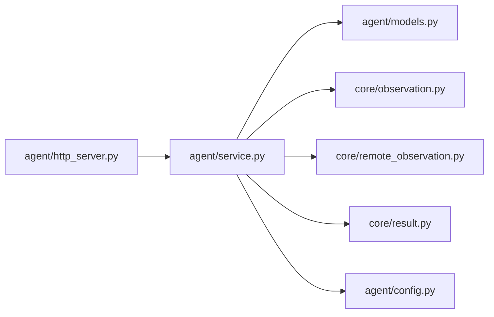

# Agent API

<cite>
**Referenced Files in This Document**
- [http_server.py](file://agent/http_server.py)
- [models.py](file://agent/models.py)
- [service.py](file://agent/service.py)
- [config.py](file://agent/config.py)
- [observation.py](file://core/observation.py)
- [remote_observation.py](file://core/remote_observation.py)
- [result.py](file://core/result.py)
- [test_agent_http.py](file://tests/test_agent_http.py)
</cite>

## Table of Contents
1. [Introduction](#introduction)
2. [Project Structure](#project-structure)
3. [Core Components](#core-components)
4. [Architecture Overview](#architecture-overview)
5. [Detailed Component Analysis](#detailed-component-analysis)
6. [Dependency Analysis](#dependency-analysis)
7. [Performance Considerations](#performance-considerations)
8. [Troubleshooting Guide](#troubleshooting-guide)
9. [Conclusion](#conclusion)
10. [Appendices](#appendices)

## Introduction
This document provides comprehensive API documentation for the NetForge Agent REST API. It covers all available endpoints, authentication, request and response schemas, error handling, and practical usage examples. The Agent exposes a minimal HTTP server that validates requests using Pydantic models and delegates execution to an internal service layer.

## Project Structure
The Agent API is implemented as a small HTTP server with clear separation between transport (HTTP), business logic (service), and data contracts (models). Key files:
- HTTP transport and routing: agent/http_server.py
- Request models and validation: agent/models.py
- Business logic and diagnostics orchestration: agent/service.py
- Configuration and bearer token setup: agent/config.py
- Shared observation and result contracts: core/observation.py, core/remote_observation.py, core/result.py
- Tests demonstrating authentication behavior: tests/test_agent_http.py

**Diagram sources**
- [http_server.py:15-58](file://agent/http_server.py#L15-L58)
- [service.py:33-111](file://agent/service.py#L33-L111)
- [models.py:10-41](file://agent/models.py#L10-L41)
- [observation.py:32-63](file://core/observation.py#L32-L63)
- [remote_observation.py:15-59](file://core/remote_observation.py#L15-L59)
- [result.py:24-47](file://core/result.py#L24-L47)
- [config.py:10-35](file://agent/config.py#L10-L35)

**Section sources**
- [http_server.py:15-58](file://agent/http_server.py#L15-L58)
- [service.py:33-111](file://agent/service.py#L33-L111)
- [models.py:10-41](file://agent/models.py#L10-L41)
- [observation.py:32-63](file://core/observation.py#L32-L63)
- [remote_observation.py:15-59](file://core/remote_observation.py#L15-L59)
- [result.py:24-47](file://core/result.py#L24-L47)
- [config.py:10-35](file://agent/config.py#L10-L35)

## Core Components
- HTTP Handler: Routes GET /v1/health, GET /v1/inventory, POST /v1/probe; enforces Authorization header; returns JSON responses.
- AgentService: Implements authorization via Bearer token, health/inventory retrieval, and probe execution across multiple diagnostic modules.
- ProbeRequest: Validates probe type, target, port, count, max_hops, timeout, and source interface with cross-field constraints.
- Observation Contract: Wraps DiagnosticResult with RemoteObservationContext including provenance, timing, tags, and evidence quality.

**Section sources**
- [http_server.py:15-58](file://agent/http_server.py#L15-L58)
- [service.py:33-111](file://agent/service.py#L33-L111)
- [models.py:10-41](file://agent/models.py#L10-L41)
- [remote_observation.py:15-59](file://core/remote_observation.py#L15-L59)
- [result.py:24-47](file://core/result.py#L24-L47)

## Architecture Overview
The Agent API follows a layered design:
- Transport layer handles HTTP parsing, routing, and JSON serialization.
- Service layer performs authorization, runs diagnostics, and builds observations.
- Contracts define strict schemas for inputs and outputs.

**Diagram sources**
- [http_server.py:15-58](file://agent/http_server.py#L15-L58)
- [service.py:33-111](file://agent/service.py#L33-L111)
- [models.py:10-41](file://agent/models.py#L10-L41)
- [remote_observation.py:15-59](file://core/remote_observation.py#L15-L59)
- [result.py:24-47](file://core/result.py#L24-L47)

## Detailed Component Analysis

### Authentication and Security
- Method: All endpoints require an Authorization header with value "Bearer <token>".
- Token source: Configured via environment variable NETFORGE_AGENT_TOKEN and loaded by AgentConfig.
- Behavior: Missing or invalid token results in 401 Unauthorized.
- Target allowlisting: For targeted probes (icmp, tcp, dns, traceroute), if allowed_targets is configured, only those targets are permitted; otherwise, any target is allowed.

Security considerations:
- Use HTTPS in production to protect tokens in transit.
- Restrict allowed_targets to known hosts to prevent SSRF-like misuse.
- Rotate bearer tokens regularly and store them securely.

**Section sources**
- [service.py:37-40](file://agent/service.py#L37-L40)
- [service.py:65-71](file://agent/service.py#L65-L71)
- [config.py:18-35](file://agent/config.py#L18-L35)
- [test_agent_http.py:12-33](file://tests/test_agent_http.py#L12-L33)

### Endpoints

#### GET /v1/health
- Purpose: Health check and identity exposure.
- Required headers: Authorization: Bearer <token>
- Response schema:
  - status: string ("healthy")
  - agent_id: string
  - schema_version: string ("1.0")
- Example curl:
  - curl -s -H "Authorization: Bearer YOUR_TOKEN" http://localhost:8081/v1/health
- Example Python client:
  - Use urllib or requests with headers {"Authorization": "Bearer YOUR_TOKEN"} and read JSON.

**Section sources**
- [http_server.py:32-33](file://agent/http_server.py#L32-L33)
- [service.py:42-43](file://agent/service.py#L42-L43)
- [test_agent_http.py:12-33](file://tests/test_agent_http.py#L12-L33)

#### GET /v1/inventory
- Purpose: Retrieve host inventory and capabilities.
- Required headers: Authorization: Bearer <token>
- Response schema:
  - agent_id: string
  - hostname: string
  - topology_tags: map<string,string>
  - interfaces: array of objects with name, is_up, speed_mbps, mtu
  - capabilities: array of strings listing supported probe types
- Example curl:
  - curl -s -H "Authorization: Bearer YOUR_TOKEN" http://localhost:8081/v1/inventory
- Example Python client:
  - Send GET with Authorization header and parse JSON.

**Section sources**
- [http_server.py:34-35](file://agent/http_server.py#L34-L35)
- [service.py:45-56](file://agent/service.py#L45-L56)
- [models.py:10-18](file://agent/models.py#L10-L18)

#### POST /v1/probe
- Purpose: Execute a network diagnostic probe on the agent’s host.
- Required headers: Authorization: Bearer <token>, Content-Type: application/json
- Request schema (ProbeRequest):
  - probe_type: enum (icmp, tcp, dns, traceroute, interfaces, route, gateway)
  - target: string (required for icmp, tcp, dns, traceroute)
  - port: integer 1–65535 (required and valid only for tcp)
  - count: integer 1–20 (default 3)
  - max_hops: integer 1–64 (default 20)
  - timeout_seconds: float > 0 and ≤ 30 (default 5)
  - source_interface: string (optional)
- Validation rules:
  - target required for targeted probes
  - port required for tcp; port not allowed for non-tcp
- Response schema:
  - results: array of AgentObservation objects
    - context: RemoteObservationContext
      - schema_version: "1.0"
      - observation_id: uuid string
      - timestamp: UTC-aware datetime
      - agent_id: string
      - hostname: string
      - probe_type: string
      - target: string | null
      - source_ip: string | null
      - source_interface: string | null
      - target_interface: string | null
      - sample_count: integer ≥ 0
      - duration_ms: float ≥ 0
      - topology_tags: map<string,string>
      - raw_evidence: map<string,any>
      - evidence_quality: enum (unknown, single_source, parsed_external, corroborated, verified)
      - confidence: float 0–1 (derived from evidence_quality)
    - result: DiagnosticResult
      - module: string
      - category: string
      - status: enum (healthy, degraded, failed, unknown)
      - severity: enum (info, low, medium, high, critical)
      - summary: string
      - target: string | null
      - metrics: map<string,any>
      - evidence: array<string>
      - warnings: array<string>
      - errors: array<string>
      - metadata: map<string,any>
- Example curl:
  - ICMP ping:
    - curl -s -X POST -H "Authorization: Bearer YOUR_TOKEN" -H "Content-Type: application/json" -d '{"probe_type":"icmp","target":"1.1.1.1","count":3}' http://localhost:8081/v1/probe
  - TCP connect:
    - curl -s -X POST -H "Authorization: Bearer YOUR_TOKEN" -H "Content-Type: application/json" -d '{"probe_type":"tcp","target":"example.com","port":443,"timeout_seconds":5}' http://localhost:8081/v1/probe
  - DNS resolution:
    - curl -s -X POST -H "Authorization: Bearer YOUR_TOKEN" -H "Content-Type: application/json" -d '{"probe_type":"dns","target":"example.com"}' http://localhost:8081/v1/probe
  - Traceroute:
    - curl -s -X POST -H "Authorization: Bearer YOUR_TOKEN" -H "Content-Type: application/json" -d '{"probe_type":"traceroute","target":"1.1.1.1","max_hops":20}' http://localhost:8081/v1/probe
  - Interfaces:
    - curl -s -X POST -H "Authorization: Bearer YOUR_TOKEN" -H "Content-Type: application/json" -d '{"probe_type":"interfaces"}' http://localhost:8081/v1/probe
  - Route table:
    - curl -s -X POST -H "Authorization: Bearer YOUR_TOKEN" -H "Content-Type: application/json" -d '{"probe_type":"route"}' http://localhost:8081/v1/probe
  - Gateway reachability:
    - curl -s -X POST -H "Authorization: Bearer YOUR_TOKEN" -H "Content-Type: application/json" -d '{"probe_type":"gateway","count":3}' http://localhost:8081/v1/probe
- Example Python client:
  - Use requests.post with Authorization header and JSON payload; parse results list.

Error responses:
- 400 Bad Request: Invalid JSON body or validation errors (e.g., missing target for icmp/tcp/dns/traceroute, invalid port, unsupported probe).
- 401 Unauthorized: Missing or invalid Authorization header.
- 404 Not Found: Unknown endpoint.

Common use cases:
- Remote host connectivity checks (ICMP/TCP)
- DNS resolution verification
- Path discovery via traceroute
- Local interface and routing inspection
- Gateway reachability assessment

**Section sources**
- [http_server.py:20-45](file://agent/http_server.py#L20-L45)
- [models.py:10-41](file://agent/models.py#L10-L41)
- [service.py:58-111](file://agent/service.py#L58-L111)
- [observation.py:32-63](file://core/observation.py#L32-L63)
- [remote_observation.py:15-59](file://core/remote_observation.py#L15-L59)
- [result.py:24-47](file://core/result.py#L24-L47)

### ProbeRequest Model Details
- Fields:
  - probe_type: one of icmp, tcp, dns, traceroute, interfaces, route, gateway
  - target: required for icmp, tcp, dns, traceroute
  - port: required for tcp; must be 1–65535; not allowed for non-tcp
  - count: 1–20 (default 3)
  - max_hops: 1–64 (default 20)
  - timeout_seconds: >0 and ≤30 (default 5)
  - source_interface: optional
- Cross-field validations ensure consistent probe configuration.

**Section sources**
- [models.py:10-41](file://agent/models.py#L10-L41)

### Observation Results Format
- Each result is wrapped in an AgentObservation containing:
  - context: RemoteObservationContext with provenance, timing, tags, and evidence quality/confidence
  - result: DiagnosticResult with module/category/status/severity/summary/metrics/evidence/warnings/errors/metadata
- Evidence quality influences confidence automatically.

**Section sources**
- [remote_observation.py:15-59](file://core/remote_observation.py#L15-L59)
- [result.py:24-47](file://core/result.py#L24-L47)
- [service.py:92-111](file://agent/service.py#L92-L111)

## Dependency Analysis
The HTTP handler depends on the service for authorization and business logic. The service composes multiple diagnostic modules and uses shared contracts for results and observations.

**Diagram sources**
- [http_server.py:15-58](file://agent/http_server.py#L15-L58)
- [service.py:33-111](file://agent/service.py#L33-L111)
- [models.py:10-41](file://agent/models.py#L10-L41)
- [observation.py:32-63](file://core/observation.py#L32-L63)
- [remote_observation.py:15-59](file://core/remote_observation.py#L15-L59)
- [result.py:24-47](file://core/result.py#L24-L47)
- [config.py:10-35](file://agent/config.py#L10-L35)

**Section sources**
- [http_server.py:15-58](file://agent/http_server.py#L15-L58)
- [service.py:33-111](file://agent/service.py#L33-L111)

## Performance Considerations
- Probes can be CPU and network intensive; tune count, timeout_seconds, and max_hops appropriately.
- Use source_interface to constrain traffic when needed.
- Batch multiple probes by issuing separate requests; avoid overly large payloads.
- Consider rate limiting at the deployment boundary (reverse proxy or firewall) to protect the agent.

[No sources needed since this section provides general guidance]

## Troubleshooting Guide
Common issues and resolutions:
- 401 Unauthorized: Ensure Authorization header is set to "Bearer <token>" matching the configured token.
- 400 Bad Request: Validate JSON body fields; ensure target is provided for targeted probes and port is only used for tcp.
- 404 Not Found: Check URL path spelling (/v1/health, /v1/inventory, /v1/probe).
- Target not allowed: If allowed_targets is configured, include only permitted targets.
- Network timeouts: Increase timeout_seconds or reduce count/max_hops.

Verification steps:
- Confirm agent is running and listening on expected host/port.
- Test with curl first to isolate client issues.
- Inspect logs on the agent side (logging is suppressed in the handler but can be enabled in your deployment).

**Section sources**
- [http_server.py:20-45](file://agent/http_server.py#L20-L45)
- [service.py:65-71](file://agent/service.py#L65-L71)
- [test_agent_http.py:12-33](file://tests/test_agent_http.py#L12-L33)

## Conclusion
The NetForge Agent API provides a secure, well-validated interface for remote network diagnostics. It supports health checks, inventory retrieval, and a rich set of probes with standardized result formats. By following the authentication requirements and request schemas, clients can reliably perform host, path, and link diagnostics across distributed environments.

[No sources needed since this section summarizes without analyzing specific files]

## Appendices

### Environment Variables
- NETFORGE_AGENT_ID: Unique agent identifier
- NETFORGE_AGENT_TOKEN: Bearer token for authentication
- NETFORGE_ALLOWED_TARGETS: Comma-separated list of allowed targets
- NETFORGE_TAG_*: Topology tags (keys prefixed with NETFORGE_TAG_)

**Section sources**
- [config.py:18-35](file://agent/config.py#L18-L35)

### Supported Probe Types
- icmp: Ping-based reachability
- tcp: TCP connect test
- dns: DNS resolution
- traceroute: Path tracing
- interfaces: Local interface inspection
- route: Routing table inspection
- gateway: Gateway reachability

**Section sources**
- [models.py:10-18](file://agent/models.py#L10-L18)
- [service.py:73-90](file://agent/service.py#L73-L90)