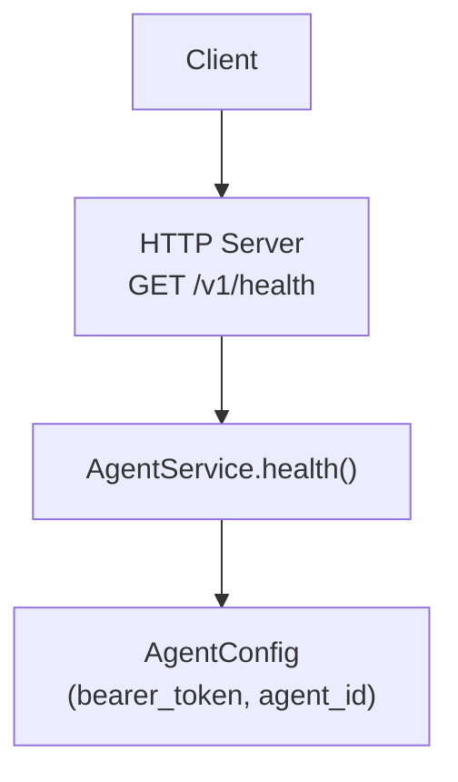
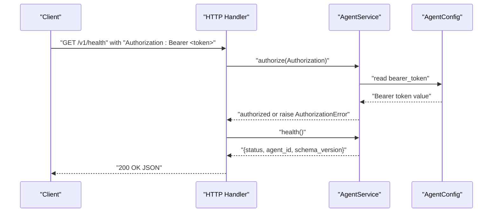
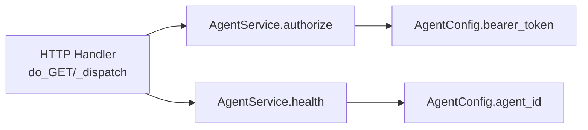

# Health Check Endpoint

<cite>
**Referenced Files in This Document**
- [http_server.py](file://agent/http_server.py)
- [service.py](file://agent/service.py)
- [config.py](file://agent/config.py)
- [test_agent_http.py](file://tests/test_agent_http.py)
</cite>

## Table of Contents
1. [Introduction](#introduction)
2. [Project Structure](#project-structure)
3. [Core Components](#core-components)
4. [Architecture Overview](#architecture-overview)
5. [Detailed Component Analysis](#detailed-component-analysis)
6. [Dependency Analysis](#dependency-analysis)
7. [Performance Considerations](#performance-considerations)
8. [Troubleshooting Guide](#troubleshooting-guide)
9. [Conclusion](#conclusion)
10. [Appendices](#appendices)

## Introduction
This document provides detailed API documentation for the Agent health check endpoint used to monitor agent availability and status. It covers the GET /v1/health endpoint, authentication requirements, response schema, status codes, error responses, and practical usage examples for service discovery, load balancing, and monitoring integrations.

## Project Structure
The health check endpoint is implemented in a minimal HTTP server that delegates business logic to an AgentService. The configuration defines the bearer token required for authorization. Tests validate that the endpoint requires authentication and returns the expected identity information.

**Diagram sources**
- [http_server.py:15-46](file://agent/http_server.py#L15-L46)
- [service.py:33-44](file://agent/service.py#L33-L44)
- [config.py:10-16](file://agent/config.py#L10-L16)

**Section sources**
- [http_server.py:15-46](file://agent/http_server.py#L15-L46)
- [service.py:33-44](file://agent/service.py#L33-L44)
- [config.py:10-16](file://agent/config.py#L10-L16)

## Core Components
- HTTP handler routes GET /v1/health to the service layer after authorization.
- AgentService.health() returns a lightweight status payload including agent identity and schema version.
- Authorization enforces a Bearer token via the Authorization header.
- Configuration supplies the bearer token and agent identity.

Key responsibilities:
- Routing and response formatting are handled by the HTTP handler.
- Business logic (status generation) is isolated in the service.
- Authentication is centralized and validated before any endpoint processing.

**Section sources**
- [http_server.py:15-46](file://agent/http_server.py#L15-L46)
- [service.py:33-44](file://agent/service.py#L33-L44)
- [config.py:10-16](file://agent/config.py#L10-L16)

## Architecture Overview
The request flow for the health check endpoint:

**Diagram sources**
- [http_server.py:15-46](file://agent/http_server.py#L15-L46)
- [service.py:33-44](file://agent/service.py#L33-L44)
- [config.py:10-16](file://agent/config.py#L10-L16)

## Detailed Component Analysis

### Endpoint Specification: GET /v1/health
- Purpose: Monitor agent availability and return minimal identity metadata for service discovery and readiness checks.
- Method: GET
- URL: /v1/health
- Required headers:
  - Authorization: Bearer <token>
    - Token is configured via environment variables and enforced by the service.
- Success response:
  - Status code: 200 OK
  - Content-Type: application/json
  - Body fields:
    - status: string — always "healthy" when reachable
    - agent_id: string — unique identifier of the agent instance
    - schema_version: string — API schema version (e.g., "1.0")
- Error responses:
  - 401 Unauthorized: Missing or invalid Authorization header/token
  - 404 Not Found: Unknown endpoint (for paths other than supported ones)

Notes:
- The endpoint performs no network I/O beyond reading configuration; it is fast and suitable for frequent polling.
- The response includes agent identity to support service discovery and routing decisions.

**Section sources**
- [http_server.py:15-46](file://agent/http_server.py#L15-L46)
- [service.py:33-44](file://agent/service.py#L33-L44)
- [config.py:10-16](file://agent/config.py#L10-L16)
- [test_agent_http.py:12-32](file://tests/test_agent_http.py#L12-L32)

### Authentication Model
- Mechanism: Bearer token in the Authorization header.
- Validation: Compares incoming Authorization header against the configured bearer token using constant-time comparison to mitigate timing attacks.
- Failure behavior: Raises an authorization error which the HTTP handler translates to a 401 response with an error message.

Environment configuration:
- NETFORGE_AGENT_TOKEN: Sets the bearer token used for authorization.
- NETFORGE_AGENT_ID: Sets the agent identity returned in the health response.

**Section sources**
- [service.py:33-44](file://agent/service.py#L33-L44)
- [config.py:10-16](file://agent/config.py#L10-L16)
- [test_agent_http.py:12-32](file://tests/test_agent_http.py#L12-L32)

### Response Schema
- status: string — indicates agent health ("healthy")
- agent_id: string — identifies the agent instance
- schema_version: string — indicates API schema version

These fields enable consumers to verify liveness and identify the specific agent instance for routing or tagging.

**Section sources**
- [service.py:33-44](file://agent/service.py#L33-L44)

### Practical Usage Examples

- cURL
  - Successful call:
    - curl -H "Authorization: Bearer <token>" http://<host>:<port>/v1/health
  - Expected result: 200 OK with JSON body containing status, agent_id, and schema_version.
  - Without Authorization:
    - curl http://<host>:<port>/v1/health
  - Expected result: 401 Unauthorized.

- Python client (requests)
  - Import requests
  - Set headers = {"Authorization": "Bearer <token>"}
  - Call requests.get("http://<host>:<port>/v1/health", headers=headers)
  - Handle 200 OK and parse JSON to read status, agent_id, schema_version
  - Handle 401 Unauthorized if token is missing or incorrect

- Python client (urllib)
  - Build Request with headers={"Authorization": "Bearer <token>"}
  - Use urllib.request.urlopen to fetch and read JSON
  - Validate status code and parse fields

Note: Replace <token>, <host>, and <port> with your deployment values.

[No sources needed since this section provides general guidance]

### Integration Patterns

- Service Discovery
  - Poll GET /v1/health at regular intervals to determine agent availability.
  - Use agent_id from the response to tag metrics, logs, and routing tables.

- Load Balancing
  - Include agent_id in upstream selection to maintain affinity or distribute traffic across multiple agents.
  - Combine with inventory endpoints (if available) for richer topology awareness.

- Monitoring and Alerting
  - Track latency and success rate of health checks per agent.
  - Alert on repeated 401 errors indicating misconfiguration or unauthorized access attempts.
  - Correlate agent_id with infrastructure labels for dashboards.

[No sources needed since this section provides general guidance]

## Dependency Analysis
The health check endpoint depends on:
- HTTP handler routing and response serialization
- Service authorization and health logic
- Configuration for bearer token and agent identity

**Diagram sources**
- [http_server.py:15-46](file://agent/http_server.py#L15-L46)
- [service.py:33-44](file://agent/service.py#L33-L44)
- [config.py:10-16](file://agent/config.py#L10-L16)

**Section sources**
- [http_server.py:15-46](file://agent/http_server.py#L15-L46)
- [service.py:33-44](file://agent/service.py#L33-L44)
- [config.py:10-16](file://agent/config.py#L10-L16)

## Performance Considerations
- The health endpoint performs minimal work: reads configuration and returns a small JSON object.
- Suitable for high-frequency polling (e.g., every few seconds).
- No external network calls or heavy computations; negligible CPU and memory overhead.
- Ensure clients implement backoff and timeouts to avoid overwhelming the agent.

[No sources needed since this section provides general guidance]

## Troubleshooting Guide
Common issues and resolutions:
- 401 Unauthorized
  - Cause: Missing or incorrect Authorization header.
  - Resolution: Ensure the Authorization header contains a valid Bearer token matching the configured token.
  - Verification: Confirm environment variable NETFORGE_AGENT_TOKEN is set correctly.

- 404 Not Found
  - Cause: Requested path does not match supported endpoints.
  - Resolution: Verify the URL path is exactly /v1/health.

- Unexpected response content type
  - Cause: Client not expecting JSON.
  - Resolution: Ensure client parses application/json responses.

- High latency or timeouts
  - Cause: Network issues or aggressive polling.
  - Resolution: Adjust poll interval and timeouts; check network connectivity between client and agent.

Validation references:
- Tests assert that unauthenticated requests receive 401 and authenticated requests succeed with expected agent identity.

**Section sources**
- [test_agent_http.py:12-32](file://tests/test_agent_http.py#L12-L32)
- [http_server.py:15-46](file://agent/http_server.py#L15-L46)
- [service.py:33-44](file://agent/service.py#L33-L44)
- [config.py:10-16](file://agent/config.py#L10-L16)

## Conclusion
The GET /v1/health endpoint provides a lightweight, authenticated mechanism to verify agent availability and retrieve minimal identity metadata. It is ideal for service discovery, load balancing, and monitoring integrations. Properly configure the bearer token and include the Authorization header to ensure successful requests.

[No sources needed since this section summarizes without analyzing specific files]

## Appendices

### Endpoints Summary
- GET /v1/health
  - Requires: Authorization: Bearer <token>
  - Success: 200 OK with {status, agent_id, schema_version}
  - Errors: 401 Unauthorized, 404 Not Found

[No sources needed since this section provides general guidance]