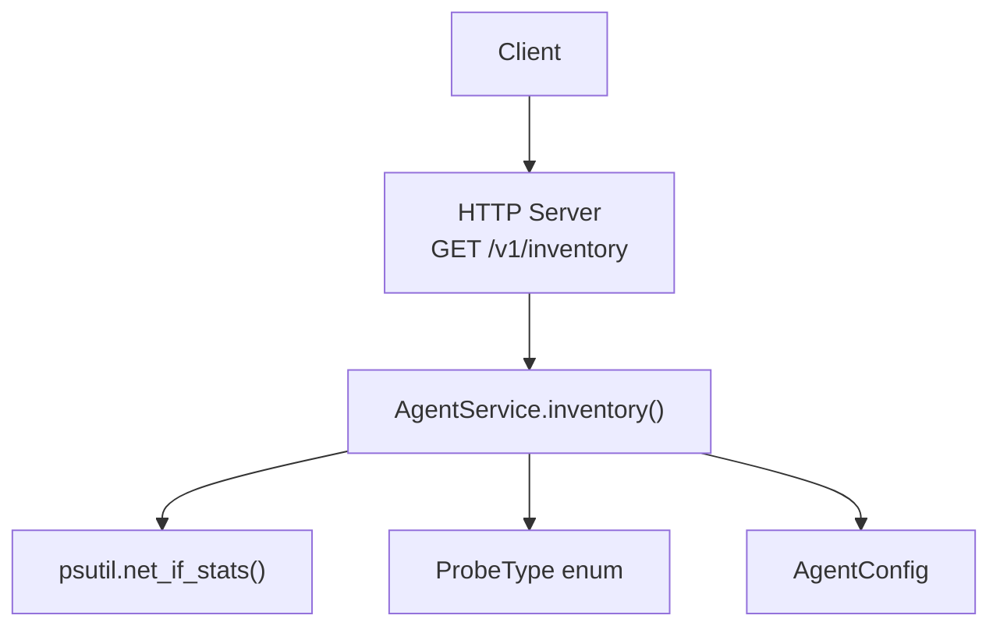
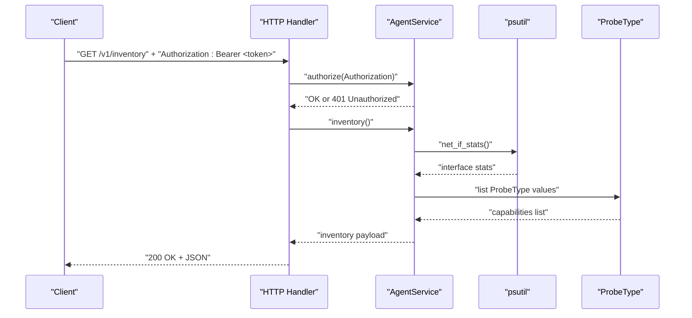
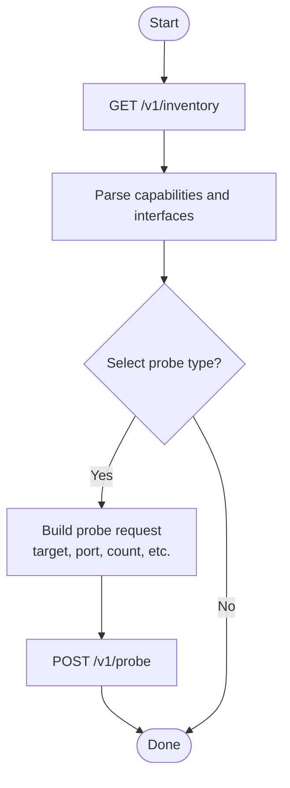
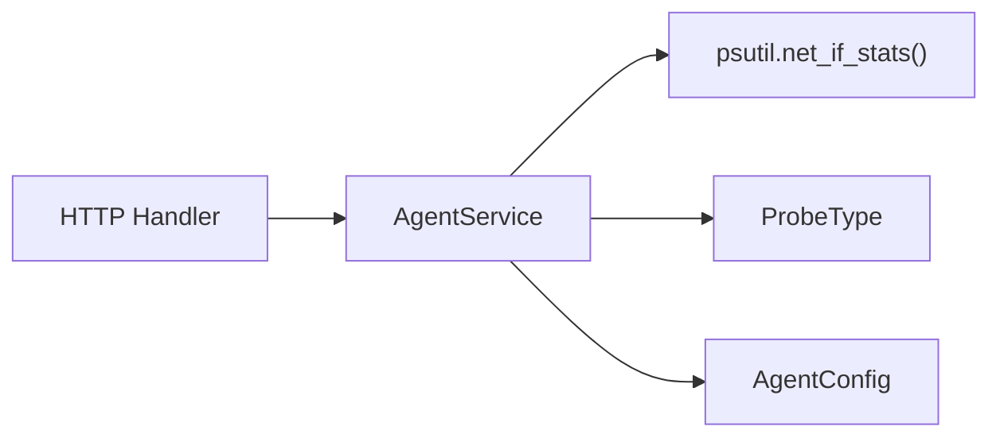

# Inventory Endpoint

<cite>
**Referenced Files in This Document**
- [agent/http_server.py](file://agent/http_server.py)
- [agent/service.py](file://agent/service.py)
- [agent/models.py](file://agent/models.py)
- [agent/config.py](file://agent/config.py)
- [core/observation.py](file://core/observation.py)
- [tests/test_agent_http.py](file://tests/test_agent_http.py)
</cite>

## Table of Contents
1. [Introduction](#introduction)
2. [Project Structure](#project-structure)
3. [Core Components](#core-components)
4. [Architecture Overview](#architecture-overview)
5. [Detailed Component Analysis](#detailed-component-analysis)
6. [Dependency Analysis](#dependency-analysis)
7. [Performance Considerations](#performance-considerations)
8. [Troubleshooting Guide](#troubleshooting-guide)
9. [Conclusion](#conclusion)
10. [Appendices](#appendices)

## Introduction
This document provides comprehensive API documentation for the Agent inventory endpoint: GET /v1/inventory. The endpoint returns available diagnostic capabilities and system information, enabling clients to perform capability discovery and dynamic probe selection before issuing diagnostic requests. It also documents authentication requirements, response schema, error handling scenarios, and practical usage examples with curl and Python.

## Project Structure
The inventory endpoint is implemented as part of a minimal HTTP server that routes requests to an agent service. The service gathers system information and enumerates supported probes.

**Diagram sources**
- [agent/http_server.py:15-45](file://agent/http_server.py#L15-L45)
- [agent/service.py:45-56](file://agent/service.py#L45-L56)
- [agent/models.py:10-18](file://agent/models.py#L10-L18)
- [agent/config.py:10-16](file://agent/config.py#L10-L16)

**Section sources**
- [agent/http_server.py:15-45](file://agent/http_server.py#L15-L45)
- [agent/service.py:45-56](file://agent/service.py#L45-L56)
- [agent/models.py:10-18](file://agent/models.py#L10-L18)
- [agent/config.py:10-16](file://agent/config.py#L10-L16)

## Core Components
- HTTP transport: A lightweight handler dispatches GET /v1/inventory to the agent service and returns JSON responses.
- Agent service: Implements authorization, health checks, inventory collection, and probe execution.
- Models: Defines supported probe types and request validation rules.
- Configuration: Provides agent identity, bearer token, hostname, allowed targets, and topology tags.

Key responsibilities:
- Authorization via Bearer token header.
- Inventory payload includes agent identity, hostname, topology tags, interfaces, and capabilities (supported probes).
- Error handling for unauthorized access and malformed requests.

**Section sources**
- [agent/http_server.py:15-45](file://agent/http_server.py#L15-L45)
- [agent/service.py:33-56](file://agent/service.py#L33-L56)
- [agent/models.py:10-18](file://agent/models.py#L10-L18)
- [agent/config.py:10-16](file://agent/config.py#L10-L16)

## Architecture Overview
The inventory flow authenticates the client, collects system metrics, enumerates supported probes, and returns a structured JSON object.

**Diagram sources**
- [agent/http_server.py:17-45](file://agent/http_server.py#L17-L45)
- [agent/service.py:37-56](file://agent/service.py#L37-L56)
- [agent/models.py:10-18](file://agent/models.py#L10-L18)

## Detailed Component Analysis

### Endpoint Specification
- Method: GET
- URL: /v1/inventory
- Required headers:
  - Authorization: Bearer <token>
- Response:
  - 200 OK: JSON object with agent identity, hostname, topology tags, interfaces, and capabilities
  - 401 Unauthorized: Missing or invalid Authorization header
  - 404 Not Found: Unknown endpoint

Authentication:
- The handler calls service.authorize with the Authorization header value.
- Authorization must match the configured bearer token; otherwise, a 401 response is returned.

Response schema:
- agent_id: string — unique identifier for the agent instance
- hostname: string — hostname of the agent machine
- topology_tags: object — key-value tags describing network topology context
- interfaces: array — list of interface descriptors:
  - name: string
  - is_up: boolean
  - speed_mbps: integer
  - mtu: integer
- capabilities: array of strings — supported probe types (e.g., icmp, tcp, dns, traceroute, interfaces, route, gateway)

Example response fields are derived from:
- Agent configuration (agent_id, hostname, topology_tags)
- System interface statistics (interfaces)
- Enumerated probe types (capabilities)

**Section sources**
- [agent/http_server.py:17-45](file://agent/http_server.py#L17-L45)
- [agent/service.py:37-56](file://agent/service.py#L37-L56)
- [agent/models.py:10-18](file://agent/models.py#L10-L18)
- [agent/config.py:10-16](file://agent/config.py#L10-L16)

### Practical Usage Examples

curl:
- Retrieve inventory with a valid bearer token:
  - curl -H "Authorization: Bearer <your-token>" http://<agent-host>:8081/v1/inventory
- Expected result: 200 OK with JSON payload containing agent_id, hostname, topology_tags, interfaces, and capabilities

Python client (using urllib):
- Send a GET request with Authorization header and parse JSON response
- Handle 401 Unauthorized if the token is missing or incorrect

Note: Replace placeholders such as <your-token>, <agent-host>, and port accordingly.

**Section sources**
- [agent/http_server.py:17-45](file://agent/http_server.py#L17-L45)
- [tests/test_agent_http.py:12-33](file://tests/test_agent_http.py#L12-L33)

### Capability Discovery and Dynamic Probe Selection
Clients can use the inventory endpoint to:
- Discover supported probes via the capabilities field
- Inspect local interfaces to select appropriate source_interface for targeted probes
- Use topology_tags to scope diagnostics by environment or role

Dynamic selection workflow:
1. Call GET /v1/inventory to obtain capabilities and interfaces
2. Choose a probe type from capabilities
3. If the probe requires a target (e.g., icmp, tcp, dns, traceroute), ensure it is allowed by agent configuration
4. Optionally set source_interface based on discovered interfaces
5. Issue POST /v1/probe with selected parameters

[No sources needed since this diagram shows conceptual workflow, not actual code structure]

**Section sources**
- [agent/service.py:45-56](file://agent/service.py#L45-L56)
- [agent/models.py:10-18](file://agent/models.py#L10-L18)

### Authentication Requirements
- Header: Authorization: Bearer <token>
- Token validation:
  - The handler passes the Authorization header to service.authorize
  - The service compares the provided token against the configured bearer token using constant-time comparison
  - If missing or mismatched, a 401 Unauthorized response is returned

Environment setup:
- NETFORGE_AGENT_ID and NETFORGE_AGENT_TOKEN must be set for the agent to start
- Optional: NETFORGE_ALLOWED_TARGETS and NETFORGE_TAG_* for targeting and tagging

**Section sources**
- [agent/http_server.py:29-45](file://agent/http_server.py#L29-L45)
- [agent/service.py:37-40](file://agent/service.py#L37-L40)
- [agent/config.py:18-34](file://agent/config.py#L18-L34)
- [tests/test_agent_http.py:12-33](file://tests/test_agent_http.py#L12-L33)

### Error Handling Scenarios
- 401 Unauthorized:
  - Missing or invalid Authorization header
  - Returned when service.authorize fails
- 404 Not Found:
  - Request path does not match any known endpoint
- 400 Bad Request:
  - For other endpoints, malformed request bodies or invalid parameters
  - For inventory, typically not applicable unless underlying system errors occur

Error payloads include an error message string.

**Section sources**
- [agent/http_server.py:29-45](file://agent/http_server.py#L29-L45)
- [agent/service.py:37-40](file://agent/service.py#L37-L40)

## Dependency Analysis
The inventory endpoint depends on:
- HTTP handler routing and JSON serialization
- Agent service for authorization and data gathering
- psutil for interface statistics
- ProbeType enum for capabilities enumeration
- AgentConfig for identity and tags

**Diagram sources**
- [agent/http_server.py:15-45](file://agent/http_server.py#L15-L45)
- [agent/service.py:45-56](file://agent/service.py#L45-L56)
- [agent/models.py:10-18](file://agent/models.py#L10-L18)
- [agent/config.py:10-16](file://agent/config.py#L10-L16)

**Section sources**
- [agent/http_server.py:15-45](file://agent/http_server.py#L15-L45)
- [agent/service.py:45-56](file://agent/service.py#L45-L56)
- [agent/models.py:10-18](file://agent/models.py#L10-L18)
- [agent/config.py:10-16](file://agent/config.py#L10-L16)

## Performance Considerations
- The inventory call reads interface statistics once per request; avoid excessive polling to reduce overhead.
- Capabilities enumeration is lightweight (enum iteration).
- Ensure agents are deployed close to monitored networks to minimize latency for subsequent probe requests.

[No sources needed since this section provides general guidance]

## Troubleshooting Guide
Common issues and resolutions:
- 401 Unauthorized:
  - Verify Authorization header format: "Bearer <token>"
  - Confirm NETFORGE_AGENT_TOKEN matches the configured token
- 404 Not Found:
  - Check URL path spelling and version prefix (/v1/inventory)
- Unexpected empty or partial interfaces:
  - Ensure the agent has sufficient permissions to read network interface stats
- Capability mismatch:
  - Confirm the client uses only probe types listed in capabilities

Debugging tips:
- Log the incoming Authorization header and compare with configured token
- Validate environment variables for agent identity and token
- Test with curl first to isolate client-side issues

**Section sources**
- [agent/http_server.py:29-45](file://agent/http_server.py#L29-L45)
- [agent/service.py:37-40](file://agent/service.py#L37-L40)
- [agent/config.py:18-34](file://agent/config.py#L18-L34)
- [tests/test_agent_http.py:12-33](file://tests/test_agent_http.py#L12-L33)

## Conclusion
The GET /v1/inventory endpoint provides a secure, standardized way to discover agent capabilities and system information. Clients should authenticate with a Bearer token, parse the capabilities and interfaces from the response, and dynamically select probes accordingly. Proper error handling ensures robust interactions even under misconfiguration or network constraints.

[No sources needed since this section summarizes without analyzing specific files]

## Appendices

### Supported Probes (Capabilities)
The capabilities array lists all supported probe types. These correspond to the ProbeType enum values and indicate which diagnostics the agent can execute.

- icmp
- tcp
- dns
- traceroute
- interfaces
- route
- gateway

Use these values when constructing POST /v1/probe requests.

**Section sources**
- [agent/models.py:10-18](file://agent/models.py#L10-L18)
- [agent/service.py:45-56](file://agent/service.py#L45-L56)

### Environment Variables
- NETFORGE_AGENT_ID: Unique agent identifier
- NETFORGE_AGENT_TOKEN: Bearer token for authentication
- NETFORGE_ALLOWED_TARGETS: Comma-separated list of allowed targets for targeted probes
- NETFORGE_TAG_<key>: Topology tags used in inventory and observations

**Section sources**
- [agent/config.py:18-34](file://agent/config.py#L18-L34)