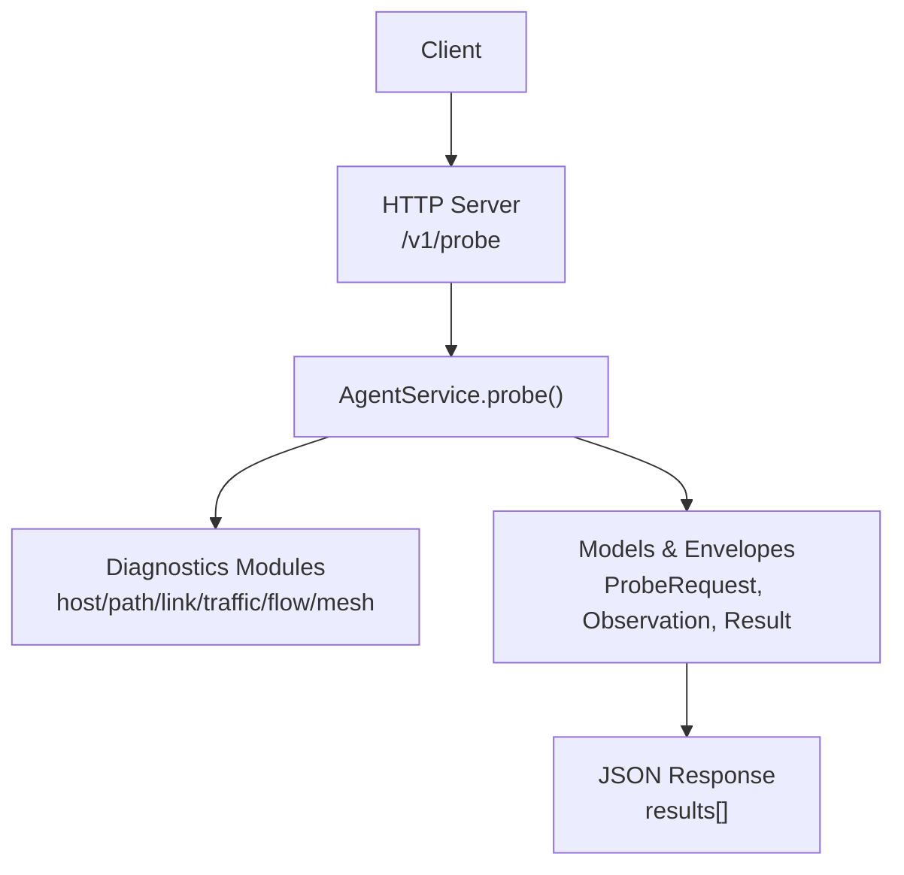
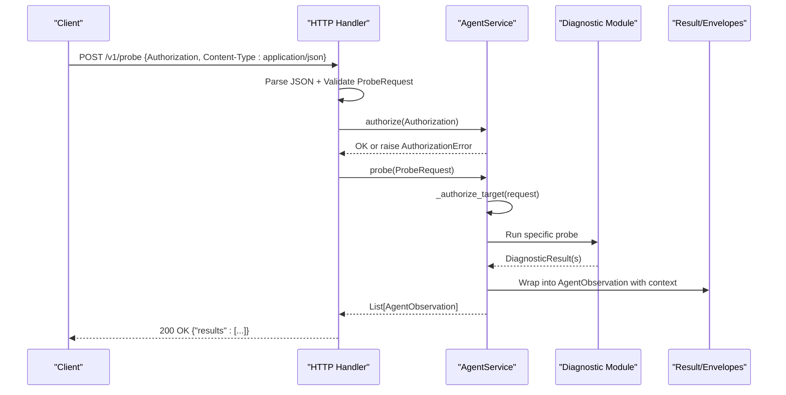
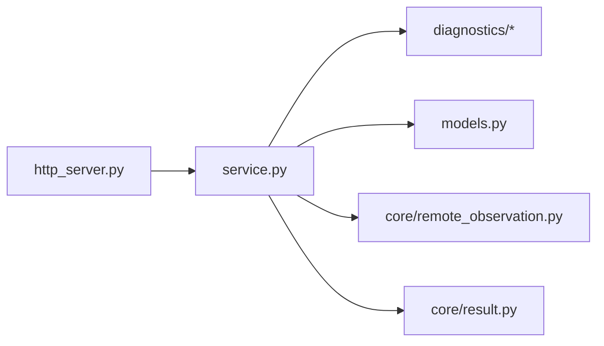

# Probe Execution Endpoint

<cite>
**Referenced Files in This Document**
- [http_server.py](file://agent/http_server.py)
- [models.py](file://agent/models.py)
- [service.py](file://agent/service.py)
- [observation.py](file://core/observation.py)
- [remote_observation.py](file://core/remote_observation.py)
- [result.py](file://core/result.py)
- [packet_loss.py](file://diagnostics/host/packet_loss.py)
- [tcp_udp.py](file://diagnostics/host/tcp_udp.py)
- [dns.py](file://diagnostics/host/dns.py)
- [traceroute.py](file://diagnostics/path/traceroute.py)
- [interface.py](file://diagnostics/host/interface.py)
- [config.py](file://agent/config.py)
</cite>

## Table of Contents
1. [Introduction](#introduction)
2. [Project Structure](#project-structure)
3. [Core Components](#core-components)
4. [Architecture Overview](#architecture-overview)
5. [Detailed Component Analysis](#detailed-component-analysis)
6. [Dependency Analysis](#dependency-analysis)
7. [Performance Considerations](#performance-considerations)
8. [Troubleshooting Guide](#troubleshooting-guide)
9. [Conclusion](#conclusion)

## Introduction
This document provides detailed API documentation for the Agent probe execution endpoint used to run remote network diagnostics. It covers the POST /v1/probe endpoint, required headers, request and response schemas, supported probe types, result interpretation, error handling, security considerations, timeout behavior, and troubleshooting guidance.

## Project Structure
The agent exposes a minimal HTTP server that validates requests, authorizes callers, executes diagnostics via an internal service, and returns standardized observations. The core data models define the request schema, observation envelope, and diagnostic results.

**Diagram sources**
- [http_server.py:15-46](file://agent/http_server.py#L15-L46)
- [service.py:58-90](file://agent/service.py#L58-L90)
- [remote_observation.py:15-59](file://core/remote_observation.py#L15-L59)
- [result.py:24-47](file://core/result.py#L24-L47)

**Section sources**
- [http_server.py:15-46](file://agent/http_server.py#L15-L46)
- [service.py:58-90](file://agent/service.py#L58-L90)

## Core Components
- HTTP transport: Validates JSON body, dispatches to service, handles errors, and serializes responses.
- Request model: Validates probe type and parameters (target, port, count, max_hops, timeout_seconds, source_interface).
- Service: Authorizes requests, enforces allowed targets, runs diagnostics, measures duration, and wraps results into observations.
- Observation envelope: Carries context (agent_id, hostname, probe_type, target, timing, tags), evidence quality, and confidence.
- Diagnostic results: Standardized status, severity, metrics, evidence, warnings, errors, and metadata.

**Section sources**
- [http_server.py:15-46](file://agent/http_server.py#L15-L46)
- [models.py:10-40](file://agent/models.py#L10-L40)
- [service.py:33-111](file://agent/service.py#L33-L111)
- [remote_observation.py:15-59](file://core/remote_observation.py#L15-L59)
- [result.py:9-47](file://core/result.py#L9-L47)

## Architecture Overview
The POST /v1/probe flow:
1. Client sends a POST with Authorization header and JSON body.
2. Server parses JSON, validates against ProbeRequest, and calls AgentService.authorize().
3. Service checks allowed targets for targeted probes.
4. Service invokes the appropriate diagnostic module based on probe_type.
5. Results are wrapped into AgentObservation with RemoteObservationContext and returned as a list under results[].

**Diagram sources**
- [http_server.py:20-46](file://agent/http_server.py#L20-L46)
- [service.py:58-111](file://agent/service.py#L58-L111)
- [remote_observation.py:15-59](file://core/remote_observation.py#L15-L59)
- [result.py:24-47](file://core/result.py#L24-L47)

## Detailed Component Analysis

### Endpoint Specification
- Method: POST
- URL: /v1/probe
- Required headers:
  - Authorization: Bearer token (configured via environment; see config)
  - Content-Type: application/json
- Request body: ProbeRequest model fields:
  - probe_type: one of icmp, tcp, dns, traceroute, interfaces, route, gateway
  - target: string (required for icmp, tcp, dns, traceroute)
  - port: integer 1–65535 (required for tcp; invalid for non-tcp)
  - count: integer 1–20 (default 3)
  - max_hops: integer 1–64 (default 20)
  - timeout_seconds: float > 0 and ≤ 30 (default 5)
  - source_interface: string (optional)
- Success response: 200 OK
  - Body: {"results": [AgentObservation, ...]}
- Error responses:
  - 400 Bad Request: Invalid JSON, validation errors, disallowed target
  - 401 Unauthorized: Missing or invalid Authorization header
  - 404 Not Found: Unknown endpoint

**Section sources**
- [http_server.py:20-46](file://agent/http_server.py#L20-L46)
- [models.py:10-40](file://agent/models.py#L10-L40)
- [service.py:37-71](file://agent/service.py#L37-L71)

### Request Model: ProbeRequest
- probe_type: Enum of supported probes
- Validation rules:
  - Targeted probes require target
  - TCP requires port; port only valid for TCP
  - Bounds enforced for count, max_hops, timeout_seconds

**Section sources**
- [models.py:10-40](file://agent/models.py#L10-L40)

### Supported Probes and Examples

#### ICMP (host reachability)
- Purpose: Measure packet loss and reachability to a host using ICMP echo.
- Key parameters:
  - probe_type: icmp
  - target: IP or hostname
  - count: number of echo requests
- Expected result highlights:
  - status: healthy/degraded/failed/unknown
  - metrics: packet_loss_percent, packets_sent
  - evidence: summary of observed loss
  - metadata: raw_output may be included

Example request shape:
- { "probe_type": "icmp", "target": "1.1.1.1", "count": 5 }

Expected result fields:
- context: agent_id, hostname, probe_type, target, sample_count, duration_ms, topology_tags, evidence_quality, confidence
- result: module, category, status, severity, summary, target, metrics, evidence, warnings, errors, metadata

**Section sources**
- [service.py:73-89](file://agent/service.py#L73-L89)
- [packet_loss.py:14-77](file://diagnostics/host/packet_loss.py#L14-L77)
- [remote_observation.py:15-59](file://core/remote_observation.py#L15-L59)
- [result.py:24-47](file://core/result.py#L24-L47)

#### TCP (port reachability)
- Purpose: Test TCP connectivity to a specific port on a host.
- Key parameters:
  - probe_type: tcp
  - target: IP or hostname
  - port: required
  - timeout_seconds: connection timeout
- Expected result highlights:
  - status: healthy if reachable, failed otherwise
  - metrics: protocol, port, latency_ms (on success)
  - evidence: handshake success/failure details

Example request shape:
- { "probe_type": "tcp", "target": "example.com", "port": 443, "timeout_seconds": 5 }

**Section sources**
- [service.py:73-89](file://agent/service.py#L73-L89)
- [tcp_udp.py:16-86](file://diagnostics/host/tcp_udp.py#L16-L86)
- [result.py:24-47](file://core/result.py#L24-L47)

#### DNS (name resolution)
- Purpose: Resolve a hostname and report resolution time and addresses.
- Key parameters:
  - probe_type: dns
  - target: hostname
- Expected result highlights:
  - status: healthy if resolved, failed otherwise
  - metrics: resolution_time_ms, address_count, addresses
  - evidence: successful resolution note

Example request shape:
- { "probe_type": "dns", "target": "google.com" }

**Section sources**
- [service.py:73-89](file://agent/service.py#L73-L89)
- [dns.py:92-147](file://diagnostics/host/dns.py#L92-L147)
- [result.py:24-47](file://core/result.py#L24-L47)

#### Traceroute (path discovery)
- Purpose: Discover path hops toward a target and compute per-hop metrics.
- Key parameters:
  - probe_type: traceroute
  - target: IP or hostname
  - max_hops: maximum hops to trace
- Expected result highlights:
  - status: healthy/degraded/failed/unknown
  - metrics: hop_count, hops[], path_fingerprint, high_loss_hops, max_hop_loss_percent
  - evidence: discovered hop count and fingerprint

Example request shape:
- { "probe_type": "traceroute", "target": "1.1.1.1", "max_hops": 30 }

**Section sources**
- [service.py:73-89](file://agent/service.py#L73-L89)
- [traceroute.py:138-213](file://diagnostics/path/traceroute.py#L138-L213)
- [result.py:24-47](file://core/result.py#L24-L47)

#### Interfaces (host networking state)
- Purpose: Inspect local network interfaces and their operational state.
- Key parameters:
  - probe_type: interfaces
- Expected result highlights:
  - Returns multiple results (one per interface)
  - metrics: is_up, speed_mbps, mtu, ipv4[], ipv6[], mac
  - status: healthy if any active interface exists; failed if none

Example request shape:
- { "probe_type": "interfaces" }

**Section sources**
- [service.py:73-89](file://agent/service.py#L73-L89)
- [interface.py:16-109](file://diagnostics/host/interface.py#L16-L109)
- [result.py:24-47](file://core/result.py#L24-L47)

#### Route and Gateway (routing checks)
- Purpose: Inspect routing table and check gateway reachability.
- Key parameters:
  - probe_type: route or gateway
  - For gateway: count parameter controls probes
- Expected result highlights:
  - route: routing table inspection result
  - gateway: reachability status and metrics

Example request shapes:
- { "probe_type": "route" }
- { "probe_type": "gateway", "count": 3 }

**Section sources**
- [service.py:73-89](file://agent/service.py#L73-L89)

Note: While the current agent supports icmp, tcp, dns, traceroute, interfaces, route, and gateway, the framework also includes modules for link, traffic, flow, and mesh diagnostics elsewhere in the codebase. These can be exposed by extending the service’s probe dispatcher similarly to existing probes.

### Observation Result Format
Each item in results[] is an AgentObservation containing:
- context: RemoteObservationContext
  - schema_version, observation_id, timestamp (UTC-aware), agent_id, hostname, probe_type, target, source_interface, sample_count, duration_ms, topology_tags, raw_evidence, evidence_quality, confidence
- result: DiagnosticResult
  - module, category, status, severity, summary, target, metrics, evidence, warnings, errors, metadata

Evidence quality and confidence:
- EvidenceQuality values: unknown, single_source, parsed_external, corroborated, verified
- Confidence is derived from evidence_quality unless explicitly set and validated

**Section sources**
- [remote_observation.py:15-59](file://core/remote_observation.py#L15-L59)
- [observation.py:13-62](file://core/observation.py#L13-L62)
- [result.py:24-47](file://core/result.py#L24-L47)
- [service.py:92-111](file://agent/service.py#L92-L111)

### Status Codes and Errors
- 200 OK: Successful probe execution with results array
- 400 Bad Request:
  - Invalid JSON body
  - Validation errors (e.g., missing target for targeted probes, invalid port usage)
  - Disallowed target (if configured)
- 401 Unauthorized:
  - Missing or invalid Authorization header
- 404 Not Found:
  - Unknown endpoint

Error payloads include an error message describing the issue.

**Section sources**
- [http_server.py:20-46](file://agent/http_server.py#L20-L46)
- [models.py:23-40](file://agent/models.py#L23-L40)
- [service.py:37-71](file://agent/service.py#L37-L71)

### Security Considerations
- Authentication: Requires Authorization: Bearer <token>. Token is compared securely using constant-time comparison.
- Allowed targets: Optional allowlist enforced for targeted probes; misconfiguration will reject unauthorized targets.
- Transport: Use HTTPS in production; this demo uses plain HTTP on configurable host/port.
- Rate limiting: Not implemented in the agent; consider placing a reverse proxy or API gateway in front to enforce rate limits.

**Section sources**
- [service.py:37-40](file://agent/service.py#L37-L40)
- [service.py:65-71](file://agent/service.py#L65-L71)
- [config.py:10-34](file://agent/config.py#L10-L34)

### Timeout Handling
- Request-level timeout_seconds applies to TCP probes and influences overall operation time.
- Traceroute uses system tools with internal timeouts; long-running operations may exceed client timeouts if not tuned.
- Duration measurement: Each observation includes duration_ms computed around probe execution.

**Section sources**
- [service.py:58-63](file://agent/service.py#L58-L63)
- [tcp_udp.py:16-86](file://diagnostics/host/tcp_udp.py#L16-L86)
- [traceroute.py:115-135](file://diagnostics/path/traceroute.py#L115-L135)

### Result Interpretation
- status: healthy, degraded, failed, unknown
- severity: info, low, medium, high, critical
- metrics: probe-specific measurements (e.g., packet_loss_percent, latency_ms, hop_count)
- evidence: human-readable notes about what was observed
- warnings/errors: additional context for issues encountered
- confidence: derived from evidence_quality; higher values indicate more reliable evidence

**Section sources**
- [result.py:9-47](file://core/result.py#L9-L47)
- [observation.py:13-62](file://core/observation.py#L13-L62)
- [service.py:92-111](file://agent/service.py#L92-L111)

## Dependency Analysis
The endpoint depends on:
- HTTP handler for request parsing and dispatch
- Service for authorization, target allowlisting, and probe orchestration
- Diagnostic modules for actual network tests
- Models for validation and standardized envelopes

**Diagram sources**
- [http_server.py:15-46](file://agent/http_server.py#L15-L46)
- [service.py:58-111](file://agent/service.py#L58-L111)
- [models.py:10-40](file://agent/models.py#L10-L40)
- [remote_observation.py:15-59](file://core/remote_observation.py#L15-L59)
- [result.py:24-47](file://core/result.py#L24-L47)

**Section sources**
- [http_server.py:15-46](file://agent/http_server.py#L15-L46)
- [service.py:58-111](file://agent/service.py#L58-L111)

## Performance Considerations
- Keep count and max_hops reasonable to avoid long-running probes.
- Use timeout_seconds to bound TCP operations.
- Batch multiple probes at the controller level rather than issuing many concurrent requests to the agent.
- Observe duration_ms in results to monitor performance and detect slow endpoints.

[No sources needed since this section provides general guidance]

## Troubleshooting Guide
Common issues and resolutions:
- 401 Unauthorized: Ensure Authorization header matches the configured bearer token. Verify NETFORGE_AGENT_TOKEN is set correctly.
- 400 Bad Request:
  - Missing target for targeted probes: Provide target for icmp, tcp, dns, traceroute.
  - Invalid port usage: Only use port with tcp probes; ensure range 1–65535.
  - Disallowed target: Configure NETFORGE_ALLOWED_TARGETS to include the requested target.
- Failed probes:
  - Check result.status and result.errors for specifics.
  - For DNS failures, verify name resolution and DNS servers.
  - For TCP failures, confirm firewall rules and service availability.
  - For traceroute, inspect hops and loss percentages; adjust max_hops if needed.
- Timeouts:
  - Increase timeout_seconds for slow networks.
  - Reduce count or max_hops for faster feedback.

**Section sources**
- [service.py:37-71](file://agent/service.py#L37-L71)
- [models.py:23-40](file://agent/models.py#L23-L40)
- [dns.py:92-147](file://diagnostics/host/dns.py#L92-L147)
- [tcp_udp.py:16-86](file://diagnostics/host/tcp_udp.py#L16-L86)
- [traceroute.py:138-213](file://diagnostics/path/traceroute.py#L138-L213)

## Conclusion
The POST /v1/probe endpoint provides a secure, standardized way to execute remote network diagnostics across host, path, and other domains. Requests are validated and authorized, executed via robust diagnostic modules, and returned as structured observations with rich context and metrics. By tuning parameters like count, max_hops, and timeout_seconds, operators can balance accuracy and responsiveness while interpreting results through consistent status and severity indicators.

[No sources needed since this section summarizes without analyzing specific files]