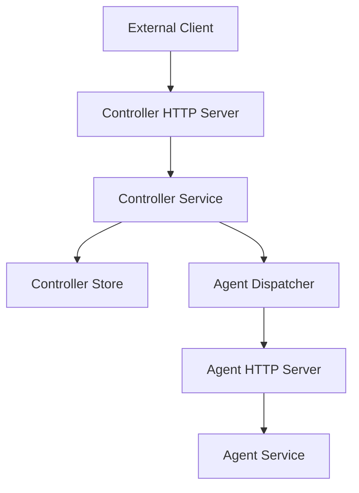
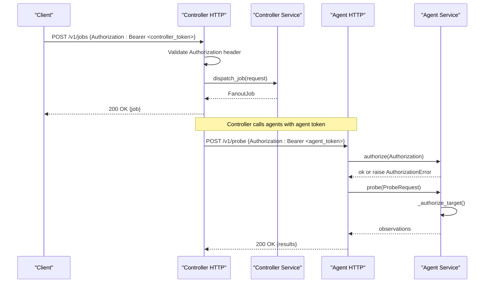
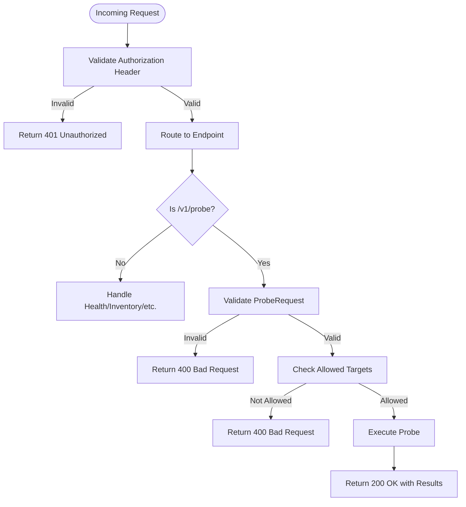
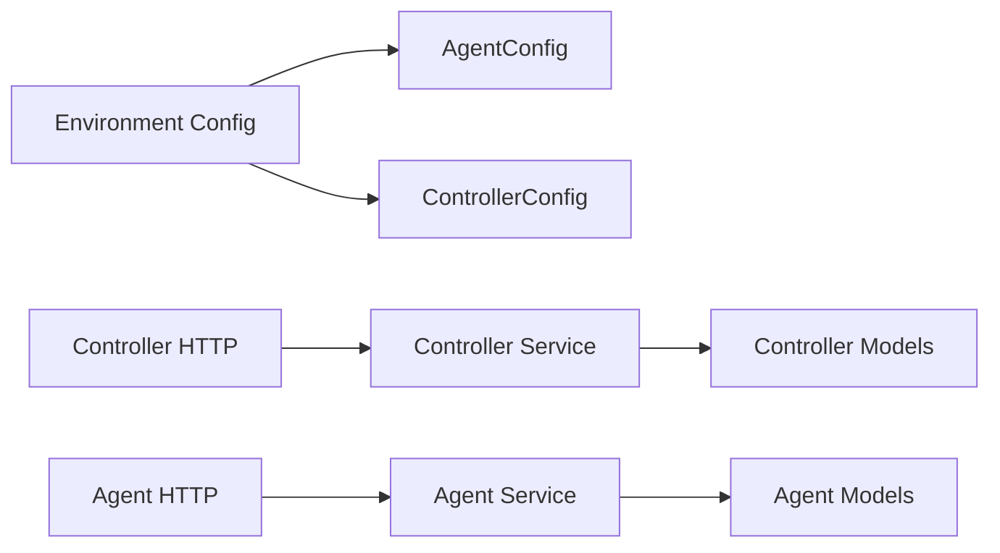

# Authentication & Security

<cite>
**Referenced Files in This Document**
- [agent/config.py](file://agent/config.py)
- [controller/config.py](file://controller/config.py)
- [agent/http_server.py](file://agent/http_server.py)
- [controller/http_server.py](file://controller/http_server.py)
- [agent/service.py](file://agent/service.py)
- [controller/service.py](file://controller/service.py)
- [agent/models.py](file://agent/models.py)
- [controller/models.py](file://controller/models.py)
- [agent/__main__.py](file://agent/__main__.py)
- [controller/__main__.py](file://controller/__main__.py)
- [tests/test_agent_http.py](file://tests/test_agent_http.py)
- [tests/test_controller_http.py](file://tests/test_controller_http.py)
- [README.md](file://README.md)
</cite>

## Table of Contents
1. Introduction
2. Project Structure
3. Core Components
4. Architecture Overview
5. Detailed Component Analysis
6. Dependency Analysis
7. Performance Considerations
8. Troubleshooting Guide
9. Conclusion
10. Appendices

## Introduction
This document explains NetForge’s authentication and security mechanisms for secure communication between the controller and agents. It covers:
- Authorization header format and token-based authentication
- Target allowlisting on agents
- How agents validate incoming requests, handle authorization errors, and enforce access controls
- Configuration examples for secure setup
- Common vulnerabilities, mitigations, and compliance considerations
- Guidance for implementing custom authentication schemes and integrating with identity management systems

The current implementation uses Bearer tokens over HTTP for demonstration purposes. The agent configuration comments indicate that mutual TLS (mTLS) is planned for a future release to strengthen transport security.

## Project Structure
NetForge exposes two HTTP services:
- Controller API: Secured by a controller bearer token; used by external clients to register agents and dispatch jobs.
- Agent API: Secured by an agent bearer token; used by the controller to call probes and read health/inventory.

**Diagram sources**
- [controller/http_server.py:16-68](file://controller/http_server.py#L16-L68)
- [controller/service.py:17-51](file://controller/service.py#L17-L51)
- [agent/http_server.py:15-58](file://agent/http_server.py#L15-L58)
- [agent/service.py:33-111](file://agent/service.py#L33-L111)

**Section sources**
- [controller/http_server.py:16-68](file://controller/http_server.py#L16-L68)
- [agent/http_server.py:15-58](file://agent/http_server.py#L15-L58)
- [controller/service.py:17-51](file://controller/service.py#L17-L51)
- [agent/service.py:33-111](file://agent/service.py#L33-L111)

## Core Components
- Authorization headers: Both endpoints require an Authorization header using the Bearer scheme.
- Token validation:
  - Controller validates the request against a configured controller token using constant-time comparison.
  - Agent validates the request against its configured bearer token using constant-time comparison.
- Target allowlisting: Agents restrict outbound probes to a configured set of allowed targets for targeted probe types.
- Error handling: Unauthorized requests return 401; invalid or disallowed requests return 400 with descriptive errors.

Key responsibilities:
- Controller HTTP server enforces controller-level auth before routing to service methods.
- Agent HTTP server delegates auth to AgentService.authorize and enforces target allowlist during probing.

**Section sources**
- [controller/http_server.py:30-34](file://controller/http_server.py#L30-L34)
- [agent/service.py:37-40](file://agent/service.py#L37-L40)
- [agent/service.py:65-71](file://agent/service.py#L65-L71)
- [agent/http_server.py:29-45](file://agent/http_server.py#L29-L45)

## Architecture Overview
The end-to-end flow for a job involves:
- A client authenticates to the controller with a controller bearer token.
- The controller registers or queries agents and dispatches jobs.
- The controller calls each agent with the agent’s bearer token.
- The agent validates the token and enforces target allowlisting before executing probes.

**Diagram sources**
- [controller/http_server.py:30-55](file://controller/http_server.py#L30-L55)
- [controller/service.py:30-47](file://controller/service.py#L30-L47)
- [agent/http_server.py:29-45](file://agent/http_server.py#L29-L45)
- [agent/service.py:37-71](file://agent/service.py#L37-L71)

## Detailed Component Analysis

### Authorization Header Format
- Scheme: Bearer
- Value: The secret token string configured for the component.
- Examples:
  - Controller endpoint expects: Authorization: Bearer <controller_token>
  - Agent endpoint expects: Authorization: Bearer <agent_token>

Validation behavior:
- Controller compares the provided Authorization header to the expected value using constant-time comparison to prevent timing attacks.
- Agent compares the provided Authorization header to the expected value using constant-time comparison.

**Section sources**
- [controller/http_server.py:30-34](file://controller/http_server.py#L30-L34)
- [agent/service.py:37-40](file://agent/service.py#L37-L40)

### Token-Based Authentication
- Tokens are loaded from environment variables at startup:
  - Controller: NETFORGE_CONTROLLER_TOKEN and NETFORGE_AGENT_TOKEN
  - Agent: NETFORGE_AGENT_ID and NETFORGE_AGENT_TOKEN
- The controller stores the agent token to authenticate outgoing calls to agents.
- The agent stores its own bearer token to authenticate incoming requests.

Environment configuration:
- ControllerConfig.from_env reads controller and agent tokens.
- AgentConfig.from_env reads agent id and token, plus optional tags and allowed targets.

**Section sources**
- [controller/config.py:15-21](file://controller/config.py#L15-L21)
- [agent/config.py:18-34](file://agent/config.py#L18-L34)

### Target Allowlisting
Agents can restrict which targets they are allowed to probe. This applies only to “targeted” probe types (e.g., ICMP, TCP, DNS, TRACEROUTE).

Rules enforced by the agent:
- If no allowed_targets are configured, any targeted probe is rejected.
- If a target is not present in the allowed set, the probe is rejected.

Errors:
- Missing allowed_targets results in a specific error indicating no allowed targets are configured.
- Disallowed target results in a specific error naming the target.

**Section sources**
- [agent/models.py:20-20](file://agent/models.py#L20-L20)
- [agent/service.py:65-71](file://agent/service.py#L65-L71)

### Request Validation and Access Control Flow
- Controller HTTP handler:
  - Validates Authorization header early.
  - Routes to service methods for registration, listing, and job dispatch.
  - Returns 401 for invalid tokens; returns 400 for validation or business errors.
- Agent HTTP handler:
  - Calls service.authorize before processing any endpoint.
  - For /v1/probe, validates request body via Pydantic model.
  - Enforces target allowlisting within the service layer.
  - Returns 401 for unauthorized; returns 400 for validation or target policy violations.

**Diagram sources**
- [controller/http_server.py:30-55](file://controller/http_server.py#L30-L55)
- [agent/http_server.py:29-45](file://agent/http_server.py#L29-L45)
- [agent/service.py:58-71](file://agent/service.py#L58-L71)

**Section sources**
- [controller/http_server.py:30-55](file://controller/http_server.py#L30-L55)
- [agent/http_server.py:29-45](file://agent/http_server.py#L29-L45)
- [agent/service.py:58-71](file://agent/service.py#L58-L71)

### Error Handling and Status Codes
- 401 Unauthorized:
  - Missing or invalid Authorization header on both controller and agent endpoints.
- 400 Bad Request:
  - Invalid JSON body on either endpoint.
  - Pydantic validation failures for request models.
  - Target not allowed on agent when performing targeted probes.
- 404 Not Found:
  - Unknown endpoints.

Tests demonstrate these behaviors:
- Agent requires a valid bearer token for /v1/health and returns 401 without it.
- Controller requires a valid bearer token and returns 401 without it.

**Section sources**
- [agent/http_server.py:29-45](file://agent/http_server.py#L29-L45)
- [controller/http_server.py:30-55](file://controller/http_server.py#L30-L55)
- [tests/test_agent_http.py:12-32](file://tests/test_agent_http.py#L12-L32)
- [tests/test_controller_http.py:17-38](file://tests/test_controller_http.py#L17-L38)

## Dependency Analysis
Authentication and authorization touch several modules:

- Environment variables drive tokens and policies.
- HTTP handlers depend on service layers for business logic and policy enforcement.
- Models define validated request/response structures.

**Diagram sources**
- [agent/config.py:10-34](file://agent/config.py#L10-L34)
- [controller/config.py:9-21](file://controller/config.py#L9-L21)
- [controller/http_server.py:16-68](file://controller/http_server.py#L16-L68)
- [agent/http_server.py:15-58](file://agent/http_server.py#L15-L58)
- [agent/service.py:33-111](file://agent/service.py#L33-L111)
- [controller/service.py:17-51](file://controller/service.py#L17-L51)
- [agent/models.py:10-41](file://agent/models.py#L10-L41)
- [controller/models.py:13-38](file://controller/models.py#L13-L38)

**Section sources**
- [agent/config.py:10-34](file://agent/config.py#L10-L34)
- [controller/config.py:9-21](file://controller/config.py#L9-L21)
- [controller/http_server.py:16-68](file://controller/http_server.py#L16-L68)
- [agent/http_server.py:15-58](file://agent/http_server.py#L15-L58)
- [agent/service.py:33-111](file://agent/service.py#L33-L111)
- [controller/service.py:17-51](file://controller/service.py#L17-L51)
- [agent/models.py:10-41](file://agent/models.py#L10-L41)
- [controller/models.py:13-38](file://controller/models.py#L13-L38)

## Performance Considerations
- Constant-time comparisons are used for token checks to mitigate timing side-channel risks.
- Minimal overhead in HTTP handlers; heavy work occurs in service layers.
- Target allowlist checks are O(1) set lookups.

[No sources needed since this section provides general guidance]

## Troubleshooting Guide
Common issues and resolutions:
- 401 Unauthorized:
  - Ensure Authorization header matches exactly the configured Bearer token for the endpoint.
  - Verify environment variables are correctly set at process start.
- 400 Bad Request:
  - Confirm request bodies are valid JSON and conform to the expected schema.
  - For agent /v1/probe, ensure targeted probes include a target and that the target is in the allowed list.
- Target not allowed:
  - Configure NETFORGE_ALLOWED_TARGETS with a comma-separated list of permitted targets.
  - Only targeted probe types are subject to allowlisting.

Operational tips:
- Use separate tokens for controller and agent roles.
- Keep tokens secret and rotate regularly.
- Restrict network exposure of agent endpoints to trusted networks or tunnels.

**Section sources**
- [controller/http_server.py:30-34](file://controller/http_server.py#L30-L34)
- [agent/http_server.py:29-45](file://agent/http_server.py#L29-L45)
- [agent/config.py:24-28](file://agent/config.py#L24-L28)
- [agent/service.py:65-71](file://agent/service.py#L65-L71)

## Conclusion
NetForge implements straightforward but effective authentication and authorization:
- Bearer tokens protect both controller and agent HTTP APIs.
- Agents enforce target allowlists to limit outbound probes to approved destinations.
- Errors are clearly categorized with appropriate HTTP status codes.
For production deployments, consider upgrading to mTLS as indicated in the agent configuration comments and integrating with enterprise identity systems for centralized credential management.

[No sources needed since this section summarizes without analyzing specific files]

## Appendices

### Configuration Examples
- Controller startup:
  - Set NETFORGE_CONTROLLER_TOKEN and NETFORGE_AGENT_TOKEN.
  - Run the controller entry point with desired host/port.
- Agent startup:
  - Set NETFORGE_AGENT_ID and NETFORGE_AGENT_TOKEN.
  - Optionally set NETFORGE_ALLOWED_TARGETS to restrict outbound probes.
  - Run the agent entry point with desired host/port.

These steps initialize the components with secure defaults and enable authenticated communication.

**Section sources**
- [controller/__main__.py:14-21](file://controller/__main__.py#L14-L21)
- [agent/__main__.py:12-17](file://agent/__main__.py#L12-L17)
- [controller/config.py:15-21](file://controller/config.py#L15-L21)
- [agent/config.py:18-34](file://agent/config.py#L18-L34)

### API Endpoints and Authentication Requirements
- Controller
  - GET /v1/health: Requires Authorization: Bearer <controller_token>
  - GET /v1/agents: Requires Authorization: Bearer <controller_token>
  - POST /v1/agents: Requires Authorization: Bearer <controller_token>
  - POST /v1/jobs: Requires Authorization: Bearer <controller_token>
  - GET /v1/jobs/{id}: Requires Authorization: Bearer <controller_token>
- Agent
  - GET /v1/health: Requires Authorization: Bearer <agent_token>
  - GET /v1/inventory: Requires Authorization: Bearer <agent_token>
  - POST /v1/probe: Requires Authorization: Bearer <agent_token>

All endpoints return JSON responses and use standard HTTP status codes for success and error conditions.

**Section sources**
- [controller/http_server.py:30-55](file://controller/http_server.py#L30-L55)
- [agent/http_server.py:29-45](file://agent/http_server.py#L29-L45)

### Security Best Practices
- Transport security:
  - Deploy behind TLS-terminating proxies or reverse proxies to encrypt traffic in transit.
  - Plan for mTLS as noted in agent configuration comments for stronger mutual authentication.
- Credential management:
  - Store tokens in secure secret stores; avoid hardcoding in source or logs.
  - Rotate tokens periodically and revoke compromised credentials immediately.
- Network exposure:
  - Bind agent listeners to private interfaces or restrict access via firewall rules.
  - Limit controller exposure to authorized clients only.
- Least privilege:
  - Configure minimal allowed targets per agent to reduce blast radius.
  - Separate tokens for different roles and environments.

[No sources needed since this section provides general guidance]

### Compliance Considerations
- Auditability:
  - Log authentication outcomes and policy decisions (without logging secrets).
  - Retain audit trails for job dispatch and probe execution where required.
- Data protection:
  - Encrypt sensitive data in transit and at rest.
  - Minimize collection of sensitive information in probe outputs.
- Policy enforcement:
  - Maintain documented allowlists and review them regularly.
  - Integrate with organizational IAM for centralized control and lifecycle management.

[No sources needed since this section provides general guidance]

### Implementing Custom Authentication Schemes
To integrate with existing identity management systems:
- Replace static token checks with token introspection or JWT verification in both controller and agent HTTP handlers.
- Add middleware-like functions to:
  - Parse and validate tokens.
  - Resolve user or service identities.
  - Enforce role-based or attribute-based access controls.
- Preserve constant-time comparisons for secret checks and add rate limiting and IP allowlisting as needed.
- Update tests to cover new authentication flows and edge cases.

[No sources needed since this section provides general guidance]