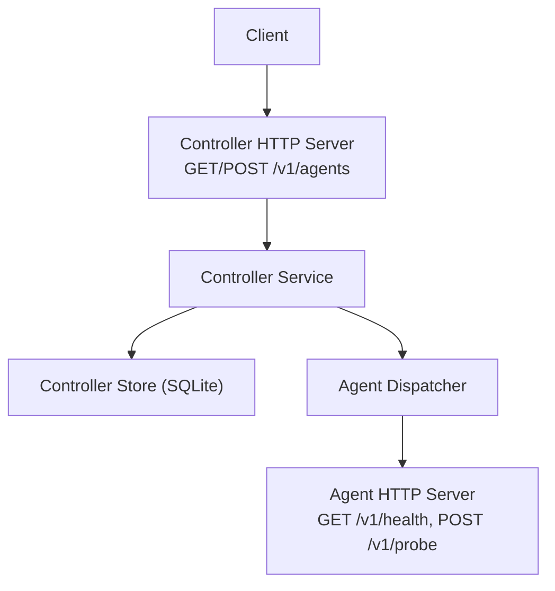
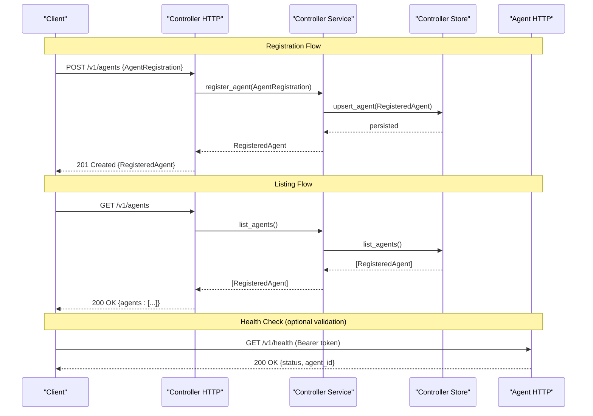
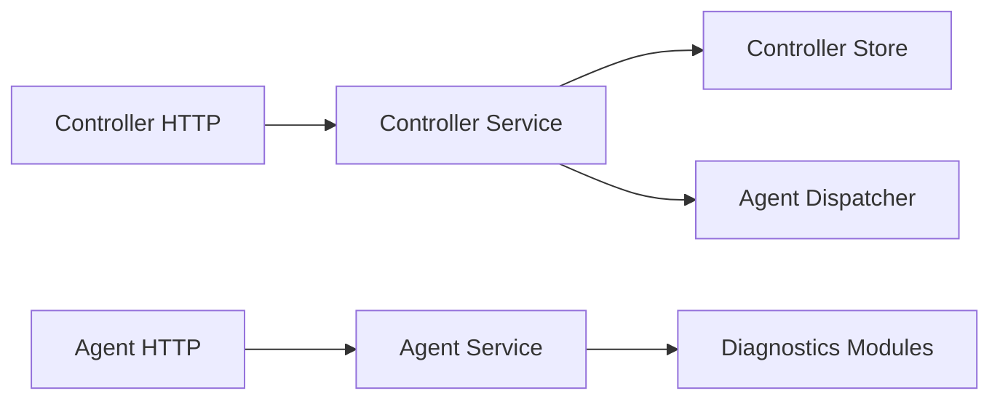

# Agent Management

<cite>
**Referenced Files in This Document**
- [controller/http_server.py](file://controller/http_server.py)
- [controller/service.py](file://controller/service.py)
- [controller/models.py](file://controller/models.py)
- [controller/store.py](file://controller/store.py)
- [agent/http_server.py](file://agent/http_server.py)
- [agent/service.py](file://agent/service.py)
- [agent/models.py](file://agent/models.py)
- [tests/test_controller_http.py](file://tests/test_controller_http.py)
- [tests/test_agent_http.py](file://tests/test_agent_http.py)
</cite>

## Table of Contents
1. [Introduction](#introduction)
2. [Project Structure](#project-structure)
3. [Core Components](#core-components)
4. [Architecture Overview](#architecture-overview)
5. [Detailed Component Analysis](#detailed-component-analysis)
6. [Dependency Analysis](#dependency-analysis)
7. [Performance Considerations](#performance-considerations)
8. [Troubleshooting Guide](#troubleshooting-guide)
9. [Conclusion](#conclusion)

## Introduction
This document provides detailed API documentation for agent management endpoints in the NetForge Controller, focusing on:
- GET /v1/agents: List registered agents
- POST /v1/agents: Register a new agent

It covers authentication using Bearer tokens, request/response schemas, error handling, and practical workflows for agent registration and lifecycle management. It also explains agent discovery mechanisms, connection validation, and security considerations for agent-controller communication.

## Project Structure
The agent management functionality is implemented across the controller and agent components:
- Controller HTTP server exposes REST endpoints for agent listing and registration
- Controller service orchestrates business logic and persistence
- Models define validated request/response structures
- Agent HTTP server and service provide health and probe capabilities used by the controller to validate connectivity

**Diagram sources**
- [controller/http_server.py:16-68](file://controller/http_server.py#L16-L68)
- [controller/service.py:17-50](file://controller/service.py#L17-L50)
- [controller/store.py:38-58](file://controller/store.py#L38-L58)
- [agent/http_server.py:15-62](file://agent/http_server.py#L15-L62)

**Section sources**
- [controller/http_server.py:16-68](file://controller/http_server.py#L16-L68)
- [controller/service.py:17-50](file://controller/service.py#L17-L50)
- [agent/http_server.py:15-62](file://agent/http_server.py#L15-L62)

## Core Components
- Controller HTTP handler routes requests to service methods and returns JSON responses with appropriate status codes
- Controller service manages agent registration, listing, job dispatching, and updates last seen timestamps
- Models enforce schema validation for agent registration and job requests
- Agent HTTP server validates incoming requests and executes probes; it exposes health and inventory endpoints

Key responsibilities:
- Authentication: Both controller and agent endpoints require a Bearer token via the Authorization header
- Validation: Pydantic models validate request payloads and return structured errors
- Persistence: Controller store persists agent registrations and job results

**Section sources**
- [controller/http_server.py:16-68](file://controller/http_server.py#L16-L68)
- [controller/service.py:17-50](file://controller/service.py#L17-L50)
- [controller/models.py:13-37](file://controller/models.py#L13-L37)
- [agent/http_server.py:15-62](file://agent/http_server.py#L15-L62)
- [agent/service.py:33-111](file://agent/service.py#L33-L111)

## Architecture Overview
The agent management workflow involves:
- Clients authenticate with the controller using a Bearer token
- Agents register themselves with the controller by providing identity and reachable URL
- The controller stores agent metadata and can list all registered agents
- For operational tasks, the controller may validate agent reachability via health checks and execute probes through the agent’s HTTP interface

**Diagram sources**
- [controller/http_server.py:30-55](file://controller/http_server.py#L30-L55)
- [controller/service.py:22-28](file://controller/service.py#L22-L28)
- [controller/store.py:38-58](file://controller/store.py#L38-L58)
- [agent/http_server.py:29-45](file://agent/http_server.py#L29-L45)

## Detailed Component Analysis

### Endpoint: GET /v1/agents
Purpose:
- Returns a list of all registered agents known to the controller

Authentication:
- Requires Authorization: Bearer <controller_token>

Request:
- No body required

Response:
- Status: 200 OK
- Body: JSON object with key "agents", containing an array of RegisteredAgent objects

RegisteredAgent fields:
- agent_id: string (non-empty)
- url: valid HTTP(S) URL
- topology_tags: map of string keys to string values
- enabled: boolean (default true)
- last_seen_at: float timestamp or null

Error Handling:
- 401 Unauthorized if Authorization header is missing or invalid
- 400 Bad Request if internal validation fails (e.g., unexpected payload shape)
- 404 Not Found for unknown endpoints

Example usage:
- Send GET /v1/agents with Authorization: Bearer <controller_token>
- Receive 200 OK with {"agents": [...]}

**Section sources**
- [controller/http_server.py:30-55](file://controller/http_server.py#L30-L55)
- [controller/models.py:13-22](file://controller/models.py#L13-L22)
- [tests/test_controller_http.py:17-39](file://tests/test_controller_http.py#L17-L39)

### Endpoint: POST /v1/agents
Purpose:
- Registers a new agent or updates an existing agent’s details

Authentication:
- Requires Authorization: Bearer <controller_token>

Request:
- Content-Type: application/json
- Body: AgentRegistration object

AgentRegistration fields:
- agent_id: string (non-empty)
- url: valid HTTP(S) URL where the agent is reachable
- topology_tags: optional map of string keys to string values

Response:
- Status: 201 Created
- Body: RegisteredAgent object including agent_id, url, topology_tags, enabled, last_seen_at

Error Handling:
- 400 Bad Request if request body is not valid JSON or fails model validation
- 401 Unauthorized if Authorization header is missing or invalid
- 404 Not Found for unknown endpoints

Example usage:
- Send POST /v1/agents with Authorization: Bearer <controller_token> and JSON body containing agent_id and url
- Receive 201 Created with RegisteredAgent

**Section sources**
- [controller/http_server.py:21-42](file://controller/http_server.py#L21-L42)
- [controller/models.py:13-22](file://controller/models.py#L13-L22)
- [tests/test_controller_http.py:17-39](file://tests/test_controller_http.py#L17-L39)

### Agent Registration Model Details
AgentRegistration:
- agent_id: string, must be non-empty
- url: AnyHttpUrl, validated as a proper HTTP(S) URL
- topology_tags: dict[str, str], defaults to empty map

RegisteredAgent extends AgentRegistration:
- enabled: bool, default True
- last_seen_at: float | None, updated when agent is seen

ProbeRequest (used by agent probing):
- probe_type: enum (icmp, tcp, dns, traceroute, interfaces, route, gateway)
- target: string or null (required for targeted probes)
- port: int or null (only valid for TCP probes)
- count: int between 1 and 20
- max_hops: int between 1 and 64
- timeout_seconds: float greater than 0 and up to 30
- source_interface: string or null

Validation rules:
- Targeted probes require a target
- TCP probes require a port; other probes must not include a port

**Section sources**
- [controller/models.py:13-37](file://controller/models.py#L13-L37)
- [agent/models.py:10-41](file://agent/models.py#L10-L41)

### Authentication Requirements
Both controller and agent endpoints use Bearer token authentication:
- Controller: Validates Authorization header against configured controller token
- Agent: Validates Authorization header against configured agent token

Security notes:
- Tokens are compared using constant-time comparison to mitigate timing attacks
- Ensure tokens are stored securely and transmitted over TLS in production

**Section sources**
- [controller/http_server.py:30-34](file://controller/http_server.py#L30-L34)
- [agent/service.py:37-40](file://agent/service.py#L37-L40)

### Error Handling Summary
Common errors:
- 400 Bad Request: Invalid JSON or model validation failure
- 401 Unauthorized: Missing or invalid Bearer token
- 404 Not Found: Unknown endpoint or resource

Behavior:
- Errors return JSON with an "error" field describing the issue
- Validation errors originate from Pydantic and are surfaced as strings

**Section sources**
- [controller/http_server.py:21-55](file://controller/http_server.py#L21-L55)
- [agent/http_server.py:20-45](file://agent/http_server.py#L20-L45)

### Practical Examples

#### Agent Registration Workflow
Steps:
1. Start the agent process and ensure it is listening at a reachable URL
2. Send POST /v1/agents with Authorization: Bearer <controller_token> and a JSON body containing agent_id and url
3. Receive 201 Created with RegisteredAgent confirming registration
4. Optionally verify registration by calling GET /v1/agents

Notes:
- If the same agent_id is registered again, the controller updates its details
- Ensure the agent’s URL is accessible from the controller network

**Section sources**
- [controller/http_server.py:30-42](file://controller/http_server.py#L30-L42)
- [controller/service.py:22-25](file://controller/service.py#L22-L25)
- [tests/test_controller_http.py:17-39](file://tests/test_controller_http.py#L17-L39)

#### Agent Lifecycle Management
Lifecycle aspects:
- Registration: POST /v1/agents adds or updates agent metadata
- Listing: GET /v1/agents retrieves current agent registry
- Visibility: last_seen_at indicates when the agent was last observed (updated during job execution)
- Enablement: enabled flag controls whether the agent can receive jobs

Operational tips:
- Use GET /v1/agents to audit active agents
- Monitor last_seen_at to detect stale agents
- Disable agents by updating their enabled flag if supported by your deployment

**Section sources**
- [controller/models.py:13-22](file://controller/models.py#L13-L22)
- [controller/service.py:22-28](file://controller/service.py#L22-L28)
- [controller/store.py:38-58](file://controller/store.py#L38-L58)

### Agent Discovery Mechanisms
Current implementation:
- Agents self-register by calling POST /v1/agents with their identity and reachable URL
- The controller maintains a registry of agents and serves them via GET /v1/agents

Discovery characteristics:
- Pull-based: Controllers query the registry rather than agents pushing events
- Manual or automated registration: Agents can be configured to register themselves at startup

Future considerations:
- Active discovery could involve periodic health checks to confirm agent reachability
- Service discovery integrations (e.g., DNS, service mesh) could automate registration

**Section sources**
- [controller/http_server.py:30-42](file://controller/http_server.py#L30-L42)
- [controller/store.py:38-58](file://controller/store.py#L38-L58)

### Connection Validation
Validation approaches:
- Health check: Call GET /v1/health on the agent URL to verify the agent is reachable and healthy
- Probe execution: Dispatch a lightweight probe (e.g., ICMP ping) to validate connectivity and response quality

Implementation notes:
- The agent’s health endpoint returns agent identity and schema version
- Probes return observations with context including agent_id, hostname, probe_type, target, duration, and evidence quality

**Section sources**
- [agent/http_server.py:29-45](file://agent/http_server.py#L29-L45)
- [agent/service.py:42-63](file://agent/service.py#L42-L63)

### Security Considerations
- Bearer tokens: Both controller and agent endpoints require Authorization: Bearer <token>
- Token storage: Use environment variables or secure secret managers
- Transport security: Deploy behind TLS to protect tokens and data in transit
- Target restrictions: Agents can restrict allowed targets to prevent misuse
- Validation: All inputs are validated via Pydantic models to prevent injection and malformed requests

**Section sources**
- [controller/http_server.py:30-34](file://controller/http_server.py#L30-L34)
- [agent/service.py:37-40](file://agent/service.py#L37-L40)
- [agent/models.py:23-41](file://agent/models.py#L23-L41)

## Dependency Analysis
Component relationships:
- Controller HTTP depends on Controller Service for business logic
- Controller Service depends on Controller Store for persistence and Agent Dispatcher for job fanout
- Agent HTTP depends on Agent Service for authorization, health, inventory, and probing
- Models define shared contracts between components

**Diagram sources**
- [controller/http_server.py:16-68](file://controller/http_server.py#L16-L68)
- [controller/service.py:17-50](file://controller/service.py#L17-L50)
- [agent/http_server.py:15-62](file://agent/http_server.py#L15-L62)
- [agent/service.py:33-111](file://agent/service.py#L33-L111)

**Section sources**
- [controller/http_server.py:16-68](file://controller/http_server.py#L16-L68)
- [controller/service.py:17-50](file://controller/service.py#L17-L50)
- [agent/http_server.py:15-62](file://agent/http_server.py#L15-L62)
- [agent/service.py:33-111](file://agent/service.py#L33-L111)

## Performance Considerations
- Registration and listing operations are lightweight and primarily I/O bound against the store
- Batch operations (job dispatch) fan out to multiple agents; consider rate limiting and timeouts
- Use minimal payloads and avoid unnecessary retries to reduce network overhead
- Persist only essential metadata to keep the registry small and queries fast

[No sources needed since this section provides general guidance]

## Troubleshooting Guide
Common issues and resolutions:
- 401 Unauthorized:
  - Ensure Authorization header includes a valid Bearer token for the controller
  - Verify token matches the configured controller token
- 400 Bad Request:
  - Check that request body is valid JSON
  - Validate fields according to model constraints (e.g., agent_id non-empty, url valid)
- Agent unreachable:
  - Confirm agent URL is correct and reachable from the controller
  - Test agent health endpoint directly to verify availability
- Stale agents:
  - Monitor last_seen_at; update or re-register agents that are no longer active

Diagnostic steps:
- Call GET /v1/agents to inspect current registry
- Call GET /v1/health on the agent URL to verify agent status
- Review error messages returned by endpoints for specific validation failures

**Section sources**
- [controller/http_server.py:21-55](file://controller/http_server.py#L21-L55)
- [agent/http_server.py:20-45](file://agent/http_server.py#L20-L45)
- [tests/test_controller_http.py:17-39](file://tests/test_controller_http.py#L17-L39)
- [tests/test_agent_http.py:12-33](file://tests/test_agent_http.py#L12-L33)

## Conclusion
The NetForge Controller provides straightforward agent management endpoints for listing and registering agents, secured by Bearer token authentication. Agents self-register with identity and reachability information, enabling the controller to maintain an accurate registry. Operational workflows include health checks and probe execution to validate connectivity and gather diagnostics. Proper configuration, validation, and security practices ensure reliable agent-controller communication and robust network diagnostics.

[No sources needed since this section summarizes without analyzing specific files]