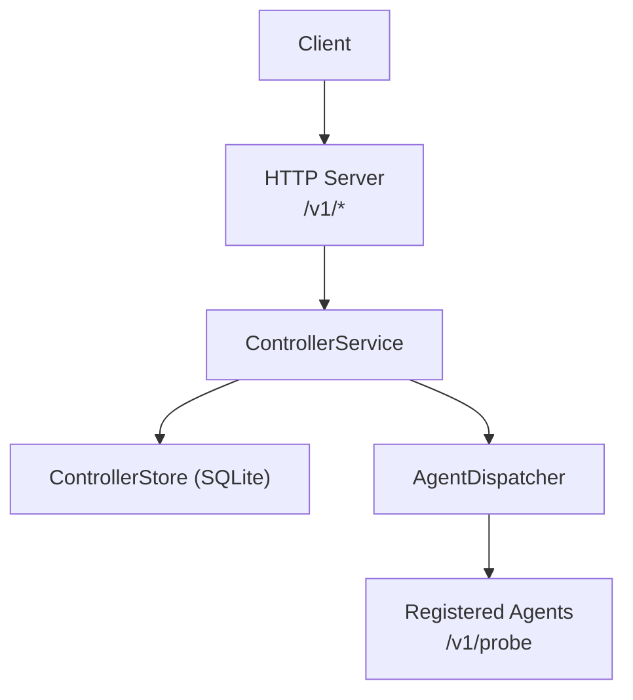
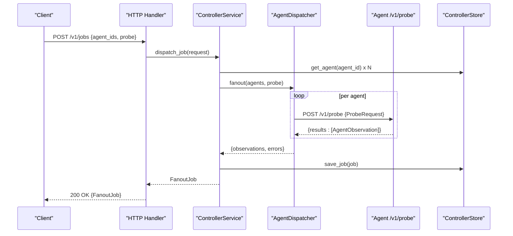
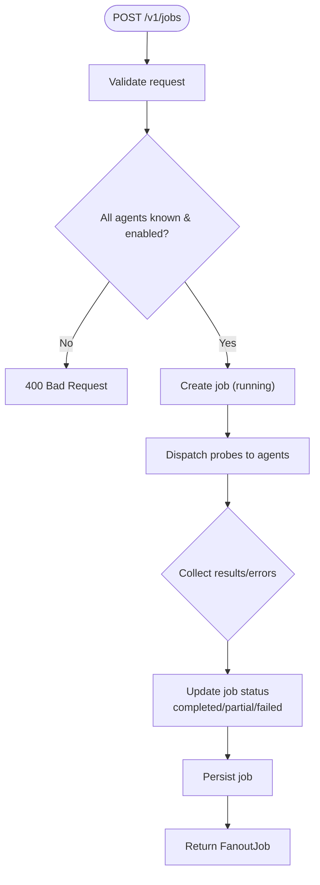
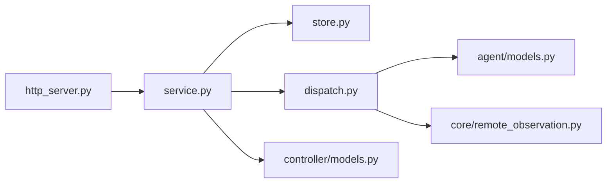
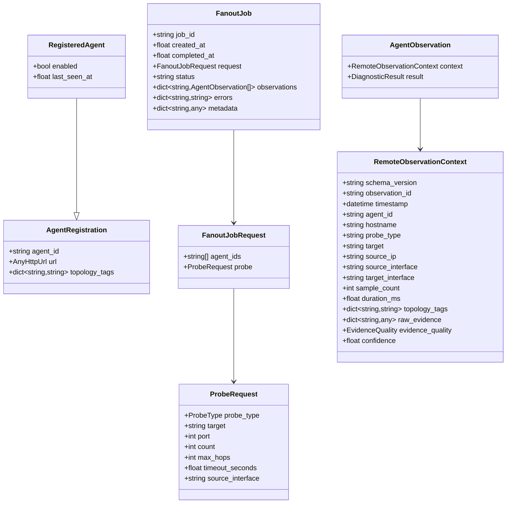

# Controller API

<cite>
**Referenced Files in This Document**
- [controller/__main__.py](file://controller/__main__.py)
- [controller/http_server.py](file://controller/http_server.py)
- [controller/service.py](file://controller/service.py)
- [controller/models.py](file://controller/models.py)
- [controller/dispatch.py](file://controller/dispatch.py)
- [controller/store.py](file://controller/store.py)
- [controller/config.py](file://controller/config.py)
- [agent/models.py](file://agent/models.py)
- [core/remote_observation.py](file://core/remote_observation.py)
- [tests/test_controller_http.py](file://tests/test_controller_http.py)
- [tests/test_controller_service.py](file://tests/test_controller_service.py)
</cite>

## Table of Contents
1. [Introduction](#introduction)
2. [Project Structure](#project-structure)
3. [Core Components](#core-components)
4. [Architecture Overview](#architecture-overview)
5. [Detailed Component Analysis](#detailed-component-analysis)
6. [Dependency Analysis](#dependency-analysis)
7. [Performance Considerations](#performance-considerations)
8. [Troubleshooting Guide](#troubleshooting-guide)
9. [Conclusion](#conclusion)
10. [Appendices](#appendices)

## Introduction
This document provides comprehensive API documentation for the NetForge Controller REST API used to orchestrate distributed network diagnostics across multiple agents. It covers:
- All controller endpoints for job dispatching, agent management, and result retrieval
- Request/response schemas and validation rules
- Authentication requirements and error handling
- FanoutJob models and distributed diagnostic workflows
- Practical examples for orchestrating multi-agent diagnostics, monitoring jobs, and retrieving aggregated results
- Scalability, job queuing, and fault tolerance considerations

The controller exposes a minimal HTTP API backed by an in-process SQLite store and a concurrent dispatcher that fans out probes to registered agents.

## Project Structure
The controller is implemented as a small Python service with clear separation between HTTP handling, business logic, persistence, and dispatch to agents.

**Diagram sources**
- [controller/http_server.py:16-68](file://controller/http_server.py#L16-L68)
- [controller/service.py:17-51](file://controller/service.py#L17-L51)
- [controller/dispatch.py:19-52](file://controller/dispatch.py#L19-L52)
- [controller/store.py:13-78](file://controller/store.py#L13-L78)

**Section sources**
- [controller/__main__.py:14-25](file://controller/__main__.py#L14-L25)
- [controller/http_server.py:16-73](file://controller/http_server.py#L16-L73)
- [controller/service.py:17-51](file://controller/service.py#L17-L51)
- [controller/dispatch.py:19-52](file://controller/dispatch.py#L19-L52)
- [controller/store.py:13-78](file://controller/store.py#L13-L78)

## Core Components
- HTTP server: Validates bearer token, routes requests, serializes responses, and handles errors.
- ControllerService: Orchestrates agent registration, job dispatch, and job retrieval; validates agents and updates job state.
- AgentDispatcher: Concurrently sends probe requests to agents using a thread pool and collects observations or errors.
- ControllerStore: Persists agents and jobs in SQLite; supports upserts and queries.
- Models: Pydantic models for requests, responses, and observations ensuring strict validation.

Key responsibilities:
- Authentication via Bearer tokens for both controller API and agent communication.
- Validation of request payloads and observation envelopes.
- Concurrency control when probing multiple agents.
- Persistence of job lifecycle and results.

**Section sources**
- [controller/http_server.py:16-68](file://controller/http_server.py#L16-L68)
- [controller/service.py:17-51](file://controller/service.py#L17-L51)
- [controller/dispatch.py:19-52](file://controller/dispatch.py#L19-L52)
- [controller/store.py:13-78](file://controller/store.py#L13-L78)
- [controller/models.py:13-38](file://controller/models.py#L13-L38)
- [agent/models.py:23-41](file://agent/models.py#L23-L41)
- [core/remote_observation.py:15-59](file://core/remote_observation.py#L15-L59)

## Architecture Overview
The controller exposes a simple REST API over HTTP with bearer token authentication. Clients register agents, dispatch fan-out jobs to one or more agents, and retrieve job results. The dispatcher uses bounded concurrency to probe agents concurrently while collecting results and errors.

**Diagram sources**
- [controller/http_server.py:30-55](file://controller/http_server.py#L30-L55)
- [controller/service.py:30-47](file://controller/service.py#L30-L47)
- [controller/dispatch.py:40-52](file://controller/dispatch.py#L40-L52)
- [controller/store.py:64-77](file://controller/store.py#L64-L77)

## Detailed Component Analysis

### HTTP Endpoints
All endpoints require a valid Bearer token in the Authorization header. Responses are JSON.

- Health check
  - Method: GET
  - Path: /v1/health
  - Auth: Bearer token required
  - Response: 200 OK with status and service name
  - Errors: 401 Unauthorized if token missing or invalid

- List agents
  - Method: GET
  - Path: /v1/agents
  - Auth: Bearer token required
  - Response: 200 OK with array of RegisteredAgent objects
  - Errors: 401 Unauthorized if token missing or invalid

- Register agent
  - Method: POST
  - Path: /v1/agents
  - Auth: Bearer token required
  - Request body: AgentRegistration
  - Response: 201 Created with RegisteredAgent
  - Errors:
    - 400 Bad Request on validation failure
    - 401 Unauthorized if token missing or invalid

- Dispatch job
  - Method: POST
  - Path: /v1/jobs
  - Auth: Bearer token required
  - Request body: FanoutJobRequest
  - Response: 200 OK with FanoutJob (status may be completed, partial, or failed)
  - Errors:
    - 400 Bad Request on validation failure or unknown/disabled agent
    - 401 Unauthorized if token missing or invalid

- Get job
  - Method: GET
  - Path: /v1/jobs/{job_id}
  - Auth: Bearer token required
  - Response: 200 OK with FanoutJob
  - Errors:
    - 404 Not Found if job does not exist
    - 401 Unauthorized if token missing or invalid

Notes:
- Unknown endpoints return 404 Not Found.
- Invalid JSON bodies return 400 Bad Request.

**Section sources**
- [controller/http_server.py:16-68](file://controller/http_server.py#L16-L68)
- [tests/test_controller_http.py:17-39](file://tests/test_controller_http.py#L17-L39)

### Data Models

- AgentRegistration
  - Fields:
    - agent_id: string, min length 1
    - url: valid HTTP URL
    - topology_tags: map of string keys to string values
  - Used for registering agents with the controller

- RegisteredAgent
  - Extends AgentRegistration with:
    - enabled: boolean, default True
    - last_seen_at: float timestamp or None

- FanoutJobRequest
  - Fields:
    - agent_ids: list of strings, min length 1, max length 32
    - probe: ProbeRequest

- FanoutJob
  - Fields:
    - job_id: string
    - created_at: float timestamp
    - completed_at: float timestamp or None
    - request: FanoutJobRequest
    - status: string ("running", "completed", "partial", "failed")
    - observations: map from agent_id to list of AgentObservation
    - errors: map from agent_id to error message string
    - metadata: arbitrary key-value map

- ProbeRequest (used within FanoutJobRequest.probe)
  - Fields:
    - probe_type: enum (icmp, tcp, dns, traceroute, interfaces, route, gateway)
    - target: string or None (required for icmp, tcp, dns, traceroute)
    - port: integer 1..65535 or None (only valid for tcp)
    - count: integer 1..20, default 3
    - max_hops: integer 1..64, default 20
    - timeout_seconds: float > 0 and <= 30, default 5
    - source_interface: string or None
  - Validation enforces scope constraints based on probe type

- AgentObservation and RemoteObservationContext
  - AgentObservation contains:
    - context: RemoteObservationContext
    - result: DiagnosticResult
  - RemoteObservationContext includes provenance fields such as schema_version, observation_id, timestamp (UTC), agent_id, hostname, probe_type, target, source/target interface, sample_count, duration_ms, topology_tags, raw_evidence, evidence_quality, confidence. Confidence must match evidence_quality.

**Section sources**
- [controller/models.py:13-38](file://controller/models.py#L13-L38)
- [agent/models.py:23-41](file://agent/models.py#L23-L41)
- [core/remote_observation.py:15-59](file://core/remote_observation.py#L15-L59)

### Authentication
- Controller API requires Authorization: Bearer <controller_token>.
- Agent communication uses Authorization: Bearer <agent_token> when the controller calls agent /v1/probe.
- Tokens are read from environment variables at startup.

Environment variables:
- NETFORGE_CONTROLLER_TOKEN: Required
- NETFORGE_AGENT_TOKEN: Required
- NETFORGE_CONTROLLER_DB: Optional path to SQLite database file

**Section sources**
- [controller/http_server.py:30-34](file://controller/http_server.py#L30-L34)
- [controller/dispatch.py:24-38](file://controller/dispatch.py#L24-L38)
- [controller/config.py:9-22](file://controller/config.py#L9-L22)

### Error Handling
- 400 Bad Request:
  - Invalid JSON body
  - Validation errors in request models
  - Unknown or disabled agent during job dispatch
- 401 Unauthorized:
  - Missing or invalid Bearer token
- 404 Not Found:
  - Unknown endpoint
  - Job not found

Errors are returned as JSON with an "error" field describing the issue.

**Section sources**
- [controller/http_server.py:22-55](file://controller/http_server.py#L22-L55)
- [controller/service.py:30-47](file://controller/service.py#L30-L47)

### Distributed Diagnostic Workflow
- Registration: Clients register agents with unique IDs and URLs.
- Dispatch: Clients submit a FanoutJobRequest specifying which agents to probe and what probe to run.
- Fanout: The controller validates agents and concurrently probes each agent.
- Aggregation: Observations and errors are collected per agent and stored with the job.
- Retrieval: Clients poll /v1/jobs/{job_id} to retrieve results.

**Diagram sources**
- [controller/service.py:30-47](file://controller/service.py#L30-L47)
- [controller/dispatch.py:40-52](file://controller/dispatch.py#L40-L52)
- [controller/store.py:64-77](file://controller/store.py#L64-L77)

**Section sources**
- [controller/service.py:30-47](file://controller/service.py#L30-L47)
- [controller/dispatch.py:40-52](file://controller/dispatch.py#L40-L52)

## Dependency Analysis
The controller’s components have clear dependencies:
- HTTP handler depends on ControllerService for business logic.
- ControllerService depends on ControllerStore for persistence and AgentDispatcher for remote probing.
- AgentDispatcher depends on agent models and core observation models.
- Models depend on Pydantic for validation and shared types.

**Diagram sources**
- [controller/http_server.py:16-68](file://controller/http_server.py#L16-L68)
- [controller/service.py:17-51](file://controller/service.py#L17-L51)
- [controller/dispatch.py:19-52](file://controller/dispatch.py#L19-L52)
- [controller/models.py:13-38](file://controller/models.py#L13-L38)
- [agent/models.py:23-41](file://agent/models.py#L23-L41)
- [core/remote_observation.py:15-59](file://core/remote_observation.py#L15-L59)

**Section sources**
- [controller/http_server.py:16-68](file://controller/http_server.py#L16-L68)
- [controller/service.py:17-51](file://controller/service.py#L17-L51)
- [controller/dispatch.py:19-52](file://controller/dispatch.py#L19-L52)

## Performance Considerations
- Concurrency: The dispatcher uses a ThreadPoolExecutor with a configurable max_workers (default 8). Effective concurrency is capped by the number of agents to avoid unnecessary threads.
- Timeouts: Probes use a timeout derived from the request plus a small buffer; failures raise exceptions captured as per-agent errors.
- Persistence: SQLite is used for simplicity; it is single-writer and suitable for moderate load. For higher throughput, consider sharding or replacing with a concurrent backend.
- Validation: Pydantic models enforce constraints early, reducing downstream processing overhead.
- Token checks: Constant-time comparison prevents timing attacks on bearer tokens.

[No sources needed since this section provides general guidance]

## Troubleshooting Guide
Common issues and resolutions:
- 401 Unauthorized: Ensure Authorization header contains a valid Bearer token matching the configured controller token.
- 400 Bad Request:
  - Validate JSON structure and fields against model constraints.
  - For TCP probes, include a valid port.
  - For targeted probes (icmp, tcp, dns, traceroute), include a target.
  - Ensure all requested agent_ids correspond to registered and enabled agents.
- 404 Not Found:
  - Verify the job_id exists.
  - Check endpoint spelling and version prefix (/v1/...).
- Partial or Failed Jobs:
  - Inspect job.errors to identify failing agents and error messages.
  - Confirm agent reachability and correct /v1/probe implementation on agents.

Operational tips:
- Monitor last_seen_at timestamps to detect inactive agents.
- Use health endpoint to verify controller availability.
- Log dispatcher exceptions and agent response codes for debugging.

**Section sources**
- [controller/http_server.py:22-55](file://controller/http_server.py#L22-L55)
- [controller/service.py:30-47](file://controller/service.py#L30-L47)
- [controller/dispatch.py:24-52](file://controller/dispatch.py#L24-L52)

## Conclusion
The NetForge Controller API provides a concise, authenticated REST interface to register agents, dispatch distributed diagnostic jobs, and retrieve aggregated results. Its design emphasizes strict validation, bounded concurrency, and persistent job tracking. With careful configuration of tokens, timeouts, and worker limits, it can support scalable multi-agent diagnostics with robust error handling and observability.

[No sources needed since this section summarizes without analyzing specific files]

## Appendices

### Example Workflows

- Register an agent
  - Method: POST
  - Path: /v1/agents
  - Headers: Authorization: Bearer <controller_token>, Content-Type: application/json
  - Body: {"agent_id": "app-1", "url": "http://127.0.0.1:8081", "topology_tags": {"zone": "us-east"}}
  - Response: 201 Created with RegisteredAgent

- Dispatch a multi-agent ICMP probe
  - Method: POST
  - Path: /v1/jobs
  - Headers: Authorization: Bearer <controller_token>, Content-Type: application/json
  - Body: {"agent_ids": ["app-1", "app-2"], "probe": {"probe_type": "icmp", "target": "db-1", "count": 3, "timeout_seconds": 5}}
  - Response: 200 OK with FanoutJob (status may be completed, partial, or failed)

- Retrieve job results
  - Method: GET
  - Path: /v1/jobs/{job_id}
  - Headers: Authorization: Bearer <controller_token>
  - Response: 200 OK with FanoutJob including observations and errors

- Monitor health
  - Method: GET
  - Path: /v1/health
  - Headers: Authorization: Bearer <controller_token>
  - Response: 200 OK with status and service name

**Section sources**
- [controller/http_server.py:30-55](file://controller/http_server.py#L30-L55)
- [tests/test_controller_http.py:17-39](file://tests/test_controller_http.py#L17-L39)
- [tests/test_controller_service.py:18-34](file://tests/test_controller_service.py#L18-L34)

### Class Diagram of Core Types

**Diagram sources**
- [controller/models.py:13-38](file://controller/models.py#L13-L38)
- [agent/models.py:23-41](file://agent/models.py#L23-L41)
- [core/remote_observation.py:15-59](file://core/remote_observation.py#L15-L59)