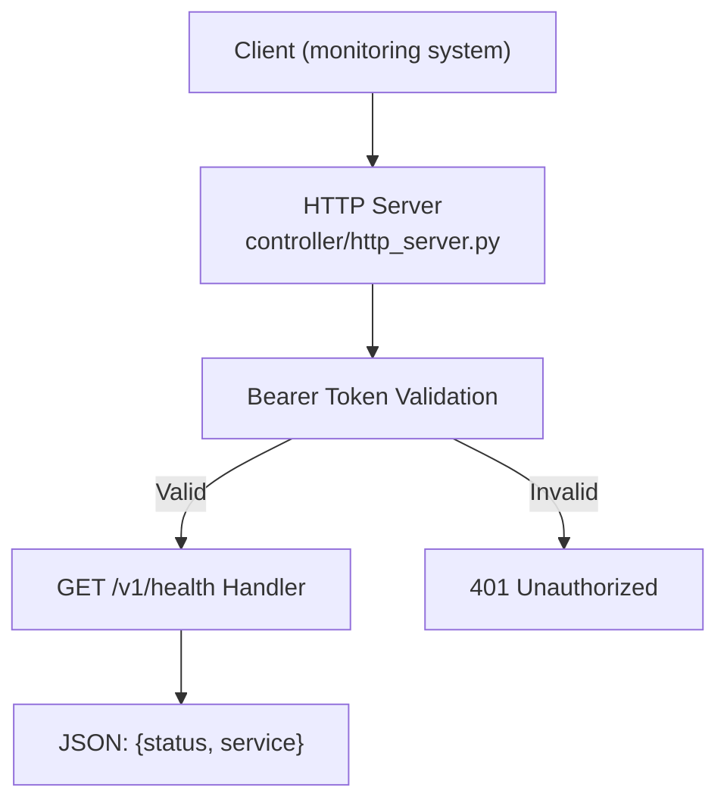
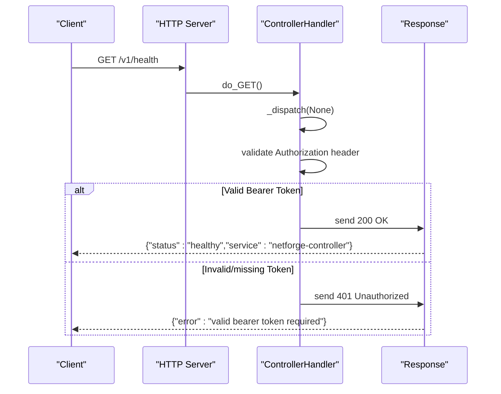
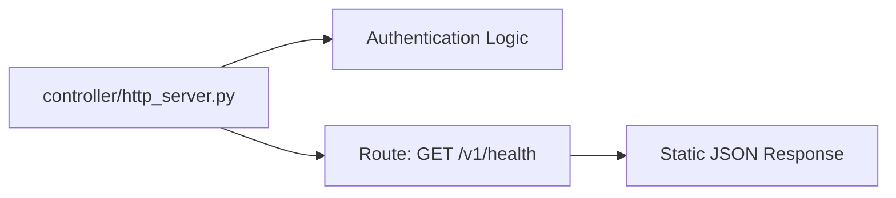

# Health Monitoring

<cite>
**Referenced Files in This Document**
- [controller/http_server.py](file://controller/http_server.py)
- [controller/service.py](file://controller/service.py)
- [controller/models.py](file://controller/models.py)
- [controller/config.py](file://controller/config.py)
- [controller/__main__.py](file://controller/__main__.py)
- [tests/test_controller_http.py](file://tests/test_controller_http.py)
</cite>

## Table of Contents
1. [Introduction](#introduction)
2. [Project Structure](#project-structure)
3. [Core Components](#core-components)
4. [Architecture Overview](#architecture-overview)
5. [Detailed Component Analysis](#detailed-component-analysis)
6. [Dependency Analysis](#dependency-analysis)
7. [Performance Considerations](#performance-considerations)
8. [Troubleshooting Guide](#troubleshooting-guide)
9. [Conclusion](#conclusion)
10. [Appendices](#appendices)

## Introduction
This document provides API documentation for the NetForge Controller health monitoring endpoint. It focuses on the GET /v1/health endpoint used to verify service availability and report controller status. It also includes guidance for integrating this endpoint into deployment pipelines, container orchestration systems, and load balancers, along with best practices for response time expectations and troubleshooting unhealthy states.

## Project Structure
The health endpoint is implemented within the controller’s HTTP server layer. The request flow authenticates incoming requests using a bearer token and dispatches to the appropriate handler based on the path. The health endpoint returns a simple JSON payload indicating that the controller process is healthy.

**Diagram sources**
- [controller/http_server.py:16-38](file://controller/http_server.py#L16-L38)

**Section sources**
- [controller/http_server.py:16-38](file://controller/http_server.py#L16-L38)
- [controller/__main__.py:14-21](file://controller/__main__.py#L14-L21)

## Core Components
- HTTP Request Handler: Implements routing and authentication for all controller endpoints, including /v1/health.
- Service Layer: Provides business logic; not required for the health endpoint but part of the overall controller architecture.
- Models: Define data structures for agent registration and job operations; not directly used by the health endpoint.
- Configuration: Supplies tokens and database path via environment variables; required for running the controller.

Key responsibilities:
- Validate Authorization header against a configured bearer token.
- Route GET /v1/health to return a minimal health response.
- Return standardized JSON responses with appropriate HTTP status codes.

**Section sources**
- [controller/http_server.py:16-55](file://controller/http_server.py#L16-L55)
- [controller/service.py:17-51](file://controller/service.py#L17-L51)
- [controller/models.py:13-38](file://controller/models.py#L13-L38)
- [controller/config.py:9-21](file://controller/config.py#L9-L21)

## Architecture Overview
The controller exposes an authenticated HTTP API. The health endpoint is intentionally lightweight and does not depend on external services or databases. Authentication is enforced at the HTTP handler level before any route-specific logic executes.

**Diagram sources**
- [controller/http_server.py:16-38](file://controller/http_server.py#L16-L38)

## Detailed Component Analysis

### GET /v1/health Endpoint
- Method: GET
- Path: /v1/health
- Authentication: Required. Must include Authorization: Bearer <token>.
- Success Response:
  - Status Code: 200 OK
  - Body: JSON object with fields:
    - status: string indicating health state (e.g., "healthy")
    - service: string identifying the service name (e.g., "netforge-controller")
- Error Responses:
  - 401 Unauthorized: Missing or invalid Authorization header.
  - 404 Not Found: Unknown endpoint.
  - 400 Bad Request: Validation errors from other endpoints (not applicable to /v1/health).

Implementation notes:
- The handler checks the Authorization header using constant-time comparison to prevent timing attacks.
- The health response is static and does not query dependencies, ensuring fast and deterministic responses.

Best practices:
- Use short timeouts (e.g., 1–2 seconds) for health checks.
- Expect near-zero CPU and memory overhead per check.
- Avoid relying on this endpoint for dependency health; use it only for liveness checks.

Integration examples:
- Kubernetes Liveness Probe: Configure an HTTP GET probe to /v1/health with a bearer token secret mounted as an environment variable or header injection if supported by your orchestrator.
- Load Balancer Health Checks: Point the LB’s health check to /v1/health with the required Authorization header.
- CI/CD Pipeline: Add a step that curls /v1/health after deploying the controller to confirm readiness before proceeding.

Security considerations:
- Protect the endpoint with a strong bearer token.
- Restrict network access to trusted monitoring systems.
- Log failed auth attempts for auditability.

**Section sources**
- [controller/http_server.py:16-38](file://controller/http_server.py#L16-L38)
- [controller/config.py:9-21](file://controller/config.py#L9-L21)

### Authentication Flow
- All controller endpoints require a valid bearer token.
- The Authorization header must match the configured controller token exactly.
- Unauthenticated requests receive a 401 Unauthorized response with an error message.

Operational guidance:
- Store the token securely (environment variables, secrets management).
- Rotate tokens periodically and update monitoring systems accordingly.
- Ensure consistent token configuration across deployments.

**Section sources**
- [controller/http_server.py:30-34](file://controller/http_server.py#L30-L34)
- [controller/config.py:15-21](file://controller/config.py#L15-L21)

### Process Startup and Configuration
- The controller process reads configuration from environment variables:
  - NETFORGE_CONTROLLER_TOKEN: Bearer token for controller API.
  - NETFORGE_AGENT_TOKEN: Token used for agent communication.
  - NETFORGE_CONTROLLER_DB: Optional path to the controller database file.
- The main entry point parses CLI arguments for host and port and starts the HTTP server.

Deployment tips:
- Provide tokens via secure secret stores.
- Set host to 0.0.0.0 for containerized deployments to expose the API externally.
- Choose a stable port and configure firewalls/load balancers accordingly.

**Section sources**
- [controller/config.py:9-21](file://controller/config.py#L9-L21)
- [controller/__main__.py:14-21](file://controller/__main__.py#L14-L21)

## Dependency Analysis
The health endpoint has minimal dependencies:
- HTTP server module for request handling.
- No external service calls or database queries during health checks.
- Authentication relies on in-memory token comparison.

**Diagram sources**
- [controller/http_server.py:16-38](file://controller/http_server.py#L16-L38)

**Section sources**
- [controller/http_server.py:16-38](file://controller/http_server.py#L16-L38)

## Performance Considerations
- Response Time: Expect sub-millisecond processing since the endpoint returns a static payload.
- Resource Usage: Negligible CPU and memory footprint per request.
- Concurrency: The server uses a threaded HTTP server; health checks scale well under moderate load.
- Network Overhead: Keep health check intervals reasonable (e.g., every 5–15 seconds) to avoid unnecessary traffic.

Recommendations:
- Tune health check frequency based on deployment needs.
- Monitor upstream network latency to ensure timely detection of failures.
- Avoid chaining multiple health checks in series; keep each check independent.

[No sources needed since this section provides general guidance]

## Troubleshooting Guide
Common issues and resolutions:
- 401 Unauthorized:
  - Cause: Missing or incorrect Authorization header.
  - Resolution: Verify the bearer token matches NETFORGE_CONTROLLER_TOKEN and is correctly set in the client request.
- 404 Not Found:
  - Cause: Incorrect path or unknown endpoint.
  - Resolution: Ensure the request targets exactly /v1/health.
- High Latency or Timeouts:
  - Cause: Network issues, firewall rules, or misconfigured load balancer.
  - Resolution: Check connectivity, TLS termination settings, and timeout configurations.
- Unexpected Behavior After Deployment:
  - Cause: Environment variables not propagated or tokens mismatched.
  - Resolution: Confirm environment variables are set and accessible to the controller process.

Diagnostic steps:
- Validate the Authorization header format: "Authorization: Bearer <token>".
- Test locally with curl or a similar tool to isolate environment issues.
- Inspect logs for unauthorized access attempts or server errors.

**Section sources**
- [controller/http_server.py:30-34](file://controller/http_server.py#L30-L34)
- [controller/http_server.py:52-55](file://controller/http_server.py#L52-L55)
- [tests/test_controller_http.py:17-35](file://tests/test_controller_http.py#L17-L35)

## Conclusion
The NetForge Controller’s /v1/health endpoint provides a simple, authenticated mechanism to verify service liveness. It returns a concise JSON payload with minimal overhead, making it suitable for integration into modern deployment and monitoring systems. By following the authentication requirements and best practices outlined here, teams can reliably incorporate health checks into their operational workflows.

[No sources needed since this section summarizes without analyzing specific files]

## Appendices

### API Reference Summary
- Endpoint: GET /v1/health
- Authentication: Required (Bearer token)
- Success Response:
  - 200 OK
  - Body: {"status": "healthy", "service": "netforge-controller"}
- Error Responses:
  - 401 Unauthorized: {"error": "valid bearer token required"}
  - 404 Not Found: {"error": "unknown endpoint"}

**Section sources**
- [controller/http_server.py:30-38](file://controller/http_server.py#L30-L38)
- [controller/http_server.py:52-55](file://controller/http_server.py#L52-L55)