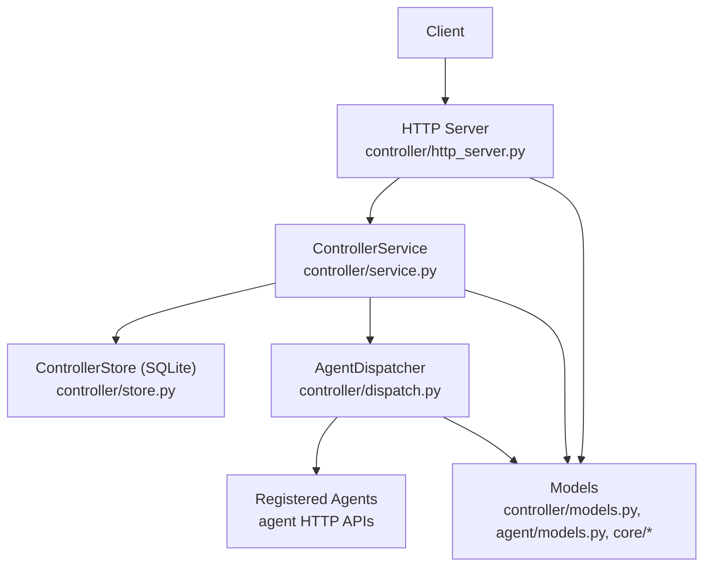
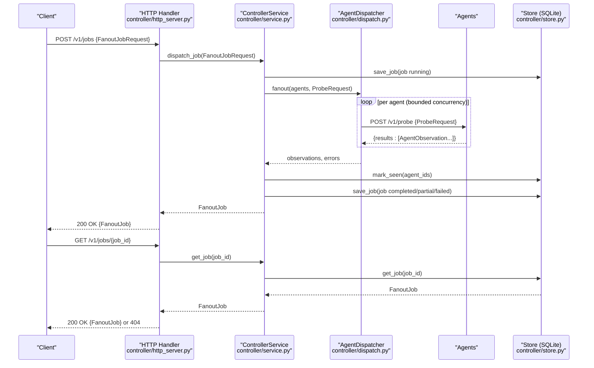
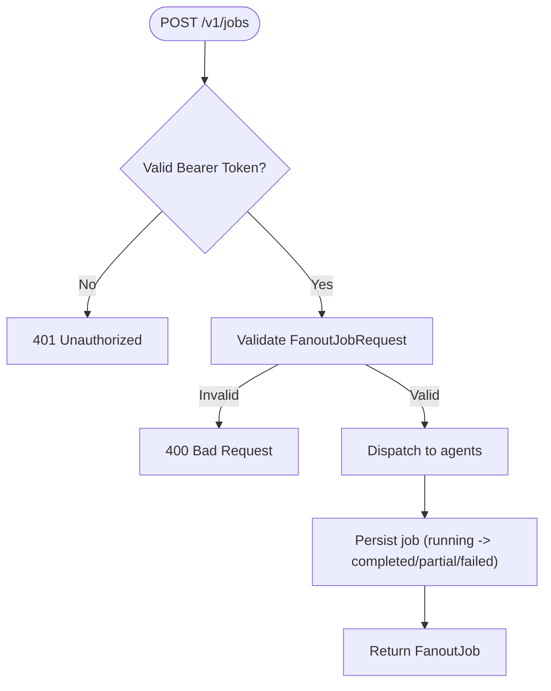
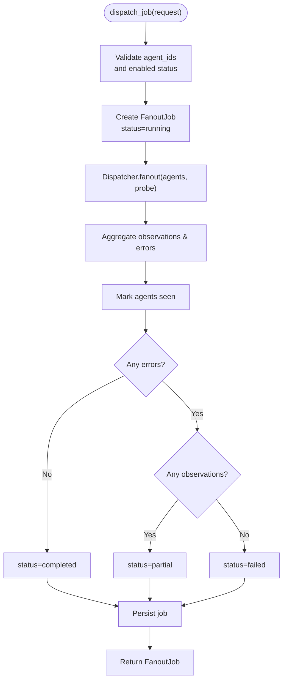
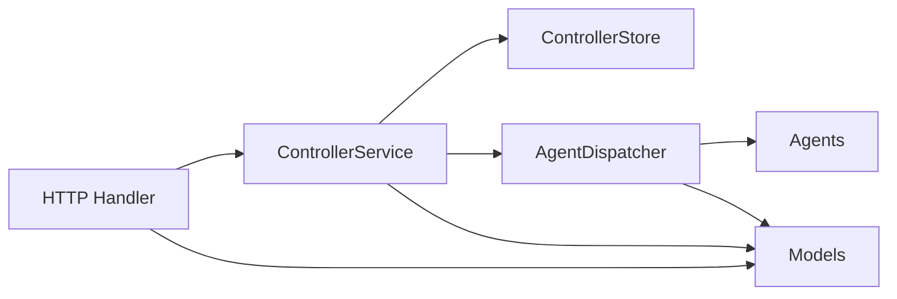

# Job Dispatching

<cite>
**Referenced Files in This Document**
- [http_server.py](file://controller/http_server.py)
- [service.py](file://controller/service.py)
- [dispatch.py](file://controller/dispatch.py)
- [models.py](file://controller/models.py)
- [store.py](file://controller/store.py)
- [models.py](file://agent/models.py)
- [remote_observation.py](file://core/remote_observation.py)
- [result.py](file://core/result.py)
- [observation.py](file://core/observation.py)
- [test_controller_http.py](file://tests/test_controller_http.py)
- [test_controller_service.py](file://tests/test_controller_service.py)
</cite>

## Table of Contents
1. [Introduction](#introduction)
2. [Project Structure](#project-structure)
3. [Core Components](#core-components)
4. [Architecture Overview](#architecture-overview)
5. [Detailed Component Analysis](#detailed-component-analysis)
6. [Dependency Analysis](#dependency-analysis)
7. [Performance Considerations](#performance-considerations)
8. [Troubleshooting Guide](#troubleshooting-guide)
9. [Conclusion](#conclusion)
10. [Appendices](#appendices)

## Introduction
This document provides comprehensive API documentation for job dispatching endpoints in the NetForge Controller, focusing on:
- POST /v1/jobs: Create a distributed diagnostic job (fan-out to multiple agents).
- GET /v1/jobs/{job_id}: Retrieve job status and results.

It explains the FanoutJobRequest model, orchestration patterns, agent selection, distributed execution workflows, queuing behavior, timeout handling, retry policies, scalability considerations, and practical examples for launching multi-agent diagnostics, monitoring progress, handling failures, and collecting aggregated results.

## Project Structure
The job dispatching feature spans several modules:
- HTTP API surface: controller/http_server.py
- Orchestration logic: controller/service.py
- Distributed dispatch to agents: controller/dispatch.py
- Data models: controller/models.py, agent/models.py, core/remote_observation.py, core/result.py, core/observation.py
- Persistence: controller/store.py
- Tests demonstrating usage: tests/test_controller_http.py, tests/test_controller_service.py

**Diagram sources**
- [http_server.py:16-55](file://controller/http_server.py#L16-L55)
- [service.py:17-51](file://controller/service.py#L17-L51)
- [dispatch.py:19-52](file://controller/dispatch.py#L19-L52)
- [store.py:13-78](file://controller/store.py#L13-L78)
- [models.py:13-38](file://controller/models.py#L13-L38)
- [models.py:23-41](file://agent/models.py#L23-L41)
- [remote_observation.py:15-59](file://core/remote_observation.py#L15-L59)

**Section sources**
- [http_server.py:16-55](file://controller/http_server.py#L16-L55)
- [service.py:17-51](file://controller/service.py#L17-L51)
- [dispatch.py:19-52](file://controller/dispatch.py#L19-L52)
- [store.py:13-78](file://controller/store.py#L13-L78)
- [models.py:13-38](file://controller/models.py#L13-L38)
- [models.py:23-41](file://agent/models.py#L23-L41)
- [remote_observation.py:15-59](file://core/remote_observation.py#L15-L59)

## Core Components
- HTTP handler routes:
  - POST /v1/jobs: Validates request body as FanoutJobRequest, delegates to service.dispatch_job, returns created job.
  - GET /v1/jobs/{job_id}: Retrieves job by ID from store; returns 404 if not found.
- ControllerService:
  - Validates agent IDs against registered agents (must exist and be enabled).
  - Creates a FanoutJob with initial status "running", persists it, fans out to agents, aggregates observations/errors, updates final status ("completed", "partial", or "failed"), and persists again.
- AgentDispatcher:
  - Sends ProbeRequest to each agent concurrently using a bounded thread pool.
  - Collects per-agent observations and errors, returning both maps.
- Models:
  - FanoutJobRequest: Specifies which agents to target and the probe to run.
  - FanoutJob: Encapsulates job lifecycle, request, status, observations, errors, and metadata.
  - ProbeRequest: Defines probe type, parameters, and timeouts.
  - AgentObservation and RemoteObservationContext: Standardized observation envelope returned by agents.
- Store:
  - SQLite-backed persistence for agents and jobs, including upserts and retrieval.

**Section sources**
- [http_server.py:30-55](file://controller/http_server.py#L30-L55)
- [service.py:17-51](file://controller/service.py#L17-L51)
- [dispatch.py:19-52](file://controller/dispatch.py#L19-L52)
- [models.py:13-38](file://controller/models.py#L13-L38)
- [models.py:23-41](file://agent/models.py#L23-L41)
- [remote_observation.py:15-59](file://core/remote_observation.py#L15-L59)
- [store.py:13-78](file://controller/store.py#L13-L78)

## Architecture Overview
End-to-end flow for creating and retrieving a job:

**Diagram sources**
- [http_server.py:30-55](file://controller/http_server.py#L30-L55)
- [service.py:30-51](file://controller/service.py#L30-L51)
- [dispatch.py:24-52](file://controller/dispatch.py#L24-L52)
- [store.py:60-78](file://controller/store.py#L60-L78)

## Detailed Component Analysis

### API Endpoints

#### POST /v1/jobs
- Purpose: Create a distributed diagnostic job that fans out a single ProbeRequest to one or more registered agents.
- Authentication: Requires Authorization header with Bearer token matching server configuration.
- Request body: FanoutJobRequest
  - agent_ids: list[str], min 1, max 32
  - probe: ProbeRequest
- Response: 200 OK with FanoutJob object containing job_id, timestamps, request, status, observations, errors, metadata.
- Error responses:
  - 400 Bad Request: Validation errors (e.g., invalid probe fields), unknown or disabled agents.
  - 401 Unauthorized: Missing or invalid bearer token.
  - 404 Not Found: Unknown endpoint.

**Diagram sources**
- [http_server.py:30-55](file://controller/http_server.py#L30-L55)
- [service.py:30-51](file://controller/service.py#L30-L51)

**Section sources**
- [http_server.py:30-55](file://controller/http_server.py#L30-L55)
- [models.py:24-38](file://controller/models.py#L24-L38)
- [models.py:23-41](file://agent/models.py#L23-L41)

#### GET /v1/jobs/{job_id}
- Purpose: Retrieve the current state and results of a previously created job.
- Authentication: Same Bearer token requirement.
- Response: 200 OK with FanoutJob if found; 404 Not Found if missing.
- Use cases: Polling for completion, aggregating results across agents, post-processing diagnostics.

**Section sources**
- [http_server.py:46-51](file://controller/http_server.py#L46-L51)
- [service.py:49-51](file://controller/service.py#L49-L51)
- [store.py:74-78](file://controller/store.py#L74-L78)

### FanoutJobRequest Model
- Fields:
  - agent_ids: list[str] — targets for the job; duplicates are deduplicated during processing.
  - probe: ProbeRequest — defines the diagnostic operation to execute on each agent.
- Validation:
  - Enforces minimum/maximum lengths for agent_ids.
  - Delegates validation to ProbeRequest (probe_type constraints, required fields like target/port).

**Section sources**
- [models.py:24-27](file://controller/models.py#L24-L27)
- [models.py:23-41](file://agent/models.py#L23-L41)

### ProbeRequest Model
- Fields:
  - probe_type: Enum (icmp, tcp, dns, traceroute, interfaces, route, gateway)
  - target: string or null (required for targeted probes)
  - port: int or null (required for tcp; only valid for tcp)
  - count: int (1–20)
  - max_hops: int (1–64)
  - timeout_seconds: float (>0, ≤30)
  - source_interface: string or null
- Validation rules ensure logical consistency (e.g., target required for certain types, port restrictions).

**Section sources**
- [models.py:10-41](file://agent/models.py#L10-L41)

### Agent Selection Algorithm
- The controller does not implement dynamic selection algorithms; it executes the job against explicitly provided agent_ids.
- Deduplication: Duplicate agent_ids in the request are removed before dispatch to avoid redundant work.
- Eligibility: Only agents that are registered and enabled are accepted; otherwise, an error is raised.

**Section sources**
- [service.py:30-37](file://controller/service.py#L30-L37)

### Distributed Execution Workflow
- Concurrency: Uses a ThreadPoolExecutor with a bounded number of workers to fan out requests to agents concurrently.
- Timeouts: Each agent call uses a timeout derived from ProbeRequest.timeout_seconds plus a small buffer.
- Aggregation: Observations and errors are collected per agent; successful calls update last_seen_at for those agents.
- Final status:
  - "completed": All agents succeeded
  - "partial": Some succeeded, some failed
  - "failed": None succeeded

**Diagram sources**
- [service.py:30-51](file://controller/service.py#L30-L51)
- [dispatch.py:40-52](file://controller/dispatch.py#L40-L52)

**Section sources**
- [service.py:30-51](file://controller/service.py#L30-L51)
- [dispatch.py:24-52](file://controller/dispatch.py#L24-L52)

### Observation Envelope and Results
- AgentObservation: Combines RemoteObservationContext and DiagnosticResult.
- RemoteObservationContext: Provenance metadata including agent_id, hostname, timestamps, topology tags, evidence quality, and confidence.
- DiagnosticResult: Standardized outcome with module, category, status, severity, summary, metrics, evidence, warnings, errors, and metadata.

**Section sources**
- [remote_observation.py:15-59](file://core/remote_observation.py#L15-L59)
- [result.py:9-47](file://core/result.py#L9-L47)
- [observation.py:13-63](file://core/observation.py#L13-L63)

### Persistence Layer
- SQLite tables:
  - agents: stores agent identity, URL, tags, enabled flag, last_seen_at
  - jobs: stores job_id, timestamps, status, serialized payload
- Operations:
  - Upsert agents, retrieve/list agents, mark last seen
  - Save jobs with idempotent upserts, retrieve jobs by ID

**Section sources**
- [store.py:13-78](file://controller/store.py#L13-L78)

## Dependency Analysis
Key relationships:
- HTTP handler depends on ControllerService for business logic.
- ControllerService depends on ControllerStore for persistence and AgentDispatcher for remote execution.
- AgentDispatcher depends on agent HTTP APIs and uses ProbeRequest and AgentObservation models.
- Models define contracts between components and external boundaries.

**Diagram sources**
- [http_server.py:16-55](file://controller/http_server.py#L16-L55)
- [service.py:17-51](file://controller/service.py#L17-L51)
- [dispatch.py:19-52](file://controller/dispatch.py#L19-L52)
- [models.py:13-38](file://controller/models.py#L13-L38)

**Section sources**
- [http_server.py:16-55](file://controller/http_server.py#L16-L55)
- [service.py:17-51](file://controller/service.py#L17-L51)
- [dispatch.py:19-52](file://controller/dispatch.py#L19-L52)
- [models.py:13-38](file://controller/models.py#L13-L38)

## Performance Considerations
- Concurrency control:
  - AgentDispatcher uses a bounded ThreadPoolExecutor; default worker count can be tuned via constructor parameter to balance throughput and resource usage.
- Timeouts:
  - Per-agent calls use ProbeRequest.timeout_seconds plus a small buffer; adjust timeout_seconds based on network conditions and probe complexity.
- Throughput:
  - Fan-out scales linearly with the number of agents within the worker limit; consider increasing max_workers for large-scale operations.
- Persistence:
  - SQLite provides simple, file-based storage; suitable for moderate load but may become a bottleneck under high write frequency. For heavy workloads, consider sharding or moving to a more scalable backend.
- Memory:
  - Observations are held in memory until job completion; for very large result sets, consider streaming or chunked aggregation strategies.

[No sources needed since this section provides general guidance]

## Troubleshooting Guide
Common issues and resolutions:
- 401 Unauthorized:
  - Ensure Authorization header contains the correct Bearer token configured for the controller.
- 400 Bad Request:
  - Validate FanoutJobRequest fields (agent_ids length, probe fields).
  - Check that all referenced agents are registered and enabled; otherwise, an UnknownAgentError is raised.
- 404 Not Found:
  - Job ID does not exist; verify creation response and subsequent polling.
- Agent communication failures:
  - Inspect dispatcher errors; network issues or agent downtime will populate job.errors with per-agent messages.
- Long-running jobs:
  - Increase ProbeRequest.timeout_seconds if probes exceed default limits; monitor agent responsiveness.

**Section sources**
- [http_server.py:30-55](file://controller/http_server.py#L30-L55)
- [service.py:30-51](file://controller/service.py#L30-L51)
- [dispatch.py:24-52](file://controller/dispatch.py#L24-L52)

## Conclusion
The NetForge Controller exposes straightforward REST endpoints to create and query distributed diagnostic jobs. Jobs fan out to multiple agents concurrently, aggregate results, and persist their lifecycle states. While the current implementation lacks explicit queuing and retry mechanisms, it provides a solid foundation for building scalable distributed diagnostics with clear separation of concerns across HTTP, orchestration, dispatch, and persistence layers.

[No sources needed since this section summarizes without analyzing specific files]

## Appendices

### Practical Examples

- Launching a multi-agent ICMP probe:
  - POST /v1/jobs with agent_ids targeting multiple hosts and probe_type set to icmp with appropriate target.
  - Monitor progress via GET /v1/jobs/{job_id}.
  - Collect aggregated results from job.observations per agent.

- Monitoring job progress:
  - Poll GET /v1/jobs/{job_id} until status transitions to completed, partial, or failed.
  - Inspect job.errors for per-agent failure details.

- Handling job failures:
  - If status is partial or failed, review errors map to identify problematic agents.
  - Re-run targeted probes for affected agents after remediation.

- Collecting aggregated results:
  - Iterate over job.observations to extract DiagnosticResult objects and compute overall health or generate reports.

[No sources needed since this section provides general guidance]

### Queuing, Retries, and Scalability Notes
- Queuing:
  - The current design processes jobs synchronously within the HTTP request; there is no background queue. For asynchronous processing, integrate a message broker or task queue.
- Retries:
  - No built-in retry policy exists; implement retries at the client level or extend AgentDispatcher to include retry logic with backoff.
- Scalability:
  - Increase max_workers in AgentDispatcher for higher concurrency.
  - Tune ProbeRequest.timeout_seconds and agent capacity to match workload characteristics.
  - Consider horizontal scaling of controllers behind a load balancer if multiple independent clusters are used.

[No sources needed since this section provides general guidance]