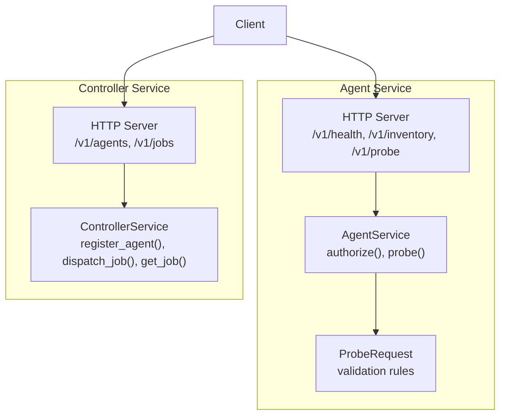
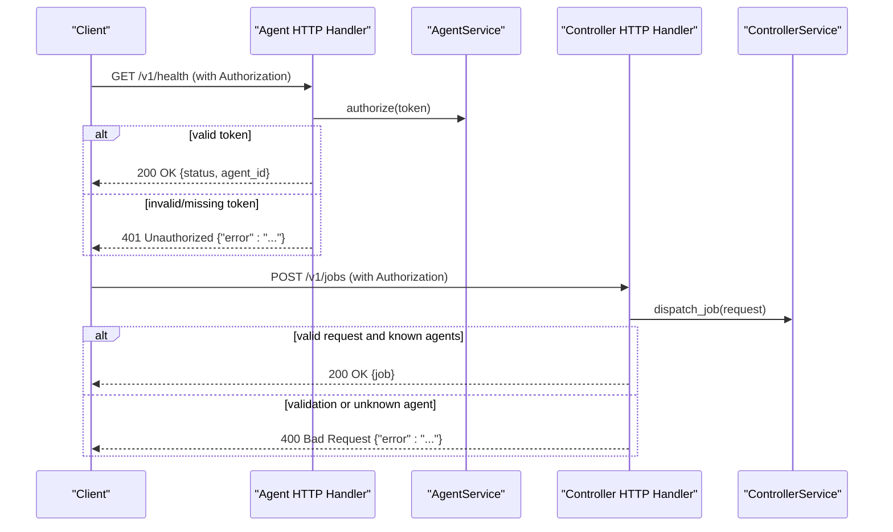
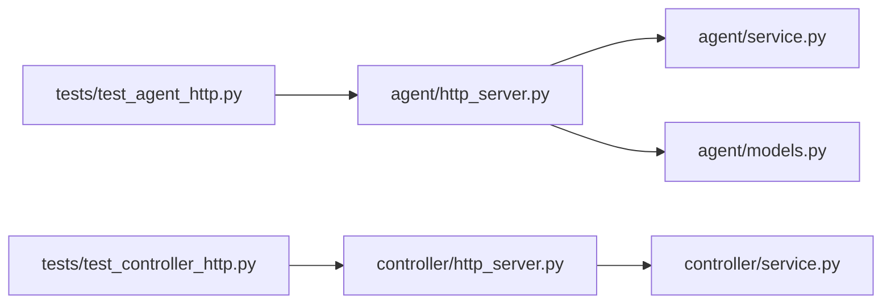

# Error Handling & Status Codes

<cite>
**Referenced Files in This Document**
- [agent/http_server.py](file://agent/http_server.py)
- [agent/service.py](file://agent/service.py)
- [agent/models.py](file://agent/models.py)
- [controller/http_server.py](file://controller/http_server.py)
- [controller/service.py](file://controller/service.py)
- [core/result.py](file://core/result.py)
- [tests/test_agent_http.py](file://tests/test_agent_http.py)
- [tests/test_controller_http.py](file://tests/test_controller_http.py)
</cite>

## Table of Contents
1. Introduction
2. Project Structure
3. Core Components
4. Architecture Overview
5. Detailed Component Analysis
6. Dependency Analysis
7. Performance Considerations
8. Troubleshooting Guide
9. Conclusion
10. Appendices

## Introduction
This document explains NetForge’s error handling patterns and HTTP status codes across the Agent and Controller services. It covers validation errors, authorization failures, target-not-allowed errors, service-specific exceptions, error response formats, common scenarios, debugging strategies, client-side retry logic, logging conventions, and production monitoring guidance.

## Project Structure
NetForge exposes two HTTP services:
- Agent API (port 8081 by default): provides health, inventory, and probe endpoints with bearer token authorization and allow-listed targets.
- Controller API (port 8080 by default): provides agent registration, job dispatching, and job retrieval with bearer token authorization.



**Diagram sources**
- [agent/http_server.py:15-58](file://agent/http_server.py#L15-L58)
- [agent/service.py:33-90](file://agent/service.py#L33-L90)
- [agent/models.py:23-40](file://agent/models.py#L23-L40)
- [controller/http_server.py:16-68](file://controller/http_server.py#L16-L68)
- [controller/service.py:17-50](file://controller/service.py#L17-L50)

**Section sources**
- [agent/http_server.py:15-58](file://agent/http_server.py#L15-L58)
- [controller/http_server.py:16-68](file://controller/http_server.py#L16-L68)

## Core Components
- Authorization: Both services require a Bearer token in the Authorization header. Missing or invalid tokens result in 401 Unauthorized.
- Validation: Request bodies are validated using Pydantic models; validation failures return 400 Bad Request.
- Target Allow-listing: The Agent enforces allowed targets for certain probes; violations return 400 Bad Request.
- Service Exceptions: Controller raises UnknownAgentError for unknown or disabled agents; mapped to 400 Bad Request at the HTTP layer.
- Not Found: Unknown endpoints and missing jobs return 404 Not Found.

**Section sources**
- [agent/http_server.py:30-45](file://agent/http_server.py#L30-L45)
- [controller/http_server.py:30-55](file://controller/http_server.py#L30-L55)
- [agent/service.py:25-71](file://agent/service.py#L25-L71)
- [controller/service.py:13-50](file://controller/service.py#L13-L50)

## Architecture Overview
The HTTP handlers centralize error mapping from domain exceptions and validation errors to standardized JSON responses with appropriate HTTP status codes.



**Diagram sources**
- [agent/http_server.py:30-45](file://agent/http_server.py#L30-L45)
- [controller/http_server.py:30-55](file://controller/http_server.py#L30-L55)
- [agent/service.py:37-40](file://agent/service.py#L37-L40)
- [controller/service.py:30-47](file://controller/service.py#L30-L47)

## Detailed Component Analysis

### Agent HTTP API Error Handling
- Authentication:
  - Missing or invalid Authorization header results in 401 Unauthorized with a JSON error object.
- Validation:
  - Invalid ProbeRequest fields (e.g., missing target for targeted probes, invalid port usage) raise validation errors that map to 400 Bad Request.
- Target Allowed:
  - Probes targeting hosts not configured in allowed_targets return 400 Bad Request with a descriptive message.
- Unknown Endpoint:
  - Unrecognized paths return 404 Not Found.

```mermaid
flowchart TD
Start(["POST /v1/probe"]) --> Auth{"Authorization valid?"}
Auth --> |No| E401["401 Unauthorized<br/>{\"error\": \"...\"}"]
Auth --> |Yes| Validate["Validate ProbeRequest"]
Validate --> VOK{"Valid?"}
VOK --> |No| E400V["400 Bad Request<br/>{\"error\": \"...\"}"]
VOK --> |Yes| CheckTarget{"Target allowed?"}
CheckTarget --> |No| E400T["400 Bad Request<br/>{\"error\": \"...\"}"]
CheckTarget --> |Yes| RunProbe["Run diagnostic probe"]
RunProbe --> Done(["Return 200 OK with results"])
```

**Diagram sources**
- [agent/http_server.py:30-45](file://agent/http_server.py#L30-L45)
- [agent/models.py:23-40](file://agent/models.py#L23-L40)
- [agent/service.py:58-71](file://agent/service.py#L58-L71)

**Section sources**
- [agent/http_server.py:30-45](file://agent/http_server.py#L30-L45)
- [agent/models.py:23-40](file://agent/models.py#L23-L40)
- [agent/service.py:58-71](file://agent/service.py#L58-L71)

### Controller HTTP API Error Handling
- Authentication:
  - Missing or invalid Authorization header results in 401 Unauthorized.
- Validation:
  - Invalid request payloads (e.g., bad URLs, invalid agent_ids ranges) return 400 Bad Request.
- Unknown Agent:
  - Dispatching jobs to unknown or disabled agents returns 400 Bad Request.
- Not Found:
  - Retrieving a non-existent job returns 404 Not Found.
- Unknown Endpoint:
  - Unrecognized paths return 404 Not Found.

```mermaid
flowchart TD
StartC(["POST /v1/jobs"]) --> AuthC{"Authorization valid?"}
AuthC --> |No| E401C["401 Unauthorized<br/>{\"error\": \"...\"}"]
AuthC --> |Yes| ValidateC["Validate FanoutJobRequest"]
ValidateC --> VOKC{"Valid?"}
VOKC --> |No| E400VC["400 Bad Request<br/>{\"error\": \"...\"}"]
VOKC --> |Yes| Dispatch["Dispatch to agents"]
Dispatch --> DOK{"All agents known & enabled?"}
DOK --> |No| E400UA["400 Bad Request<br/>{\"error\": \"...\"}"]
DOK --> |Yes| ReturnJob["Return 200 OK with job"]
```

**Diagram sources**
- [controller/http_server.py:30-55](file://controller/http_server.py#L30-L55)
- [controller/service.py:30-47](file://controller/service.py#L30-L47)

**Section sources**
- [controller/http_server.py:30-55](file://controller/http_server.py#L30-L55)
- [controller/service.py:30-47](file://controller/service.py#L30-L47)

### Error Response Format
All error responses are JSON objects with an error field containing a human-readable message. Examples include:
- 400 Bad Request: validation errors, target not allowed, unknown agent
- 401 Unauthorized: missing or invalid bearer token
- 404 Not Found: unknown endpoint or job not found

Successful responses follow consistent structures:
- Health endpoints return status and identity information
- Job endpoints return structured job objects including observations and errors

**Section sources**
- [agent/http_server.py:47-53](file://agent/http_server.py#L47-L53)
- [controller/http_server.py:57-63](file://controller/http_server.py#L57-L63)
- [controller/service.py:29-37](file://controller/service.py#L29-L37)

### Diagnostic Result Model
Diagnostic modules produce standardized results used throughout NetForge. These include status, severity, metrics, evidence, warnings, and errors. While not directly returned by HTTP APIs, they inform downstream analysis and reporting.

**Section sources**
- [core/result.py:9-47](file://core/result.py#L9-L47)

## Dependency Analysis
- Agent HTTP handler depends on AgentService for authorization and probing, and on ProbeRequest for validation.
- Controller HTTP handler depends on ControllerService for orchestration and store access.
- Tests verify authentication enforcement and expected status codes.



**Diagram sources**
- [agent/http_server.py:15-58](file://agent/http_server.py#L15-L58)
- [agent/service.py:33-90](file://agent/service.py#L33-L90)
- [agent/models.py:23-40](file://agent/models.py#L23-L40)
- [controller/http_server.py:16-68](file://controller/http_server.py#L16-L68)
- [controller/service.py:17-50](file://controller/service.py#L17-L50)
- [tests/test_agent_http.py:12-33](file://tests/test_agent_http.py#L12-L33)
- [tests/test_controller_http.py:17-39](file://tests/test_controller_http.py#L17-L39)

**Section sources**
- [tests/test_agent_http.py:12-33](file://tests/test_agent_http.py#L12-L33)
- [tests/test_controller_http.py:17-39](file://tests/test_controller_http.py#L17-L39)

## Performance Considerations
- Keep requests small and well-formed to minimize validation overhead.
- Use appropriate timeouts for client calls to avoid long waits during network diagnostics.
- Avoid excessive retries on 4xx errors; implement exponential backoff only for transient 5xx or network errors.
- Prefer batching where possible (e.g., fan-out jobs) to reduce per-request overhead.

[No sources needed since this section provides general guidance]

## Troubleshooting Guide
Common issues and resolutions:
- 401 Unauthorized: Ensure Authorization header contains a valid Bearer token matching the service configuration.
- 400 Bad Request:
  - Validation: Verify required fields and constraints (e.g., target presence for targeted probes, port validity for TCP).
  - Target not allowed: Confirm the target is included in the agent’s allowed_targets configuration.
  - Unknown agent: Ensure the agent is registered and enabled before dispatching jobs.
- 404 Not Found: Check endpoint paths and job IDs.

Debugging steps:
- Inspect request payloads against model constraints.
- Validate bearer tokens match configured values.
- Review logs around authorization and validation layers.
- Use health endpoints to confirm service readiness and identity.

**Section sources**
- [agent/http_server.py:30-45](file://agent/http_server.py#L30-L45)
- [controller/http_server.py:30-55](file://controller/http_server.py#L30-L55)
- [agent/models.py:23-40](file://agent/models.py#L23-L40)
- [agent/service.py:58-71](file://agent/service.py#L58-L71)
- [controller/service.py:30-47](file://controller/service.py#L30-L47)

## Conclusion
NetForge standardizes error handling by mapping domain exceptions and validation failures to clear HTTP status codes and consistent JSON error responses. The Agent enforces bearer token authorization and target allow-listing, while the Controller validates inputs and ensures agents are known and enabled. Clients should handle 4xx errors by correcting requests and avoid retrying them, reserving retries for transient server errors with backoff.

[No sources needed since this section summarizes without analyzing specific files]

## Appendices

### HTTP Status Code Reference
- 200 OK: Successful operations (health, inventory, job dispatch, job retrieval when found)
- 201 Created: New agent successfully registered
- 400 Bad Request: Validation errors, target not allowed, unknown agent
- 401 Unauthorized: Missing or invalid bearer token
- 404 Not Found: Unknown endpoint or job not found

**Section sources**
- [agent/http_server.py:30-45](file://agent/http_server.py#L30-L45)
- [controller/http_server.py:30-55](file://controller/http_server.py#L30-L55)

### Client Retry Logic Patterns
- Do not retry 4xx errors; fix the request or policy instead.
- For 5xx or network errors, use exponential backoff with jitter and a maximum retry count.
- Implement idempotency for job creation where applicable.
- Respect rate limits and backpressure signals if introduced later.

[No sources needed since this section provides general guidance]

### Logging Conventions and Monitoring
- Current handlers suppress default HTTP logging via overridden log_message methods.
- Recommended production practice:
  - Enable structured logging for request method, path, status code, latency, and user context (e.g., agent_id when available).
  - Log authorization failures and validation errors with sanitized details.
  - Emit metrics for error rates by status code and endpoint.
  - Integrate with centralized logging and alerting for spikes in 4xx/5xx responses.

[No sources needed since this section provides general guidance]