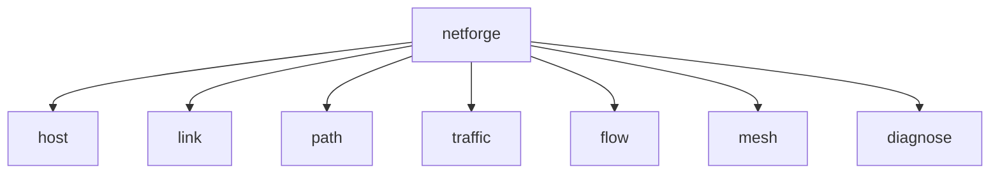
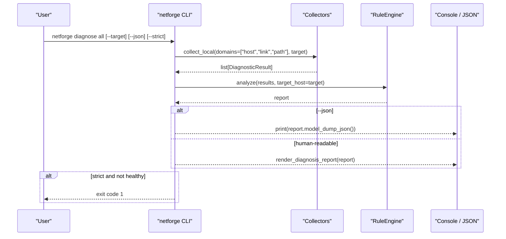
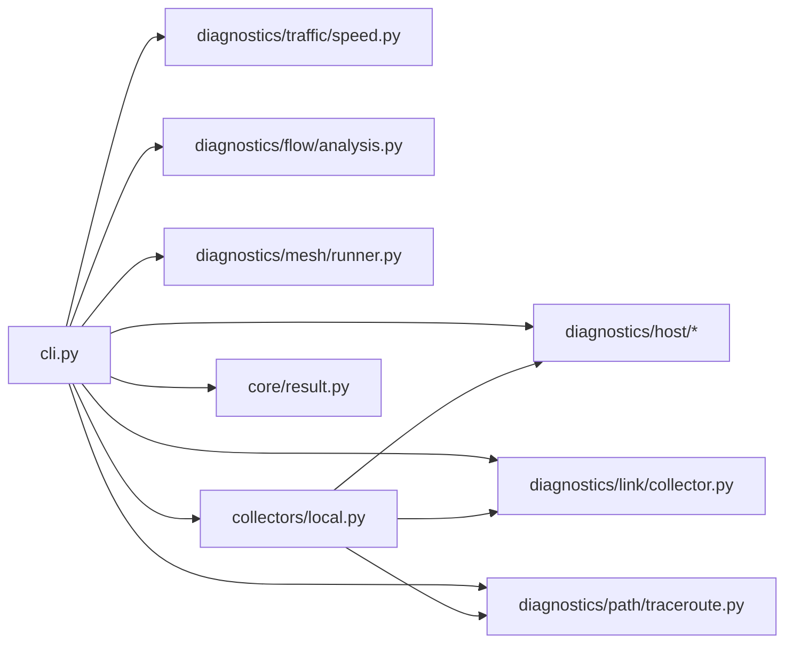

# CLI Reference

<cite>
**Referenced Files in This Document**
- [cli.py](file://cli.py)
- [README.md](file://README.md)
- [connectivity.py](file://diagnostics/host/connectivity.py)
- [interface.py](file://diagnostics/host/interface.py)
- [routing.py](file://diagnostics/host/routing.py)
- [dns.py](file://diagnostics/host/dns.py)
- [tcp_udp.py](file://diagnostics/host/tcp_udp.py)
- [packet_loss.py](file://diagnostics/host/packet_loss.py)
- [latency.py](file://diagnostics/host/latency.py)
- [collector.py](file://diagnostics/link/collector.py)
- [traceroute.py](file://diagnostics/path/traceroute.py)
- [speed.py](file://diagnostics/traffic/speed.py)
- [analysis.py](file://diagnostics/flow/analysis.py)
- [runner.py](file://diagnostics/mesh/runner.py)
- [local.py](file://collectors/local.py)
- [result.py](file://core/result.py)
</cite>

## Table of Contents
1. Introduction
2. Project Structure
3. Core Components
4. Architecture Overview
5. Detailed Component Analysis
6. Dependency Analysis
7. Performance Considerations
8. Troubleshooting Guide
9. Conclusion
10. Appendices

## Introduction
This document is a comprehensive CLI reference for NetForge, covering all commands and options for host diagnostics, link diagnostics, path diagnostics, traffic analysis, flow analysis, mesh diagnostics, and the unified diagnosis command. It includes syntax, parameters, output formats, common combinations, troubleshooting tips, help system usage, and automation patterns.

## Project Structure
NetForge exposes a hierarchical CLI built with Typer:
- Top-level app: netforge
- Subcommands: host, link, path, traffic, flow, mesh, diagnose
- Each subcommand groups related diagnostic capabilities (e.g., host connectivity, routing, DNS; link utilization/errors; path traceroute/hops; traffic speed/jitter/bandwidth; flow top/analyze; mesh run/status; diagnose host/path/link/all)

**Diagram sources**
- [cli.py:18-38](file://cli.py#L18-L38)

**Section sources**
- [cli.py:18-38](file://cli.py#L18-L38)
- [README.md:11-19](file://README.md#L11-L19)

## Core Components
- Unified result model: DiagnosticResult carries module, category, status, severity, summary, target, metrics, evidence, warnings, errors, metadata.
- Host diagnostics: connectivity, interfaces, routing, gateway, DNS, transport (TCP/UDP), packet loss, latency, resources.
- Link diagnostics: utilization, errors, congestion.
- Path diagnostics: traceroute, hop metrics, path-change detection.
- Traffic diagnostics: download speed, jitter, bandwidth sampling.
- Flow diagnostics: top talkers and elephant flows from offline flow exports.
- Mesh diagnostics: local multi-target ping mesh using topology or explicit targets.
- Unified diagnosis: RuleEngine-based root-cause across host, link, path domains.

**Section sources**
- [result.py:9-47](file://core/result.py#L9-L47)
- [cli.py:46-196](file://cli.py#L46-L196)
- [collector.py:29-210](file://diagnostics/link/collector.py#L29-L210)
- [traceroute.py:115-359](file://diagnostics/path/traceroute.py#L115-L359)
- [speed.py:22-152](file://diagnostics/traffic/speed.py#L22-L152)
- [analysis.py:20-106](file://diagnostics/flow/analysis.py#L20-L106)
- [runner.py:18-114](file://diagnostics/mesh/runner.py#L18-L114)
- [local.py:16-40](file://collectors/local.py#L16-L40)

## Architecture Overview
The CLI maps to diagnostic modules that return standardized DiagnosticResult objects. The diagnose family orchestrates collectors and feeds results into a rule engine for root-cause analysis.

**Diagram sources**
- [cli.py:551-573](file://cli.py#L551-L573)
- [local.py:16-40](file://collectors/local.py#L16-L40)

## Detailed Component Analysis

### Host Diagnostics
- Connectivity: checks reachability to default hosts on port 443 and reports latency.
  - Command: netforge host connectivity
  - Output: table with Host, Status, Latency
  - Notes: returns DiagnosticResult per host
- Interface: enumerates interfaces, state, IPv4/IPv6, MAC, speed, MTU.
  - Command: netforge host interface
  - Output: table with Interface, State, IPv4, MAC, Speed, MTU
- Routing: parses OS-specific routing tables to find default gateway and route count.
  - Command: netforge host routing [--verbose | -v]
  - Options:
    - --verbose, -v: print raw routing table
  - Output: table with Status, Default Gateway, Default Interface, Active Routes, Operating System; optional raw output
- Gateway: probes default gateway reachability.
  - Command: netforge host gateway [--count | -c]
  - Options:
    - --count, -c: number of probes (default 4)
  - Output: table with gateway reachability status
- DNS: resolves hostname and lists configured DNS servers.
  - Command: netforge host dns [--hostname | -h]
  - Options:
    - --hostname, -h: hostname to resolve (default google.com)
  - Output: table with Hostname, DNS Servers, Status, Resolution Time, Addresses
- Transport (TCP/UDP): tests TCP/UDP reachability to common ports.
  - Command: netforge host transport [--host]
  - Options:
    - --host: target host (default 1.1.1.1)
  - Output: table with Protocol, Host, Port, Status, Latency
- Packet Loss: measures ICMP packet loss to default targets.
  - Command: netforge host packet-loss [--count | -c]
  - Options:
    - --count, -c: number of probes (default 5)
  - Output: table with Host, Loss, Status
- Latency: measures min/avg/max latency and jitter.
  - Command: netforge host latency [--count | -c]
  - Options:
    - --count, -c: number of probes (default 5)
  - Output: table with Host, Min, Avg, Max, Jitter, Status
- Resources: analyzes host resources and network activity.
  - Command: netforge host resources
  - Output: console panel/table summarizing resource/network interaction
- All: runs full host suite and optionally integrates RuleEngine.
  - Command: netforge host all [--strict] [--diagnose] [--target | -t]
  - Options:
    - --strict: exit code 1 if any degraded/failed
    - --diagnose: run RuleEngine for root-cause analysis
    - --target, -t: target host for analysis (default google.com)
  - Output: step-by-step panels, summary counts, findings, optional diagnosis report

Common parameter combinations:
- netforge host all --diagnose --target example.com
- netforge host routing --verbose
- netforge host dns --hostname myservice.local
- netforge host transport --host 1.1.1.1

Troubleshooting tips:
- If routing fails, ensure required OS utilities are available (route/ip/netstat).
- For DNS failures, verify resolv.conf (Linux/macOS) or netsh/Powershell (Windows).
- For transport failures, check firewall rules and service availability.

**Section sources**
- [connectivity.py:68-111](file://diagnostics/host/connectivity.py#L68-L111)
- [interface.py:112-147](file://diagnostics/host/interface.py#L112-L147)
- [routing.py:178-199](file://diagnostics/host/routing.py#L178-L199)
- [cli.py:58-72](file://cli.py#L58-L72)
- [dns.py:150-203](file://diagnostics/host/dns.py#L150-L203)
- [tcp_udp.py:185-226](file://diagnostics/host/tcp_udp.py#L185-L226)
- [packet_loss.py:80-121](file://diagnostics/host/packet_loss.py#L80-L121)
- [latency.py:84-125](file://diagnostics/host/latency.py#L84-L125)
- [cli.py:112-196](file://cli.py#L112-L196)

### Link Diagnostics
- Utilization: per-interface RX/TX Mbps and utilization percentage.
  - Command: netforge link util [--interval | -i]
  - Options:
    - --interval, -i: sampling interval in seconds (default 1.0)
  - Output: table with Interface, Util %, RX Mbps, TX Mbps, Status
- Errors: per-interface drops/errors per second.
  - Command: netforge link errors [--interval | -i]
  - Options:
    - --interval, -i: sampling interval in seconds (default 1.0)
  - Output: table with Interface, Drops/s, Errors/s, Status
- All: runs utilization, errors, and congestion together.
  - Command: netforge link all [--interval | -i]
  - Options:
    - --interval, -i: sampling interval in seconds (default 1.0)
  - Output: consolidated table with Interface, Util %, Drops/s, Congestion, Status

Common parameter combinations:
- netforge link all --interval 2
- netforge link util --interval 0.5

Troubleshooting tips:
- High utilization (>75%) may indicate congestion; correlate with error rates.
- Elevated drops/errors suggest physical or driver issues.

**Section sources**
- [collector.py:29-84](file://diagnostics/link/collector.py#L29-L84)
- [collector.py:87-129](file://diagnostics/link/collector.py#L87-L129)
- [collector.py:132-179](file://diagnostics/link/collector.py#L132-L179)
- [collector.py:182-210](file://diagnostics/link/collector.py#L182-L210)
- [cli.py:203-262](file://cli.py#L203-L262)

### Path Diagnostics
- Trace: traceroute to a target with max hops.
  - Command: netforge path trace [--target | -t] [--max-hops | -m]
  - Options:
    - --target, -t: destination IP/hostname (default 1.1.1.1)
    - --max-hops, -m: maximum hops (default 30)
  - Output: table with Hop, Address, Avg RTT, Loss
- Hops: aggregate per-hop latency and loss over multiple traces.
  - Command: netforge path hops [--target | -t] [--probes | -p]
  - Options:
    - --target, -t: destination IP/hostname (default 1.1.1.1)
    - --probes, -p: number of traceroutes to aggregate (default 2)
  - Output: table with Hop, Address, Avg RTT, Loss
- Diff: detect path change vs stored baseline.
  - Command: netforge path diff [--target | -t]
  - Options:
    - --target, -t: destination IP/hostname (default 1.1.1.1)
  - Output: summary line with status and evidence bullets
- All: traceroute plus path-change detection.
  - Command: netforge path all [--target | -t]
  - Options:
    - --target, -t: destination IP/hostname (default 1.1.1.1)
  - Output: traceroute table followed by path change summary

Common parameter combinations:
- netforge path trace --target 8.8.8.8 --max-hops 20
- netforge path hops --target 1.1.1.1 --probes 3
- netforge path diff --target example.com

Troubleshooting tips:
- Traceroute requires OS tools (tracert/traceroute); ensure they are installed.
- Path changes are detected via fingerprint comparison against stored baseline.

**Section sources**
- [traceroute.py:115-213](file://diagnostics/path/traceroute.py#L115-L213)
- [traceroute.py:216-276](file://diagnostics/path/traceroute.py#L216-L276)
- [traceroute.py:279-339](file://diagnostics/path/traceroute.py#L279-L339)
- [traceroute.py:342-359](file://diagnostics/path/traceroute.py#L342-L359)
- [cli.py:269-333](file://cli.py#L269-L333)

### Traffic Analysis
- Speed: estimate download goodput.
  - Command: netforge traffic speed [--url | -u]
  - Options:
    - --url, -u: download URL (default CloudSpeed endpoint)
  - Output: table with Goodput, Bytes, Elapsed, Status
- Jitter: measure RFC 3550 jitter to a host.
  - Command: netforge traffic jitter [--host | -h] [--count | -c]
  - Options:
    - --host, -h: target host (default 1.1.1.1)
    - --count, -c: number of samples (default 10)
  - Output: table with Host, Jitter, Avg RTT, Status
- Bandwidth: current interface bandwidth sample.
  - Command: netforge traffic bandwidth [--interval | -i]
  - Options:
    - --interval, -i: sampling interval in seconds (default 1.0)
  - Output: table with Interface, Total Mbps, Util %

Common parameter combinations:
- netforge traffic speed --url https://example.com/download.bin
- netforge traffic jitter --host 1.1.1.1 --count 20
- netforge traffic bandwidth --interval 2

Troubleshooting tips:
- Speed test depends on external server availability and network conditions.
- Jitter measurement uses ICMP; ensure ICMP is allowed.

**Section sources**
- [speed.py:22-71](file://diagnostics/traffic/speed.py#L22-L71)
- [speed.py:73-111](file://diagnostics/traffic/speed.py#L73-L111)
- [speed.py:124-152](file://diagnostics/traffic/speed.py#L124-L152)
- [cli.py:340-389](file://cli.py#L340-L389)

### Flow Analysis
- Top: show top talkers from offline flow export.
  - Command: netforge flow top <path>
  - Arguments:
    - path: JSON or JSONL flow export path
  - Output: table with Src, Dst, Bytes, Share
- Analyze: analyze flow records (elephants, top talkers).
  - Command: netforge flow analyze <path> [--json]
  - Arguments:
    - path: JSON or JSONL flow export path
  - Options:
    - --json: output JSON report
  - Output: summary and warnings (or JSON)

Common parameter combinations:
- netforge flow top ./flows_sample.json
- netforge flow analyze ./flows_sample.json --json

Troubleshooting tips:
- Ensure flow file format matches expected fields (src/dst, bytes/packets or delta counters).

**Section sources**
- [analysis.py:20-82](file://diagnostics/flow/analysis.py#L20-L82)
- [analysis.py:85-106](file://diagnostics/flow/analysis.py#L85-L106)
- [cli.py:396-422](file://cli.py#L396-L422)

### Mesh Diagnostics
- Run: execute a local ping-mesh to multiple targets.
  - Command: netforge mesh run [--targets | -t] [--topology] [--count | -c]
  - Options:
    - --targets, -t: comma-separated targets (default 1.1.1.1,8.8.8.8)
    - --topology: JSON topology file (overrides targets if provided)
    - --count, -c: probes per target (default 3)
  - Output: table with Target, Loss, Status
- Status: show mesh/agent capability status.
  - Command: netforge mesh status
  - Output: console messages indicating local mesh availability and agent API schema

Common parameter combinations:
- netforge mesh run --topology ./mesh_topology.json --count 5
- netforge mesh run --targets 1.1.1.1,8.8.8.8,9.9.9.9

Troubleshooting tips:
- Topology file must include 'targets' and/or 'edges'.
- Remote agents are stubbed; only local mesh is supported currently.

**Section sources**
- [runner.py:18-114](file://diagnostics/mesh/runner.py#L18-L114)
- [cli.py:429-455](file://cli.py#L429-L455)

### Unified Diagnosis
- Host: diagnose host-layer issues via RuleEngine.
  - Command: netforge diagnose host [--target | -t] [--json] [--strict]
  - Options:
    - --target, -t: target host (default google.com)
    - --json: output JSON report
    - --strict: exit code 1 if not healthy
  - Output: human-readable report or JSON
- Path: diagnose path-layer issues.
  - Command: netforge diagnose path [--target | -t] [--json] [--strict]
  - Options:
    - --target, -t: target IP/hostname (default 1.1.1.1)
    - --json: output JSON report
    - --strict: exit code 1 if not healthy
  - Output: human-readable report or JSON
- Link: diagnose link-layer issues.
  - Command: netforge diagnose link [--json] [--strict] [--interval | -i]
  - Options:
    - --json: output JSON report
    - --strict: exit code 1 if not healthy
    - --interval, -i: sampling interval in seconds (default 1.0)
  - Output: human-readable report or JSON
- All: merge host + link + path observations into one diagnosis.
  - Command: netforge diagnose all [--target | -t] [--json] [--strict]
  - Options:
    - --target, -t: target IP/hostname (default 1.1.1.1)
    - --json: output JSON report
    - --strict: exit code 1 if not healthy
  - Output: human-readable report or JSON

Common parameter combinations:
- netforge diagnose all --target example.com --json > report.json
- netforge diagnose host --strict && echo "Healthy" || echo "Issues found"

Integration patterns:
- Use --json for machine parsing in CI pipelines.
- Use --strict to enforce non-zero exit codes on failures for automation.

**Section sources**
- [cli.py:470-573](file://cli.py#L470-L573)
- [local.py:16-40](file://collectors/local.py#L16-L40)

## Dependency Analysis
The CLI composes diagnostic modules and returns standardized results consumed by the RuleEngine.

**Diagram sources**
- [cli.py:18-38](file://cli.py#L18-L38)
- [local.py:16-40](file://collectors/local.py#L16-L40)
- [result.py:24-47](file://core/result.py#L24-L47)

**Section sources**
- [cli.py:18-38](file://cli.py#L18-L38)
- [local.py:16-40](file://collectors/local.py#L16-L40)
- [result.py:24-47](file://core/result.py#L24-L47)

## Performance Considerations
- Sampling intervals: increase --interval for more stable utilization/error measurements but at the cost of longer runs.
- Probes: adjust --count/--probes to balance accuracy and runtime for packet loss, latency, jitter, and hop aggregation.
- Traceroute timeouts: large --max-hops can extend runtime; use conservative values for quick checks.
- External dependencies: speed tests rely on remote endpoints; consider caching or alternative URLs in constrained environments.

## Troubleshooting Guide
- OS utilities: routing and traceroute depend on platform tools (route/ip/netstat, tracert/traceroute). Ensure they are installed and accessible.
- Permissions: some operations may require elevated privileges (e.g., raw sockets or certain system calls).
- Network policies: firewalls or ACLs may block ICMP or UDP probes, affecting packet loss, jitter, and transport tests.
- DNS configuration: verify nameserver settings per OS; fallback mechanisms exist but may yield incomplete data.
- Exit codes: use --strict to enforce non-zero exits when unhealthy; integrate with scripts to fail builds or alert on issues.

**Section sources**
- [routing.py:81-175](file://diagnostics/host/routing.py#L81-L175)
- [traceroute.py:115-136](file://diagnostics/path/traceroute.py#L115-L136)
- [tcp_udp.py:16-87](file://diagnostics/host/tcp_udp.py#L16-L87)
- [dns.py:21-89](file://diagnostics/host/dns.py#L21-L89)
- [cli.py:112-196](file://cli.py#L112-L196)
- [cli.py:470-573](file://cli.py#L470-L573)

## Conclusion
NetForge’s CLI provides a consistent, extensible set of commands for diagnosing networks across host, link, path, traffic, flow, and mesh domains. Use individual commands for targeted checks or the diagnose family for integrated root-cause analysis. Leverage --json for automation and --strict for robust scripting in CI/CD and operational workflows.

## Appendices

### Help System Usage
- Show main help: netforge --help
- Show subcommand help: netforge host --help, netforge link --help, etc.
- Show option help: netforge host routing --help, netforge path trace --help

**Section sources**
- [cli.py:18-38](file://cli.py#L18-L38)

### Common Parameter Combinations
- Comprehensive host check with diagnosis: netforge host all --diagnose --target example.com
- Quick path change detection: netforge path diff --target 1.1.1.1
- Link health snapshot: netforge link all --interval 2
- Traffic quality: netforge traffic jitter --host 1.1.1.1 --count 20
- Offline flow analysis: netforge flow analyze ./flows_sample.json --json

**Section sources**
- [cli.py:112-196](file://cli.py#L112-L196)
- [cli.py:269-333](file://cli.py#L269-L333)
- [cli.py:340-389](file://cli.py#L340-L389)
- [cli.py:396-422](file://cli.py#L396-L422)

### Automation Patterns
- CI integration:
  - netforge diagnose all --json > report.json
  - netforge diagnose host --strict
  - netforge link all --interval 1
- Scripting:
  - Parse JSON outputs for dashboards or alerts
  - Use exit codes from --strict to gate deployments or trigger remediation

**Section sources**
- [cli.py:470-573](file://cli.py#L470-L573)