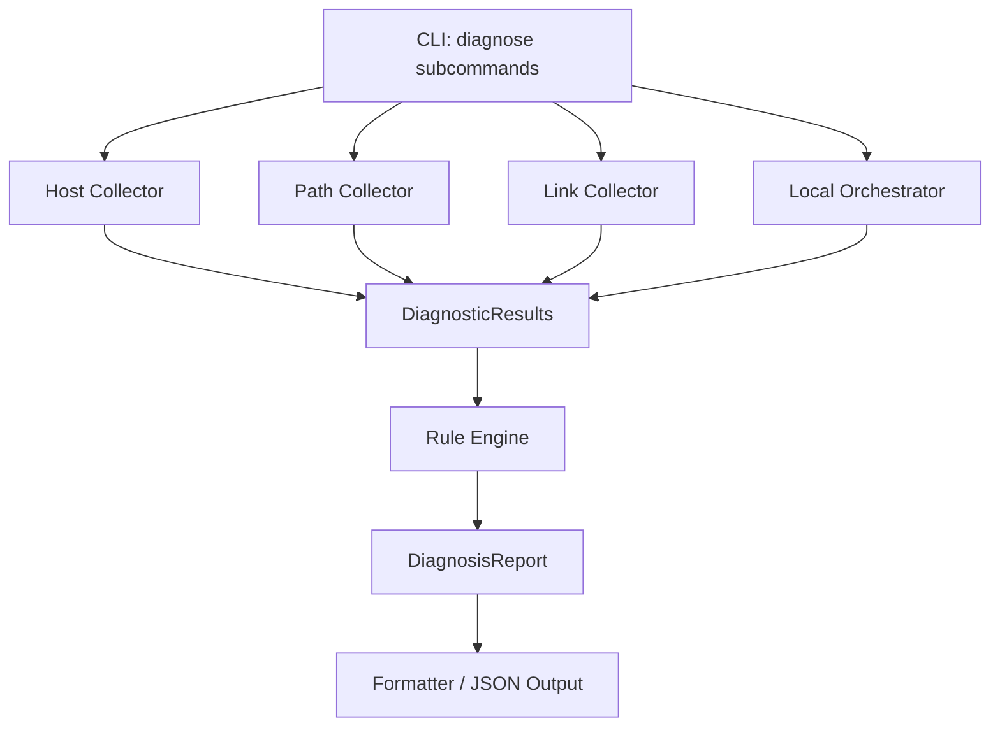
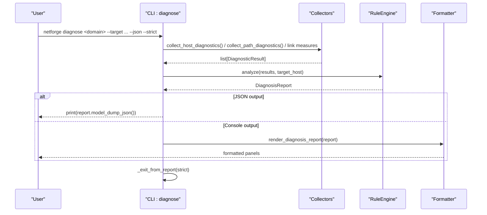
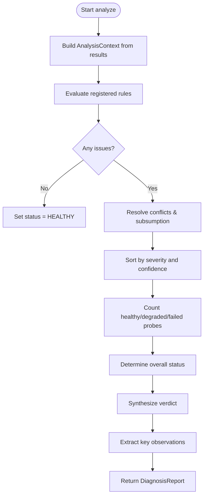
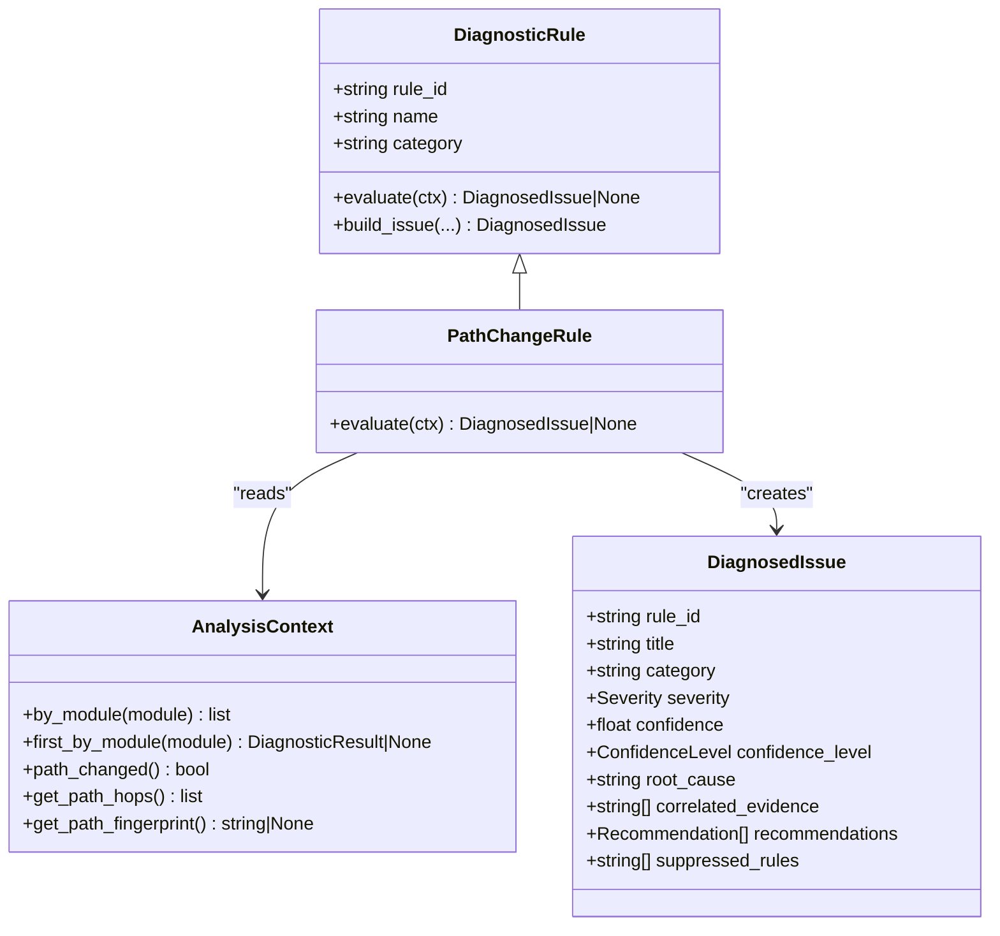
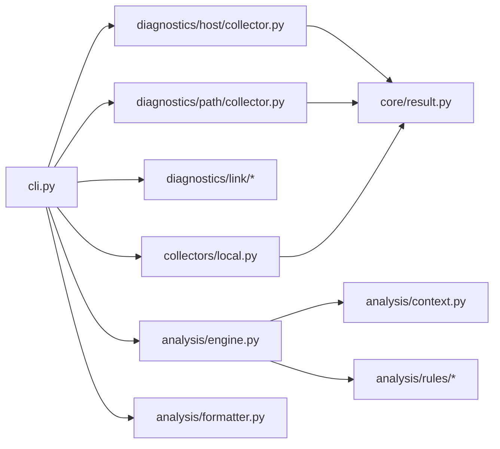

# Diagnose Commands

<cite>
**Referenced Files in This Document**
- [cli.py](file://cli.py)
- [engine.py](file://analysis/engine.py)
- [models.py](file://analysis/models.py)
- [formatter.py](file://analysis/formatter.py)
- [rule.py](file://analysis/rule.py)
- [context.py](file://analysis/context.py)
- [__init__.py](file://analysis/rules/__init__.py)
- [path_rules.py](file://analysis/rules/path_rules.py)
- [collector.py](file://diagnostics/host/collector.py)
- [collector.py](file://diagnostics/path/collector.py)
- [local.py](file://collectors/local.py)
- [result.py](file://core/result.py)
</cite>

## Table of Contents
1. [Introduction](#introduction)
2. [Project Structure](#project-structure)
3. [Core Components](#core-components)
4. [Architecture Overview](#architecture-overview)
5. [Detailed Component Analysis](#detailed-component-analysis)
6. [Dependency Analysis](#dependency-analysis)
7. [Performance Considerations](#performance-considerations)
8. [Troubleshooting Guide](#troubleshooting-guide)
9. [Conclusion](#conclusion)
10. [Appendices](#appendices)

## Introduction
This document provides comprehensive documentation for NetForge’s intelligent diagnosis commands under the diagnose subcommand group. It covers host-layer, path-layer, link-layer, and all-domain (host+link+path) diagnosis. For each command, it specifies target parameters, JSON output options, strict mode behavior, and integration with the rule engine. It also explains the automated root-cause analysis process, diagnosis report formats, how to interpret findings from the rule engine, and offers examples for automated troubleshooting workflows, CI/CD pipeline integration, and alerting based on diagnosis results.

## Project Structure
NetForge organizes diagnostics into domain-specific collectors (host, link, path), a shared rule engine that correlates multi-layer evidence, and formatters for human-readable or machine-consumable outputs. The CLI exposes diagnose subcommands that orchestrate collection, run the rule engine, and render reports.

**Diagram sources**
- [cli.py:470-573](file://cli.py#L470-L573)
- [collector.py:16-61](file://diagnostics/host/collector.py#L16-L61)
- [collector.py:11-24](file://diagnostics/path/collector.py#L11-L24)
- [local.py:16-40](file://collectors/local.py#L16-L40)
- [engine.py:29-111](file://analysis/engine.py#L29-L111)
- [formatter.py:12-112](file://analysis/formatter.py#L12-L112)

**Section sources**
- [cli.py:18-38](file://cli.py#L18-L38)
- [cli.py:470-573](file://cli.py#L470-L573)

## Core Components
- DiagnosticResult: Standardized result model used by all collectors.
- AnalysisContext: Indexed view over results enabling cross-layer queries.
- RuleEngine: Executes rules, resolves conflicts/subsumption, computes overall status and verdict.
- DiagnosisReport: Final synthesized output including issues, observations, and metadata.
- DiagnosticRule: Abstract base for modular rules; concrete rules live under analysis/rules.

Key behaviors:
- Collectors produce lists of DiagnosticResult across domains.
- RuleEngine evaluates DEFAULT_RULES against AnalysisContext to produce DiagnosedIssue objects.
- Formatter renders rich console output; JSON is available via Pydantic serialization.

**Section sources**
- [result.py:9-47](file://core/result.py#L9-L47)
- [context.py:7-199](file://analysis/context.py#L7-L199)
- [engine.py:15-130](file://analysis/engine.py#L15-L130)
- [models.py:10-68](file://analysis/models.py#L10-L68)
- [rule.py:9-51](file://analysis/rule.py#L9-L51)
- [__init__.py:49-73](file://analysis/rules/__init__.py#L49-L73)

## Architecture Overview
The diagnose commands follow a consistent flow: collect observations per domain, feed them to the RuleEngine, and render either a structured JSON report or a formatted console report. Strict mode can enforce non-zero exit codes on failures or degraded states.

**Diagram sources**
- [cli.py:470-573](file://cli.py#L470-L573)
- [engine.py:29-111](file://analysis/engine.py#L29-L111)
- [formatter.py:12-112](file://analysis/formatter.py#L12-L112)

## Detailed Component Analysis

### Diagnose Subcommands

#### Host-layer diagnosis: netforge diagnose host
- Purpose: Diagnose host-layer issues via the Rule Engine using host-collected observations.
- Parameters:
  - target: Target hostname/IP for DNS/connectivity context.
  - json_output: If true, prints JSON report; otherwise uses console formatter.
  - strict: Exit code 1 if report status is not HEALTHY or is FAILED.
- Behavior:
  - Collects host diagnostics (connectivity, interfaces, routing, gateway, DNS, transport, packet loss, latency, resources).
  - Runs RuleEngine.analyze with target_host set to the provided target.
  - Outputs JSON or formatted report; enforces strict exit behavior.

**Section sources**
- [cli.py:470-493](file://cli.py#L470-L493)
- [collector.py:16-61](file://diagnostics/host/collector.py#L16-L61)
- [engine.py:29-111](file://analysis/engine.py#L29-L111)
- [formatter.py:12-112](file://analysis/formatter.py#L12-L112)

#### Path-layer diagnosis: netforge diagnose path
- Purpose: Diagnose path-layer issues such as traceroute anomalies and path changes.
- Parameters:
  - target: Destination IP/hostname for path probing.
  - json_output: JSON vs console output.
  - strict: Exit code policy based on report status.
- Behavior:
  - Collects path diagnostics (traceroute, path change detection, optional hop metrics).
  - Runs RuleEngine.analyze with target_host set to the provided target.
  - Outputs JSON or formatted report; enforces strict exit behavior.

**Section sources**
- [cli.py:495-517](file://cli.py#L495-L517)
- [collector.py:11-24](file://diagnostics/path/collector.py#L11-L24)
- [engine.py:29-111](file://analysis/engine.py#L29-L111)
- [formatter.py:12-112](file://analysis/formatter.py#L12-L112)

#### Link-layer diagnosis: netforge diagnose link
- Purpose: Diagnose link-layer issues including utilization, errors, congestion, and baseline deviations.
- Parameters:
  - json_output: JSON vs console output.
  - interval: Sampling interval for link measurements.
  - strict: Exit code policy based on report status.
- Behavior:
  - Measures link utilization and errors, derives congestion indicators, compares probe metrics to baselines.
  - Runs RuleEngine.analyze with target_host set to local-links.
  - Outputs JSON or formatted report; enforces strict exit behavior.

**Section sources**
- [cli.py:520-548](file://cli.py#L520-L548)

#### All-domain diagnosis: netforge diagnose all
- Purpose: Merge host + link + path observations into one comprehensive diagnosis.
- Parameters:
  - target: Target for path and connectivity context.
  - json_output: JSON vs console output.
  - strict: Exit code policy based on report status.
- Behavior:
  - Uses local orchestrator to collect across host, link, and path domains.
  - Runs RuleEngine.analyze with target_host set to the provided target.
  - Outputs JSON or formatted report; enforces strict exit behavior.

**Section sources**
- [cli.py:551-573](file://cli.py#L551-L573)
- [local.py:16-40](file://collectors/local.py#L16-L40)
- [engine.py:29-111](file://analysis/engine.py#L29-L111)
- [formatter.py:12-112](file://analysis/formatter.py#L12-L112)

### Automated Root-Cause Analysis Process
- Input: A list of DiagnosticResult from one or more domains.
- Context: AnalysisContext indexes results by module and provides cross-layer queries (e.g., interface state, gateway reachability, DNS resolution, path fingerprint).
- Rules: Default rules cover link saturation, interface errors, gateway issues, DNS problems, transit loss/jitter, transport blocks, host saturation, path changes, baseline deviations, mesh partitions, and cross-domain correlations.
- Processing:
  - Evaluate each rule against the context; collect DiagnosedIssue objects.
  - Resolve conflicts/subsumption by suppressing lower-priority child rules when higher-order issues apply.
  - Sort issues by severity and confidence.
  - Compute overall status (HEALTHY/DEGRADED/FAILED) and synthesize a verdict string.
  - Extract key positive observations (interface up, default gateway active, DNS working, IP connectivity operational).
- Output: DiagnosisReport containing counts, status, verdict, issues, observations, and metadata (including rule errors if any).

**Diagram sources**
- [engine.py:29-111](file://analysis/engine.py#L29-L111)
- [context.py:7-199](file://analysis/context.py#L7-L199)
- [__init__.py:49-73](file://analysis/rules/__init__.py#L49-L73)

**Section sources**
- [engine.py:29-130](file://analysis/engine.py#L29-L130)
- [context.py:7-199](file://analysis/context.py#L7-L199)
- [__init__.py:49-73](file://analysis/rules/__init__.py#L49-L73)

### Diagnosis Report Format and Interpretation
- Fields:
  - timestamp, target_host, total_probes, healthy_probes, degraded_probes, failed_probes
  - status: HEALTHY | DEGRADED | FAILED | UNKNOWN
  - verdict: Human-readable summary identifying primary root cause(s) and confidence
  - issues: List of DiagnosedIssue with title, category, severity, confidence, root_cause, correlated_evidence, recommendations, suppressed_rules
  - key_observations: Positive baseline statements (e.g., interface UP, gateway active, DNS working)
  - metadata: Includes rule_errors if any rule evaluation failed
- Interpretation:
  - HEALTHY: No active pathologies; all checks passed.
  - DEGRADED: Performance warnings present; investigate issues with MEDIUM/LOW severity or degraded probes.
  - FAILED: Critical/high severity issues identified; immediate action required.
  - Issues are prioritized by severity and confidence; examine correlated evidence and recommendations for remediation steps.

**Section sources**
- [models.py:10-68](file://analysis/models.py#L10-L68)
- [engine.py:73-111](file://analysis/engine.py#L73-L111)
- [formatter.py:12-112](file://analysis/formatter.py#L12-L112)

### Rule Engine Integration and Examples
- Default rules include path change detection, link saturation, interface errors, gateway issues, DNS failures, transit loss/jitter, transport blocks, host saturation, baseline deviations, and mesh partition detection.
- Example rule: PathChangeRule detects forwarding path changes and recommends comparing current traceroute hops with baseline and re-running diagnostics to confirm stability.

**Diagram sources**
- [rule.py:9-51](file://analysis/rule.py#L9-L51)
- [path_rules.py:9-37](file://analysis/rules/path_rules.py#L9-L37)
- [context.py:181-199](file://analysis/context.py#L181-L199)
- [models.py:37-51](file://analysis/models.py#L37-L51)

**Section sources**
- [path_rules.py:9-37](file://analysis/rules/path_rules.py#L9-L37)
- [__init__.py:49-73](file://analysis/rules/__init__.py#L49-L73)

## Dependency Analysis
- CLI depends on:
  - Collectors for each domain (host, path, link)
  - RuleEngine for analysis
  - Formatter for rendering
  - Local orchestrator for all-domain aggregation
- Collectors depend on:
  - Domain-specific diagnostic modules (connectivity, interface, routing, gateway, dns, tcp_udp, packet_loss, latency, resource_network)
  - Baseline comparison utilities
- RuleEngine depends on:
  - AnalysisContext for querying results
  - Default rules for pattern matching and correlation
- Formatter depends on:
  - DiagnosisReport structure for display

**Diagram sources**
- [cli.py:470-573](file://cli.py#L470-L573)
- [collector.py:16-61](file://diagnostics/host/collector.py#L16-L61)
- [collector.py:11-24](file://diagnostics/path/collector.py#L11-L24)
- [local.py:16-40](file://collectors/local.py#L16-L40)
- [engine.py:29-111](file://analysis/engine.py#L29-L111)
- [formatter.py:12-112](file://analysis/formatter.py#L12-L112)
- [context.py:7-199](file://analysis/context.py#L7-L199)
- [result.py:9-47](file://core/result.py#L9-L47)

**Section sources**
- [cli.py:470-573](file://cli.py#L470-L573)
- [engine.py:29-111](file://analysis/engine.py#L29-L111)

## Performance Considerations
- Probing intervals: Adjust link measurement intervals to balance accuracy and overhead.
- Probe counts: Reduce ping count or hop probes in constrained environments to minimize load.
- Baseline comparisons: Use baseline deltas sparingly; frequent updates may increase computation.
- Rule evaluation: Rules are isolated; failures do not crash the engine but may add metadata entries.

[No sources needed since this section provides general guidance]

## Troubleshooting Guide
- JSON output: Use --json to obtain machine-readable reports for automation and alerting.
- Strict mode: Use --strict to fail fast in CI/CD pipelines when report status is not HEALTHY or is FAILED.
- Rule errors: Inspect metadata.rule_errors in the report to identify rules that failed during evaluation.
- Interpreting issues: Focus on highest-severity issues first; review correlated evidence and recommended actions.

**Section sources**
- [cli.py:463-467](file://cli.py#L463-L467)
- [engine.py:44-48](file://analysis/engine.py#L44-L48)
- [models.py:53-68](file://analysis/models.py#L53-L68)

## Conclusion
NetForge’s diagnose commands provide a unified, extensible framework for intelligent network diagnosis across host, link, and path layers. By combining targeted data collection with a robust rule engine, they deliver actionable root-cause analysis, clear reporting, and seamless integration into automation and alerting systems.

[No sources needed since this section summarizes without analyzing specific files]

## Appendices

### Command Reference Summary
- netforge diagnose host --target <host> [--json] [--strict]
- netforge diagnose path --target <host> [--json] [--strict]
- netforge diagnose link [--interval <sec>] [--json] [--strict]
- netforge diagnose all --target <host> [--json] [--strict]

**Section sources**
- [cli.py:470-573](file://cli.py#L470-L573)

### Automated Troubleshooting Workflow Example
- Step 1: Run netforge diagnose all --target <host> --json to collect and analyze.
- Step 2: Parse DiagnosisReport.status and issues to determine action.
- Step 3: If FAILED or DEGRADED, execute recommended commands from issue.recommendations.
- Step 4: Re-run diagnostics to validate remediation.

**Section sources**
- [cli.py:551-573](file://cli.py#L551-L573)
- [models.py:27-51](file://analysis/models.py#L27-L51)

### CI/CD Pipeline Integration Example
- Add a job that executes netforge diagnose all --target <service-host> --json --strict.
- On success (status HEALTHY), proceed with deployment.
- On failure (status DEGRADED/FAILED), block deployment and post the JSON report to artifacts for investigation.

**Section sources**
- [cli.py:463-467](file://cli.py#L463-L467)
- [engine.py:73-111](file://analysis/engine.py#L73-L111)

### Alerting Based on Diagnosis Results
- Monitor report.status and issues[].severity to trigger alerts.
- Use metadata.rule_errors to detect internal rule evaluation issues.
- Integrate with alerting systems by parsing JSON output and mapping statuses to alert severities.

**Section sources**
- [models.py:53-68](file://analysis/models.py#L53-L68)
- [engine.py:44-48](file://analysis/engine.py#L44-L48)