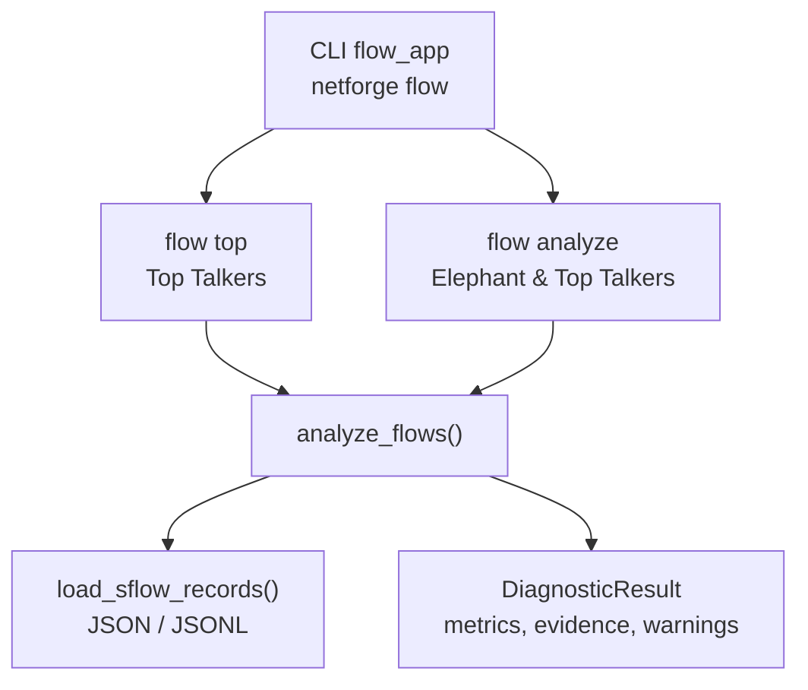
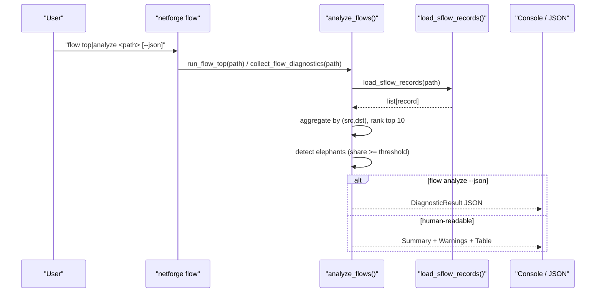
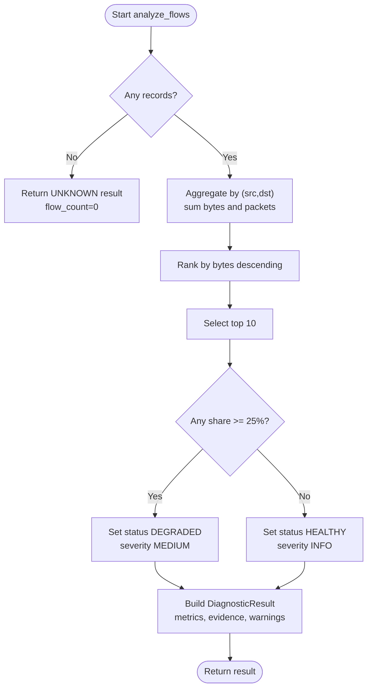
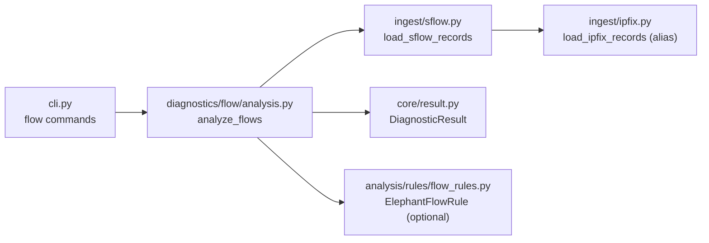

# Flow Commands

<cite>
**Referenced Files in This Document**
- [cli.py](file://cli.py)
- [analysis.py](file://diagnostics/flow/analysis.py)
- [sflow.py](file://ingest/sflow.py)
- [ipfix.py](file://ingest/ipfix.py)
- [result.py](file://core/result.py)
- [flows_sample.json](file://examples/flows_sample.json)
- [flow_rules.py](file://analysis/rules/flow_rules.py)
</cite>

## Table of Contents
1. [Introduction](#introduction)
2. [Project Structure](#project-structure)
3. [Core Components](#core-components)
4. [Architecture Overview](#architecture-overview)
5. [Detailed Component Analysis](#detailed-component-analysis)
6. [Dependency Analysis](#dependency-analysis)
7. [Performance Considerations](#performance-considerations)
8. [Troubleshooting Guide](#troubleshooting-guide)
9. [Conclusion](#conclusion)
10. [Appendices](#appendices)

## Introduction
This document explains NetForge flow analysis commands for processing offline telemetry exports (JSON or JSONL) from passive sources such as sFlow and IPFIX. It covers:
- Identifying top talkers
- Analyzing flow records to detect elephant flows
- Interpreting results and generating network visibility reports
- Using the JSON output option for automation and integration

The flow commands operate on pre-captured telemetry files, enabling post-processing without live collectors.

## Project Structure
NetForge exposes a CLI with a dedicated flow subcommand group. The flow commands read JSON or JSONL flow exports and produce structured diagnostic results that can be consumed by humans or downstream tools.

**Diagram sources**
- [cli.py:396-422](file://cli.py#L396-L422)
- [analysis.py:20-87](file://diagnostics/flow/analysis.py#L20-L87)
- [sflow.py:10-30](file://ingest/sflow.py#L10-L30)

**Section sources**
- [cli.py:396-422](file://cli.py#L396-L422)
- [analysis.py:1-106](file://diagnostics/flow/analysis.py#L1-L106)
- [sflow.py:10-30](file://ingest/sflow.py#L10-L30)

## Core Components
- Flow CLI commands:
  - netforge flow top <path>: Displays top talkers from an offline flow export.
  - netforge flow analyze <path> [--json]: Analyzes flow records to identify elephants and top talkers; supports JSON output.
- Flow analyzer:
  - Aggregates bytes and packets per conversation (src → dst).
  - Ranks conversations by bytes and identifies top talkers.
  - Flags “elephant” flows exceeding a share threshold.
- Data ingestion:
  - Accepts JSON arrays or JSON Lines (one record per line).
  - Supports common field names for interoperability with sFlow/IPFIX exports.

Key behaviors:
- Input file path is required for both commands.
- JSON output is available via --json on flow analyze.
- Results include metrics, evidence, and warnings for interpretation.

**Section sources**
- [cli.py:396-422](file://cli.py#L396-L422)
- [analysis.py:20-87](file://diagnostics/flow/analysis.py#L20-L87)
- [sflow.py:10-30](file://ingest/sflow.py#L10-L30)
- [result.py:24-47](file://core/result.py#L24-L47)

## Architecture Overview
The flow analysis pipeline reads offline telemetry, aggregates per-conversation metrics, ranks top talkers, and flags dominant flows.

**Diagram sources**
- [cli.py:396-422](file://cli.py#L396-L422)
- [analysis.py:20-106](file://diagnostics/flow/analysis.py#L20-L106)
- [sflow.py:10-30](file://ingest/sflow.py#L10-L30)

## Detailed Component Analysis

### Command: netforge flow top
Purpose:
- Show the top talkers from an offline flow export.

Input requirements:
- path: Required argument pointing to a JSON array or JSONL file containing flow records.

Output:
- A table listing the top 10 conversations by bytes, including source, destination, total bytes, and share percentage.
- Returns a DiagnosticResult object internally (not printed unless used programmatically).

Interpretation guidelines:
- High share values indicate dominant conversations.
- Use this view to quickly spot bandwidth-heavy endpoints or applications.

Example usage:
- netforge flow top examples/flows_sample.json

**Section sources**
- [cli.py:396-403](file://cli.py#L396-L403)
- [analysis.py:90-105](file://diagnostics/flow/analysis.py#L90-L105)
- [sflow.py:10-30](file://ingest/sflow.py#L10-L30)
- [flows_sample.json:1-6](file://examples/flows_sample.json#L1-L6)

### Command: netforge flow analyze
Purpose:
- Analyze flow records to identify elephant flows and top talkers.

Input requirements:
- path: Required argument pointing to a JSON array or JSONL file containing flow records.
- --json: Optional flag to emit a JSON representation of the DiagnosticResult.

Output:
- Human-readable summary and warnings when not using --json.
- Structured JSON when using --json, suitable for automation and reporting.

Interpretation guidelines:
- Status indicates overall health based on presence of elephant flows.
- Metrics include flow_count, total_bytes, top_talkers, elephant_flows, and counts.
- Evidence provides context (total bytes, unique conversations).
- Warnings highlight specific elephant flows and their traffic share.

Example usage:
- netforge flow analyze examples/flows_sample.json
- netforge flow analyze examples/flows_sample.json --json > report.json

**Section sources**
- [cli.py:406-422](file://cli.py#L406-L422)
- [analysis.py:20-87](file://diagnostics/flow/analysis.py#L20-L87)
- [result.py:24-47](file://core/result.py#L24-L47)

### Flow Analyzer Logic
Behavior:
- Aggregates bytes and packets per conversation (src → dst).
- Computes share of total bytes per conversation.
- Ranks top 10 conversations by bytes.
- Identifies elephant flows where share meets or exceeds a threshold.
- Produces a standardized DiagnosticResult with metrics, evidence, and warnings.

Thresholds and fields:
- Elephant threshold: 25% of total observed bytes.
- Supported record fields: src/source, dst/destination, bytes/octetDeltaCount, packets/packetDeltaCount, proto (optional).

**Diagram sources**
- [analysis.py:20-87](file://diagnostics/flow/analysis.py#L20-L87)

**Section sources**
- [analysis.py:20-87](file://diagnostics/flow/analysis.py#L20-L87)

### Data Ingestion (sFlow/IPFIX)
Capabilities:
- Reads JSON arrays or JSON Lines files.
- Normalizes field names to support sFlow and IPFIX exports.
- Live UDP collectors are stubbed; use offline replay for MVP.

Supported fields:
- Source: src or source
- Destination: dst or destination
- Bytes: bytes or octetDeltaCount
- Packets: packets or packetDeltaCount
- Protocol: proto (optional)

File formats:
- JSON array: A single JSON list of records.
- JSON Lines: One JSON object per line.

**Section sources**
- [sflow.py:10-30](file://ingest/sflow.py#L10-L30)
- [ipfix.py:11-15](file://ingest/ipfix.py#L11-L15)

### Integration with Rule Engine (Optional)
When flow analysis results are included in broader diagnostics, the rule engine can generate issues and recommendations for elephant flows.

- Rule: Detects elephant flows from flow_analysis metrics.
- Recommendations: Rate-limit, reschedule, or correlate with link utilization.

**Section sources**
- [flow_rules.py:9-44](file://analysis/rules/flow_rules.py#L9-L44)

## Dependency Analysis
High-level dependencies among flow components:

**Diagram sources**
- [cli.py:396-422](file://cli.py#L396-L422)
- [analysis.py:20-106](file://diagnostics/flow/analysis.py#L20-L106)
- [sflow.py:10-30](file://ingest/sflow.py#L10-L30)
- [ipfix.py:11-15](file://ingest/ipfix.py#L11-L15)
- [result.py:24-47](file://core/result.py#L24-L47)
- [flow_rules.py:9-44](file://analysis/rules/flow_rules.py#L9-L44)

**Section sources**
- [cli.py:396-422](file://cli.py#L396-L422)
- [analysis.py:20-106](file://diagnostics/flow/analysis.py#L20-L106)
- [sflow.py:10-30](file://ingest/sflow.py#L10-L30)
- [ipfix.py:11-15](file://ingest/ipfix.py#L11-L15)
- [result.py:24-47](file://core/result.py#L24-L47)
- [flow_rules.py:9-44](file://analysis/rules/flow_rules.py#L9-L44)

## Performance Considerations
- File parsing: JSON Lines avoids loading large arrays into memory at once; prefer JSONL for very large exports.
- Aggregation complexity: O(N) pass to aggregate by conversation; sorting top N is bounded by number of unique conversations.
- Threshold tuning: The elephant threshold is fixed at 25%; adjust if needed by modifying the analyzer constant.
- I/O bottleneck: Ensure fast disk access for large telemetry files; consider streaming JSONL for very large datasets.

[No sources needed since this section provides general guidance]

## Troubleshooting Guide
Common issues and resolutions:
- Invalid JSON root: If the file is a JSON array, ensure it starts with “[”. Otherwise, use JSONL format.
- Missing fields: Records must include source and destination identifiers and byte/packet counters. The analyzer tolerates alternate field names.
- Empty input: If no records are found, the result status is UNKNOWN with zero flow count.
- Large files: For very large exports, prefer JSONL to reduce memory pressure during parsing.

Validation tips:
- Confirm file encoding is UTF-8.
- Verify each line (for JSONL) is valid JSON.
- Ensure numeric fields contain numbers, not strings.

**Section sources**
- [sflow.py:10-30](file://ingest/sflow.py#L10-L30)
- [analysis.py:20-30](file://diagnostics/flow/analysis.py#L20-L30)

## Conclusion
NetForge’s flow commands provide a straightforward way to analyze offline telemetry from passive sources like sFlow and IPFIX. Use flow top to quickly identify top talkers and flow analyze to detect elephant flows and generate structured reports. With JSON output, you can integrate these analyses into automated workflows and network visibility dashboards.

[No sources needed since this section summarizes without analyzing specific files]

## Appendices

### Input File Requirements
- Format: JSON array or JSON Lines (one record per line).
- Fields per record:
  - Source: src or source
  - Destination: dst or destination
  - Bytes: bytes or octetDeltaCount
  - Packets: packets or packetDeltaCount
  - Protocol: proto (optional)

**Section sources**
- [sflow.py:10-30](file://ingest/sflow.py#L10-L30)
- [flows_sample.json:1-6](file://examples/flows_sample.json#L1-L6)

### Example Workflows
- Identify top talkers:
  - netforge flow top examples/flows_sample.json
- Detect elephant flows and get JSON report:
  - netforge flow analyze examples/flows_sample.json --json > flow_report.json
- Generate network visibility report:
  - Combine flow analyze outputs across multiple time windows and feed into your reporting system.

**Section sources**
- [cli.py:396-422](file://cli.py#L396-L422)
- [analysis.py:20-106](file://diagnostics/flow/analysis.py#L20-L106)
- [sflow.py:10-30](file://ingest/sflow.py#L10-L30)