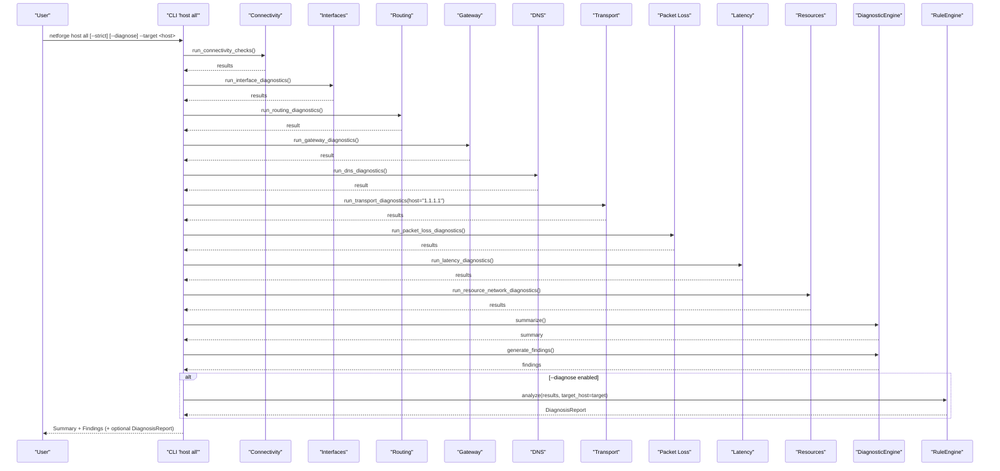
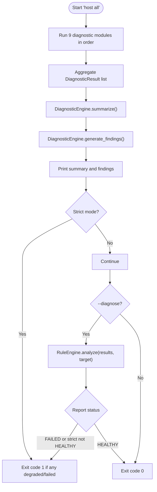
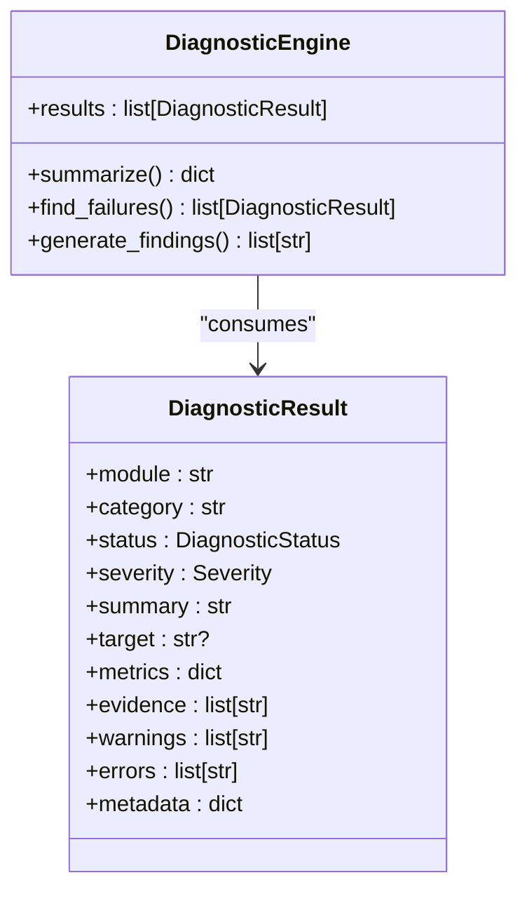
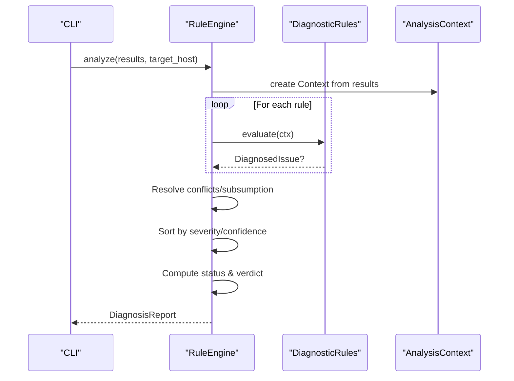
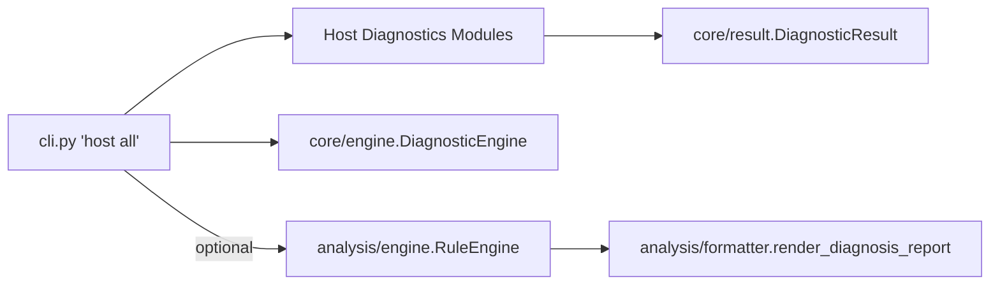
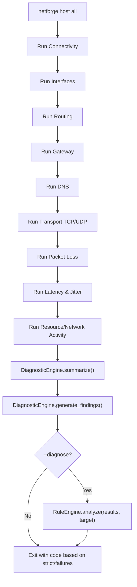

# Comprehensive Host Suite

<cite>
**Referenced Files in This Document**
- [cli.py](file://cli.py)
- [core/engine.py](file://core/engine.py)
- [analysis/engine.py](file://analysis/engine.py)
- [analysis/formatter.py](file://analysis/formatter.py)
- [diagnostics/host/connectivity.py](file://diagnostics/host/connectivity.py)
- [diagnostics/host/interface.py](file://diagnostics/host/interface.py)
- [diagnostics/host/routing.py](file://diagnostics/host/routing.py)
- [diagnostics/host/gateway.py](file://diagnostics/host/gateway.py)
- [diagnostics/host/dns.py](file://diagnostics/host/dns.py)
- [diagnostics/host/tcp_udp.py](file://diagnostics/host/tcp_udp.py)
- [diagnostics/host/packet_loss.py](file://diagnostics/host/packet_loss.py)
- [diagnostics/host/latency.py](file://diagnostics/host/latency.py)
- [diagnostics/host/resource_network.py](file://diagnostics/host/resource_network.py)
- [core/result.py](file://core/result.py)
</cite>

## Table of Contents
1. Introduction
2. Project Structure
3. Core Components
4. Architecture Overview
5. Detailed Component Analysis
6. Dependency Analysis
7. Performance Considerations
8. Troubleshooting Guide
9. Conclusion
10. Appendices

## Introduction
This document explains the NetForge “all” host diagnostic command that executes a complete, sequential suite of host-level diagnostics and produces actionable summaries. It covers connectivity, interfaces, routing, gateway, DNS, transport (TCP/UDP), packet loss, latency, and resource monitoring. It also documents strict mode for exit code handling, diagnose mode for rule engine integration, and target specification for analysis context. Examples are provided for automated health checks, CI/CD pipeline integration, and comprehensive network troubleshooting workflows, including summary reporting, finding aggregation, and integration with monitoring dashboards.

## Project Structure
The “all” host command is implemented as a CLI entry point that orchestrates multiple diagnostic modules and then summarizes results. The flow is:
- CLI command collects results from each diagnostic module in a fixed order.
- Results are aggregated into a DiagnosticEngine to produce a summary and findings.
- Optional RuleEngine can be invoked for root-cause diagnosis using the same results and a specified target.

```mermaid
graph TB
CLI["CLI 'host all'"] --> C1["Connectivity"]
CLI --> C2["Interfaces"]
CLI --> C3["Routing"]
CLI --> C4["Gateway"]
CLI --> C5["DNS"]
CLI --> C6["Transport TCP/UDP"]
CLI --> C7["Packet Loss"]
CLI --> C8["Latency & Jitter"]
CLI --> C9["Resource / Network Activity"]
C1 --> ENG["DiagnosticEngine"]
C2 --> ENG
C3 --> ENG
C4 --> ENG
C5 --> ENG
C6 --> ENG
C7 --> ENG
C8 --> ENG
C9 --> ENG
ENG --> SUM["Summary + Findings"]
CLI --> |optional|-- RE["RuleEngine"]
RE --> RPT["Diagnosis Report"]
```

**Diagram sources**
- [cli.py:112-196](file://cli.py#L112-L196)
- [core/engine.py:10-83](file://core/engine.py#L10-L83)
- [analysis/engine.py:15-130](file://analysis/engine.py#L15-L130)

**Section sources**
- [cli.py:112-196](file://cli.py#L112-L196)
- [core/engine.py:10-83](file://core/engine.py#L10-L83)

## Core Components
- CLI orchestration: Executes diagnostics in sequence, aggregates results, prints summary, and optionally runs the rule engine.
- DiagnosticEngine: Summarizes statuses and severities, finds failures, and generates human-readable findings.
- RuleEngine: Evaluates modular rules against results to produce a DiagnosisReport with verdicts and key observations.
- Diagnostics modules: Each implements a focused probe and returns standardized DiagnosticResult objects.

Key behaviors:
- Strict mode exits with code 1 when any degraded or failed result is present.
- Diagnose mode integrates with RuleEngine to provide root-cause analysis and a structured report.
- Target parameter sets the analysis context used by the rule engine and observation synthesis.

**Section sources**
- [cli.py:112-196](file://cli.py#L112-L196)
- [core/engine.py:10-83](file://core/engine.py#L10-L83)
- [analysis/engine.py:15-130](file://analysis/engine.py#L15-L130)
- [core/result.py:9-47](file://core/result.py#L9-L47)

## Architecture Overview
The “all” command composes multiple probes into a single run, producing both operational summaries and optional deep diagnosis.



**Diagram sources**
- [cli.py:112-196](file://cli.py#L112-L196)
- [core/engine.py:10-83](file://core/engine.py#L10-L83)
- [analysis/engine.py:29-111](file://analysis/engine.py#L29-L111)

## Detailed Component Analysis

### CLI “host all” Command
- Sequential execution order: Connectivity → Interfaces → Routing → Gateway → DNS → Transport (TCP/UDP) → Packet Loss → Latency & Jitter → Resource/Network Activity.
- Aggregation: Collects all DiagnosticResult objects into a list.
- Summary: Uses DiagnosticEngine to compute counts of healthy/degraded/failed/unknown and severity distribution.
- Findings: Generates concise messages for failed or degraded items, including errors/warnings.
- Strict mode: Exits with code 1 if any degraded or failed results exist; additionally exits with code 1 if any failed results exist regardless of strict flag.
- Diagnose mode: Invokes RuleEngine.analyze with the collected results and target_host to produce a DiagnosisReport; applies strict exit logic based on report status.
- Target specification: Passed to RuleEngine for context-aware synthesis and observations.



**Diagram sources**
- [cli.py:112-196](file://cli.py#L112-L196)
- [core/engine.py:18-83](file://core/engine.py#L18-L83)
- [analysis/engine.py:29-111](file://analysis/engine.py#L29-L111)

**Section sources**
- [cli.py:112-196](file://cli.py#L112-L196)

### DiagnosticEngine (Summarization and Findings)
- Summarize: Counts statuses and severities across all results to produce totals for healthy, degraded, failed, unknown, critical, high, medium.
- Find Failures: Filters results with FAILED or DEGRADED status.
- Generate Findings: Produces readable strings per failure, appending details from errors or warnings when available.



**Diagram sources**
- [core/engine.py:10-83](file://core/engine.py#L10-L83)
- [core/result.py:9-47](file://core/result.py#L9-L47)

**Section sources**
- [core/engine.py:10-83](file://core/engine.py#L10-L83)
- [core/result.py:9-47](file://core/result.py#L9-L47)

### RuleEngine (Root-Cause Integration)
- Analyze: Builds an AnalysisContext from results, evaluates registered rules, resolves conflicts/subsumption, sorts issues by severity/confidence, computes overall status and verdict, and extracts positive observations.
- Verdict Synthesis: Provides a concise narrative describing primary and secondary issues when present.
- Output: Returns a DiagnosisReport suitable for rendering or JSON export.



**Diagram sources**
- [analysis/engine.py:15-130](file://analysis/engine.py#L15-L130)

**Section sources**
- [analysis/engine.py:15-130](file://analysis/engine.py#L15-L130)

### Diagnostics Modules

#### Connectivity
- Probes TCP reachability to common hosts and records latency.
- Returns HEALTHY on success, FAILED on timeout/OSError.

**Section sources**
- [diagnostics/host/connectivity.py:16-111](file://diagnostics/host/connectivity.py#L16-L111)

#### Interfaces
- Enumerates interfaces, determines operational state, and reports IPv4/IPv6/MAC/speed/MTU.
- Marks system as FAILED only if no active non-loopback interface exists.

**Section sources**
- [diagnostics/host/interface.py:16-147](file://diagnostics/host/interface.py#L16-L147)

#### Routing
- Parses OS-specific routing tables to find default gateway and interface.
- Reports HEALTHY if default gateway found; FAILED otherwise; UNKNOWN on unsupported OS.

**Section sources**
- [diagnostics/host/routing.py:15-199](file://diagnostics/host/routing.py#L15-L199)

#### Gateway
- Pings the default gateway (or explicit address) and interprets loss thresholds:
  - ~100% loss: FAILED (critical)
  - Partial loss: DEGRADED (high)
  - No loss: HEALTHY (info)

**Section sources**
- [diagnostics/host/gateway.py:15-113](file://diagnostics/host/gateway.py#L15-L113)

#### DNS
- Resolves hostname and lists configured DNS servers via OS-specific methods.
- Returns HEALTHY on successful resolution; FAILED on resolution error.

**Section sources**
- [diagnostics/host/dns.py:21-203](file://diagnostics/host/dns.py#L21-L203)

#### Transport (TCP/UDP)
- TCP: Attempts connect to ports (default includes 53, 80, 443).
- UDP: Special handling for DNS (port 53) and NTP (port 123); generic datagram test otherwise.
- Returns HEALTHY/FAILED with metrics and evidence.

**Section sources**
- [diagnostics/host/tcp_udp.py:16-226](file://diagnostics/host/tcp_udp.py#L16-L226)

#### Packet Loss
- Measures ICMP packet loss to targets and classifies:
  - 0%: HEALTHY
  - <5%: DEGRADED (low)
  - <20%: DEGRADED (medium)
  - >=20%: FAILED (high)

**Section sources**
- [diagnostics/host/packet_loss.py:14-121](file://diagnostics/host/packet_loss.py#L14-L121)

#### Latency & Jitter
- Uses ICMP to collect latencies and jitter; classifies average latency thresholds to determine HEALTHY vs DEGRADED.

**Section sources**
- [diagnostics/host/latency.py:14-125](file://diagnostics/host/latency.py#L14-L125)

#### Resource / Network Activity
- Samples CPU, memory, and network I/O deltas over a short interval to detect drops/errors and resource saturation.
- Produces two results: resource health and network activity metrics.

**Section sources**
- [diagnostics/host/resource_network.py:16-190](file://diagnostics/host/resource_network.py#L16-L190)

## Dependency Analysis
The “all” command depends on:
- Individual diagnostic modules for data collection.
- DiagnosticEngine for summarization and findings generation.
- Optional RuleEngine for advanced diagnosis and report generation.



**Diagram sources**
- [cli.py:112-196](file://cli.py#L112-L196)
- [core/engine.py:10-83](file://core/engine.py#L10-L83)
- [analysis/engine.py:15-130](file://analysis/engine.py#L15-L130)
- [analysis/formatter.py:12-40](file://analysis/formatter.py#L12-L40)

**Section sources**
- [cli.py:112-196](file://cli.py#L112-L196)
- [core/engine.py:10-83](file://core/engine.py#L10-L83)
- [analysis/engine.py:15-130](file://analysis/engine.py#L15-L130)
- [analysis/formatter.py:12-40](file://analysis/formatter.py#L12-L40)

## Performance Considerations
- The resource/network activity measurement uses a single sampling interval to minimize overhead while capturing CPU, memory, and network deltas concurrently.
- ICMP-based probes (gateway, packet loss, latency) use reasonable defaults for count and timeouts to balance accuracy and runtime.
- Avoid excessive parallelism in CI environments to prevent flaky results; sequential execution ensures deterministic ordering and consistent timing windows.

[No sources needed since this section provides general guidance]

## Troubleshooting Guide
Common scenarios and how the suite responds:
- No default gateway: Routing module reports FAILED; Gateway module cannot probe and returns UNKNOWN or CRITICAL depending on configuration.
- DNS resolution failure: DNS module returns FAILED; RuleEngine may highlight DNS as a contributing factor.
- High packet loss or latency: Packet loss and latency modules classify severity accordingly; RuleEngine synthesizes a verdict highlighting primary causes.
- Resource saturation: Resource module flags HIGH or CRITICAL conditions when CPU/memory are near capacity or when active drops/errors are observed.

Integration tips:
- Use JSON output from the diagnose commands where available to parse results programmatically.
- Capture exit codes in CI pipelines: 0 for healthy, 1 for degraded/failed under strict mode or when failures are detected.

**Section sources**
- [diagnostics/host/routing.py:81-199](file://diagnostics/host/routing.py#L81-L199)
- [diagnostics/host/gateway.py:15-113](file://diagnostics/host/gateway.py#L15-L113)
- [diagnostics/host/dns.py:92-203](file://diagnostics/host/dns.py#L92-L203)
- [diagnostics/host/packet_loss.py:14-121](file://diagnostics/host/packet_loss.py#L14-L121)
- [diagnostics/host/latency.py:14-125](file://diagnostics/host/latency.py#L14-L125)
- [diagnostics/host/resource_network.py:16-190](file://diagnostics/host/resource_network.py#L16-L190)

## Conclusion
The NetForge “all” host diagnostic command provides a comprehensive, ordered suite of host-level checks with clear summaries and optional root-cause analysis. Strict mode enables reliable automation and gatekeeping in CI/CD. The target parameter contextualizes analysis for precise diagnosis. By combining standardized results, summarization, and rule-based reasoning, the suite supports both quick health checks and deep troubleshooting workflows.

[No sources needed since this section summarizes without analyzing specific files]

## Appendices

### A. Execution Flow Reference


**Diagram sources**
- [cli.py:112-196](file://cli.py#L112-L196)
- [core/engine.py:18-83](file://core/engine.py#L18-L83)
- [analysis/engine.py:29-111](file://analysis/engine.py#L29-L111)

### B. Automated Health Checks and CI/CD Integration
- Basic health check:
  - Command: netforge host all --strict
  - Exit code 0 indicates fully healthy; exit code 1 indicates degraded or failed.
- With rule engine integration:
  - Command: netforge host all --diagnose --target example.com --strict
  - Produces a DiagnosisReport; strict exit behavior applies to report status.
- JSON parsing for dashboards:
  - Use diagnose commands with JSON output to feed metrics into monitoring systems.
  - Extract fields such as total_probes, healthy_probes, degraded_probes, failed_probes, status, verdict, and issues.

[No sources needed since this section provides general guidance]

### C. Monitoring Dashboard Integration
- Metrics to publish:
  - From DiagnosticEngine summary: total_checks, healthy, degraded, failed, unknown, critical, high, medium.
  - From DiagnosisReport: timestamp, target_host, total_probes, healthy_produced, degraded_probes, failed_probes, status, verdict, key_observations, issues.
- Alerting thresholds:
  - Alert on failed_probes > 0 or status == FAILED.
  - Warn on degraded_probes > 0 or presence of high/critical severity findings.

[No sources needed since this section provides general guidance]