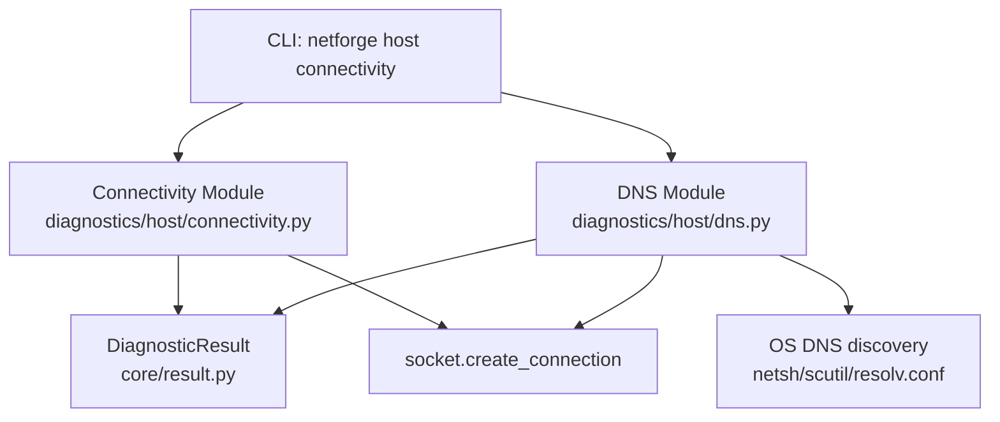
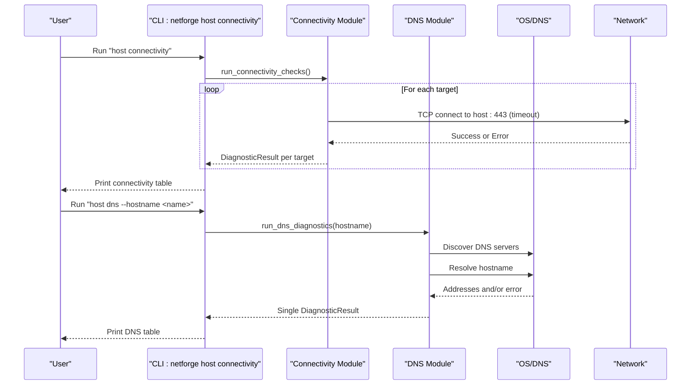
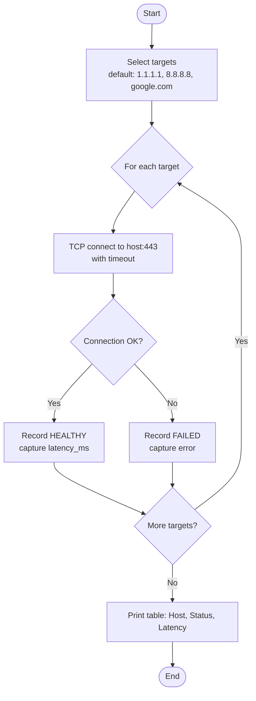
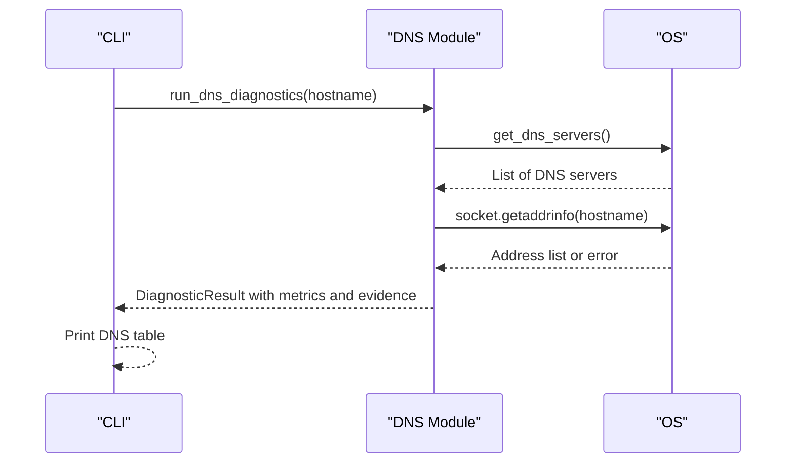
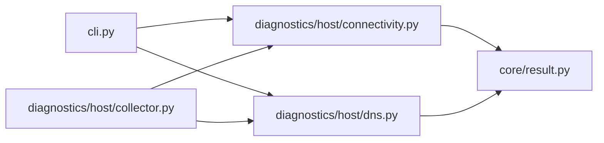

# Connectivity Checks

<cite>
**Referenced Files in This Document**
- [cli.py](file://cli.py)
- [connectivity.py](file://diagnostics/host/connectivity.py)
- [dns.py](file://diagnostics/host/dns.py)
- [icmp_utils.py](file://diagnostics/host/icmp_utils.py)
- [result.py](file://core/result.py)
- [collector.py](file://diagnostics/host/collector.py)
- [README.md](file://README.md)
</cite>

## Table of Contents
1. Introduction
2. Project Structure
3. Core Components
4. Architecture Overview
5. Detailed Component Analysis
6. Dependency Analysis
7. Performance Considerations
8. Troubleshooting Guide
9. Conclusion
10. Appendices

## Introduction
This document explains the NetForge connectivity check command and its related DNS resolution checks. It covers how to verify basic network reachability, what options are available, how output is formatted, and how to integrate these checks into automation workflows. The connectivity check uses TCP connection attempts to common targets and includes DNS resolution diagnostics that discover configured DNS servers and measure resolution performance.

## Project Structure
The connectivity check command is exposed via a CLI entry point and implemented by a dedicated diagnostic module. DNS diagnostics are provided as a separate module with cross-platform support for discovering DNS servers and resolving hostnames. ICMP utilities exist for ping-based metrics but are not used by the connectivity check itself.

**Diagram sources**
- [cli.py:46-49](file://cli.py#L46-L49)
- [connectivity.py:16-66](file://diagnostics/host/connectivity.py#L16-L66)
- [dns.py:21-89](file://diagnostics/host/dns.py#L21-L89)
- [dns.py:92-147](file://diagnostics/host/dns.py#L92-L147)
- [result.py:9-47](file://core/result.py#L9-L47)

**Section sources**
- [cli.py:46-49](file://cli.py#L46-L49)
- [connectivity.py:68-111](file://diagnostics/host/connectivity.py#L68-L111)
- [dns.py:150-203](file://diagnostics/host/dns.py#L150-L203)
- [result.py:9-47](file://core/result.py#L9-L47)

## Core Components
- Connectivity check: Performs TCP connect tests to one or more hosts on port 443 and reports status, latency, and evidence.
- DNS diagnostics: Resolves a hostname, measures resolution time, lists resolved addresses, and discovers configured DNS servers across platforms.
- Diagnostic result model: Standardized structure for status, severity, metrics, evidence, warnings, errors, and metadata.

Key behaviors:
- Default connectivity targets include public resolvers and a well-known domain to validate general internet reachability.
- DNS diagnostics return both success/failure and operational details such as server list and address count.

**Section sources**
- [connectivity.py:16-66](file://diagnostics/host/connectivity.py#L16-L66)
- [connectivity.py:68-111](file://diagnostics/host/connectivity.py#L68-L111)
- [dns.py:21-89](file://diagnostics/host/dns.py#L21-L89)
- [dns.py:92-147](file://diagnostics/host/dns.py#L92-L147)
- [result.py:9-47](file://core/result.py#L9-L47)

## Architecture Overview
The CLI exposes a host-level connectivity command that invokes the connectivity module. The module runs multiple checks and prints a summary table. DNS diagnostics are invoked separately and also print a summary table. Both modules produce standardized results consumed by higher-level orchestration (e.g., full host diagnostics).

**Diagram sources**
- [cli.py:46-49](file://cli.py#L46-L49)
- [cli.py:74-79](file://cli.py#L74-L79)
- [connectivity.py:68-111](file://diagnostics/host/connectivity.py#L68-L111)
- [connectivity.py:16-66](file://diagnostics/host/connectivity.py#L16-L66)
- [dns.py:150-203](file://diagnostics/host/dns.py#L150-L203)
- [dns.py:21-89](file://diagnostics/host/dns.py#L21-L89)
- [dns.py:92-147](file://diagnostics/host/dns.py#L92-L147)

## Detailed Component Analysis

### Connectivity Check Command
- Purpose: Verify basic network connectivity by attempting TCP connections to common targets on port 443.
- Invocation: `netforge host connectivity`
- Targets: Defaults to a set of public endpoints; can be customized programmatically when calling the underlying function.
- Output: A table showing Host, Status, and Latency. Each row corresponds to a target.
- Status codes: HEALTHY if TCP connect succeeds; FAILED if it times out or raises an OS/network error.
- Metrics: Includes latency in milliseconds for successful connections and the target port.
- Evidence: Indicates whether the TCP connection succeeded or failed.

**Diagram sources**
- [connectivity.py:68-111](file://diagnostics/host/connectivity.py#L68-L111)
- [connectivity.py:16-66](file://diagnostics/host/connectivity.py#L16-L66)

**Section sources**
- [cli.py:46-49](file://cli.py#L46-L49)
- [connectivity.py:16-66](file://diagnostics/host/connectivity.py#L16-L66)
- [connectivity.py:68-111](file://diagnostics/host/connectivity.py#L68-L111)

### DNS Resolution Diagnostics
- Purpose: Validate DNS functionality by resolving a hostname and listing configured DNS servers.
- Invocation: `netforge host dns --hostname <name>`
- Behavior:
  - Discovers DNS servers using platform-specific commands or configuration files.
  - Resolves the given hostname and records resolution time and addresses.
  - Returns a single result with status, metrics, and evidence.
- Output: A table with properties including Hostname, DNS Servers, Status, Resolution Time, and Addresses.

**Diagram sources**
- [cli.py:74-79](file://cli.py#L74-L79)
- [dns.py:21-89](file://diagnostics/host/dns.py#L21-L89)
- [dns.py:92-147](file://diagnostics/host/dns.py#L92-L147)
- [dns.py:150-203](file://diagnostics/host/dns.py#L150-L203)

**Section sources**
- [cli.py:74-79](file://cli.py#L74-L79)
- [dns.py:21-89](file://diagnostics/host/dns.py#L21-L89)
- [dns.py:92-147](file://diagnostics/host/dns.py#L92-L147)
- [dns.py:150-203](file://diagnostics/host/dns.py#L150-L203)

### ICMP Utilities (Contextual Note)
- Purpose: Provide ping-based metrics (packet loss, latencies, jitter) by invoking the system ping utility and parsing output.
- Relevance: Not used by the connectivity check command, but useful for broader diagnostics where ICMP reachability and quality metrics are needed.

**Section sources**
- [icmp_utils.py:29-65](file://diagnostics/host/icmp_utils.py#L29-L65)
- [icmp_utils.py:68-115](file://diagnostics/host/icmp_utils.py#L68-L115)

## Dependency Analysis
- CLI depends on the connectivity and DNS modules to expose commands.
- Connectivity module depends on the standard library socket and produces DiagnosticResult objects.
- DNS module depends on the standard library socket and platform tools to discover DNS servers and resolve names.
- Full host diagnostics orchestrator integrates connectivity checks with other probes and returns a combined set of results.

**Diagram sources**
- [cli.py:46-49](file://cli.py#L46-L49)
- [cli.py:74-79](file://cli.py#L74-L79)
- [connectivity.py:68-111](file://diagnostics/host/connectivity.py#L68-L111)
- [dns.py:150-203](file://diagnostics/host/dns.py#L150-L203)
- [collector.py:16-61](file://diagnostics/host/collector.py#L16-L61)
- [result.py:9-47](file://core/result.py#L9-L47)

**Section sources**
- [cli.py:46-49](file://cli.py#L46-L49)
- [cli.py:74-79](file://cli.py#L74-L79)
- [connectivity.py:68-111](file://diagnostics/host/connectivity.py#L68-L111)
- [dns.py:150-203](file://diagnostics/host/dns.py#L150-L203)
- [collector.py:16-61](file://diagnostics/host/collector.py#L16-L61)
- [result.py:9-47](file://core/result.py#L9-L47)

## Performance Considerations
- Connectivity checks use TCP connect with a default timeout; failures will block until timeout or error occurs.
- DNS resolution uses synchronous blocking calls; high-latency or unresponsive DNS servers can delay results.
- ICMP utilities cache ping results for a short TTL to reduce repeated measurements during rapid diagnostics.

[No sources needed since this section provides general guidance]

## Troubleshooting Guide
Common issues and how to interpret them:
- Connectivity FAILED: Indicates TCP connect to port 443 failed or timed out. Check firewall rules, proxy settings, or network path.
- DNS FAILED: Indicates hostname resolution failed. Verify DNS server availability and configuration.
- High latency: Connectivity may succeed but with elevated latency; consider network congestion or distant endpoints.
- No DNS servers discovered: Platform-specific discovery may fail; fall back to checking system configuration manually.

Integration tips:
- Use the orchestrator to collect all host diagnostics at once and analyze results centrally.
- For automation, parse the printed tables or capture programmatic outputs from the orchestrator for structured analysis.

**Section sources**
- [connectivity.py:16-66](file://diagnostics/host/connectivity.py#L16-L66)
- [dns.py:92-147](file://diagnostics/host/dns.py#L92-L147)
- [collector.py:16-61](file://diagnostics/host/collector.py#L16-L61)

## Conclusion
The NetForge connectivity check command provides a quick way to verify basic network reachability via TCP connections to common targets, while the DNS diagnostics confirm name resolution and reveal configured DNS servers. Together, they form a practical foundation for troubleshooting connectivity issues and integrating network health checks into automation workflows.

[No sources needed since this section summarizes without analyzing specific files]

## Appendices

### Command Syntax and Options
- Connectivity check:
  - Command: `netforge host connectivity`
  - Options: None exposed via CLI; defaults to predefined targets.
  - Output: Table with columns Host, Status, Latency.
- DNS diagnostics:
  - Command: `netforge host dns --hostname <name>`
  - Options:
    - --hostname, -h: Target hostname to resolve (default: google.com).
  - Output: Table with properties Hostname, DNS Servers, Status, Resolution Time, Addresses.

**Section sources**
- [cli.py:46-49](file://cli.py#L46-L49)
- [cli.py:74-79](file://cli.py#L74-L79)

### Typical Usage Scenarios
- Verify internet connectivity:
  - Run `netforge host connectivity` to test reachability to common endpoints.
- Check specific host reachability:
  - Use the orchestrator to include custom targets or call the connectivity function programmatically with a custom host list.
- Troubleshoot connection issues:
  - Combine `netforge host connectivity` and `netforge host dns` to isolate transport vs. resolution problems.
  - Use ICMP utilities for additional ping-based insights when needed.

**Section sources**
- [connectivity.py:68-111](file://diagnostics/host/connectivity.py#L68-L111)
- [dns.py:150-203](file://diagnostics/host/dns.py#L150-L203)
- [icmp_utils.py:68-115](file://diagnostics/host/icmp_utils.py#L68-L115)

### Status Codes and Error Conditions
- Status codes:
  - HEALTHY: Connectivity or DNS operation succeeded.
  - FAILED: Operation failed due to timeouts or errors.
  - DEGRADED/UNKNOWN: Used elsewhere in the framework; not directly returned by connectivity or DNS modules.
- Errors:
  - Connectivity errors captured in the errors field of the result.
  - DNS errors captured similarly when resolution fails.

**Section sources**
- [result.py:9-47](file://core/result.py#L9-L47)
- [connectivity.py:16-66](file://diagnostics/host/connectivity.py#L16-L66)
- [dns.py:92-147](file://diagnostics/host/dns.py#L92-L147)

### Integration with Shell Scripts and Automation
- Basic usage:
  - Execute `netforge host connectivity` and `netforge host dns` in scripts to capture console output.
- Programmatic integration:
  - Import and call functions from the connectivity and DNS modules to obtain structured DiagnosticResult objects for further processing.
  - Use the orchestrator to collect comprehensive diagnostics and feed results into analysis pipelines.

**Section sources**
- [README.md:11-19](file://README.md#L11-L19)
- [collector.py:16-61](file://diagnostics/host/collector.py#L16-L61)