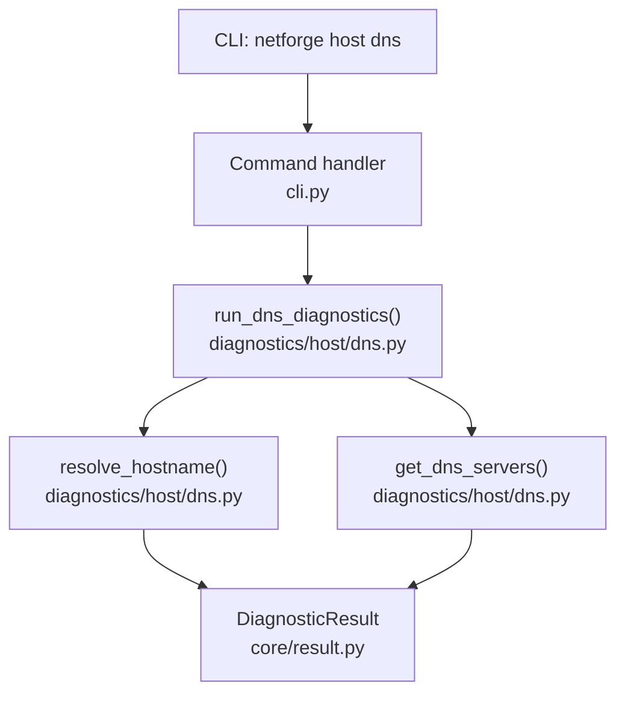
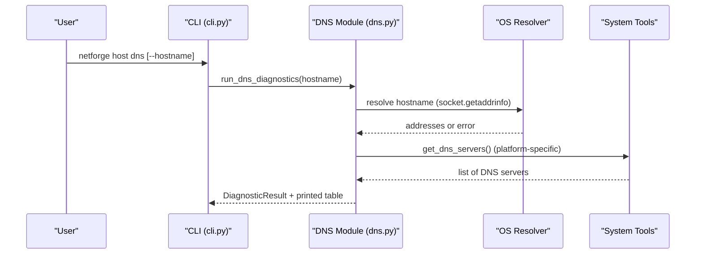
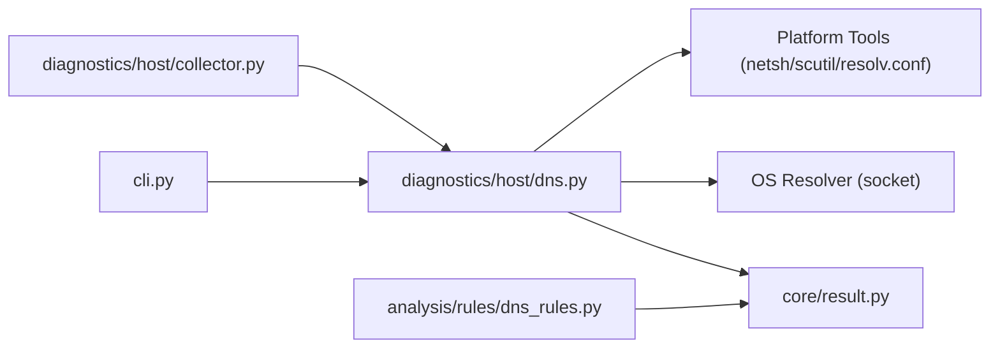

# DNS Resolution

<cite>
**Referenced Files in This Document**
- [cli.py](file://cli.py)
- [dns.py](file://diagnostics/host/dns.py)
- [result.py](file://core/result.py)
- [collector.py](file://diagnostics/host/collector.py)
- [dns_rules.py](file://analysis/rules/dns_rules.py)
</cite>

## Table of Contents
1. Introduction
2. Project Structure
3. Core Components
4. Architecture Overview
5. Detailed Component Analysis
6. Dependency Analysis
7. Performance Considerations
8. Troubleshooting Guide
9. Conclusion
10. Appendices

## Introduction
This document explains the NetForge DNS resolution command used to test hostname resolution, enumerate configured DNS servers, and measure DNS query performance. It covers how to specify target hostnames, verify DNS server availability, analyze resolution times, interpret output formats, handle errors, and troubleshoot common DNS issues. It also shows how to compare performance across different DNS resolvers by combining this command with other diagnostics.

## Project Structure
The DNS functionality is exposed via a CLI command under the host diagnostic domain and implemented in a dedicated module that performs system-level resolution and enumerates configured DNS servers.

**Diagram sources**
- [cli.py:74-80](file://cli.py#L74-L80)
- [dns.py:92-159](file://diagnostics/host/dns.py#L92-L159)
- [result.py:24-47](file://core/result.py#L24-L47)

**Section sources**
- [cli.py:74-80](file://cli.py#L74-L80)
- [dns.py:21-159](file://diagnostics/host/dns.py#L21-L159)
- [result.py:24-47](file://core/result.py#L24-L47)

## Core Components
- CLI entry point for DNS diagnostics: defines the command and options.
- DNS diagnostic runner: orchestrates hostname resolution and DNS server enumeration, then renders results.
- Hostname resolver: measures resolution time and returns addresses or failure details.
- DNS server enumerator: discovers configured DNS servers on Windows, macOS, and Linux.
- Result model: standardized structure carrying status, metrics, evidence, and errors.

Key responsibilities:
- Provide a simple command to validate whether a hostname resolves and how fast it does so.
- Show which DNS servers are configured on the local system.
- Return structured results suitable for further analysis or automation.

**Section sources**
- [cli.py:74-80](file://cli.py#L74-L80)
- [dns.py:92-159](file://diagnostics/host/dns.py#L92-L159)
- [dns.py:21-89](file://diagnostics/host/dns.py#L21-L89)
- [result.py:24-47](file://core/result.py#L24-L47)

## Architecture Overview
The DNS command follows a clear flow: the CLI registers a command that calls into the DNS diagnostic module; the module performs resolution and server enumeration, then prints a formatted table and returns a structured result.

**Diagram sources**
- [cli.py:74-80](file://cli.py#L74-L80)
- [dns.py:92-159](file://diagnostics/host/dns.py#L92-L159)
- [dns.py:21-89](file://diagnostics/host/dns.py#L21-L89)

## Detailed Component Analysis

### CLI Command: netforge host dns
- Purpose: Resolve a hostname and list configured DNS servers.
- Options:
  - --hostname, -h: Target hostname to resolve (default: google.com).
- Behavior: Calls the DNS diagnostic runner and displays a formatted table.

Usage examples:
- Default target: netforge host dns
- Custom target: netforge host dns --hostname example.org

Notes:
- The command integrates into the broader host diagnostic suite and can be combined with other checks for end-to-end diagnosis.

**Section sources**
- [cli.py:74-80](file://cli.py#L74-L80)

### DNS Diagnostic Runner: run_dns_diagnostics
- Orchestrates:
  - Hostname resolution via the resolver function.
  - Enumeration of configured DNS servers.
  - Rendering a human-readable table with key properties.
- Output includes:
  - Hostname tested.
  - Configured DNS servers (if available).
  - Status (healthy/failed).
  - Resolution time in milliseconds.
  - Resolved addresses (if any).

Behavior highlights:
- Adds DNS servers to the result metrics and evidence for downstream analysis.
- Uses a rich table for console output.

**Section sources**
- [dns.py:150-203](file://diagnostics/host/dns.py#L150-L203)

### Hostname Resolver: resolve_hostname
- Performs:
  - System-level hostname resolution using the OS resolver stack.
  - Timing measurement from start to completion.
  - Deduplication and sorting of resolved IP addresses.
- Returns:
  - A structured result with status HEALTHY and metrics including resolution_time_ms, address_count, and addresses when successful.
  - A structured result with status FAILED and severity HIGH when resolution fails, including error details.

Error handling:
- Catches resolver errors and converts them into a standardized failed result with error messages.

**Section sources**
- [dns.py:92-147](file://diagnostics/host/dns.py#L92-L147)
- [result.py:24-47](file://core/result.py#L24-L47)

### DNS Server Enumerator: get_dns_servers
- Discovers configured DNS servers using platform-specific methods:
  - Windows: queries via netsh and PowerShell fallback.
  - macOS: parses scutil output.
  - Linux/fallback: reads /etc/resolv.conf nameserver entries.
- Filters out loopback and link-local addresses and deduplicates results.

Output:
- A list of unique IPv4 DNS server addresses configured on the system.

**Section sources**
- [dns.py:21-89](file://diagnostics/host/dns.py#L21-L89)

### Integration with Host Diagnostics Collector
- The collector invokes DNS resolution for a target host and augments the result with configured DNS servers.
- This enables rule-based analysis to correlate DNS failures with overall connectivity and latency.

**Section sources**
- [collector.py:16-41](file://diagnostics/host/collector.py#L16-L41)

## Dependency Analysis
The DNS feature depends on standard libraries and platform tools, returning a consistent result model consumed by higher-level components.

**Diagram sources**
- [cli.py:74-80](file://cli.py#L74-L80)
- [dns.py:21-159](file://diagnostics/host/dns.py#L21-L159)
- [result.py:24-47](file://core/result.py#L24-L47)
- [collector.py:16-41](file://diagnostics/host/collector.py#L16-L41)
- [dns_rules.py:9-134](file://analysis/rules/dns_rules.py#L9-L134)

**Section sources**
- [cli.py:74-80](file://cli.py#L74-L80)
- [dns.py:21-159](file://diagnostics/host/dns.py#L21-L159)
- [result.py:24-47](file://core/result.py#L24-L47)
- [collector.py:16-41](file://diagnostics/host/collector.py#L16-L41)
- [dns_rules.py:9-134](file://analysis/rules/dns_rules.py#L9-L134)

## Performance Considerations
- Measurement method:
  - Resolution time is measured around the OS resolver call and reported in milliseconds.
- Interpretation:
  - Low resolution times generally indicate responsive upstream resolvers and healthy network paths.
  - High resolution times may indicate slow or overloaded resolvers, firewall filtering of port 53, or DNS caching effects.
- Comparison strategies:
  - Run the DNS command against multiple targets to observe variability.
  - Combine with transport and latency checks to differentiate DNS-specific slowness from general network issues.
  - Use the integrated diagnostics suite to collect baseline metrics and compare over time.

[No sources needed since this section provides general guidance]

## Troubleshooting Guide

Common scenarios and how to diagnose them:

- Hostname does not resolve:
  - Check the command’s status and error messages.
  - Verify configured DNS servers are present and reachable.
  - Confirm basic connectivity and that outbound UDP/TCP port 53 is allowed.

- Slow resolution:
  - Compare resolution_time_ms with general network latency.
  - If latency is low but DNS is slow, consider switching to high-performance public resolvers.

- Intermittent failures:
  - Rerun the command to detect flakiness.
  - Inspect evidence and errors for clues such as timeouts or partial responses.

Operational tips:
- Use the full host diagnostic suite to gather context (connectivity, routing, gateway reachability, transport tests).
- Leverage rule-based analysis to automatically identify DNS-related root causes and receive actionable recommendations.

**Section sources**
- [dns.py:92-159](file://diagnostics/host/dns.py#L92-L159)
- [dns_rules.py:9-134](file://analysis/rules/dns_rules.py#L9-L134)

## Conclusion
The NetForge DNS resolution command provides a straightforward way to validate hostname resolution, discover configured DNS servers, and measure resolution performance. Its structured results integrate seamlessly with the broader diagnostics framework, enabling both manual troubleshooting and automated analysis. By combining this command with other host and path diagnostics, you can quickly isolate DNS issues from general connectivity problems and take targeted remediation steps.

[No sources needed since this section summarizes without analyzing specific files]

## Appendices

### Command Reference
- Command: netforge host dns
- Options:
  - --hostname, -h: Target hostname to resolve (default: google.com)

Examples:
- Test default target: netforge host dns
- Test custom domain: netforge host dns --hostname example.org

**Section sources**
- [cli.py:74-80](file://cli.py#L74-L80)

### Output Format
The command prints a table with the following properties:
- Hostname: the target being resolved.
- DNS Servers: configured DNS servers discovered on the system.
- Status: healthy or failed.
- Resolution Time: total time in milliseconds for the resolution attempt.
- Addresses: resolved IP addresses (if any).

Under the hood, these values come from a standardized result model that carries status, metrics, evidence, and errors for programmatic consumption.

**Section sources**
- [dns.py:150-203](file://diagnostics/host/dns.py#L150-L203)
- [result.py:24-47](file://core/result.py#L24-L47)

### Error Conditions
- Resolution failure:
  - Status set to failed with high severity.
  - Errors include the underlying resolver exception message.
- Missing DNS servers:
  - If no servers are detected, the table indicates “Unknown” for DNS servers.

**Section sources**
- [dns.py:92-159](file://diagnostics/host/dns.py#L92-L159)

### Comparing Performance Across DNS Servers
While the command uses the system’s configured resolvers, you can compare performance indirectly by:
- Running the command repeatedly to assess consistency.
- Combining with transport and latency diagnostics to determine if slowness is DNS-specific or network-wide.
- Using the integrated diagnostics suite to collect baselines and detect regressions over time.

[No sources needed since this section provides general guidance]