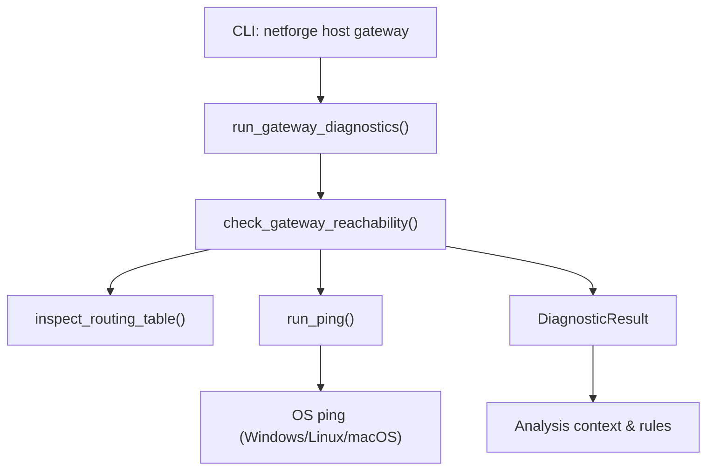
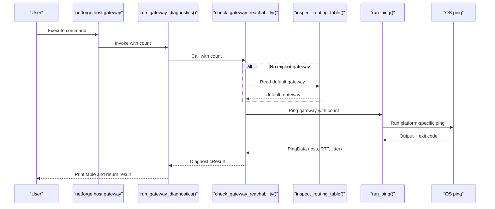
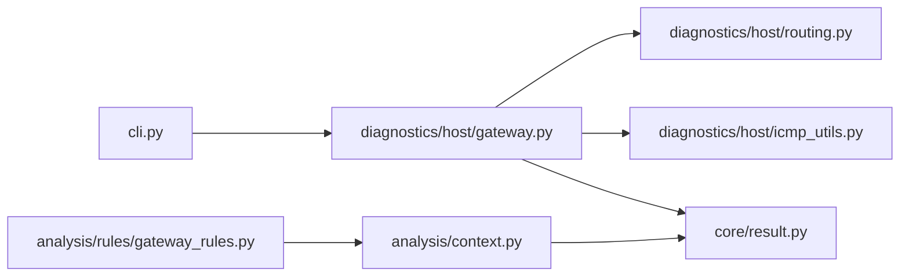
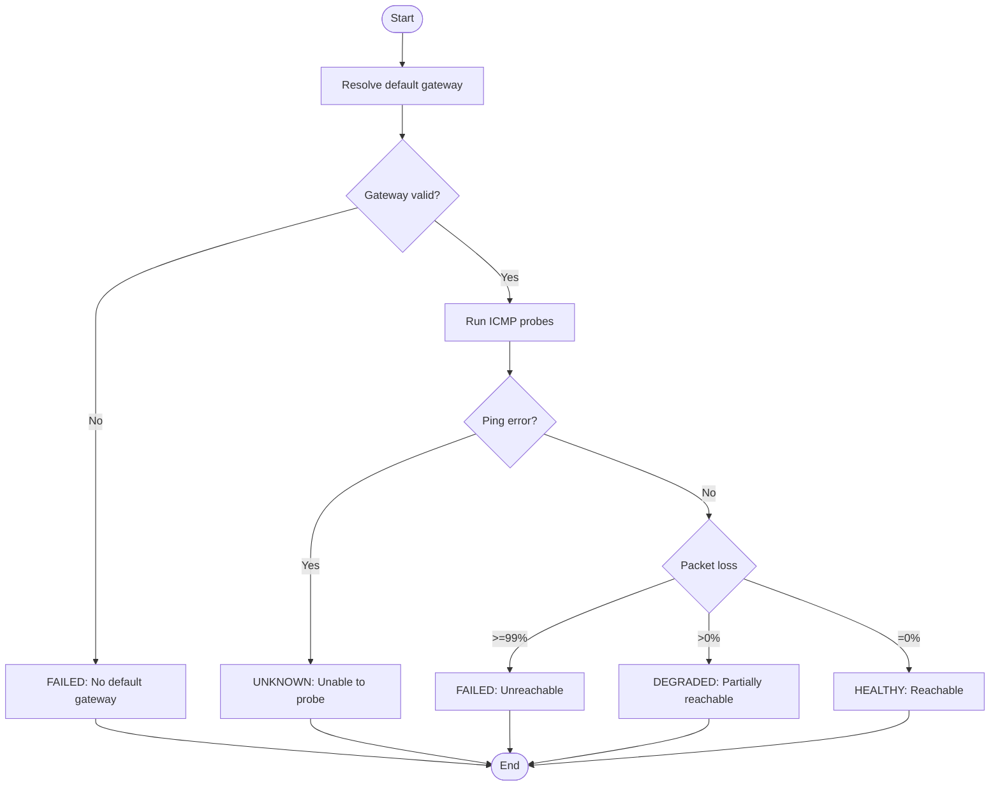

# Gateway Testing

<cite>
**Referenced Files in This Document**
- [cli.py](file://cli.py)
- [gateway.py](file://diagnostics/host/gateway.py)
- [icmp_utils.py](file://diagnostics/host/icmp_utils.py)
- [routing.py](file://diagnostics/host/routing.py)
- [result.py](file://core/result.py)
- [context.py](file://analysis/context.py)
- [gateway_rules.py](file://analysis/rules/gateway_rules.py)
</cite>

## Table of Contents
1. [Introduction](#introduction)
2. [Project Structure](#project-structure)
3. [Core Components](#core-components)
4. [Architecture Overview](#architecture-overview)
5. [Detailed Component Analysis](#detailed-component-analysis)
6. [Dependency Analysis](#dependency-analysis)
7. [Performance Considerations](#performance-considerations)
8. [Troubleshooting Guide](#troubleshooting-guide)
9. [Conclusion](#conclusion)
10. [Appendices](#appendices)

## Introduction
This document explains the NetForge gateway testing command used to verify default gateway reachability and responsiveness through ICMP probes. It covers how to configure probe counts, interpret results, identify failures, and troubleshoot connectivity issues via the default route. It also provides guidance for integrating gateway checks into automated monitoring scripts and outlines error handling and timeout behavior.

## Project Structure
The gateway testing feature is implemented as a host-level diagnostic with a CLI entry point that invokes a dedicated module. The module resolves the default gateway from the routing table and pings it using a cross-platform ping utility. Results are standardized into a common result model and can be consumed by higher-level analysis rules.

**Diagram sources**
- [cli.py:67-71](file://cli.py#L67-L71)
- [gateway.py:15-94](file://diagnostics/host/gateway.py#L15-L94)
- [routing.py:81-161](file://diagnostics/host/routing.py#L81-L161)
- [icmp_utils.py:68-115](file://diagnostics/host/icmp_utils.py#L68-L115)
- [result.py:24-47](file://core/result.py#L24-L47)
- [context.py:41-68](file://analysis/context.py#L41-L68)

**Section sources**
- [cli.py:67-71](file://cli.py#L67-L71)
- [gateway.py:15-112](file://diagnostics/host/gateway.py#L15-L112)
- [icmp_utils.py:68-115](file://diagnostics/host/icmp_utils.py#L68-L115)
- [routing.py:81-161](file://diagnostics/host/routing.py#L81-L161)
- [result.py:24-47](file://core/result.py#L24-L47)
- [context.py:41-68](file://analysis/context.py#L41-L68)

## Core Components
- CLI gateway command: Exposes a simple interface to run gateway diagnostics with a configurable probe count.
- Gateway checker: Resolves the default gateway from the routing table and performs ICMP probing.
- Ping utility: Cross-platform ICMP probe with output parsing, latency statistics, and a short cache to avoid redundant probes.
- Routing inspector: Reads the system routing table and extracts the default gateway and interface.
- Result model: Standardized status, severity, metrics, evidence, and metadata for consistent reporting and rule evaluation.

Key behaviors:
- Default gateway resolution: If no explicit gateway is provided, the checker reads the routing table to find the default gateway.
- Probe configuration: The number of ICMP packets is configurable; timing is derived from the underlying ping implementation and an internal timeout.
- Status determination: Based on packet loss thresholds and errors during probing.

**Section sources**
- [cli.py:67-71](file://cli.py#L67-L71)
- [gateway.py:15-94](file://diagnostics/host/gateway.py#L15-L94)
- [icmp_utils.py:68-115](file://diagnostics/host/icmp_utils.py#L68-L115)
- [routing.py:81-161](file://diagnostics/host/routing.py#L81-L161)
- [result.py:24-47](file://core/result.py#L24-L47)

## Architecture Overview
The gateway test follows a clear flow: CLI invocation triggers the gateway diagnostic runner, which calls the reachability checker. The checker optionally inspects the routing table to determine the target gateway, then runs ICMP probes. Results are normalized into a DiagnosticResult and can be further analyzed by rules that distinguish local gateway failure from upstream WAN outages.

**Diagram sources**
- [cli.py:67-71](file://cli.py#L67-L71)
- [gateway.py:15-94](file://diagnostics/host/gateway.py#L15-L94)
- [routing.py:81-161](file://diagnostics/host/routing.py#L81-L161)
- [icmp_utils.py:68-115](file://diagnostics/host/icmp_utils.py#L68-L115)

## Detailed Component Analysis

### CLI Entry Point: netforge host gateway
- Purpose: Provide a user-friendly command to probe the default gateway.
- Parameters:
  - --count (-c): Number of ICMP probes to send. Default is 4.
- Behavior: Invokes the gateway diagnostic runner and prints a summary table.

Usage examples:
- Basic check: netforge host gateway
- Custom probe count: netforge host gateway --count 10

Interpreting output:
- Columns include Gateway address, Packet Loss %, Average RTT, and Status.
- Status values: healthy, degraded, failed, unknown.

**Section sources**
- [cli.py:67-71](file://cli.py#L67-L71)
- [gateway.py:97-112](file://diagnostics/host/gateway.py#L97-L112)

### Gateway Reachability Checker
- Purpose: Determine if the default gateway is reachable and quantify performance.
- Inputs:
  - Optional explicit gateway IP; otherwise resolved from routing table.
  - Probe count for ICMP packets.
- Logic:
  - Resolve default gateway if not provided.
  - Validate presence of a usable default gateway.
  - Perform ICMP probe and parse results.
  - Classify status based on packet loss and errors.
- Outputs:
  - A DiagnosticResult containing status, severity, metrics (loss, RTT, jitter), evidence, and raw output.

Status thresholds:
- HEALTHY: 0% packet loss.
- DEGRADED: Partial loss (>0% but <99%).
- FAILED: Near-total loss (>=99%) or unreachable.
- UNKNOWN: Errors or inability to determine reachability.

**Section sources**
- [gateway.py:15-94](file://diagnostics/host/gateway.py#L15-L94)
- [result.py:24-47](file://core/result.py#L24-L47)

### Ping Utility and Timing
- Purpose: Execute cross-platform ICMP probes and compute latency statistics.
- Features:
  - Platform-specific ping commands for Windows, Linux, macOS.
  - Output parsing to extract packet loss and per-packet latencies.
  - Latency summarization including min, avg, max, jitter, and standard deviation.
  - Short-lived cache to avoid duplicate probes within a small TTL window.
- Timeout behavior:
  - Subprocess timeout is computed as a function of probe count to accommodate multiple pings plus overhead.
  - There is no separate per-ping timeout parameter exposed at this layer; timing is controlled by the underlying ping tool and the aggregate subprocess timeout.

Implications:
- For long-running environments or constrained networks, adjust probe count to balance accuracy and speed.
- Use use_cache=False when calling the checker to ensure fresh measurements.

**Section sources**
- [icmp_utils.py:68-115](file://diagnostics/host/icmp_utils.py#L68-L115)
- [icmp_utils.py:29-65](file://diagnostics/host/icmp_utils.py#L29-L65)

### Routing Table Inspection
- Purpose: Identify the default gateway and associated interface.
- Behavior:
  - Executes OS-specific commands to read routing tables.
  - Parses output to extract default gateway and interface.
  - Returns a DiagnosticResult with metrics and evidence.
- Integration:
  - Used by the gateway checker to resolve the target when none is explicitly provided.

**Section sources**
- [routing.py:81-161](file://diagnostics/host/routing.py#L81-L161)

### Result Model and Analysis Context
- DiagnosticResult:
  - Encapsulates module, category, status, severity, summary, target, metrics, evidence, warnings, errors, and metadata.
  - Enables consistent reporting and downstream analysis.
- Analysis Context:
  - Provides helpers to query whether a default gateway exists and whether it is reachable based on prior gateway diagnostics.
  - Supports rule evaluation to correlate gateway health with broader connectivity outcomes.

**Section sources**
- [result.py:24-47](file://core/result.py#L24-L47)
- [context.py:41-68](file://analysis/context.py#L41-L68)

## Dependency Analysis
The gateway testing pipeline depends on several modules:

- CLI depends on the gateway runner.
- Gateway checker depends on routing inspection and ping utility.
- All components produce standardized results consumed by analysis rules.

**Diagram sources**
- [cli.py:67-71](file://cli.py#L67-L71)
- [gateway.py:15-94](file://diagnostics/host/gateway.py#L15-L94)
- [routing.py:81-161](file://diagnostics/host/routing.py#L81-L161)
- [icmp_utils.py:68-115](file://diagnostics/host/icmp_utils.py#L68-L115)
- [result.py:24-47](file://core/result.py#L24-L47)
- [gateway_rules.py:62-170](file://analysis/rules/gateway_rules.py#L62-L170)
- [context.py:41-68](file://analysis/context.py#L41-L68)

**Section sources**
- [cli.py:67-71](file://cli.py#L67-L71)
- [gateway.py:15-94](file://diagnostics/host/gateway.py#L15-L94)
- [routing.py:81-161](file://diagnostics/host/routing.py#L81-L161)
- [icmp_utils.py:68-115](file://diagnostics/host/icmp_utils.py#L68-L115)
- [result.py:24-47](file://core/result.py#L24-L47)
- [gateway_rules.py:62-170](file://analysis/rules/gateway_rules.py#L62-L170)
- [context.py:41-68](file://analysis/context.py#L41-L68)

## Performance Considerations
- Probe count: Increasing count improves statistical reliability but increases runtime and network load.
- Cache behavior: The ping utility caches recent results for a short TTL; disabling cache ensures fresh measurements at the cost of additional probes.
- Subprocess timeout: Computed dynamically based on probe count; very high counts may increase total execution time.
- Output parsing: Robust across platforms; however, extremely noisy outputs may affect latency extraction.

Recommendations:
- Use a moderate probe count (e.g., 4–10) for routine checks.
- Disable cache only when immediate freshness is required.
- Monitor CPU and network usage in high-frequency monitoring scenarios.

[No sources needed since this section provides general guidance]

## Troubleshooting Guide
Common scenarios and how to interpret results:

- No default gateway configured:
  - Symptom: Status is FAILED with critical severity; summary indicates no usable default gateway.
  - Action: Verify routing configuration and interface settings.

- Unable to probe gateway:
  - Symptom: Status is UNKNOWN with medium severity; errors field contains details.
  - Action: Check permissions, firewall rules, and underlying ping availability.

- Gateway unreachable:
  - Symptom: Status is FAILED with critical severity; near-total packet loss.
  - Action: Inspect local router/AP power, LAN switch ports, and cabling.

- Partially reachable gateway:
  - Symptom: Status is DEGRADED with high severity; non-zero packet loss.
  - Action: Investigate congestion, interference, or intermittent link issues.

- Healthy gateway with upstream outage:
  - Symptom: Gateway responds, but broader connectivity fails.
  - Action: Use full host diagnostics or analyze rules to detect WAN outages.

Integration tips:
- Automated scripts:
  - Parse the printed table or capture the returned DiagnosticResult for programmatic decisions.
  - Use strict mode in broader diagnostic suites to enforce exit codes on failures.
- Monitoring:
  - Schedule periodic gateway checks with appropriate probe counts.
  - Alert on FAILED or DEGRADED statuses and correlate with other diagnostics.

Error handling highlights:
- Missing default gateway: Immediate FAILED result with actionable evidence.
- Ping errors: UNKNOWN status with detailed error messages for debugging.
- Unparseable output: Fallback to summary fields and raw output for manual inspection.

**Section sources**
- [gateway.py:23-60](file://diagnostics/host/gateway.py#L23-L60)
- [gateway.py:62-94](file://diagnostics/host/gateway.py#L62-L94)
- [routing.py:131-161](file://diagnostics/host/routing.py#L131-L161)
- [icmp_utils.py:84-115](file://diagnostics/host/icmp_utils.py#L84-L115)
- [gateway_rules.py:62-170](file://analysis/rules/gateway_rules.py#L62-L170)

## Conclusion
The NetForge gateway testing command provides a straightforward, configurable way to verify default gateway reachability and responsiveness. By adjusting probe counts and interpreting standardized results, operators can quickly identify gateway failures, partial reachability, and upstream connectivity issues. Integrated with routing inspection and analysis rules, it supports both ad-hoc troubleshooting and automated monitoring workflows.

[No sources needed since this section summarizes without analyzing specific files]

## Appendices

### Command Reference
- netforge host gateway
  - Options:
    - --count, -c: Number of ICMP probes (default varies by CLI definition).
- Example invocations:
  - netforge host gateway
  - netforge host gateway --count 10

**Section sources**
- [cli.py:67-71](file://cli.py#L67-L71)

### Interpreting Metrics
- packet_loss_percent: Percentage of lost probes; thresholds define status.
- avg_ms, min_ms, max_ms: Latency statistics for the gateway path.
- jitter_ms: RFC 3550 Packet Delay Variation indicating variability.
- packets_sent: Number of probes executed.

**Section sources**
- [gateway.py:82-94](file://diagnostics/host/gateway.py#L82-L94)
- [icmp_utils.py:10-22](file://diagnostics/host/icmp_utils.py#L10-L22)

### Flowchart: Status Determination

**Diagram sources**
- [gateway.py:23-94](file://diagnostics/host/gateway.py#L23-L94)