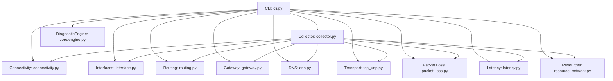
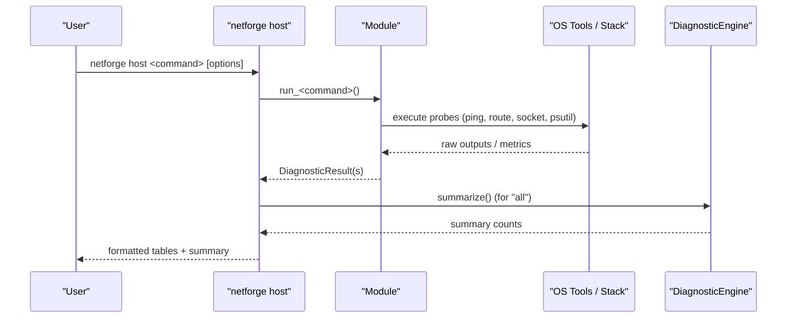
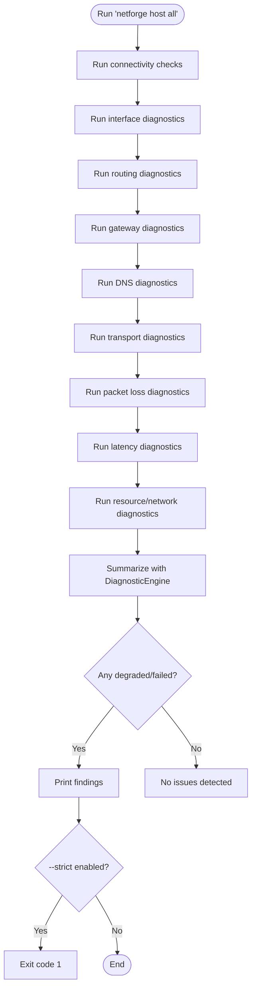
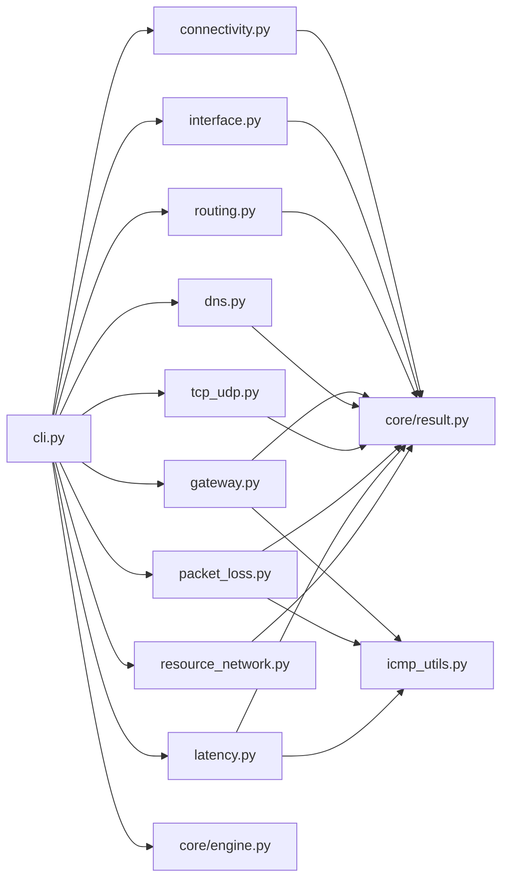

# Host Commands

<cite>
**Referenced Files in This Document**
- [cli.py](file://cli.py)
- [connectivity.py](file://diagnostics/host/connectivity.py)
- [interface.py](file://diagnostics/host/interface.py)
- [routing.py](file://diagnostics/host/routing.py)
- [gateway.py](file://diagnostics/host/gateway.py)
- [dns.py](file://diagnostics/host/dns.py)
- [tcp_udp.py](file://diagnostics/host/tcp_udp.py)
- [packet_loss.py](file://diagnostics/host/packet_loss.py)
- [latency.py](file://diagnostics/host/latency.py)
- [resource_network.py](file://diagnostics/host/resource_network.py)
- [icmp_utils.py](file://diagnostics/host/icmp_utils.py)
- [collector.py](file://diagnostics/host/collector.py)
- [engine.py](file://core/engine.py)
- [result.py](file://core/result.py)
- [README.md](file://README.md)
</cite>

## Table of Contents
1. Introduction
2. Project Structure
3. Core Components
4. Architecture Overview
5. Detailed Component Analysis
6. Dependency Analysis
7. Performance Considerations
8. Troubleshooting Guide
9. Conclusion
10. Appendices

## Introduction
This document provides comprehensive documentation for NetForge host-level diagnostic commands. It covers all host subcommands including connectivity checks, interface inspection, routing table analysis, gateway reachability testing, DNS resolution verification, TCP/UDP transport testing, packet loss measurement, latency and jitter analysis, and resource utilization monitoring. It also documents the "all" command that runs the complete host diagnostic suite with optional rule engine integration for root-cause analysis. For each command, you will find syntax, options, example usage scenarios, and output format explanations. Common troubleshooting workflows and shell script integration patterns are included to help you automate diagnostics effectively.

## Project Structure
The host diagnostics are implemented as modular components under diagnostics/host, each returning a standardized DiagnosticResult. The CLI exposes these modules via the netforge host command group. A collector orchestrates multiple probes into a single result set suitable for rule-based diagnosis.

**Diagram sources**
- [cli.py:46-196](file://cli.py#L46-L196)
- [collector.py:16-61](file://diagnostics/host/collector.py#L16-L61)
- [engine.py:10-83](file://core/engine.py#L10-L83)

**Section sources**
- [cli.py:46-196](file://cli.py#L46-L196)
- [collector.py:16-61](file://diagnostics/host/collector.py#L16-L61)

## Core Components
- DiagnosticResult: Standardized container for module outputs with status, severity, metrics, evidence, warnings, errors, and metadata.
- DiagnosticEngine: Aggregates results, summarizes statuses/severities, and generates findings from failures or degraded states.
- ICMP utilities: Cross-platform ping execution with parsing and caching to support packet loss, latency, and gateway tests.

Key responsibilities:
- Each host diagnostic module performs a focused probe and returns DiagnosticResult objects.
- The CLI binds user-facing commands to module entry points and renders tables.
- The collector composes multiple probes for automated diagnosis pipelines.

**Section sources**
- [result.py:9-47](file://core/result.py#L9-L47)
- [engine.py:10-83](file://core/engine.py#L10-L83)
- [icmp_utils.py:10-126](file://diagnostics/host/icmp_utils.py#L10-L126)

## Architecture Overview
Host diagnostics follow a consistent flow:
- CLI command invokes a module function.
- Module executes OS-specific or network operations.
- Module returns DiagnosticResult(s).
- Optional aggregation via DiagnosticEngine produces summaries and findings.
- Optional RuleEngine integration (via --diagnose) yields root-cause reports.

**Diagram sources**
- [cli.py:112-196](file://cli.py#L112-L196)
- [engine.py:18-53](file://core/engine.py#L18-L53)

## Detailed Component Analysis

### Connectivity Check
- Command: netforge host connectivity
- Purpose: Verify basic TCP reachability to common hosts on port 443.
- Options: None (uses built-in host list).
- Example:
  - netforge host connectivity
- Output:
  - Table columns: Host, Status, Latency
  - Status values: HEALTHY or FAILED
  - Latency: milliseconds if reachable
- Behavior:
  - Attempts TCP connection; records latency_ms when successful.
  - Returns DiagnosticResult per host with status and evidence.

**Section sources**
- [cli.py:46-50](file://cli.py#L46-L50)
- [connectivity.py:16-111](file://diagnostics/host/connectivity.py#L16-L111)

### Interface Inspection
- Command: netforge host interface
- Purpose: Inspect local network interfaces, addresses, MAC, speed, MTU, and operational state.
- Options: None.
- Example:
  - netforge host interface
- Output:
  - Table columns: Interface, State, IPv4, MAC, Speed, MTU
  - State: UP or DOWN
- Behavior:
  - Uses system networking APIs to enumerate interfaces and stats.
  - Marks inactive interfaces as healthy if other interfaces are up; otherwise failed.

**Section sources**
- [cli.py:52-56](file://cli.py#L52-L56)
- [interface.py:16-147](file://diagnostics/host/interface.py#L16-L147)

### Routing Table Analysis
- Command: netforge host routing [--verbose | -v]
- Purpose: Inspect routing table and default gateway across Windows, Linux, and macOS.
- Options:
  - --verbose, -v: Print raw routing table output.
- Example:
  - netforge host routing
  - netforge host routing --verbose
- Output:
  - Table columns: Property, Value (Status, Default Gateway, Default Interface, Active Routes, Operating System)
  - With verbose: Raw routing table printed below the table.
- Behavior:
  - Executes OS-specific commands and parses default gateway and interface.
  - Returns metrics including os, route_count, default_gateway, default_interface.

**Section sources**
- [cli.py:58-64](file://cli.py#L58-L64)
- [routing.py:15-199](file://diagnostics/host/routing.py#L15-L199)

### Gateway Reachability Testing
- Command: netforge host gateway [--count | -c]
- Purpose: Probe default gateway reachability using ICMP and assess loss/latency.
- Options:
  - --count, -c: Number of ICMP probes (default 4).
- Example:
  - netforge host gateway --count 8
- Output:
  - Table columns: Gateway, Loss, Avg RTT, Status
  - Status: HEALTHY, DEGRADED, or FAILED based on loss thresholds.
- Behavior:
  - Reads default gateway from routing table if not provided.
  - Uses ICMP ping utility; computes loss, avg/min/max RTT, jitter.

**Section sources**
- [cli.py:66-72](file://cli.py#L66-L72)
- [gateway.py:15-113](file://diagnostics/host/gateway.py#L15-L113)
- [icmp_utils.py:68-126](file://diagnostics/host/icmp_utils.py#L68-L126)

### DNS Resolution Verification
- Command: netforge host dns [--hostname | -h]
- Purpose: Resolve a hostname and list configured DNS servers.
- Options:
  - --hostname, -h: Target hostname to resolve (default google.com).
- Example:
  - netforge host dns --hostname example.org
- Output:
  - Table columns: Property, Value (Hostname, DNS Servers, Status, Resolution Time, Addresses)
- Behavior:
  - Resolves hostname via system resolver; measures resolution time.
  - Enumerates DNS servers per OS (Windows, macOS, Linux fallback).

**Section sources**
- [cli.py:74-80](file://cli.py#L74-L80)
- [dns.py:21-203](file://diagnostics/host/dns.py#L21-L203)

### TCP/UDP Transport Testing
- Command: netforge host transport [--host]
- Purpose: Test TCP/UDP transport to common ports for reachability and latency.
- Options:
  - --host: Target host (default 1.1.1.1).
- Example:
  - netforge host transport --host 8.8.8.8
- Output:
  - Table columns: Protocol, Host, Port, Status, Latency
  - Tests TCP ports 53, 80, 443 and UDP port 53 by default.
- Behavior:
  - TCP: Connects and measures handshake latency.
  - UDP: Sends protocol-aware requests for DNS/NTP or generic datagram test.

**Section sources**
- [cli.py:82-88](file://cli.py#L82-L88)
- [tcp_udp.py:16-226](file://diagnostics/host/tcp_udp.py#L16-L226)

### Packet Loss Measurement
- Command: netforge host packet-loss [--count | -c]
- Purpose: Measure ICMP packet loss to common targets.
- Options:
  - --count, -c: Number of ICMP probes per target (default 5).
- Example:
  - netforge host packet-loss --count 10
- Output:
  - Table columns: Host, Loss, Status
  - Status thresholds: HEALTHY (0%), DEGRADED (<20%), FAILED (>=20%).
- Behavior:
  - Probes 1.1.1.1 and 8.8.8.8 by default.
  - Parses ICMP output to compute loss percentage.

**Section sources**
- [cli.py:90-96](file://cli.py#L90-L96)
- [packet_loss.py:14-121](file://diagnostics/host/packet_loss.py#L14-L121)
- [icmp_utils.py:29-126](file://diagnostics/host/icmp_utils.py#L29-L126)

### Latency and Jitter Analysis
- Command: netforge host latency [--count | -c]
- Purpose: Measure latency and jitter to common targets.
- Options:
  - --count, -c: Number of ICMP probes per target (default 5).
- Example:
  - netforge host latency --count 8
- Output:
  - Table columns: Host, Min, Avg, Max, Jitter, Status
  - Status thresholds: HEALTHY (<250 ms), DEGRADED (>=250 ms).
- Behavior:
  - Computes RFC 3550 jitter and statistical standard deviation from latencies.
  - Reports min/avg/max RTT and jitter.

**Section sources**
- [cli.py:98-104](file://cli.py#L98-L104)
- [latency.py:14-125](file://diagnostics/host/latency.py#L14-L125)
- [icmp_utils.py:29-126](file://diagnostics/host/icmp_utils.py#L29-L126)

### Resource Utilization Monitoring
- Command: netforge host resources
- Purpose: Analyze host CPU, memory, and network activity over a sampling interval.
- Options: None.
- Example:
  - netforge host resources
- Output:
  - Table columns: Metric, Value (CPU, Memory, RX/TX Throughput, Packets/s, Drops/s, Errors/s, Cumulative drops/errors)
- Behavior:
  - Samples CPU and memory; computes per-second deltas for network counters.
  - Evaluates health based on active drops/errors and resource saturation.

**Section sources**
- [cli.py:106-110](file://cli.py#L106-L110)
- [resource_network.py:16-190](file://diagnostics/host/resource_network.py#L16-L190)

### All Host Diagnostics Suite
- Command: netforge host all [--strict] [--diagnose] [--target | -t]
- Purpose: Run the full host diagnostic suite and optionally integrate with the rule engine for root-cause analysis.
- Options:
  - --strict: Exit with code 1 if any diagnostics are degraded or failed.
  - --diagnose: Also run the RuleEngine for root-cause analysis.
  - --target, -t: Target host used by DNS and collectors (default google.com).
- Example:
  - netforge host all
  - netforge host all --strict --diagnose --target example.com
- Output:
  - Sequential sections for each diagnostic category with tables.
  - Summary panel showing total_checks, healthy, degraded, failed, unknown.
  - Findings listing modules with issues and details.
  - Optional diagnosis report with root-cause analysis when --diagnose is enabled.
- Behavior:
  - Executes connectivity, interfaces, routing, gateway, DNS, transport, packet loss, latency, and resources.
  - Aggregates results via DiagnosticEngine.summarize().
  - When --diagnose is set, collects host diagnostics and runs RuleEngine.analyze(), rendering a report and exiting with appropriate codes.

**Diagram sources**
- [cli.py:112-196](file://cli.py#L112-L196)
- [engine.py:18-83](file://core/engine.py#L18-L83)

**Section sources**
- [cli.py:112-196](file://cli.py#L112-L196)

## Dependency Analysis
- CLI depends on host diagnostic modules and core engine.
- Modules depend on OS tools (ping, route/netstat), Python stdlib (socket, platform), and psutil for resource metrics.
- Collector composes multiple modules for unified diagnosis.
- Engine aggregates results and generates findings.

**Diagram sources**
- [cli.py:46-196](file://cli.py#L46-L196)
- [icmp_utils.py:68-126](file://diagnostics/host/icmp_utils.py#L68-L126)
- [result.py:9-47](file://core/result.py#L9-L47)

**Section sources**
- [cli.py:46-196](file://cli.py#L46-L196)
- [icmp_utils.py:68-126](file://diagnostics/host/icmp_utils.py#L68-L126)
- [result.py:9-47](file://core/result.py#L9-L47)

## Performance Considerations
- Ping caching: ICMP results are cached for 15 seconds to reduce redundant probes within a short timeframe.
- Sampling intervals: Resource metrics use a 1-second interval to balance accuracy and overhead.
- Timeout handling: Socket connections and subprocess calls include timeouts to prevent hangs.
- Minimal probes: Default counts are conservative to keep runtime reasonable while providing meaningful metrics.

[No sources needed since this section provides general guidance]

## Troubleshooting Guide
Common issues and resolutions:
- No default gateway:
  - Symptom: Gateway diagnostics report no default gateway configured.
  - Action: Verify routing table and ensure a default route exists.
- DNS resolution failure:
  - Symptom: DNS diagnostics report failure.
  - Action: Check configured DNS servers and network connectivity to upstream resolvers.
- High packet loss:
  - Symptom: Packet loss diagnostics show DEGRADED or FAILED.
  - Action: Investigate link quality, firewall rules, and upstream congestion.
- Elevated latency/jitter:
  - Symptom: Latency diagnostics indicate DEGRADED status.
  - Action: Check path congestion, wireless interference, and application load.
- Resource saturation:
  - Symptom: Resources diagnostics report high CPU/memory or active drops/errors.
  - Action: Identify resource-intensive processes and investigate NIC errors/drops.

Integration tips:
- Use --strict in scripts to enforce non-zero exit codes on failures.
- Combine host diagnostics with diagnose commands for deeper root-cause analysis.
- Capture JSON output where supported for programmatic processing.

**Section sources**
- [gateway.py:15-113](file://diagnostics/host/gateway.py#L15-L113)
- [dns.py:92-203](file://diagnostics/host/dns.py#L92-L203)
- [packet_loss.py:14-121](file://diagnostics/host/packet_loss.py#L14-L121)
- [latency.py:14-125](file://diagnostics/host/latency.py#L14-L125)
- [resource_network.py:16-190](file://diagnostics/host/resource_network.py#L16-L190)
- [cli.py:112-196](file://cli.py#L112-L196)

## Conclusion
NetForge’s host commands provide a comprehensive toolkit for diagnosing endpoint connectivity, configuration, and performance. Each command returns structured results suitable for both human-readable tables and machine consumption. The "all" command streamlines end-to-end diagnostics and integrates with the rule engine for actionable insights. By combining these commands in scripts and leveraging strict mode, operators can automate routine health checks and incident response workflows effectively.

[No sources needed since this section summarizes without analyzing specific files]

## Appendices

### Command Reference Summary
- Connectivity: netforge host connectivity
- Interfaces: netforge host interface
- Routing: netforge host routing [--verbose | -v]
- Gateway: netforge host gateway [--count | -c]
- DNS: netforge host dns [--hostname | -h]
- Transport: netforge host transport [--host]
- Packet Loss: netforge host packet-loss [--count | -c]
- Latency: netforge host latency [--count | -c]
- Resources: netforge host resources
- All: netforge host all [--strict] [--diagnose] [--target | -t]

**Section sources**
- [cli.py:46-196](file://cli.py#L46-L196)
- [README.md:11-19](file://README.md#L11-L19)