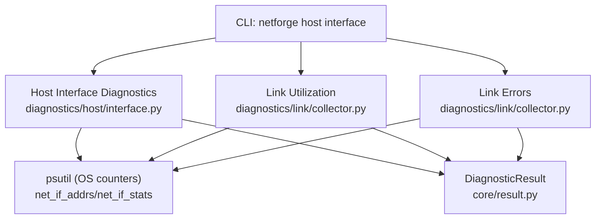
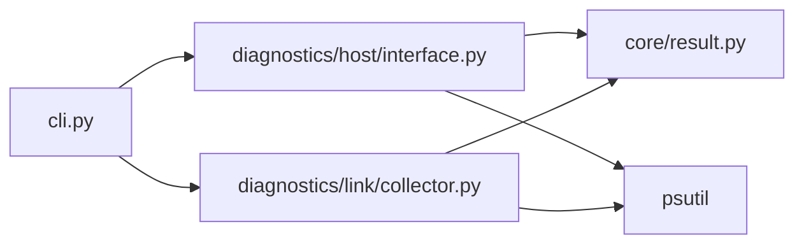

# Interface Inspection

<cite>
**Referenced Files in This Document**
- [cli.py](file://cli.py)
- [interface.py](file://diagnostics/host/interface.py)
- [collector.py](file://diagnostics/link/collector.py)
- [result.py](file://core/result.py)
- [README.md](file://README.md)
</cite>

## Table of Contents
1. [Introduction](#introduction)
2. [Project Structure](#project-structure)
3. [Core Components](#core-components)
4. [Architecture Overview](#architecture-overview)
5. [Detailed Component Analysis](#detailed-component-analysis)
6. [Dependency Analysis](#dependency-analysis)
7. [Performance Considerations](#performance-considerations)
8. [Troubleshooting Guide](#troubleshooting-guide)
9. [Conclusion](#conclusion)
10. [Appendices](#appendices)

## Introduction
This document explains the NetForge interface inspection command and related link diagnostics used to enumerate network interfaces, view configuration details (names, IP addresses, MAC addresses), assess operational status (link up/down), and monitor traffic statistics (utilization, errors, drops). It also provides examples for filtering by interface type, checking interface errors, and monitoring utilization, along with output formats, field descriptions, and common troubleshooting scenarios.

## Project Structure
NetForge exposes a CLI that routes commands to diagnostic modules. The interface inspection command is part of host-level diagnostics and integrates with link-level metrics for deeper analysis.



**Diagram sources**
- [cli.py:46-55](file://cli.py#L46-L55)
- [interface.py:16-147](file://diagnostics/host/interface.py#L16-L147)
- [collector.py:29-210](file://diagnostics/link/collector.py#L29-L210)
- [result.py:24-47](file://core/result.py#L24-L47)

**Section sources**
- [cli.py:46-55](file://cli.py#L46-L55)
- [README.md:11-19](file://README.md#L11-L19)

## Core Components
- Host interface inspection: enumerates interfaces, collects addresses (IPv4/IPv6), MAC, speed, MTU, and link state; classifies health based on whether any non-loopback interface is active.
- Link utilization: measures per-interface RX/TX throughput and utilization percentage over a sampling interval.
- Link errors: measures per-interface drop and error rates over a sampling interval.
- Diagnostic result model: standardized structure carrying module, category, status, severity, summary, target, metrics, evidence, warnings, and metadata.

Key responsibilities:
- Enumerate interfaces and their configuration.
- Determine operational status and classify health.
- Measure traffic volume and derive utilization.
- Detect link-layer issues via drops/errors.

**Section sources**
- [interface.py:16-147](file://diagnostics/host/interface.py#L16-L147)
- [collector.py:29-210](file://diagnostics/link/collector.py#L29-L210)
- [result.py:24-47](file://core/result.py#L24-L47)

## Architecture Overview
The interface inspection workflow combines static configuration discovery with dynamic traffic measurement.

```mermaid
sequenceDiagram
participant User as "User"
participant CLI as "CLI (host interface)"
participant HostIF as "inspect_interfaces()"
participant Link as "measure_link_*()"
participant OS as "psutil"
participant Out as "Console/Table"
User->>CLI : run "netforge host interface"
CLI->>HostIF : call inspect_interfaces()
HostIF->>OS : net_if_addrs(), net_if_stats()
OS-->>HostIF : addresses, stats
HostIF-->>CLI : list[DiagnosticResult]
CLI->>Out : print table (Interface, State, IPv4, MAC, Speed, MTU)
User->>CLI : run "netforge link util|errors|all"
CLI->>Link : measure_link_utilization()/measure_link_errors()
Link->>OS : net_io_counters(pernic=True), net_if_stats()
OS-->>Link : counters, stats
Link-->>CLI : list[DiagnosticResult]
CLI->>Out : print tables (Util %, Drops/s, Status)
```

**Diagram sources**
- [cli.py:46-55](file://cli.py#L46-L55)
- [interface.py:16-147](file://diagnostics/host/interface.py#L16-L147)
- [collector.py:29-210](file://diagnostics/link/collector.py#L29-L210)

## Detailed Component Analysis

### Host Interface Inspection
- Enumerates all interfaces using system APIs.
- Collects:
  - Interface name
  - Link state (UP/DOWN)
  - IPv4 addresses (list)
  - IPv6 addresses (list)
  - MAC address (if available)
  - Speed (Mbps)
  - MTU
- Health classification:
  - HEALTHY if interface is UP
  - HEALTHY if DOWN but another non-loopback interface is UP (inactive adapter is normal)
  - FAILED if no non-loopback interface is UP (no active network)

Output table fields:
- Interface: name of the network interface
- State: UP or DOWN
- IPv4: comma-separated IPv4 addresses
- MAC: hardware address (if present)
- Speed: negotiated link speed in Mbps
- MTU: maximum transmission unit

Example usage:
- netforge host interface

Notes:
- Loopback interfaces are included in enumeration but not considered when determining overall network activity.
- IPv6 addresses are collected internally but not shown in the default table.

**Section sources**
- [interface.py:16-147](file://diagnostics/host/interface.py#L16-L147)
- [cli.py:46-55](file://cli.py#L46-L55)

### Link Utilization Monitoring
- Measures RX and TX bytes over a configurable interval to compute bits per second.
- Derives utilization percentage against link capacity (when speed is known).
- Classifies status:
  - DEGRADED at high utilization thresholds
  - HEALTHY otherwise

Output table fields (via CLI):
- Interface: target interface name
- Util %: utilization percentage
- RX Mbps / TX Mbps: throughput values
- Status: HEALTHY/DEGRADED/FAILED

Example usage:
- netforge link util --interval 1.0
- netforge traffic bandwidth --interval 1.0

**Section sources**
- [collector.py:29-84](file://diagnostics/link/collector.py#L29-L84)
- [cli.py:203-227](file://cli.py#L203-L227)
- [cli.py:365-388](file://cli.py#L365-L388)

### Link Errors and Drops Monitoring
- Samples NIC counters to compute drops per second and errors per second.
- Classifies status:
  - FAILED for significant drops/errors
  - DEGRADED for moderate levels
  - HEALTHY otherwise

Output table fields (via CLI):
- Interface: target interface name
- Drops/s: packet drops rate
- Errors/s: link-layer errors rate
- Status: HEALTHY/DEGRADED/FAILED

Example usage:
- netforge link errors --interval 1.0

**Section sources**
- [collector.py:87-129](file://diagnostics/link/collector.py#L87-L129)
- [cli.py:230-251](file://cli.py#L230-L251)

### Comprehensive Link Diagnostics
- Runs utilization, errors, and congestion assessment together.
- Aggregates results into a single table showing utilization, drops, congestion state, and overall status.

Example usage:
- netforge link all --interval 1.0

**Section sources**
- [collector.py:132-210](file://diagnostics/link/collector.py#L132-L210)
- [cli.py:254-261](file://cli.py#L254-L261)

### Data Model: DiagnosticResult
Standardized result object used across modules:
- module: source module name
- category: domain (e.g., host, link)
- status: HEALTHY/DEGRADED/FAILED/UNKNOWN
- severity: INFO/LOW/MEDIUM/HIGH/CRITICAL
- summary: human-readable description
- target: interface or endpoint identifier
- metrics: key-value measurements
- evidence: supporting facts
- warnings: optional alerts
- metadata: additional context

**Section sources**
- [result.py:24-47](file://core/result.py#L24-L47)

## Dependency Analysis
- CLI depends on diagnostic modules to execute commands and render results.
- Host interface module depends on psutil for system information and returns DiagnosticResult objects.
- Link modules depend on psutil counters and core metrics utilities to compute utilization and congestion.
- All modules produce consistent DiagnosticResult structures enabling unified reporting and rule-based diagnosis.



**Diagram sources**
- [cli.py:46-55](file://cli.py#L46-L55)
- [interface.py:16-147](file://diagnostics/host/interface.py#L16-L147)
- [collector.py:29-210](file://diagnostics/link/collector.py#L29-L210)
- [result.py:24-47](file://core/result.py#L24-L47)

**Section sources**
- [cli.py:46-55](file://cli.py#L46-L55)
- [interface.py:16-147](file://diagnostics/host/interface.py#L16-L147)
- [collector.py:29-210](file://diagnostics/link/collector.py#L29-L210)
- [result.py:24-47](file://core/result.py#L24-L47)

## Performance Considerations
- Sampling interval: longer intervals smooth out bursts but reduce responsiveness; shorter intervals increase CPU overhead.
- Loopback exclusion: loopback interfaces are excluded from utilization/error calculations to avoid noise.
- Speed detection: utilization accuracy depends on accurate link speed; unknown speeds fall back to raw throughput display.
- Counter deltas: metrics are computed from counter differences; ensure stable sampling windows for reliable rates.

[No sources needed since this section provides general guidance]

## Troubleshooting Guide
Common scenarios and how to investigate:

- No active network:
  - Symptom: All non-loopback interfaces show DOWN.
  - Action: Check physical connectivity, drivers, and interface enablement.
  - Evidence: Host interface inspection marks status as FAILED when no active interface exists.

- High utilization:
  - Symptom: Utilization near or above threshold.
  - Action: Identify top talkers, schedule heavy tasks off-peak, consider QoS or capacity upgrades.
  - Evidence: Link utilization reports high percentages and may mark DEGRADED.

- Active drops/errors:
  - Symptom: Non-zero drops/s or errors/s.
  - Action: Inspect cabling, switch ports, duplex settings, and NIC firmware/drivers.
  - Evidence: Link errors report elevated rates and may mark DEGRADED/FAILED.

- Inactive adapter:
  - Symptom: Specific interface DOWN while others are UP.
  - Action: Verify cable/Wi-Fi connection, driver state, and administrative status.
  - Evidence: Host interface inspection marks inactive adapters as healthy when other interfaces are active.

- Unknown speed:
  - Symptom: Utilization cannot be calculated due to missing speed.
  - Action: Use raw throughput (Mbps) to gauge load; verify platform support for speed queries.
  - Evidence: Utilization module falls back to displaying total throughput when speed is unavailable.

**Section sources**
- [interface.py:23-85](file://diagnostics/host/interface.py#L23-L85)
- [collector.py:53-58](file://diagnostics/link/collector.py#L53-L58)
- [collector.py:106-111](file://diagnostics/link/collector.py#L106-L111)

## Conclusion
NetForge’s interface inspection provides a comprehensive view of network interfaces, including names, IP addresses, MAC addresses, link state, and basic configuration like speed and MTU. For operational insights, link utilization and error monitoring reveal traffic patterns and potential issues. Together, these tools enable effective troubleshooting and performance management of network interfaces.

[No sources needed since this section summarizes without analyzing specific files]

## Appendices

### Command Reference
- netforge host interface: Enumerate interfaces and show configuration/status.
- netforge link util --interval N: Measure per-interface utilization.
- netforge link errors --interval N: Measure per-interface drops/errors.
- netforge link all --interval N: Run full link diagnostics (utilization, errors, congestion).
- netforge traffic bandwidth --interval N: Show current interface bandwidth sample.

**Section sources**
- [cli.py:46-55](file://cli.py#L46-L55)
- [cli.py:203-261](file://cli.py#L203-L261)
- [cli.py:365-388](file://cli.py#L365-L388)

### Output Field Descriptions
- Interface: Name of the network interface.
- State: Operational status (UP/DOWN).
- IPv4: Comma-separated IPv4 addresses assigned to the interface.
- MAC: Hardware address (if available).
- Speed: Negotiated link speed in Mbps.
- MTU: Maximum transmission unit size.
- Util %: Percentage of link capacity used during the sampling interval.
- RX Mbps / TX Mbps: Received/transmitted throughput in megabits per second.
- Drops/s: Packet drops per second.
- Errors/s: Link-layer errors per second.
- Status: Overall health classification (HEALTHY/DEGRADED/FAILED).

**Section sources**
- [interface.py:116-143](file://diagnostics/host/interface.py#L116-L143)
- [collector.py:60-83](file://diagnostics/link/collector.py#L60-L83)
- [collector.py:113-128](file://diagnostics/link/collector.py#L113-L128)