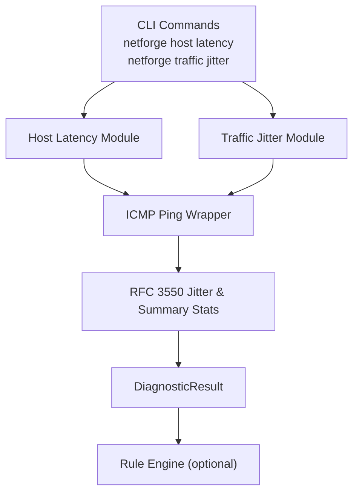
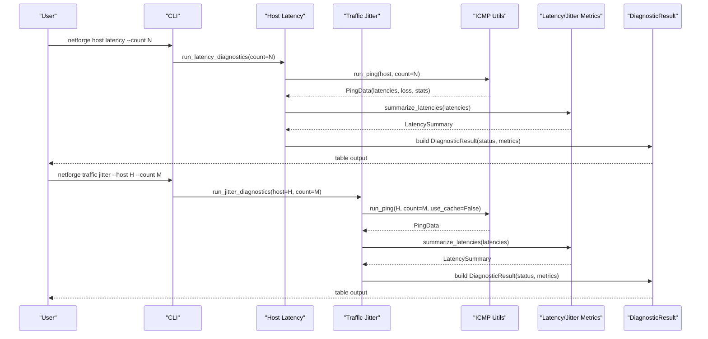
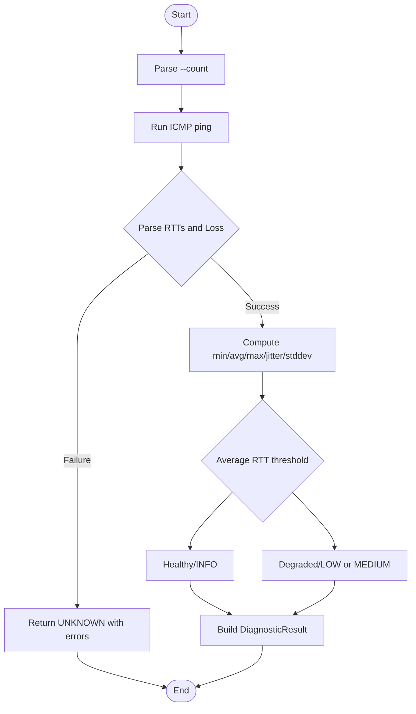
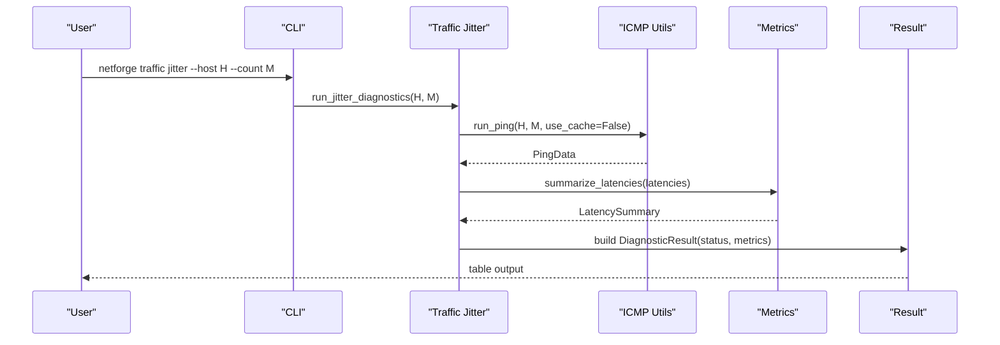
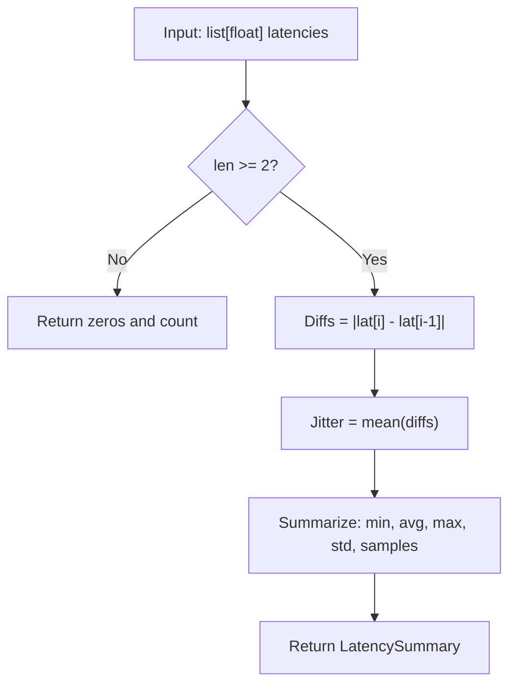
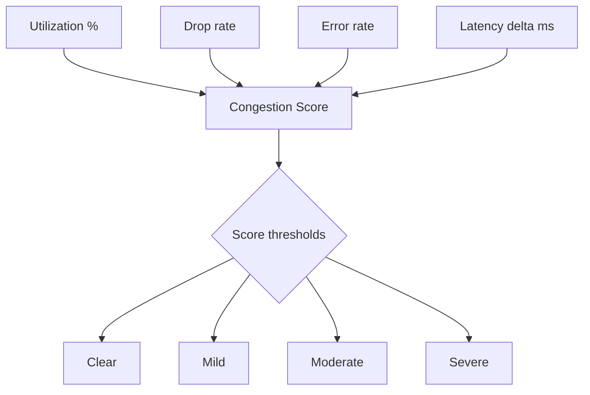
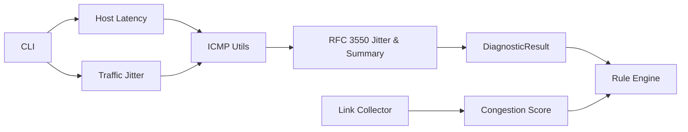

# Latency & Jitter Analysis

<cite>
**Referenced Files in This Document**
- [cli.py](file://cli.py)
- [latency.py](file://diagnostics/host/latency.py)
- [icmp_utils.py](file://diagnostics/host/icmp_utils.py)
- [latency_jitter.py](file://core/metrics/latency_jitter.py)
- [speed.py](file://diagnostics/traffic/speed.py)
- [congestion.py](file://core/metrics/congestion.py)
- [transit_rules.py](file://analysis/rules/transit_rules.py)
- [cross_rules.py](file://analysis/rules/cross_rules.py)
- [collector.py](file://diagnostics/link/collector.py)
- [result.py](file://core/result.py)
- [README.md](file://README.md)
</cite>

## Table of Contents
1. [Introduction](#introduction)
2. [Project Structure](#project-structure)
3. [Core Components](#core-components)
4. [Architecture Overview](#architecture-overview)
5. [Detailed Component Analysis](#detailed-component-analysis)
6. [Dependency Analysis](#dependency-analysis)
7. [Performance Considerations](#performance-considerations)
8. [Troubleshooting Guide](#troubleshooting-guide)
9. [Conclusion](#conclusion)
10. [Appendices](#appendices)

## Introduction
This document explains the NetForge latency and jitter analysis command, how to configure probe counts, how round-trip time (RTT) is measured, and how jitter is calculated using standard algorithms. It also provides guidance on interpreting latency statistics, identifying network congestion patterns, measuring real-time communication quality, and applying statistical thresholds for VoIP, gaming, and streaming use cases. Finally, it includes troubleshooting strategies for high-latency scenarios.

## Project Structure
The latency and jitter functionality spans several modules:
- CLI entry points expose commands for host-level diagnostics and traffic-level jitter measurement.
- Host-level latency uses ICMP ping to collect RTT samples and computes summary statistics.
- Traffic-level jitter provides a dedicated command that emphasizes RFC 3550 jitter.
- Core metrics implement RFC 3550 jitter and general latency summaries.
- Congestion scoring integrates link utilization, error/drop rates, and latency deltas to detect congestion.
- Rule engine rules interpret combined observations to identify issues such as bufferbloat or transit degradation.

**Diagram sources**
- [cli.py:98-103](file://cli.py#L98-L103)
- [latency.py:14-81](file://diagnostics/host/latency.py#L14-L81)
- [icmp_utils.py:68-115](file://diagnostics/host/icmp_utils.py#L68-L115)
- [latency_jitter.py:7-40](file://core/metrics/latency_jitter.py#L7-L40)
- [speed.py:73-110](file://diagnostics/traffic/speed.py#L73-L110)
- [result.py:24-47](file://core/result.py#L24-L47)

**Section sources**
- [cli.py:98-103](file://cli.py#L98-L103)
- [README.md:11-19](file://README.md#L11-L19)

## Core Components
- Configurable probe count: Both host and traffic commands accept a count parameter to control the number of ICMP probes.
- RTT measurement: Uses system ping with platform-specific flags and parses per-packet RTT values.
- Jitter calculation: Implements RFC 3550 interarrival jitter (mean absolute difference between consecutive latencies).
- Statistical summaries: Computes min, avg, max, standard deviation, and sample count.
- Thresholds and status: Applies thresholds to classify health and severity; traffic jitter has explicit thresholds for degraded vs healthy states.
- Congestion detection: Combines utilization, drops/errors, and latency delta into a score to infer congestion.

**Section sources**
- [cli.py:98-103](file://cli.py#L98-L103)
- [cli.py:354-362](file://cli.py#L354-L362)
- [icmp_utils.py:68-115](file://diagnostics/host/icmp_utils.py#L68-L115)
- [latency_jitter.py:7-40](file://core/metrics/latency_jitter.py#L7-L40)
- [latency.py:43-81](file://diagnostics/host/latency.py#L43-L81)
- [speed.py:73-110](file://diagnostics/traffic/speed.py#L73-L110)
- [congestion.py:4-50](file://core/metrics/congestion.py#L4-L50)

## Architecture Overview
The end-to-end flow for latency and jitter analysis:

**Diagram sources**
- [cli.py:98-103](file://cli.py#L98-L103)
- [cli.py:354-362](file://cli.py#L354-L362)
- [latency.py:14-81](file://diagnostics/host/latency.py#L14-L81)
- [speed.py:73-110](file://diagnostics/traffic/speed.py#L73-L110)
- [icmp_utils.py:68-115](file://diagnostics/host/icmp_utils.py#L68-L115)
- [latency_jitter.py:7-40](file://core/metrics/latency_jitter.py#L7-L40)
- [result.py:24-47](file://core/result.py#L24-L47)

## Detailed Component Analysis

### Host Latency Command
- Purpose: Measure RTT and jitter to one or more hosts via ICMP ping and present a summary table.
- Probe configuration: The --count option controls the number of ICMP probes sent.
- Measurement: Executes system ping, parses per-packet RTTs, and computes summary statistics including RFC 3550 jitter and standard deviation.
- Thresholds: Classifies average latency into healthy/degraded categories with associated severities.
- Output: Returns a structured result containing metrics and evidence for downstream consumption or rule evaluation.

**Diagram sources**
- [cli.py:98-103](file://cli.py#L98-L103)
- [latency.py:14-81](file://diagnostics/host/latency.py#L14-L81)
- [icmp_utils.py:29-65](file://diagnostics/host/icmp_utils.py#L29-L65)
- [latency_jitter.py:28-40](file://core/metrics/latency_jitter.py#L28-L40)

**Section sources**
- [cli.py:98-103](file://cli.py#L98-L103)
- [latency.py:14-81](file://diagnostics/host/latency.py#L14-L81)
- [icmp_utils.py:29-65](file://diagnostics/host/icmp_utils.py#L29-L65)
- [latency_jitter.py:28-40](file://core/metrics/latency_jitter.py#L28-L40)

### Traffic Jitter Command
- Purpose: Provide a focused jitter measurement with explicit thresholds for real-time applications.
- Probe configuration: Accepts --host and --count to target a specific host and set the number of probes.
- Measurement: Runs ICMP ping without cache to ensure fresh samples, then computes RFC 3550 jitter and summary stats.
- Thresholds: Classifies jitter as healthy or degraded based on defined ranges.
- Output: Presents a concise table with jitter, average RTT, and status.

**Diagram sources**
- [cli.py:354-362](file://cli.py#L354-L362)
- [speed.py:73-110](file://diagnostics/traffic/speed.py#L73-L110)
- [icmp_utils.py:68-115](file://diagnostics/host/icmp_utils.py#L68-L115)
- [latency_jitter.py:28-40](file://core/metrics/latency_jitter.py#L28-L40)
- [result.py:24-47](file://core/result.py#L24-L47)

**Section sources**
- [cli.py:354-362](file://cli.py#L354-L362)
- [speed.py:73-110](file://diagnostics/traffic/speed.py#L73-L110)
- [icmp_utils.py:68-115](file://diagnostics/host/icmp_utils.py#L68-L115)
- [latency_jitter.py:28-40](file://core/metrics/latency_jitter.py#L28-L40)
- [result.py:24-47](file://core/result.py#L24-L47)

### RFC 3550 Jitter and Latency Statistics
- RFC 3550 jitter: Computed as the mean absolute difference between consecutive latency samples.
- Latency summary: Provides min, average, max, jitter, standard deviation, and sample count.
- Robustness: Handles empty or insufficient samples gracefully by returning zeroed summaries.

**Diagram sources**
- [latency_jitter.py:7-40](file://core/metrics/latency_jitter.py#L7-L40)

**Section sources**
- [latency_jitter.py:7-40](file://core/metrics/latency_jitter.py#L7-L40)

### Congestion Detection Integration
- Congestion score: Combines link utilization, drop/error rates, and latency delta to produce a 0–100 score.
- State mapping: Maps scores to clear/mild/moderate/severe states.
- Link collector: Uses the score to label link congestion results and can be fed into rule evaluation.

**Diagram sources**
- [congestion.py:4-50](file://core/metrics/congestion.py#L4-L50)
- [collector.py:132-159](file://diagnostics/link/collector.py#L132-L159)

**Section sources**
- [congestion.py:4-50](file://core/metrics/congestion.py#L4-L50)
- [collector.py:132-159](file://diagnostics/link/collector.py#L132-L159)

## Dependency Analysis
Key dependencies and relationships:
- CLI depends on diagnostic modules to execute measurements and display results.
- Host and traffic modules depend on ICMP utilities to obtain raw RTT samples.
- ICMP utilities depend on core metrics to compute jitter and summaries.
- Congestion scoring is used by link collectors and can influence rule-based diagnosis.
- Rule engine consumes results to identify complex issues like bufferbloat or transit degradation.

**Diagram sources**
- [cli.py:98-103](file://cli.py#L98-L103)
- [cli.py:354-362](file://cli.py#L354-L362)
- [latency.py:14-81](file://diagnostics/host/latency.py#L14-L81)
- [speed.py:73-110](file://diagnostics/traffic/speed.py#L73-L110)
- [icmp_utils.py:68-115](file://diagnostics/host/icmp_utils.py#L68-L115)
- [latency_jitter.py:7-40](file://core/metrics/latency_jitter.py#L7-L40)
- [congestion.py:4-50](file://core/metrics/congestion.py#L4-L50)
- [collector.py:132-159](file://diagnostics/link/collector.py#L132-L159)

**Section sources**
- [cli.py:98-103](file://cli.py#L98-L103)
- [cli.py:354-362](file://cli.py#L354-L362)
- [latency.py:14-81](file://diagnostics/host/latency.py#L14-L81)
- [speed.py:73-110](file://diagnostics/traffic/speed.py#L73-L110)
- [icmp_utils.py:68-115](file://diagnostics/host/icmp_utils.py#L68-L115)
- [latency_jitter.py:7-40](file://core/metrics/latency_jitter.py#L7-L40)
- [congestion.py:4-50](file://core/metrics/congestion.py#L4-L50)
- [collector.py:132-159](file://diagnostics/link/collector.py#L132-L159)

## Performance Considerations
- Probe count selection: Higher counts improve statistical reliability but increase measurement duration and load. Use moderate counts for quick checks and higher counts for baseline establishment.
- Caching behavior: ICMP utility caches results for a short TTL to reduce redundant pings; disable caching when you need fresh measurements for jitter-sensitive assessments.
- System overhead: Frequent pinging can impact CPU and network stack; schedule measurements during low-traffic windows for accurate baselines.
- Throughput vs latency: When tuning streaming or gaming, avoid saturating links during measurement to prevent artificial latency spikes.

[No sources needed since this section provides general guidance]

## Troubleshooting Guide
Common issues and resolutions:
- High average latency: Indicates path congestion, long routes, or remote server load. Check hop-by-hop latency and loss to isolate segments.
- Elevated jitter: Suggests variable queuing delays; often caused by bufferbloat or bursty traffic. Evaluate link utilization and congestion scores.
- Packet loss: Correlate with congestion indicators; if local link utilization is high and losses appear on early hops, focus on access network or Wi-Fi.
- Rule-based insights: Use the rule engine to combine host, link, and path observations to pinpoint root causes and get actionable recommendations.

Practical steps:
- Run host latency with increased probe counts to stabilize averages and jitter.
- Run traffic jitter against a nearby endpoint to assess last-mile stability.
- Inspect link utilization and congestion scores to identify saturated interfaces.
- If severe packet loss is detected, follow recommended actions such as isolating LAN vs WAN loss and resetting carrier equipment.

**Section sources**
- [latency.py:43-81](file://diagnostics/host/latency.py#L43-L81)
- [speed.py:73-110](file://diagnostics/traffic/speed.py#L73-L110)
- [congestion.py:4-50](file://core/metrics/congestion.py#L4-L50)
- [collector.py:132-159](file://diagnostics/link/collector.py#L132-L159)
- [transit_rules.py:59-67](file://analysis/rules/transit_rules.py#L59-L67)
- [cross_rules.py:9-48](file://analysis/rules/cross_rules.py#L9-L48)

## Conclusion
NetForge’s latency and jitter analysis provides robust, configurable measurements using ICMP ping and RFC 3550 jitter calculations. By combining per-packet RTT sampling, statistical summaries, and congestion scoring, it enables accurate assessment of real-time communication quality. The included thresholds and rule engine support practical interpretation for VoIP, gaming, and streaming scenarios, while offering actionable troubleshooting steps for high-latency and congested networks.

[No sources needed since this section summarizes without analyzing specific files]

## Appendices

### Interpreting Latency Statistics
- Min/Max: Indicate best/w-case conditions; large spreads suggest instability.
- Average: Primary indicator of typical performance; compare against application requirements.
- Jitter: Critical for real-time media; lower is better.
- Standard Deviation: Measures variability; high values indicate inconsistent performance.
- Samples: More samples improve confidence; use sufficient counts for reliable baselines.

**Section sources**
- [latency_jitter.py:28-40](file://core/metrics/latency_jitter.py#L28-L40)
- [icmp_utils.py:29-65](file://diagnostics/host/icmp_utils.py#L29-L65)

### Thresholds and Configuration
- Host latency thresholds: Classify average RTT into healthy/degraded categories with associated severities.
- Traffic jitter thresholds: Define ranges for healthy vs degraded jitter to guide real-time application tuning.
- Congestion score thresholds: Map scores to clear/mild/moderate/severe states to inform remediation.

**Section sources**
- [latency.py:43-81](file://diagnostics/host/latency.py#L43-L81)
- [speed.py:86-92](file://diagnostics/traffic/speed.py#L86-L92)
- [congestion.py:42-50](file://core/metrics/congestion.py#L42-L50)

### Use Cases and Examples
- VoIP quality assessment: Monitor jitter and average RTT; keep jitter low and latency within acceptable bounds for clear voice.
- Gaming network optimization: Focus on minimizing jitter and avoiding spikes; ensure stable RTT and low loss for responsive gameplay.
- Streaming performance tuning: Balance throughput and latency; monitor congestion and adjust buffers to reduce rebuffering while maintaining smooth playback.

[No sources needed since this section provides general guidance]

### Command Reference
- Host latency: netforge host latency --count N
- Traffic jitter: netforge traffic jitter --host H --count M

**Section sources**
- [cli.py:98-103](file://cli.py#L98-L103)
- [cli.py:354-362](file://cli.py#L354-L362)
- [README.md:11-19](file://README.md#L11-L19)