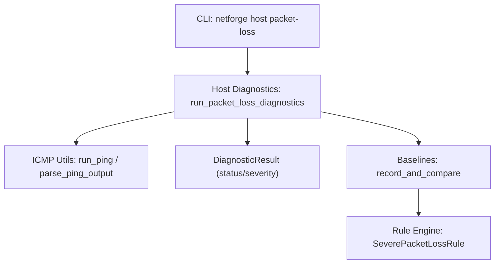
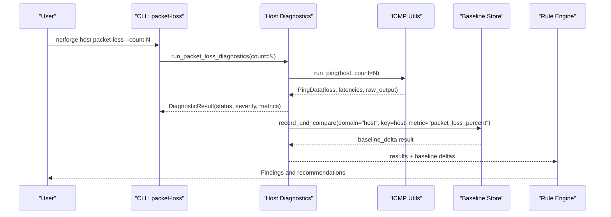
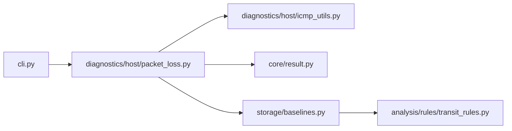

# Packet Loss Measurement

<cite>
**Referenced Files in This Document**
- [cli.py](file://cli.py)
- [packet_loss.py](file://diagnostics/host/packet_loss.py)
- [icmp_utils.py](file://diagnostics/host/icmp_utils.py)
- [loss.py](file://core/metrics/loss.py)
- [result.py](file://core/result.py)
- [baselines.py](file://storage/baselines.py)
- [transit_rules.py](file://analysis/rules/transit_rules.py)
- [README.md](file://README.md)
</cite>

## Table of Contents
1. [Introduction](#introduction)
2. [Project Structure](#project-structure)
3. [Core Components](#core-components)
4. [Architecture Overview](#architecture-overview)
5. [Detailed Component Analysis](#detailed-component-analysis)
6. [Dependency Analysis](#dependency-analysis)
7. [Performance Considerations](#performance-considerations)
8. [Troubleshooting Guide](#troubleshooting-guide)
9. [Conclusion](#conclusion)
10. [Appendices](#appendices)

## Introduction
This document explains the NetForge packet loss measurement command, how to configure probe counts, how loss percentages are calculated and interpreted, and how to use statistical analysis to assess network reliability. It also covers baseline measurements, threshold monitoring, alerting integration, performance considerations, common causes of packet loss, and diagnostic approaches for intermittent connectivity issues.

## Project Structure
The packet loss measurement feature spans several modules:
- CLI entry point defines the host-level packet-loss command with a configurable count option.
- Host diagnostics module executes pings and classifies results into standardized diagnostic results.
- ICMP utilities run the OS ping and parse output to extract loss and latency metrics.
- Core metrics provide a reusable loss percentage calculator and severity classifier.
- Baseline storage compares current measurements against rolling history to detect deviations.
- Rule engine includes a severe packet loss rule that integrates with broader diagnosis and alerting.

**Diagram sources**
- [cli.py:90-95](file://cli.py#L90-L95)
- [packet_loss.py:80-121](file://diagnostics/host/packet_loss.py#L80-L121)
- [icmp_utils.py:29-115](file://diagnostics/host/icmp_utils.py#L29-L115)
- [baselines.py:9-91](file://storage/baselines.py#L9-L91)
- [transit_rules.py:9-56](file://analysis/rules/transit_rules.py#L9-L56)

**Section sources**
- [cli.py:90-95](file://cli.py#L90-L95)
- [packet_loss.py:80-121](file://diagnostics/host/packet_loss.py#L80-L121)
- [icmp_utils.py:29-115](file://diagnostics/host/icmp_utils.py#L29-L115)
- [baselines.py:9-91](file://storage/baselines.py#L9-L91)
- [transit_rules.py:9-56](file://analysis/rules/transit_rules.py#L9-L56)

## Core Components
- CLI packet-loss command: Accepts a count parameter to control the number of probes per target.
- Host diagnostics: Executes pings to default targets or provided hosts, computes loss, and returns structured results.
- ICMP utilities: Run platform-specific ping commands, parse loss and latencies, and cache results for efficiency.
- Metrics helpers: Provide loss percentage calculation and coarse severity classification.
- Baseline comparison: Stores samples and compares current values to rolling baselines to detect deviations.
- Rule engine: Evaluates aggregated observations to identify severe packet loss and suggest remediation steps.

**Section sources**
- [cli.py:90-95](file://cli.py#L90-L95)
- [packet_loss.py:14-77](file://diagnostics/host/packet_loss.py#L14-L77)
- [icmp_utils.py:29-115](file://diagnostics/host/icmp_utils.py#L29-L115)
- [loss.py:4-23](file://core/metrics/loss.py#L4-L23)
- [baselines.py:9-91](file://storage/baselines.py#L9-L91)
- [transit_rules.py:9-56](file://analysis/rules/transit_rules.py#L9-L56)

## Architecture Overview
The end-to-end flow starts at the CLI, which invokes the host diagnostics. The diagnostics call ICMP utilities to perform pings, parse outputs, and compute loss. Results are wrapped in standardized diagnostic results and optionally compared against rolling baselines. The rule engine can then analyze these results to produce findings and recommendations.

**Diagram sources**
- [cli.py:90-95](file://cli.py#L90-L95)
- [packet_loss.py:80-121](file://diagnostics/host/packet_loss.py#L80-L121)
- [icmp_utils.py:68-115](file://diagnostics/host/icmp_utils.py#L68-L115)
- [baselines.py:9-91](file://storage/baselines.py#L9-L91)
- [transit_rules.py:9-56](file://analysis/rules/transit_rules.py#L9-L56)

## Detailed Component Analysis

### CLI Command: netforge host packet-loss
- Purpose: Measure packet loss to one or more targets.
- Configuration:
  - count: Number of probes per target (default is 5).
- Behavior: Invokes host diagnostics with the specified count; displays a summary table of loss and status.

Usage examples:
- Default probe count: netforge host packet-loss
- Custom probe count: netforge host packet-loss --count 10

**Section sources**
- [cli.py:90-95](file://cli.py#L90-L95)

### Host Diagnostics: run_packet_loss_diagnostics
- Targets: Defaults to well-known public DNS resolvers if none provided.
- Probe execution: Calls ping_host for each target with the configured count.
- Output: Prints a table with host, loss percentage, and status; returns structured results for further processing.

Interpretation:
- Status mapping based on loss thresholds:
  - 0%: healthy
  - Less than 5%: degraded (low severity)
  - Less than 20%: degraded (medium severity)
  - 20% or more: failed (high severity)

**Section sources**
- [packet_loss.py:80-121](file://diagnostics/host/packet_loss.py#L80-L121)
- [packet_loss.py:14-77](file://diagnostics/host/packet_loss.py#L14-L77)

### ICMP Utilities: run_ping and parse_ping_output
- Execution: Runs OS ping with platform-specific flags and a timeout proportional to count.
- Parsing: Extracts packet loss percentage and latency samples from ping output; handles multiple locales and formats.
- Caching: Short-lived cache avoids redundant pings within a time window.

Key behaviors:
- If all packets are lost, latencies are cleared to avoid misleading statistics.
- Returns a data structure containing loss, latencies, min/avg/max, jitter, and raw output.

**Section sources**
- [icmp_utils.py:29-115](file://diagnostics/host/icmp_utils.py#L29-L115)

### Metrics Helpers: loss_percent and classify_loss_severity
- loss_percent(sent, received): Computes loss percentage safely even when sent is zero or negative.
- classify_loss_severity(loss): Maps loss percentage to coarse labels used by probes and rules.

Complexity:
- Both functions are O(1) operations with minimal overhead.

**Section sources**
- [loss.py:4-23](file://core/metrics/loss.py#L4-L23)

### Baseline Comparison: record_and_compare and compare_probe_metrics
- Rolling baseline: Maintains recent history for a metric and compares current value to the mean.
- Thresholds: Warn and fail ratios determine deviation severity.
- Integration: Automatically emits baseline delta results for packet loss metrics from host diagnostics.

Use cases:
- Establishes a baseline over time to detect sudden increases in packet loss.
- Provides ratio-based alerts for significant deviations.

**Section sources**
- [baselines.py:9-91](file://storage/baselines.py#L9-L91)
- [baselines.py:94-137](file://storage/baselines.py#L94-L137)

### Rule Engine: SeverePacketLossRule
- Evaluation: Uses maximum and average packet loss across observations.
- Thresholds: Triggers when average loss is between 10% and less than 100%; ignores complete outage scenarios (100%) for this rule.
- Recommendations: Suggests isolating LAN vs WAN loss and resetting carrier equipment if appropriate.

Integration:
- Consumes results from host diagnostics and baseline comparisons to produce actionable findings.

**Section sources**
- [transit_rules.py:9-56](file://analysis/rules/transit_rules.py#L9-L56)

## Dependency Analysis
The packet loss measurement pipeline depends on:
- CLI wiring to host diagnostics.
- Host diagnostics depending on ICMP utilities and result modeling.
- Baseline store for historical comparison.
- Rule engine for higher-level diagnosis and recommendations.

**Diagram sources**
- [cli.py:90-95](file://cli.py#L90-L95)
- [packet_loss.py:80-121](file://diagnostics/host/packet_loss.py#L80-L121)
- [icmp_utils.py:68-115](file://diagnostics/host/icmp_utils.py#L68-L115)
- [result.py:24-47](file://core/result.py#L24-L47)
- [baselines.py:9-91](file://storage/baselines.py#L9-L91)
- [transit_rules.py:9-56](file://analysis/rules/transit_rules.py#L9-L56)

**Section sources**
- [cli.py:90-95](file://cli.py#L90-L95)
- [packet_loss.py:80-121](file://diagnostics/host/packet_loss.py#L80-L121)
- [icmp_utils.py:68-115](file://diagnostics/host/icmp_utils.py#L68-L115)
- [result.py:24-47](file://core/result.py#L24-L47)
- [baselines.py:9-91](file://storage/baselines.py#L9-L91)
- [transit_rules.py:9-56](file://analysis/rules/transit_rules.py#L9-L56)

## Performance Considerations
- Probe count impact:
  - Higher counts increase accuracy but also CPU usage and network traffic.
  - Use moderate counts (e.g., 5–10) for routine checks; increase only when diagnosing intermittent issues.
- Timeout behavior:
  - Ping timeout scales with count to prevent long hangs.
- Caching:
  - Short TTL cache reduces redundant pings during rapid successive runs.
- Network impact:
  - Each probe generates ICMP echo requests; excessive probing may trigger rate limiting or be blocked by firewalls.
- Latency extraction:
  - Parsing supports multiple locales; ensure consistent environment for reliable parsing.

[No sources needed since this section provides general guidance]

## Troubleshooting Guide
Common issues and diagnostic approaches:
- No response or errors:
  - Check firewall rules blocking ICMP.
  - Verify routing and interface status.
  - Inspect raw ping output captured in metadata for clues.
- High loss to specific targets:
  - Compare loss to gateway versus external targets to isolate LAN vs WAN.
  - Use path diagnostics to identify problematic hops.
- Intermittent loss:
  - Increase probe count to capture transient drops.
  - Use baseline comparison to detect sudden spikes relative to recent history.
- Misinterpreted loss:
  - Ensure ping output parsing matches your system locale; review raw output if loss seems inconsistent.

Operational tips:
- Use the full host suite to correlate loss with latency, jitter, and link utilization.
- Leverage the rule engine to get automated recommendations and confidence levels.

**Section sources**
- [packet_loss.py:14-77](file://diagnostics/host/packet_loss.py#L14-L77)
- [icmp_utils.py:29-115](file://diagnostics/host/icmp_utils.py#L29-L115)
- [transit_rules.py:9-56](file://analysis/rules/transit_rules.py#L9-L56)

## Conclusion
NetForge’s packet loss measurement provides a robust, configurable way to assess network reliability through ICMP probing, structured results, and statistical analysis. By tuning probe counts, interpreting loss thresholds, and integrating with baselines and rules, you can detect intermittent connectivity issues early and take targeted actions to resolve them.

[No sources needed since this section summarizes without analyzing specific files]

## Appendices

### Configurable Settings and Examples
- Configure probe count:
  - Default: netforge host packet-loss
  - Custom: netforge host packet-loss --count 10
- Interpret loss percentages:
  - 0%: Healthy
  - <5%: Degraded (low severity)
  - <20%: Degraded (medium severity)
  - ≥20%: Failed (high severity)
- Baseline monitoring:
  - Use baseline comparison to detect deviations from recent history.
  - Combine with rule engine to generate alerts and recommendations.

**Section sources**
- [cli.py:90-95](file://cli.py#L90-L95)
- [packet_loss.py:47-77](file://diagnostics/host/packet_loss.py#L47-L77)
- [baselines.py:9-91](file://storage/baselines.py#L9-L91)
- [transit_rules.py:9-56](file://analysis/rules/transit_rules.py#L9-L56)

### Alerting Integration
- Use baseline deltas to trigger alerts when packet loss significantly deviates from rolling means.
- Combine with rule engine outputs for richer context and recommended actions.
- Integrate with external systems via structured results and findings.

**Section sources**
- [baselines.py:9-91](file://storage/baselines.py#L9-L91)
- [transit_rules.py:9-56](file://analysis/rules/transit_rules.py#L9-L56)

### Common Causes and Diagnostic Approaches
- Local congestion or Wi-Fi interference:
  - Correlate with link utilization and interface drop rates.
- Upstream transit issues:
  - Isolate by comparing loss to gateway versus external targets.
- Firewall or ACL changes:
  - Review raw ping output and path diagnostics for hop-specific losses.
- Equipment instability:
  - Power cycle modem/ONT if recommended by rule engine and confirm improvement.

**Section sources**
- [transit_rules.py:9-56](file://analysis/rules/transit_rules.py#L9-L56)
- [icmp_utils.py:29-115](file://diagnostics/host/icmp_utils.py#L29-L115)