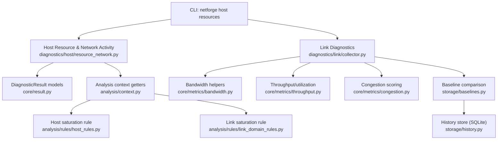
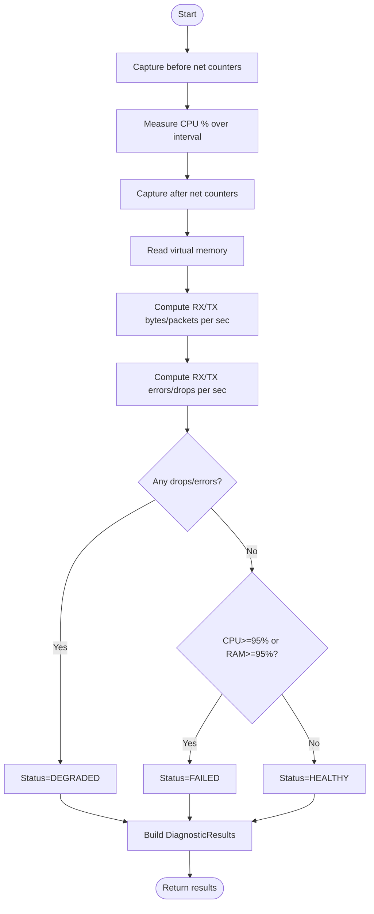
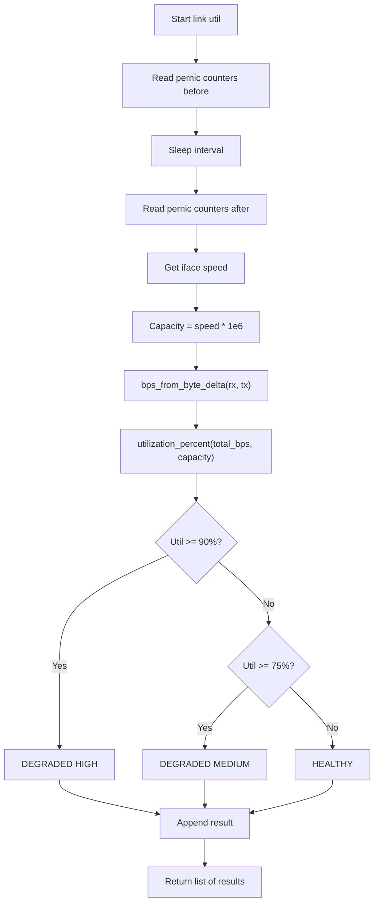
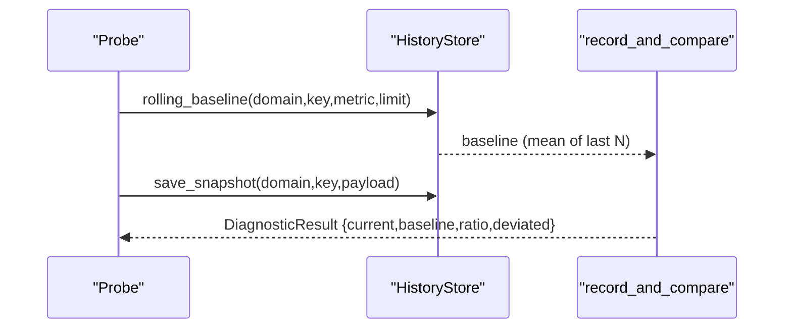
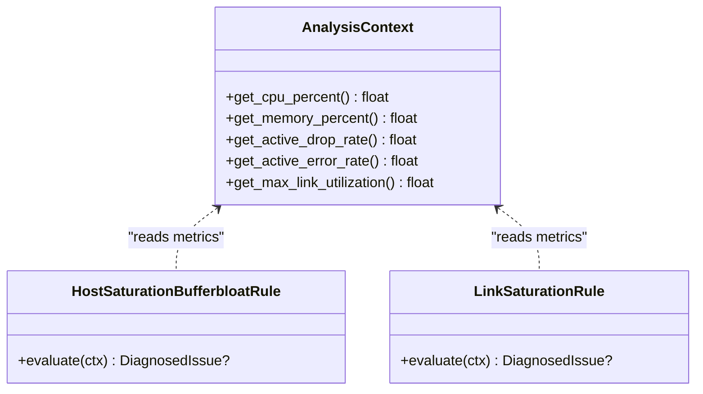
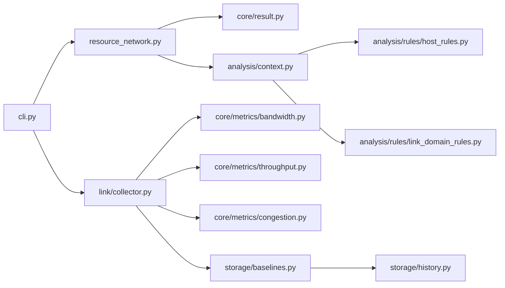

# Resource Monitoring

<cite>
**Referenced Files in This Document**
- [cli.py](file://cli.py)
- [resource_network.py](file://diagnostics/host/resource_network.py)
- [collector.py](file://diagnostics/link/collector.py)
- [bandwidth.py](file://core/metrics/bandwidth.py)
- [throughput.py](file://core/metrics/throughput.py)
- [congestion.py](file://core/metrics/congestion.py)
- [context.py](file://analysis/context.py)
- [host_rules.py](file://analysis/rules/host_rules.py)
- [link_domain_rules.py](file://analysis/rules/link_domain_rules.py)
- [history.py](file://storage/history.py)
- [baselines.py](file://storage/baselines.py)
- [speed.py](file://diagnostics/traffic/speed.py)
- [result.py](file://core/result.py)
</cite>

## Table of Contents
1. Introduction
2. Project Structure
3. Core Components
4. Architecture Overview
5. Detailed Component Analysis
6. Dependency Analysis
7. Performance Considerations
8. Troubleshooting Guide
9. Conclusion
10. Appendices

## Introduction
This document explains how to use NetForge’s resource monitoring capabilities to analyze system resource utilization, monitor network activity, and identify bottlenecks that affect network performance. It focuses on:
- Host CPU and memory pressure and its impact on the network stack
- Per-interface bandwidth usage and congestion signals (drops/errors)
- Historical trending and baseline comparisons for capacity planning
- Security-relevant patterns such as unusual spikes in drops or errors
- Integration points with the rule engine for automated diagnosis

Note: Process-level per-process network consumption is not implemented in this codebase. The available metrics are host-wide and per-interface.

## Project Structure
NetForge exposes a CLI with a host resources command that triggers diagnostics combining CPU/memory sampling and network throughput deltas. Link-level diagnostics provide per-interface utilization, error/drop rates, and congestion scoring. Baseline storage enables historical trending and deviation detection.



**Diagram sources**
- [cli.py:106-110](file://cli.py#L106-L110)
- [resource_network.py:16-106](file://diagnostics/host/resource_network.py#L16-L106)
- [collector.py:29-84](file://diagnostics/link/collector.py#L29-L84)
- [bandwidth.py:4-17](file://core/metrics/bandwidth.py#L4-L17)
- [throughput.py:1-200](file://core/metrics/throughput.py#L1-L200)
- [congestion.py:1-200](file://core/metrics/congestion.py#L1-L200)
- [history.py:15-115](file://storage/history.py#L15-L115)
- [baselines.py:9-91](file://storage/baselines.py#L9-L91)
- [context.py:131-179](file://analysis/context.py#L131-L179)
- [host_rules.py:9-55](file://analysis/rules/host_rules.py#L9-L55)
- [link_domain_rules.py:9-23](file://analysis/rules/link_domain_rules.py#L9-L23)

**Section sources**
- [cli.py:106-110](file://cli.py#L106-L110)
- [resource_network.py:16-106](file://diagnostics/host/resource_network.py#L16-L106)
- [collector.py:29-84](file://diagnostics/link/collector.py#L29-L84)

## Core Components
- Host resource and network activity measurement:
  - Samples CPU percent over an interval and captures before/after network I/O counters to compute RX/TX bytes and packets per second, plus per-direction error and drop rates.
  - Produces two DiagnosticResult objects: one for host resource health and one for network activity metrics.
- Link-level diagnostics:
  - Measures per-interface utilization using byte deltas and interface speed to estimate capacity.
  - Computes per-interface error and drop rates.
  - Derives a congestion score from utilization, drops, errors, and optional latency delta.
- Baseline and history:
  - Persists metric snapshots to SQLite and computes rolling baselines to detect deviations.
  - Emits baseline_delta results used by rules to flag sudden degradation.
- Rule integration:
  - Context provides getters for CPU, memory, active drops/errors, and link metrics.
  - Rules evaluate thresholds to produce findings with severity and recommendations.

**Section sources**
- [resource_network.py:16-106](file://diagnostics/host/resource_network.py#L16-L106)
- [collector.py:29-179](file://diagnostics/link/collector.py#L29-L179)
- [history.py:45-115](file://storage/history.py#L45-L115)
- [baselines.py:9-91](file://storage/baselines.py#L9-L91)
- [context.py:131-179](file://analysis/context.py#L131-L179)
- [host_rules.py:9-55](file://analysis/rules/host_rules.py#L9-L55)
- [link_domain_rules.py:9-23](file://analysis/rules/link_domain_rules.py#L9-L23)

## Architecture Overview
The resource monitoring flow starts at the CLI and branches into host and link diagnostics. Results are standardized DiagnosticResult objects consumed by analysis rules and baseline comparators.

```mermaid
sequenceDiagram
participant User as "User"
participant CLI as "CLI (netforge)"
participant Host as "Host Resource & Activity"
participant Link as "Link Utilization & Errors"
participant Store as "HistoryStore"
participant Baseline as "Baselines"
participant Rules as "Rule Engine"
User->>CLI : run host resources
CLI->>Host : inspect_resources_and_activity(interval)
Host-->>CLI : [resource_result, activity_result]
CLI->>Link : measure_link_utilization()/errors()
Link-->>CLI : [util_results, error_results]
CLI->>Baseline : compare_probe_metrics(results)
Baseline->>Store : save_snapshot(...), rolling_baseline(...)
Store-->>Baseline : baseline values
Baseline-->>CLI : baseline_delta results
CLI->>Rules : analyze(all results)
Rules-->>CLI : findings and status
```

**Diagram sources**
- [cli.py:106-110](file://cli.py#L106-L110)
- [resource_network.py:16-106](file://diagnostics/host/resource_network.py#L16-L106)
- [collector.py:29-179](file://diagnostics/link/collector.py#L29-L179)
- [baselines.py:94-137](file://storage/baselines.py#L94-L137)
- [history.py:45-115](file://storage/history.py#L45-L115)

## Detailed Component Analysis

### Host Resource and Network Activity
- What it measures:
  - CPU utilization over a sampling interval
  - Memory utilization snapshot
  - RX/TX bytes and packets per second via net_io_counters deltas
  - Per-direction error and drop rates
- Health evaluation:
  - Active drops/errors mark DEGRADED; extreme CPU/RAM marks FAILED; otherwise HEALTHY.
- Output:
  - Two results: resource health and network activity metrics.



**Diagram sources**
- [resource_network.py:16-106](file://diagnostics/host/resource_network.py#L16-L106)

**Section sources**
- [resource_network.py:16-106](file://diagnostics/host/resource_network.py#L16-L106)
- [result.py:24-47](file://core/result.py#L24-L47)

### Link Utilization, Errors, and Congestion
- Utilization:
  - Uses per-interface byte deltas and interface speed to compute utilization percentage.
  - Flags high utilization thresholds as DEGRADED.
- Errors and drops:
  - Computes per-interface drops/errors per second and classifies severity.
- Congestion:
  - Combines utilization, drop rate, error rate, and optional latency delta into a congestion score and state.



**Diagram sources**
- [collector.py:29-84](file://diagnostics/link/collector.py#L29-L84)
- [bandwidth.py:4-17](file://core/metrics/bandwidth.py#L4-L17)
- [throughput.py:1-200](file://core/metrics/throughput.py#L1-L200)

**Section sources**
- [collector.py:29-179](file://diagnostics/link/collector.py#L29-L179)
- [bandwidth.py:4-17](file://core/metrics/bandwidth.py#L4-L17)

### Baseline Comparison and Historical Trending
- History store:
  - SQLite-backed snapshots keyed by domain and key, with timestamps.
  - Rolling baseline computed as mean of recent numeric metric values.
- Baseline comparator:
  - Persists current sample and compares against rolling baseline.
  - Emits baseline_delta results with ratio and deviation flags.
  - Used by rules to detect sudden degradation.



**Diagram sources**
- [history.py:45-115](file://storage/history.py#L45-L115)
- [baselines.py:9-91](file://storage/baselines.py#L9-L91)

**Section sources**
- [history.py:45-115](file://storage/history.py#L45-L115)
- [baselines.py:9-91](file://storage/baselines.py#L9-L91)

### Rule-Based Diagnosis for Resources and Links
- Host saturation:
  - Triggers when CPU or memory exceed thresholds and correlates with jitter to infer network stack impact.
- Link saturation:
  - Triggers when peak utilization exceeds threshold across interfaces.



**Diagram sources**
- [context.py:131-179](file://analysis/context.py#L131-L179)
- [host_rules.py:9-55](file://analysis/rules/host_rules.py#L9-L55)
- [link_domain_rules.py:9-23](file://analysis/rules/link_domain_rules.py#L9-L23)

**Section sources**
- [host_rules.py:9-55](file://analysis/rules/host_rules.py#L9-L55)
- [link_domain_rules.py:9-23](file://analysis/rules/link_domain_rules.py#L9-L23)

### Active Traffic Probes (Complementary)
- Download goodput estimation and jitter measurement provide additional insight into perceived bandwidth and stability.

**Section sources**
- [speed.py:22-70](file://diagnostics/traffic/speed.py#L22-L70)
- [speed.py:73-110](file://diagnostics/traffic/speed.py#L73-L110)

## Dependency Analysis
- CLI depends on diagnostic modules to collect results.
- Host module depends on psutil and produces DiagnosticResult objects.
- Link module depends on core metrics utilities for capacity, throughput, and congestion scoring.
- Baseline module depends on HistoryStore to persist and query past samples.
- Analysis context aggregates results and supplies metrics to rules.
- Rules depend on context and emit findings based on thresholds.



**Diagram sources**
- [cli.py:106-110](file://cli.py#L106-L110)
- [resource_network.py:16-106](file://diagnostics/host/resource_network.py#L16-L106)
- [collector.py:29-179](file://diagnostics/link/collector.py#L29-L179)
- [bandwidth.py:4-17](file://core/metrics/bandwidth.py#L4-L17)
- [throughput.py:1-200](file://core/metrics/throughput.py#L1-L200)
- [congestion.py:1-200](file://core/metrics/congestion.py#L1-L200)
- [history.py:45-115](file://storage/history.py#L45-L115)
- [baselines.py:94-137](file://storage/baselines.py#L94-L137)
- [context.py:131-179](file://analysis/context.py#L131-L179)
- [host_rules.py:9-55](file://analysis/rules/host_rules.py#L9-L55)
- [link_domain_rules.py:9-23](file://analysis/rules/link_domain_rules.py#L9-L23)

**Section sources**
- [cli.py:106-110](file://cli.py#L106-L110)
- [resource_network.py:16-106](file://diagnostics/host/resource_network.py#L16-L106)
- [collector.py:29-179](file://diagnostics/link/collector.py#L29-L179)
- [baselines.py:94-137](file://storage/baselines.py#L94-L137)
- [history.py:45-115](file://storage/history.py#L45-L115)
- [context.py:131-179](file://analysis/context.py#L131-L179)
- [host_rules.py:9-55](file://analysis/rules/host_rules.py#L9-L55)
- [link_domain_rules.py:9-23](file://analysis/rules/link_domain_rules.py#L9-L23)

## Performance Considerations
- Sampling interval:
  - Host resource measurement uses a blocking CPU percent interval; choose intervals that balance accuracy and runtime.
  - Link utilization sleeps for the interval; shorter intervals increase responsiveness but may reduce statistical stability.
- Throughput calculation:
  - Byte deltas divided by interval yield per-second rates; ensure consistent intervals across probes for comparability.
- Congestion scoring:
  - Incorporates utilization, drops, errors, and optional latency delta; sensitive to short-term spikes—use rolling baselines for trend detection.
- Baseline sensitivity:
  - Rolling baseline window size affects responsiveness to changes; larger windows smooth noise but delay detection.

[No sources needed since this section provides general guidance]

## Troubleshooting Guide
- No drops/errors but high latency/jitter:
  - Check host CPU/memory saturation; rules can correlate high jitter with resource exhaustion.
- Frequent drops/errors:
  - Investigate link-layer issues; link error diagnostics classify severity and feed congestion scoring.
- Sudden metric spikes:
  - Use baseline_delta results to detect deviations vs rolling baseline; rules can flag sudden degradation.
- Low goodput:
  - Combine speed probe results with link utilization and congestion to isolate bottleneck location.

**Section sources**
- [host_rules.py:9-55](file://analysis/rules/host_rules.py#L9-L55)
- [collector.py:87-129](file://diagnostics/link/collector.py#L87-L129)
- [baselines.py:9-91](file://storage/baselines.py#L9-L91)
- [speed.py:22-70](file://diagnostics/traffic/speed.py#L22-L70)

## Conclusion
NetForge’s resource monitoring combines host CPU/memory sampling with network throughput deltas and per-interface link diagnostics to identify bottlenecks and congestion. Baseline storage enables historical trending and automated detection of sudden degradation. While process-level network consumption is not available, the provided metrics are sufficient for capacity planning, performance profiling, and security monitoring scenarios focused on host and link layers.

[No sources needed since this section summarizes without analyzing specific files]

## Appendices

### How to Identify Resource Bottlenecks
- Run host resources to capture CPU, memory, and network activity.
- Inspect link utilization and errors to determine if congestion or hardware issues are present.
- Use baseline comparisons to detect deviations from normal behavior.

**Section sources**
- [cli.py:106-110](file://cli.py#L106-L110)
- [resource_network.py:16-106](file://diagnostics/host/resource_network.py#L16-L106)
- [collector.py:29-179](file://diagnostics/link/collector.py#L29-L179)
- [baselines.py:94-137](file://storage/baselines.py#L94-L137)

### Monitor Bandwidth Usage by Interfaces
- Use link utilization to see per-interface RX/TX rates and utilization percentage.
- Combine with error/drop rates to assess link health.

**Section sources**
- [collector.py:29-84](file://diagnostics/link/collector.py#L29-L84)
- [collector.py:87-129](file://diagnostics/link/collector.py#L87-L129)

### Detect Unusual Network Activity Patterns
- Track active drops/errors per second; non-zero values indicate potential issues.
- Use baseline_delta to detect sudden increases in drops/errors or utilization.

**Section sources**
- [resource_network.py:16-106](file://diagnostics/host/resource_network.py#L16-L106)
- [baselines.py:9-91](file://storage/baselines.py#L9-L91)

### Capacity Planning Scenarios
- Record link utilization over time and compare against rolling baseline to plan upgrades.
- Use goodput measurements to validate end-to-end performance expectations.

**Section sources**
- [collector.py:29-84](file://diagnostics/link/collector.py#L29-L84)
- [speed.py:22-70](file://diagnostics/traffic/speed.py#L22-L70)
- [baselines.py:94-137](file://storage/baselines.py#L94-L137)

### Performance Profiling Scenarios
- Correlate high jitter with host resource saturation to pinpoint OS-level bottlenecks.
- Use congestion scoring to understand combined effects of utilization, drops, and errors.

**Section sources**
- [host_rules.py:9-55](file://analysis/rules/host_rules.py#L9-L55)
- [collector.py:132-179](file://diagnostics/link/collector.py#L132-L179)

### Security Monitoring Scenarios
- Alert on sustained non-zero drops/errors indicating potential attacks or misconfigurations.
- Detect sudden spikes in utilization or errors that may signal scanning or DDoS-like activity.

**Section sources**
- [collector.py:87-129](file://diagnostics/link/collector.py#L87-L129)
- [baselines.py:9-91](file://storage/baselines.py#L9-L91)

### Resource Thresholds and Status Logic
- Host resources:
  - Active drops/errors → DEGRADED
  - CPU ≥ 95% or RAM ≥ 95% → FAILED
  - CPU ≥ 85% or RAM ≥ 90% → DEGRADED
- Link utilization:
  - Util ≥ 90% → DEGRADED (HIGH)
  - Util ≥ 75% → DEGRADED (MEDIUM)
- Link errors:
  - Drops ≥ 5 or errors ≥ 5 → FAILED
  - Drops ≥ 0.5 or errors ≥ 0.5 → DEGRADED

**Section sources**
- [resource_network.py:41-63](file://diagnostics/host/resource_network.py#L41-L63)
- [collector.py:53-58](file://diagnostics/link/collector.py#L53-L58)
- [collector.py:106-111](file://diagnostics/link/collector.py#L106-L111)

### Historical Trending and Baseline Integration
- Persist each probe sample and compute rolling baseline means.
- Compare current values to baseline to detect deviations and trigger rules.

**Section sources**
- [history.py:45-115](file://storage/history.py#L45-L115)
- [baselines.py:9-91](file://storage/baselines.py#L9-L91)

### Integration with System Monitoring Tools
- Export DiagnosticResult payloads for ingestion into external systems.
- Use baseline_delta outputs to feed alerting pipelines for anomaly detection.

**Section sources**
- [result.py:24-47](file://core/result.py#L24-L47)
- [baselines.py:94-137](file://storage/baselines.py#L94-L137)