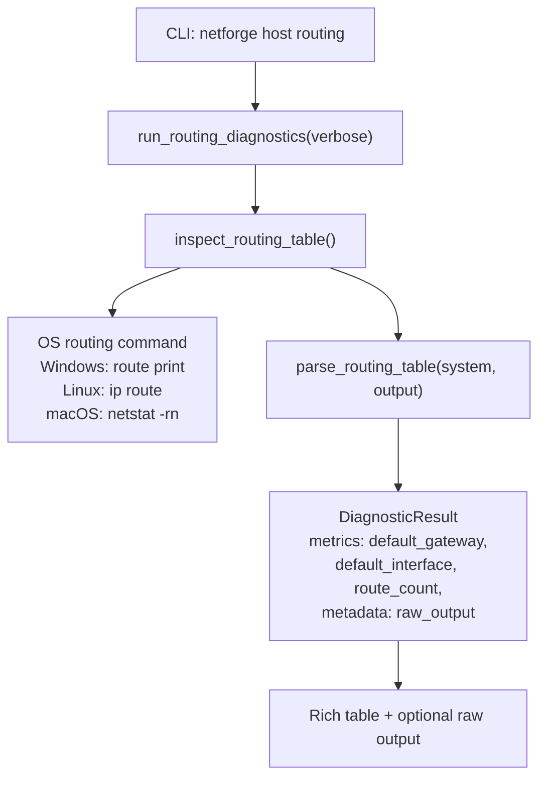
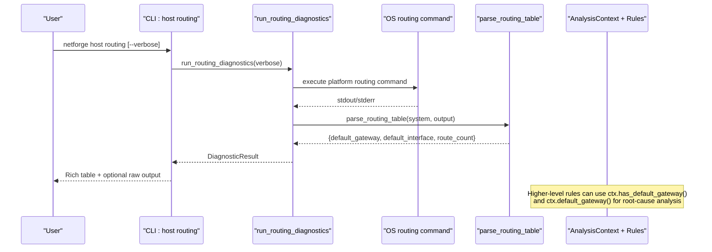
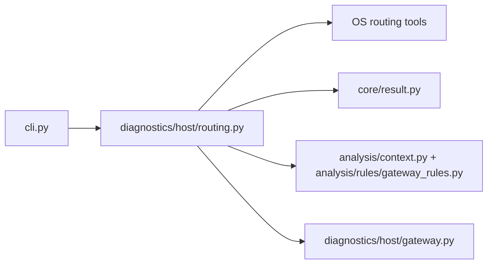

# Routing Analysis

<cite>
**Referenced Files in This Document**
- [cli.py](file://cli.py)
- [routing.py](file://diagnostics/host/routing.py)
- [context.py](file://analysis/context.py)
- [gateway_rules.py](file://analysis/rules/gateway_rules.py)
- [result.py](file://core/result.py)
- [gateway.py](file://diagnostics/host/gateway.py)
</cite>

## Table of Contents
1. [Introduction](#introduction)
2. [Project Structure](#project-structure)
3. [Core Components](#core-components)
4. [Architecture Overview](#architecture-overview)
5. [Detailed Component Analysis](#detailed-component-analysis)
6. [Dependency Analysis](#dependency-analysis)
7. [Performance Considerations](#performance-considerations)
8. [Troubleshooting Guide](#troubleshooting-guide)
9. [Conclusion](#conclusion)

## Introduction
This document explains the NetForge routing analysis command used to inspect a host’s routing table, identify the default gateway, and validate routing health. It also covers how the verbose option exposes raw routing table output, how route metrics and interface associations are reported, and how routing diagnostics integrate with broader diagnosis rules for conflict detection and troubleshooting.

## Project Structure
The routing analysis feature is implemented as a host diagnostic command that:
- Invokes OS-specific commands to read the routing table
- Parses results to extract the default gateway, associated interface, and active route count
- Returns a structured result consumed by CLI display and higher-level rule analysis

**Diagram sources**
- [cli.py:58-63](file://cli.py#L58-L63)
- [routing.py:81-175](file://diagnostics/host/routing.py#L81-L175)
- [routing.py:15-78](file://diagnostics/host/routing.py#L15-L78)
- [routing.py:178-199](file://diagnostics/host/routing.py#L178-L199)

**Section sources**
- [cli.py:58-63](file://cli.py#L58-L63)
- [routing.py:81-199](file://diagnostics/host/routing.py#L81-L199)

## Core Components
- CLI entry point: registers the `host routing` command and exposes the `--verbose` flag.
- Diagnostics runner: executes OS routing commands, parses output, and returns a standardized result.
- Parser: extracts default gateway, default interface, and counts routes per OS.
- Context and rules: provide cross-checks such as missing default gateway or unreachable gateway.

Key responsibilities:
- Routing table inspection across Windows, Linux, and macOS
- Default gateway identification and association with an interface
- Reporting route count and raw output (when verbose)
- Integration with analysis context for rule-based diagnosis

**Section sources**
- [cli.py:58-63](file://cli.py#L58-L63)
- [routing.py:15-78](file://diagnostics/host/routing.py#L15-L78)
- [routing.py:81-175](file://diagnostics/host/routing.py#L81-L175)
- [routing.py:178-199](file://diagnostics/host/routing.py#L178-L199)
- [context.py:42-50](file://analysis/context.py#L42-L50)
- [gateway_rules.py:9-47](file://analysis/rules/gateway_rules.py#L9-L47)

## Architecture Overview
The routing analysis pipeline integrates with the broader diagnostic framework through a standardized result model and analysis context.

**Diagram sources**
- [cli.py:58-63](file://cli.py#L58-L63)
- [routing.py:81-175](file://diagnostics/host/routing.py#L81-L175)
- [routing.py:15-78](file://diagnostics/host/routing.py#L15-L78)
- [routing.py:178-199](file://diagnostics/host/routing.py#L178-L199)
- [context.py:42-50](file://analysis/context.py#L42-L50)

## Detailed Component Analysis

### CLI Command: host routing
- Registers the `host routing` command under the host subcommand group.
- Accepts a boolean `--verbose` / `-v` option to print the raw routing table output after the summary table.
- Delegates execution to the routing diagnostics function.

Usage highlights:
- Basic inspection: `netforge host routing`
- With raw output: `netforge host routing --verbose`

**Section sources**
- [cli.py:58-63](file://cli.py#L58-L63)

### Routing Diagnostics Runner
- Determines the operating system and selects the appropriate routing command:
  - Windows: `route print`
  - Linux: `ip route`
  - macOS: `netstat -rn`
- Executes the command with a timeout and captures stdout/stderr.
- On success, parses the output to extract:
  - Default gateway address
  - Associated default interface name
  - Active route count
- Produces a `DiagnosticResult` containing:
  - Status and severity
  - Summary text
  - Metrics: os, route_count, default_gateway, default_interface
  - Evidence lines describing findings
  - Metadata: raw_output (for verbose mode)

Error handling:
- Non-zero return code yields a failed status with stderr captured.
- Subprocess or OS errors yield a failed status with exception details.

**Section sources**
- [routing.py:81-175](file://diagnostics/host/routing.py#L81-L175)

### Routing Table Parser
- Platform-aware parsing:
  - Windows: scans “Active Routes” section; identifies 0.0.0.0/0 entries; records first default gateway and its interface; counts all active routes.
  - Linux: iterates lines; counts routes; finds default via keyword “via”; finds interface via “dev”.
  - macOS: limits to IPv4 section (“Internet:”); counts routes; identifies default line and extracts gateway and interface.
- Returns a tuple: (default_gateway, default_interface, route_count).

Complexity:
- Linear in number of lines of routing output O(N).
- Minimal memory overhead beyond splitting into lines.

Edge cases:
- Missing default route: returns None for gateway/interface.
- Unexpected OS: handled upstream with unsupported OS result.

**Section sources**
- [routing.py:15-78](file://diagnostics/host/routing.py#L15-L78)

### Verbose Output Behavior
- When `--verbose` is provided, the CLI prints the raw routing table output stored in metadata.
- The raw output is only shown if present and verbose is enabled.

**Section sources**
- [cli.py:58-63](file://cli.py#L58-L63)
- [routing.py:178-199](file://diagnostics/host/routing.py#L178-L199)

### Route Selection Logic and Metrics Interpretation
- Default gateway selection:
  - Windows: first 0.0.0.0/0 entry encountered in active routes.
  - Linux: first line starting with “default” using “via” and “dev”.
  - macOS: first “default” line in IPv4 section.
- Interface association:
  - Windows: fourth field on matching line.
  - Linux: value after “dev”.
  - macOS: last field on default line.
- Route count:
  - Windows: counts non-header lines within active routes.
  - Linux: counts each parsed line.
  - macOS: counts non-header lines within IPv4 section.

Note: The current implementation does not compute per-route metrics such as metric values or preference scores. If your environment uses multiple default routes with different metrics, rely on the parser’s first-match behavior and verify with the raw output in verbose mode.

**Section sources**
- [routing.py:15-78](file://diagnostics/host/routing.py#L15-L78)

### Integration with Analysis Context and Rules
- The routing result feeds into the analysis context:
  - `ctx.default_gateway()` retrieves the default gateway from routing metrics.
  - `ctx.has_default_gateway()` validates presence and excludes sentinel values.
- Rule-based diagnosis:
  - Missing default gateway triggers a critical issue with recommendations to renew DHCP or inspect static routes.
  - Unreachable default gateway triggers a critical issue with local router checks.
  - WAN outage scenarios are inferred when the gateway is reachable but public targets fail.

These rules help detect routing conflicts and misconfigurations by correlating routing state with connectivity and gateway reachability.

**Section sources**
- [context.py:42-50](file://analysis/context.py#L42-L50)
- [gateway_rules.py:9-47](file://analysis/rules/gateway_rules.py#L9-L47)
- [gateway_rules.py:50-94](file://analysis/rules/gateway_rules.py#L50-L94)
- [gateway_rules.py:97-148](file://analysis/rules/gateway_rules.py#L97-L148)
- [gateway_rules.py:153-197](file://analysis/rules/gateway_rules.py#L153-L197)

## Dependency Analysis
The routing module depends on:
- OS utilities invoked via subprocess
- Rich console for formatted output
- Standardized result model for consistent reporting
- Analysis context and rules for higher-level diagnosis

**Diagram sources**
- [cli.py:58-63](file://cli.py#L58-L63)
- [routing.py:81-175](file://diagnostics/host/routing.py#L81-L175)
- [result.py:24-47](file://core/result.py#L24-L47)
- [context.py:42-50](file://analysis/context.py#L42-L50)
- [gateway_rules.py:9-47](file://analysis/rules/gateway_rules.py#L9-L47)
- [gateway.py:97-112](file://diagnostics/host/gateway.py#L97-L112)

**Section sources**
- [cli.py:58-63](file://cli.py#L58-L63)
- [routing.py:81-175](file://diagnostics/host/routing.py#L81-L175)
- [result.py:24-47](file://core/result.py#L24-L47)
- [context.py:42-50](file://analysis/context.py#L42-L50)
- [gateway_rules.py:9-47](file://analysis/rules/gateway_rules.py#L9-L47)
- [gateway.py:97-112](file://diagnostics/host/gateway.py#L97-L112)

## Performance Considerations
- Parsing is linear in routing table size; typical tables are small, so performance is negligible.
- Subprocess execution includes a short timeout to avoid hanging.
- Verbose mode adds minimal overhead by printing existing metadata.

[No sources needed since this section provides general guidance]

## Troubleshooting Guide

### Common Scenarios and Solutions

1. No default gateway found
   - Symptom: Summary indicates no default gateway; status may be failed.
   - Action: Use DHCP renewal or inspect static routes.
   - Related rule: Missing Default Gateway Route.

2. Incorrect default route selected
   - Symptom: Multiple default routes exist; parser picks the first match.
   - Action: Enable verbose to review raw output and confirm which route was chosen; adjust route preferences at the OS level if necessary.

3. Default gateway configured but unreachable
   - Symptom: Gateway appears in routing table but probes fail.
   - Action: Check local router/AP power and LAN switch port; ping the gateway directly.
   - Related rule: Default Gateway Unreachable.

4. Upstream WAN outage despite healthy gateway
   - Symptom: Gateway responds, but public targets fail.
   - Action: Inspect modem/WAN link status and ISP outage; test gateway reachability.
   - Related rule: Local Gateway Healthy but Upstream WAN Outage.

5. Total Internet outage
   - Symptom: No successful connectivity to public targets; gateway reachability not confirmed.
   - Action: Ping gateway then upstream IP; check ISP status and CPE lights.
   - Related rule: Total Internet Connectivity Outage.

### Using Verbose Mode for Conflict Detection
- Run with `--verbose` to see the raw routing table.
- Compare the parsed default gateway and interface against expected configuration.
- Identify conflicting or duplicate default routes and assess their order/priority.

### Example Workflows

- Analyze routing conflicts:
  - Run `netforge host routing --verbose`.
  - Review raw output for multiple default entries.
  - Confirm which route was selected by the parser and adjust OS route metrics if needed.

- Identify incorrect default routes:
  - Verify default gateway matches network design.
  - If wrong, remove or deprioritize the incorrect route and ensure correct one is preferred.

- Troubleshoot routing issues:
  - Combine routing inspection with gateway reachability (`netforge host gateway`) and connectivity checks.
  - Use analysis rules to automatically detect and recommend fixes.

**Section sources**
- [routing.py:15-78](file://diagnostics/host/routing.py#L15-L78)
- [routing.py:81-175](file://diagnostics/host/routing.py#L81-L175)
- [routing.py:178-199](file://diagnostics/host/routing.py#L178-L199)
- [gateway_rules.py:9-47](file://analysis/rules/gateway_rules.py#L9-L47)
- [gateway_rules.py:50-94](file://analysis/rules/gateway_rules.py#L50-L94)
- [gateway_rules.py:97-148](file://analysis/rules/gateway_rules.py#L97-L148)
- [gateway_rules.py:153-197](file://analysis/rules/gateway_rules.py#L153-L197)

## Conclusion
The NetForge routing analysis command provides a concise, cross-platform way to inspect routing tables, identify the default gateway and its interface, and report active route counts. The verbose option exposes raw routing data for deeper inspection. Integrated with analysis context and rules, it supports automated detection of routing conflicts, incorrect default routes, and common routing problems, offering actionable recommendations to resolve issues quickly.