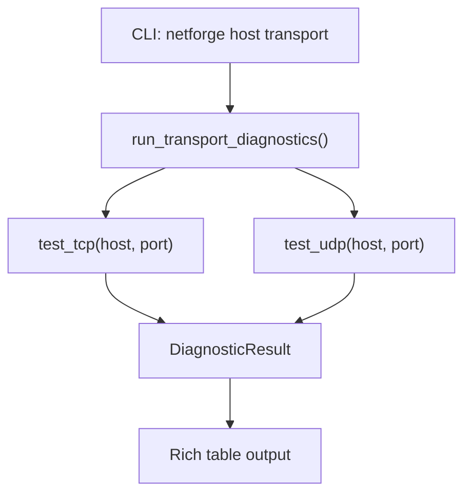
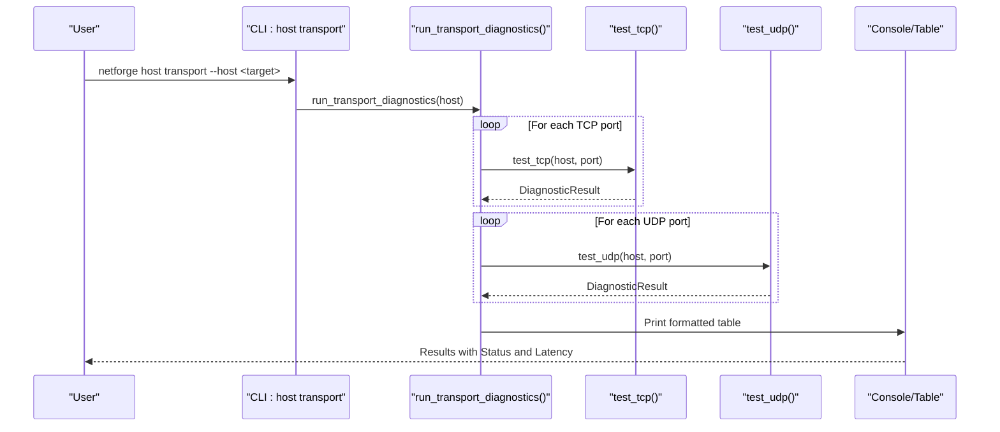
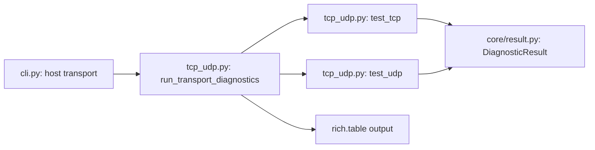

# Transport Testing

<cite>
**Referenced Files in This Document**
- [cli.py](file://cli.py)
- [tcp_udp.py](file://diagnostics/host/tcp_udp.py)
- [result.py](file://core/result.py)
- [connectivity.py](file://diagnostics/host/connectivity.py)
</cite>

## Table of Contents
1. [Introduction](#introduction)
2. [Project Structure](#project-structure)
3. [Core Components](#core-components)
4. [Architecture Overview](#architecture-overview)
5. [Detailed Component Analysis](#detailed-component-analysis)
6. [Dependency Analysis](#dependency-analysis)
7. [Performance Considerations](#performance-considerations)
8. [Troubleshooting Guide](#troubleshooting-guide)
9. [Conclusion](#conclusion)
10. [Appendices](#appendices)

## Introduction
This document explains the NetForge transport testing command used to verify TCP and UDP port connectivity to specified hosts. It covers how to configure target hosts, test common service ports (such as web services and DNS), interpret results, handle timeouts, and troubleshoot network service availability issues. The transport tests are part of the host-level diagnostics and can be run standalone or as part of a full diagnostic suite.

## Project Structure
The transport testing feature is implemented under the host diagnostics module and exposed via the CLI:
- CLI entry point defines the host-level commands and wires them to diagnostic functions.
- The transport diagnostic function performs TCP/UDP reachability checks and returns standardized results.
- Results follow a consistent model that includes status, severity, metrics, evidence, and errors.

**Diagram sources**
- [cli.py:82-87](file://cli.py#L82-L87)
- [tcp_udp.py:185-226](file://diagnostics/host/tcp_udp.py#L185-L226)
- [tcp_udp.py:16-86](file://diagnostics/host/tcp_udp.py#L16-L86)
- [tcp_udp.py:89-182](file://diagnostics/host/tcp_udp.py#L89-L182)
- [result.py:24-47](file://core/result.py#L24-L47)

**Section sources**
- [cli.py:1-120](file://cli.py#L1-L120)
- [tcp_udp.py:1-226](file://diagnostics/host/tcp_udp.py#L1-L226)
- [result.py:1-47](file://core/result.py#L1-L47)

## Core Components
- CLI transport command: Binds user input to the transport diagnostic runner with a default target host.
- Transport runner: Iterates over configured TCP and UDP ports, executes probes, and aggregates results into a table.
- TCP probe: Performs a TCP handshake to the target host and port with timeout handling and latency measurement.
- UDP probe: For DNS (port 53) and NTP (port 123), sends protocol-specific requests and expects responses; for other ports, sends a datagram and observes immediate ICMP rejection behavior.
- Result model: Standardized structure capturing status, severity, metrics, evidence, and errors.

Key behaviors:
- Default TCP ports: 53, 80, 443
- Default UDP ports: 53
- Timeout: 3 seconds per connection attempt
- Latency: Measured in milliseconds where applicable

**Section sources**
- [cli.py:82-87](file://cli.py#L82-L87)
- [tcp_udp.py:185-226](file://diagnostics/host/tcp_udp.py#L185-L226)
- [tcp_udp.py:16-86](file://diagnostics/host/tcp_udp.py#L16-L86)
- [tcp_udp.py:89-182](file://diagnostics/host/tcp_udp.py#L89-L182)
- [result.py:24-47](file://core/result.py#L24-L47)

## Architecture Overview
The transport testing flow starts at the CLI, which invokes the transport diagnostic runner. The runner calls TCP and UDP probes for each configured port and formats results into a table. Each probe returns a DiagnosticResult indicating success or failure with supporting metrics and evidence.

**Diagram sources**
- [cli.py:82-87](file://cli.py#L82-L87)
- [tcp_udp.py:185-226](file://diagnostics/host/tcp_udp.py#L185-L226)
- [tcp_udp.py:16-86](file://diagnostics/host/tcp_udp.py#L16-L86)
- [tcp_udp.py:89-182](file://diagnostics/host/tcp_udp.py#L89-L182)

## Detailed Component Analysis

### CLI Command: host transport
- Purpose: Exposes a convenient command to test TCP/UDP transport to a target host.
- Parameters:
  - host: Target hostname or IP address (default: 1.1.1.1)
- Behavior: Calls the transport diagnostic runner with the provided host.

Usage examples:
- Test default ports against a public resolver: netforge host transport --host 1.1.1.1
- Test against a local web server: netforge host transport --host 192.168.1.10

Interpretation:
- HEALTHY indicates successful connectivity or expected behavior for the given protocol/port.
- FAILED indicates unreachable, closed, or rejected endpoints.

**Section sources**
- [cli.py:82-87](file://cli.py#L82-L87)

### Transport Runner: run_transport_diagnostics
- Purpose: Orchestrates TCP and UDP probes across configured ports and renders results.
- Defaults:
  - TCP ports: 53, 80, 443
  - UDP ports: 53
- Output: A table showing Protocol, Host, Port, Status, and Latency.

Configuration:
- To test additional ports, extend the lists passed to the runner when integrating programmatically.

**Section sources**
- [tcp_udp.py:185-226](file://diagnostics/host/tcp_udp.py#L185-L226)

### TCP Probe: test_tcp
- Purpose: Verifies TCP reachability by performing a handshake to the target host and port.
- Behavior:
  - Resolves address family dynamically (IPv4/IPv6).
  - Sets a timeout per connection attempt.
  - Measures latency from start to completion.
  - Returns HEALTHY if handshake succeeds; otherwise returns FAILED with error code or exception details.

Timeout handling:
- If the connection times out or fails, the result includes an error message and failed status.

Common use cases:
- Web services: Test HTTP (80) and HTTPS (443) on application servers.
- Database connections: Test database ports (e.g., 3306, 5432) by extending the port list.
- Custom application ports: Add any custom port to validate service availability.

**Section sources**
- [tcp_udp.py:16-86](file://diagnostics/host/tcp_udp.py#L16-L86)

### UDP Probe: test_udp
- Purpose: Tests UDP reachability with protocol-aware probing for DNS and NTP, and generic datagram transmission for other ports.
- Behavior:
  - For DNS (port 53): Sends a standard DNS query and expects a response; timeout indicates failure.
  - For NTP (port 123): Sends a standard NTP client request and expects a response; timeout indicates failure.
  - For other ports: Sends a small datagram and considers it healthy if no immediate ICMP Port Unreachable is received; timeout is treated as healthy for generic ports since UDP is connectionless.
- Timeout handling:
  - DNS/NTP timeouts are failures because they expect replies.
  - Generic UDP timeouts are considered healthy (no ICMP rejection observed).

Common use cases:
- DNS resolution: Validate DNS server reachability and responsiveness.
- Time synchronization: Validate NTP server reachability.
- Custom UDP services: Confirm that datagrams can be sent without immediate rejection.

**Section sources**
- [tcp_udp.py:89-182](file://diagnostics/host/tcp_udp.py#L89-L182)

### Result Model: DiagnosticResult
- Purpose: Standardizes diagnostic outputs across modules.
- Fields:
  - module: Identifies the diagnostic module (e.g., tcp, udp).
  - category: High-level grouping (e.g., host).
  - status: HEALTHY, DEGRADED, FAILED, UNKNOWN.
  - severity: INFO, LOW, MEDIUM, HIGH, CRITICAL.
  - summary: Human-readable description.
  - target: Endpoint being tested (e.g., host:port).
  - metrics: Numeric and contextual data (e.g., protocol, port, latency_ms).
  - evidence: Supporting observations (e.g., handshake succeeded).
  - warnings: Non-fatal notices.
  - errors: Error messages when applicable.
  - metadata: Additional context.

Interpretation guidance:
- Use status to determine pass/fail.
- Use severity to prioritize issues.
- Use metrics and evidence to understand what happened during the test.

**Section sources**
- [result.py:24-47](file://core/result.py#L24-L47)

### Example Workflows

#### Testing Web Services (HTTP/HTTPS)
- Run transport tests against your web server’s IP or hostname to verify ports 80 and 443.
- Expect HEALTHY for both if the web server is reachable and listening.
- If either fails, check firewall rules, service status, and routing.

#### Testing DNS Resolution (UDP 53)
- Run transport tests against a DNS server to validate UDP 53.
- For DNS, a response is required; timeout or error indicates DNS unavailability.

#### Testing NTP Synchronization (UDP 123)
- Run transport tests against an NTP server to validate UDP 123.
- Similar to DNS, a response is expected; timeout indicates NTP unavailability.

#### Testing Custom Application Ports
- Extend the port lists to include your application’s TCP/UDP ports.
- Interpret results based on whether the service is listening and reachable.

[No sources needed since this section provides conceptual usage examples]

## Dependency Analysis
The transport testing components depend on the core result model and the CLI wiring. The runner orchestrates TCP and UDP probes, which return standardized results consumed by the CLI’s table rendering.

**Diagram sources**
- [cli.py:82-87](file://cli.py#L82-L87)
- [tcp_udp.py:185-226](file://diagnostics/host/tcp_udp.py#L185-L226)
- [tcp_udp.py:16-86](file://diagnostics/host/tcp_udp.py#L16-L86)
- [tcp_udp.py:89-182](file://diagnostics/host/tcp_udp.py#L89-L182)
- [result.py:24-47](file://core/result.py#L24-L47)

**Section sources**
- [cli.py:82-87](file://cli.py#L82-L87)
- [tcp_udp.py:16-86](file://diagnostics/host/tcp_udp.py#L16-L86)
- [tcp_udp.py:89-182](file://diagnostics/host/tcp_udp.py#L89-L182)
- [tcp_udp.py:185-226](file://diagnostics/host/tcp_udp.py#L185-L226)
- [result.py:24-47](file://core/result.py#L24-L47)

## Performance Considerations
- Timeout: Each probe uses a 3-second timeout, balancing responsiveness with reliability.
- Latency measurement: Probes measure round-trip time for TCP handshakes and DNS/NTP responses, providing insight into service responsiveness.
- Concurrency: Probes are executed sequentially per port; consider batching or parallelization if testing many targets in automation.
- Network conditions: High latency or packet loss may cause timeouts; re-run tests under stable conditions to confirm.

[No sources needed since this section provides general guidance]

## Troubleshooting Guide
Common issues and interpretations:
- TCP FAILED:
  - Possible causes: Service not listening, firewall blocking, routing issues, or host unreachable.
  - Evidence: Check error messages and error codes in the result.
- UDP FAILED (DNS/NTP):
  - Possible causes: Service not responding, firewall dropping packets, or misconfigured server.
  - Evidence: Review timeout and error messages.
- UDP HEALTHY (generic ports):
  - Indicates datagram sent without immediate ICMP rejection; does not guarantee service responds.
  - Further validation may require protocol-specific probing.

Steps to diagnose:
- Verify target host reachability using basic connectivity checks.
- Confirm service is listening on the expected port.
- Inspect firewall and security group rules.
- Re-run tests with different targets to isolate local vs. remote issues.

Related connectivity checks:
- Basic TCP connectivity to common hosts can help isolate network path issues.

**Section sources**
- [tcp_udp.py:16-86](file://diagnostics/host/tcp_udp.py#L16-L86)
- [tcp_udp.py:89-182](file://diagnostics/host/tcp_udp.py#L89-L182)
- [connectivity.py:16-65](file://diagnostics/host/connectivity.py#L16-L65)

## Conclusion
The NetForge transport testing command provides a straightforward way to verify TCP and UDP connectivity to specified hosts and ports. It supports common service ports like DNS and web services, measures latency, and returns standardized results for easy interpretation. Use the command to validate service availability, troubleshoot network issues, and integrate automated checks into your operations.

[No sources needed since this section summarizes without analyzing specific files]

## Appendices

### Command Reference
- netforge host transport --host <target>
  - Tests TCP ports 53, 80, 443 and UDP port 53 by default.
  - Replace <target> with your desired host or IP.

### Interpreting Results
- HEALTHY: Connectivity or expected behavior confirmed.
- FAILED: Connectivity or expected behavior not confirmed; review errors and evidence.
- Latency: Provided when applicable; helps assess responsiveness.

[No sources needed since this section provides general guidance]