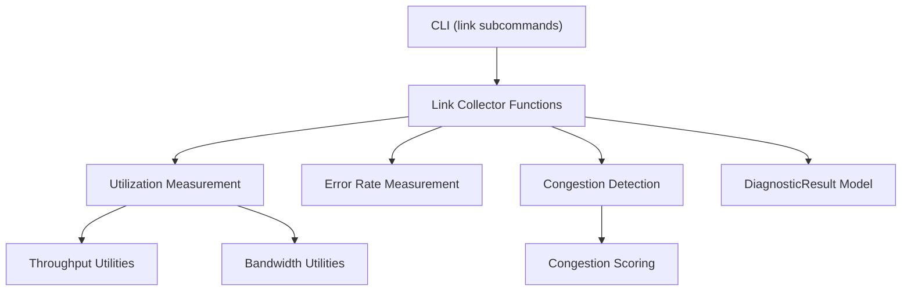
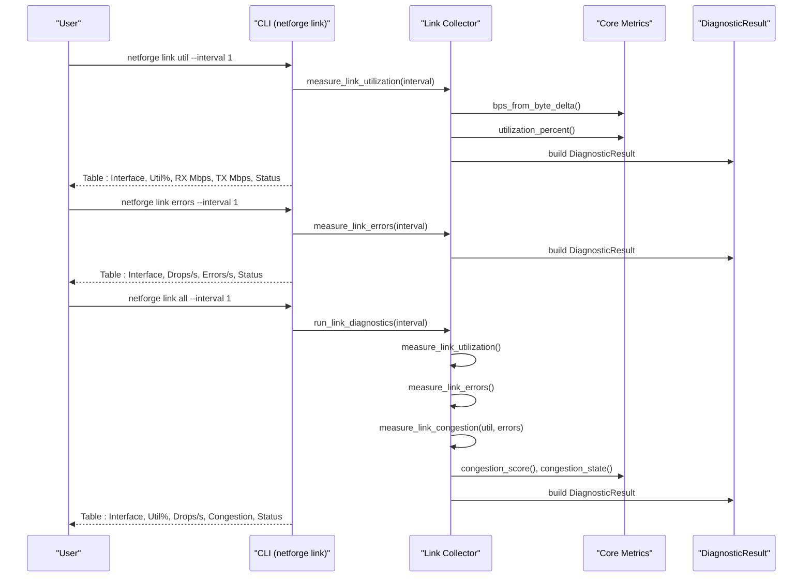
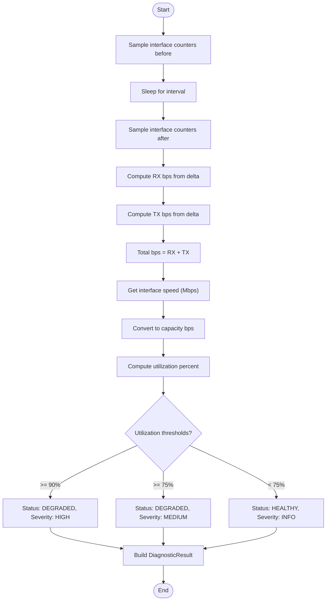
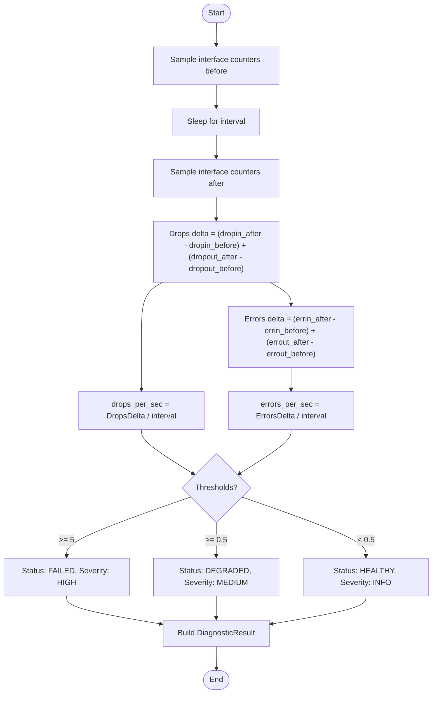
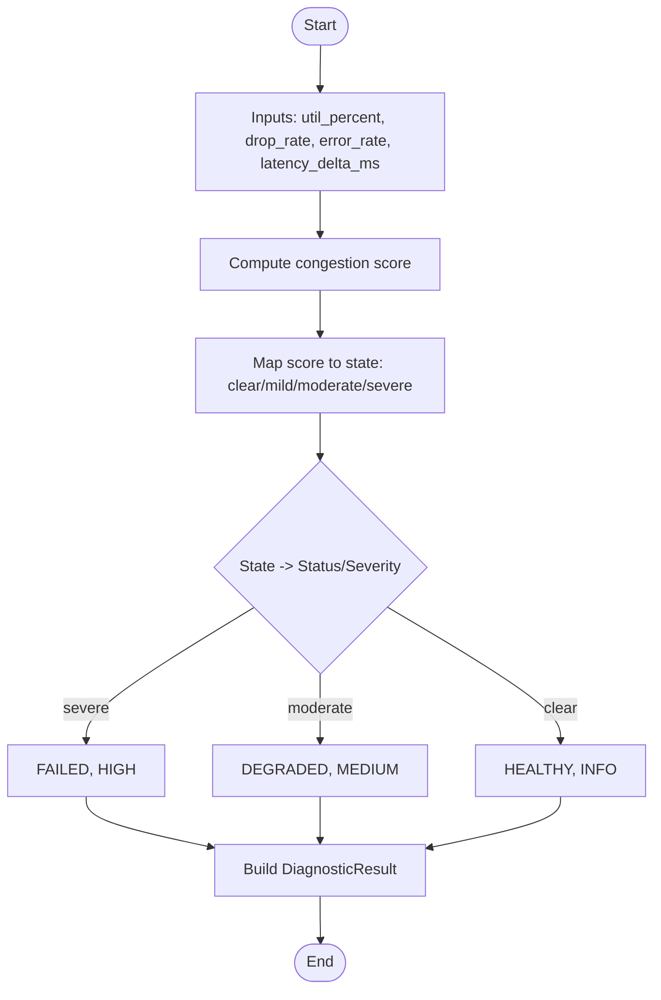
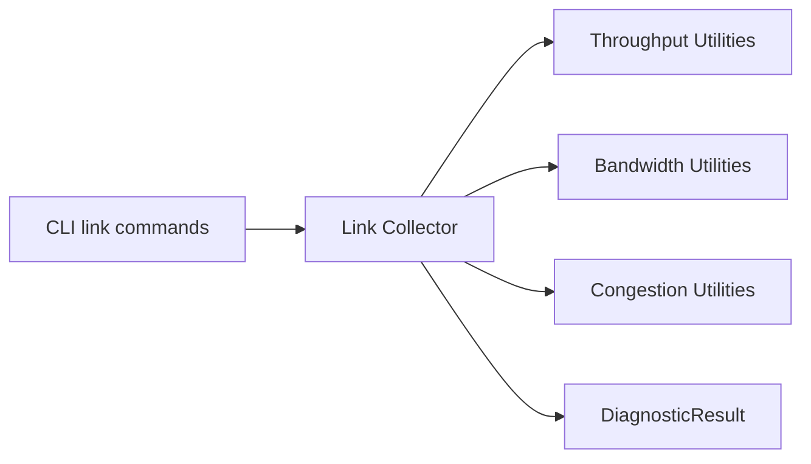

# Link Commands

<cite>
**Referenced Files in This Document**
- [cli.py](file://cli.py)
- [collector.py](file://diagnostics/link/collector.py)
- [bandwidth.py](file://core/metrics/bandwidth.py)
- [throughput.py](file://core/metrics/throughput.py)
- [congestion.py](file://core/metrics/congestion.py)
- [result.py](file://core/result.py)
- [README.md](file://README.md)
</cite>

## Table of Contents
1. [Introduction](#introduction)
2. [Project Structure](#project-structure)
3. [Core Components](#core-components)
4. [Architecture Overview](#architecture-overview)
5. [Detailed Component Analysis](#detailed-component-analysis)
6. [Dependency Analysis](#dependency-analysis)
7. [Performance Considerations](#performance-considerations)
8. [Troubleshooting Guide](#troubleshooting-guide)
9. [Conclusion](#conclusion)
10. [Appendices](#appendices)

## Introduction
This document provides detailed documentation for NetForge link-level diagnostic commands. It covers per-interface utilization measurement, error rate analysis, and congestion detection. For each command, it specifies syntax, interval parameters, and output formats that include interface metrics, drops per second, errors per second, and status indicators. It also documents the comprehensive “all” command that runs full link diagnostics and includes examples for interpreting results, identifying bottlenecks, and integrating link monitoring into network health checks.

## Project Structure
The link diagnostics are implemented as a cohesive set of CLI commands and collector functions:
- CLI entry points define subcommands under the link group (util, errors, all).
- Collector functions perform measurements and produce standardized diagnostic results.
- Core metric utilities compute bandwidth, utilization, and congestion scores.
- A unified result model carries status, severity, metrics, evidence, and warnings.

**Diagram sources**
- [cli.py:203-261](file://cli.py#L203-L261)
- [collector.py:29-179](file://diagnostics/link/collector.py#L29-L179)
- [throughput.py:11-24](file://core/metrics/throughput.py#L11-L24)
- [bandwidth.py:4-8](file://core/metrics/bandwidth.py#L4-L8)
- [congestion.py:4-50](file://core/metrics/congestion.py#L4-L50)
- [result.py:24-47](file://core/result.py#L24-L47)

**Section sources**
- [cli.py:203-261](file://cli.py#L203-L261)
- [collector.py:29-210](file://diagnostics/link/collector.py#L29-L210)
- [throughput.py:11-24](file://core/metrics/throughput.py#L11-L24)
- [bandwidth.py:4-8](file://core/metrics/bandwidth.py#L4-L8)
- [congestion.py:4-50](file://core/metrics/congestion.py#L4-L50)
- [result.py:24-47](file://core/result.py#L24-L47)

## Core Components
- Link utilization measurement: Computes RX/TX bits per second over an interval, derives total throughput, estimates link capacity from interface speed, calculates utilization percentage, and assigns status/severity based on thresholds.
- Link error rate measurement: Computes drops per second and errors per second by sampling counters at two points in time; assigns status/severity based on drop/error thresholds.
- Congestion detection: Combines utilization, drop rate, error rate, and optional latency delta to compute a congestion score and state; maps to status/severity.
- Comprehensive diagnostics: Orchestrates utilization, errors, and congestion, then renders a summary table with interface, utilization, drops/s, congestion state, and overall status.

Key outputs per interface:
- Utilization: RX Mbps, TX Mbps, total Mbps, utilization percent, status.
- Errors: Drops per second, errors per second, status.
- Congestion: Congestion score, congestion state, contributing metrics, status.

**Section sources**
- [collector.py:29-84](file://diagnostics/link/collector.py#L29-L84)
- [collector.py:87-129](file://diagnostics/link/collector.py#L87-L129)
- [collector.py:132-179](file://diagnostics/link/collector.py#L132-L179)
- [collector.py:182-210](file://diagnostics/link/collector.py#L182-L210)
- [throughput.py:11-24](file://core/metrics/throughput.py#L11-L24)
- [bandwidth.py:4-8](file://core/metrics/bandwidth.py#L4-L8)
- [congestion.py:4-50](file://core/metrics/congestion.py#L4-L50)
- [result.py:24-47](file://core/result.py#L24-L47)

## Architecture Overview
The link diagnostic flow is driven by CLI commands that invoke collector functions. Each collector produces DiagnosticResult objects containing metrics, status, severity, evidence, and warnings. The “all” command aggregates results and prints a consolidated table.

**Diagram sources**
- [cli.py:203-261](file://cli.py#L203-L261)
- [collector.py:29-210](file://diagnostics/link/collector.py#L29-L210)
- [throughput.py:11-24](file://core/metrics/throughput.py#L11-L24)
- [bandwidth.py:4-8](file://core/metrics/bandwidth.py#L4-L8)
- [congestion.py:4-50](file://core/metrics/congestion.py#L4-L50)
- [result.py:24-47](file://core/result.py#L24-L47)

## Detailed Component Analysis

### Command: netforge link util
Purpose: Measure per-interface utilization over a configurable interval.

Syntax:
- netforge link util --interval <seconds>

Parameters:
- --interval, -i: float, default 1.0 seconds. Controls the sampling window for byte counter deltas.

Output format:
- Columns: Interface, Util %, RX Mbps, TX Mbps, Status
- Metrics included per interface:
  - rx_bps: receive bits per second
  - tx_bps: transmit bits per second
  - total_bps: combined throughput
  - util_percent: utilization relative to negotiated link speed
  - speed_mbps: detected interface speed (may be unknown)
- Status mapping:
  - HEALTHY when utilization below thresholds
  - DEGRADED when utilization >= 75% or >= 90%
  - Severity levels: INFO for healthy, MEDIUM for moderate, HIGH for high utilization

Interpretation:
- High utilization indicates potential bottleneck; consider traffic shaping or capacity upgrades.
- Unknown speed yields utilization as “speed unknown”; rely on absolute throughput values.

Example usage:
- netforge link util --interval 2

**Section sources**
- [cli.py:203-227](file://cli.py#L203-L227)
- [collector.py:29-84](file://diagnostics/link/collector.py#L29-L84)
- [throughput.py:11-24](file://core/metrics/throughput.py#L11-L24)
- [bandwidth.py:4-8](file://core/metrics/bandwidth.py#L4-L8)
- [result.py:24-47](file://core/result.py#L24-L47)

### Command: netforge link errors
Purpose: Measure per-interface drops and errors over a configurable interval.

Syntax:
- netforge link errors --interval <seconds>

Parameters:
- --interval, -i: float, default 1.0 seconds. Sampling window for counter deltas.

Output format:
- Columns: Interface, Drops/s, Errors/s, Status
- Metrics included per interface:
  - drops_per_sec: sum of inbound and outbound drops normalized per second
  - errors_per_sec: sum of inbound and outbound errors normalized per second
- Status mapping:
  - FAILED if drops or errors >= 5 per second
  - DEGRADED if drops or errors >= 0.5 per second
  - HEALTHY otherwise

Interpretation:
- Active drops/errors suggest physical layer issues, buffer overflows, or misconfiguration.
- Persistent low rates may indicate early-stage congestion or noisy links.

Example usage:
- netforge link errors --interval 1

**Section sources**
- [cli.py:230-251](file://cli.py#L230-L251)
- [collector.py:87-129](file://diagnostics/link/collector.py#L87-L129)
- [result.py:24-47](file://core/result.py#L24-L47)

### Command: netforge link all
Purpose: Run comprehensive link diagnostics including utilization, errors, and congestion.

Syntax:
- netforge link all --interval <seconds>

Parameters:
- --interval, -i: float, default 1.0 seconds. Shared sampling window for utilization and errors.

Output format:
- Consolidated table with columns: Interface, Util %, Drops/s, Congestion, Status
- Aggregates:
  - Utilization from measure_link_utilization
  - Error rates from measure_link_errors
  - Congestion state from measure_link_congestion using congestion scoring

Interpretation:
- Use this command for quick health checks across all interfaces.
- Focus on interfaces with DEGRADED or FAILED status and severe congestion states.

Example usage:
- netforge link all --interval 1

**Section sources**
- [cli.py:254-261](file://cli.py#L254-L261)
- [collector.py:182-210](file://diagnostics/link/collector.py#L182-L210)
- [congestion.py:4-50](file://core/metrics/congestion.py#L4-L50)

### Underlying Algorithms and Logic

#### Utilization Calculation Flow

**Diagram sources**
- [collector.py:29-84](file://diagnostics/link/collector.py#L29-L84)
- [throughput.py:11-24](file://core/metrics/throughput.py#L11-L24)
- [bandwidth.py:4-8](file://core/metrics/bandwidth.py#L4-L8)

#### Error Rate Calculation Flow

**Diagram sources**
- [collector.py:87-129](file://diagnostics/link/collector.py#L87-L129)

#### Congestion Scoring Flow

**Diagram sources**
- [collector.py:132-179](file://diagnostics/link/collector.py#L132-L179)
- [congestion.py:4-50](file://core/metrics/congestion.py#L4-L50)

## Dependency Analysis
Link diagnostics depend on core metric utilities and a standardized result model:
- Throughput utilities convert byte counter deltas to bits/sec and compute utilization percentages.
- Bandwidth utilities convert interface speeds to bit capacity.
- Congestion utilities combine multiple signals into a single score and map to coarse states.
- DiagnosticResult encapsulates module metadata, status, severity, metrics, evidence, and warnings.

**Diagram sources**
- [cli.py:203-261](file://cli.py#L203-L261)
- [collector.py:29-210](file://diagnostics/link/collector.py#L29-L210)
- [throughput.py:11-24](file://core/metrics/throughput.py#L11-L24)
- [bandwidth.py:4-8](file://core/metrics/bandwidth.py#L4-L8)
- [congestion.py:4-50](file://core/metrics/congestion.py#L4-L50)
- [result.py:24-47](file://core/result.py#L24-L47)

**Section sources**
- [throughput.py:11-24](file://core/metrics/throughput.py#L11-L24)
- [bandwidth.py:4-8](file://core/metrics/bandwidth.py#L4-L8)
- [congestion.py:4-50](file://core/metrics/congestion.py#L4-L50)
- [result.py:24-47](file://core/result.py#L24-L47)

## Performance Considerations
- Interval selection: Short intervals provide timely feedback but can be noisy; longer intervals smooth out spikes but delay detection. Choose based on operational needs.
- Counter granularity: psutil counters reflect kernel-level statistics; ensure sufficient sampling time to capture meaningful deltas.
- Loopback exclusion: Loopback interfaces are excluded to focus on real network links.
- Speed detection: If interface speed is unknown, utilization cannot be computed; rely on absolute throughput values for interpretation.
- Congestion sensitivity: The scoring algorithm weights utilization, drops, errors, and latency rise; tune expectations accordingly.

[No sources needed since this section provides general guidance]

## Troubleshooting Guide
Common issues and resolutions:
- No interfaces reported: Ensure the host has active non-loopback interfaces; loopback interfaces are intentionally skipped.
- Unknown speed: If speed detection fails, utilization will not be available; interpret absolute throughput instead.
- High drops/errors: Investigate physical layer issues, cable quality, driver/firmware, and buffer settings.
- Frequent DEGRADED/FAILED statuses: Validate traffic patterns, consider traffic shaping, and review link capacity.
- Inconsistent results: Increase interval to reduce noise; verify system load during measurement.

Integration tips:
- Use netforge link all for periodic health checks in automation pipelines.
- Combine with other diagnostics (host, path, traffic) for end-to-end visibility.
- Export or parse DiagnosticResult fields for alerting and dashboards.

**Section sources**
- [collector.py:29-210](file://diagnostics/link/collector.py#L29-L210)
- [result.py:24-47](file://core/result.py#L24-L47)

## Conclusion
NetForge’s link-level diagnostics provide practical tools to measure utilization, detect errors, and assess congestion across interfaces. The CLI exposes intuitive commands with configurable intervals and consistent output formats. By interpreting the provided metrics and statuses, operators can identify bottlenecks, prioritize remediation, and integrate link monitoring into broader network health checks.

[No sources needed since this section summarizes without analyzing specific files]

## Appendices

### Quick Reference: Commands and Parameters
- netforge link util --interval <seconds>
  - Output: Interface, Util %, RX Mbps, TX Mbps, Status
- netforge link errors --interval <seconds>
  - Output: Interface, Drops/s, Errors/s, Status
- netforge link all --interval <seconds>
  - Output: Interface, Util %, Drops/s, Congestion, Status

**Section sources**
- [cli.py:203-261](file://cli.py#L203-L261)
- [README.md:11-19](file://README.md#L11-L19)