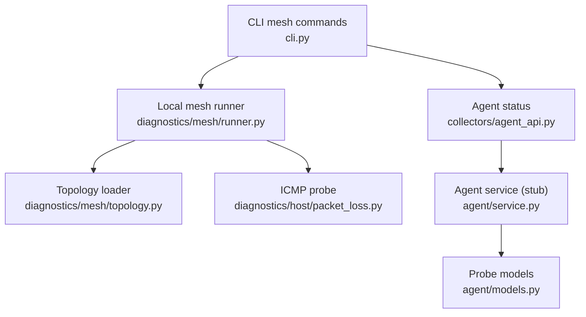
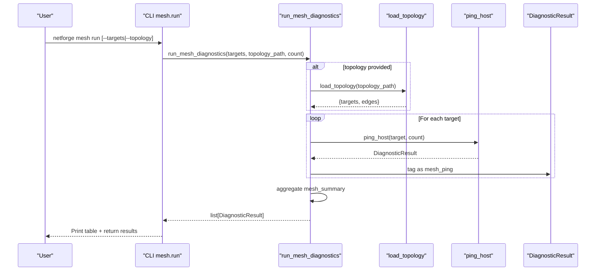
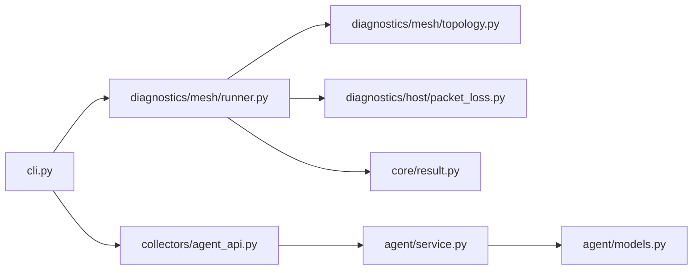

# Mesh Commands

<cite>
**Referenced Files in This Document**
- [cli.py](file://cli.py)
- [runner.py](file://diagnostics/mesh/runner.py)
- [topology.py](file://diagnostics/mesh/topology.py)
- [packet_loss.py](file://diagnostics/host/packet_loss.py)
- [agent_api.py](file://collectors/agent_api.py)
- [service.py](file://agent/service.py)
- [models.py](file://agent/models.py)
- [config.py](file://agent/config.py)
- [result.py](file://core/result.py)
- [mesh_topology.json](file://examples/mesh_topology.json)
</cite>

## Table of Contents
1. [Introduction](#introduction)
2. [Project Structure](#project-structure)
3. [Core Components](#core-components)
4. [Architecture Overview](#architecture-overview)
5. [Detailed Component Analysis](#detailed-component-analysis)
6. [Dependency Analysis](#dependency-analysis)
7. [Performance Considerations](#performance-considerations)
8. [Troubleshooting Guide](#troubleshooting-guide)
9. [Conclusion](#conclusion)
10. [Appendices](#appendices)

## Introduction
This document explains NetForge mesh diagnostic commands for network-wide health assessment and distributed troubleshooting. It covers:
- Local multi-target ping mesh execution
- Agent capability status checking
- Target lists and topology file formats
- Probe counts and output interpretation
- Examples for multi-node connectivity tests, custom topologies, and interpreting results

The mesh feature currently provides a local single-vantage ping mesh with a stubbed remote agent API for future distributed execution.

## Project Structure
Mesh diagnostics are implemented under the CLI mesh subcommands and the diagnostics.mesh module. The runner executes ICMP probes to multiple targets, aggregates results, and prints a summary table. A topology file can define target sets and edges. Agent-related components provide a contract for distributed probing but are not yet active.

**Diagram sources**
- [cli.py:429-455](file://cli.py#L429-L455)
- [runner.py:18-113](file://diagnostics/mesh/runner.py#L18-L113)
- [topology.py:1-5](file://diagnostics/mesh/topology.py#L1-L5)
- [packet_loss.py:14-77](file://diagnostics/host/packet_loss.py#L14-L77)
- [agent_api.py:10-39](file://collectors/agent_api.py#L10-L39)
- [service.py:33-110](file://agent/service.py#L33-L110)
- [models.py:10-40](file://agent/models.py#L10-L40)

**Section sources**
- [cli.py:429-455](file://cli.py#L429-L455)
- [runner.py:18-113](file://diagnostics/mesh/runner.py#L18-L113)
- [topology.py:1-5](file://diagnostics/mesh/topology.py#L1-L5)
- [packet_loss.py:14-77](file://diagnostics/host/packet_loss.py#L14-L77)
- [agent_api.py:10-39](file://collectors/agent_api.py#L10-L39)
- [service.py:33-110](file://agent/service.py#L33-L110)
- [models.py:10-40](file://agent/models.py#L10-L40)

## Core Components
- CLI mesh subcommands:
  - netforge mesh run: Executes a local ping mesh against targets or a topology file.
  - netforge mesh status: Displays local mesh availability and agent capability schema.
- Runner: Loads topology, resolves targets, runs ICMP probes, aggregates per-target and overall mesh health, and prints a table.
- Topology helper: Validates and loads JSON topology files.
- Packet loss module: Performs ICMP pings and returns structured DiagnosticResult objects.
- Agent API and service: Define the contract and capabilities for distributed probing; currently stubbed.

Key behaviors:
- Targets can be provided as a comma-separated list or via a JSON topology file.
- Probe count is configurable and defaults to 3.
- Results include per-target metrics and an aggregated mesh summary result.

**Section sources**
- [cli.py:429-455](file://cli.py#L429-L455)
- [runner.py:18-113](file://diagnostics/mesh/runner.py#L18-L113)
- [topology.py:1-5](file://diagnostics/mesh/topology.py#L1-L5)
- [packet_loss.py:14-77](file://diagnostics/host/packet_loss.py#L14-L77)
- [agent_api.py:10-39](file://collectors/agent_api.py#L10-L39)
- [service.py:33-110](file://agent/service.py#L33-L110)

## Architecture Overview
The mesh workflow starts at the CLI, which delegates to the runner. The runner either reads a topology file or uses command-line targets, then performs ICMP probes to each target. Each probe returns a DiagnosticResult that is tagged as a mesh observation. The runner aggregates these into a summary indicating overall mesh health.

**Diagram sources**
- [cli.py:429-444](file://cli.py#L429-L444)
- [runner.py:18-113](file://diagnostics/mesh/runner.py#L18-L113)
- [packet_loss.py:14-77](file://diagnostics/host/packet_loss.py#L14-L77)

## Detailed Component Analysis

### Command: netforge mesh run
Purpose:
- Run a local ping mesh to one or more targets.
- Support target lists via command line or JSON topology file.
- Configure probe count.

Parameters:
- --targets (-t): Comma-separated list of IP addresses or hostnames.
- --topology: Path to a JSON topology file defining targets and edges.
- --count (-c): Number of ICMP probes per target (default 3).

Behavior:
- If topology is provided, it is loaded and merged to build the final target list.
- For each target, an ICMP probe is executed and wrapped as a mesh observation.
- An aggregated mesh summary result is appended indicating overall health.
- A table is printed showing per-target loss and status.

Output interpretation:
- Per-target rows show target address, packet loss percentage, and status (healthy/degraded/failed/unknown).
- Aggregated summary indicates total reachability across all targets.

Examples:
- Single-vantage test to common resolvers:
  - netforge mesh run --targets "1.1.1.1,8.8.8.8" --count 5
- Using a topology file:
  - netforge mesh run --topology examples/mesh_topology.json --count 3

Topology file format:
- Required fields:
  - targets: Array of destination addresses.
  - edges: Optional array of connections from source to destination.
- Edge formats supported:
  - Object: {"src": "...", "dst": "..."}
  - Array: ["...", "..."] where second element is destination
- Example structure:
  - See [examples/mesh_topology.json](file://examples/mesh_topology.json)

Notes:
- Duplicate targets are deduplicated before probing.
- Default targets are used if neither --targets nor --topology is provided.

**Section sources**
- [cli.py:429-444](file://cli.py#L429-L444)
- [runner.py:18-113](file://diagnostics/mesh/runner.py#L18-L113)
- [mesh_topology.json:1-8](file://examples/mesh_topology.json#L1-L8)

### Command: netforge mesh status
Purpose:
- Display local mesh availability and agent capability schema.

Behavior:
- Prints that local mesh is available via mesh run.
- Indicates remote agents are stubbed (not implemented).
- Shows the agent API schema definition.

Use cases:
- Quick check of whether distributed probing is enabled.
- Review expected request/response contract for future integration.

**Section sources**
- [cli.py:447-455](file://cli.py#L447-L455)
- [agent_api.py:10-39](file://collectors/agent_api.py#L10-L39)

### Topology Loader
Responsibilities:
- Load and validate JSON topology files.
- Ensure presence of targets and/or edges.
- Provide a consistent data structure for the runner.

Validation rules:
- File must contain at least one of "targets" or "edges".
- Errors raised on invalid or missing fields.

Supported edge formats:
- Object with "dst" key.
- Two-element array/tuple where second element is destination.

**Section sources**
- [runner.py:18-23](file://diagnostics/mesh/runner.py#L18-L23)
- [topology.py:1-5](file://diagnostics/mesh/topology.py#L1-L5)

### Agent Capability Status
Current state:
- Remote agent API is defined but not implemented.
- The CLI status command reports stubbed support and shows the schema.

Future distributed mesh:
- When implemented, the controller would dispatch probes to agents using the defined endpoint and request model.
- Agents will execute probes locally and return observations with metadata such as agent_id, hostname, and topology tags.

**Section sources**
- [agent_api.py:10-39](file://collectors/agent_api.py#L10-L39)
- [service.py:33-110](file://agent/service.py#L33-L110)
- [models.py:10-40](file://agent/models.py#L10-L40)
- [config.py:10-34](file://agent/config.py#L10-L34)

## Dependency Analysis
Mesh diagnostics depend on:
- CLI layer for command parsing and invocation.
- Runner for orchestration and aggregation.
- Topology loader for input validation.
- Packet loss module for ICMP probing.
- Result model for standardized outputs.
- Agent API and service for future distributed execution.

**Diagram sources**
- [cli.py:429-455](file://cli.py#L429-L455)
- [runner.py:18-113](file://diagnostics/mesh/runner.py#L18-L113)
- [topology.py:1-5](file://diagnostics/mesh/topology.py#L1-L5)
- [packet_loss.py:14-77](file://diagnostics/host/packet_loss.py#L14-L77)
- [result.py:24-47](file://core/result.py#L24-L47)
- [agent_api.py:10-39](file://collectors/agent_api.py#L10-L39)
- [service.py:33-110](file://agent/service.py#L33-L110)
- [models.py:10-40](file://agent/models.py#L10-L40)

**Section sources**
- [cli.py:429-455](file://cli.py#L429-L455)
- [runner.py:18-113](file://diagnostics/mesh/runner.py#L18-L113)
- [packet_loss.py:14-77](file://diagnostics/host/packet_loss.py#L14-L77)
- [result.py:24-47](file://core/result.py#L24-L47)
- [agent_api.py:10-39](file://collectors/agent_api.py#L10-L39)
- [service.py:33-110](file://agent/service.py#L33-L110)
- [models.py:10-40](file://agent/models.py#L10-L40)

## Performance Considerations
- Probe count: Increase --count for more stable statistics; higher counts increase runtime and network load.
- Target set size: Large target lists scale linearly with number of ICMP probes; consider batching or sampling for very large meshes.
- Network conditions: High latency or loss environments may require increased timeouts or retries in future enhancements.
- Output rendering: Rich tables are printed per run; avoid excessive frequency in automated pipelines.

[No sources needed since this section provides general guidance]

## Troubleshooting Guide
Common issues and interpretations:
- All targets failed:
  - Indicates widespread unreachability from the local vantage point; likely local uplink or routing issue.
- Partial failures:
  - Suggests regional partition, selective ACL, or destination-specific outage; compare failed vs healthy targets for shared attributes.
- Unknown status:
  - May indicate inability to parse ping output or insufficient permissions; verify environment and tooling.
- Topology errors:
  - Missing required fields or invalid JSON will raise errors; ensure topology contains "targets" and/or "edges".

Distributed probing notes:
- Remote agent API is stubbed; attempting to use it will raise a not-implemented error.
- Use local mesh run for current functionality; plan for future integration when agents are deployed.

**Section sources**
- [runner.py:68-93](file://diagnostics/mesh/runner.py#L68-L93)
- [packet_loss.py:14-77](file://diagnostics/host/packet_loss.py#L14-L77)
- [agent_api.py:10-27](file://collectors/agent_api.py#L10-L27)

## Conclusion
NetForge’s mesh commands provide a practical way to assess network-wide reachability from a single vantage point using ICMP probes. While distributed agent-based mesh is not yet implemented, the CLI exposes a clear interface and schema for future expansion. Use topology files to define reusable target sets and edges, configure probe counts for desired accuracy, and interpret aggregated results to identify local or path-specific issues.

[No sources needed since this section summarizes without analyzing specific files]

## Appendices

### Appendix A: Topology File Reference
- Fields:
  - targets: Array of destination addresses.
  - edges: Array of connections; supports object and array formats.
- Example:
  - See [examples/mesh_topology.json](file://examples/mesh_topology.json)

**Section sources**
- [mesh_topology.json:1-8](file://examples/mesh_topology.json#L1-L8)

### Appendix B: Agent API Contract (Planned)
- Endpoint: POST /v1/probe
- Request fields:
  - probe: string (icmp|traceroute|connectivity)
  - target: string
  - options: object
- Response:
  - results: array of DiagnosticResult

**Section sources**
- [agent_api.py:10-39](file://collectors/agent_api.py#L10-L39)

### Appendix C: Data Model Summary
- DiagnosticResult includes:
  - module, category, status, severity, summary, target, metrics, evidence, warnings, errors, metadata
- Status values: healthy, degraded, failed, unknown
- Severity levels: info, low, medium, high, critical

**Section sources**
- [result.py:24-47](file://core/result.py#L24-L47)