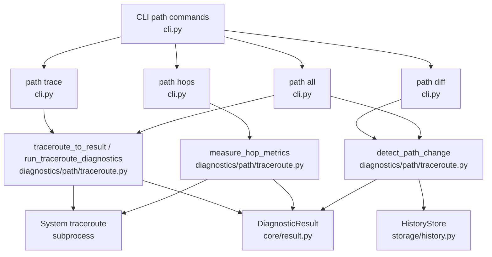
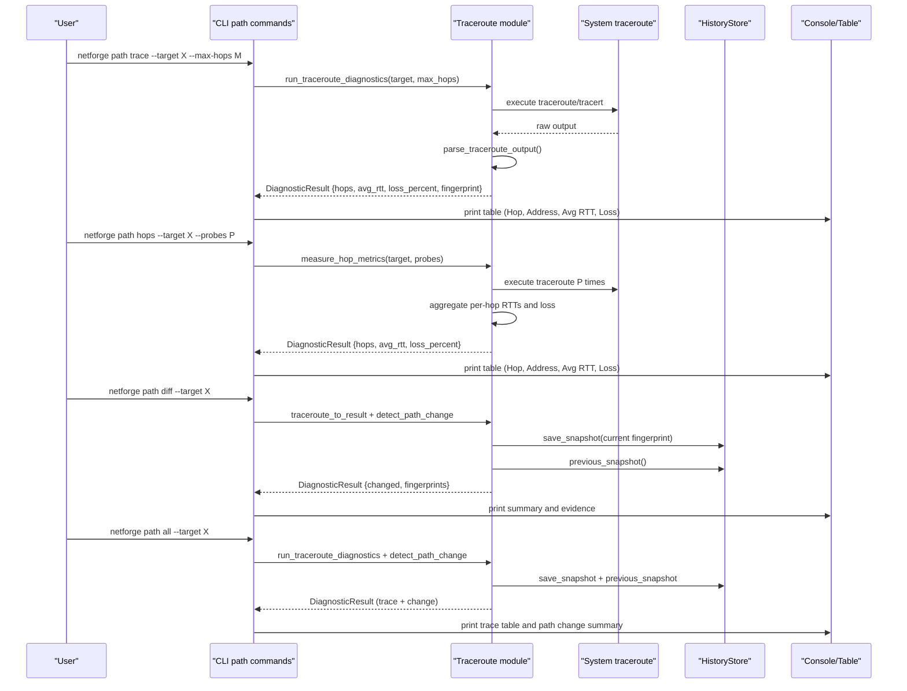
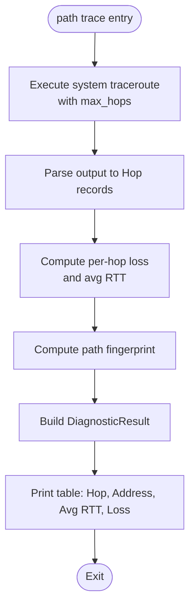
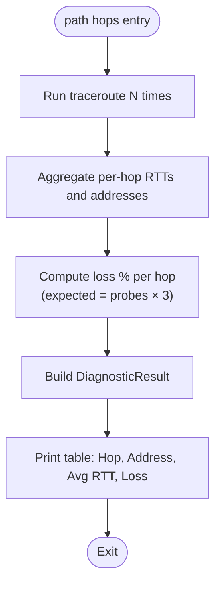
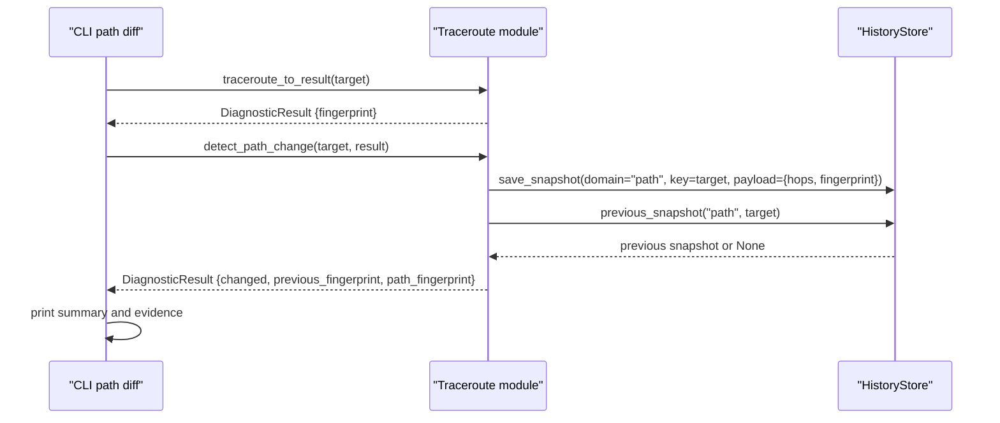
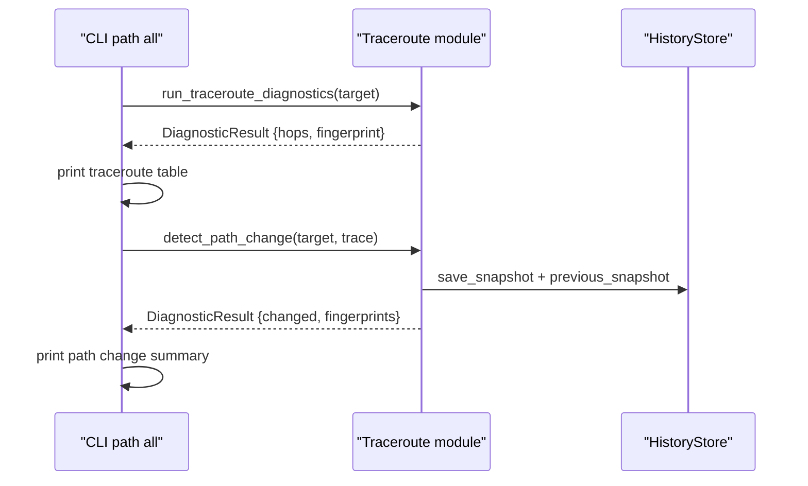
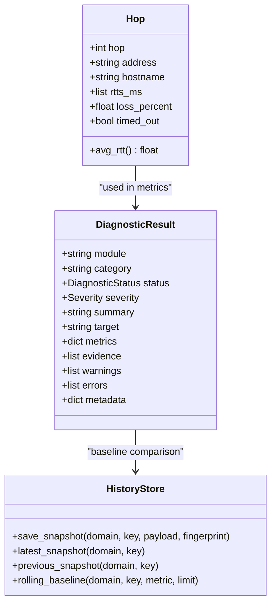
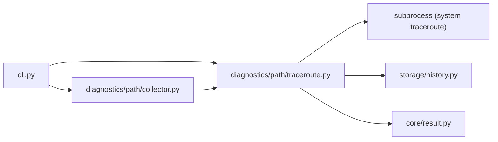

# Path Commands

<cite>
**Referenced Files in This Document**
- [cli.py](file://cli.py)
- [traceroute.py](file://diagnostics/path/traceroute.py)
- [collector.py](file://diagnostics/path/collector.py)
- [history.py](file://storage/history.py)
- [result.py](file://core/result.py)
</cite>

## Table of Contents
1. [Introduction](#introduction)
2. [Project Structure](#project-structure)
3. [Core Components](#core-components)
4. [Architecture Overview](#architecture-overview)
5. [Detailed Component Analysis](#detailed-component-analysis)
6. [Dependency Analysis](#dependency-analysis)
7. [Performance Considerations](#performance-considerations)
8. [Troubleshooting Guide](#troubleshooting-guide)
9. [Conclusion](#conclusion)

## Introduction
This document describes the path-level diagnostic commands in NetForge that discover network paths, aggregate per-hop metrics, and detect routing changes over time. It covers all path subcommands: trace (traceroute), hops (hop-by-hop metric aggregation), diff (path change detection), and all (combined traceroute with path change detection). For each command, it specifies target parameters, hop limits, probe counts, and output formats including hop addresses, average RTT, packet loss percentages, and path change evidence. It also provides examples for analyzing network paths, identifying routing issues, and tracking topology changes.

## Project Structure
The path diagnostics are implemented under the diagnostics/path package and exposed via CLI commands under the path group. The core logic resides in a traceroute module that executes system traceroute tools, parses results into structured hops, aggregates metrics across multiple probes, and persists path fingerprints to a history store for change detection. A collector orchestrates running these diagnostics together.

**Diagram sources**
- [cli.py:269-333](file://cli.py#L269-L333)
- [traceroute.py:115-213](file://diagnostics/path/traceroute.py#L115-L213)
- [traceroute.py:216-276](file://diagnostics/path/traceroute.py#L216-L276)
- [traceroute.py:279-339](file://diagnostics/path/traceroute.py#L279-L339)
- [history.py:15-90](file://storage/history.py#L15-L90)
- [result.py:24-47](file://core/result.py#L24-L47)

**Section sources**
- [cli.py:269-333](file://cli.py#L269-L333)
- [traceroute.py:115-213](file://diagnostics/path/traceroute.py#L115-L213)
- [traceroute.py:216-276](file://diagnostics/path/traceroute.py#L216-L276)
- [traceroute.py:279-339](file://diagnostics/path/traceroute.py#L279-L339)
- [history.py:15-90](file://storage/history.py#L15-L90)
- [result.py:24-47](file://core/result.py#L24-L47)

## Core Components
- Traceroute execution and parsing: Executes platform-specific traceroute or tracert, parses output into hop records with address, hostname, RTTs, timeouts, and per-hop loss.
- Hop metrics aggregation: Runs multiple traceroutes and aggregates per-hop latency and loss across probes.
- Path change detection: Compares current path fingerprint against stored baseline to detect routing changes.
- Collector: Orchestrates running traceroute, path change detection, and optional hop metrics in one call.
- History store: SQLite-backed storage for snapshots of path fingerprints and payloads used for baseline comparison.
- Diagnostic result model: Standardized structure for status, severity, metrics, evidence, warnings, errors, and metadata.

**Section sources**
- [traceroute.py:19-40](file://diagnostics/path/traceroute.py#L19-L40)
- [traceroute.py:42-112](file://diagnostics/path/traceroute.py#L42-L112)
- [traceroute.py:115-213](file://diagnostics/path/traceroute.py#L115-L213)
- [traceroute.py:216-276](file://diagnostics/path/traceroute.py#L216-L276)
- [traceroute.py:279-339](file://diagnostics/path/traceroute.py#L279-L339)
- [collector.py:11-23](file://diagnostics/path/collector.py#L11-L23)
- [history.py:15-90](file://storage/history.py#L15-L90)
- [result.py:24-47](file://core/result.py#L24-L47)

## Architecture Overview
The path commands follow a consistent flow:
- CLI binds user options (target, max_hops, probes) to functions in the traceroute module.
- Traceroute execution uses subprocess to invoke system tools and parse outputs into structured hops.
- Metrics are aggregated across probes when requested.
- Path change detection compares current path fingerprint with previous baseline from the history store.
- Results are returned as standardized DiagnosticResult objects with metrics, evidence, and status.

**Diagram sources**
- [cli.py:269-333](file://cli.py#L269-L333)
- [traceroute.py:115-213](file://diagnostics/path/traceroute.py#L115-L213)
- [traceroute.py:216-276](file://diagnostics/path/traceroute.py#L216-L276)
- [traceroute.py:279-339](file://diagnostics/path/traceroute.py#L279-L339)
- [history.py:45-90](file://storage/history.py#L45-L90)

## Detailed Component Analysis

### Command: path trace
- Purpose: Run traceroute to a target and display hop-by-hop results.
- Target parameter: --target (default 1.1.1.1).
- Hop limit: --max-hops (default 30).
- Probe count: Uses default system traceroute behavior (typically 3 probes per hop).
- Output format:
  - Columns: Hop, Address, Avg RTT, Loss.
  - Each row includes hop number, resolved address or "*", average RTT in ms, and loss percentage.
- Internal behavior:
  - Executes platform-specific traceroute/tracert with specified max hops.
  - Parses output to extract hop addresses, hostnames, RTTs, and timeouts.
  - Computes per-hop loss based on expected vs received responses.
  - Builds DiagnosticResult with metrics including hop_count, hops list, path_fingerprint, high_loss_hops, and max_hop_loss_percent.
  - Prints a Rich table with hop details.

**Diagram sources**
- [cli.py:269-277](file://cli.py#L269-L277)
- [traceroute.py:115-213](file://diagnostics/path/traceroute.py#L115-L213)

**Section sources**
- [cli.py:269-277](file://cli.py#L269-L277)
- [traceroute.py:115-213](file://diagnostics/path/traceroute.py#L115-L213)

### Command: path hops
- Purpose: Aggregate per-hop latency and loss by running multiple traceroutes.
- Target parameter: --target (default 1.1.1.1).
- Probe count: --probes (default 2).
- Hop limit: Default internal max_hops for aggregation (used within measure_hop_metrics).
- Output format:
  - Columns: Hop, Address, Avg RTT, Loss.
  - Aggregates RTTs across probes to compute average RTT per hop.
  - Computes loss percentage based on total expected responses (probes × 3) vs received.
- Internal behavior:
  - Runs traceroute N times (N = probes).
  - Aggregates per-hop RTTs and addresses.
  - Calculates per-hop loss and average RTT.
  - Returns DiagnosticResult with hops list, probes count, and max_hop_loss_percent.
  - Prints a Rich table with aggregated metrics.

**Diagram sources**
- [cli.py:280-303](file://cli.py#L280-L303)
- [traceroute.py:216-276](file://diagnostics/path/traceroute.py#L216-L276)

**Section sources**
- [cli.py:280-303](file://cli.py#L280-L303)
- [traceroute.py:216-276](file://diagnostics/path/traceroute.py#L216-L276)

### Command: path diff
- Purpose: Detect whether the forwarding path to a target has changed compared to the stored baseline.
- Target parameter: --target (default 1.1.1.1).
- Hop limit: Default internal max_hops for traceroute.
- Probe count: Single traceroute run.
- Output format:
  - Summary line indicating whether path changed.
  - Evidence lines showing previous and current fingerprints.
- Internal behavior:
  - Runs traceroute and builds DiagnosticResult with path fingerprint.
  - Saves current snapshot to history store.
  - Retrieves previous snapshot and compares fingerprints.
  - Returns DiagnosticResult with changed flag and fingerprints.
  - Prints summary and evidence.

**Diagram sources**
- [cli.py:306-318](file://cli.py#L306-L318)
- [traceroute.py:279-339](file://diagnostics/path/traceroute.py#L279-L339)
- [history.py:45-90](file://storage/history.py#L45-L90)

**Section sources**
- [cli.py:306-318](file://cli.py#L306-L318)
- [traceroute.py:279-339](file://diagnostics/path/traceroute.py#L279-L339)
- [history.py:45-90](file://storage/history.py#L45-L90)

### Command: path all
- Purpose: Combine traceroute execution with path change detection in one command.
- Target parameter: --target (default 1.1.1.1).
- Hop limit: Default internal max_hops for traceroute.
- Probe count: Single traceroute run; path change detection uses stored baseline.
- Output format:
  - Traceroute table (same as path trace).
  - Path change summary indicating whether the route changed.
- Internal behavior:
  - Runs traceroute and prints hop details.
  - Performs path change detection and prints summary.

**Diagram sources**
- [cli.py:320-333](file://cli.py#L320-L333)
- [traceroute.py:115-213](file://diagnostics/path/traceroute.py#L115-L213)
- [traceroute.py:279-339](file://diagnostics/path/traceroute.py#L279-L339)
- [history.py:45-90](file://storage/history.py#L45-L90)

**Section sources**
- [cli.py:320-333](file://cli.py#L320-L333)
- [traceroute.py:115-213](file://diagnostics/path/traceroute.py#L115-L213)
- [traceroute.py:279-339](file://diagnostics/path/traceroute.py#L279-L339)
- [history.py:45-90](file://storage/history.py#L45-L90)

### Data Model: Hop and DiagnosticResult
- Hop dataclass: Represents a single hop with hop number, address, hostname, RTTs, loss percentage, and timeout flag. Provides average RTT calculation.
- DiagnosticResult: Standardized container for module name, category, status, severity, summary, target, metrics, evidence, warnings, errors, and metadata.

**Diagram sources**
- [traceroute.py:19-40](file://diagnostics/path/traceroute.py#L19-L40)
- [result.py:24-47](file://core/result.py#L24-L47)
- [history.py:15-90](file://storage/history.py#L15-L90)

**Section sources**
- [traceroute.py:19-40](file://diagnostics/path/traceroute.py#L19-L40)
- [result.py:24-47](file://core/result.py#L24-L47)
- [history.py:15-90](file://storage/history.py#L15-L90)

## Dependency Analysis
- CLI depends on traceroute module functions for each path command.
- Traceroute module depends on:
  - System traceroute/tracert via subprocess.
  - HistoryStore for baseline persistence and retrieval.
  - DiagnosticResult for standardized outputs.
- Collector depends on traceroute module functions to orchestrate multiple diagnostics.
- HistoryStore depends on SQLite for persistent storage of snapshots.

**Diagram sources**
- [cli.py:269-333](file://cli.py#L269-L333)
- [traceroute.py:115-213](file://diagnostics/path/traceroute.py#L115-L213)
- [collector.py:11-23](file://diagnostics/path/collector.py#L11-L23)
- [history.py:15-90](file://storage/history.py#L15-L90)
- [result.py:24-47](file://core/result.py#L24-L47)

**Section sources**
- [cli.py:269-333](file://cli.py#L269-L333)
- [traceroute.py:115-213](file://diagnostics/path/traceroute.py#L115-L213)
- [collector.py:11-23](file://diagnostics/path/collector.py#L11-L23)
- [history.py:15-90](file://storage/history.py#L15-L90)
- [result.py:24-47](file://core/result.py#L24-L47)

## Performance Considerations
- Traceroute execution time scales with max_hops and per-hop timeout; adjust max_hops to reduce runtime for quick checks.
- Hop metrics aggregation runs multiple traceroutes; increasing probes improves statistical reliability but increases total runtime proportionally.
- Path change detection adds minimal overhead beyond traceroute execution and SQLite writes.
- Use appropriate probe counts for production monitoring to balance accuracy and performance.

[No sources needed since this section provides general guidance]

## Troubleshooting Guide
- No hops discovered: Indicates traceroute failed or target unreachable; check connectivity and permissions.
- High per-hop loss: May indicate congestion or firewall filtering; increase probes to confirm trends.
- Path change detected: Indicates routing shift; review evidence fingerprints and investigate upstream routing changes.
- History store issues: Ensure write permissions to the SQLite database file; verify NETFORGE_HISTORY_DB environment variable if customized.

**Section sources**
- [traceroute.py:151-160](file://diagnostics/path/traceroute.py#L151-L160)
- [traceroute.py:235-244](file://diagnostics/path/traceroute.py#L235-L244)
- [traceroute.py:293-324](file://diagnostics/path/traceroute.py#L293-L324)
- [history.py:15-23](file://storage/history.py#L15-L23)

## Conclusion
NetForge’s path commands provide a comprehensive toolkit for diagnosing network paths through traceroute execution, per-hop metric aggregation, and path change detection. The CLI exposes intuitive commands with configurable targets, hop limits, and probe counts, returning structured results with clear metrics and evidence. By combining these capabilities, operators can analyze routing paths, identify issues such as high loss or timeouts, and track topology changes over time using stored baselines.

[No sources needed since this section summarizes without analyzing specific files]