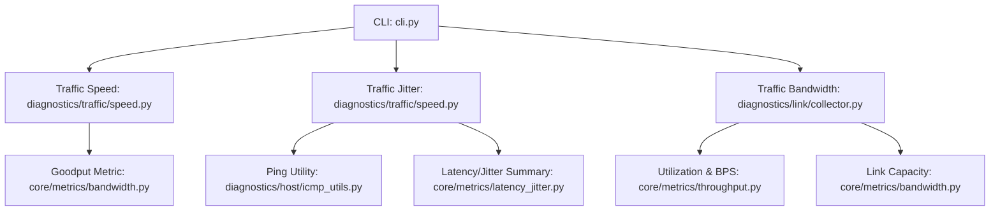
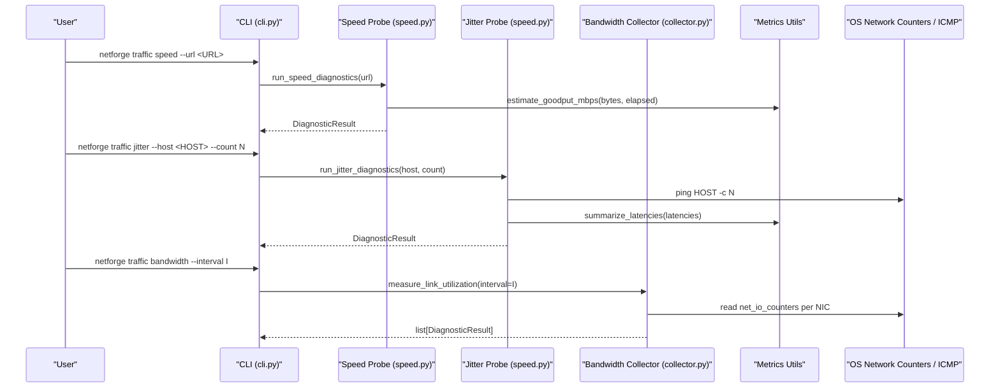
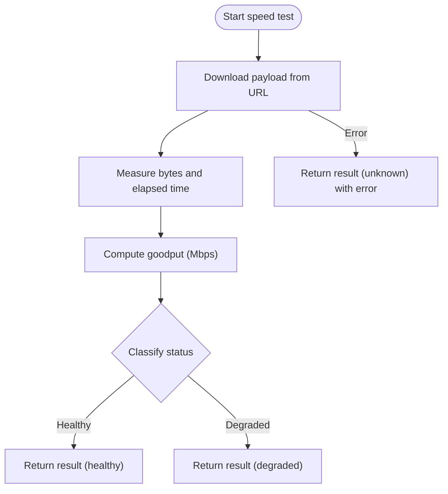
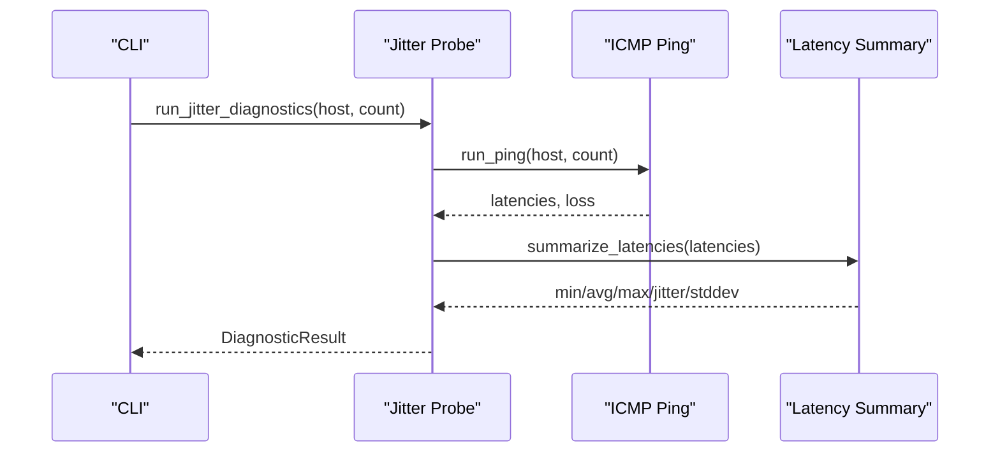
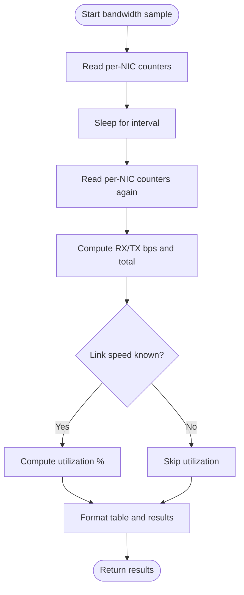
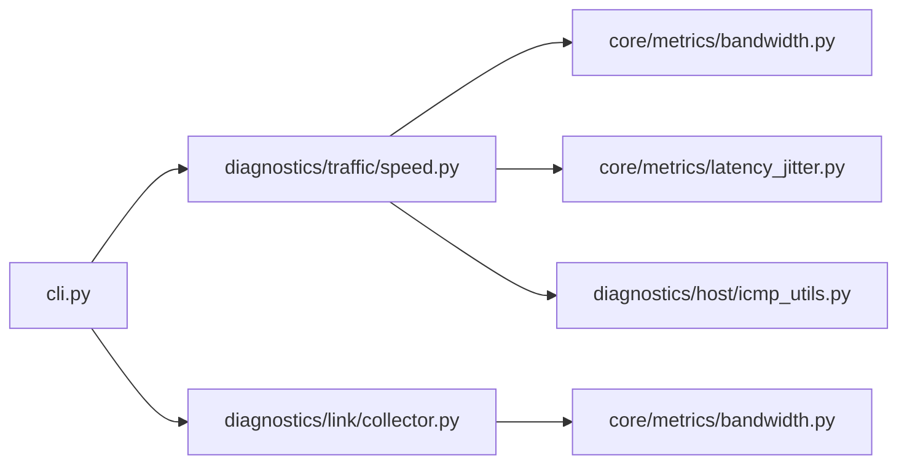

# Traffic Commands

<cite>
**Referenced Files in This Document**
- [cli.py](file://cli.py)
- [speed.py](file://diagnostics/traffic/speed.py)
- [bandwidth.py](file://core/metrics/bandwidth.py)
- [latency_jitter.py](file://core/metrics/latency_jitter.py)
- [icmp_utils.py](file://diagnostics/host/icmp_utils.py)
- [collector.py](file://diagnostics/link/collector.py)
- [result.py](file://core/result.py)
- [README.md](file://README.md)
</cite>

## Table of Contents
1. [Introduction](#introduction)
2. [Project Structure](#project-structure)
3. [Core Components](#core-components)
4. [Architecture Overview](#architecture-overview)
5. [Detailed Component Analysis](#detailed-component-analysis)
6. [Dependency Analysis](#dependency-analysis)
7. [Performance Considerations](#performance-considerations)
8. [Troubleshooting Guide](#troubleshooting-guide)
9. [Conclusion](#conclusion)
10. [Appendices](#appendices)

## Introduction
This document provides detailed documentation for NetForge traffic analysis commands under the traffic subcommand group. It covers:
- Speed testing (download goodput estimation)
- Jitter measurement (RFC 3550 packet delay variation)
- Bandwidth monitoring (per-interface utilization and throughput samples)

For each command, you will find URL parameters, host targets, count options, interval settings, output formats, and example workflows for performance testing, quality of service assessment, and bandwidth capacity planning.

## Project Structure
The traffic commands are implemented as CLI entry points that delegate to diagnostic modules. The key files involved are:
- CLI definitions for traffic commands
- Active traffic probes for speed and jitter
- Link-level collectors for bandwidth utilization
- Shared metrics utilities for goodput and latency/jitter computation
- ICMP utilities used by jitter measurements

**Diagram sources**
- [cli.py:340-388](file://cli.py#L340-L388)
- [speed.py:22-151](file://diagnostics/traffic/speed.py#L22-L151)
- [collector.py:29-84](file://diagnostics/link/collector.py#L29-L84)
- [bandwidth.py:4-16](file://core/metrics/bandwidth.py#L4-L16)
- [latency_jitter.py:7-40](file://core/metrics/latency_jitter.py#L7-L40)
- [icmp_utils.py:68-115](file://diagnostics/host/icmp_utils.py#L68-L115)

**Section sources**
- [cli.py:340-388](file://cli.py#L340-L388)
- [README.md:11-19](file://README.md#L11-L19)

## Core Components
- Traffic speed: Estimates download goodput by downloading a known payload from a configurable URL and computing Mbps from bytes transferred and elapsed time.
- Traffic jitter: Measures RFC 3550 jitter by sending ICMP pings to a target host and summarizing latencies.
- Traffic bandwidth: Samples per-interface RX/TX throughput and utilization over a configured interval using system network counters.

All components return standardized DiagnosticResult objects with status, severity, summary, metrics, evidence, warnings, and errors.

**Section sources**
- [speed.py:22-151](file://diagnostics/traffic/speed.py#L22-L151)
- [collector.py:29-84](file://diagnostics/link/collector.py#L29-L84)
- [result.py:24-47](file://core/result.py#L24-L47)

## Architecture Overview
The traffic commands follow a consistent flow:
- CLI parses arguments and invokes the appropriate diagnostic function.
- The diagnostic function performs measurements (HTTP download or ICMP ping or interface counters).
- Metrics are computed via shared utility functions.
- Results are formatted into tables and returned as DiagnosticResult objects.

**Diagram sources**
- [cli.py:340-388](file://cli.py#L340-L388)
- [speed.py:22-151](file://diagnostics/traffic/speed.py#L22-L151)
- [collector.py:29-84](file://diagnostics/link/collector.py#L29-L84)
- [icmp_utils.py:68-115](file://diagnostics/host/icmp_utils.py#L68-L115)
- [bandwidth.py:11-16](file://core/metrics/bandwidth.py#L11-L16)
- [latency_jitter.py:28-40](file://core/metrics/latency_jitter.py#L28-L40)

## Detailed Component Analysis

### Traffic Speed Command
- Purpose: Estimate download goodput by fetching a known-size payload from a URL.
- CLI command: netforge traffic speed
- Parameters:
  - url (--url, -u): Download endpoint URL; default is a public speed test endpoint.
- Behavior:
  - Downloads data in chunks until completion or timeout.
  - Computes goodput in Mbps using bytes transferred and elapsed time.
  - Classifies status based on thresholds for goodput.
- Output format:
  - Table columns: Metric, Value
  - Rows include:
    - Goodput: Mbps
    - Bytes: total bytes transferred
    - Elapsed: seconds
    - Status: healthy/degraded/failed/unknown
- Result metrics:
  - goodput_mbps: float
  - bytes: int
  - elapsed_seconds: float
  - direction: "download"
- Example usage:
  - Default: netforge traffic speed
  - Custom URL: netforge traffic speed --url https://example.com/download?bytes=10000000

**Diagram sources**
- [speed.py:22-70](file://diagnostics/traffic/speed.py#L22-L70)
- [bandwidth.py:11-16](file://core/metrics/bandwidth.py#L11-L16)

**Section sources**
- [cli.py:340-352](file://cli.py#L340-L352)
- [speed.py:22-134](file://diagnostics/traffic/speed.py#L22-L134)
- [bandwidth.py:11-16](file://core/metrics/bandwidth.py#L11-L16)

### Traffic Jitter Command
- Purpose: Measure RFC 3550 jitter (packet delay variation) to a target host.
- CLI command: netforge traffic jitter
- Parameters:
  - host (--host, -h): Target host for ICMP ping; default is a public DNS resolver.
  - count (--count, -c): Number of ICMP probes; default is 10.
- Behavior:
  - Sends ICMP pings to the host and collects latency samples.
  - Computes RFC 3550 jitter and other latency statistics.
  - Classifies status based on jitter thresholds.
- Output format:
  - Table columns: Host, Jitter, Avg RTT, Status
  - Rows include:
    - Host: target address
    - Jitter: ms
    - Avg RTT: ms
    - Status: healthy/degraded/failed/unknown
- Result metrics:
  - jitter_ms: float
  - avg_ms: float
  - min_ms: float
  - max_ms: float
  - samples: int
  - packet_loss_percent: float
- Example usage:
  - Default: netforge traffic jitter
  - Custom host and count: netforge traffic jitter --host 8.8.8.8 --count 20

**Diagram sources**
- [speed.py:73-151](file://diagnostics/traffic/speed.py#L73-L151)
- [icmp_utils.py:68-115](file://diagnostics/host/icmp_utils.py#L68-L115)
- [latency_jitter.py:28-40](file://core/metrics/latency_jitter.py#L28-L40)

**Section sources**
- [cli.py:354-363](file://cli.py#L354-L363)
- [speed.py:73-151](file://diagnostics/traffic/speed.py#L73-L151)
- [icmp_utils.py:68-115](file://diagnostics/host/icmp_utils.py#L68-L115)
- [latency_jitter.py:28-40](file://core/metrics/latency_jitter.py#L28-L40)

### Traffic Bandwidth Command
- Purpose: Show current interface bandwidth utilization and throughput samples.
- CLI command: netforge traffic bandwidth
- Parameters:
  - interval (--interval, -i): Sampling window in seconds; default is 1.0.
- Behavior:
  - Reads per-NIC byte counters before and after sleeping for the interval.
  - Computes RX/TX bits per second and total throughput.
  - Optionally computes utilization percentage if link speed is available.
- Output format:
  - Table columns: Interface, Total Mbps, Util %
  - Rows include:
    - Interface: NIC name
    - Total Mbps: combined RX+TX throughput
    - Util %: utilization relative to link speed (if known)
- Result metrics (per interface):
  - rx_bps: float
  - tx_bps: float
  - total_bps: float
  - util_percent: float or None
  - speed_mbps: float or None
- Example usage:
  - Default: netforge traffic bandwidth
  - Custom interval: netforge traffic bandwidth --interval 5

**Diagram sources**
- [collector.py:29-84](file://diagnostics/link/collector.py#L29-L84)
- [bandwidth.py:4-8](file://core/metrics/bandwidth.py#L4-L8)

**Section sources**
- [cli.py:365-388](file://cli.py#L365-L388)
- [collector.py:29-84](file://diagnostics/link/collector.py#L29-L84)
- [bandwidth.py:4-8](file://core/metrics/bandwidth.py#L4-L8)

## Dependency Analysis
- CLI depends on diagnostic modules for each traffic subcommand.
- Speed probe depends on HTTP client and goodput metric utility.
- Jitter probe depends on ICMP ping utility and latency/jitter summary utility.
- Bandwidth probe depends on system network counters and link capacity utility.

**Diagram sources**
- [cli.py:340-388](file://cli.py#L340-L388)
- [speed.py:22-151](file://diagnostics/traffic/speed.py#L22-L151)
- [collector.py:29-84](file://diagnostics/link/collector.py#L29-L84)
- [bandwidth.py:4-16](file://core/metrics/bandwidth.py#L4-L16)
- [latency_jitter.py:28-40](file://core/metrics/latency_jitter.py#L28-L40)
- [icmp_utils.py:68-115](file://diagnostics/host/icmp_utils.py#L68-L115)

**Section sources**
- [cli.py:340-388](file://cli.py#L340-L388)
- [speed.py:22-151](file://diagnostics/traffic/speed.py#L22-L151)
- [collector.py:29-84](file://diagnostics/link/collector.py#L29-L84)

## Performance Considerations
- Speed test duration depends on payload size and network conditions; adjust URL or use smaller payloads for quick checks.
- Jitter measurement accuracy improves with more samples; increase count for stable estimates but consider longer runtime.
- Bandwidth sampling interval affects responsiveness vs. stability; shorter intervals capture bursts but may be noisier.
- Link utilization calculation requires accurate link speed detection; some interfaces may not report speed, resulting in utilization being unavailable.

## Troubleshooting Guide
- Speed test failures:
  - Check URL accessibility and timeouts; ensure outbound connectivity and firewall rules allow HTTPS downloads.
  - Errors surface in the result’s errors field and set status to unknown.
- Jitter measurement failures:
  - Ensure ICMP is allowed to the target host; otherwise, ping will fail and jitter cannot be computed.
  - High packet loss can degrade jitter reliability; inspect packet_loss_percent in metrics.
- Bandwidth monitoring anomalies:
  - If utilization is missing, verify that the interface reports speed; otherwise, only raw bps values are available.
  - Short intervals may show spikes; increase interval for smoother readings.

**Section sources**
- [speed.py:61-70](file://diagnostics/traffic/speed.py#L61-L70)
- [speed.py:73-110](file://diagnostics/traffic/speed.py#L73-L110)
- [collector.py:19-26](file://diagnostics/link/collector.py#L19-L26)
- [icmp_utils.py:68-115](file://diagnostics/host/icmp_utils.py#L68-L115)

## Conclusion
NetForge’s traffic commands provide practical tools for measuring download goodput, assessing jitter, and monitoring interface bandwidth. By tuning URL targets, host addresses, probe counts, and sampling intervals, you can perform performance testing, evaluate quality of service, and plan bandwidth capacity across your network.

## Appendices

### Command Reference Summary
- netforge traffic speed
  - Parameters: url (--url, -u)
  - Output: Goodput (Mbps), Bytes, Elapsed, Status
- netforge traffic jitter
  - Parameters: host (--host, -h), count (--count, -c)
  - Output: Host, Jitter (ms), Avg RTT (ms), Status
- netforge traffic bandwidth
  - Parameters: interval (--interval, -i)
  - Output: Interface, Total Mbps, Util %

**Section sources**
- [cli.py:340-388](file://cli.py#L340-L388)
- [speed.py:124-151](file://diagnostics/traffic/speed.py#L124-L151)
- [collector.py:29-84](file://diagnostics/link/collector.py#L29-L84)

### Example Workflows
- Performance testing workflow:
  - Run speed tests against multiple endpoints to compare goodput.
  - Use jitter tests to assess real-time application quality (e.g., VoIP, video).
  - Monitor bandwidth utilization during peak hours to identify bottlenecks.
- Quality of service assessment:
  - Combine jitter and packet loss metrics to evaluate voice/video performance.
  - Correlate high jitter with congestion indicators from link diagnostics.
- Bandwidth capacity planning:
  - Sample bandwidth over extended intervals to establish baselines.
  - Compare observed utilization against link capacity to forecast upgrades.

[No sources needed since this section provides general guidance]