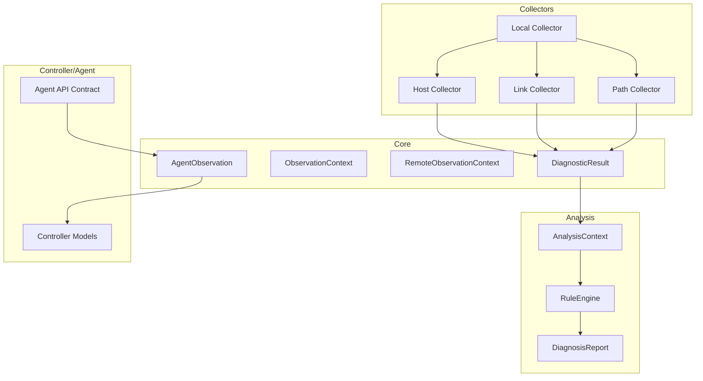
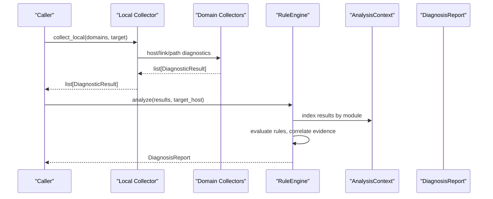
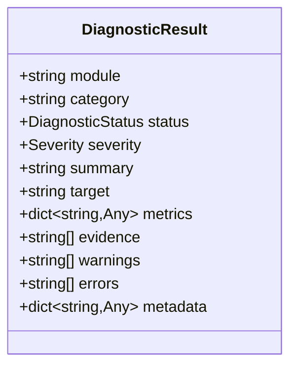
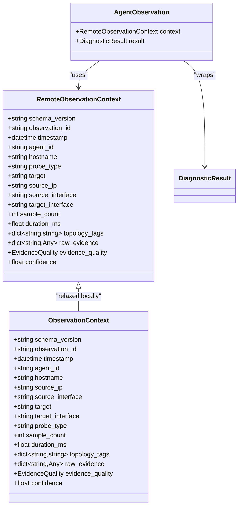
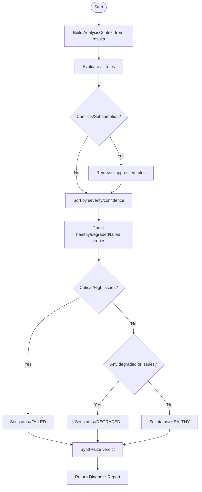
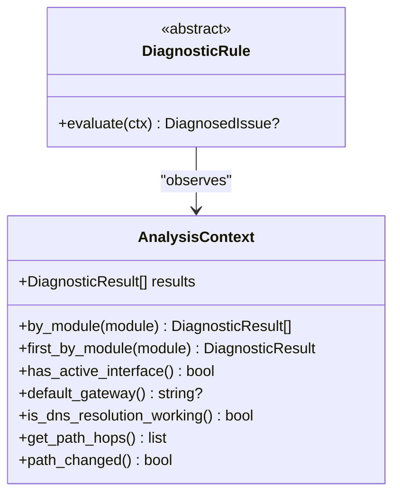
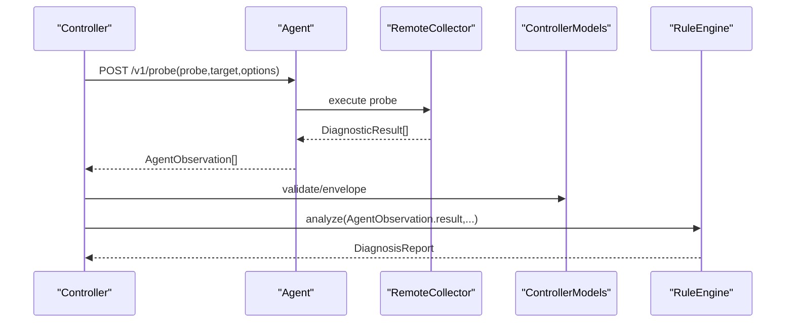
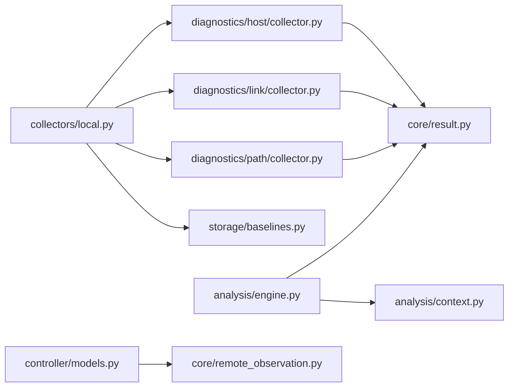

# Core Concepts

<cite>
**Referenced Files in This Document**
- [core/result.py](file://core/result.py)
- [core/observation.py](file://core/observation.py)
- [core/remote_observation.py](file://core/remote_observation.py)
- [core/engine.py](file://core/engine.py)
- [analysis/engine.py](file://analysis/engine.py)
- [analysis/context.py](file://analysis/context.py)
- [analysis/models.py](file://analysis/models.py)
- [analysis/rule.py](file://analysis/rule.py)
- [collectors/local.py](file://collectors/local.py)
- [collectors/agent_api.py](file://collectors/agent_api.py)
- [diagnostics/host/collector.py](file://diagnostics/host/collector.py)
- [diagnostics/link/collector.py](file://diagnostics/link/collector.py)
- [diagnostics/path/collector.py](file://diagnostics/path/collector.py)
- [storage/baselines.py](file://storage/baselines.py)
- [controller/models.py](file://controller/models.py)
</cite>

## Table of Contents
1. [Introduction](#introduction)
2. [Project Structure](#project-structure)
3. [Core Components](#core-components)
4. [Architecture Overview](#architecture-overview)
5. [Detailed Component Analysis](#detailed-component-analysis)
6. [Dependency Analysis](#dependency-analysis)
7. [Performance Considerations](#performance-considerations)
8. [Troubleshooting Guide](#troubleshooting-guide)
9. [Conclusion](#conclusion)

## Introduction
This document explains the foundational concepts of NetForge’s diagnostic framework: the standardized result model, observation abstractions for local and remote data collection, and the core engine orchestration that aggregates results into actionable insights. It also documents how the observer pattern is used to aggregate observations, how local and remote observations relate, and how distributed operations are coordinated while maintaining consistency across different diagnostic types.

## Project Structure
NetForge organizes functionality by layers:
- Core models define the universal diagnostic result and observation contracts.
- Collectors orchestrate domain-specific diagnostics (host, link, path).
- The analysis layer applies rules against collected results to produce a diagnosis report.
- Controller and agent components coordinate distributed probes and persist observations.

**Diagram sources**
- [core/result.py:24-47](file://core/result.py#L24-L47)
- [core/observation.py:32-63](file://core/observation.py#L32-L63)
- [core/remote_observation.py:15-59](file://core/remote_observation.py#L15-L59)
- [collectors/local.py:16-39](file://collectors/local.py#L16-L39)
- [diagnostics/host/collector.py:16-60](file://diagnostics/host/collector.py#L16-L60)
- [diagnostics/link/collector.py:29-179](file://diagnostics/link/collector.py#L29-L179)
- [diagnostics/path/collector.py:11-23](file://diagnostics/path/collector.py#L11-L23)
- [analysis/context.py:7-199](file://analysis/context.py#L7-L199)
- [analysis/engine.py:15-130](file://analysis/engine.py#L15-L130)
- [controller/models.py:13-38](file://controller/models.py#L13-L38)
- [collectors/agent_api.py:10-39](file://collectors/agent_api.py#L10-L39)

**Section sources**
- [collectors/local.py:16-39](file://collectors/local.py#L16-L39)
- [analysis/engine.py:15-130](file://analysis/engine.py#L15-L130)
- [controller/models.py:13-38](file://controller/models.py#L13-L38)

## Core Components
- DiagnosticResult: A standardized contract returned by every diagnostic module, including status, severity, summary, target, metrics, evidence, warnings, errors, and metadata.
- ObservationContext: Versioned provenance for observations, including timestamps, agent identity, topology tags, sample counts, durations, raw evidence, evidence quality, and confidence.
- RemoteObservationContext: Strict version of ObservationContext enforced at the agent/controller boundary with timezone-aware timestamps and confidence validation.
- AgentObservation: Envelope pairing RemoteObservationContext with a DiagnosticResult for controller consumption.
- DiagnosticEngine: Aggregates results to summarize health and extract failures/findings.
- RuleEngine: Applies modular rules against an indexed context of results to synthesize issues and a final diagnosis report.

Key relationships:
- All collectors emit DiagnosticResult objects.
- Local collectors run on the host; remote agents return AgentObservation envelopes containing both context and result.
- AnalysisContext indexes results by module to support cross-layer correlation.
- RuleEngine consumes AnalysisContext to produce DiagnosisReport.

**Section sources**
- [core/result.py:24-47](file://core/result.py#L24-L47)
- [core/observation.py:32-63](file://core/observation.py#L32-L63)
- [core/remote_observation.py:15-59](file://core/remote_observation.py#L15-L59)
- [core/engine.py:10-83](file://core/engine.py#L10-L83)
- [analysis/context.py:7-199](file://analysis/context.py#L7-L199)
- [analysis/engine.py:15-130](file://analysis/engine.py#L15-L130)

## Architecture Overview
The framework follows a layered pipeline:
1. Data Collection: Local collectors gather host, link, and path diagnostics; remote agents can be probed via a defined HTTP contract.
2. Result Normalization: Each probe returns a DiagnosticResult with consistent fields.
3. Context Indexing: AnalysisContext indexes results by module for efficient queries.
4. Rule Evaluation: RuleEngine evaluates modular rules, correlates multi-layer evidence, resolves conflicts/subsumption, and synthesizes a DiagnosisReport.
5. Orchestration: DiagnosticEngine summarizes statuses and extracts findings for reporting.

**Diagram sources**
- [collectors/local.py:16-39](file://collectors/local.py#L16-L39)
- [diagnostics/host/collector.py:16-60](file://diagnostics/host/collector.py#L16-L60)
- [diagnostics/link/collector.py:29-179](file://diagnostics/link/collector.py#L29-L179)
- [diagnostics/path/collector.py:11-23](file://diagnostics/path/collector.py#L11-L23)
- [analysis/context.py:7-199](file://analysis/context.py#L7-L199)
- [analysis/engine.py:15-130](file://analysis/engine.py#L15-L130)

## Detailed Component Analysis

### Standardized Result Model
- DiagnosticStatus and Severity provide uniform signaling across modules.
- DiagnosticResult carries module/category identification, human-readable summary, optional target, rich metrics, evidence strings, warnings/errors, and extensible metadata.
- Baseline comparisons generate additional DiagnosticResult entries to detect deviations from historical norms.

**Diagram sources**
- [core/result.py:24-47](file://core/result.py#L24-L47)

**Section sources**
- [core/result.py:24-47](file://core/result.py#L24-L47)
- [storage/baselines.py:9-91](file://storage/baselines.py#L9-L91)

### Observation Abstractions: Local vs Remote
- ObservationContext provides versioned provenance for observations, including agent identity, hostname, interfaces, targets, probe type, sampling parameters, topology tags, raw evidence, evidence quality, and derived confidence.
- RemoteObservationContext enforces stricter constraints at the agent/controller boundary:
  - Timezone-aware timestamps required.
  - Confidence must match evidence_quality or be set automatically.
- AgentObservation pairs RemoteObservationContext with DiagnosticResult for controller ingestion.

**Diagram sources**
- [core/observation.py:32-63](file://core/observation.py#L32-L63)
- [core/remote_observation.py:15-59](file://core/remote_observation.py#L15-L59)
- [core/result.py:24-47](file://core/result.py#L24-L47)

**Section sources**
- [core/observation.py:32-63](file://core/observation.py#L32-L63)
- [core/remote_observation.py:15-59](file://core/remote_observation.py#L15-L59)

### Core Engine Orchestration
- DiagnosticEngine summarizes overall health by counting statuses and severities, identifies failures, and generates human-readable findings.
- RuleEngine orchestrates modular rule evaluation:
  - Builds AnalysisContext from results.
  - Evaluates each rule, isolating failures to prevent cascade crashes.
  - Resolves conflicts and subsumption among issues.
  - Sorts issues by severity and confidence.
  - Synthesizes a DiagnosisReport with overall status, verdict, key observations, and metadata.

**Diagram sources**
- [analysis/engine.py:15-130](file://analysis/engine.py#L15-L130)
- [analysis/context.py:7-199](file://analysis/context.py#L7-L199)

**Section sources**
- [core/engine.py:10-83](file://core/engine.py#L10-L83)
- [analysis/engine.py:15-130](file://analysis/engine.py#L15-L130)

### Observer Pattern for Result Aggregation
- AnalysisContext acts as an observer/cache over DiagnosticResult observations, indexing by module to enable efficient querying across layers (interface, routing, gateway, DNS, transport, link, path).
- Rules observe this context to correlate multi-layer evidence without tight coupling to individual collectors.

**Diagram sources**
- [analysis/context.py:7-199](file://analysis/context.py#L7-L199)
- [analysis/rule.py:9-51](file://analysis/rule.py#L9-L51)

**Section sources**
- [analysis/context.py:7-199](file://analysis/context.py#L7-L199)
- [analysis/rule.py:9-51](file://analysis/rule.py#L9-L51)

### Relationship Between Local and Remote Observations
- Local collectors assemble DiagnosticResult lists per domain (host, link, path), optionally adding baseline deltas.
- Remote agents expose a contract to return DiagnosticResult arrays; controller models wrap these as AgentObservation with strict context validation.
- Both paths converge into the same analysis pipeline through unified result structures.

**Diagram sources**
- [collectors/agent_api.py:10-39](file://collectors/agent_api.py#L10-L39)
- [controller/models.py:13-38](file://controller/models.py#L13-L38)
- [core/remote_observation.py:54-59](file://core/remote_observation.py#L54-L59)
- [analysis/engine.py:15-130](file://analysis/engine.py#L15-L130)

**Section sources**
- [collectors/agent_api.py:10-39](file://collectors/agent_api.py#L10-L39)
- [controller/models.py:13-38](file://controller/models.py#L13-L38)
- [core/remote_observation.py:15-59](file://core/remote_observation.py#L15-L59)

### Foundation Patterns Enabling Modular Diagnostics
- Strategy Pattern: Domain collectors implement distinct strategies (host, link, path) returning a common DiagnosticResult.
- Observer Pattern: AnalysisContext observes and indexes results; rules observe the context to perform correlation.
- Template Method: DiagnosticRule base class defines evaluation flow and issue construction helpers.
- Envelope Pattern: AgentObservation wraps context and result for safe transport across boundaries.

These patterns ensure:
- Loose coupling between collectors and analyzers.
- Extensibility via new rules and collectors.
- Consistency across local and remote data paths.
- Robustness via isolated rule execution and strict validation at boundaries.

**Section sources**
- [analysis/rule.py:9-51](file://analysis/rule.py#L9-L51)
- [analysis/context.py:7-199](file://analysis/context.py#L7-L199)
- [core/remote_observation.py:54-59](file://core/remote_observation.py#L54-L59)

## Dependency Analysis
- Collectors depend on core.result for output contracts and may use storage.baselines to enrich results with baseline deltas.
- Analysis depends on core.result and analysis.context to build a queryable view of observations.
- Controller models depend on core.remote_observation and agent.models to validate and manage distributed jobs.

**Diagram sources**
- [collectors/local.py:16-39](file://collectors/local.py#L16-L39)
- [diagnostics/host/collector.py:16-60](file://diagnostics/host/collector.py#L16-L60)
- [diagnostics/link/collector.py:29-179](file://diagnostics/link/collector.py#L29-L179)
- [diagnostics/path/collector.py:11-23](file://diagnostics/path/collector.py#L11-L23)
- [storage/baselines.py:9-137](file://storage/baselines.py#L9-L137)
- [analysis/engine.py:15-130](file://analysis/engine.py#L15-L130)
- [analysis/context.py:7-199](file://analysis/context.py#L7-L199)
- [controller/models.py:13-38](file://controller/models.py#L13-L38)
- [core/remote_observation.py:15-59](file://core/remote_observation.py#L15-L59)

**Section sources**
- [collectors/local.py:16-39](file://collectors/local.py#L16-L39)
- [analysis/engine.py:15-130](file://analysis/engine.py#L15-L130)
- [controller/models.py:13-38](file://controller/models.py#L13-L38)

## Performance Considerations
- Sampling intervals in link diagnostics should balance accuracy and overhead; longer intervals improve stability but reduce responsiveness.
- Baseline comparisons rely on rolling windows; ensure sufficient history for meaningful ratios.
- Rule isolation prevents cascading failures; keep rule evaluations lightweight and deterministic.
- Remote probing introduces network latency; batch probes where possible and respect timeouts.

## Troubleshooting Guide
Common issues and mitigations:
- Missing or invalid timestamps in remote contexts: Ensure timezone-aware timestamps are provided; validation will enforce UTC conversion.
- Confidence mismatch: Confidence must align with evidence_quality; allow automatic derivation or set explicitly to match.
- Rule evaluation exceptions: Isolated per rule; check rule_errors in DiagnosisReport metadata for diagnostics.
- No active interface or gateway: Use AnalysisContext queries to confirm interface state and default gateway presence before higher-layer checks.

**Section sources**
- [core/remote_observation.py:37-51](file://core/remote_observation.py#L37-L51)
- [analysis/engine.py:38-49](file://analysis/engine.py#L38-L49)
- [analysis/context.py:27-68](file://analysis/context.py#L27-L68)

## Conclusion
NetForge’s architecture centers on a standardized DiagnosticResult model and robust observation contracts that unify local and remote data collection. The observer-based AnalysisContext enables flexible, cross-layer correlation, while the RuleEngine orchestrates modular diagnostics into a coherent DiagnosisReport. These foundation patterns—strategy, observer, template method, and envelope—support a scalable, extensible, and consistent diagnostic framework suitable for both single-host and distributed environments.