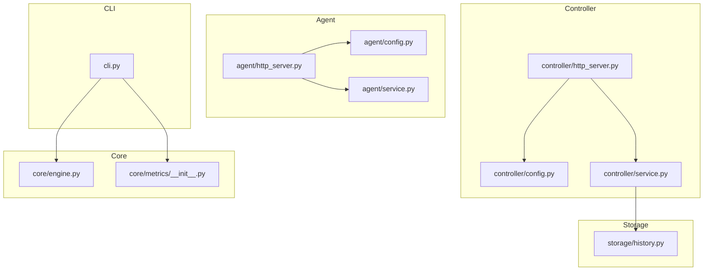
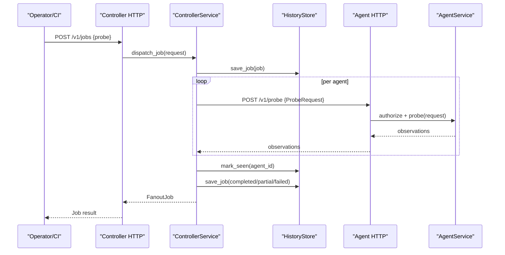
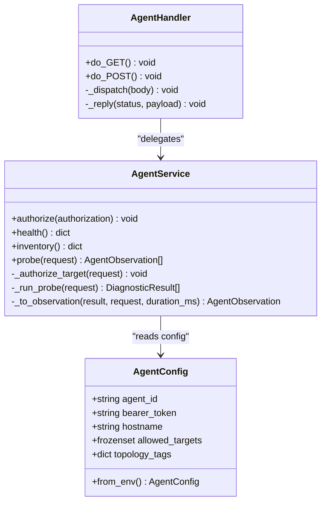
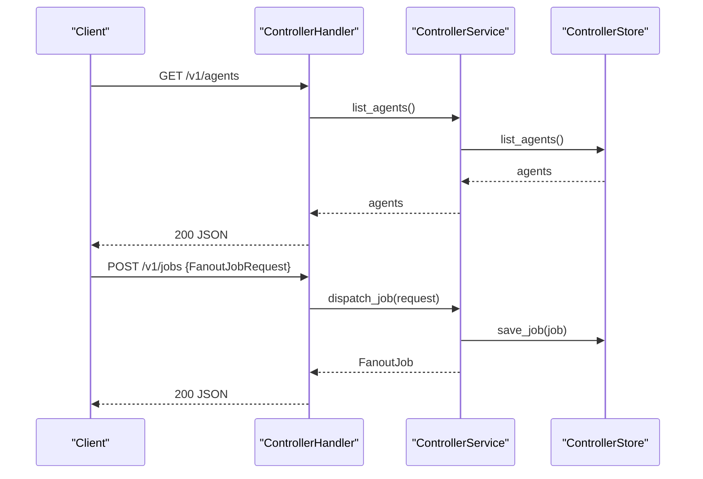
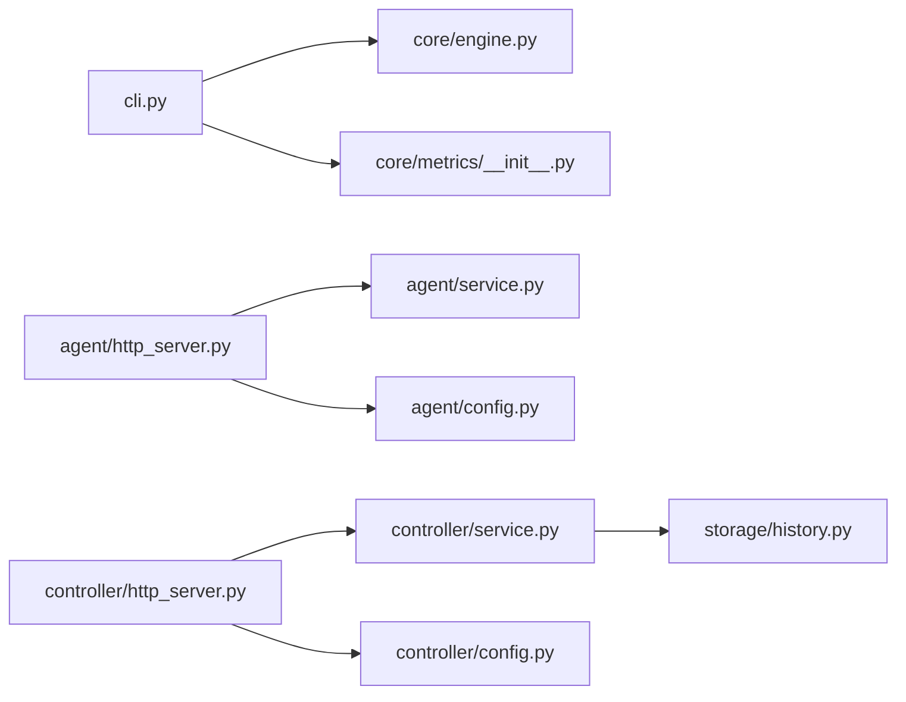

# Deployment and Operations

<cite>
**Referenced Files in This Document**
- [README.md](file://README.md)
- [IMPLEMENTATION_PLAN.md](file://IMPLEMENTATION_PLAN.md)
- [pyproject.toml](file://pyproject.toml)
- [requirements.txt](file://requirements.txt)
- [cli.py](file://cli.py)
- [agent/config.py](file://agent/config.py)
- [agent/service.py](file://agent/service.py)
- [agent/http_server.py](file://agent/http_server.py)
- [controller/config.py](file://controller/config.py)
- [controller/service.py](file://controller/service.py)
- [controller/http_server.py](file://controller/http_server.py)
- [storage/history.py](file://storage/history.py)
- [core/engine.py](file://core/engine.py)
- [core/metrics/__init__.py](file://core/metrics/__init__.py)
</cite>

## Table of Contents
1. Introduction
2. Project Structure
3. Core Components
4. Architecture Overview
5. Detailed Component Analysis
6. Dependency Analysis
7. Performance Considerations
8. Troubleshooting Guide
9. Conclusion
10. Appendices

## Introduction
This document provides deployment and operations guidance for NetForge, a network diagnostics framework that supports host, link, path, traffic, flow, and mesh diagnostics with a shared rule engine. It covers production deployment strategies (containerization, configuration management, environment setup), monitoring and alerting approaches, log analysis techniques, performance optimization guidelines, maintenance procedures, backup and recovery processes, upgrade strategies, disaster recovery planning, security considerations, access control, compliance requirements, operational runbooks, and troubleshooting procedures.

NetForge currently ships as a CLI tool and includes early M2 components: an authenticated agent HTTP service, a controller HTTP API, and SQLite-backed history storage. The project’s roadmap indicates future enhancements including scheduling, baselines, alerts, incidents, SNMPv3 counters, LLDP, and topology validation.

**Section sources**
- [README.md:1-22](file://README.md#L1-L22)
- [IMPLEMENTATION_PLAN.md:1-14](file://IMPLEMENTATION_PLAN.md#L1-L14)

## Project Structure
NetForge is organized into feature-oriented modules:
- cli: Command-line interface exposing host, link, path, traffic, flow, mesh, and diagnose commands
- agent: Remote agent service with HTTP transport and business logic
- controller: Centralized controller with HTTP API and job orchestration
- core: Shared diagnostic engine and metrics utilities
- diagnostics: Domain-specific probes (host, link, path, traffic, mesh, flow)
- ingest: Passive telemetry ingestion (sFlow, IPFIX, SNMP counters)
- storage: History and baselines backed by SQLite
- tests: Unit tests for services and components

**Diagram sources**
- [cli.py:18-38](file://cli.py#L18-L38)
- [agent/config.py:10-34](file://agent/config.py#L10-L34)
- [agent/service.py:33-110](file://agent/service.py#L33-L110)
- [agent/http_server.py:15-62](file://agent/http_server.py#L15-L62)
- [controller/config.py:9-21](file://controller/config.py#L9-L21)
- [controller/service.py:17-50](file://controller/service.py#L17-L50)
- [controller/http_server.py:16-72](file://controller/http_server.py#L16-L72)
- [storage/history.py:15-115](file://storage/history.py#L15-L115)
- [core/engine.py:10-83](file://core/engine.py#L10-L83)
- [core/metrics/__init__.py:1-29](file://core/metrics/__init__.py#L1-L29)

**Section sources**
- [pyproject.toml:5-35](file://pyproject.toml#L5-L35)
- [requirements.txt:1-15](file://requirements.txt#L1-L15)

## Core Components
- CLI entrypoint exposes commands for host, link, path, traffic, flow, mesh, and diagnose workflows. It orchestrates local probes and can invoke the rule engine for root-cause analysis.
- Agent service validates bearer tokens, enforces allowed targets, executes probes (ICMP, TCP, DNS, traceroute, interfaces, routing, gateway), and returns observations with context and evidence quality.
- Controller service registers agents, lists agents, dispatches fan-out jobs to multiple agents, tracks job status, and persists results.
- Storage provides SQLite-based snapshots for path fingerprints and rolling baselines used by diagnostics and comparisons.
- Core engine summarizes diagnostic results and generates findings; metrics module provides shared KPI math for bandwidth, congestion, latency/jitter, loss, and throughput.

Operational implications:
- Configuration is environment-driven via typed dataclasses with required tokens and optional paths.
- HTTP servers are minimal, stateless handlers delegating to services.
- Persistence is file-based (SQLite), suitable for single-node or containerized deployments with persistent volumes.

**Section sources**
- [cli.py:18-578](file://cli.py#L18-L578)
- [agent/config.py:10-34](file://agent/config.py#L10-L34)
- [agent/service.py:33-110](file://agent/service.py#L33-L110)
- [controller/config.py:9-21](file://controller/config.py#L9-L21)
- [controller/service.py:17-50](file://controller/service.py#L17-L50)
- [storage/history.py:15-115](file://storage/history.py#L15-L115)
- [core/engine.py:10-83](file://core/engine.py#L10-L83)
- [core/metrics/__init__.py:1-29](file://core/metrics/__init__.py#L1-L29)

## Architecture Overview
The runtime consists of three primary processes:
- CLI: Local diagnostics and orchestration
- Agent: Remote endpoint probe server
- Controller: Centralized job dispatcher and registry

**Diagram sources**
- [controller/http_server.py:30-55](file://controller/http_server.py#L30-L55)
- [controller/service.py:30-47](file://controller/service.py#L30-L47)
- [agent/http_server.py:29-45](file://agent/http_server.py#L29-L45)
- [agent/service.py:58-90](file://agent/service.py#L58-L90)
- [storage/history.py:45-58](file://storage/history.py#L45-L58)

## Detailed Component Analysis

### Agent Service and HTTP Transport
Responsibilities:
- Authorization via Bearer token comparison
- Target allow-list enforcement for targeted probes
- Probe execution across ICMP, TCP, DNS, traceroute, interfaces, routing, gateway
- Observation construction with context, duration, tags, raw evidence, and evidence quality

Deployment notes:
- Exposes endpoints on configurable host/port
- Requires environment variables for identity and token
- Stateless handler; scale horizontally behind a load balancer if needed

**Diagram sources**
- [agent/config.py:10-34](file://agent/config.py#L10-L34)
- [agent/service.py:33-110](file://agent/service.py#L33-L110)
- [agent/http_server.py:15-62](file://agent/http_server.py#L15-L62)

**Section sources**
- [agent/config.py:10-34](file://agent/config.py#L10-L34)
- [agent/service.py:33-110](file://agent/service.py#L33-L110)
- [agent/http_server.py:15-62](file://agent/http_server.py#L15-L62)

### Controller Service and HTTP API
Responsibilities:
- Register and list agents
- Dispatch fan-out jobs to selected agents
- Persist job lifecycle and outcomes
- Provide health and status endpoints

Security:
- All requests require a Bearer token validated at the handler layer

Operational notes:
- Uses SQLite for agent registry and job persistence
- Can be deployed as a single process or scaled with external job queues in future versions

**Diagram sources**
- [controller/http_server.py:30-55](file://controller/http_server.py#L30-L55)
- [controller/service.py:22-47](file://controller/service.py#L22-L47)

**Section sources**
- [controller/config.py:9-21](file://controller/config.py#L9-L21)
- [controller/service.py:17-50](file://controller/service.py#L17-L50)
- [controller/http_server.py:16-72](file://controller/http_server.py#L16-L72)

### CLI Diagnostics Orchestration
Responsibilities:
- Expose commands for host, link, path, traffic, flow, mesh, diagnose
- Run suites of probes and optionally invoke the rule engine for root-cause analysis
- Exit codes reflect strict mode and failures for automation

Operational usage:
- Suitable for interactive troubleshooting and CI pipelines
- Supports JSON output for machine consumption

**Section sources**
- [cli.py:18-578](file://cli.py#L18-L578)

### Storage and Baselines
Responsibilities:
- Persist snapshots with domain/key/fingerprint/payload/timestamp
- Provide latest and previous snapshot retrieval
- Compute rolling baseline averages for numeric metrics

Operational notes:
- Database path configurable via environment variable
- Use persistent volumes in containers to retain history across restarts

**Section sources**
- [storage/history.py:15-115](file://storage/history.py#L15-L115)

## Dependency Analysis
Key runtime dependencies:
- Python standard library (http.server, sqlite3, json, os, time)
- Third-party packages declared in pyproject.toml and requirements.txt (Typer, Rich, Pydantic, psutil)

Module coupling:
- CLI depends on core engine and metrics
- Agent HTTP depends on AgentService and AgentConfig
- Controller HTTP depends on ControllerService and ControllerConfig
- ControllerService depends on store and dispatcher (not shown here)
- Storage is independent and used by controller and diagnostics

**Diagram sources**
- [cli.py:18-38](file://cli.py#L18-L38)
- [core/engine.py:10-83](file://core/engine.py#L10-L83)
- [core/metrics/__init__.py:1-29](file://core/metrics/__init__.py#L1-L29)
- [agent/http_server.py:15-62](file://agent/http_server.py#L15-L62)
- [agent/service.py:33-110](file://agent/service.py#L33-L110)
- [agent/config.py:10-34](file://agent/config.py#L10-L34)
- [controller/http_server.py:16-72](file://controller/http_server.py#L16-L72)
- [controller/service.py:17-50](file://controller/service.py#L17-L50)
- [controller/config.py:9-21](file://controller/config.py#L9-L21)
- [storage/history.py:15-115](file://storage/history.py#L15-L115)

**Section sources**
- [pyproject.toml:5-35](file://pyproject.toml#L5-L35)
- [requirements.txt:1-15](file://requirements.txt#L1-L15)

## Performance Considerations
- Keep agent and controller processes lightweight; they are synchronous HTTP handlers using threading from the standard library. For high concurrency, consider placing them behind a reverse proxy with connection pooling and rate limiting.
- Limit probe counts and intervals to avoid overloading target systems. Use CLI options like count and interval where available.
- Use SQLite carefully: ensure WAL mode and appropriate timeouts if you plan to increase write volume. Back up the database regularly.
- Reuse connections and batch probes when possible in custom integrations.
- Offload heavy computations (e.g., large flow analysis) to separate workers if scaling beyond single-process limits.

[No sources needed since this section provides general guidance]

## Troubleshooting Guide
Common issues and resolutions:
- Unauthorized requests to agent or controller: Ensure Authorization header contains the correct Bearer token configured via environment variables.
- Target not allowed on agent: Configure NETFORGE_ALLOWED_TARGETS to include permitted destinations.
- Missing required environment variables: Both agent and controller require specific tokens; validate presence before starting services.
- SQLite errors: Verify file permissions and disk space for the configured database path.
- CLI exit codes: In strict mode, non-zero exit codes indicate degraded or failed diagnostics; use these in automation to fail fast.

Operational checks:
- Health endpoints:
  - Agent: GET /v1/health
  - Controller: GET /v1/health
- Inventory and capabilities:
  - Agent: GET /v1/inventory
- Agent registration and jobs:
  - Controller: POST /v1/agents, POST /v1/jobs, GET /v1/jobs/{id}

Log analysis:
- HTTP handlers suppress default logging; implement structured logging around handlers and services to capture requests, responses, and errors for observability.

**Section sources**
- [agent/http_server.py:29-55](file://agent/http_server.py#L29-L55)
- [controller/http_server.py:30-55](file://controller/http_server.py#L30-L55)
- [agent/config.py:18-34](file://agent/config.py#L18-L34)
- [controller/config.py:15-21](file://controller/config.py#L15-L21)
- [cli.py:112-196](file://cli.py#L112-L196)

## Conclusion
NetForge provides a modular, environment-configured diagnostics platform with a CLI, remote agent, and controller. Production deployments should focus on secure configuration via environment variables, persistent storage for history, and robust logging and monitoring. Follow the runbooks and troubleshooting steps to maintain reliability, and align upgrades with the project’s phased roadmap.

[No sources needed since this section summarizes without analyzing specific files]

## Appendices

### Production Deployment Strategies

#### Containerization
- Build images using the provided packaging metadata. The application requires Python >= 3.10 and installs dependencies listed in pyproject.toml and requirements.txt.
- Expose ports:
  - Agent: default 8081
  - Controller: default 8080
- Mount persistent volumes for:
  - Controller database path (default .netforge_controller.db)
  - History database path (default .netforge_history.db)
- Set environment variables for secrets and configuration as described below.

**Section sources**
- [pyproject.toml:5-35](file://pyproject.toml#L5-L35)
- [requirements.txt:1-15](file://requirements.txt#L1-L15)
- [agent/http_server.py:61-62](file://agent/http_server.py#L61-L62)
- [controller/http_server.py:71-72](file://controller/http_server.py#L71-L72)
- [controller/config.py:15-21](file://controller/config.py#L15-L21)
- [storage/history.py:12-17](file://storage/history.py#L12-L17)

#### Configuration Management and Environment Setup
Required environment variables:
- Agent:
  - NETFORGE_AGENT_ID: unique identifier for the agent
  - NETFORGE_AGENT_TOKEN: bearer token for authorization
  - NETFORGE_ALLOWED_TARGETS: comma-separated list of allowed targets
  - NETFORGE_TAG_*: arbitrary topology tags prefixed with NETFORGE_TAG_
- Controller:
  - NETFORGE_CONTROLLER_TOKEN: bearer token for controller API
  - NETFORGE_AGENT_TOKEN: shared token used to authenticate agent calls
  - NETFORGE_CONTROLLER_DB: path to controller SQLite database
- Storage:
  - NETFORGE_HISTORY_DB: path to history SQLite database

Validation:
- AgentConfig.from_env raises an error if required fields are missing
- ControllerConfig.from_env raises an error if required tokens are missing

**Section sources**
- [agent/config.py:18-34](file://agent/config.py#L18-L34)
- [controller/config.py:15-21](file://controller/config.py#L15-L21)
- [storage/history.py:12-17](file://storage/history.py#L12-L17)

#### Monitoring and Alerting
- Health checks:
  - Agent: GET /v1/health
  - Controller: GET /v1/health
- Probes and jobs:
  - Monitor job creation and completion via Controller API
- Metrics:
  - Use core metrics utilities for bandwidth, congestion, jitter, loss, and throughput calculations in custom dashboards
- Logging:
  - Implement structured logs around HTTP handlers and service methods to capture request/response details and errors

**Section sources**
- [agent/http_server.py:32-45](file://agent/http_server.py#L32-L45)
- [controller/http_server.py:36-55](file://controller/http_server.py#L36-L55)
- [core/metrics/__init__.py:1-29](file://core/metrics/__init__.py#L1-L29)

#### Log Analysis Techniques
- Capture HTTP request method, path, status code, and payload size
- Record authorization failures and validation errors
- Track probe durations and observation counts per job
- Correlate job IDs across controller and agent logs

[No sources needed since this section provides general guidance]

#### Maintenance Procedures
- Rotate and back up SQLite databases regularly
- Validate integrity of stored snapshots and baselines
- Periodically review allowed targets and topology tags
- Update dependencies and apply security patches

**Section sources**
- [storage/history.py:45-115](file://storage/history.py#L45-L115)

#### Backup and Recovery Processes
- Backup controller and history databases to a secure location
- Restore by copying database files to the configured paths and restarting services
- Validate health endpoints after restore

**Section sources**
- [controller/config.py:15-21](file://controller/config.py#L15-L21)
- [storage/history.py:12-17](file://storage/history.py#L12-L17)

#### Upgrade Strategies
- Perform rolling upgrades for agent and controller processes
- Test new versions against a staging environment
- Validate environment variables and database schema compatibility
- Use CLI strict mode in CI to detect regressions quickly

**Section sources**
- [cli.py:112-196](file://cli.py#L112-L196)

#### Disaster Recovery Planning
- Maintain offsite backups of databases
- Define RTO/RPO targets and test recovery procedures
- Document emergency steps to rebuild agents and re-register with controller
- Ensure network policies allow controller-to-agent communication

[No sources needed since this section provides general guidance]

#### Security Considerations, Access Control, and Compliance
- Enforce Bearer tokens for both agent and controller APIs
- Restrict agent targets via allowed targets configuration
- Store tokens securely (secrets managers, environment isolation)
- Apply least privilege principles for filesystem access to databases
- Audit access and probe activity via structured logging

**Section sources**
- [agent/service.py:37-40](file://agent/service.py#L37-L40)
- [agent/service.py:65-71](file://agent/service.py#L65-L71)
- [controller/http_server.py:31-34](file://controller/http_server.py#L31-L34)

#### Operational Runbooks

##### Runbook: Start Services
- Set environment variables for agent and controller
- Start agent HTTP server on configured host/port
- Start controller HTTP server on configured host/port
- Verify health endpoints return healthy status

**Section sources**
- [agent/http_server.py:61-62](file://agent/http_server.py#L61-L62)
- [controller/http_server.py:71-72](file://controller/http_server.py#L71-L72)

##### Runbook: Register an Agent
- POST to /v1/agents with agent registration payload
- Confirm agent appears in /v1/agents listing

**Section sources**
- [controller/http_server.py:40-42](file://controller/http_server.py#L40-L42)
- [controller/service.py:22-25](file://controller/service.py#L22-L25)

##### Runbook: Execute a Fan-Out Diagnostic Job
- POST to /v1/jobs with probe specification and agent IDs
- Poll /v1/jobs/{id} until completed
- Review observations and errors

**Section sources**
- [controller/http_server.py:43-51](file://controller/http_server.py#L43-L51)
- [controller/service.py:30-47](file://controller/service.py#L30-L47)

##### Runbook: Run Local Host Diagnostics
- Use CLI command to execute full host suite
- Optionally enable diagnosis mode for root-cause analysis
- Use strict mode to enforce non-zero exit on failures

**Section sources**
- [cli.py:112-196](file://cli.py#L112-L196)

##### Runbook: Investigate Path Changes
- Use path diff command to compare current trace with baseline
- Review evidence and summary for changes

**Section sources**
- [cli.py:306-318](file://cli.py#L306-L318)

##### Runbook: Analyze Flow Records
- Use flow analyze command with JSON or JSONL export path
- Output JSON for automated processing

**Section sources**
- [cli.py:406-422](file://cli.py#L406-L422)

#### Troubleshooting Procedures

##### Unauthorized Requests
- Check Authorization header format and token values
- Validate environment variables for tokens

**Section sources**
- [agent/http_server.py:42-45](file://agent/http_server.py#L42-L45)
- [controller/http_server.py:31-34](file://controller/http_server.py#L31-L34)

##### Target Not Allowed
- Update NETFORGE_ALLOWED_TARGETS to include the requested target
- Restart agent if necessary

**Section sources**
- [agent/service.py:65-71](file://agent/service.py#L65-L71)

##### Missing Environment Variables
- Ensure all required variables are set before starting services
- Inspect startup errors indicating missing fields

**Section sources**
- [agent/config.py:18-23](file://agent/config.py#L18-L23)
- [controller/config.py:15-21](file://controller/config.py#L15-L21)

##### Database Issues
- Verify file permissions and disk space
- Check SQLite errors in logs and adjust configuration

**Section sources**
- [storage/history.py:20-23](file://storage/history.py#L20-L23)