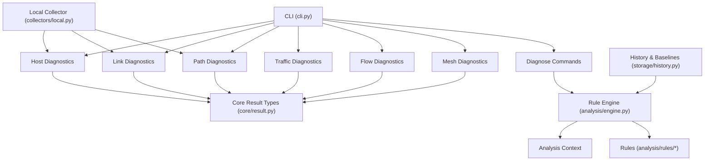
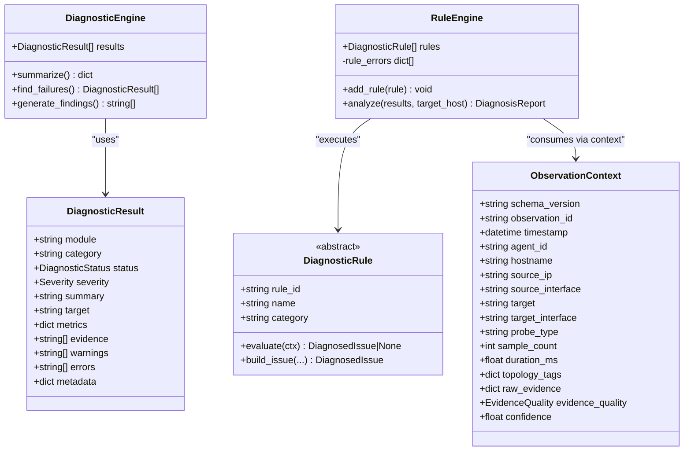
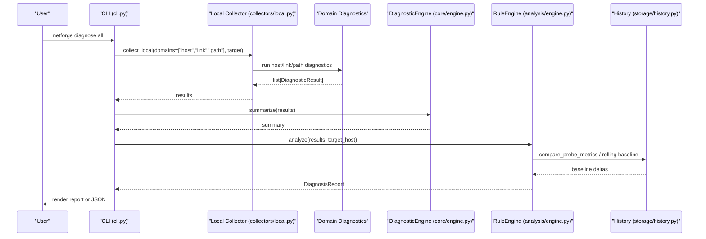
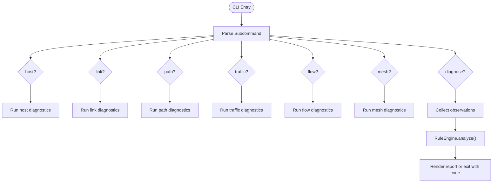
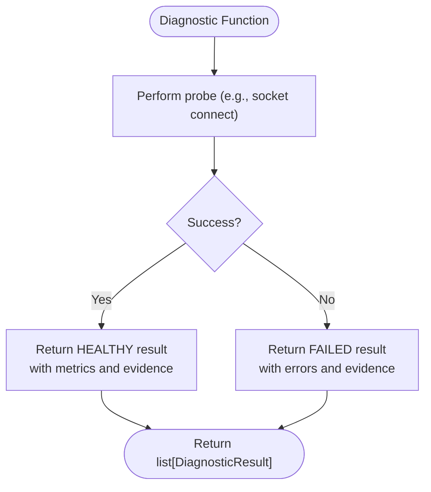
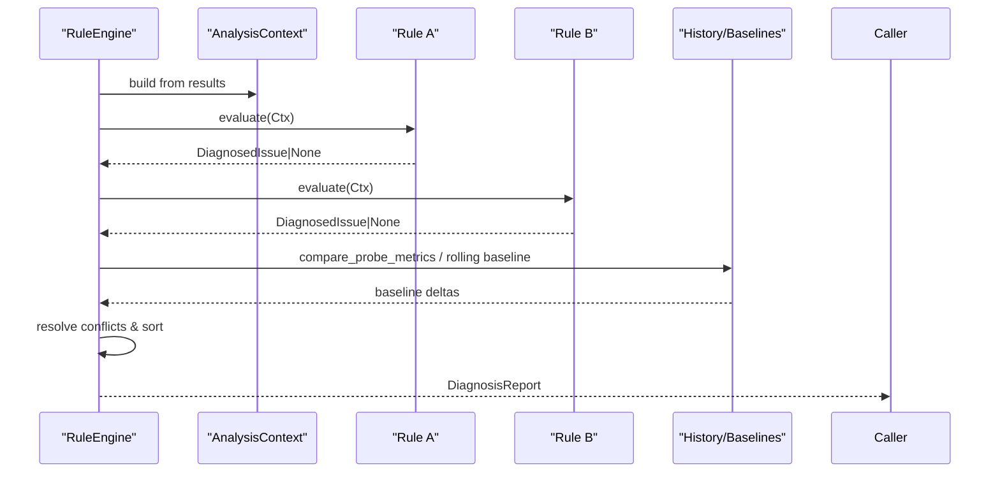
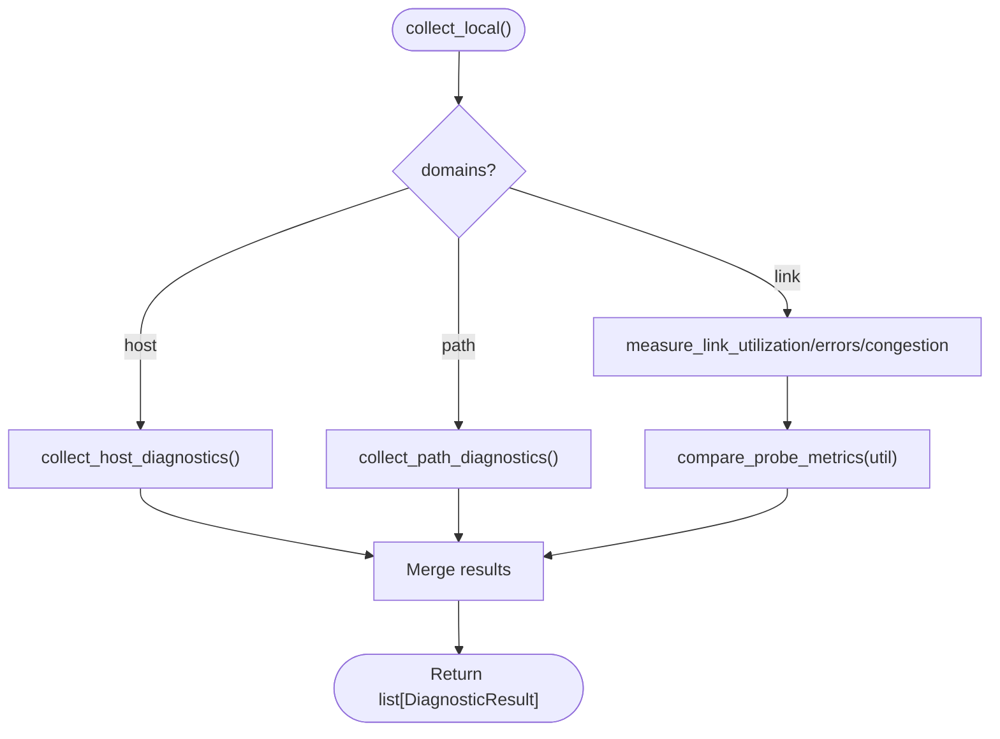
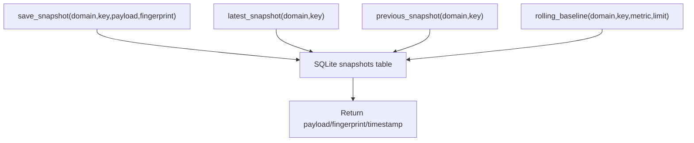
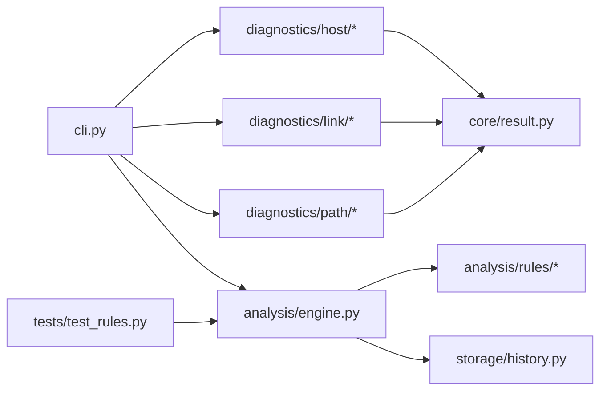

# Development and Contributing

<cite>
**Referenced Files in This Document**
- [README.md](file://README.md)
- [pyproject.toml](file://pyproject.toml)
- [requirements.txt](file://requirements.txt)
- [IMPLEMENTATION_PLAN.md](file://IMPLEMENTATION_PLAN.md)
- [cli.py](file://cli.py)
- [core/engine.py](file://core/engine.py)
- [core/result.py](file://core/result.py)
- [core/observation.py](file://core/observation.py)
- [analysis/engine.py](file://analysis/engine.py)
- [analysis/rule.py](file://analysis/rule.py)
- [analysis/rules/baseline_rules.py](file://analysis/rules/baseline_rules.py)
- [collectors/local.py](file://collectors/local.py)
- [diagnostics/host/connectivity.py](file://diagnostics/host/connectivity.py)
- [storage/history.py](file://storage/history.py)
- [tests/test_rules.py](file://tests/test_rules.py)
</cite>

## Table of Contents
1. Introduction
2. Project Structure
3. Core Components
4. Architecture Overview
5. Detailed Component Analysis
6. Dependency Analysis
7. Performance Considerations
8. Troubleshooting Guide
9. Conclusion
10. Appendices

## Introduction
NetForge is a network diagnostics framework that provides host, link, path, traffic, flow, and mesh diagnostics with a shared rule engine for root-cause analysis. It exposes a CLI to run diagnostics locally and is designed to evolve into a multi-agent platform with controller-managed agents, fan-out jobs, baselines, alerts, and incidents.

Key goals for contributors:
- Extend diagnostics by adding new probes or modules that return standardized results.
- Add rules to the rule engine to detect issues and synthesize root causes.
- Follow coding standards and testing practices to keep the system reliable and maintainable.
- Use profiling and debugging techniques to optimize performance and diagnose problems.

**Section sources**
- [README.md:1-22](file://README.md#L1-L22)
- [IMPLEMENTATION_PLAN.md:1-14](file://IMPLEMENTATION_PLAN.md#L1-L14)

## Project Structure
NetForge organizes code by functional domains:
- cli: Command-line interface entry points for host, link, path, traffic, flow, mesh, and diagnose commands.
- core: Shared types (DiagnosticResult, DiagnosticStatus, Severity), observation contract, and a simple diagnostic summarization engine.
- diagnostics: Domain-specific diagnostic modules (host, link, path, traffic, flow, mesh).
- collectors: Orchestration for local and remote data collection.
- analysis: Rule engine, context, models, and modular rules for diagnosis.
- storage: SQLite-backed history and baselines for trend detection and path fingerprinting.
- tests: Unit tests for rules, services, and contracts.

**Diagram sources**
- [cli.py:18-38](file://cli.py#L18-L38)
- [collectors/local.py:16-39](file://collectors/local.py#L16-L39)
- [core/result.py:9-47](file://core/result.py#L9-L47)
- [analysis/engine.py:15-130](file://analysis/engine.py#L15-L130)
- [storage/history.py:15-115](file://storage/history.py#L15-L115)

**Section sources**
- [pyproject.toml:1-40](file://pyproject.toml#L1-L40)
- [cli.py:18-38](file://cli.py#L18-L38)

## Core Components
- DiagnosticResult and status/severity enums define the standard output contract for all diagnostics.
- DiagnosticEngine summarizes results and generates findings from failures or degraded states.
- ObservationContext defines the versioned contract for agent-controller observations, including evidence quality and confidence derivation.
- RuleEngine executes modular rules against observations, resolves conflicts/subsumption, sorts by severity/confidence, and synthesizes a report with verdicts and key observations.
- DiagnosticRule abstracts rule implementation; concrete rules live under analysis/rules and can be extended.

**Diagram sources**
- [core/result.py:9-47](file://core/result.py#L9-L47)
- [core/engine.py:10-83](file://core/engine.py#L10-L83)
- [core/observation.py:13-63](file://core/observation.py#L13-L63)
- [analysis/engine.py:15-130](file://analysis/engine.py#L15-L130)
- [analysis/rule.py:9-51](file://analysis/rule.py#L9-L51)

**Section sources**
- [core/result.py:9-47](file://core/result.py#L9-L47)
- [core/engine.py:10-83](file://core/engine.py#L10-L83)
- [core/observation.py:13-63](file://core/observation.py#L13-L63)
- [analysis/engine.py:15-130](file://analysis/engine.py#L15-L130)
- [analysis/rule.py:9-51](file://analysis/rule.py#L9-L51)

## Architecture Overview
The CLI orchestrates domain-specific diagnostics and optional diagnosis via the rule engine. Local collectors gather host, link, and path observations, which are fed into the rule engine to produce a diagnosis report. History and baselines support trend detection and path change detection.

**Diagram sources**
- [cli.py:470-573](file://cli.py#L470-L573)
- [collectors/local.py:16-39](file://collectors/local.py#L16-L39)
- [core/engine.py:10-83](file://core/engine.py#L10-L83)
- [analysis/engine.py:29-130](file://analysis/engine.py#L29-L130)
- [storage/history.py:92-115](file://storage/history.py#L92-L115)

## Detailed Component Analysis

### CLI and Command Routing
- The CLI defines subcommands for host, link, path, traffic, flow, mesh, and diagnose.
- Each command invokes corresponding diagnostic functions and optionally integrates with the rule engine for root-cause analysis.
- Exit codes reflect strict mode and failure conditions.

**Diagram sources**
- [cli.py:18-38](file://cli.py#L18-L38)
- [cli.py:46-196](file://cli.py#L46-L196)
- [cli.py:203-333](file://cli.py#L203-L333)
- [cli.py:340-388](file://cli.py#L340-L388)
- [cli.py:396-455](file://cli.py#L396-L455)
- [cli.py:470-573](file://cli.py#L470-L573)

**Section sources**
- [cli.py:18-38](file://cli.py#L18-L38)
- [cli.py:46-196](file://cli.py#L46-L196)
- [cli.py:203-333](file://cli.py#L203-L333)
- [cli.py:340-388](file://cli.py#L340-L388)
- [cli.py:396-455](file://cli.py#L396-L455)
- [cli.py:470-573](file://cli.py#L470-L573)

### Diagnostic Modules and Extension Points
- Diagnostics return DiagnosticResult objects with status, severity, metrics, evidence, warnings, and errors.
- Example: connectivity checks perform TCP connections and return structured results with latency metrics and error details.
- To add a new diagnostic:
  - Implement a function that returns one or more DiagnosticResult instances.
  - Expose it via a CLI command or integrate into collectors.
  - Ensure metrics and evidence fields capture actionable information for rules.

**Diagram sources**
- [diagnostics/host/connectivity.py:16-66](file://diagnostics/host/connectivity.py#L16-L66)
- [core/result.py:24-47](file://core/result.py#L24-L47)

**Section sources**
- [diagnostics/host/connectivity.py:16-111](file://diagnostics/host/connectivity.py#L16-L111)
- [core/result.py:24-47](file://core/result.py#L24-L47)

### Rule Engine and Custom Rules
- RuleEngine executes registered rules against an AnalysisContext built from results.
- Rules implement DiagnosticRule and return DiagnosedIssue when a pattern matches.
- Conflict resolution suppresses child rules; issues are sorted by severity and confidence.
- A baseline rule demonstrates detecting sudden degradation using baseline deltas.

**Diagram sources**
- [analysis/engine.py:29-130](file://analysis/engine.py#L29-L130)
- [analysis/rule.py:9-51](file://analysis/rule.py#L9-L51)
- [analysis/rules/baseline_rules.py:9-49](file://analysis/rules/baseline_rules.py#L9-L49)
- [storage/history.py:92-115](file://storage/history.py#L92-L115)

**Section sources**
- [analysis/engine.py:15-130](file://analysis/engine.py#L15-L130)
- [analysis/rule.py:9-51](file://analysis/rule.py#L9-L51)
- [analysis/rules/baseline_rules.py:9-49](file://analysis/rules/baseline_rules.py#L9-L49)

### Local Collector Orchestration
- The local collector runs host, link, and path diagnostics and aggregates results.
- It also integrates baseline comparisons for link metrics.

**Diagram sources**
- [collectors/local.py:16-39](file://collectors/local.py#L16-L39)

**Section sources**
- [collectors/local.py:1-40](file://collectors/local.py#L1-L40)

### Storage and Baselines
- HistoryStore persists snapshots and supports latest/previous snapshot retrieval and rolling baseline computation.
- Used by rules and collectors to detect deviations and path changes.

**Diagram sources**
- [storage/history.py:15-115](file://storage/history.py#L15-L115)

**Section sources**
- [storage/history.py:1-115](file://storage/history.py#L1-L115)

## Dependency Analysis
- CLI depends on diagnostic modules and the rule engine for diagnosis.
- Diagnostics depend on core result types and OS/network primitives.
- RuleEngine depends on rules and may use storage for baselines.
- Tests validate rule behavior and engine resilience.

**Diagram sources**
- [cli.py:18-38](file://cli.py#L18-L38)
- [analysis/engine.py:15-130](file://analysis/engine.py#L15-L130)
- [core/result.py:9-47](file://core/result.py#L9-L47)
- [storage/history.py:15-115](file://storage/history.py#L15-L115)
- [tests/test_rules.py:1-71](file://tests/test_rules.py#L1-L71)

**Section sources**
- [cli.py:18-38](file://cli.py#L18-L38)
- [analysis/engine.py:15-130](file://analysis/engine.py#L15-L130)
- [core/result.py:9-47](file://core/result.py#L9-L47)
- [storage/history.py:15-115](file://storage/history.py#L15-L115)
- [tests/test_rules.py:1-71](file://tests/test_rules.py#L1-L71)

## Performance Considerations
- Prefer asynchronous or parallel execution for independent probes (e.g., multiple connectivity checks) to reduce total runtime.
- Cache expensive operations like traceroute results and reuse them across commands where appropriate.
- Use sampling intervals judiciously for link utilization and congestion measurements to balance accuracy and overhead.
- Profile hot paths using Python profilers (cProfile, pyinstrument) to identify bottlenecks in rule evaluation and I/O-bound operations.
- Limit baseline window sizes in rolling baseline calculations to control memory and query time.

[No sources needed since this section provides general guidance]

## Troubleshooting Guide
- Rule failures are isolated: if a rule raises an exception, the engine records the error and continues processing other rules.
- Inspect rule_errors in the diagnosis report metadata to identify problematic rules.
- For CLI strict mode, exit codes indicate failures or degraded states; use these in automation pipelines.
- Validate DiagnosticResult fields (status, severity, metrics, evidence) to ensure downstream consumers can interpret outputs correctly.
- Use logging within custom rules and diagnostics to trace execution paths and failures.

**Section sources**
- [analysis/engine.py:39-49](file://analysis/engine.py#L39-L49)
- [cli.py:180-196](file://cli.py#L180-L196)
- [tests/test_rules.py:57-71](file://tests/test_rules.py#L57-L71)

## Conclusion
NetForge provides a robust foundation for network diagnostics with a clear extension model for new probes and rules. By adhering to the standardized result contract, leveraging the rule engine, and integrating with history and baselines, contributors can add powerful diagnostic capabilities while maintaining consistency and reliability.

[No sources needed since this section summarizes without analyzing specific files]

## Appendices

### Development Environment Setup
- Install dependencies and development extras:
  - Use pip to install the package in editable mode with dev dependencies.
- Verify installation by running CLI help or example commands.

**Section sources**
- [README.md:5-19](file://README.md#L5-L19)
- [pyproject.toml:18-22](file://pyproject.toml#L18-L22)

### Coding Standards
- Use Pydantic models for structured data (results, contexts).
- Keep diagnostic functions focused and return DiagnosticResult lists.
- Document parameters and expected outputs in docstrings.
- Avoid side effects in pure functions; isolate I/O and network calls.

**Section sources**
- [core/result.py:24-47](file://core/result.py#L24-L47)
- [core/observation.py:32-63](file://core/observation.py#L32-L63)

### Testing Procedures
- Run tests using pytest configured in project settings.
- Add tests for new rules and diagnostics to ensure correctness and resilience.
- Mock external I/O where necessary to keep tests deterministic.

**Section sources**
- [pyproject.toml:37-39](file://pyproject.toml#L37-L39)
- [tests/test_rules.py:1-71](file://tests/test_rules.py#L1-L71)

### Contribution Guidelines
- Fork the repository and create feature branches for changes.
- Write tests for new functionality and ensure existing tests pass.
- Submit pull requests with clear descriptions and references to related issues.
- Follow issue reporting templates and provide reproducible steps.

[No sources needed since this section provides general guidance]

### Extending the Framework
- New Diagnostics:
  - Implement a function returning DiagnosticResult(s).
  - Integrate via CLI or collectors.
  - Provide meaningful metrics and evidence for rule correlation.
- New Rules:
  - Subclass DiagnosticRule and implement evaluate().
  - Use AnalysisContext to inspect observations and build DiagnosedIssue.
  - Register rules in the engine or default rules set.
- Integrations:
  - Use ObservationContext for agent-controller exchanges.
  - Persist snapshots and compute baselines for trend detection.

**Section sources**
- [analysis/rule.py:9-51](file://analysis/rule.py#L9-L51)
- [analysis/engine.py:22-28](file://analysis/engine.py#L22-L28)
- [core/observation.py:32-63](file://core/observation.py#L32-L63)
- [storage/history.py:45-115](file://storage/history.py#L45-L115)