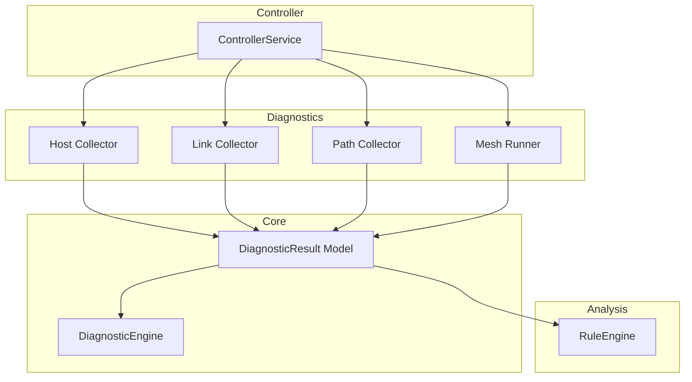
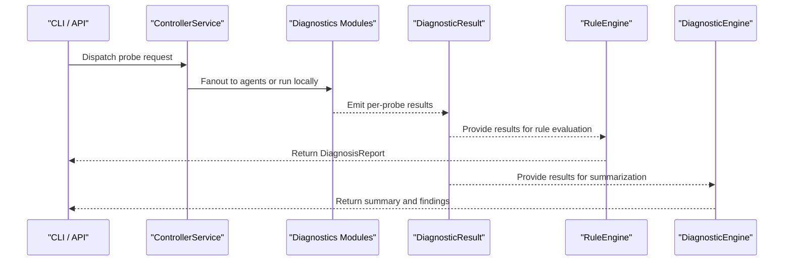
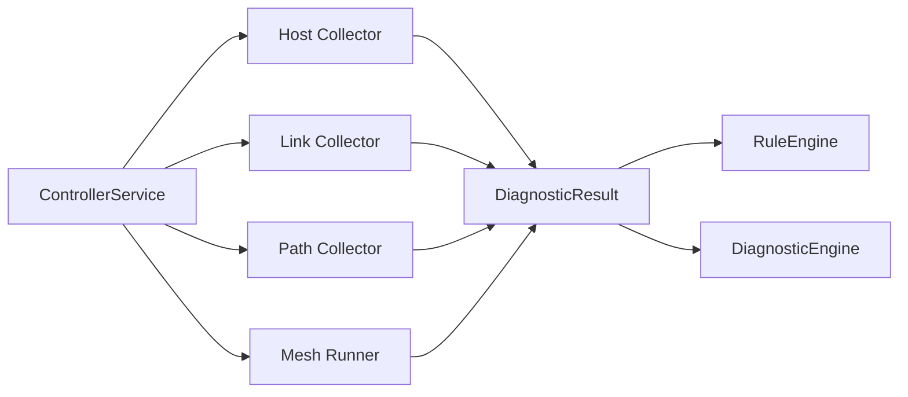

# Diagnostic Modules

<cite>
**Referenced Files in This Document**
- [README.md](file://README.md)
- [core/result.py](file://core/result.py)
- [core/engine.py](file://core/engine.py)
- [analysis/engine.py](file://analysis/engine.py)
- [diagnostics/host/collector.py](file://diagnostics/host/collector.py)
- [diagnostics/link/collector.py](file://diagnostics/link/collector.py)
- [diagnostics/path/collector.py](file://diagnostics/path/collector.py)
- [diagnostics/mesh/runner.py](file://diagnostics/mesh/runner.py)
- [controller/service.py](file://controller/service.py)
</cite>

## Table of Contents
1. [Introduction](#introduction)
2. [Project Structure](#project-structure)
3. [Core Components](#core-components)
4. [Architecture Overview](#architecture-overview)
5. [Detailed Component Analysis](#detailed-component-analysis)
6. [Dependency Analysis](#dependency-analysis)
7. [Performance Considerations](#performance-considerations)
8. [Troubleshooting Guide](#troubleshooting-guide)
9. [Conclusion](#conclusion)
10. [Appendices](#appendices)

## Introduction
NetForge provides a modular diagnostic framework that measures network health across multiple layers: host, link, path, traffic, flow, and mesh. Each diagnostic module operates independently but contributes standardized results to a unified pipeline. Results are analyzed by a rule engine that correlates evidence across layers, resolves conflicts, and synthesizes root-cause verdicts. The system supports both local execution and distributed measurement via agents, with consistent result formatting for downstream analysis and reporting.

## Project Structure
The repository organizes diagnostics into feature modules under the diagnostics package, each producing standardized DiagnosticResult objects consumed by a shared analysis pipeline. Core abstractions (status, severity, result model) live in core/, while orchestration and rule evaluation reside in analysis/. Controller and agent services enable remote dispatching and job tracking.



**Diagram sources**
- [diagnostics/host/collector.py:16-60](file://diagnostics/host/collector.py#L16-L60)
- [diagnostics/link/collector.py:29-210](file://diagnostics/link/collector.py#L29-L210)
- [diagnostics/path/collector.py:11-23](file://diagnostics/path/collector.py#L11-L23)
- [diagnostics/mesh/runner.py:26-114](file://diagnostics/mesh/runner.py#L26-L114)
- [core/result.py:24-47](file://core/result.py#L24-L47)
- [core/engine.py:10-83](file://core/engine.py#L10-L83)
- [analysis/engine.py:15-130](file://analysis/engine.py#L15-L130)
- [controller/service.py:17-51](file://controller/service.py#L17-L51)

**Section sources**
- [README.md:1-22](file://README.md#L1-L22)

## Core Components
- Standardized result model: Every diagnostic module returns DiagnosticResult objects containing status, severity, summary, target, metrics, evidence, warnings, errors, and metadata. This uniform contract enables cross-layer correlation and consistent aggregation.
- Diagnostic engine: Aggregates results to compute summaries, identify failures, and generate human-readable findings.
- Rule engine: Evaluates registered rules against an analysis context built from results, resolves conflicts/subsumption, sorts issues by severity and confidence, and produces a DiagnosisReport with overall status and synthesized verdict.

Key responsibilities:
- Diagnostics modules: collect measurements and produce DiagnosticResult instances.
- Core engine: summarize and extract actionable findings from results.
- Analysis engine: apply rules, correlate multi-layer evidence, and synthesize root causes.

**Section sources**
- [core/result.py:24-47](file://core/result.py#L24-L47)
- [core/engine.py:10-83](file://core/engine.py#L10-L83)
- [analysis/engine.py:15-130](file://analysis/engine.py#L15-L130)

## Architecture Overview
The diagnostic pipeline is layered and composable:
- Data collection: Host, link, path, traffic, flow, and mesh modules gather measurements and emit DiagnosticResult objects.
- Orchestration: Optional controller service can fan out jobs to agents and track observations/errors.
- Analysis: RuleEngine evaluates rules against an AnalysisContext derived from results, producing a DiagnosisReport with consolidated insights.
- Summarization: DiagnosticEngine summarizes statuses and severities and generates findings.



**Diagram sources**
- [controller/service.py:30-47](file://controller/service.py#L30-L47)
- [diagnostics/host/collector.py:16-60](file://diagnostics/host/collector.py#L16-L60)
- [diagnostics/link/collector.py:182-210](file://diagnostics/link/collector.py#L182-L210)
- [diagnostics/path/collector.py:11-23](file://diagnostics/path/collector.py#L11-L23)
- [diagnostics/mesh/runner.py:26-114](file://diagnostics/mesh/runner.py#L26-L114)
- [analysis/engine.py:29-111](file://analysis/engine.py#L29-L111)
- [core/engine.py:18-83](file://core/engine.py#L18-L83)

## Detailed Component Analysis

### Host Diagnostics
Responsibilities:
- Connectivity checks to multiple targets.
- Interface inspection and routing table validation.
- Gateway reachability testing.
- DNS resolution and server discovery.
- TCP/UDP port reachability tests.
- ICMP ping and latency measurement.
- Resource and activity inspection.
- Optional baseline comparison for metric normalization.

Data collection methods:
- Network stack queries and OS-level counters.
- Outbound probes (ICMP, TCP, UDP).
- Local resource sampling over a short interval.

Metric calculations:
- Packet loss percentage and latency statistics.
- Baseline comparisons when enabled.

Result formatting:
- Each probe emits a DiagnosticResult with category "host", module identifiers, and rich metrics/evidence.

Configuration options:
- Target host for DNS/connectivity.
- Connectivity hosts list.
- Ping count for latency/packet loss.
- Whether to include baseline comparisons.

Extensibility:
- Add new host probes by returning DiagnosticResult instances; they will be automatically included in the host collector’s output.

Aggregation:
- Results feed into the rule engine and diagnostic engine for summarization and finding generation.

**Section sources**
- [diagnostics/host/collector.py:16-60](file://diagnostics/host/collector.py#L16-L60)
- [core/result.py:24-47](file://core/result.py#L24-L47)

### Link Diagnostics
Responsibilities:
- Measure interface utilization using byte counters over an interval.
- Detect link-layer errors and drops per second.
- Compute congestion score and state based on utilization, error rates, and latency delta.

Data collection methods:
- OS network I/O counters sampled before and after an interval.
- Interface speed detection where available.

Metric calculations:
- Bits-per-second deltas for RX/TX and total throughput.
- Utilization percent relative to link capacity.
- Drops/errors per second.
- Congestion scoring and state classification.

Result formatting:
- Per-interface DiagnosticResult entries for utilization, errors, and congestion, including metrics and evidence.

Configuration options:
- Sampling interval for counters.
- Latency delta input for congestion scoring.

Extensibility:
- New link metrics can be added by computing deltas and emitting DiagnosticResult entries.

Aggregation:
- Utilization, errors, and congestion results are combined and presented together; they also feed into higher-level analysis.

**Section sources**
- [diagnostics/link/collector.py:29-179](file://diagnostics/link/collector.py#L29-L179)
- [diagnostics/link/collector.py:182-210](file://diagnostics/link/collector.py#L182-L210)

### Path Diagnostics
Responsibilities:
- Perform traceroute to a target and convert results to DiagnosticResult.
- Detect path changes between runs.
- Optionally measure hop-level metrics with multiple probes.

Data collection methods:
- Traceroute-based probing to discover hops and timing.

Metric calculations:
- Hop-by-hop latency and reachability indicators.
- Change detection logic comparing current and previous paths.

Result formatting:
- DiagnosticResult for trace, path change detection, and optional hop metrics.

Configuration options:
- Target address.
- Maximum hops.
- Number of probes per hop.

Extensibility:
- Extend with additional path analytics by adding functions that return DiagnosticResult.

Aggregation:
- Path results contribute to multi-layer correlation in the rule engine.

**Section sources**
- [diagnostics/path/collector.py:11-23](file://diagnostics/path/collector.py#L11-L23)

### Traffic Diagnostics
Note:
- The traffic module exists as a feature placeholder for active traffic/bandwidth/speed probes. Integration points follow the same pattern: implement collectors that return DiagnosticResult objects with appropriate metrics and evidence.

[No sources needed since this section describes conceptual integration without analyzing specific files]

### Flow Diagnostics
Note:
- The flow module is designated for passive telemetry analysis (e.g., sFlow/IPFIX). Implementations would ingest flow records and produce DiagnosticResult entries reflecting observed flows and anomalies.

[No sources needed since this section describes conceptual integration without analyzing specific files]

### Mesh Diagnostics
Responsibilities:
- Load a topology file defining targets and edges.
- Run ICMP probes to all targets from a single vantage point.
- Aggregate per-target results and produce a mesh-wide summary.

Data collection methods:
- ICMP ping to multiple targets with configurable counts.

Metric calculations:
- Per-target packet loss and reachability.
- Overall mesh health based on failure counts.

Result formatting:
- Per-target DiagnosticResult tagged as mesh_ping.
- Summary DiagnosticResult indicating mesh health and counts.

Configuration options:
- List of targets or topology file path.
- Probe count per target.

Extensibility:
- Support remote multi-agent mesh via agent APIs in future; currently local-only.

Aggregation:
- Individual and summary results feed into analysis and reporting.

**Section sources**
- [diagnostics/mesh/runner.py:18-94](file://diagnostics/mesh/runner.py#L18-L94)
- [diagnostics/mesh/runner.py:97-114](file://diagnostics/mesh/runner.py#L97-L114)

## Dependency Analysis
The diagnostic modules depend on a common result model and may use core metrics utilities. The analysis layer depends on results and provides rule evaluation. The controller orchestrates jobs and tracks observations/errors.



**Diagram sources**
- [diagnostics/host/collector.py:16-60](file://diagnostics/host/collector.py#L16-L60)
- [diagnostics/link/collector.py:29-210](file://diagnostics/link/collector.py#L29-L210)
- [diagnostics/path/collector.py:11-23](file://diagnostics/path/collector.py#L11-L23)
- [diagnostics/mesh/runner.py:26-114](file://diagnostics/mesh/runner.py#L26-L114)
- [core/result.py:24-47](file://core/result.py#L24-L47)
- [analysis/engine.py:15-130](file://analysis/engine.py#L15-L130)
- [core/engine.py:10-83](file://core/engine.py#L10-L83)
- [controller/service.py:17-51](file://controller/service.py#L17-L51)

**Section sources**
- [controller/service.py:30-47](file://controller/service.py#L30-L47)

## Performance Considerations
- Sampling intervals: Link diagnostics rely on time-based sampling; choose intervals that balance accuracy and overhead. Longer intervals smooth noise but increase latency.
- Probe counts: Host and mesh diagnostics use ping counts; higher counts improve statistical reliability but increase runtime and network load.
- Baseline comparisons: Enabling baselines adds computation and storage lookups; consider toggling for high-frequency runs.
- Loopback filtering: Link diagnostics skip loopback interfaces to avoid noise.
- Error isolation: Rule evaluation isolates exceptions so one failing rule does not crash the entire analysis.

[No sources needed since this section provides general guidance]

## Troubleshooting Guide
Common issues and strategies:
- Missing or disabled agents: Controller raises an error if an unknown or disabled agent is targeted during job dispatch. Verify agent registration and enabled status.
- Partial or failed jobs: Controller marks jobs as partial or failed based on observations and errors; inspect job details to diagnose.
- Rule evaluation errors: RuleEngine captures rule errors and includes them in report metadata; review logs and metadata to identify problematic rules.
- High link utilization or congestion: Link diagnostics flag degraded or failed states based on thresholds; investigate traffic spikes or misconfigurations.
- Path changes: Path diagnostics detect route shifts; correlate with link and host results to determine cause.

Actionable steps:
- Inspect job observations and errors returned by the controller.
- Review DiagnosisReport metadata for rule_errors.
- Adjust sampling intervals and probe counts to reduce false positives.
- Validate agent registrations and connectivity.

**Section sources**
- [controller/service.py:30-47](file://controller/service.py#L30-L47)
- [analysis/engine.py:38-49](file://analysis/engine.py#L38-L49)
- [analysis/engine.py:99-111](file://analysis/engine.py#L99-L111)

## Conclusion
NetForge’s diagnostic modules provide a cohesive, extensible framework for measuring network health across multiple layers. Each module emits standardized results that feed into a rule-based analysis pipeline, enabling correlated insights and root-cause synthesis. The architecture supports local and distributed execution, with clear configuration points and performance trade-offs. Extending the system involves implementing new collectors that return DiagnosticResult objects, which integrate seamlessly with existing analysis and reporting components.

## Appendices

### Diagnostic Pipeline Sequence
```mermaid
sequenceDiagram
participant User as "User"
participant Host as "Host Collector"
participant Link as "Link Collector"
participant Path as "Path Collector"
participant Mesh as "Mesh Runner"
participant Rules as "RuleEngine"
participant Summ as "DiagnosticEngine"
User->>Host : Collect host diagnostics
User->>Link : Collect link diagnostics
User->>Path : Collect path diagnostics
User->>Mesh : Collect mesh diagnostics
Host-->>Rules : DiagnosticResult[]
Link-->>Rules : DiagnosticResult[]
Path-->>Rules : DiagnosticResult[]
Mesh-->>Rules : DiagnosticResult[]
Rules-->>User : DiagnosisReport
Host-->>Summ : DiagnosticResult[]
Link-->>Summ : DiagnosticResult[]
Path-->>Summ : DiagnosticResult[]
Mesh-->>Summ : DiagnosticResult[]
Summ-->>User : Summary and findings
```

**Diagram sources**
- [diagnostics/host/collector.py:16-60](file://diagnostics/host/collector.py#L16-L60)
- [diagnostics/link/collector.py:182-210](file://diagnostics/link/collector.py#L182-L210)
- [diagnostics/path/collector.py:11-23](file://diagnostics/path/collector.py#L11-L23)
- [diagnostics/mesh/runner.py:26-114](file://diagnostics/mesh/runner.py#L26-L114)
- [analysis/engine.py:29-111](file://analysis/engine.py#L29-L111)
- [core/engine.py:18-83](file://core/engine.py#L18-L83)