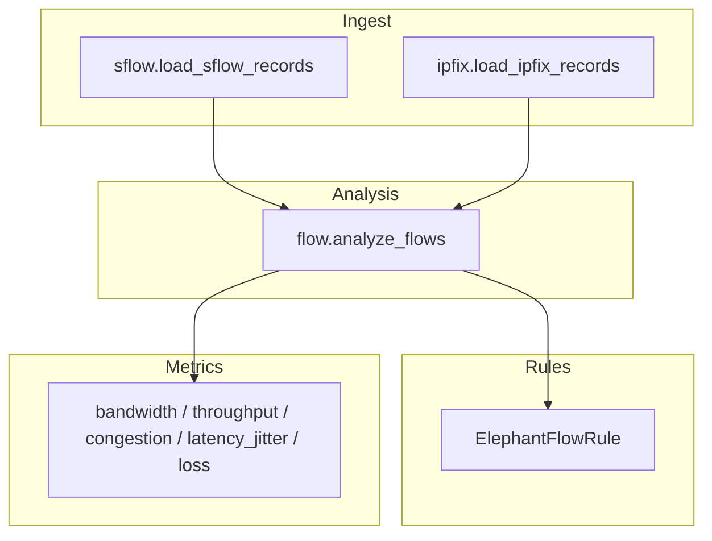
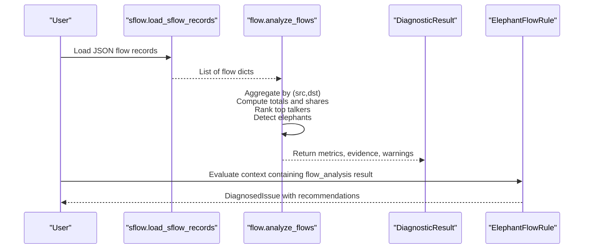
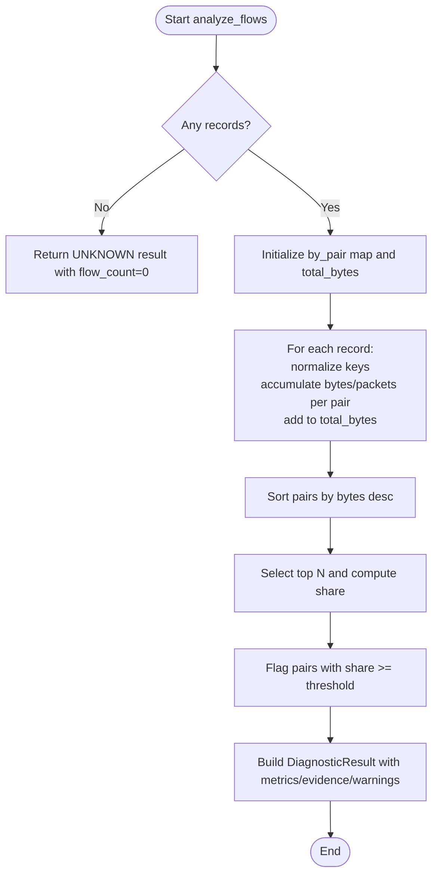
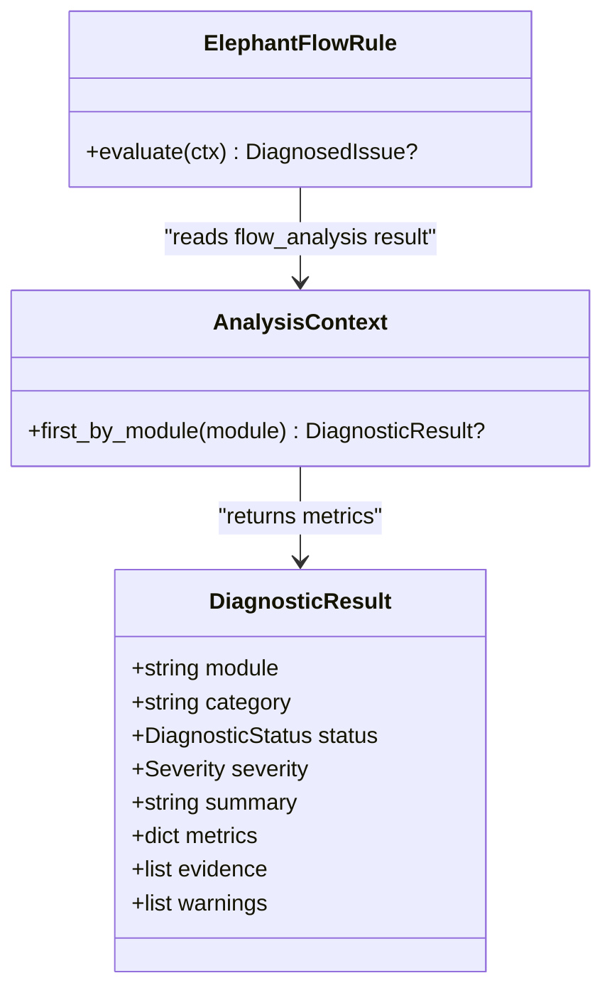
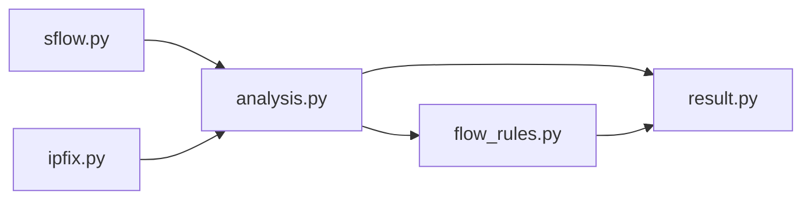

# Flow Analysis

<cite>
**Referenced Files in This Document**
- [analysis.py](file://diagnostics/flow/analysis.py)
- [sflow.py](file://ingest/sflow.py)
- [ipfix.py](file://ingest/ipfix.py)
- [flow_rules.py](file://analysis/rules/flow_rules.py)
- [__init__.py](file://analysis/rules/__init__.py)
- [bandwidth.py](file://core/metrics/bandwidth.py)
- [throughput.py](file://core/metrics/throughput.py)
- [congestion.py](file://core/metrics/congestion.py)
- [latency_jitter.py](file://core/metrics/latency_jitter.py)
- [loss.py](file://core/metrics/loss.py)
- [result.py](file://core/result.py)
- [flows_sample.json](file://examples/flows_sample.json)
</cite>

## Table of Contents
1. Introduction
2. Project Structure
3. Core Components
4. Architecture Overview
5. Detailed Component Analysis
6. Dependency Analysis
7. Performance Considerations
8. Troubleshooting Guide
9. Conclusion
10. Appendices

## Introduction
This document explains the NetForge flow analysis module, focusing on network flow analysis capabilities such as top talker identification, elephant flow detection, and traffic pattern analysis. It documents how flows are aggregated from passive telemetry, how statistics are computed, and how anomaly detection is performed via rules. Configuration options for thresholds and reporting granularity are covered, along with practical examples for analyzing flows, identifying high-bandwidth applications, and detecting unusual traffic patterns.

## Project Structure
The flow analysis capability spans ingestion, analysis, metrics, and rule evaluation:
- Ingestion reads offline sFlow/IPFIX JSON records into a normalized list of flow records.
- Analysis aggregates flows by source-destination pairs, computes totals, ranks top talkers, and detects elephants.
- Metrics utilities provide bandwidth, throughput, congestion scoring, latency/jitter, and loss calculations used across diagnostics.
- Rules consume analysis results to produce actionable issues and recommendations.

**Diagram sources**
- [analysis.py:20-82](file://diagnostics/flow/analysis.py#L20-L82)
- [sflow.py:10-30](file://ingest/sflow.py#L10-L30)
- [ipfix.py:11-15](file://ingest/ipfix.py#L11-L15)
- [flow_rules.py:14-44](file://analysis/rules/flow_rules.py#L14-L44)
- [bandwidth.py:4-16](file://core/metrics/bandwidth.py#L4-L16)
- [throughput.py:4-23](file://core/metrics/throughput.py#L4-L23)
- [congestion.py:4-50](file://core/metrics/congestion.py#L4-L50)
- [latency_jitter.py:7-40](file://core/metrics/latency_jitter.py#L7-L40)
- [loss.py:4-23](file://core/metrics/loss.py#L4-L23)

**Section sources**
- [analysis.py:20-82](file://diagnostics/flow/analysis.py#L20-L82)
- [sflow.py:10-30](file://ingest/sflow.py#L10-L30)
- [ipfix.py:11-15](file://ingest/ipfix.py#L11-L15)
- [flow_rules.py:14-44](file://analysis/rules/flow_rules.py#L14-L44)

## Core Components
- Flow ingestion:
  - sFlow loader supports JSON arrays or JSON Lines with fields like src, dst, bytes, packets, proto.
  - IPFIX loader reuses the same schema for offline replay.
- Flow analysis:
  - Aggregates bytes and packets per (src, dst) pair.
  - Computes total bytes, shares per pair, ranks top talkers, and flags elephants based on a share threshold.
  - Returns a standardized DiagnosticResult with metrics, evidence, and warnings.
- Rule evaluation:
  - ElephantFlowRule consumes flow_analysis results and produces a DiagnosedIssue with severity, confidence, root cause, correlated evidence, and recommendations.
- Metrics utilities:
  - Bandwidth conversion and goodput estimation.
  - Throughput calculation from deltas and link utilization percentage.
  - Congestion scoring combining utilization, drops/errors, and latency delta.
  - Latency jitter and summary statistics.
  - Packet loss percentage and severity classification.

**Section sources**
- [sflow.py:10-30](file://ingest/sflow.py#L10-L30)
- [ipfix.py:11-15](file://ingest/ipfix.py#L11-L15)
- [analysis.py:20-82](file://diagnostics/flow/analysis.py#L20-L82)
- [flow_rules.py:14-44](file://analysis/rules/flow_rules.py#L14-L44)
- [bandwidth.py:4-16](file://core/metrics/bandwidth.py#L4-L16)
- [throughput.py:4-23](file://core/metrics/throughput.py#L4-L23)
- [congestion.py:4-50](file://core/metrics/congestion.py#L4-L50)
- [latency_jitter.py:7-40](file://core/metrics/latency_jitter.py#L7-L40)
- [loss.py:4-23](file://core/metrics/loss.py#L4-L23)

## Architecture Overview
The flow analysis pipeline ingests passive telemetry, aggregates flows, identifies anomalies, and feeds them into the rule engine for diagnosis.

**Diagram sources**
- [sflow.py:10-30](file://ingest/sflow.py#L10-L30)
- [analysis.py:20-82](file://diagnostics/flow/analysis.py#L20-L82)
- [flow_rules.py:14-44](file://analysis/rules/flow_rules.py#L14-L44)
- [result.py:24-47](file://core/result.py#L24-L47)

## Detailed Component Analysis

### Flow Ingestion
- sFlow loader:
  - Accepts JSON array or JSON Lines.
  - Normalizes each record to include src, dst, bytes, packets, proto (optional).
  - Returns an empty list for empty input.
- IPFIX loader:
  - Reuses sFlow loader for offline JSON replay.

Configuration notes:
- Live UDP collectors are stubbed; use offline JSON replay for MVP.

**Section sources**
- [sflow.py:10-30](file://ingest/sflow.py#L10-L30)
- [ipfix.py:11-15](file://ingest/ipfix.py#L11-L15)

### Flow Aggregation and Top Talkers
- Aggregation:
  - Groups by (src, dst) and accumulates bytes and packets.
  - Tracks total bytes across all records.
- Ranking:
  - Sorts pairs by bytes descending.
  - Produces top N (default 10) entries with share = pair_bytes / total_bytes.
- Output:
  - Includes flow_count, total_bytes, top_talkers, elephant_flows, elephant_count.

**Diagram sources**
- [analysis.py:20-82](file://diagnostics/flow/analysis.py#L20-L82)

**Section sources**
- [analysis.py:20-82](file://diagnostics/flow/analysis.py#L20-L82)

### Elephant Flow Detection
- Threshold:
  - Flows whose share of total bytes meets or exceeds a configured constant are considered elephants.
- Behavior:
  - If any elephants found among top talkers, status becomes DEGRADED with MEDIUM severity and a warning listing each elephant’s conversation and share.
  - Otherwise, HEALTHY with INFO severity.

Configuration:
- The elephant threshold is defined as a constant controlling sensitivity. Adjust this value to tune detection.

**Section sources**
- [analysis.py:16-17](file://diagnostics/flow/analysis.py#L16-L17)
- [analysis.py:56-62](file://diagnostics/flow/analysis.py#L56-L62)

### Traffic Pattern Analysis and Anomaly Detection
- Pattern signals:
  - Top talkers reveal dominant conversations and potential high-bandwidth applications.
  - Elephant flows indicate skewed distribution that may saturate links.
- Rule-based anomaly detection:
  - ElephantFlowRule inspects flow_analysis metrics and emits a DiagnosedIssue when elephants exist.
  - The issue includes severity, confidence, root cause, correlated evidence, and prioritized recommendations.

**Diagram sources**
- [flow_rules.py:14-44](file://analysis/rules/flow_rules.py#L14-L44)
- [result.py:24-47](file://core/result.py#L24-L47)

**Section sources**
- [flow_rules.py:14-44](file://analysis/rules/flow_rules.py#L14-L44)

### Statistical Calculations and Supporting Metrics
- Bandwidth and goodput:
  - Convert interface speed to bits/sec.
  - Estimate application goodput in Mbps from bytes transferred over elapsed time.
- Throughput and utilization:
  - Compute bytes/sec and bits/sec from counter deltas.
  - Calculate link utilization percentage given bps and negotiated capacity.
- Congestion scoring:
  - Heuristic score combining utilization, drop/error rates, and latency delta.
  - Map score to coarse state labels.
- Latency and jitter:
  - RFC-compliant jitter calculation.
  - Summarize min/avg/max/jitter/stddev for latency samples.
- Loss:
  - Compute packet loss percentage and classify severity.

These utilities support broader diagnostics and can be combined with flow analysis to contextualize anomalies.

**Section sources**
- [bandwidth.py:4-16](file://core/metrics/bandwidth.py#L4-L16)
- [throughput.py:4-23](file://core/metrics/throughput.py#L4-L23)
- [congestion.py:4-50](file://core/metrics/congestion.py#L4-L50)
- [latency_jitter.py:7-40](file://core/metrics/latency_jitter.py#L7-L40)
- [loss.py:4-23](file://core/metrics/loss.py#L4-L23)

## Dependency Analysis
- Flow analysis depends on:
  - Ingestion of sFlow/IPFIX JSON records.
  - Standardized DiagnosticResult structure.
- Rules depend on:
  - AnalysisContext to retrieve prior diagnostic results by module.
  - Severity and status enums for consistent signaling.

**Diagram sources**
- [sflow.py:10-30](file://ingest/sflow.py#L10-L30)
- [ipfix.py:11-15](file://ingest/ipfix.py#L11-L15)
- [analysis.py:20-82](file://diagnostics/flow/analysis.py#L20-L82)
- [flow_rules.py:14-44](file://analysis/rules/flow_rules.py#L14-L44)
- [result.py:24-47](file://core/result.py#L24-L47)

**Section sources**
- [analysis.py:20-82](file://diagnostics/flow/analysis.py#L20-L82)
- [flow_rules.py:14-44](file://analysis/rules/flow_rules.py#L14-L44)
- [result.py:24-47](file://core/result.py#L24-L47)

## Performance Considerations
- Aggregation complexity:
  - Single pass O(N) to aggregate by (src, dst), followed by sorting O(K log K) where K is unique pairs.
- Memory usage:
  - Stores per-pair counters; memory scales with number of unique conversations.
- Reporting granularity:
  - Top talkers limited to a fixed window (default 10) to bound output size.
- Threshold tuning:
  - Elephant threshold controls sensitivity; higher values reduce false positives but may miss emerging elephants.

[No sources needed since this section provides general guidance]

## Troubleshooting Guide
- No flow records:
  - If input is empty, analysis returns UNKNOWN with zero flow count. Verify ingestion path and file format.
- Unexpected field names:
  - Loader accepts multiple key variants; ensure at least one of src/source and dst/destination is present.
- Live collector not available:
  - Live UDP collectors are stubs; use offline JSON replay until implemented.
- Rule not triggering:
  - Ensure flow_analysis result exists in context and contains elephant_flows metric.

**Section sources**
- [analysis.py:20-29](file://diagnostics/flow/analysis.py#L20-L29)
- [sflow.py:10-30](file://ingest/sflow.py#L10-L30)
- [ipfix.py:18-22](file://ingest/ipfix.py#L18-L22)

## Conclusion
NetForge’s flow analysis module provides robust passive telemetry processing: it aggregates flows, identifies top talkers, and detects elephant flows using a configurable threshold. Results are standardized and consumed by rules to generate actionable insights. Complementary metrics enable deeper context around bandwidth, utilization, congestion, latency, and loss. For production use, integrate live collectors and extend thresholds and reporting granularity to match operational needs.

[No sources needed since this section summarizes without analyzing specific files]

## Appendices

### Configuration Options
- Elephant flow threshold:
  - Defined as a constant controlling the minimum share of total bytes to qualify as an elephant. Adjust to balance sensitivity and precision.
- Reporting granularity:
  - Top talkers window size is fixed internally; modify to change the number of reported top conversations.
- Input schema:
  - Each flow record should include src/dst and bytes/packets; proto is optional.

**Section sources**
- [analysis.py:16-17](file://diagnostics/flow/analysis.py#L16-L17)
- [analysis.py:44-54](file://diagnostics/flow/analysis.py#L44-L54)
- [sflow.py:10-30](file://ingest/sflow.py#L10-L30)

### Example: Analyzing Network Flows
- Prepare a JSON file with flow records (array or JSON Lines).
- Use the sFlow loader to read records and pass them to the analyzer.
- Inspect returned metrics:
  - flow_count, total_bytes, top_talkers, elephant_flows, elephant_count.
- Use the CLI helper to print a table of top talkers.

Example data reference:
- See sample flow records for expected structure.

**Section sources**
- [sflow.py:10-30](file://ingest/sflow.py#L10-L30)
- [analysis.py:90-105](file://diagnostics/flow/analysis.py#L90-L105)
- [flows_sample.json:1-6](file://examples/flows_sample.json#L1-L6)

### Example: Identifying High-Bandwidth Applications
- Run flow analysis on collected records.
- Review top_talkers to identify conversations with the highest byte counts and shares.
- Correlate with application metadata (e.g., proto) if available.

**Section sources**
- [analysis.py:44-54](file://diagnostics/flow/analysis.py#L44-L54)

### Example: Detecting Unusual Traffic Patterns
- If elephant flows are detected, the analysis marks status DEGRADED and emits warnings.
- The ElephantFlowRule generates a DiagnosedIssue with recommendations to rate-limit or reschedule dominant flows and correlate with link utilization diagnostics.

**Section sources**
- [analysis.py:56-82](file://diagnostics/flow/analysis.py#L56-L82)
- [flow_rules.py:14-44](file://analysis/rules/flow_rules.py#L14-L44)