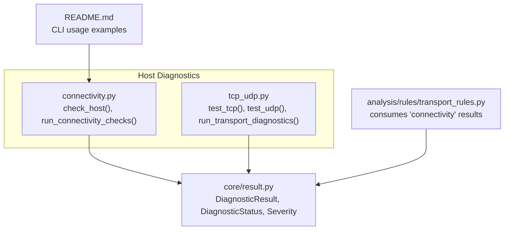
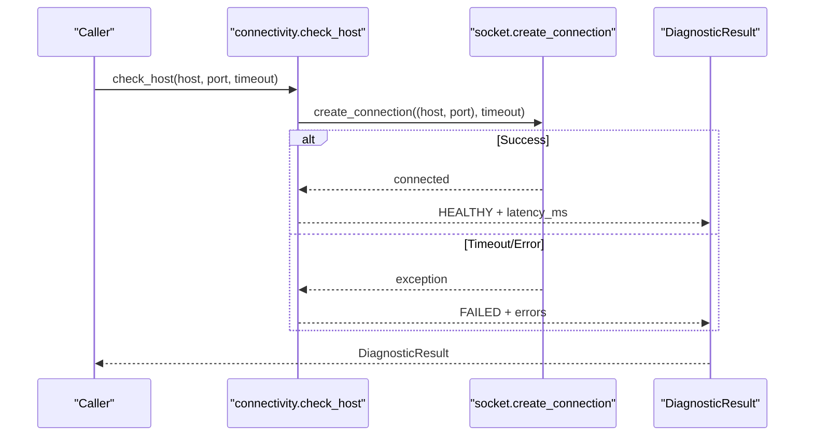
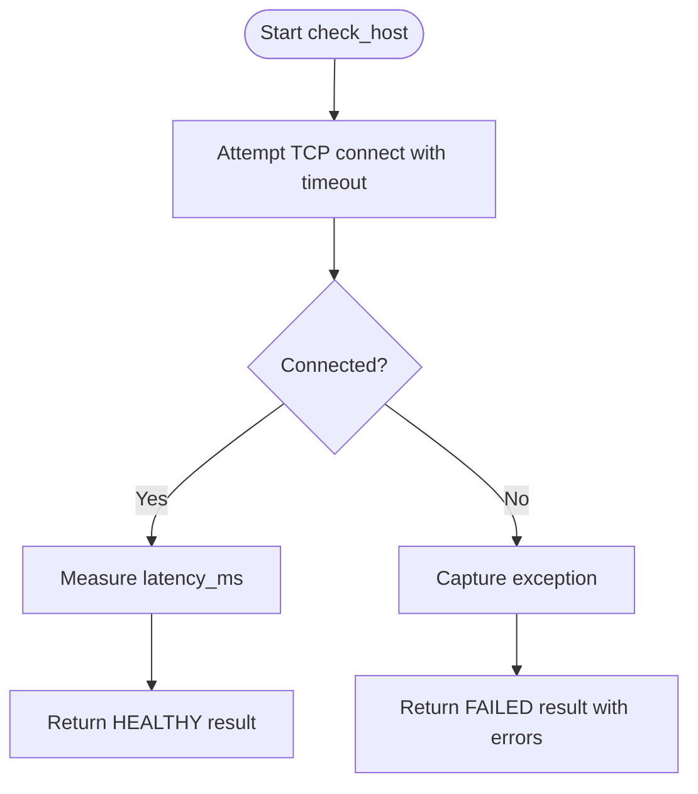
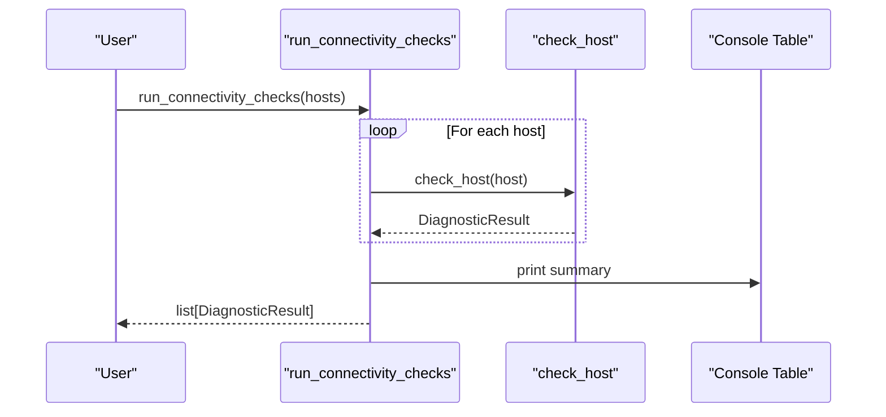
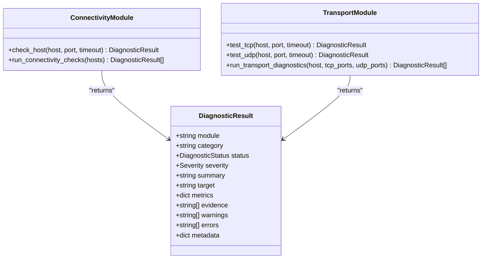
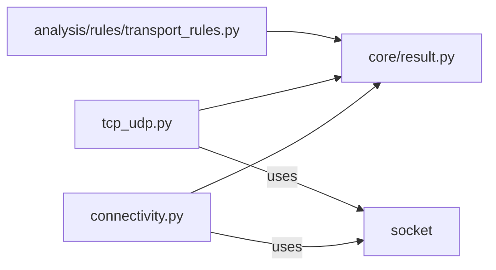

# Connectivity Checks

<cite>
**Referenced Files in This Document**
- [connectivity.py](file://diagnostics/host/connectivity.py)
- [tcp_udp.py](file://diagnostics/host/tcp_udp.py)
- [result.py](file://core/result.py)
- [transport_rules.py](file://analysis/rules/transport_rules.py)
- [README.md](file://README.md)
</cite>

## Table of Contents
1. [Introduction](#introduction)
2. [Project Structure](#project-structure)
3. [Core Components](#core-components)
4. [Architecture Overview](#architecture-overview)
5. [Detailed Component Analysis](#detailed-component-analysis)
6. [Dependency Analysis](#dependency-analysis)
7. [Performance Considerations](#performance-considerations)
8. [Troubleshooting Guide](#troubleshooting-guide)
9. [Conclusion](#conclusion)

## Introduction
This document explains the connectivity checks diagnostic module that performs TCP reachability tests to specific hosts and ports with configurable timeouts. It covers:
- How TCP connection testing works at a low level
- The check_host function for single-host reachability
- The run_connectivity_checks function for batch testing multiple hosts
- Parameter configuration (host, port, timeout)
- Interpretation of results
- Common scenarios, firewall considerations, and performance implications of different timeout settings

## Project Structure
The connectivity checks live under host-level diagnostics and integrate with a shared result model used across the framework.

**Diagram sources**
- [connectivity.py:16-111](file://diagnostics/host/connectivity.py#L16-L111)
- [tcp_udp.py:16-226](file://diagnostics/host/tcp_udp.py#L16-L226)
- [result.py:9-47](file://core/result.py#L9-L47)
- [transport_rules.py:68-77](file://analysis/rules/transport_rules.py#L68-L77)
- [README.md:11-19](file://README.md#L11-L19)

**Section sources**
- [connectivity.py:16-111](file://diagnostics/host/connectivity.py#L16-L111)
- [tcp_udp.py:16-226](file://diagnostics/host/tcp_udp.py#L16-L226)
- [result.py:9-47](file://core/result.py#L9-L47)
- [transport_rules.py:68-77](file://analysis/rules/transport_rules.py#L68-L77)
- [README.md:11-19](file://README.md#L11-L19)

## Core Components
- check_host(host, port=443, timeout=3.0): Attempts a TCP connect to host:port within the given timeout and returns a standardized result indicating reachability and measured latency.
- run_connectivity_checks(hosts=None): Runs check_host against a default set of well-known hosts or a user-provided list, prints a summary table, and returns all results.
- test_tcp(host, port, timeout=3.0): Performs a TCP connect using address family resolution and reports status, error codes, and latency.
- test_udp(host, port=53, timeout=3.0): Probes UDP services (DNS/NTP) with protocol-specific requests or sends a datagram for generic ports; reports success/failure and latency where applicable.
- run_transport_diagnostics(host, tcp_ports=[...], udp_ports=[...]): Orchestrates multiple TCP/UDP probes and prints a combined report.

All components return DiagnosticResult objects containing status, severity, metrics, evidence, and errors.

**Section sources**
- [connectivity.py:16-111](file://diagnostics/host/connectivity.py#L16-L111)
- [tcp_udp.py:16-226](file://diagnostics/host/tcp_udp.py#L16-L226)
- [result.py:9-47](file://core/result.py#L9-L47)

## Architecture Overview
The connectivity checks are part of the host diagnostics layer. They use Python’s socket API to perform TCP/UDP probes and produce structured results consumed by higher-level analysis rules.

**Diagram sources**
- [connectivity.py:16-65](file://diagnostics/host/connectivity.py#L16-L65)
- [result.py:9-47](file://core/result.py#L9-L47)

## Detailed Component Analysis

### TCP Reachability: check_host
- Purpose: Test whether a host is reachable on a given TCP port within a specified timeout.
- Behavior:
  - Measures time to establish a TCP connection and records latency in milliseconds.
  - On success: returns a HEALTHY result with metrics including port and latency_ms.
  - On failure (timeout or OS error): returns a FAILED result with high severity and error details.
- Parameters:
  - host: target hostname or IP
  - port: destination TCP port (default 443)
  - timeout: seconds to wait for connection establishment (default 3.0)

**Diagram sources**
- [connectivity.py:16-65](file://diagnostics/host/connectivity.py#L16-L65)

**Section sources**
- [connectivity.py:16-65](file://diagnostics/host/connectivity.py#L16-L65)

### Batch Testing: run_connectivity_checks
- Purpose: Run connectivity checks against one or more hosts and present a summary table.
- Default targets: well-known public endpoints (e.g., DNS resolvers and a common domain).
- Output: prints a table with Host, Status, and Latency columns; returns a list of DiagnosticResult.

**Diagram sources**
- [connectivity.py:68-111](file://diagnostics/host/connectivity.py#L68-L111)

**Section sources**
- [connectivity.py:68-111](file://diagnostics/host/connectivity.py#L68-L111)

### Transport Probes: test_tcp and test_udp
- test_tcp:
  - Resolves address family dynamically (IPv4/IPv6).
  - Uses connect_ex to obtain an explicit error code when connection fails.
  - Returns HEALTHY with latency_ms on success; otherwise FAILED with error_code and evidence.
- test_udp:
  - For DNS (port 53) and NTP (port 123), sends protocol-specific queries and expects responses.
  - For other ports, sends a datagram and treats absence of immediate ICMP rejection as “healthy” for reachability.
  - Handles timeouts differently based on service type and reports appropriate status/evidence.

**Diagram sources**
- [connectivity.py:16-111](file://diagnostics/host/connectivity.py#L16-L111)
- [tcp_udp.py:16-226](file://diagnostics/host/tcp_udp.py#L16-L226)
- [result.py:9-47](file://core/result.py#L9-L47)

**Section sources**
- [tcp_udp.py:16-226](file://diagnostics/host/tcp_udp.py#L16-L226)
- [result.py:9-47](file://core/result.py#L9-L47)

## Dependency Analysis
- Internal dependencies:
  - Both connectivity and transport modules depend on core.result for standardized outputs.
  - Higher-level analysis rules consume connectivity results to infer network health.
- External dependencies:
  - Python socket library for TCP/UDP operations.
  - Rich console/table for human-readable output.

**Diagram sources**
- [connectivity.py:1-111](file://diagnostics/host/connectivity.py#L1-L111)
- [tcp_udp.py:1-226](file://diagnostics/host/tcp_udp.py#L1-L226)
- [result.py:9-47](file://core/result.py#L9-L47)
- [transport_rules.py:68-77](file://analysis/rules/transport_rules.py#L68-L77)

**Section sources**
- [connectivity.py:1-111](file://diagnostics/host/connectivity.py#L1-L111)
- [tcp_udp.py:1-226](file://diagnostics/host/tcp_udp.py#L1-L226)
- [result.py:9-47](file://core/result.py#L9-L47)
- [transport_rules.py:68-77](file://analysis/rules/transport_rules.py#L68-L77)

## Performance Considerations
- Timeout selection:
  - Shorter timeouts reduce probe duration but may increase false negatives under transient congestion or slow resolvers.
  - Longer timeouts improve reliability at the cost of slower overall diagnostics, especially when probing many hosts.
- Measurement granularity:
  - Latency is measured around the connection establishment phase; it reflects network path and server responsiveness but not application-layer processing time.
- Concurrency:
  - Current implementations run probes sequentially per call site. For large-scale scans, consider parallelization to reduce total runtime while respecting rate limits and avoiding overwhelming intermediate devices.
- UDP behavior:
  - UDP probes without responses are considered healthy if no immediate ICMP rejection occurs; this can mask non-functional services behind firewalls that drop packets silently.

[No sources needed since this section provides general guidance]

## Troubleshooting Guide
Common issues and how to interpret results:
- Timeouts:
  - If check_host or test_tcp times out, verify local routing, DNS resolution, and outbound firewall rules allowing TCP to the target port.
  - For UDP, timeouts on DNS/NTP indicate service unreachability; for other ports, lack of response may be normal if the stack does not reply.
- Connection refused:
  - Indicates the host is reachable but no listener on the port; check service status and port bindings.
- Firewall and NAT:
  - Firewalls may drop packets silently, causing timeouts. Review egress policies for required ports.
  - Stateful firewalls might allow SYN but block subsequent traffic; ensure full handshake is permitted.
- DNS-related failures:
  - When using hostnames, ensure DNS resolution succeeds. Address family resolution is handled automatically in TCP/UDP probes.
- Interpreting results:
  - HEALTHY: TCP/UDP probe succeeded; latency_ms indicates round-trip to establish/send.
  - FAILED: Probe failed; review errors and evidence fields for specifics (e.g., error codes, timeouts).
  - Severity levels help prioritize remediation; HIGH/MEDIUM typically indicate actionable issues.

Integration with analysis:
- Rules consume connectivity results to determine broader network health. For example, if public endpoints are reachable but a specific target fails, targeted troubleshooting is warranted.

**Section sources**
- [connectivity.py:16-111](file://diagnostics/host/connectivity.py#L16-L111)
- [tcp_udp.py:16-226](file://diagnostics/host/tcp_udp.py#L16-L226)
- [transport_rules.py:68-77](file://analysis/rules/transport_rules.py#L68-L77)

## Conclusion
The connectivity checks module provides a focused, reliable way to validate TCP reachability to hosts and ports with configurable timeouts, returning standardized results suitable for automated analysis. Use check_host for precise single-target tests and run_connectivity_checks for quick multi-target sweeps. Combine with transport probes for comprehensive TCP/UDP validation, and apply the troubleshooting guidance above to diagnose and resolve network issues efficiently.

[No sources needed since this section summarizes without analyzing specific files]