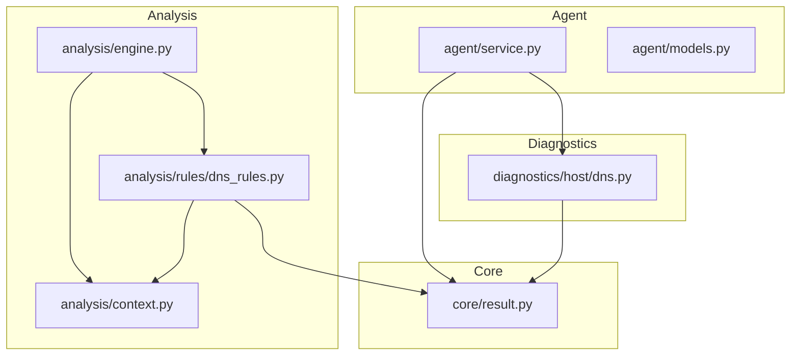
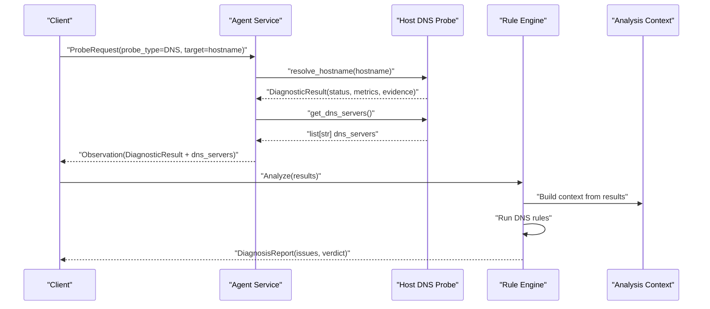
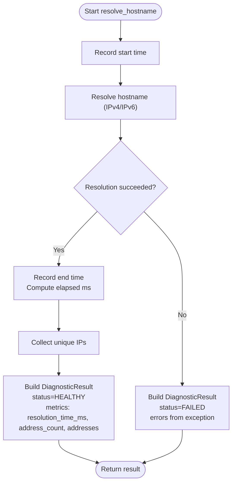
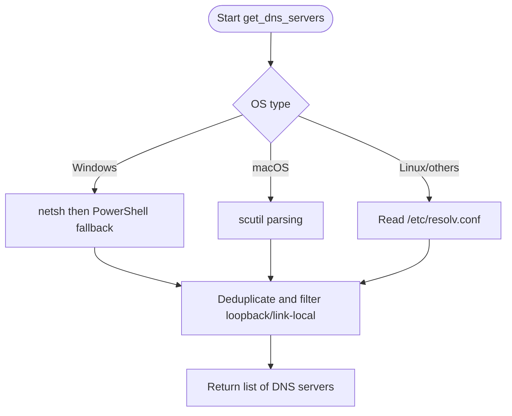
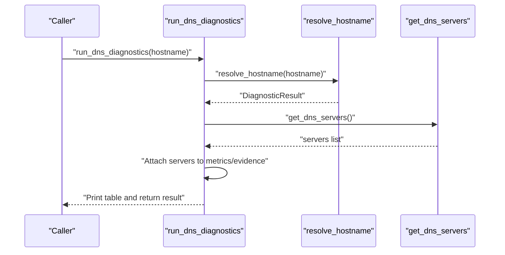
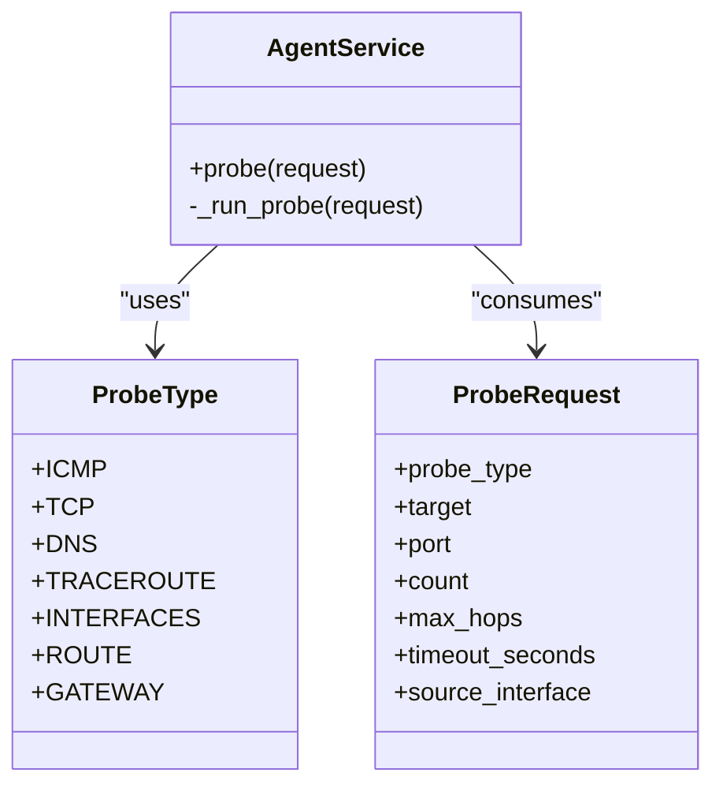
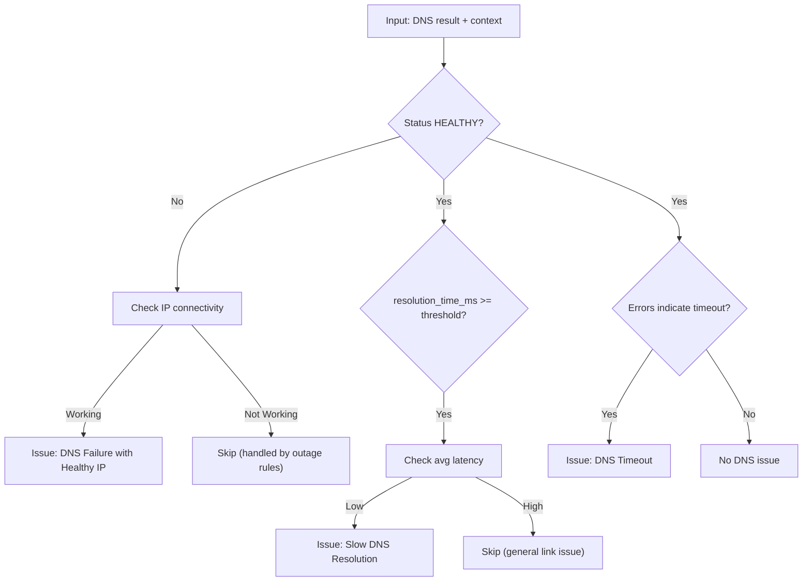
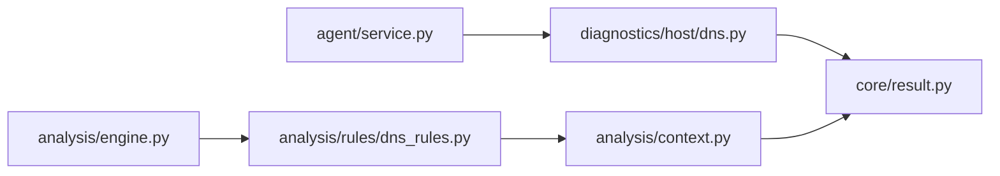

# DNS Resolution Testing

<cite>
**Referenced Files in This Document**
- [dns.py](file://diagnostics/host/dns.py)
- [dns_rules.py](file://analysis/rules/dns_rules.py)
- [context.py](file://analysis/context.py)
- [engine.py](file://analysis/engine.py)
- [service.py](file://agent/service.py)
- [models.py](file://agent/models.py)
- [result.py](file://core/result.py)
</cite>

## Table of Contents
1. Introduction
2. Project Structure
3. Core Components
4. Architecture Overview
5. Detailed Component Analysis
6. Dependency Analysis
7. Performance Considerations
8. Troubleshooting Guide
9. Conclusion
10. Appendices

## Introduction
This document explains how DNS resolution testing is implemented and analyzed in the project. It covers how DNS queries are performed, how responses are validated, and how resolution time is measured. It also documents diagnostic functions that test DNS server responsiveness, query accuracy, and caching behavior, along with rule-based analysis for common issues such as slow resolution, incorrect records, and server unavailability. The guide includes IPv4 and IPv6 considerations, configuration validation via resolver chain discovery, and troubleshooting steps for DNS-related connectivity problems.

## Project Structure
DNS diagnostics are implemented across several modules:
- Host-level DNS probing and server discovery live under diagnostics/host.
- Rule-based diagnosis lives under analysis/rules.
- Context helpers aggregate results from multiple probes to support cross-layer reasoning.
- The agent service exposes a DNS probe type that triggers host-level DNS tests.
- The core result model standardizes diagnostic outputs.

**Diagram sources**
- [service.py:58-90](file://agent/service.py#L58-L90)
- [dns.py:21-159](file://diagnostics/host/dns.py#L21-L159)
- [context.py:70-96](file://analysis/context.py#L70-L96)
- [dns_rules.py:9-159](file://analysis/rules/dns_rules.py#L9-L159)
- [engine.py:29-111](file://analysis/engine.py#L29-L111)
- [result.py:24-47](file://core/result.py#L24-L47)

**Section sources**
- [service.py:58-90](file://agent/service.py#L58-L90)
- [dns.py:21-159](file://diagnostics/host/dns.py#L21-L159)
- [context.py:70-96](file://analysis/context.py#L70-L96)
- [dns_rules.py:9-159](file://analysis/rules/dns_rules.py#L9-L159)
- [engine.py:29-111](file://analysis/engine.py#L29-L111)
- [result.py:24-47](file://core/result.py#L24-L47)

## Core Components
- DNS probing: Performs hostname resolution using the OS resolver stack and measures latency. Discovers configured DNS servers per platform.
- Server discovery: Detects configured upstream resolvers on Windows, macOS, and Linux.
- Result modeling: Standardized DiagnosticResult carries status, severity, metrics (including resolution time), evidence, and errors.
- Rule engine: Evaluates rules against collected results to detect DNS failures, timeouts, and high latency while correlating with IP connectivity and latency data.
- Agent integration: Exposes a DNS probe type that runs host-level DNS tests and attaches discovered DNS servers to the result.

Key responsibilities:
- resolve_hostname: Executes resolution and returns a structured result with timing and addresses.
- get_dns_servers: Enumerates configured DNS servers across platforms.
- run_dns_diagnostics: Orchestrates a quick report including status, timing, and servers.
- DNS rules: Identify failure modes and provide actionable recommendations.

**Section sources**
- [dns.py:21-159](file://diagnostics/host/dns.py#L21-L159)
- [dns.py:92-147](file://diagnostics/host/dns.py#L92-L147)
- [dns_rules.py:9-159](file://analysis/rules/dns_rules.py#L9-L159)
- [service.py:73-81](file://agent/service.py#L73-L81)
- [result.py:24-47](file://core/result.py#L24-L47)

## Architecture Overview
The DNS testing flow integrates agent requests, host-level diagnostics, and rule-based analysis.

**Diagram sources**
- [service.py:58-90](file://agent/service.py#L58-L90)
- [dns.py:92-159](file://diagnostics/host/dns.py#L92-L159)
- [engine.py:29-111](file://analysis/engine.py#L29-L111)
- [context.py:70-96](file://analysis/context.py#L70-L96)

## Detailed Component Analysis

### DNS Probing and Timing
- Query execution: Uses the OS resolver via an address family-agnostic call to resolve both IPv4 and IPv6 addresses for the given hostname.
- Response validation: Success yields a healthy status with resolved addresses; failure yields a failed status with error details.
- Time measurement: High-resolution timer captures total resolution time in milliseconds and stores it in metrics.
- Address collection: Extracts unique IP addresses from all returned families and sorts them for deterministic output.

**Diagram sources**
- [dns.py:92-147](file://diagnostics/host/dns.py#L92-L147)

**Section sources**
- [dns.py:92-147](file://diagnostics/host/dns.py#L92-L147)

### DNS Server Discovery (Resolver Chain)
- Platform detection: Identifies OS and uses appropriate commands or files to discover configured nameservers.
- Windows: Attempts netsh and PowerShell methods to extract IPv4 server addresses, filtering loopback and link-local ranges.
- macOS: Parses scutil output to extract nameserver entries.
- Linux/fallback: Reads /etc/resolv.conf nameserver lines.
- Output: Returns a deduplicated list of configured DNS servers.

**Diagram sources**
- [dns.py:21-89](file://diagnostics/host/dns.py#L21-L89)

**Section sources**
- [dns.py:21-89](file://diagnostics/host/dns.py#L21-L89)

### Diagnostics Orchestration and Reporting
- run_dns_diagnostics: Combines resolution results with discovered DNS servers and prints a summary table including hostname, servers, status, resolution time, and addresses.
- Integration point: Attaches dns_servers to the result metrics for downstream analysis.

**Diagram sources**
- [dns.py:150-203](file://diagnostics/host/dns.py#L150-L203)

**Section sources**
- [dns.py:150-203](file://diagnostics/host/dns.py#L150-L203)

### Agent Integration and Probe Model
- ProbeType.DNS: Declares DNS as a supported probe type.
- AgentService._run_probe: For DNS probes, calls resolve_hostname and augments the result with discovered DNS servers.
- Validation: ProbeRequest enforces required fields and constraints for targeted probes.

**Diagram sources**
- [models.py:10-40](file://agent/models.py#L10-L40)
- [service.py:73-81](file://agent/service.py#L73-L81)

**Section sources**
- [models.py:10-40](file://agent/models.py#L10-L40)
- [service.py:73-81](file://agent/service.py#L73-L81)

### Rule-Based Diagnosis for DNS Issues
Three rules analyze DNS outcomes in context with other network diagnostics:

- DNSFailureWithHealthyIPRule: Detects DNS resolution failures when IP transit is healthy. Provides recommendations to flush cache, test public resolvers, and configure fallback DNS.
- SlowDNSResolutionRule: Flags high DNS resolution latency when underlying IP latency is low, suggesting switching to faster recursive resolvers.
- DNSTimeoutRule: Detects DNS timeouts despite working IP connectivity, recommending direct queries to public resolvers to isolate local DNS issues.

**Diagram sources**
- [dns_rules.py:9-159](file://analysis/rules/dns_rules.py#L9-L159)
- [context.py:70-96](file://analysis/context.py#L70-L96)

**Section sources**
- [dns_rules.py:9-159](file://analysis/rules/dns_rules.py#L9-L159)
- [context.py:70-96](file://analysis/context.py#L70-L96)

### Analysis Context Helpers
- is_dns_resolution_working: Reports whether DNS resolution succeeded based on module results.
- get_dns_servers: Retrieves configured DNS servers from the DNS result metrics.
- is_ip_connectivity_working: Validates IP connectivity using connectivity or packet loss results, used by DNS rules to correlate issues.

**Section sources**
- [context.py:70-96](file://analysis/context.py#L70-L96)

### Engine Orchestration and Verdict Synthesis
- RuleEngine.analyze: Builds AnalysisContext, executes rules, resolves conflicts, computes overall status, and synthesizes a verdict.
- Observations: Includes positive notes such as successful DNS resolution when applicable.

**Section sources**
- [engine.py:29-111](file://analysis/engine.py#L29-L111)

## Dependency Analysis
- Agent service depends on host DNS diagnostics and core result model to execute DNS probes and produce standardized outputs.
- DNS diagnostics depend on platform utilities and the core result model.
- Rules depend on analysis context to correlate DNS results with IP connectivity and latency.
- Engine orchestrates rules and produces a final diagnosis report.

**Diagram sources**
- [service.py:73-81](file://agent/service.py#L73-L81)
- [dns.py:92-159](file://diagnostics/host/dns.py#L92-L159)
- [dns_rules.py:9-159](file://analysis/rules/dns_rules.py#L9-L159)
- [context.py:70-96](file://analysis/context.py#L70-L96)
- [engine.py:29-111](file://analysis/engine.py#L29-L111)
- [result.py:24-47](file://core/result.py#L24-L47)

**Section sources**
- [service.py:73-81](file://agent/service.py#L73-L81)
- [dns.py:92-159](file://diagnostics/host/dns.py#L92-L159)
- [dns_rules.py:9-159](file://analysis/rules/dns_rules.py#L9-L159)
- [context.py:70-96](file://analysis/context.py#L70-L96)
- [engine.py:29-111](file://analysis/engine.py#L29-L111)
- [result.py:24-47](file://core/result.py#L24-L47)

## Performance Considerations
- Resolution time measurement uses high-resolution timers to capture accurate DNS latency in milliseconds.
- Address deduplication ensures consistent metrics and avoids inflated counts.
- Platform-specific server discovery includes timeouts and exception handling to avoid blocking diagnostics.
- Rule thresholds distinguish DNS-specific slowness from general network latency to reduce false positives.

[No sources needed since this section provides general guidance]

## Troubleshooting Guide
Common DNS issues and recommended actions:

- Slow resolution:
  - Symptom: Elevated resolution_time_ms while IP latency remains low.
  - Action: Switch to high-performance recursive resolvers; validate with direct queries to public resolvers.
  - Evidence source: SlowDNSResolutionRule correlates DNS timing with average latency.

- Incorrect records or no records:
  - Symptom: Resolution fails with errors; IP connectivity is healthy.
  - Action: Flush local DNS cache; test against public resolvers; configure fallback DNS servers.
  - Evidence source: DNSFailureWithHealthyIPRule identifies misconfiguration or upstream failures.

- Server unavailability or timeouts:
  - Symptom: DNS probe times out while IP connectivity works.
  - Action: Query public resolvers directly to isolate local DNS timeout; check firewall rules for port 53.
  - Evidence source: DNSTimeoutRule flags timeouts and suggests isolation steps.

- Resolver chain validation:
  - Use get_dns_servers to inspect configured resolvers and verify expected upstream servers.
  - Cross-check with is_ip_connectivity_working to ensure underlying transport is functional.

- IPv4 and IPv6:
  - The resolver call is family-agnostic and returns both IPv4 and IPv6 addresses where available.
  - Validate presence and count of addresses to confirm dual-stack behavior.

**Section sources**
- [dns_rules.py:9-159](file://analysis/rules/dns_rules.py#L9-L159)
- [context.py:70-96](file://analysis/context.py#L70-L96)
- [dns.py:92-147](file://diagnostics/host/dns.py#L92-L147)

## Conclusion
The DNS resolution testing framework combines host-level probing, platform-aware server discovery, and rule-based analysis to diagnose DNS health comprehensively. It measures resolution time, validates responses, and correlates findings with broader network conditions to identify root causes for slow, failing, or timed-out DNS operations. The design supports both IPv4 and IPv6 and provides actionable recommendations for resolving common DNS issues.

[No sources needed since this section summarizes without analyzing specific files]

## Appendices

### API and Data Models
- ProbeType.DNS enables DNS probing through the agent interface.
- ProbeRequest validates inputs for targeted probes, ensuring required fields like target are present.
- DiagnosticResult standardizes outputs with status, severity, metrics, evidence, and errors.

**Section sources**
- [models.py:10-40](file://agent/models.py#L10-L40)
- [result.py:24-47](file://core/result.py#L24-L47)