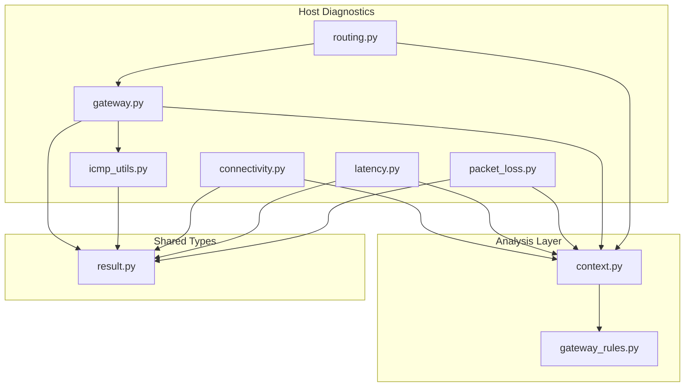
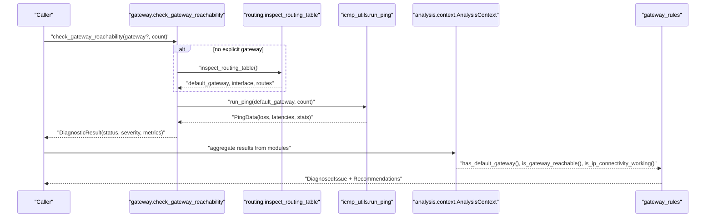
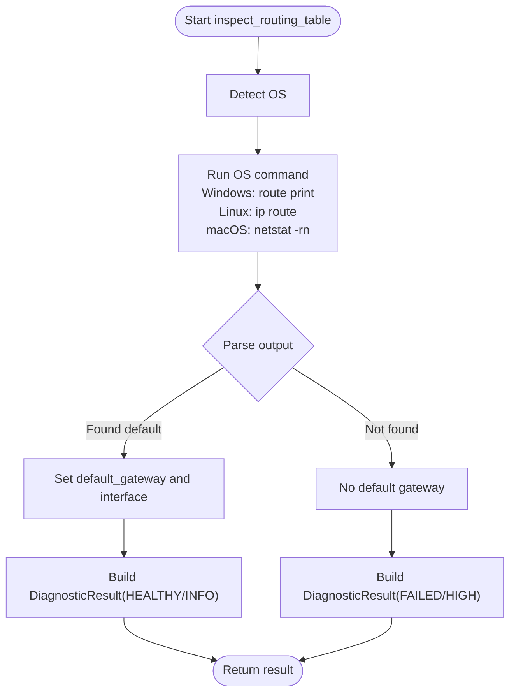
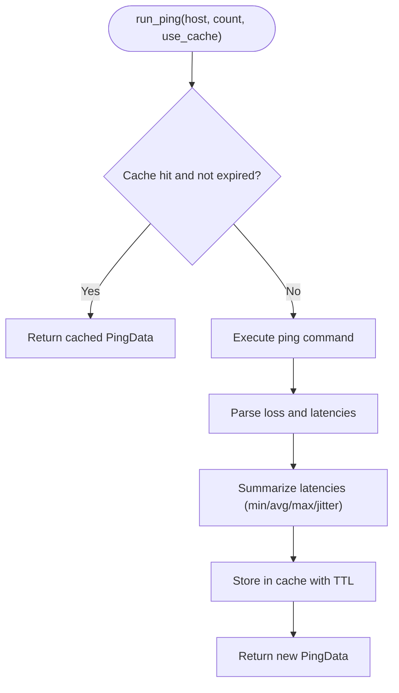
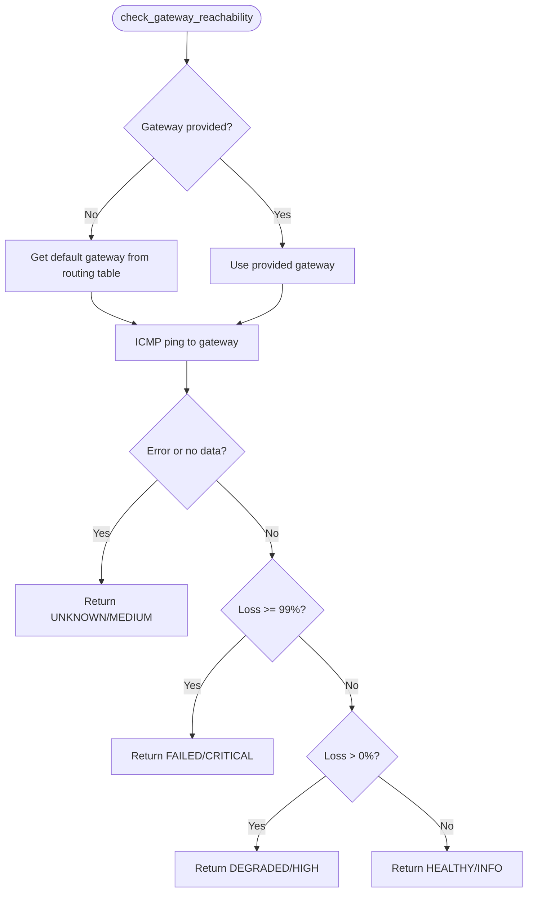
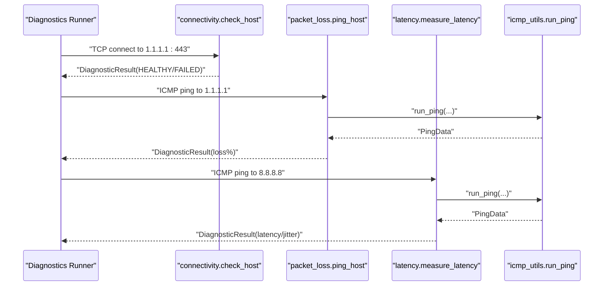
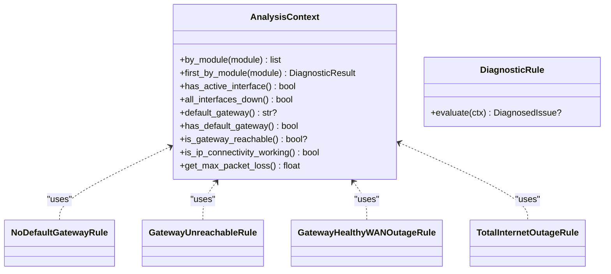
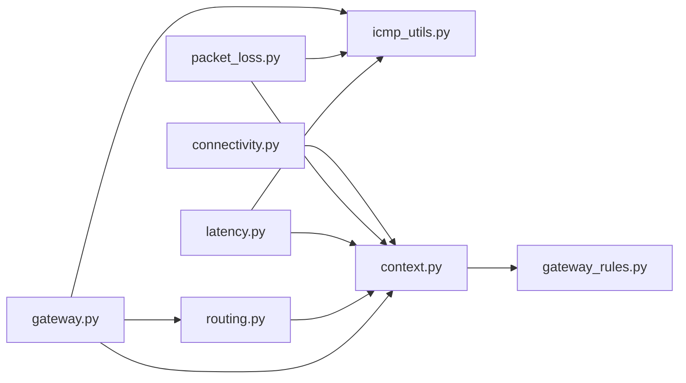

# Gateway Reachability

<cite>
**Referenced Files in This Document**
- [gateway.py](file://diagnostics/host/gateway.py)
- [icmp_utils.py](file://diagnostics/host/icmp_utils.py)
- [routing.py](file://diagnostics/host/routing.py)
- [connectivity.py](file://diagnostics/host/connectivity.py)
- [packet_loss.py](file://diagnostics/host/packet_loss.py)
- [latency.py](file://diagnostics/host/latency.py)
- [context.py](file://analysis/context.py)
- [gateway_rules.py](file://analysis/rules/gateway_rules.py)
- [result.py](file://core/result.py)
</cite>

## Table of Contents
1. [Introduction](#introduction)
2. [Project Structure](#project-structure)
3. [Core Components](#core-components)
4. [Architecture Overview](#architecture-overview)
5. [Detailed Component Analysis](#detailed-component-analysis)
6. [Dependency Analysis](#dependency-analysis)
7. [Performance Considerations](#performance-considerations)
8. [Troubleshooting Guide](#troubleshooting-guide)
9. [Conclusion](#conclusion)

## Introduction
This document explains how gateway reachability diagnostics are implemented and used to validate host-to-gateway connectivity, detect failures, and identify upstream issues. It covers default gateway discovery via the routing table, ICMP-based ping probing, health classification, and integration with a rule engine that correlates evidence across modules. It also provides troubleshooting scenarios, configuration validation guidance, performance considerations, and notes on multi-homed networks and failover detection.

## Project Structure
Gateway reachability is implemented as part of the host diagnostics domain and integrated into the analysis layer:
- Host diagnostics: routing inspection, ICMP ping utilities, gateway probing, packet loss and latency measurement, and TCP connectivity checks.
- Analysis context: aggregates results from multiple modules and exposes helpers for rules.
- Rules: interpret combined evidence to diagnose missing gateways, unreachable gateways, WAN outages, or total Internet outage.

**Diagram sources**
- [routing.py:81-161](file://diagnostics/host/routing.py#L81-L161)
- [gateway.py:15-94](file://diagnostics/host/gateway.py#L15-L94)
- [icmp_utils.py:68-115](file://diagnostics/host/icmp_utils.py#L68-L115)
- [connectivity.py:16-65](file://diagnostics/host/connectivity.py#L16-L65)
- [latency.py:14-81](file://diagnostics/host/latency.py#L14-L81)
- [packet_loss.py:14-77](file://diagnostics/host/packet_loss.py#L14-L77)
- [context.py:7-199](file://analysis/context.py#L7-L199)
- [gateway_rules.py:9-198](file://analysis/rules/gateway_rules.py#L9-L198)
- [result.py:9-47](file://core/result.py#L9-L47)

**Section sources**
- [README.md:1-22](file://README.md#L1-L22)

## Core Components
- Default gateway discovery: parses OS-specific routing tables to extract the default gateway IP and interface.
- ICMP probe: executes platform-appropriate ping commands, parses output, computes latency statistics, and caches results.
- Gateway reachability check: determines status based on packet loss and RTT metrics; distinguishes local gateway failure from upstream issues.
- Connectivity and loss measurements: TCP connect tests and ICMP-based packet loss measurements to public endpoints.
- Analysis context: indexes diagnostic results by module and provides queries for rules (e.g., whether the gateway is reachable).
- Diagnostic rules: translate evidence into actionable diagnoses such as missing default route, unreachable gateway, or WAN outage.

**Section sources**
- [routing.py:81-161](file://diagnostics/host/routing.py#L81-L161)
- [icmp_utils.py:29-115](file://diagnostics/host/icmp_utils.py#L29-L115)
- [gateway.py:15-94](file://diagnostics/host/gateway.py#L15-L94)
- [connectivity.py:16-65](file://diagnostics/host/connectivity.py#L16-L65)
- [packet_loss.py:14-77](file://diagnostics/host/packet_loss.py#L14-L77)
- [latency.py:14-81](file://diagnostics/host/latency.py#L14-L81)
- [context.py:41-83](file://analysis/context.py#L41-L83)
- [gateway_rules.py:9-198](file://analysis/rules/gateway_rules.py#L9-L198)

## Architecture Overview
The gateway reachability workflow integrates routing inspection, ICMP probing, and cross-module correlation to produce a diagnosis.

**Diagram sources**
- [gateway.py:15-94](file://diagnostics/host/gateway.py#L15-L94)
- [routing.py:81-161](file://diagnostics/host/routing.py#L81-L161)
- [icmp_utils.py:68-115](file://diagnostics/host/icmp_utils.py#L68-L115)
- [context.py:41-83](file://analysis/context.py#L41-L83)
- [gateway_rules.py:50-198](file://analysis/rules/gateway_rules.py#L50-L198)

## Detailed Component Analysis

### Default Gateway Discovery
- Executes OS-specific commands to read the routing table and extracts the default gateway and interface.
- Returns structured metrics including operating system, route count, and raw output for debugging.

**Diagram sources**
- [routing.py:81-161](file://diagnostics/host/routing.py#L81-L161)

**Section sources**
- [routing.py:15-78](file://diagnostics/host/routing.py#L15-L78)
- [routing.py:81-161](file://diagnostics/host/routing.py#L81-L161)

### ICMP Ping Utility
- Runs platform-appropriate ping with a timeout proportional to probe count.
- Parses packet loss and per-sample latencies; computes min/avg/max and jitter; caches results for a short TTL to reduce overhead.

**Diagram sources**
- [icmp_utils.py:29-115](file://diagnostics/host/icmp_utils.py#L29-L115)

**Section sources**
- [icmp_utils.py:10-26](file://diagnostics/host/icmp_utils.py#L10-L26)
- [icmp_utils.py:29-65](file://diagnostics/host/icmp_utils.py#L29-L65)
- [icmp_utils.py:68-115](file://diagnostics/host/icmp_utils.py#L68-L115)

### Gateway Reachability Check
- If no explicit gateway is provided, obtains it from the routing table.
- Probes the gateway using ICMP and classifies status:
  - HEALTHY: zero loss with RTT metrics.
  - DEGRADED: partial loss.
  - FAILED: near-total loss.
  - UNKNOWN: unable to determine reachability or error during probe.

**Diagram sources**
- [gateway.py:15-94](file://diagnostics/host/gateway.py#L15-L94)

**Section sources**
- [gateway.py:15-94](file://diagnostics/host/gateway.py#L15-L94)

### Connectivity and Packet Loss/Latency
- Connectivity: attempts TCP connection to well-known public IPs/hosts to confirm IP path beyond the gateway.
- Packet loss: measures ICMP loss to public endpoints to corroborate upstream issues.
- Latency: measures RTT and jitter to public endpoints for performance insights.

**Diagram sources**
- [connectivity.py:16-65](file://diagnostics/host/connectivity.py#L16-L65)
- [packet_loss.py:14-77](file://diagnostics/host/packet_loss.py#L14-L77)
- [latency.py:14-81](file://diagnostics/host/latency.py#L14-L81)
- [icmp_utils.py:68-115](file://diagnostics/host/icmp_utils.py#L68-L115)

**Section sources**
- [connectivity.py:16-65](file://diagnostics/host/connectivity.py#L16-L65)
- [packet_loss.py:14-77](file://diagnostics/host/packet_loss.py#L14-L77)
- [latency.py:14-81](file://diagnostics/host/latency.py#L14-L81)

### Rule Engine Integration and Diagnosis
- Context aggregates results by module and exposes:
  - has_default_gateway(): presence of a valid default route.
  - is_gateway_reachable(): True/False/None based on gateway module results.
  - is_ip_connectivity_working(): success to public IPs or non-100% loss.
- Rules evaluate combinations to produce diagnoses:
  - Missing default gateway route.
  - Unreachable default gateway.
  - Local gateway healthy but upstream WAN outage.
  - Total Internet outage when no connectivity exists.

**Diagram sources**
- [context.py:7-199](file://analysis/context.py#L7-L199)
- [gateway_rules.py:9-198](file://analysis/rules/gateway_rules.py#L9-L198)

**Section sources**
- [context.py:41-83](file://analysis/context.py#L41-L83)
- [gateway_rules.py:9-198](file://analysis/rules/gateway_rules.py#L9-L198)

## Dependency Analysis
- Module coupling:
  - gateway depends on routing and icmp_utils.
  - packet_loss and latency depend on icmp_utils.
  - All host diagnostics return standardized DiagnosticResult objects.
  - analysis.context indexes these results and is consumed by rules.
- External dependencies:
  - OS routing tools (route, ip, netstat).
  - System ping utility.
  - psutil for interface metadata.

**Diagram sources**
- [gateway.py:15-94](file://diagnostics/host/gateway.py#L15-L94)
- [routing.py:81-161](file://diagnostics/host/routing.py#L81-L161)
- [icmp_utils.py:68-115](file://diagnostics/host/icmp_utils.py#L68-L115)
- [packet_loss.py:14-77](file://diagnostics/host/packet_loss.py#L14-L77)
- [latency.py:14-81](file://diagnostics/host/latency.py#L14-L81)
- [connectivity.py:16-65](file://diagnostics/host/connectivity.py#L16-L65)
- [context.py:7-199](file://analysis/context.py#L7-L199)
- [gateway_rules.py:9-198](file://analysis/rules/gateway_rules.py#L9-L198)

**Section sources**
- [result.py:9-47](file://core/result.py#L9-L47)

## Performance Considerations
- Ping caching: Results are cached per (host, count) with a short TTL to avoid repeated probes and reduce CPU/network load.
- Timeout scaling: Ping execution uses a timeout proportional to probe count to prevent long hangs.
- Minimal probes: Default counts are small to balance accuracy and speed; increase only if needed for noisy environments.
- Aggregation efficiency: The analysis context indexes results once and reuses them across rules to minimize redundant work.

[No sources needed since this section provides general guidance]

## Troubleshooting Guide

### Scenario A: No default gateway configured
- Symptoms: Routing inspection finds no default route; gateway probe cannot proceed.
- Actions:
  - Renew DHCP lease to obtain a default gateway.
  - Inspect static routing configuration to ensure a default route exists.
- Evidence: Routing diagnostics report no default gateway; rule triggers “Missing Default Gateway Route.”

**Section sources**
- [routing.py:81-161](file://diagnostics/host/routing.py#L81-L161)
- [gateway_rules.py:9-47](file://analysis/rules/gateway_rules.py#L9-L47)

### Scenario B: Default gateway unreachable
- Symptoms: ICMP probes to the default gateway time out or show ~100% loss.
- Actions:
  - Verify the gateway address and subnet mask.
  - Check router/AP power and LAN switch port status.
- Evidence: Gateway rule reports “Default Gateway Unreachable” with recommendations to verify next-hop.

**Section sources**
- [gateway.py:15-94](file://diagnostics/host/gateway.py#L15-L94)
- [gateway_rules.py:50-94](file://analysis/rules/gateway_rules.py#L50-L94)

### Scenario C: Upstream WAN outage (local gateway healthy)
- Symptoms: Gateway responds to ICMP, but public endpoints are unreachable with high loss.
- Actions:
  - Inspect modem/ISP WAN link status.
  - Test local gateway management interface directly.
- Evidence: Rule “Local Gateway Healthy but Upstream WAN Outage” indicates failure beyond the LAN.

**Section sources**
- [context.py:41-83](file://analysis/context.py#L41-L83)
- [gateway_rules.py:97-150](file://analysis/rules/gateway_rules.py#L97-L150)

### Scenario D: Total Internet outage
- Symptoms: No successful TCP or ICMP connectivity to public targets despite a present default route.
- Actions:
  - Ping the default gateway and an upstream IP to separate LAN vs ISP issues.
  - Check ISP outage status and CPE WAN indicators.
- Evidence: Rule “Total Internet Connectivity Outage” triggered when all public connectivity fails.

**Section sources**
- [gateway_rules.py:153-198](file://analysis/rules/gateway_rules.py#L153-L198)

### Configuration Validation Checklist
- Ensure a default route exists and points to a reachable next hop.
- Confirm local interface is up and has a valid IP within the expected subnet.
- Validate firewall policies allow ICMP and required TCP ports to public endpoints.
- For multi-homed hosts, verify the intended default route and interface selection.

**Section sources**
- [routing.py:81-161](file://diagnostics/host/routing.py#L81-L161)
- [interface.py:16-109](file://diagnostics/host/interface.py#L16-L109)

### Multi-Homed Networks and Failover
- Multi-homing: When multiple interfaces exist, ensure the correct default route is set for the desired egress path. Routing inspection returns the active default gateway and interface; use this to validate policy.
- Failover detection: Changes in path hops or fingerprints can indicate failover events. Path change detection complements gateway diagnostics by identifying routing shifts after a failover.

**Section sources**
- [routing.py:81-161](file://diagnostics/host/routing.py#L81-L161)
- [context.py:181-199](file://analysis/context.py#L181-L199)

## Conclusion
Gateway reachability diagnostics combine routing inspection, ICMP probing, and cross-module correlation to accurately classify connectivity issues. The framework distinguishes between local gateway failures and upstream outages, supports performance-sensitive operation through caching and minimal probes, and integrates with a rule engine to provide actionable diagnoses. For multi-homed environments, ensure correct default routing and monitor path changes to detect failovers promptly.