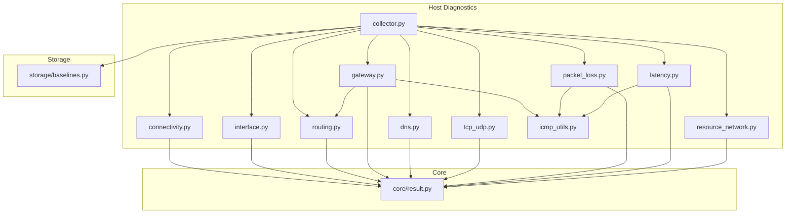
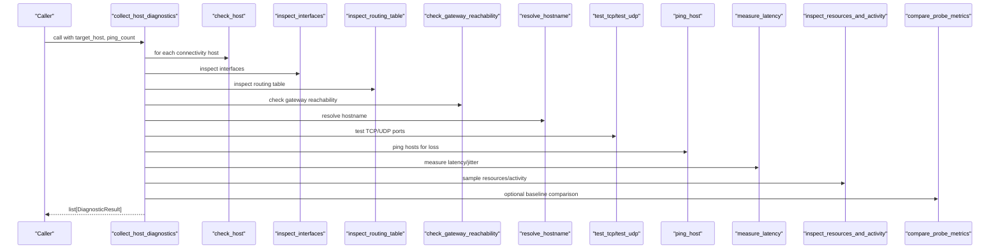
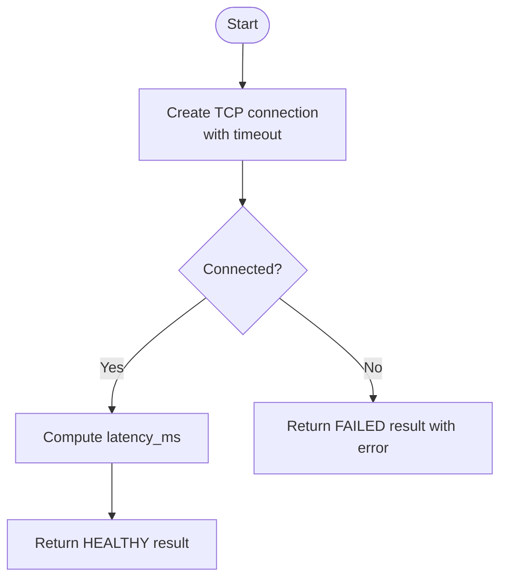
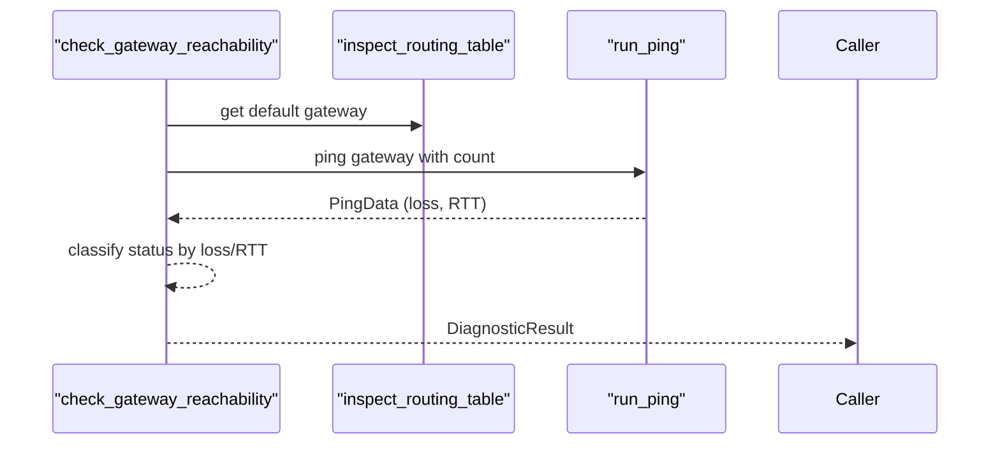
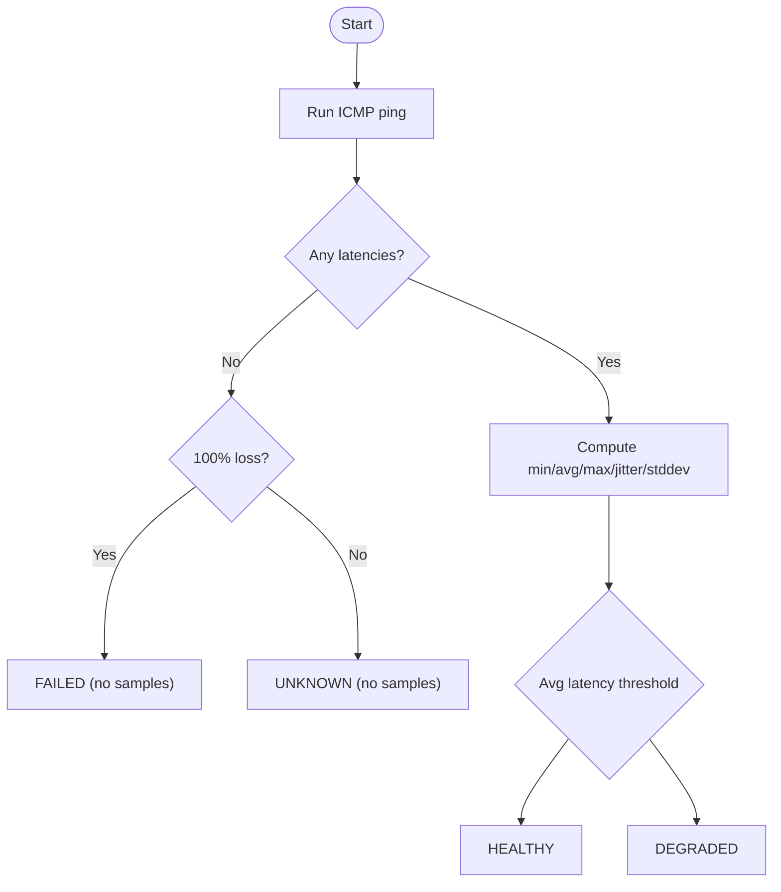
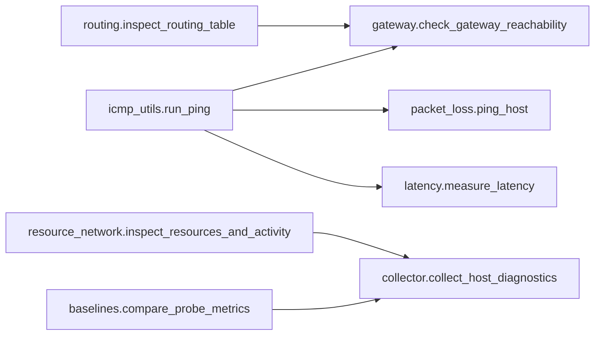

# Host Diagnostics

<cite>
**Referenced Files in This Document**
- [collector.py](file://diagnostics/host/collector.py)
- [connectivity.py](file://diagnostics/host/connectivity.py)
- [interface.py](file://diagnostics/host/interface.py)
- [routing.py](file://diagnostics/host/routing.py)
- [gateway.py](file://diagnostics/host/gateway.py)
- [dns.py](file://diagnostics/host/dns.py)
- [tcp_udp.py](file://diagnostics/host/tcp_udp.py)
- [packet_loss.py](file://diagnostics/host/packet_loss.py)
- [latency.py](file://diagnostics/host/latency.py)
- [icmp_utils.py](file://diagnostics/host/icmp_utils.py)
- [resource_network.py](file://diagnostics/host/resource_network.py)
- [result.py](file://core/result.py)
- [baselines.py](file://storage/baselines.py)
- [README.md](file://README.md)
</cite>

## Table of Contents
1. Introduction
2. Project Structure
3. Core Components
4. Architecture Overview
5. Detailed Component Analysis
6. Dependency Analysis
7. Performance Considerations
8. Troubleshooting Guide
9. Conclusion
10. Appendices

## Introduction
This document provides comprehensive documentation for the NetForge host diagnostics module. It explains how to run and interpret a complete suite of host-level network diagnostics, including connectivity checks, interface inspection, routing table analysis, gateway reachability, DNS resolution testing, TCP/UDP transport testing, packet loss measurement, latency and jitter analysis, and resource utilization monitoring. It also covers configuration options, output formats, performance considerations, best practices, and common troubleshooting scenarios.

The host diagnostics are orchestrated by a single collector that runs multiple probes and returns standardized results suitable for rule evaluation or API consumption.

**Section sources**
- [README.md:1-22](file://README.md#L1-L22)

## Project Structure
The host diagnostics live under diagnostics/host and are coordinated by a collector. Each diagnostic is implemented as a focused module returning a standardized result object. A shared ICMP utility centralizes ping execution and parsing, while baselines provide rolling comparisons for selected metrics.

**Diagram sources**
- [collector.py:16-60](file://diagnostics/host/collector.py#L16-L60)
- [connectivity.py:16-65](file://diagnostics/host/connectivity.py#L16-L65)
- [interface.py:16-109](file://diagnostics/host/interface.py#L16-L109)
- [routing.py:81-175](file://diagnostics/host/routing.py#L81-L175)
- [gateway.py:15-94](file://diagnostics/host/gateway.py#L15-L94)
- [dns.py:21-147](file://diagnostics/host/dns.py#L21-L147)
- [tcp_udp.py:16-182](file://diagnostics/host/tcp_udp.py#L16-L182)
- [packet_loss.py:14-77](file://diagnostics/host/packet_loss.py#L14-L77)
- [latency.py:14-81](file://diagnostics/host/latency.py#L14-L81)
- [icmp_utils.py:68-115](file://diagnostics/host/icmp_utils.py#L68-L115)
- [resource_network.py:16-106](file://diagnostics/host/resource_network.py#L16-L106)
- [result.py:24-47](file://core/result.py#L24-L47)
- [baselines.py:94-137](file://storage/baselines.py#L94-L137)

**Section sources**
- [collector.py:16-60](file://diagnostics/host/collector.py#L16-L60)
- [result.py:24-47](file://core/result.py#L24-L47)

## Core Components
- Orchestrator: collect_host_diagnostics runs all host probes and optionally compares metrics against rolling baselines.
- Connectivity: check_host performs TCP connect to a target port and measures connection time.
- Interface inspection: inspect_interfaces enumerates NICs, addresses, MAC, speed, MTU, and operational state.
- Routing: inspect_routing_table executes OS-specific commands to parse default gateway and route counts.
- Gateway reachability: check_gateway_reachability pings the default gateway (or provided address) and classifies health based on loss and RTT.
- DNS: resolve_hostname resolves a hostname; get_dns_servers discovers configured DNS servers per OS.
- Transport: test_tcp and test_udp probe TCP ports and UDP services (DNS/NTP or generic datagram).
- Packet loss: ping_host measures ICMP packet loss with thresholds for healthy/degraded/failed.
- Latency and jitter: measure_latency uses ICMP to compute min/avg/max/jitter/stddev and classifies status.
- Resource utilization: inspect_resources_and_activity samples CPU, memory, and network counters to detect saturation and active drops/errors.

All components return DiagnosticResult objects with consistent fields: module, category, status, severity, summary, target, metrics, evidence, warnings, errors, metadata.

**Section sources**
- [collector.py:16-60](file://diagnostics/host/collector.py#L16-L60)
- [connectivity.py:16-65](file://diagnostics/host/connectivity.py#L16-L65)
- [interface.py:16-109](file://diagnostics/host/interface.py#L16-L109)
- [routing.py:81-175](file://diagnostics/host/routing.py#L81-L175)
- [gateway.py:15-94](file://diagnostics/host/gateway.py#L15-L94)
- [dns.py:21-147](file://diagnostics/host/dns.py#L21-L147)
- [tcp_udp.py:16-182](file://diagnostics/host/tcp_udp.py#L16-L182)
- [packet_loss.py:14-77](file://diagnostics/host/packet_loss.py#L14-L77)
- [latency.py:14-81](file://diagnostics/host/latency.py#L14-L81)
- [resource_network.py:16-106](file://diagnostics/host/resource_network.py#L16-L106)
- [result.py:24-47](file://core/result.py#L24-L47)

## Architecture Overview
The host diagnostics follow a modular design: each diagnostic is self-contained and returns a standardized result. The collector composes these into a full diagnostic run and can compare key metrics against rolling baselines.

**Diagram sources**
- [collector.py:16-60](file://diagnostics/host/collector.py#L16-L60)
- [baselines.py:94-137](file://storage/baselines.py#L94-L137)

## Detailed Component Analysis

### Connectivity Check (TCP reachability)
- Purpose: Verify TCP reachability to a host:port and measure connection latency.
- Parameters:
  - host: string (target hostname or IP)
  - port: integer (default 443)
  - timeout: float seconds (default 3.0)
- Output: DiagnosticResult with metrics.port, metrics.latency_ms, evidence describing success/failure.
- Status logic: HEALTHY if connection succeeds within timeout; FAILED otherwise.

**Diagram sources**
- [connectivity.py:16-65](file://diagnostics/host/connectivity.py#L16-L65)

**Section sources**
- [connectivity.py:16-65](file://diagnostics/host/connectivity.py#L16-L65)

### Interface Inspection
- Purpose: Enumerate network interfaces, their addresses, MAC, speed, MTU, and operational state.
- Parameters: none
- Output: List of DiagnosticResult per interface with metrics.is_up, metrics.speed_mbps, metrics.mtu, metrics.ipv4, metrics.ipv6, metrics.mac.
- Status logic: HEALTHY if up; HEALTHY if down but another interface is up; FAILED if no interface is up.

**Section sources**
- [interface.py:16-109](file://diagnostics/host/interface.py#L16-L109)

### Routing Table Analysis
- Purpose: Parse OS routing tables to find default gateway and count active routes.
- Parameters: none
- Output: DiagnosticResult with metrics.os, metrics.route_count, metrics.default_gateway, metrics.default_interface, metadata.raw_output.
- Behavior: Executes platform-specific commands and parses output; supports Windows, Linux, macOS.

**Section sources**
- [routing.py:81-175](file://diagnostics/host/routing.py#L81-L175)

### Gateway Reachability
- Purpose: Ping the default gateway (or explicit address) and classify reachability.
- Parameters:
  - gateway: optional string (defaults to default gateway from routing table)
  - count: integer (default 4)
- Output: DiagnosticResult with metrics.packet_loss_percent, avg/min/max/jitter ms, packets_sent.
- Status logic: CRITICAL if unreachable (>=99% loss), DEGRADED if partial loss, HEALTHY if reachable.

**Diagram sources**
- [gateway.py:15-94](file://diagnostics/host/gateway.py#L15-L94)
- [routing.py:81-175](file://diagnostics/host/routing.py#L81-L175)
- [icmp_utils.py:68-115](file://diagnostics/host/icmp_utils.py#L68-L115)

**Section sources**
- [gateway.py:15-94](file://diagnostics/host/gateway.py#L15-L94)

### DNS Resolution Testing
- Purpose: Resolve a hostname and discover configured DNS servers.
- Parameters:
  - hostname: string (default google.com)
- Output: DiagnosticResult with metrics.resolution_time_ms, metrics.address_count, metrics.addresses; augmented with metrics.dns_servers and evidence listing configured servers.
- Behavior: Uses OS-specific methods to discover DNS servers; falls back to /etc/resolv.conf on non-Windows/macOS.

**Section sources**
- [dns.py:21-147](file://diagnostics/host/dns.py#L21-L147)

### TCP/UDP Transport Testing
- Purpose: Test TCP port reachability and UDP service reachability (DNS/NTP or generic).
- Parameters:
  - test_tcp(host, port, timeout=3.0)
  - test_udp(host, port=53, timeout=3.0)
- Output: DiagnosticResult with metrics.protocol, metrics.port, metrics.latency_ms (when applicable), and evidence describing outcome.
- Behavior: For UDP port 53 sends a DNS query; for 123 sends an NTP request; other ports send a datagram and treat timeouts as informational unless protocol expects reply.

**Section sources**
- [tcp_udp.py:16-182](file://diagnostics/host/tcp_udp.py#L16-L182)

### Packet Loss Measurement
- Purpose: Measure ICMP packet loss to a host.
- Parameters:
  - host: string
  - count: integer (default 5)
- Output: DiagnosticResult with metrics.packet_loss_percent, metrics.packets_sent.
- Status logic: HEALTHY at 0%, DEGRADED below 20%, FAILED at or above 20%.

**Section sources**
- [packet_loss.py:14-77](file://diagnostics/host/packet_loss.py#L14-L77)

### Latency and Jitter Analysis
- Purpose: Measure ICMP round-trip latency and compute jitter and standard deviation.
- Parameters:
  - host: string
  - count: integer (default 5)
- Output: DiagnosticResult with metrics.min_ms, avg_ms, max_ms, jitter_ms (RFC 3550), std_dev_ms, samples.
- Status logic: HEALTHY for low average latency; DEGRADED for higher averages; thresholds applied internally.

**Diagram sources**
- [latency.py:14-81](file://diagnostics/host/latency.py#L14-L81)
- [icmp_utils.py:68-115](file://diagnostics/host/icmp_utils.py#L68-L115)

**Section sources**
- [latency.py:14-81](file://diagnostics/host/latency.py#L14-L81)

### Resource Utilization Monitoring
- Purpose: Sample CPU, memory, and network counters over a short interval to detect saturation and active drops/errors.
- Parameters:
  - interval: float seconds (default 1.0)
- Output: Two DiagnosticResults:
  - resource_network: metrics.cpu_percent, memory_percent, memory_available_mb, boot_cumulative_errors/drops, active_errors_per_sec, active_drops_per_sec.
  - network_activity: rx/tx bytes and packets per second, rx/tx errors and drops per second.
- Status logic: HEALTHY/DEGRADED/FAILED based on CPU/memory thresholds and presence of active drops/errors.

**Section sources**
- [resource_network.py:16-106](file://diagnostics/host/resource_network.py#L16-L106)

### Baseline Comparison (Optional)
- Purpose: Compare latency and packet loss metrics against rolling baselines to detect deviations.
- Parameters: invoked automatically by collector when include_baselines=True.
- Output: Additional DiagnosticResult entries with module "baseline_delta", including current value, baseline mean, ratio, and deviation flag.

**Section sources**
- [baselines.py:94-137](file://storage/baselines.py#L94-L137)

## Dependency Analysis
- ICMP utility: Shared by gateway, packet loss, and latency modules to execute ping and parse outputs.
- Routing dependency: Gateway reachability depends on routing table parsing to identify the default gateway.
- Result model: All diagnostics depend on core.result.DiagnosticResult for uniform output.
- Baselines: Optional comparison depends on storage.history.HistoryStore via storage.baselines.compare_probe_metrics.

**Diagram sources**
- [icmp_utils.py:68-115](file://diagnostics/host/icmp_utils.py#L68-L115)
- [gateway.py:15-94](file://diagnostics/host/gateway.py#L15-L94)
- [packet_loss.py:14-77](file://diagnostics/host/packet_loss.py#L14-L77)
- [latency.py:14-81](file://diagnostics/host/latency.py#L14-L81)
- [routing.py:81-175](file://diagnostics/host/routing.py#L81-L175)
- [resource_network.py:16-106](file://diagnostics/host/resource_network.py#L16-L106)
- [baselines.py:94-137](file://storage/baselines.py#L94-L137)

**Section sources**
- [icmp_utils.py:68-115](file://diagnostics/host/icmp_utils.py#L68-L115)
- [gateway.py:15-94](file://diagnostics/host/gateway.py#L15-L94)
- [packet_loss.py:14-77](file://diagnostics/host/packet_loss.py#L14-L77)
- [latency.py:14-81](file://diagnostics/host/latency.py#L14-L81)
- [routing.py:81-175](file://diagnostics/host/routing.py#L81-L175)
- [resource_network.py:16-106](file://diagnostics/host/resource_network.py#L16-L106)
- [baselines.py:94-137](file://storage/baselines.py#L94-L137)

## Performance Considerations
- Use caching: ICMP runs cache results for 15 seconds to avoid redundant pings during a single diagnostic run.
- Limit probe counts: Reduce ping_count to shorten runtime when frequent checks are needed.
- Prefer targeted probes: Run only necessary diagnostics (e.g., specific ports) instead of the full suite in tight loops.
- Avoid high intervals: Resource sampling interval defaults to 1.0s; increasing it increases accuracy but also runtime.
- Batch operations: The collector orchestrates probes efficiently; prefer using it rather than calling individual functions repeatedly.

[No sources needed since this section provides general guidance]

## Troubleshooting Guide
- No default gateway found:
  - Symptom: Gateway reachability reports no usable default gateway.
  - Action: Inspect routing table and ensure a default route exists; verify interface is up.
  - References: routing table parsing and gateway reachability classification.

- DNS resolution failures:
  - Symptom: DNS resolution fails or returns no addresses.
  - Action: Check configured DNS servers and network connectivity to them; validate hostname spelling.
  - References: DNS server discovery and resolution.

- High packet loss or latency:
  - Symptom: Packet loss >0% or elevated average latency.
  - Action: Investigate link quality, congestion, or upstream issues; compare against baselines if enabled.
  - References: packet loss thresholds and latency classification.

- UDP timeouts:
  - Symptom: UDP tests to port 53 or 123 time out.
  - Action: Confirm service availability and firewall rules; for other ports, timeouts may be expected.
  - References: UDP behavior for DNS/NTP vs generic ports.

- Resource saturation:
  - Symptom: CPU or memory near 100%, or active packet drops/errors.
  - Action: Identify heavy processes, reduce load, or investigate NIC/driver issues causing drops/errors.
  - References: resource utilization thresholds and drop/error detection.

**Section sources**
- [gateway.py:15-94](file://diagnostics/host/gateway.py#L15-L94)
- [routing.py:81-175](file://diagnostics/host/routing.py#L81-L175)
- [dns.py:21-147](file://diagnostics/host/dns.py#L21-L147)
- [packet_loss.py:14-77](file://diagnostics/host/packet_loss.py#L14-L77)
- [latency.py:14-81](file://diagnostics/host/latency.py#L14-L81)
- [tcp_udp.py:89-182](file://diagnostics/host/tcp_udp.py#L89-L182)
- [resource_network.py:16-106](file://diagnostics/host/resource_network.py#L16-L106)

## Conclusion
The NetForge host diagnostics module provides a cohesive, extensible set of probes to assess host networking health. By combining connectivity, interface, routing, gateway, DNS, transport, packet loss, latency/jitter, and resource monitoring, it enables rapid identification and diagnosis of common network issues. Results are standardized and can be compared against rolling baselines to detect trends and anomalies.

[No sources needed since this section summarizes without analyzing specific files]

## Appendices

### Common Troubleshooting Scenarios and Interpretation
- Scenario: Outbound web traffic failing
  - Steps:
    - Run connectivity checks to common HTTPS endpoints.
    - Validate DNS resolution for domain names.
    - Test TCP reachability to ports 80/443.
    - Check gateway reachability and routing table.
  - Interpretation:
    - If DNS fails but connectivity is fine, focus on DNS servers or resolver configuration.
    - If gateway is unreachable, check local link and switch/router status.

- Scenario: Intermittent packet loss
  - Steps:
    - Increase ping count to stabilize measurements.
    - Review baseline deltas for recent spikes.
    - Inspect resource activity for drops/errors.
  - Interpretation:
    - Persistent loss indicates link or upstream issues.
    - Spikes correlated with high CPU/RAM suggest host resource constraints.

- Scenario: High latency to external services
  - Steps:
    - Measure latency to multiple targets (e.g., public resolvers).
    - Compare against baselines.
    - Check gateway and interface stats for errors/drops.
  - Interpretation:
    - Elevated latency across many targets suggests WAN congestion.
    - Isolated latency points to path-specific issues.

[No sources needed since this section provides conceptual guidance]