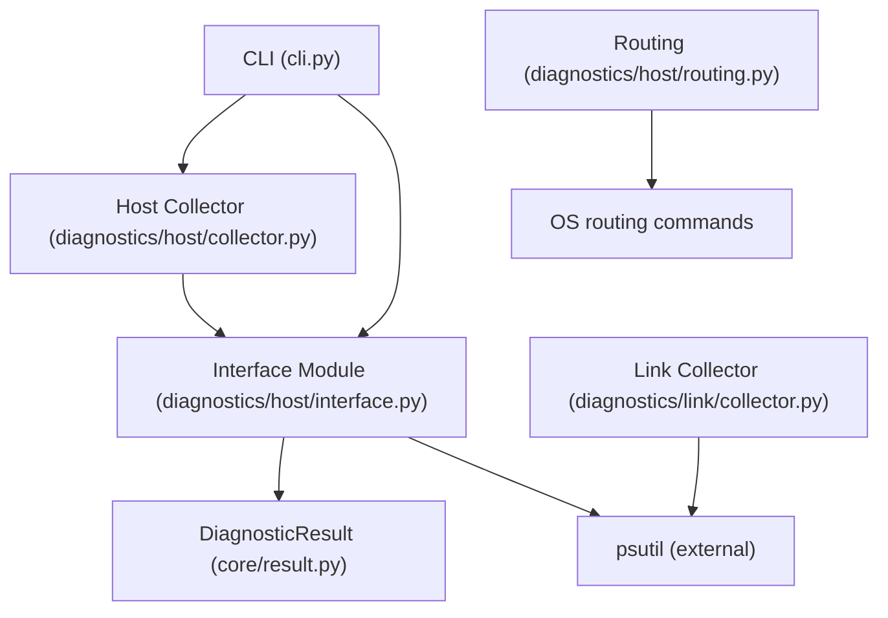
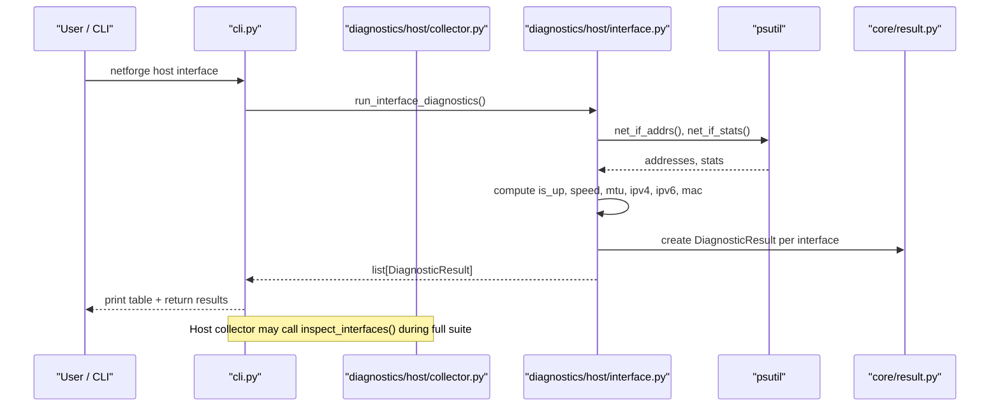
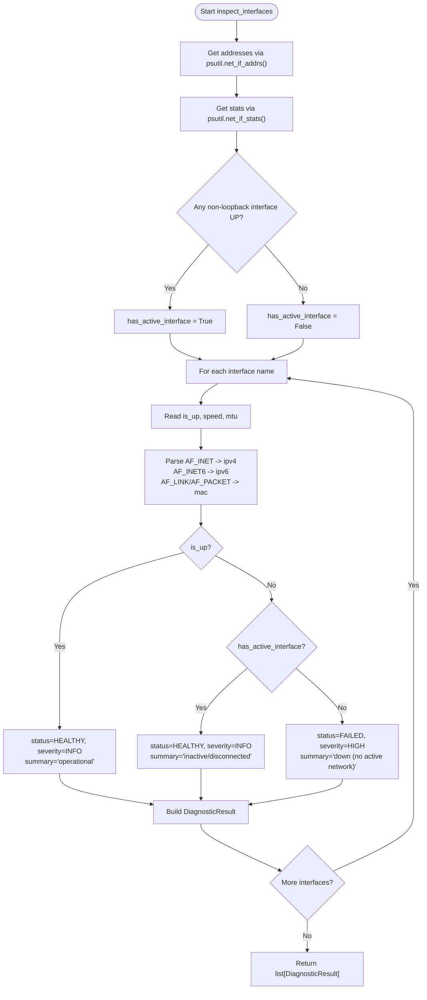
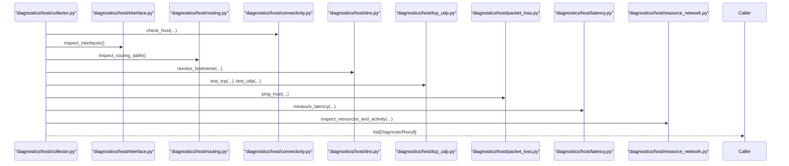
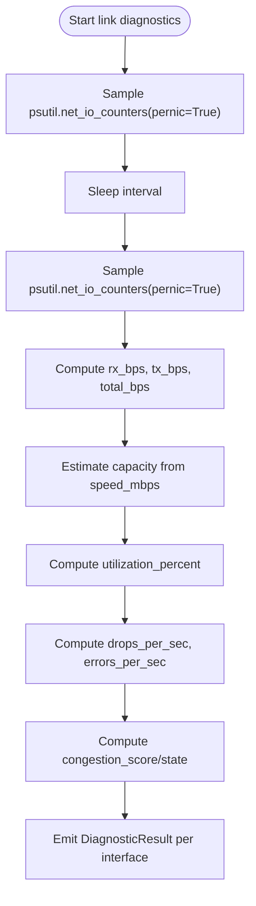
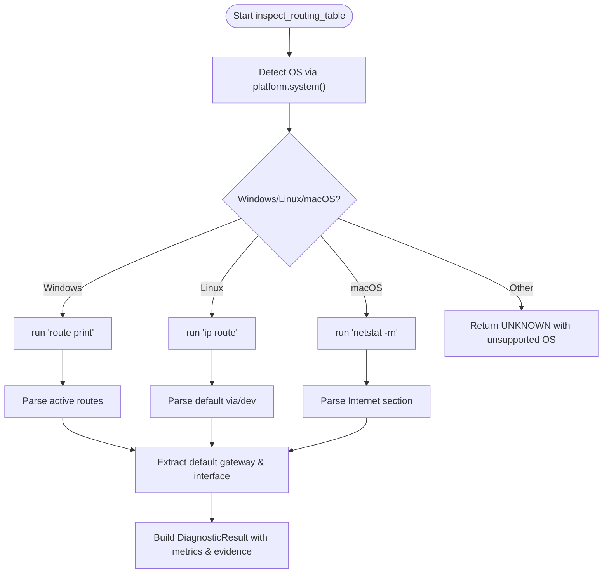
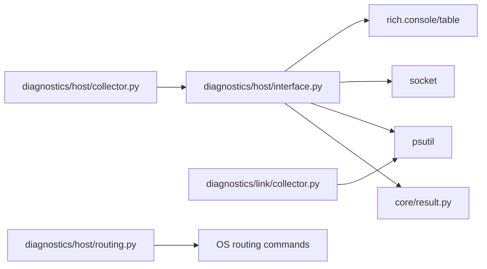

# Interface Inspection

<cite>
**Referenced Files in This Document**
- [interface.py](file://diagnostics/host/interface.py)
- [collector.py](file://diagnostics/host/collector.py)
- [result.py](file://core/result.py)
- [link_collector.py](file://diagnostics/link/collector.py)
- [routing.py](file://diagnostics/host/routing.py)
- [cli.py](file://cli.py)
- [README.md](file://README.md)
</cite>

## Table of Contents
1. [Introduction](#introduction)
2. [Project Structure](#project-structure)
3. [Core Components](#core-components)
4. [Architecture Overview](#architecture-overview)
5. [Detailed Component Analysis](#detailed-component-analysis)
6. [Dependency Analysis](#dependency-analysis)
7. [Performance Considerations](#performance-considerations)
8. [Troubleshooting Guide](#troubleshooting-guide)
9. [Conclusion](#conclusion)
10. [Appendices](#appendices)

## Introduction
This document explains the interface inspection diagnostic module that discovers, enumerates, and analyzes local network interfaces. It covers how IP addresses, MAC addresses, link status, and operational state are collected; what metrics are gathered; how results are structured and presented; and how to interpret diagnostics for common issues such as disconnected cables, misconfigured IPs, and interface errors. It also includes platform-specific considerations and performance impact notes for interface enumeration.

## Project Structure
The interface inspection functionality is implemented under host-level diagnostics and integrates with CLI entry points and a shared result model used across modules.

**Diagram sources**
- [cli.py:46-110](file://cli.py#L46-L110)
- [collector.py:16-61](file://diagnostics/host/collector.py#L16-L61)
- [interface.py:16-147](file://diagnostics/host/interface.py#L16-L147)
- [result.py:24-47](file://core/result.py#L24-L47)
- [link_collector.py:29-129](file://diagnostics/link/collector.py#L29-L129)
- [routing.py:81-175](file://diagnostics/host/routing.py#L81-L175)

**Section sources**
- [README.md:1-22](file://README.md#L1-L22)
- [cli.py:46-110](file://cli.py#L46-L110)
- [collector.py:16-61](file://diagnostics/host/collector.py#L16-L61)

## Core Components
- Interface discovery and analysis: Discovers all network interfaces, collects per-interface attributes, determines operational state, and produces standardized diagnostic results.
- Host diagnostics collector: Orchestrates multiple host-level probes including interface inspection, routing, DNS, connectivity, transport, packet loss, latency, and resource usage.
- Shared result model: Provides a consistent structure for diagnostic outcomes, including status, severity, summary, target, metrics, evidence, warnings, errors, and metadata.
- Link-level collectors: Measure utilization, errors, and congestion on active interfaces to complement interface inspection.
- Routing inspector: Determines default gateway and associated interface via OS-specific commands.

**Section sources**
- [interface.py:16-147](file://diagnostics/host/interface.py#L16-L147)
- [collector.py:16-61](file://diagnostics/host/collector.py#L16-L61)
- [result.py:24-47](file://core/result.py#L24-L47)
- [link_collector.py:29-129](file://diagnostics/link/collector.py#L29-L129)
- [routing.py:81-175](file://diagnostics/host/routing.py#L81-L175)

## Architecture Overview
The interface inspection flow starts from the CLI or programmatic calls, invokes the interface module to enumerate and analyze interfaces, and returns a list of DiagnosticResult objects. These can be consumed by higher-level orchestration (e.g., host collector) or rule engines for root-cause diagnosis.

**Diagram sources**
- [cli.py:52-55](file://cli.py#L52-L55)
- [interface.py:16-147](file://diagnostics/host/interface.py#L16-L147)
- [collector.py:32-32](file://diagnostics/host/collector.py#L32-L32)
- [result.py:24-47](file://core/result.py#L24-L47)

## Detailed Component Analysis

### Interface Discovery and Analysis
- Discovery: Uses psutil to retrieve all interfaces and their addresses and statistics.
- Metrics collected per interface:
  - Operational state: whether the interface is up or down.
  - Speed: reported link speed in Mbps when available.
  - MTU: maximum transmission unit if provided.
  - IPv4 addresses: list of assigned IPv4 addresses.
  - IPv6 addresses: list of assigned IPv6 addresses.
  - MAC address: link-layer address when available on the platform.
- Status determination:
  - HEALTHY/INFO if the interface is up.
  - HEALTHY/INFO if the interface is down but another non-loopback interface is up (inactive adapter considered normal).
  - FAILED/HIGH if no non-loopback interface is operational on the system.
- Output format: Each interface becomes a DiagnosticResult with module="interface", category="host", plus metrics and evidence strings describing the interface state.

**Diagram sources**
- [interface.py:16-109](file://diagnostics/host/interface.py#L16-L109)

**Section sources**
- [interface.py:16-109](file://diagnostics/host/interface.py#L16-L109)

### Host Diagnostics Collector Integration
- The host collector orchestrates multiple diagnostics and includes interface inspection as part of the full host suite.
- It aggregates results from connectivity checks, interface inspection, routing, gateway reachability, DNS resolution, transport tests, packet loss, latency, and resource activity.
- Optional baseline comparison can be applied to probe metrics.

**Diagram sources**
- [collector.py:16-61](file://diagnostics/host/collector.py#L16-L61)

**Section sources**
- [collector.py:16-61](file://diagnostics/host/collector.py#L16-L61)

### Link-Level Complementary Diagnostics
- Utilization measurement: Samples per-interface byte counters over an interval to compute RX/TX throughput and utilization percentage relative to link capacity.
- Error measurement: Computes per-second drop and error rates using NIC counters.
- Congestion assessment: Combines utilization, drops, errors, and optional latency delta to derive a congestion score and state.

**Diagram sources**
- [link_collector.py:29-129](file://diagnostics/link/collector.py#L29-L129)

**Section sources**
- [link_collector.py:29-129](file://diagnostics/link/collector.py#L29-L129)

### Routing Inspector
- Determines default gateway and associated interface by parsing OS-specific routing table output.
- Supports Windows, Linux, and macOS with appropriate command selection and parsing logic.
- Returns a DiagnosticResult containing OS, route count, default gateway, default interface, and raw output metadata.

**Diagram sources**
- [routing.py:81-175](file://diagnostics/host/routing.py#L81-L175)

**Section sources**
- [routing.py:81-175](file://diagnostics/host/routing.py#L81-L175)

## Dependency Analysis
- External dependencies:
  - psutil: Used for interface enumeration, statistics, and I/O counters.
  - socket: Used for address family constants to detect IPv4, IPv6, and link-layer addresses.
  - rich: Used for console table rendering in CLI-facing functions.
- Internal dependencies:
  - core.result.DiagnosticResult: Standardized output model used across modules.
  - diagnostics.host.collector: Aggregates interface inspection with other host diagnostics.
  - diagnostics.link.collector: Complements interface inspection with utilization and error measurements.
  - diagnostics.host.routing: Provides routing context relevant to interface analysis.

**Diagram sources**
- [interface.py:1-11](file://diagnostics/host/interface.py#L1-L11)
- [collector.py:1-13](file://diagnostics/host/collector.py#L1-L13)
- [link_collector.py:1-14](file://diagnostics/link/collector.py#L1-L14)
- [routing.py:1-10](file://diagnostics/host/routing.py#L1-L10)
- [result.py:24-47](file://core/result.py#L24-L47)

**Section sources**
- [interface.py:1-11](file://diagnostics/host/interface.py#L1-L11)
- [collector.py:1-13](file://diagnostics/host/collector.py#L1-L13)
- [link_collector.py:1-14](file://diagnostics/link/collector.py#L1-L14)
- [routing.py:1-10](file://diagnostics/host/routing.py#L1-L10)
- [result.py:24-47](file://core/result.py#L24-L47)

## Performance Considerations
- Interface enumeration cost:
  - Calling psutil.net_if_addrs() and psutil.net_if_stats() is lightweight and typically fast; it queries OS-provided network information without generating traffic.
  - Platform differences: MAC address detection relies on AF_LINK or AF_PACKET availability; some platforms may not expose link-layer addresses, which avoids extra overhead but may reduce completeness.
- Sampling intervals:
  - Link utilization and error measurements use short sleep intervals to sample counters; longer intervals increase accuracy but also runtime.
- CPU and memory impact:
  - The interface inspection itself has minimal CPU/memory footprint.
  - Full host diagnostics include additional probes (connectivity, DNS, transport, packet loss, latency, resource sampling) that add overhead; consider selective runs for constrained environments.
- Concurrency:
  - Current implementation runs probes sequentially; parallelizing independent probes could reduce total runtime but must account for OS limits and potential contention on network resources.

[No sources needed since this section provides general guidance]

## Troubleshooting Guide
Common scenarios and how to interpret interface diagnostics:

- Disconnected cable or inactive interface:
  - Symptom: Interface shows DOWN; if at least one non-loopback interface is UP, the overall status remains HEALTHY/INFO for that interface.
  - Action: Check physical connections, switch port status, and driver state. Use routing inspection to confirm default gateway and interface association.
  - Evidence: Interface state DOWN; summary indicates inactive/disconnected.

- No active network interfaces:
  - Symptom: All non-loopback interfaces are DOWN; status set to FAILED/HIGH indicating no active network.
  - Action: Verify drivers, hardware, and configuration; ensure at least one interface is enabled and linked.
  - Evidence: Summary indicates down (no active network).

- Misconfigured IP addresses:
  - Symptom: Interface is UP but lacks expected IPv4/IPv6 addresses or has unexpected addresses.
  - Action: Validate DHCP/static configuration; verify subnet masks and DNS settings; cross-check with routing table to ensure correct interface selection for default gateway.
  - Evidence: Metrics lists ipv4 and ipv6 arrays; compare against expected configuration.

- Interface errors and drops:
  - Symptom: Elevated per-second error or drop rates detected by link-level diagnostics.
  - Action: Inspect cabling, duplex settings, wireless interference, and NIC firmware; check switch logs for CRC/FCS errors.
  - Evidence: Link error metrics show drops_per_sec and errors_per_sec; congestion state may indicate severe conditions.

- Default gateway issues:
  - Symptom: Routing inspection fails to find a default gateway or associates it with an unexpected interface.
  - Action: Review routing table entries; ensure correct interface is selected for outbound traffic; verify gateway reachability.
  - Evidence: Routing result contains default_gateway and default_interface; raw output preserved in metadata for debugging.

**Section sources**
- [interface.py:72-109](file://diagnostics/host/interface.py#L72-L109)
- [link_collector.py:87-129](file://diagnostics/link/collector.py#L87-L129)
- [routing.py:131-161](file://diagnostics/host/routing.py#L131-L161)

## Conclusion
The interface inspection module provides a robust, platform-aware mechanism to discover and analyze network interfaces, capturing essential attributes like IP addresses, MAC addresses, link speed, MTU, and operational state. It integrates seamlessly into the broader host diagnostics suite and complements link-level measurements for utilization, errors, and congestion. By interpreting the standardized DiagnosticResult outputs and leveraging routing and link diagnostics, users can quickly identify and resolve common network issues such as disconnected cables, misconfigured IPs, and interface errors while understanding platform-specific behaviors and performance implications.

[No sources needed since this section summarizes without analyzing specific files]

## Appendices

### CLI Usage
- Run interface inspection directly:
  - Command: netforge host interface
- Run full host diagnostics suite (includes interface inspection):
  - Command: netforge host all
- Run intelligent diagnosis combining host, link, and path observations:
  - Commands: netforge diagnose host, netforge diagnose link, netforge diagnose all

**Section sources**
- [cli.py:52-55](file://cli.py#L52-L55)
- [cli.py:112-190](file://cli.py#L112-L190)
- [cli.py:470-573](file://cli.py#L470-L573)

### Data Model Reference
- DiagnosticResult fields:
  - module: Identifies the diagnostic source (e.g., "interface").
  - category: High-level grouping (e.g., "host").
  - status: One of healthy, degraded, failed, unknown.
  - severity: One of info, low, medium, high, critical.
  - summary: Human-readable description of the outcome.
  - target: Specific entity (e.g., interface name).
  - metrics: Key-value pairs with numeric or string values (e.g., is_up, speed_mbps, mtu, ipv4, ipv6, mac).
  - evidence: List of descriptive strings supporting the result.
  - warnings/errors/metadata: Additional contextual data.

**Section sources**
- [result.py:24-47](file://core/result.py#L24-L47)