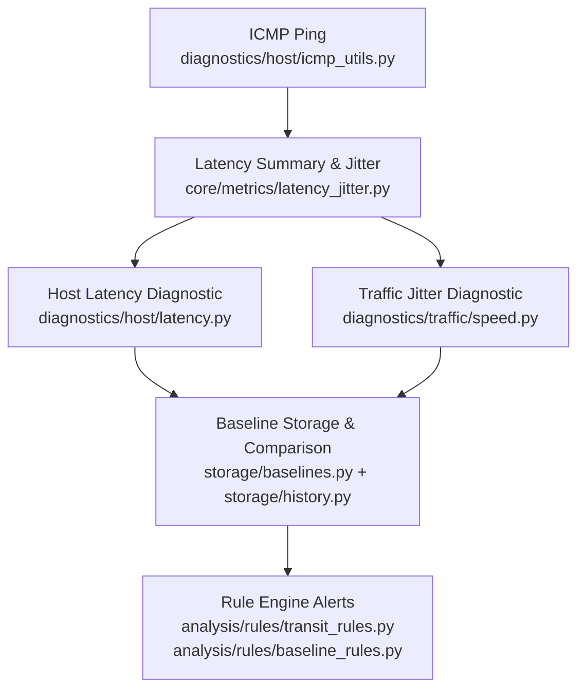
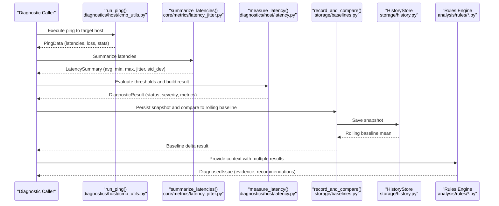
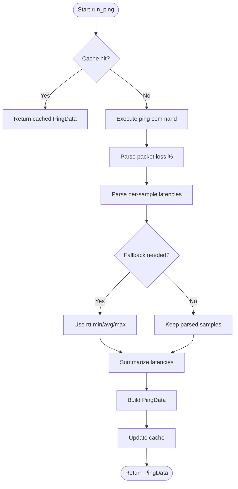
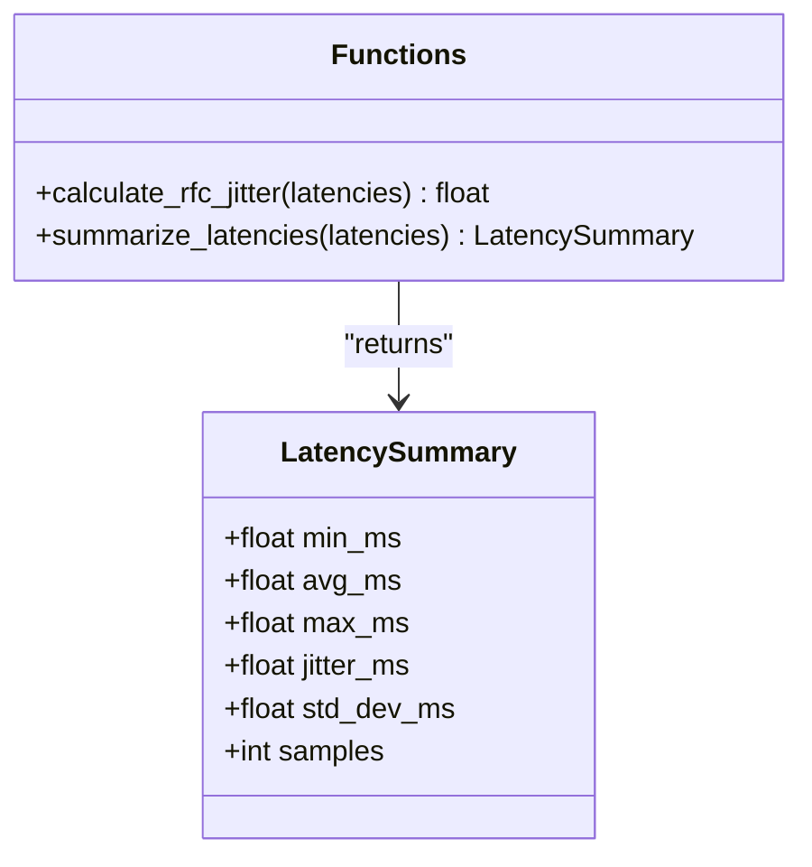
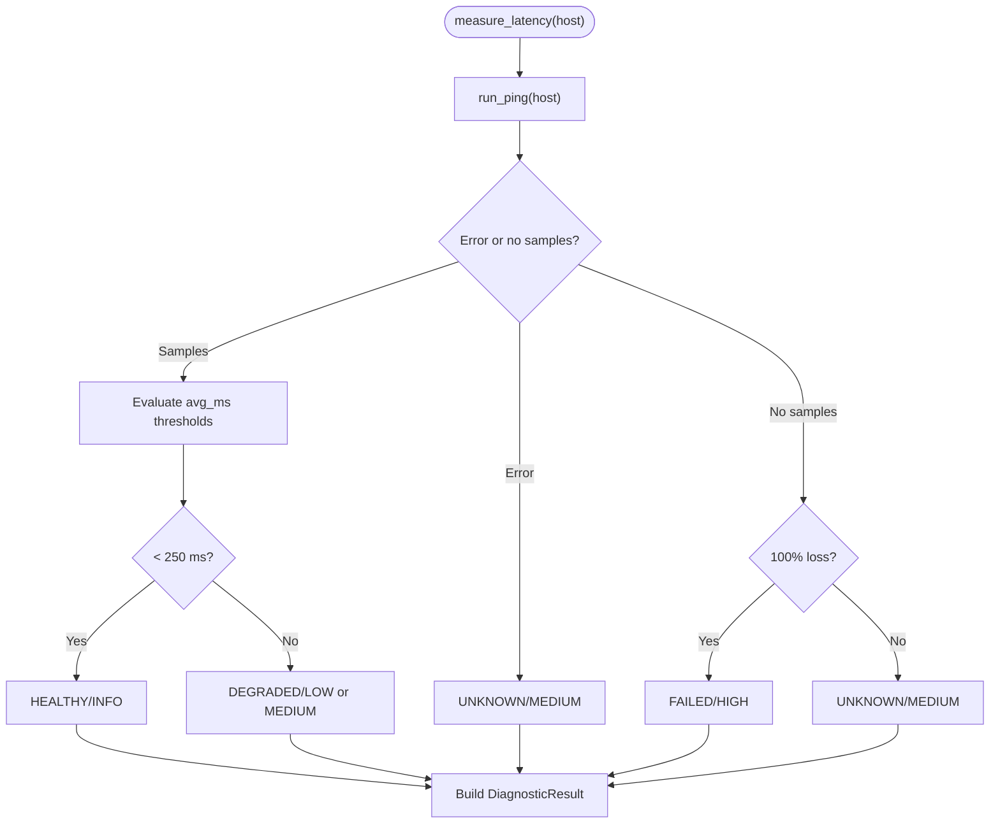
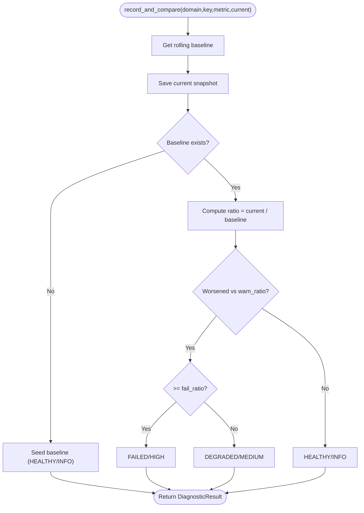
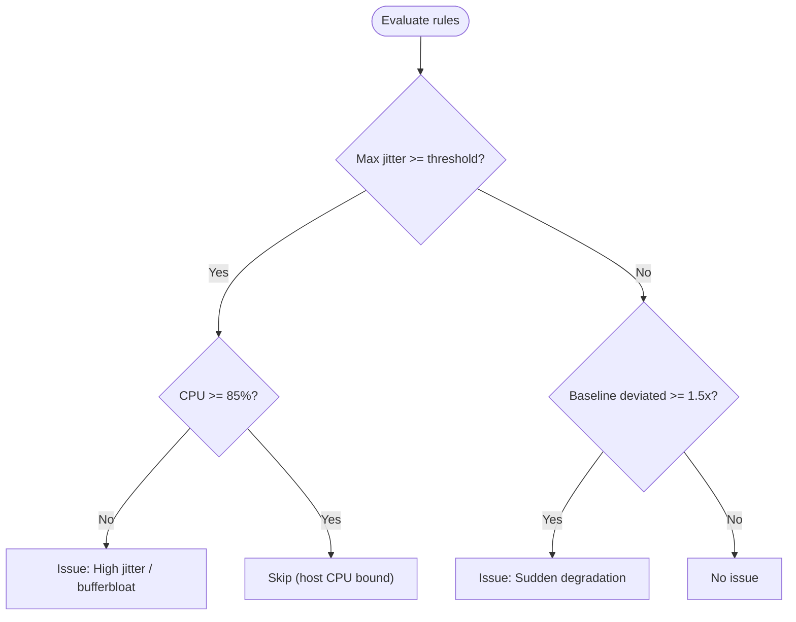
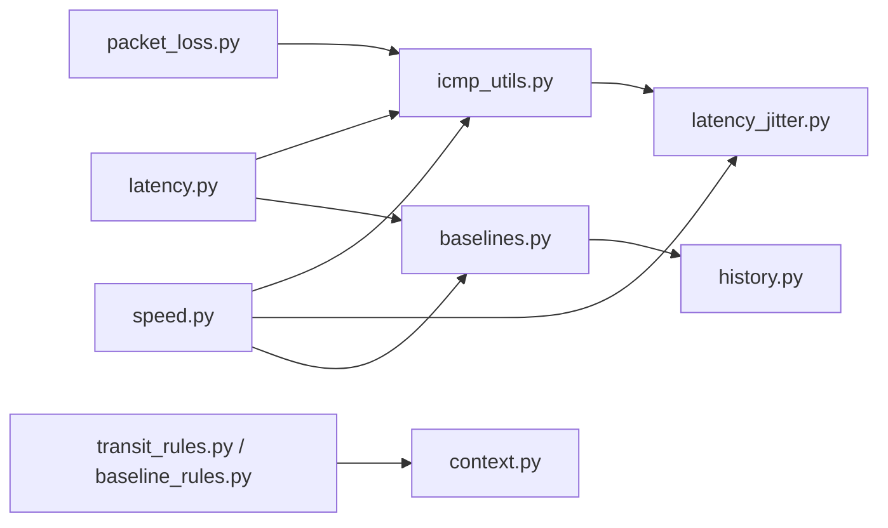

# Latency and Jitter Analysis

<cite>
**Referenced Files in This Document**
- [latency_jitter.py](file://core/metrics/latency_jitter.py)
- [icmp_utils.py](file://diagnostics/host/icmp_utils.py)
- [latency.py](file://diagnostics/host/latency.py)
- [packet_loss.py](file://diagnostics/host/packet_loss.py)
- [speed.py](file://diagnostics/traffic/speed.py)
- [context.py](file://analysis/context.py)
- [transit_rules.py](file://analysis/rules/transit_rules.py)
- [baseline_rules.py](file://analysis/rules/baseline_rules.py)
- [baselines.py](file://storage/baselines.py)
- [history.py](file://storage/history.py)
- [result.py](file://core/result.py)
</cite>

## Table of Contents
1. Introduction
2. Project Structure
3. Core Components
4. Architecture Overview
5. Detailed Component Analysis
6. Dependency Analysis
7. Performance Considerations
8. Troubleshooting Guide
9. Conclusion

## Introduction
This document explains how the system measures network latency, calculates jitter, and collects performance metrics over time to support diagnostics for real-time applications such as VoIP and gaming. It covers:
- How round-trip times are measured via ICMP ping and parsed across platforms
- How jitter is computed using RFC 3550 interarrival jitter (Packet Delay Variation)
- How metrics are summarized and stored for baseline comparison and alerting
- Thresholds used to classify health status and detect degraded conditions
- Practical examples for analyzing real-time application performance issues

## Project Structure
The latency and jitter analysis spans several modules:
- Measurement and parsing: ICMP ping execution and output parsing
- Metrics computation: RFC jitter calculation and summary statistics
- Diagnostics: Host-level latency and packet loss probes with thresholds
- Traffic-level jitter and speed measurement
- Baseline storage and comparison for trend-based alerting
- Rule engine integration for detecting high jitter and sudden degradation

**Diagram sources**
- [icmp_utils.py:68-115](file://diagnostics/host/icmp_utils.py#L68-L115)
- [latency_jitter.py:7-40](file://core/metrics/latency_jitter.py#L7-L40)
- [latency.py:14-81](file://diagnostics/host/latency.py#L14-L81)
- [speed.py:73-110](file://diagnostics/traffic/speed.py#L73-L110)
- [baselines.py:9-91](file://storage/baselines.py#L9-L91)
- [history.py:45-114](file://storage/history.py#L45-L114)
- [transit_rules.py:59-98](file://analysis/rules/transit_rules.py#L59-L98)
- [baseline_rules.py:9-48](file://analysis/rules/baseline_rules.py#L9-L48)

**Section sources**
- [icmp_utils.py:68-115](file://diagnostics/host/icmp_utils.py#L68-L115)
- [latency_jitter.py:7-40](file://core/metrics/latency_jitter.py#L7-L40)
- [latency.py:14-81](file://diagnostics/host/latency.py#L14-L81)
- [speed.py:73-110](file://diagnostics/traffic/speed.py#L73-L110)
- [baselines.py:9-91](file://storage/baselines.py#L9-L91)
- [history.py:45-114](file://storage/history.py#L45-L114)
- [transit_rules.py:59-98](file://analysis/rules/transit_rules.py#L59-L98)
- [baseline_rules.py:9-48](file://analysis/rules/baseline_rules.py#L9-L48)

## Core Components
- ICMP measurement and parsing: Executes platform-specific ping commands, parses per-sample latencies and packet loss, and returns structured results.
- Jitter and summary metrics: Computes RFC 3550 jitter and statistical summaries (min, avg, max, standard deviation).
- Host diagnostics: Applies thresholds to classify latency health and produce standardized diagnostic results.
- Traffic diagnostics: Measures jitter and download speed to complement host-level insights.
- Baseline comparison: Stores metric snapshots and compares current values against rolling baselines to detect deviations.
- Rule engine: Detects high jitter and sudden degradation based on collected metrics.

**Section sources**
- [icmp_utils.py:10-23](file://diagnostics/host/icmp_utils.py#L10-L23)
- [latency_jitter.py:7-40](file://core/metrics/latency_jitter.py#L7-L40)
- [latency.py:14-81](file://diagnostics/host/latency.py#L14-L81)
- [speed.py:22-110](file://diagnostics/traffic/speed.py#L22-L110)
- [baselines.py:9-91](file://storage/baselines.py#L9-L91)
- [transit_rules.py:59-98](file://analysis/rules/transit_rules.py#L59-L98)
- [baseline_rules.py:9-48](file://analysis/rules/baseline_rules.py#L9-L48)

## Architecture Overview
End-to-end flow from measurement to alerting:

**Diagram sources**
- [icmp_utils.py:68-115](file://diagnostics/host/icmp_utils.py#L68-L115)
- [latency_jitter.py:28-40](file://core/metrics/latency_jitter.py#L28-L40)
- [latency.py:14-81](file://diagnostics/host/latency.py#L14-L81)
- [baselines.py:9-91](file://storage/baselines.py#L9-L91)
- [history.py:45-114](file://storage/history.py#L45-L114)
- [transit_rules.py:59-98](file://analysis/rules/transit_rules.py#L59-L98)
- [baseline_rules.py:9-48](file://analysis/rules/baseline_rules.py#L9-L48)

## Detailed Component Analysis

### ICMP Measurement and Parsing
- Executes ping with platform-specific flags and captures stdout/stderr.
- Parses packet loss percentage and individual latency samples using regex patterns that handle multiple locales and formats.
- If no per-sample times are found, falls back to summary fields (min/avg/max) when available.
- Uses a short-lived cache to avoid redundant pings within a TTL window.

**Diagram sources**
- [icmp_utils.py:29-65](file://diagnostics/host/icmp_utils.py#L29-L65)
- [icmp_utils.py:68-115](file://diagnostics/host/icmp_utils.py#L68-L115)
- [latency_jitter.py:28-40](file://core/metrics/latency_jitter.py#L28-L40)

**Section sources**
- [icmp_utils.py:29-65](file://diagnostics/host/icmp_utils.py#L29-L65)
- [icmp_utils.py:68-115](file://diagnostics/host/icmp_utils.py#L68-L115)

### Jitter Calculation and Latency Summaries
- RFC 3550 jitter: Mean absolute difference between consecutive latency samples (Packet Delay Variation).
- Summary includes min, average, max, jitter, population standard deviation, and sample count.
- Empty or single-sample inputs return safe defaults.

**Diagram sources**
- [latency_jitter.py:7-40](file://core/metrics/latency_jitter.py#L7-L40)

**Section sources**
- [latency_jitter.py:7-40](file://core/metrics/latency_jitter.py#L7-L40)

### Host Latency Diagnostics
- Runs ping to one or more hosts and evaluates average latency against thresholds:
  - Below 100 ms: HEALTHY
  - 100–249 ms: HEALTHY
  - 250–399 ms: DEGRADED
  - 400+ ms: DEGRADED
- Produces a standardized DiagnosticResult including metrics, evidence, and metadata.
- Handles errors and 100% packet loss cases appropriately.

**Diagram sources**
- [latency.py:14-81](file://diagnostics/host/latency.py#L14-L81)

**Section sources**
- [latency.py:14-81](file://diagnostics/host/latency.py#L14-L81)

### Packet Loss Diagnostics
- Measures packet loss percentage via ping and classifies:
  - 0%: HEALTHY
  - <5%: DEGRADED/LOW
  - <20%: DEGRADED/MEDIUM
  - >=20%: FAILED/HIGH
- Returns standardized results with metrics and evidence.

**Section sources**
- [packet_loss.py:14-77](file://diagnostics/host/packet_loss.py#L14-L77)

### Traffic Jitter and Speed
- Traffic jitter uses ping to a public host without caching to capture current path conditions.
- Jitter thresholds:
  - >=50 ms: DEGRADED/MEDIUM
  - >=20 ms: DEGRADED/LOW
  - <20 ms: HEALTHY/INFO
- Download speed estimation provides additional context for bandwidth-related issues.

**Section sources**
- [speed.py:73-110](file://diagnostics/traffic/speed.py#L73-L110)
- [speed.py:22-70](file://diagnostics/traffic/speed.py#L22-L70)

### Baseline Establishment and Alerting
- Each probe result can be persisted and compared against a rolling baseline mean.
- Default thresholds:
  - Warn ratio: 1.5x baseline
  - Fail ratio: 2.5x baseline
- For latency and loss, higher values indicate worse performance.
- Baseline deltas feed into rule evaluation to detect sudden degradation.

**Diagram sources**
- [baselines.py:9-91](file://storage/baselines.py#L9-L91)
- [history.py:45-114](file://storage/history.py#L45-L114)

**Section sources**
- [baselines.py:9-91](file://storage/baselines.py#L9-L91)
- [history.py:45-114](file://storage/history.py#L45-L114)

### Rule-Based Detection of High Jitter and Sudden Degradation
- High jitter rule: Triggers when jitter exceeds a threshold and host CPU is not saturated, indicating network-induced delay variance (bufferbloat or congestion).
- Sudden degradation rule: Triggers when baseline deltas show significant worsening relative to recent history.

**Diagram sources**
- [transit_rules.py:59-98](file://analysis/rules/transit_rules.py#L59-L98)
- [baseline_rules.py:9-48](file://analysis/rules/baseline_rules.py#L9-L48)

**Section sources**
- [transit_rules.py:59-98](file://analysis/rules/transit_rules.py#L59-L98)
- [baseline_rules.py:9-48](file://analysis/rules/baseline_rules.py#L9-L48)

## Dependency Analysis
Key dependencies and relationships:
- icmp_utils depends on latency_jitter for summarization.
- latency and packet_loss depend on icmp_utils and produce DiagnosticResult objects.
- traffic speed/jitter also depend on icmp_utils and latency_jitter.
- baselines depend on history store to persist and retrieve snapshots.
- Rule modules depend on AnalysisContext to aggregate results and compute derived metrics.

**Diagram sources**
- [icmp_utils.py:68-115](file://diagnostics/host/icmp_utils.py#L68-L115)
- [latency_jitter.py:28-40](file://core/metrics/latency_jitter.py#L28-L40)
- [latency.py:14-81](file://diagnostics/host/latency.py#L14-L81)
- [packet_loss.py:14-77](file://diagnostics/host/packet_loss.py#L14-L77)
- [speed.py:73-110](file://diagnostics/traffic/speed.py#L73-L110)
- [baselines.py:9-91](file://storage/baselines.py#L9-L91)
- [history.py:45-114](file://storage/history.py#L45-L114)
- [context.py:7-199](file://analysis/context.py#L7-L199)
- [transit_rules.py:59-98](file://analysis/rules/transit_rules.py#L59-L98)
- [baseline_rules.py:9-48](file://analysis/rules/baseline_rules.py#L9-L48)

**Section sources**
- [icmp_utils.py:68-115](file://diagnostics/host/icmp_utils.py#L68-L115)
- [latency_jitter.py:28-40](file://core/metrics/latency_jitter.py#L28-L40)
- [latency.py:14-81](file://diagnostics/host/latency.py#L14-L81)
- [packet_loss.py:14-77](file://diagnostics/host/packet_loss.py#L14-L77)
- [speed.py:73-110](file://diagnostics/traffic/speed.py#L73-L110)
- [baselines.py:9-91](file://storage/baselines.py#L9-L91)
- [history.py:45-114](file://storage/history.py#L45-L114)
- [context.py:7-199](file://analysis/context.py#L7-L199)
- [transit_rules.py:59-98](file://analysis/rules/transit_rules.py#L59-L98)
- [baseline_rules.py:9-48](file://analysis/rules/baseline_rules.py#L9-L48)

## Performance Considerations
- Measurement cadence: The ICMP utility caches results for a short TTL to reduce overhead; disable caching for traffic jitter to reflect current path conditions.
- Sample size: Larger ping counts improve jitter stability but increase measurement duration.
- Baseline windows: Rolling baseline length affects sensitivity to recent changes; default limit is 20 samples.
- Threshold tuning: Adjust host latency thresholds and traffic jitter thresholds according to application requirements (e.g., stricter thresholds for interactive apps).
- Congestion scoring: Combine utilization, drop/error rates, and latency deltas to quantify overall congestion impact.

[No sources needed since this section provides general guidance]

## Troubleshooting Guide
Common issues and handling:
- Ping failures: Errors are captured and returned as UNKNOWN/MEDIUM with error details.
- 100% packet loss: Classified as FAILED/HIGH for latency diagnostics; indicates complete connectivity failure.
- No latency samples: When parsing fails, fallback to summary fields if available; otherwise treat as unknown.
- High jitter detection: If host CPU is high, jitter may be CPU-bound rather than network-induced; rule logic accounts for this.
- Baseline seeding: First measurements seed the baseline; subsequent runs compare against rolling means.

**Section sources**
- [latency.py:21-41](file://diagnostics/host/latency.py#L21-L41)
- [packet_loss.py:21-45](file://diagnostics/host/packet_loss.py#L21-L45)
- [icmp_utils.py:29-65](file://diagnostics/host/icmp_utils.py#L29-L65)
- [transit_rules.py:64-71](file://analysis/rules/transit_rules.py#L64-L71)
- [baselines.py:33-49](file://storage/baselines.py#L33-L49)

## Conclusion
The system provides a robust pipeline for measuring latency, computing jitter, and tracking performance over time. It combines direct ICMP-based measurements with statistical summaries, baseline comparisons, and rule-based alerts to identify degraded conditions such as high jitter and sudden latency spikes. By configuring thresholds and leveraging baseline deltas, operators can proactively detect and address issues affecting real-time applications like VoIP and gaming.

[No sources needed since this section summarizes without analyzing specific files]