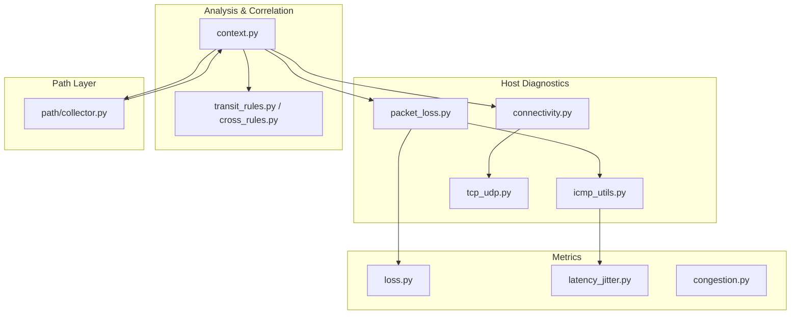
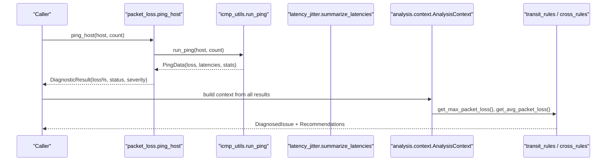
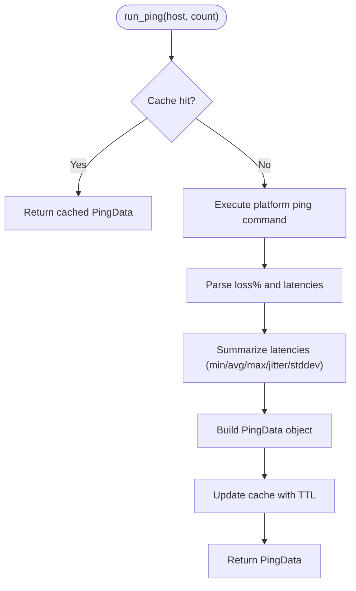
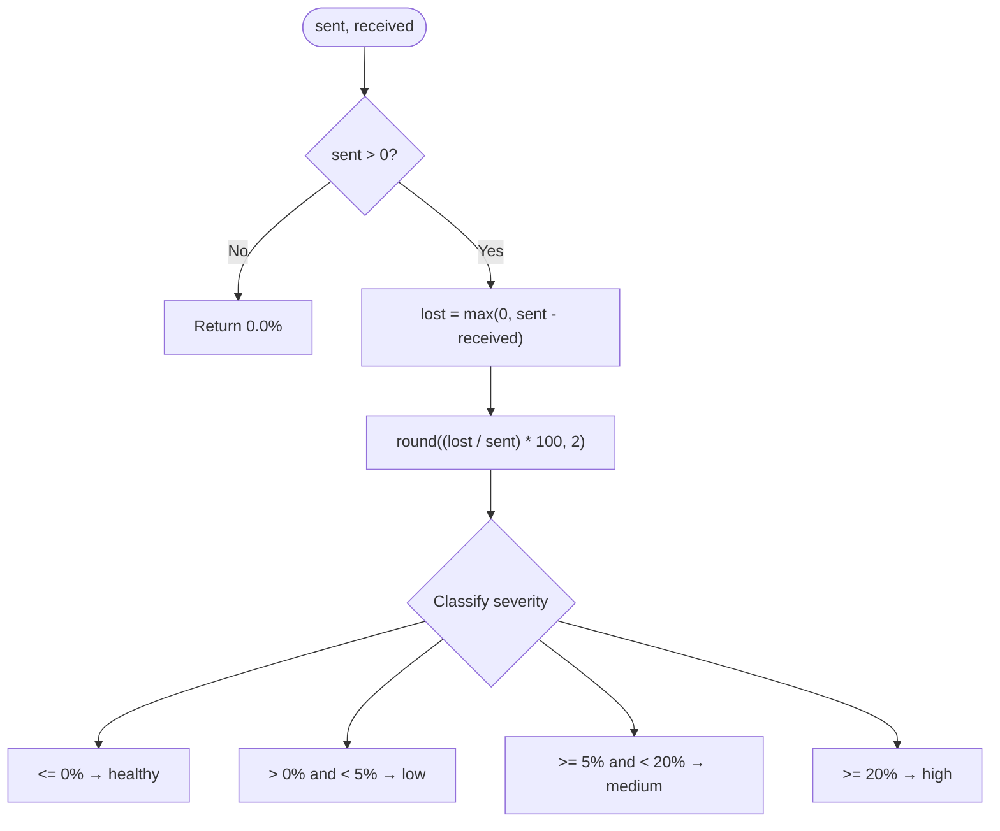
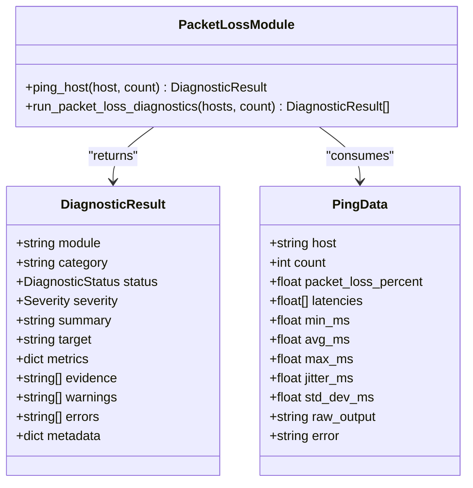
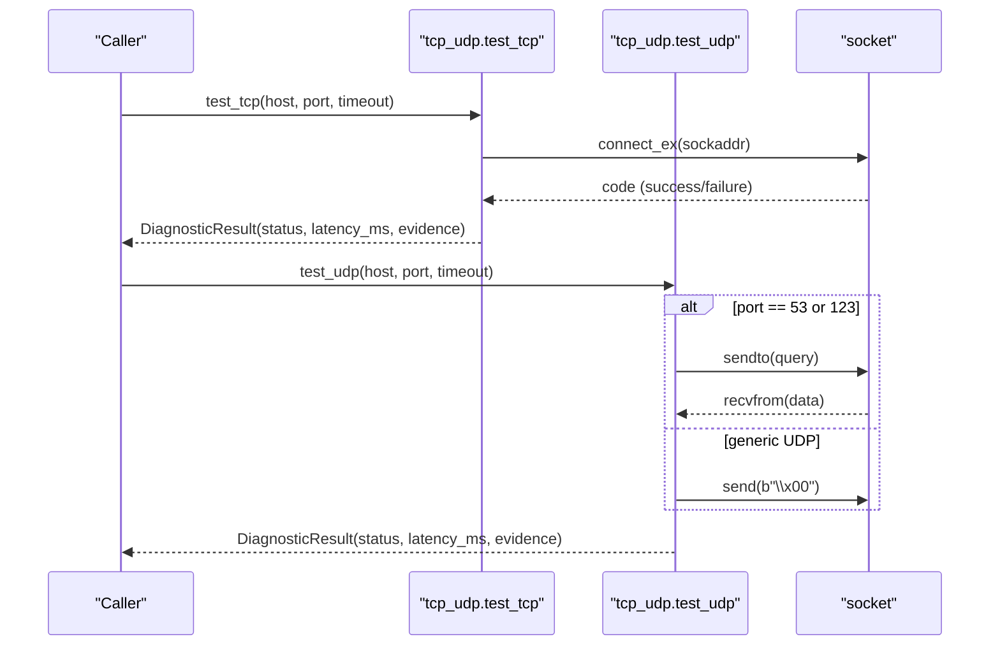
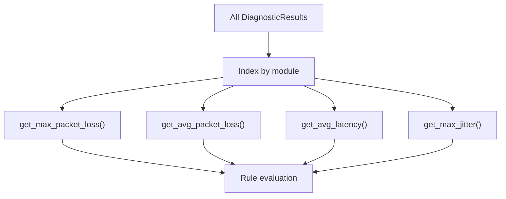
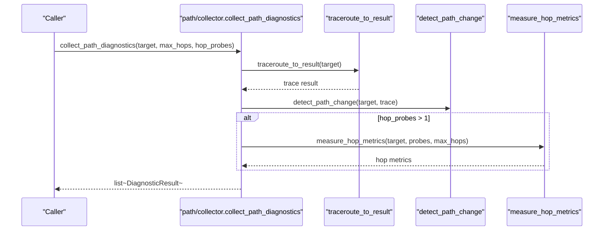
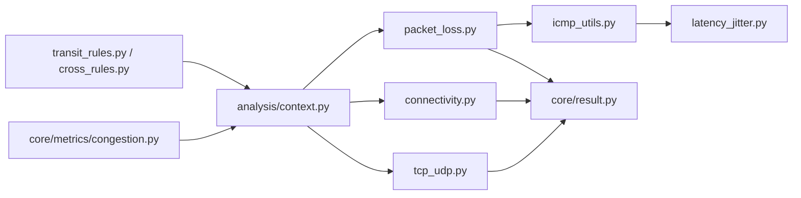

# Packet Loss Measurement

<cite>
**Referenced Files in This Document**
- [packet_loss.py](file://diagnostics/host/packet_loss.py)
- [icmp_utils.py](file://diagnostics/host/icmp_utils.py)
- [loss.py](file://core/metrics/loss.py)
- [latency_jitter.py](file://core/metrics/latency_jitter.py)
- [connectivity.py](file://diagnostics/host/connectivity.py)
- [tcp_udp.py](file://diagnostics/host/tcp_udp.py)
- [context.py](file://analysis/context.py)
- [collector.py](file://diagnostics/path/collector.py)
- [transit_rules.py](file://analysis/rules/transit_rules.py)
- [cross_rules.py](file://analysis/rules/cross_rules.py)
- [congestion.py](file://core/metrics/congestion.py)
- [result.py](file://core/result.py)
</cite>

## Table of Contents
1. [Introduction](#introduction)
2. [Project Structure](#project-structure)
3. [Core Components](#core-components)
4. [Architecture Overview](#architecture-overview)
5. [Detailed Component Analysis](#detailed-component-analysis)
6. [Dependency Analysis](#dependency-analysis)
7. [Performance Considerations](#performance-considerations)
8. [Troubleshooting Guide](#troubleshooting-guide)
9. [Conclusion](#conclusion)
10. [Appendices](#appendices)

## Introduction
This document explains how packet loss is detected and measured in the system using ICMP-based ping probes, with complementary TCP/UDP reachability checks to correlate transport behavior with underlying network conditions. It covers statistical analysis of latency and jitter, trend detection via aggregated metrics, and rule-based diagnosis for intermittent connectivity, wireless issues, and congested links. Guidance on measurement accuracy, sample size considerations, and interpretation of loss statistics across different network types is included.

## Project Structure
Packet loss diagnostics are implemented as a layered set of modules:
- Host-level ICMP probing and parsing
- Statistical summarization of latencies and jitter
- Transport-layer reachability (TCP handshake, UDP request/response)
- Aggregation and correlation across modules for trend detection and rule evaluation
- Path-layer measurements that can include per-hop loss estimates

**Diagram sources**
- [packet_loss.py:14-77](file://diagnostics/host/packet_loss.py#L14-L77)
- [icmp_utils.py:29-115](file://diagnostics/host/icmp_utils.py#L29-L115)
- [loss.py:4-23](file://core/metrics/loss.py#L4-L23)
- [latency_jitter.py:7-40](file://core/metrics/latency_jitter.py#L7-L40)
- [connectivity.py:16-65](file://diagnostics/host/connectivity.py#L16-L65)
- [tcp_udp.py:16-182](file://diagnostics/host/tcp_udp.py#L16-L182)
- [context.py:98-186](file://analysis/context.py#L98-L186)
- [transit_rules.py:9-56](file://analysis/rules/transit_rules.py#L9-L56)
- [cross_rules.py:9-27](file://analysis/rules/cross_rules.py#L9-L27)
- [collector.py:11-23](file://diagnostics/path/collector.py#L11-L23)

**Section sources**
- [packet_loss.py:14-77](file://diagnostics/host/packet_loss.py#L14-L77)
- [icmp_utils.py:29-115](file://diagnostics/host/icmp_utils.py#L29-L115)
- [loss.py:4-23](file://core/metrics/loss.py#L4-L23)
- [latency_jitter.py:7-40](file://core/metrics/latency_jitter.py#L7-L40)
- [connectivity.py:16-65](file://diagnostics/host/connectivity.py#L16-L65)
- [tcp_udp.py:16-182](file://diagnostics/host/tcp_udp.py#L16-L182)
- [context.py:98-186](file://analysis/context.py#L98-L186)
- [transit_rules.py:9-56](file://analysis/rules/transit_rules.py#L9-L56)
- [cross_rules.py:9-27](file://analysis/rules/cross_rules.py#L9-L27)
- [collector.py:11-23](file://diagnostics/path/collector.py#L11-L23)

## Core Components
- ICMP ping probe and parser: Executes platform-specific ping commands, parses output to extract packet loss percentage and per-packet latencies, and computes summary statistics including min/avg/max, jitter, and standard deviation.
- Loss calculation utilities: Computes loss percentage from sent/received counts and classifies severity into coarse labels.
- Transport reachability: Validates TCP connectivity via handshake and tests UDP services (DNS/NTP) or generic datagram transmission without ICMP rejection.
- Aggregation and correlation: Collects results across modules to compute max/average packet loss, average latency, and maximum jitter; correlates link utilization, drops/errors, and path hop losses.
- Rule engine: Identifies severe packet loss, high jitter, and congestion correlated with path loss, producing actionable recommendations.

**Section sources**
- [icmp_utils.py:29-115](file://diagnostics/host/icmp_utils.py#L29-L115)
- [loss.py:4-23](file://core/metrics/loss.py#L4-L23)
- [connectivity.py:16-65](file://diagnostics/host/connectivity.py#L16-L65)
- [tcp_udp.py:16-182](file://diagnostics/host/tcp_udp.py#L16-L182)
- [context.py:98-186](file://analysis/context.py#L98-L186)
- [transit_rules.py:9-56](file://analysis/rules/transit_rules.py#L9-L56)
- [cross_rules.py:9-27](file://analysis/rules/cross_rules.py#L9-L27)

## Architecture Overview
The diagnostic flow begins with host-level ICMP probes to measure packet loss and latency. Results are summarized and then fed into an analysis context that aggregates metrics across modules. Rules evaluate these aggregated metrics to detect anomalies such as severe packet loss or congestion correlated with path loss. Path-layer measurements provide per-hop insights to localize loss.

**Diagram sources**
- [packet_loss.py:14-77](file://diagnostics/host/packet_loss.py#L14-L77)
- [icmp_utils.py:68-115](file://diagnostics/host/icmp_utils.py#L68-L115)
- [latency_jitter.py:28-40](file://core/metrics/latency_jitter.py#L28-L40)
- [context.py:98-113](file://analysis/context.py#L98-L113)
- [transit_rules.py:14-56](file://analysis/rules/transit_rules.py#L14-L56)
- [cross_rules.py:14-27](file://analysis/rules/cross_rules.py#L14-L27)

## Detailed Component Analysis

### ICMP-based Packet Loss Measurement
- Probe execution: Runs ping with platform-specific flags and captures stdout/stderr. A timeout is set proportional to the number of probes to avoid hanging.
- Output parsing: Extracts packet loss percentage using regex patterns that handle multiple locales and formats. Latencies are parsed per-packet or from summary lines when individual samples are unavailable.
- Statistics: Uses latency summaries to compute min/avg/max, jitter (RFC 3550), and standard deviation. When loss is 100%, latencies are cleared to reflect no successful round-trips.
- Caching: Short-lived cache avoids redundant pings within a small time window for the same host/count pair.

**Diagram sources**
- [icmp_utils.py:68-115](file://diagnostics/host/icmp_utils.py#L68-L115)
- [icmp_utils.py:29-65](file://diagnostics/host/icmp_utils.py#L29-L65)
- [latency_jitter.py:28-40](file://core/metrics/latency_jitter.py#L28-L40)

**Section sources**
- [icmp_utils.py:29-115](file://diagnostics/host/icmp_utils.py#L29-L115)
- [latency_jitter.py:7-40](file://core/metrics/latency_jitter.py#L7-L40)

### Loss Calculation and Severity Classification
- Loss percent: Computed from sent and received counts; returns 0% if sent is non-positive.
- Severity mapping: Classifies loss into healthy/low/medium/high thresholds used by probes and rules.

**Diagram sources**
- [loss.py:4-23](file://core/metrics/loss.py#L4-L23)

**Section sources**
- [loss.py:4-23](file://core/metrics/loss.py#L4-L23)

### Host-Level Packet Loss Diagnostics
- Orchestrates ping probes to one or more hosts and maps observed loss percentages to diagnostic statuses and severities.
- Returns structured results including metrics, evidence, and raw output for traceability.

**Diagram sources**
- [packet_loss.py:14-77](file://diagnostics/host/packet_loss.py#L14-L77)
- [icmp_utils.py:10-22](file://diagnostics/host/icmp_utils.py#L10-L22)
- [result.py:9-47](file://core/result.py#L9-L47)

**Section sources**
- [packet_loss.py:14-77](file://diagnostics/host/packet_loss.py#L14-L77)
- [icmp_utils.py:10-22](file://diagnostics/host/icmp_utils.py#L10-L22)
- [result.py:9-47](file://core/result.py#L9-L47)

### Transport Reachability (TCP/UDP)
- TCP test: Performs address family resolution and attempts a TCP handshake; measures connection latency and reports success/failure with error codes.
- UDP test: For DNS (port 53) and NTP (port 123), sends protocol-specific requests and expects responses; for other ports, sends a datagram and verifies absence of immediate ICMP Port Unreachable. Timeouts are treated differently based on service expectations.

**Diagram sources**
- [tcp_udp.py:16-86](file://diagnostics/host/tcp_udp.py#L16-L86)
- [tcp_udp.py:89-182](file://diagnostics/host/tcp_udp.py#L89-L182)

**Section sources**
- [tcp_udp.py:16-182](file://diagnostics/host/tcp_udp.py#L16-L182)

### Aggregation and Trend Detection
- The analysis context indexes results by module and provides helpers to compute max/average packet loss, average latency, and maximum jitter across observations.
- These aggregated values feed into rules that detect trends like severe packet loss or congestion correlated with path loss.

**Diagram sources**
- [context.py:98-129](file://analysis/context.py#L98-L129)
- [transit_rules.py:14-56](file://analysis/rules/transit_rules.py#L14-L56)
- [cross_rules.py:14-27](file://analysis/rules/cross_rules.py#L14-L27)

**Section sources**
- [context.py:98-129](file://analysis/context.py#L98-L129)
- [transit_rules.py:14-56](file://analysis/rules/transit_rules.py#L14-L56)
- [cross_rules.py:14-27](file://analysis/rules/cross_rules.py#L14-L27)

### Path-Layer Insights
- Path diagnostics collect traceroute results and optionally measure per-hop metrics, enabling localization of loss along the route.
- The collector integrates path change detection and optional hop metric measurement.

**Diagram sources**
- [collector.py:11-23](file://diagnostics/path/collector.py#L11-L23)

**Section sources**
- [collector.py:11-23](file://diagnostics/path/collector.py#L11-L23)

## Dependency Analysis
- ICMP utils depend on latency/jitter utilities for statistical summaries.
- Packet loss diagnostics depend on ICMP utils and core result models.
- Analysis context depends on results from multiple modules (packet_loss, connectivity, link, resource_network, traceroute).
- Rules depend on context queries to evaluate thresholds and produce diagnoses.

**Diagram sources**
- [icmp_utils.py:29-115](file://diagnostics/host/icmp_utils.py#L29-L115)
- [latency_jitter.py:7-40](file://core/metrics/latency_jitter.py#L7-L40)
- [packet_loss.py:14-77](file://diagnostics/host/packet_loss.py#L14-L77)
- [connectivity.py:16-65](file://diagnostics/host/connectivity.py#L16-L65)
- [tcp_udp.py:16-182](file://diagnostics/host/tcp_udp.py#L16-L182)
- [context.py:98-186](file://analysis/context.py#L98-L186)
- [transit_rules.py:9-56](file://analysis/rules/transit_rules.py#L9-L56)
- [cross_rules.py:9-27](file://analysis/rules/cross_rules.py#L9-L27)
- [congestion.py:4-50](file://core/metrics/congestion.py#L4-L50)

**Section sources**
- [icmp_utils.py:29-115](file://diagnostics/host/icmp_utils.py#L29-L115)
- [latency_jitter.py:7-40](file://core/metrics/latency_jitter.py#L7-L40)
- [packet_loss.py:14-77](file://diagnostics/host/packet_loss.py#L14-L77)
- [connectivity.py:16-65](file://diagnostics/host/connectivity.py#L16-L65)
- [tcp_udp.py:16-182](file://diagnostics/host/tcp_udp.py#L16-L182)
- [context.py:98-186](file://analysis/context.py#L98-L186)
- [transit_rules.py:9-56](file://analysis/rules/transit_rules.py#L9-L56)
- [cross_rules.py:9-27](file://analysis/rules/cross_rules.py#L9-L27)
- [congestion.py:4-50](file://core/metrics/congestion.py#L4-L50)

## Performance Considerations
- Probe sizing: Increase the ping count for more reliable loss estimates on noisy links; small counts may yield high variance.
- Timeout management: Probes use timeouts proportional to count to prevent long hangs; adjust if networks have high latency or strict timeouts.
- Caching: Short TTL caching reduces redundant probes but may mask rapid changes; disable cache for real-time monitoring.
- Jitter and stddev: Use RFC jitter and standard deviation to detect bursty loss or bufferbloat; high jitter often indicates congestion or wireless instability.
- Link utilization and drops: Combine with link congestion scoring to differentiate local vs transit loss; high utilization plus drops suggests congestion.

[No sources needed since this section provides general guidance]

## Troubleshooting Guide
- Intermittent connectivity:
  - Observe fluctuating packet loss and high jitter; check gateway reachability and compare loss to default gateway versus public IPs.
  - Use path diagnostics to identify hops where loss spikes occur.
- Wireless network problems:
  - Expect higher jitter and variable loss; correlate with link utilization and interface drop rates.
  - Power cycle modem/ONT to reset carrier synchronization if upstream transit loss is suspected.
- Congested links:
  - High utilization combined with elevated drop/error rates increases congestion score; expect increased latency and loss.
  - Reduce traffic load or upgrade capacity; monitor post-change metrics.

**Section sources**
- [transit_rules.py:14-56](file://analysis/rules/transit_rules.py#L14-L56)
- [cross_rules.py:14-27](file://analysis/rules/cross_rules.py#L14-L27)
- [congestion.py:4-50](file://core/metrics/congestion.py#L4-L50)
- [icmp_utils.py:68-115](file://diagnostics/host/icmp_utils.py#L68-L115)
- [context.py:98-186](file://analysis/context.py#L98-L186)

## Conclusion
The system measures packet loss primarily via ICMP ping with robust parsing and statistical summaries, complemented by TCP/UDP reachability checks. Aggregated metrics enable trend detection and rule-based diagnosis for severe loss, jitter, and congestion correlated with path loss. By combining host, link, and path layers, it supports diagnosing intermittent connectivity, wireless issues, and congested links with actionable recommendations.

[No sources needed since this section summarizes without analyzing specific files]

## Appendices

### Measurement Accuracy and Sample Size
- Small sample sizes can misrepresent loss; increase probe counts for stability, especially on wireless or congested links.
- Use jitter and standard deviation to assess variability; high values indicate unstable conditions even if average loss appears acceptable.
- Interpret loss relative to network type:
  - Wired LAN: Near-zero loss expected; any measurable loss may indicate hardware or configuration issues.
  - Wi-Fi: Occasional loss and higher jitter are common; focus on trends and correlation with interference or congestion.
  - WAN/Transit: Some loss may be normal under load; correlate with link utilization and drop rates to determine cause.

[No sources needed since this section provides general guidance]