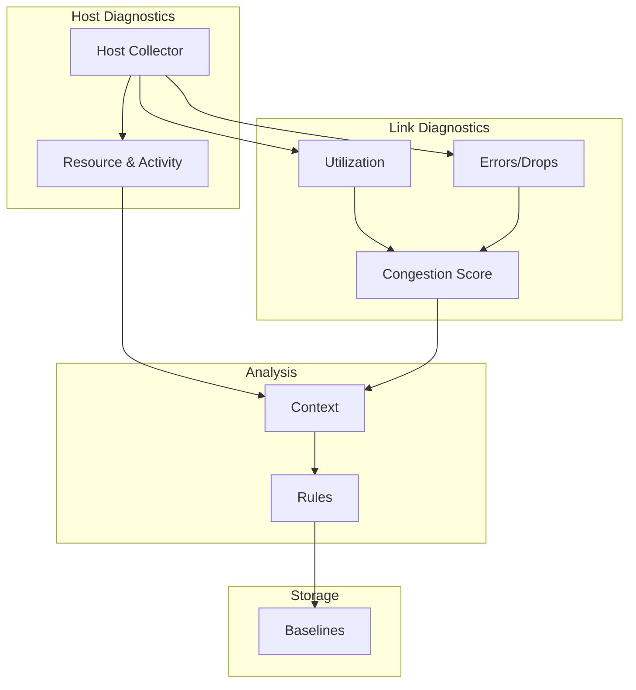
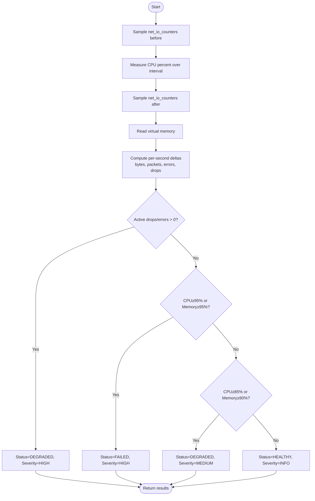
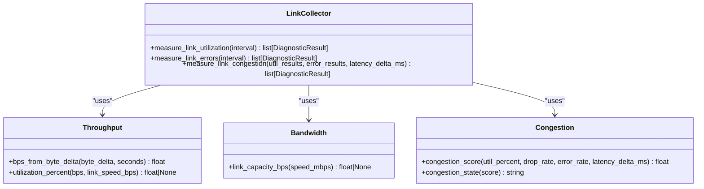
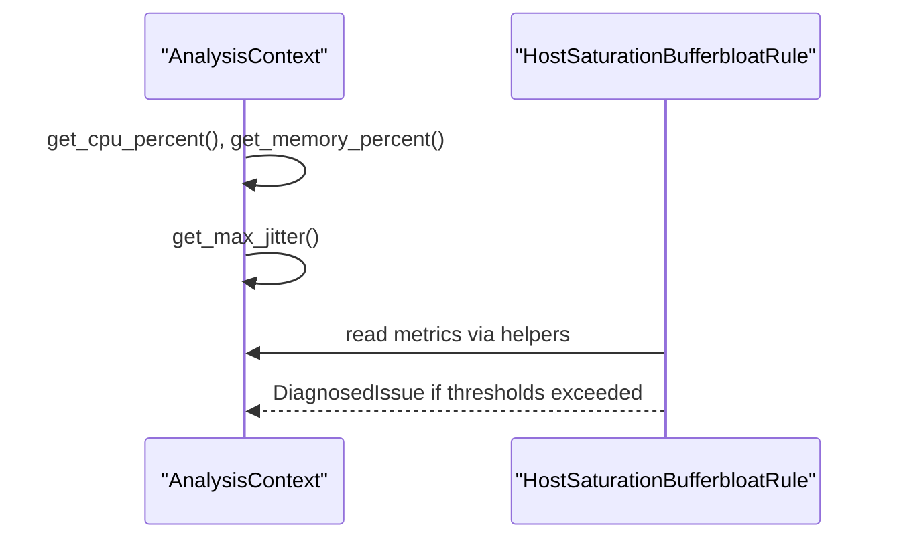
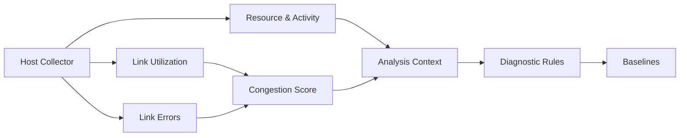

# Resource Utilization Monitoring

<cite>
**Referenced Files in This Document**
- [resource_network.py](file://diagnostics/host/resource_network.py)
- [collector.py](file://diagnostics/host/collector.py)
- [link_collector.py](file://diagnostics/link/collector.py)
- [bandwidth.py](file://core/metrics/bandwidth.py)
- [throughput.py](file://core/metrics/throughput.py)
- [congestion.py](file://core/metrics/congestion.py)
- [context.py](file://analysis/context.py)
- [host_rules.py](file://analysis/rules/host_rules.py)
- [rule.py](file://analysis/rule.py)
- [models.py](file://analysis/models.py)
- [result.py](file://core/result.py)
- [baselines.py](file://storage/baselines.py)
</cite>

## Table of Contents
1. [Introduction](#introduction)
2. [Project Structure](#project-structure)
3. [Core Components](#core-components)
4. [Architecture Overview](#architecture-overview)
5. [Detailed Component Analysis](#detailed-component-analysis)
6. [Dependency Analysis](#dependency-analysis)
7. [Performance Considerations](#performance-considerations)
8. [Troubleshooting Guide](#troubleshooting-guide)
9. [Conclusion](#conclusion)
10. [Appendices](#appendices)

## Introduction
This document explains how the system monitors resource utilization related to networking, including CPU usage, memory consumption, and network activity metrics such as throughput, packet drops, and errors. It documents diagnostic functions that track resource exhaustion, identify bottlenecks, and correlate resource usage with network performance. It also provides examples for diagnosing resource-related network issues, capacity planning, and performance optimization, along with platform-specific considerations and thresholds used for alerting on resource constraints.

## Project Structure
The resource monitoring diagnostics are implemented across host and link domains:
- Host domain collects CPU, memory, and per-interface network counters to assess resource pressure and active network activity.
- Link domain measures interface utilization, errors/drops, and computes a congestion score combining utilization, error/drop rates, and latency changes.
- The analysis layer correlates these observations into actionable issues using rules and context helpers.
- Baseline comparison persists historical samples and flags deviations from rolling baselines.



**Diagram sources**
- [collector.py:16-61](file://diagnostics/host/collector.py#L16-L61)
- [resource_network.py:16-116](file://diagnostics/host/resource_network.py#L16-L116)
- [link_collector.py:29-179](file://diagnostics/link/collector.py#L29-L179)
- [context.py:131-179](file://analysis/context.py#L131-L179)
- [host_rules.py:9-56](file://analysis/rules/host_rules.py#L9-L56)
- [baselines.py:9-137](file://storage/baselines.py#L9-L137)

**Section sources**
- [collector.py:16-61](file://diagnostics/host/collector.py#L16-L61)
- [resource_network.py:16-116](file://diagnostics/host/resource_network.py#L16-L116)
- [link_collector.py:29-179](file://diagnostics/link/collector.py#L29-L179)
- [context.py:131-179](file://analysis/context.py#L131-L179)
- [host_rules.py:9-56](file://analysis/rules/host_rules.py#L9-L56)
- [baselines.py:9-137](file://storage/baselines.py#L9-L137)

## Core Components
- Host resource and activity measurement:
  - Measures CPU percent over an interval, captures virtual memory usage, and computes per-second deltas for RX/TX bytes/packets and error/drop counters.
  - Produces two results: one for resource health (CPU/memory status) and one for network activity (throughput and error/drop rates).
- Link utilization and errors:
  - Computes per-interface RX/TX bits per second and utilization against negotiated speed when available.
  - Computes per-interface drop and error rates; classifies severity based on thresholds.
- Congestion scoring:
  - Combines utilization, drop/error rates, and optional latency delta into a single score and maps it to a coarse state label.
- Context and rules:
  - Provides query helpers to extract CPU/memory and link metrics from collected results.
  - Rules detect host saturation and link saturation, correlating with jitter or other indicators to produce diagnosed issues with recommendations.
- Baseline comparison:
  - Persists metric samples and compares current values against rolling baselines to flag significant deviations.

**Section sources**
- [resource_network.py:16-116](file://diagnostics/host/resource_network.py#L16-L116)
- [link_collector.py:29-179](file://diagnostics/link/collector.py#L29-L179)
- [congestion.py:4-51](file://core/metrics/congestion.py#L4-L51)
- [context.py:131-179](file://analysis/context.py#L131-L179)
- [host_rules.py:9-56](file://analysis/rules/host_rules.py#L9-L56)
- [baselines.py:9-137](file://storage/baselines.py#L9-L137)

## Architecture Overview
The data flow starts with local collectors that gather host and link metrics, which are then correlated by the analysis context and evaluated by rules to generate diagnosed issues. Baseline comparisons augment results with deviation signals.

```mermaid
sequenceDiagram
participant Orchestrator as "Host Collector"
participant HostRes as "Resource & Activity"
participant Link as "Link Collectors"
participant Ctx as "Analysis Context"
participant Rule as "Diagnostic Rules"
participant Base as "Baselines"
Orchestrator->>HostRes : inspect_resources_and_activity(interval)
HostRes-->>Orchestrator : DiagnosticResult (resource), DiagnosticResult (activity)
Orchestrator->>Link : measure_link_utilization(), measure_link_errors()
Link-->>Orchestrator : DiagnosticResult[] (util, errors)
Orchestrator->>Base : compare_probe_metrics(results)
Base-->>Orchestrator : DiagnosticResult[] (baseline_delta)
Orchestrator->>Ctx : build context from results
Ctx->>Rule : evaluate(ctx)
Rule-->>Ctx : DiagnosedIssue | None
```

**Diagram sources**
- [collector.py:16-61](file://diagnostics/host/collector.py#L16-L61)
- [resource_network.py:16-116](file://diagnostics/host/resource_network.py#L16-L116)
- [link_collector.py:29-179](file://diagnostics/link/collector.py#L29-L179)
- [baselines.py:94-137](file://storage/baselines.py#L94-L137)
- [context.py:131-179](file://analysis/context.py#L131-L179)
- [host_rules.py:9-56](file://analysis/rules/host_rules.py#L9-L56)

## Detailed Component Analysis

### Host Resource and Network Activity Measurement
- Functionality:
  - Captures before/after network IO counters around a CPU sampling interval to compute per-second deltas for bytes, packets, errors, and drops.
  - Reads virtual memory to obtain memory usage percentage and available memory.
  - Classifies resource health based on thresholds for active drops/errors, CPU, and memory.
- Key outputs:
  - Resource result includes CPU percent, memory percent, cumulative and active error/drop counts.
  - Activity result includes RX/TX bytes per second and RX/TX packets per second, plus per-direction error/drop rates.
- Thresholds and statuses:
  - Active drops/errors trigger DEGRADED with HIGH severity.
  - CPU ≥ 95% or memory ≥ 95% triggers FAILED with HIGH severity.
  - CPU ≥ 85% or memory ≥ 90% triggers DEGRADED with MEDIUM severity.



**Diagram sources**
- [resource_network.py:16-116](file://diagnostics/host/resource_network.py#L16-L116)

**Section sources**
- [resource_network.py:16-116](file://diagnostics/host/resource_network.py#L16-L116)

### Link Utilization, Errors, and Congestion
- Utilization:
  - Computes RX/TX bits per second from per-interface counter deltas over an interval.
  - Converts interface speed (Mbps) to bps and calculates utilization percentage if speed is known.
  - Applies thresholds: ≥ 90% util → DEGRADED/HIGH; ≥ 75% util → DEGRADED/MEDIUM.
- Errors/Drops:
  - Computes per-interface drops/s and errors/s over an interval.
  - Applies thresholds: ≥ 5 → FAILED/HIGH; ≥ 0.5 → DEGRADED/MEDIUM.
- Congestion:
  - Uses a heuristic score combining utilization, drop rate, error rate, and optional latency delta.
  - Maps score to states: clear, mild, moderate, severe.



**Diagram sources**
- [link_collector.py:29-179](file://diagnostics/link/collector.py#L29-L179)
- [throughput.py:4-24](file://core/metrics/throughput.py#L4-L24)
- [bandwidth.py:4-17](file://core/metrics/bandwidth.py#L4-L17)
- [congestion.py:4-51](file://core/metrics/congestion.py#L4-L51)

**Section sources**
- [link_collector.py:29-179](file://diagnostics/link/collector.py#L29-L179)
- [throughput.py:4-24](file://core/metrics/throughput.py#L4-L24)
- [bandwidth.py:4-17](file://core/metrics/bandwidth.py#L4-L17)
- [congestion.py:4-51](file://core/metrics/congestion.py#L4-L51)

### Analysis Context and Rules
- Context:
  - Aggregates DiagnosticResult objects by module and exposes helpers to retrieve CPU/memory percentages, max link utilization, and drop rates.
- Rules:
  - Host saturation rule detects high CPU/memory and correlates with elevated jitter to produce a diagnosed issue with recommendations.
  - Link saturation rule detects high utilization and lists affected interfaces.



**Diagram sources**
- [context.py:131-179](file://analysis/context.py#L131-L179)
- [host_rules.py:9-56](file://analysis/rules/host_rules.py#L9-L56)
- [rule.py:9-51](file://analysis/rule.py#L9-L51)
- [models.py:27-68](file://analysis/models.py#L27-L68)

**Section sources**
- [context.py:131-179](file://analysis/context.py#L131-L179)
- [host_rules.py:9-56](file://analysis/rules/host_rules.py#L9-L56)
- [rule.py:9-51](file://analysis/rule.py#L9-L51)
- [models.py:27-68](file://analysis/models.py#L27-L68)

### Baseline Comparison
- Records metric samples and compares current values against rolling baseline means.
- Emits baseline_delta results indicating deviation ratios and status/severity based on configured thresholds.

**Section sources**
- [baselines.py:9-137](file://storage/baselines.py#L9-L137)

## Dependency Analysis
- Host collector orchestrates multiple probes and includes resource/activity measurements.
- Resource/activity measurement depends on psutil for CPU, memory, and network counters.
- Link collectors depend on throughput and bandwidth utilities and congestion scoring.
- Analysis context indexes results by module and provides cross-domain queries.
- Rules consume context to detect patterns and produce diagnosed issues.
- Baselines persist and compare metrics to historical rolling averages.



**Diagram sources**
- [collector.py:16-61](file://diagnostics/host/collector.py#L16-L61)
- [resource_network.py:16-116](file://diagnostics/host/resource_network.py#L16-L116)
- [link_collector.py:29-179](file://diagnostics/link/collector.py#L29-L179)
- [context.py:131-179](file://analysis/context.py#L131-L179)
- [host_rules.py:9-56](file://analysis/rules/host_rules.py#L9-L56)
- [baselines.py:94-137](file://storage/baselines.py#L94-L137)

**Section sources**
- [collector.py:16-61](file://diagnostics/host/collector.py#L16-L61)
- [resource_network.py:16-116](file://diagnostics/host/resource_network.py#L16-L116)
- [link_collector.py:29-179](file://diagnostics/link/collector.py#L29-L179)
- [context.py:131-179](file://analysis/context.py#L131-L179)
- [host_rules.py:9-56](file://analysis/rules/host_rules.py#L9-L56)
- [baselines.py:94-137](file://storage/baselines.py#L94-L137)

## Performance Considerations
- Sampling intervals:
  - CPU and network deltas are measured over a configurable interval; longer intervals smooth noise but increase latency between readings.
- Counter-based metrics:
  - Throughput and error/drop rates rely on counter deltas; ensure consistent intervals for accurate rates.
- Utilization calculation:
  - Requires interface speed; unknown speeds yield null utilization, so capacity planning should account for missing speed metadata.
- Congestion scoring:
  - Heuristic weights emphasize high utilization, non-zero drops/errors, and latency increases; tune inputs for environment-specific accuracy.
- Baseline sensitivity:
  - Deviation thresholds (warn/fail ratios) control alerting sensitivity; adjust based on observed variance and operational tolerance.

[No sources needed since this section provides general guidance]

## Troubleshooting Guide
Common resource-related network issues and how to diagnose them:
- High CPU or memory causing packet processing delays:
  - Look for resource results showing CPU ≥ 85% or memory ≥ 90%, and check for concurrent elevated jitter in context.
  - Use the host saturation rule output to identify root cause and recommended actions.
- Active packet drops or errors:
  - Inspect resource activity and link error results for non-zero drops/errors per second; classify severity based on thresholds.
- Link saturation:
  - Check link utilization results for high percentages; correlate with congestion state and baseline deviations.
- Baseline deviations:
  - Review baseline_delta results for significant ratio changes indicating worsening conditions.

Operational steps:
- Run host diagnostics to collect resource and activity results.
- Run link diagnostics to capture utilization, errors, and congestion.
- Feed all results into the analysis context and run rules to generate diagnosed issues.
- Compare against baselines to detect trends and anomalies.

**Section sources**
- [resource_network.py:16-116](file://diagnostics/host/resource_network.py#L16-L116)
- [link_collector.py:29-179](file://diagnostics/link/collector.py#L29-L179)
- [context.py:131-179](file://analysis/context.py#L131-L179)
- [host_rules.py:9-56](file://analysis/rules/host_rules.py#L9-L56)
- [baselines.py:94-137](file://storage/baselines.py#L94-L137)

## Conclusion
The system provides comprehensive resource utilization monitoring for networking workloads by measuring CPU, memory, and network activity at the host level, and link utilization, errors, and congestion at the interface level. These metrics are correlated through an analysis context and evaluated by rules to produce actionable diagnosed issues. Baseline comparisons add trend detection and anomaly alerts. Together, these components enable effective diagnosis of resource-related network issues, capacity planning, and performance optimization.

[No sources needed since this section summarizes without analyzing specific files]

## Appendices

### Example Scenarios

- Diagnosing resource-related network issues:
  - Collect host diagnostics and review resource results for CPU/memory thresholds and active drops/errors.
  - If CPU or memory is high, use the host saturation rule output to guide remediation (e.g., terminate runaway processes, inspect swap/pagefile thrashing).
  - Correlate with link congestion and baseline deviations to confirm impact.

- Capacity planning:
  - Use link utilization results to estimate current load relative to negotiated speed.
  - Track baseline trends to anticipate saturation points and plan upgrades or traffic shaping.

- Performance optimization:
  - Reduce packet loss and errors by addressing driver or hardware issues indicated by link error results.
  - Tune application behavior to lower CPU/memory pressure when resource results indicate saturation.

[No sources needed since this section provides conceptual examples]