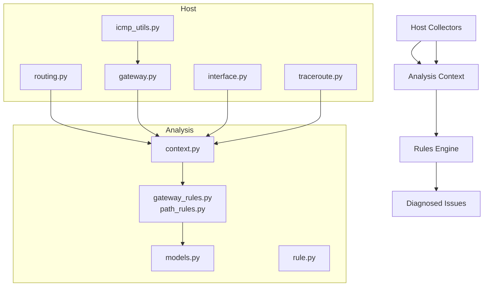
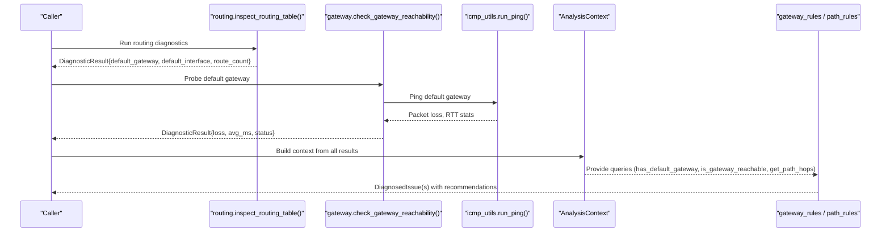
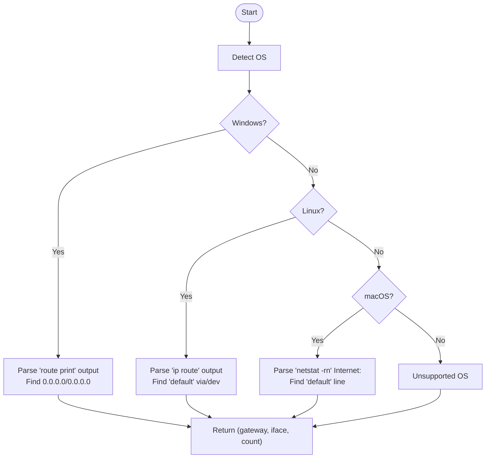
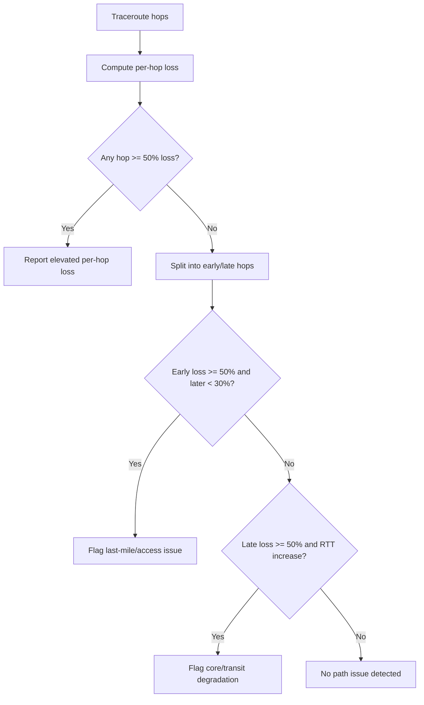
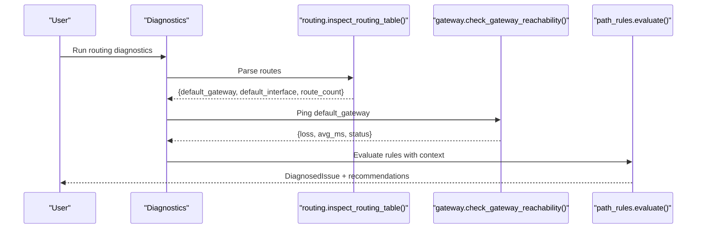
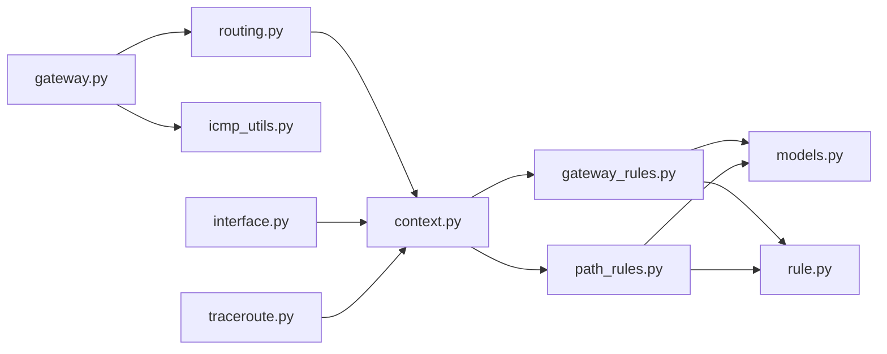

# Routing Table Analysis

<cite>
**Referenced Files in This Document**
- [routing.py](file://diagnostics/host/routing.py)
- [gateway.py](file://diagnostics/host/gateway.py)
- [icmp_utils.py](file://diagnostics/host/icmp_utils.py)
- [interface.py](file://diagnostics/host/interface.py)
- [context.py](file://analysis/context.py)
- [gateway_rules.py](file://analysis/rules/gateway_rules.py)
- [path_rules.py](file://analysis/rules/path_rules.py)
- [rule.py](file://analysis/rule.py)
- [models.py](file://analysis/models.py)
- [result.py](file://core/result.py)
- [traceroute.py](file://diagnostics/path/traceroute.py)
</cite>

## Table of Contents
1. [Introduction](#introduction)
2. [Project Structure](#project-structure)
3. [Core Components](#core-components)
4. [Architecture Overview](#architecture-overview)
5. [Detailed Component Analysis](#detailed-component-analysis)
6. [Dependency Analysis](#dependency-analysis)
7. [Performance Considerations](#performance-considerations)
8. [Troubleshooting Guide](#troubleshooting-guide)
9. [Conclusion](#conclusion)

## Introduction
This document explains how routing table analysis diagnostics are implemented and used to validate host routing, discover routes, identify default gateways, evaluate route metrics, and detect common routing issues such as missing gateways, unreachable gateways, path changes, and suboptimal paths. It also covers IPv4 vs IPv6 parsing differences and platform-specific behaviors across Windows, Linux, and macOS.

## Project Structure
Routing diagnostics are split into two layers:
- Host-level collectors that parse the OS routing table and probe reachability
- Rule engine that correlates multiple observations (interfaces, routing, gateway, path) to diagnose issues and recommend actions

**Diagram sources**
- [routing.py:15-78](file://diagnostics/host/routing.py#L15-L78)
- [gateway.py:15-94](file://diagnostics/host/gateway.py#L15-L94)
- [icmp_utils.py:29-115](file://diagnostics/host/icmp_utils.py#L29-L115)
- [interface.py:16-109](file://diagnostics/host/interface.py#L16-L109)
- [traceroute.py:293-324](file://diagnostics/path/traceroute.py#L293-L324)
- [context.py:7-199](file://analysis/context.py#L7-L199)
- [gateway_rules.py:9-198](file://analysis/rules/gateway_rules.py#L9-L198)
- [path_rules.py:9-138](file://analysis/rules/path_rules.py#L9-L138)
- [rule.py:9-51](file://analysis/rule.py#L9-L51)
- [models.py:27-68](file://analysis/models.py#L27-L68)

**Section sources**
- [routing.py:15-78](file://diagnostics/host/routing.py#L15-L78)
- [context.py:7-199](file://analysis/context.py#L7-L199)
- [gateway_rules.py:9-198](file://analysis/rules/gateway_rules.py#L9-L198)
- [path_rules.py:9-138](file://analysis/rules/path_rules.py#L9-L138)

## Core Components
- Routing table parser: extracts default gateway, default interface, and counts active routes per OS
- Gateway reachability probe: pings the default gateway and classifies status by loss and RTT
- Interface inspection: determines if any non-loopback interfaces are up
- Path change detection: compares current traceroute fingerprint with baseline to detect forwarding path changes
- Rule engine: evaluates cross-module evidence to produce DiagnosedIssue objects with recommendations

Key data structures:
- DiagnosticResult: standardized result from each diagnostic module
- AnalysisContext: indexed cache over results to simplify rule evaluation
- DiagnosedIssue and Recommendation: structured diagnosis output for consumers

**Section sources**
- [result.py:9-47](file://core/result.py#L9-L47)
- [context.py:7-199](file://analysis/context.py#L7-L199)
- [models.py:27-68](file://analysis/models.py#L27-L68)

## Architecture Overview
The system runs host collectors to gather routing state and connectivity, then feeds those results into a rule engine that correlates them to diagnose problems.

**Diagram sources**
- [routing.py:81-175](file://diagnostics/host/routing.py#L81-L175)
- [gateway.py:15-94](file://diagnostics/host/gateway.py#L15-L94)
- [icmp_utils.py:68-115](file://diagnostics/host/icmp_utils.py#L68-L115)
- [context.py:41-68](file://analysis/context.py#L41-L68)
- [gateway_rules.py:9-198](file://analysis/rules/gateway_rules.py#L9-L198)
- [path_rules.py:9-138](file://analysis/rules/path_rules.py#L9-L138)

## Detailed Component Analysis

### Routing Table Parsing and Route Discovery
- Platform selection: uses OS command to dump routes
  - Windows: route print
  - Linux: ip route
  - macOS: netstat -rn
- Parsing logic:
  - Windows: scans Active Routes section; identifies default route by destination/netmask 0.0.0.0/0.0.0.0
  - Linux: counts lines; finds default via keyword and device via dev keyword
  - macOS: parses Internet: block only; default line yields gateway and last token as interface
- Returns: default gateway, default interface, and route count

**Diagram sources**
- [routing.py:22-78](file://diagnostics/host/routing.py#L22-L78)

**Section sources**
- [routing.py:22-78](file://diagnostics/host/routing.py#L22-L78)

### Default Gateway Identification
- The parser sets default_gateway when it detects the default route on each platform
- If no default gateway is found, the diagnostic returns FAILED with HIGH severity
- The gateway module can reuse this result to probe reachability

**Section sources**
- [routing.py:81-175](file://diagnostics/host/routing.py#L81-L175)
- [gateway.py:23-35](file://diagnostics/host/gateway.py#L23-L35)

### Route Metric Evaluation
- Route metric evaluation is performed at the path layer using traceroute hop metrics:
  - Per-hop loss percent and RTT are analyzed to detect congestion or degradation
  - Thresholds: high hop loss >= 50% triggers an issue
  - Last-mile vs core distinction uses early vs late hop metrics to localize issues

**Diagram sources**
- [path_rules.py:40-138](file://analysis/rules/path_rules.py#L40-L138)

**Section sources**
- [path_rules.py:40-138](file://analysis/rules/path_rules.py#L40-L138)

### Checking Route Validity
- Validity checks include:
  - Presence of a default gateway
  - Reachability of the default gateway via ICMP
  - End-to-end IP connectivity to public IPs
- These checks are exposed through AnalysisContext methods used by rules

**Section sources**
- [context.py:41-83](file://analysis/context.py#L41-L83)
- [gateway_rules.py:9-198](file://analysis/rules/gateway_rules.py#L9-L198)

### Detecting Routing Loops
- Explicit loop detection is not implemented in the provided codebase
- Indirect indicators:
  - Path change detection flags when traceroute fingerprint differs from baseline
  - High hop loss or excessive RTT may suggest instability but not loops specifically

**Section sources**
- [traceroute.py:293-324](file://diagnostics/path/traceroute.py#L293-L324)
- [path_rules.py:9-37](file://analysis/rules/path_rules.py#L9-L37)

### Identifying Suboptimal Paths
- Suboptimality is inferred from:
  - Elevated per-hop loss
  - Increased RTT in later hops compared to early hops
  - Path changes indicating failover or ECMP shifts
- Recommendations include re-running diagnostics and correlating with end-to-end loss

**Section sources**
- [path_rules.py:40-138](file://analysis/rules/path_rules.py#L40-L138)

### Common Routing Issues and Detection
- Missing default gateway:
  - Detected when no default route exists and interfaces are up
  - Severity: CRITICAL
  - Recommendations: renew DHCP lease or inspect static routes
- Unreachable default gateway:
  - Detected when gateway probes show ~100% loss
  - Severity: CRITICAL
  - Recommendations: verify gateway address/subnet and check router/AP
- Upstream WAN outage with healthy local gateway:
  - Detected when gateway is reachable but public targets fail with near-total loss
  - Severity: CRITICAL
  - Recommendations: inspect modem/WAN link and ISP status
- Total internet outage:
  - Detected when no public target is reachable and gateway reachability is unconfirmed
  - Severity: CRITICAL
  - Recommendations: ping gateway and upstream IP; check ISP status

**Section sources**
- [gateway_rules.py:9-198](file://analysis/rules/gateway_rules.py#L9-L198)

### Configuration Validation
- Validates presence of default gateway and its reachability
- Uses interface state to avoid false positives when all interfaces are down
- Correlates with DNS and connectivity modules to refine diagnosis

**Section sources**
- [context.py:27-83](file://analysis/context.py#L27-L83)
- [gateway_rules.py:9-198](file://analysis/rules/gateway_rules.py#L9-L198)

### Troubleshooting Workflows
- Step 1: Inspect routing table to confirm default gateway and interface
- Step 2: Probe default gateway reachability via ICMP
- Step 3: Validate end-to-end IP connectivity to public IPs
- Step 4: Run traceroute to compare path fingerprint against baseline
- Step 5: Apply rules to generate DiagnosedIssue with prioritized recommendations

**Diagram sources**
- [routing.py:81-175](file://diagnostics/host/routing.py#L81-L175)
- [gateway.py:15-94](file://diagnostics/host/gateway.py#L15-L94)
- [path_rules.py:9-138](file://analysis/rules/path_rules.py#L9-L138)

**Section sources**
- [routing.py:81-175](file://diagnostics/host/routing.py#L81-L175)
- [gateway.py:15-94](file://diagnostics/host/gateway.py#L15-L94)
- [path_rules.py:9-138](file://analysis/rules/path_rules.py#L9-L138)

### IPv4 vs IPv6 Routing Differences
- IPv4 focus:
  - Windows parser explicitly looks for 0.0.0.0/0.0.0.0 default route
  - Linux parser treats “default” line as IPv4 default route
  - macOS parser restricts to Internet: block (IPv4)
- IPv6 handling:
  - Windows parser stops processing when encountering “IPv6 Route Table”
  - macOS parser stops at “Internet6:” to avoid mixing IPv6 into IPv4 parsing
- Implication:
  - Current implementation primarily targets IPv4 default gateway discovery
  - IPv6 default routes are not parsed for gateway extraction in the provided code

**Section sources**
- [routing.py:22-78](file://diagnostics/host/routing.py#L22-L78)

### Platform-Specific Routing Behaviors
- Windows:
  - Uses route print; parses Active Routes section; ignores persistent routes and IPv6 sections
- Linux:
  - Uses ip route; counts lines; extracts default via and dev tokens
- macOS:
  - Uses netstat -rn; parses Internet: block; default line yields gateway and interface

**Section sources**
- [routing.py:22-78](file://diagnostics/host/routing.py#L22-L78)

## Dependency Analysis
- routing.py depends on subprocess and platform to execute OS commands and parse outputs
- gateway.py depends on icmp_utils for ping and routing for default gateway discovery
- interface.py provides interface state used by rules to avoid false positives
- context.py aggregates results and exposes query helpers for rules
- Rules depend on context to correlate multi-module evidence and produce DiagnosedIssue

**Diagram sources**
- [routing.py:15-78](file://diagnostics/host/routing.py#L15-L78)
- [gateway.py:15-94](file://diagnostics/host/gateway.py#L15-L94)
- [icmp_utils.py:68-115](file://diagnostics/host/icmp_utils.py#L68-L115)
- [interface.py:16-109](file://diagnostics/host/interface.py#L16-L109)
- [traceroute.py:293-324](file://diagnostics/path/traceroute.py#L293-L324)
- [context.py:7-199](file://analysis/context.py#L7-L199)
- [gateway_rules.py:9-198](file://analysis/rules/gateway_rules.py#L9-L198)
- [path_rules.py:9-138](file://analysis/rules/path_rules.py#L9-L138)
- [models.py:27-68](file://analysis/models.py#L27-L68)
- [rule.py:9-51](file://analysis/rule.py#L9-L51)

**Section sources**
- [context.py:7-199](file://analysis/context.py#L7-L199)
- [gateway_rules.py:9-198](file://analysis/rules/gateway_rules.py#L9-L198)
- [path_rules.py:9-138](file://analysis/rules/path_rules.py#L9-L138)

## Performance Considerations
- Routing table parsing is O(n) over output lines; efficient for typical route tables
- ICMP ping includes a short-lived cache to reduce redundant probes within TTL window
- Traceroute-based path analysis should be run sparingly due to network overhead
- Rule evaluation is lightweight, operating over cached DiagnosticResult collections

[No sources needed since this section provides general guidance]

## Troubleshooting Guide
Common issues and their detection:
- No default gateway configured:
  - Symptom: routing diagnostic reports no default gateway
  - Action: renew DHCP lease or configure static default route
  - Evidence: routing metrics show None or empty default_gateway
- Default gateway unreachable:
  - Symptom: gateway probe shows ~100% loss
  - Action: verify gateway IP/subnet; ping gateway directly; check router/AP
  - Evidence: gateway metrics show high loss; context indicates gateway unreachable
- Upstream WAN outage:
  - Symptom: gateway reachable but public targets unreachable with near-total loss
  - Action: inspect modem/WAN link; check ISP status
  - Evidence: context shows IP connectivity failure despite healthy gateway
- Path change detected:
  - Symptom: traceroute fingerprint differs from baseline
  - Action: compare current hops with baseline; re-run after stabilization
  - Evidence: path_change metrics indicate changed flag

Error handling highlights:
- Unsupported OS returns UNKNOWN status with medium severity
- Subprocess failures return FAILED status with high severity and error details
- Gateway probing errors return UNKNOWN status with medium severity and raw output

**Section sources**
- [routing.py:94-104](file://diagnostics/host/routing.py#L94-L104)
- [routing.py:115-126](file://diagnostics/host/routing.py#L115-L126)
- [gateway.py:23-48](file://diagnostics/host/gateway.py#L23-L48)
- [traceroute.py:293-324](file://diagnostics/path/traceroute.py#L293-L324)

## Conclusion
The routing table analysis diagnostics provide robust, platform-aware parsing of IPv4 default routes, validation of gateway reachability, and correlation with path metrics to detect routing anomalies. While explicit loop detection is not present, path change detection and per-hop loss analysis offer strong signals for routing instability and suboptimal paths. The rule engine synthesizes these observations into actionable DiagnosedIssue outputs with prioritized remediation steps.

[No sources needed since this section summarizes without analyzing specific files]