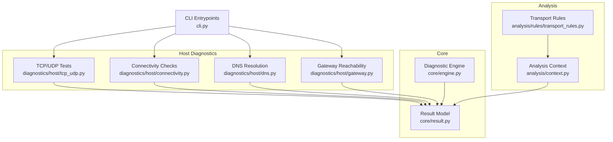
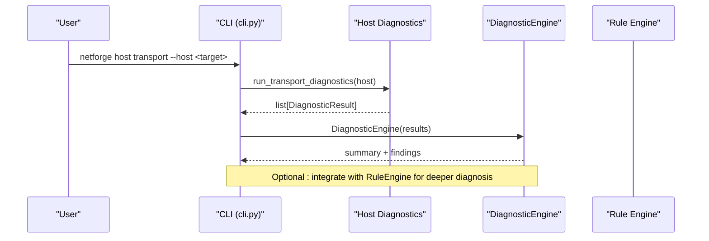
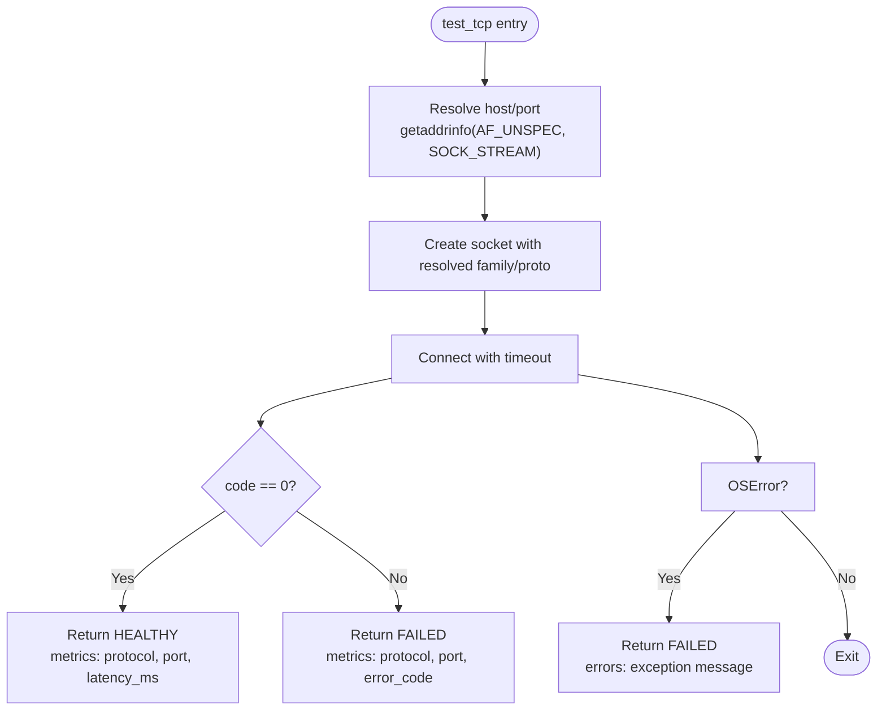
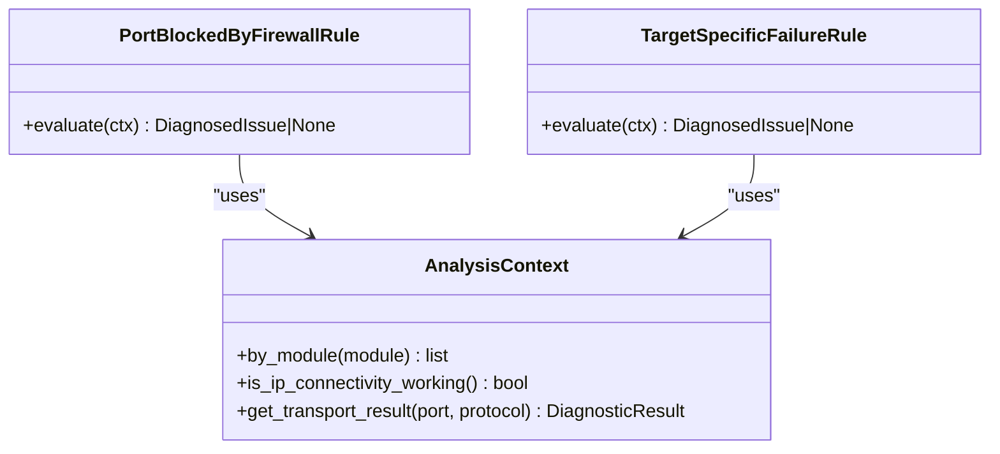
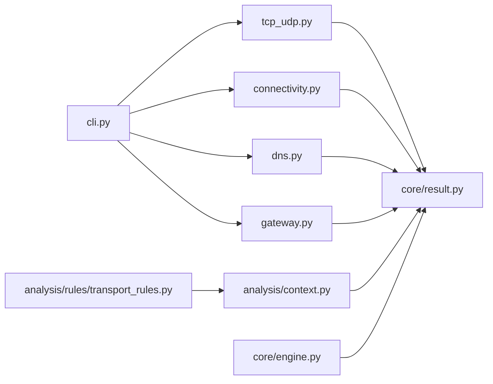

# TCP/UDP Transport Testing

<cite>
**Referenced Files in This Document**
- [tcp_udp.py](file://diagnostics/host/tcp_udp.py)
- [connectivity.py](file://diagnostics/host/connectivity.py)
- [dns.py](file://diagnostics/host/dns.py)
- [gateway.py](file://diagnostics/host/gateway.py)
- [transport_rules.py](file://analysis/rules/transport_rules.py)
- [context.py](file://analysis/context.py)
- [engine.py](file://core/engine.py)
- [result.py](file://core/result.py)
- [cli.py](file://cli.py)
</cite>

## Table of Contents
1. [Introduction](#introduction)
2. [Project Structure](#project-structure)
3. [Core Components](#core-components)
4. [Architecture Overview](#architecture-overview)
5. [Detailed Component Analysis](#detailed-component-analysis)
6. [Dependency Analysis](#dependency-analysis)
7. [Performance Considerations](#performance-considerations)
8. [Troubleshooting Guide](#troubleshooting-guide)
9. [Conclusion](#conclusion)
10. [Appendices](#appendices)

## Introduction
This document explains how the framework performs TCP and UDP transport testing diagnostics, including connection establishment, datagram transmission, and protocol-specific validation. It covers diagnostic functions for service availability checks, connection establishment, and transport-layer troubleshooting. It also provides examples for testing web services, DNS/NTP, database-like ports, and custom applications, along with guidance on firewall considerations, connection pooling implications, and performance impact. Error handling across common network conditions and service states is documented to help interpret results and guide remediation.

## Project Structure
The transport testing functionality is implemented under host-level diagnostics and integrated into a rule engine that correlates results across modules to produce actionable insights.



**Diagram sources**
- [tcp_udp.py:16-226](file://diagnostics/host/tcp_udp.py#L16-L226)
- [connectivity.py:16-111](file://diagnostics/host/connectivity.py#L16-L111)
- [dns.py:92-203](file://diagnostics/host/dns.py#L92-L203)
- [gateway.py:15-113](file://diagnostics/host/gateway.py#L15-L113)
- [transport_rules.py:9-109](file://analysis/rules/transport_rules.py#L9-L109)
- [context.py:7-199](file://analysis/context.py#L7-L199)
- [engine.py:10-83](file://core/engine.py#L10-L83)
- [result.py:9-47](file://core/result.py#L9-L47)
- [cli.py:82-88](file://cli.py#L82-L88)

**Section sources**
- [tcp_udp.py:16-226](file://diagnostics/host/tcp_udp.py#L16-L226)
- [connectivity.py:16-111](file://diagnostics/host/connectivity.py#L16-L111)
- [transport_rules.py:9-109](file://analysis/rules/transport_rules.py#L9-L109)
- [context.py:7-199](file://analysis/context.py#L7-L199)
- [engine.py:10-83](file://core/engine.py#L10-L83)
- [result.py:9-47](file://core/result.py#L9-L47)
- [cli.py:82-88](file://cli.py#L82-L88)

## Core Components
- TCP test: Establishes a TCP handshake to a target host and port, measures latency, and returns a standardized result indicating reachability or failure.
- UDP test: Sends protocol-aware probes (DNS A-record query on port 53, NTP request on port 123) or generic datagrams to other ports, capturing response or absence of ICMP rejection.
- Connectivity check: Performs a basic TCP connect to validate general reachability to well-known endpoints.
- DNS resolution: Validates name resolution and enumerates configured DNS servers.
- Gateway probe: Pings the default gateway to assess local connectivity and distinguish upstream issues.
- Rule engine: Correlates results to detect port filtering by firewalls and remote destination outages.
- Diagnostic engine: Summarizes and reports findings from all diagnostics.

**Section sources**
- [tcp_udp.py:16-226](file://diagnostics/host/tcp_udp.py#L16-L226)
- [connectivity.py:16-111](file://diagnostics/host/connectivity.py#L16-L111)
- [dns.py:92-203](file://diagnostics/host/dns.py#L92-L203)
- [gateway.py:15-113](file://diagnostics/host/gateway.py#L15-L113)
- [transport_rules.py:9-109](file://analysis/rules/transport_rules.py#L9-L109)
- [engine.py:10-83](file://core/engine.py#L10-L83)

## Architecture Overview
The transport testing flow starts at the CLI, which invokes host diagnostics. Each module produces a DiagnosticResult. The DiagnosticEngine summarizes outcomes, while the analysis context and rules correlate multi-module evidence to identify root causes such as firewall filtering or remote outages.



**Diagram sources**
- [cli.py:82-88](file://cli.py#L82-L88)
- [tcp_udp.py:185-226](file://diagnostics/host/tcp_udp.py#L185-L226)
- [engine.py:10-83](file://core/engine.py#L10-L83)

## Detailed Component Analysis

### TCP Transport Test
- Purpose: Validate TCP connectivity and measure handshake latency.
- Behavior:
  - Resolves address family dynamically (IPv4/IPv6).
  - Creates a stream socket and attempts connection with a configurable timeout.
  - Returns HEALTHY if connection succeeds; FAILED otherwise, including error codes and evidence.
  - Handles OS-level errors and records them in the result.



**Diagram sources**
- [tcp_udp.py:16-87](file://diagnostics/host/tcp_udp.py#L16-L87)

**Section sources**
- [tcp_udp.py:16-87](file://diagnostics/host/tcp_udp.py#L16-L87)

### UDP Transport Test
- Purpose: Validate UDP reachability with protocol-aware probing.
- Behavior:
  - For DNS (port 53): sends a standard A-record query and expects a response; measures latency.
  - For NTP (port 123): sends a minimal NTP client request and expects a response; measures latency.
  - For other ports: sends a single-byte datagram and considers success if no immediate ICMP Port Unreachable is received within timeout.
  - Timeout behavior differs: timeouts on 53/123 are failures; on other ports, they indicate no ICMP rejection.
  - ConnectionRefusedError or OSError maps to FAILED with details.

```mermaid
flowchart TD
Start(["test_udp entry"]) --> Resolve["Resolve host/port<br/>getaddrinfo(AF_UNSPEC, SOCK_DGRAM)"]
Resolve --> Sock["Create UDP socket with timeout"]
Sock --> PortCheck{"Port == 53 or 123?"}
PortCheck --> |53| DNSProbe["Send DNS A-query<br/>recvfrom()"]
PortCheck --> |123| NTPProbe["Send NTP request<br/>recvfrom()"]
PortCheck --> |Other| Generic["send(b'\\x00')<br/>no ICMP Port Unreachable expected"]
DNSProbe --> Latency["Measure latency"]
NTPProbe --> Latency
Generic --> Latency
Latency --> ReturnHealthy["Return HEALTHY<br/>evidence varies by probe"]
Sock --> Timeout{"Timeout?"}
Timeout --> |Yes & Port in {53,123}| ReturnFailed["Return FAILED<br/>errors: Request timed out"]
Timeout --> |Yes & Other| ReturnInfo["Return HEALTHY<br/>evidence: no ICMP rejection"]
Sock --> ConnErr{"ConnectionRefused/OSError?"}
ConnErr --> |Yes| ReturnConnErr["Return FAILED<br/>errors: exception message"]
```

**Diagram sources**
- [tcp_udp.py:89-182](file://diagnostics/host/tcp_udp.py#L89-L182)

**Section sources**
- [tcp_udp.py:89-182](file://diagnostics/host/tcp_udp.py#L89-L182)

### Connectivity Check
- Purpose: Quick TCP reachability test to common hosts and ports.
- Behavior: Uses create_connection with timeout; returns HEALTHY with latency or FAILED with evidence and errors.

**Section sources**
- [connectivity.py:16-65](file://diagnostics/host/connectivity.py#L16-L65)

### DNS Resolution
- Purpose: Validate hostname resolution and enumerate DNS servers.
- Behavior: Uses getaddrinfo to resolve; captures resolution time and addresses; lists configured DNS servers per platform.

**Section sources**
- [dns.py:92-147](file://diagnostics/host/dns.py#L92-L147)
- [dns.py:150-203](file://diagnostics/host/dns.py#L150-L203)

### Gateway Reachability
- Purpose: Probe default gateway via ICMP to differentiate local vs WAN issues.
- Behavior: Determines gateway from routing table; pings it; classifies status based on loss and RTT.

**Section sources**
- [gateway.py:15-94](file://diagnostics/host/gateway.py#L15-L94)

### Transport Rules and Context
- PortBlockedByFirewallRule: Detects selective port blocking when some TCP ports succeed and others fail, despite IP connectivity being healthy. Provides recommendations to inspect host/perimeter firewalls.
- TargetSpecificFailureRule: Identifies remote destination outages when public baselines are reachable but specific targets fail.
- AnalysisContext: Aggregates and queries results by module, enabling cross-layer correlation (connectivity, DNS, gateway, transport).



**Diagram sources**
- [context.py:7-199](file://analysis/context.py#L7-L199)
- [transport_rules.py:9-109](file://analysis/rules/transport_rules.py#L9-L109)

**Section sources**
- [transport_rules.py:9-109](file://analysis/rules/transport_rules.py#L9-L109)
- [context.py:7-199](file://analysis/context.py#L7-L199)

### Diagnostic Engine Summary
- Purpose: Aggregate results into counts by status and severity; generate human-readable findings.
- Behavior: Counts statuses and severities; filters failures/degraded; formats messages with errors/warnings.

**Section sources**
- [engine.py:10-83](file://core/engine.py#L10-L83)

## Dependency Analysis
- Modules depend on core.result for standardized outputs.
- CLI orchestrates multiple host diagnostics and optionally integrates with the rule engine.
- Rules depend on analysis.context to correlate results across modules.
- Transport tests rely on OS networking stack and may be affected by firewall policies, NAT, and proxy configurations.



**Diagram sources**
- [cli.py:8-17](file://cli.py#L8-L17)
- [tcp_udp.py:1-12](file://diagnostics/host/tcp_udp.py#L1-L12)
- [connectivity.py:1-12](file://diagnostics/host/connectivity.py#L1-L12)
- [dns.py:1-12](file://diagnostics/host/dns.py#L1-L12)
- [gateway.py:1-11](file://diagnostics/host/gateway.py#L1-L11)
- [transport_rules.py:1-6](file://analysis/rules/transport_rules.py#L1-L6)
- [context.py:1-5](file://analysis/context.py#L1-L5)
- [engine.py:1-7](file://core/engine.py#L1-L7)
- [result.py:1-7](file://core/result.py#L1-L7)

**Section sources**
- [cli.py:8-17](file://cli.py#L8-L17)
- [tcp_udp.py:1-12](file://diagnostics/host/tcp_udp.py#L1-L12)
- [connectivity.py:1-12](file://diagnostics/host/connectivity.py#L1-L12)
- [dns.py:1-12](file://diagnostics/host/dns.py#L1-L12)
- [gateway.py:1-11](file://diagnostics/host/gateway.py#L1-L11)
- [transport_rules.py:1-6](file://analysis/rules/transport_rules.py#L1-L6)
- [context.py:1-5](file://analysis/context.py#L1-L5)
- [engine.py:1-7](file://core/engine.py#L1-L7)
- [result.py:1-7](file://core/result.py#L1-L7)

## Performance Considerations
- Measurement granularity:
  - TCP tests measure handshake latency using high-resolution timers.
  - UDP tests measure round-trip latency for protocol-aware probes (DNS/NTP); generic UDP sends do not wait for responses unless a response arrives before timeout.
- Concurrency and overhead:
  - The current implementation runs sequential probes per port. For large port sets, consider batching or parallelization to reduce total runtime.
- Network stack interactions:
  - UDP generic tests rely on absence of ICMP Port Unreachable; some networks drop ICMP, which can mask closed ports.
  - DNS/NTP probes incur small packet overhead and depend on server responsiveness.
- Resource usage:
  - Minimal CPU/memory footprint; primary cost is network I/O and timeouts.
- Connection pooling:
  - Not implemented in these diagnostics; each test creates a short-lived socket. This avoids persistent connections and reduces resource consumption but does not simulate application-level pooling behavior.

[No sources needed since this section provides general guidance]

## Troubleshooting Guide
Common scenarios and interpretations:

- TCP port unreachable:
  - Indicates failed handshake; check firewall rules, service listening state, and NAT/proxy policies.
  - Evidence includes error code and target address.

- UDP timeout on DNS/NTP:
  - Failure indicates no response within timeout; verify service availability and firewall allow-listing for inbound/outbound traffic.

- UDP generic port open/closed:
  - If no ICMP Port Unreachable is returned within timeout, the result is considered healthy (no rejection observed). Some networks silently drop packets; use protocol-aware probes where possible.

- Selective port blocking:
  - When some TCP ports succeed and others fail despite IP connectivity, suspect firewall or security group filtering. Use the rule engine’s recommendations to inspect outbound rules and perimeter devices.

- Remote destination outage:
  - If public baselines are reachable but specific targets fail, focus on service health and routing to the destination AS.

- Gateway issues:
  - High packet loss or unreachable gateway suggests local link or router problems; investigate interface errors and ARP/DHCP status.

- DNS resolution failures:
  - Verify configured DNS servers and resolver configuration; ensure upstream resolvers are reachable.

**Section sources**
- [tcp_udp.py:16-182](file://diagnostics/host/tcp_udp.py#L16-L182)
- [connectivity.py:16-65](file://diagnostics/host/connectivity.py#L16-L65)
- [dns.py:92-147](file://diagnostics/host/dns.py#L92-L147)
- [gateway.py:15-94](file://diagnostics/host/gateway.py#L15-L94)
- [transport_rules.py:9-109](file://analysis/rules/transport_rules.py#L9-L109)

## Conclusion
The framework provides robust, protocol-aware diagnostics for TCP and UDP transport layers, with clear result modeling and rule-based correlation to identify firewall-related issues and remote outages. By combining targeted probes (TCP handshakes, DNS/NTP requests, generic UDP datagrams) with contextual analysis, users can quickly validate service availability, diagnose connectivity problems, and take corrective actions. The modular design allows extension to additional protocols and integration with broader network observability pipelines.

[No sources needed since this section summarizes without analyzing specific files]

## Appendices

### Examples and Usage
- Test common web services (HTTP/HTTPS):
  - Use the transport command to probe ports 80 and 443 against a target host.
  - Example invocation path: [cli.py:82-88](file://cli.py#L82-L88)

- Validate DNS and NTP:
  - UDP port 53 uses a DNS A-record query; UDP port 123 uses an NTP request.
  - See UDP logic for protocol-aware probes: [tcp_udp.py:110-124](file://diagnostics/host/tcp_udp.py#L110-L124)

- Database connections:
  - Use TCP tests against typical database ports (e.g., 3306, 5432, 1433) to verify reachability and handshake latency.
  - Reference TCP test behavior: [tcp_udp.py:16-87](file://diagnostics/host/tcp_udp.py#L16-L87)

- Custom applications:
  - Provide any host/port combination to the transport diagnostics to validate service exposure and firewall policy.
  - Orchestrate via CLI or programmatically through the diagnostic functions.

- Firewall considerations:
  - If some ports succeed and others fail, apply the firewall detection rule to pinpoint selective blocking.
  - Rule reference: [transport_rules.py:9-58](file://analysis/rules/transport_rules.py#L9-L58)

- Connection pooling:
  - Diagnostics do not implement connection pooling; each probe uses a short-lived socket. To simulate pooling effects, wrap calls in your application layer and measure end-to-end metrics separately.

- Performance impact:
  - Probes are lightweight and asynchronous-friendly; avoid excessive concurrency to prevent overwhelming targets or triggering rate limits.

**Section sources**
- [cli.py:82-88](file://cli.py#L82-L88)
- [tcp_udp.py:16-182](file://diagnostics/host/tcp_udp.py#L16-L182)
- [transport_rules.py:9-58](file://analysis/rules/transport_rules.py#L9-L58)