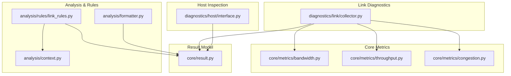
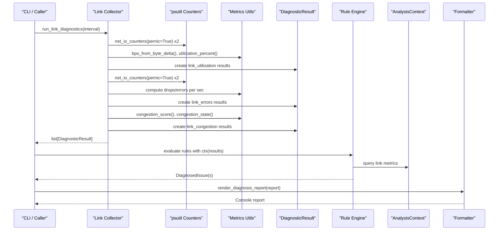
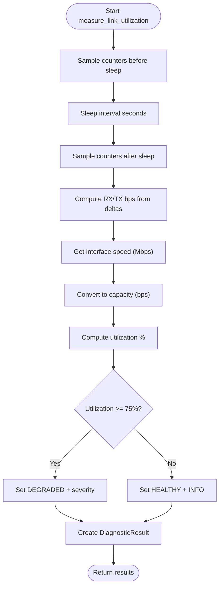
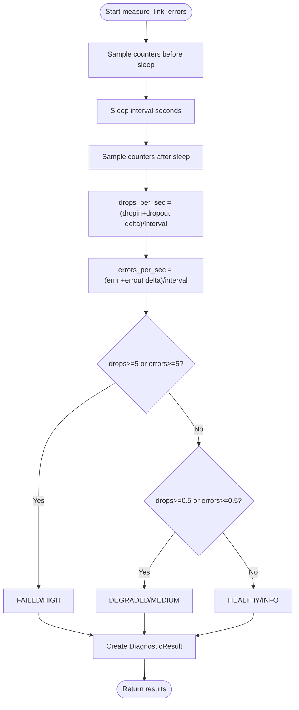
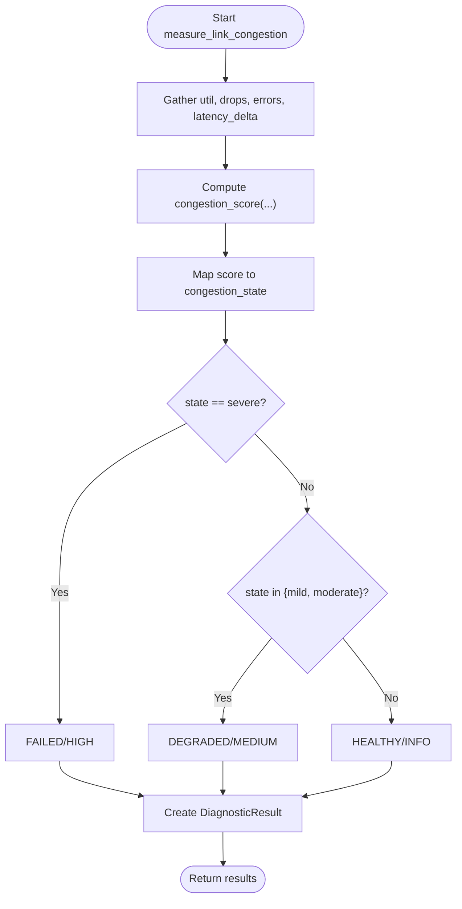
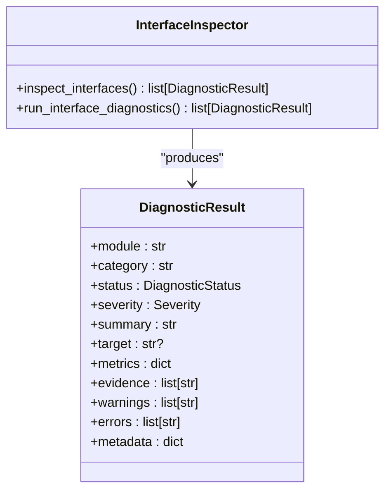
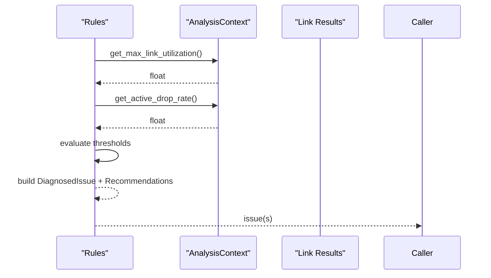
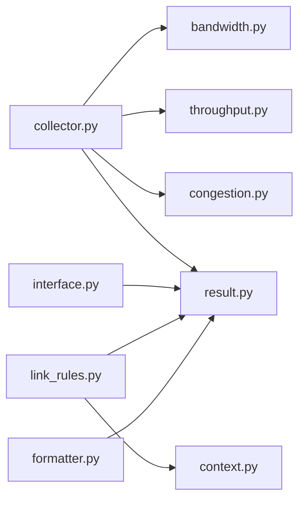

# Link Diagnostics

<cite>
**Referenced Files in This Document**
- [collector.py](file://diagnostics/link/collector.py)
- [congestion.py](file://core/metrics/congestion.py)
- [bandwidth.py](file://core/metrics/bandwidth.py)
- [throughput.py](file://core/metrics/throughput.py)
- [result.py](file://core/result.py)
- [interface.py](file://diagnostics/host/interface.py)
- [link_rules.py](file://analysis/rules/link_rules.py)
- [context.py](file://analysis/context.py)
- [formatter.py](file://analysis/formatter.py)
- [README.md](file://README.md)
</cite>

## Table of Contents
1. [Introduction](#introduction)
2. [Project Structure](#project-structure)
3. [Core Components](#core-components)
4. [Architecture Overview](#architecture-overview)
5. [Detailed Component Analysis](#detailed-component-analysis)
6. [Dependency Analysis](#dependency-analysis)
7. [Performance Considerations](#performance-considerations)
8. [Troubleshooting Guide](#troubleshooting-guide)
9. [Conclusion](#conclusion)
10. [Appendices](#appendices)

## Introduction
This document explains the NetForge link diagnostics module, which provides link-level network monitoring for interfaces on the local host. It covers:
- Interface utilization monitoring (RX/TX throughput and utilization percentage)
- Error rate analysis (packet drops and interface errors per second)
- Congestion detection (composite score combining utilization, drops/errors, and latency delta)
- Data collection methods, metric calculations, and alerting mechanisms
- Configuration options for monitoring intervals and reporting formats
- Examples for interpreting link health metrics and identifying potential issues

The module integrates with the broader NetForge framework to produce standardized diagnostic results that can be consumed by rule engines and formatters for reporting.

## Project Structure
The link diagnostics functionality is implemented under the diagnostics/link package and relies on shared core metrics and result models. Related components include:
- Local interface inspection under diagnostics/host
- Rule-based analysis under analysis/rules
- Shared metric utilities under core/metrics
- Standardized result model under core/result

**Diagram sources**
- [collector.py:1-210](file://diagnostics/link/collector.py#L1-L210)
- [bandwidth.py:1-17](file://core/metrics/bandwidth.py#L1-L17)
- [throughput.py:1-24](file://core/metrics/throughput.py#L1-L24)
- [congestion.py:1-51](file://core/metrics/congestion.py#L1-L51)
- [interface.py:1-147](file://diagnostics/host/interface.py#L1-L147)
- [context.py:1-199](file://analysis/context.py#L1-L199)
- [link_rules.py:1-96](file://analysis/rules/link_rules.py#L1-L96)
- [formatter.py:1-82](file://analysis/formatter.py#L1-L82)
- [result.py:1-47](file://core/result.py#L1-L47)

**Section sources**
- [README.md:1-22](file://README.md#L1-L22)

## Core Components
- Link utilization measurement: captures RX/TX bytes over a configurable interval, converts to bits/sec, estimates capacity from interface speed, and computes utilization percentage.
- Link error measurement: counts packet drops and interface errors over an interval and reports rates per second.
- Congestion detection: combines utilization, drop/error rates, and optional latency delta into a composite score and maps it to a coarse state.
- Host interface inspection: enumerates interfaces, their operational state, addresses, MAC, speed, and MTU.
- Rule engine integration: uses context queries to correlate link metrics across modules and generate diagnosed issues with recommendations.
- Reporting: standardizes outputs as DiagnosticResult objects; console tables are printed for quick inspection.

**Section sources**
- [collector.py:29-179](file://diagnostics/link/collector.py#L29-L179)
- [congestion.py:4-50](file://core/metrics/congestion.py#L4-L50)
- [bandwidth.py:4-16](file://core/metrics/bandwidth.py#L4-L16)
- [throughput.py:4-23](file://core/metrics/throughput.py#L4-L23)
- [interface.py:16-109](file://diagnostics/host/interface.py#L16-L109)
- [context.py:164-179](file://analysis/context.py#L164-L179)
- [link_rules.py:52-95](file://analysis/rules/link_rules.py#L52-L95)
- [result.py:9-47](file://core/result.py#L9-L47)

## Architecture Overview
The link diagnostics pipeline collects raw counters, computes metrics, evaluates thresholds, and produces standardized results. The rule engine consumes these results via a context object to detect higher-level issues.

**Diagram sources**
- [collector.py:182-210](file://diagnostics/link/collector.py#L182-L210)
- [throughput.py:11-23](file://core/metrics/throughput.py#L11-L23)
- [congestion.py:4-50](file://core/metrics/congestion.py#L4-L50)
- [context.py:164-179](file://analysis/context.py#L164-L179)
- [formatter.py:12-82](file://analysis/formatter.py#L12-L82)

## Detailed Component Analysis

### Link Utilization Monitoring
- Data collection:
  - Captures per-interface byte counters before and after a sampling interval using system counters.
  - Computes RX and TX bit rates from deltas over the interval.
- Metric calculation:
  - Converts interface speed from Mbps to bits/sec to determine capacity.
  - Calculates utilization percentage as total_bps divided by capacity, capped at 100%.
- Thresholds and status:
  - Utilization >= 90% → DEGRADED/HIGH
  - Utilization >= 75% → DEGRADED/MEDIUM
  - Otherwise → HEALTHY/INFO
- Output:
  - Produces DiagnosticResult entries with rx_bps, tx_bps, total_bps, util_percent, speed_mbps, and evidence strings.

**Diagram sources**
- [collector.py:29-84](file://diagnostics/link/collector.py#L29-L84)
- [bandwidth.py:4-8](file://core/metrics/bandwidth.py#L4-L8)
- [throughput.py:11-23](file://core/metrics/throughput.py#L11-L23)

**Section sources**
- [collector.py:29-84](file://diagnostics/link/collector.py#L29-L84)
- [bandwidth.py:4-8](file://core/metrics/bandwidth.py#L4-L8)
- [throughput.py:11-23](file://core/metrics/throughput.py#L11-L23)

### Link Error Rate Analysis
- Data collection:
  - Samples per-interface drop and error counters before and after the same interval.
- Metric calculation:
  - Computes drops_per_sec and errors_per_sec by dividing counter deltas by the interval.
- Thresholds and status:
  - Drops or errors >= 5/s → FAILED/HIGH
  - Drops or errors >= 0.5/s → DEGRADED/MEDIUM
  - Otherwise → HEALTHY/INFO
- Output:
  - Produces DiagnosticResult entries with drops_per_sec, errors_per_sec, and warnings when active drops/errors are detected.

**Diagram sources**
- [collector.py:87-129](file://diagnostics/link/collector.py#L87-L129)

**Section sources**
- [collector.py:87-129](file://diagnostics/link/collector.py#L87-L129)

### Congestion Detection
- Inputs:
  - Utilization percent from link utilization results
  - Drop and error rates from link error results
  - Optional latency delta in milliseconds
- Scoring:
  - Adds points based on utilization thresholds, drop/error thresholds, and latency delta increases.
  - Score is bounded to [0, 100].
- State mapping:
  - clear (<20), mild (20–44), moderate (45–69), severe (>=70).
- Status mapping:
  - severe → FAILED/HIGH
  - moderate/mild → DEGRADED/MEDIUM
  - clear → HEALTHY/INFO
- Output:
  - Produces DiagnosticResult entries with congestion_score, congestion_state, and contributing metrics.

**Diagram sources**
- [collector.py:132-179](file://diagnostics/link/collector.py#L132-L179)
- [congestion.py:4-50](file://core/metrics/congestion.py#L4-L50)

**Section sources**
- [collector.py:132-179](file://diagnostics/link/collector.py#L132-L179)
- [congestion.py:4-50](file://core/metrics/congestion.py#L4-L50)

### Host Interface Inspection
- Enumerates all network interfaces and determines operational state.
- Collects IPv4/IPv6 addresses, MAC address, speed, and MTU.
- Determines whether any non-loopback interface is up; marks down interfaces accordingly.
- Produces DiagnosticResult entries suitable for correlation by the rule engine.

**Diagram sources**
- [interface.py:16-109](file://diagnostics/host/interface.py#L16-L109)
- [result.py:24-47](file://core/result.py#L24-L47)

**Section sources**
- [interface.py:16-109](file://diagnostics/host/interface.py#L16-L109)
- [result.py:24-47](file://core/result.py#L24-L47)

### Rule-Based Analysis and Alerting
- Context queries:
  - Aggregates max link utilization and max link drop rates across modules.
- Rules:
  - AllInterfacesDownRule: triggers when every non-loopback interface is down.
  - ActivePacketDropsRule: triggers when active drops/errors exceed thresholds.
- Recommendations:
  - Provide actionable steps such as checking cabling, drivers, or RF interference.
- Reporting:
  - Formatted diagnosis reports summarize key observations and identified root causes.

**Diagram sources**
- [context.py:164-179](file://analysis/context.py#L164-L179)
- [link_rules.py:9-49](file://analysis/rules/link_rules.py#L9-L49)
- [link_rules.py:52-95](file://analysis/rules/link_rules.py#L52-L95)

**Section sources**
- [context.py:164-179](file://analysis/context.py#L164-L179)
- [link_rules.py:9-49](file://analysis/rules/link_rules.py#L9-L49)
- [link_rules.py:52-95](file://analysis/rules/link_rules.py#L52-L95)
- [formatter.py:12-82](file://analysis/formatter.py#L12-L82)

## Dependency Analysis
- collector.py depends on:
  - psutil for system counters and interface stats
  - core.metrics.bandwidth for capacity conversion
  - core.metrics.throughput for bps and utilization calculations
  - core.metrics.congestion for scoring and state mapping
  - core.result for standardized output
- interface.py depends on:
  - psutil for interface enumeration and stats
  - core.result for standardized output
- link_rules.py depends on:
  - analysis.context for querying aggregated metrics
  - core.result for severity
- formatter.py depends on:
  - analysis.models for report structures
  - core.result for status/severity rendering

**Diagram sources**
- [collector.py:1-210](file://diagnostics/link/collector.py#L1-L210)
- [interface.py:1-147](file://diagnostics/host/interface.py#L1-L147)
- [link_rules.py:1-96](file://analysis/rules/link_rules.py#L1-L96)
- [context.py:1-199](file://analysis/context.py#L1-L199)
- [formatter.py:1-82](file://analysis/formatter.py#L1-L82)
- [bandwidth.py:1-17](file://core/metrics/bandwidth.py#L1-L17)
- [throughput.py:1-24](file://core/metrics/throughput.py#L1-L24)
- [congestion.py:1-51](file://core/metrics/congestion.py#L1-L51)
- [result.py:1-47](file://core/result.py#L1-L47)

**Section sources**
- [collector.py:1-210](file://diagnostics/link/collector.py#L1-L210)
- [interface.py:1-147](file://diagnostics/host/interface.py#L1-L147)
- [link_rules.py:1-96](file://analysis/rules/link_rules.py#L1-L96)
- [context.py:1-199](file://analysis/context.py#L1-L199)
- [formatter.py:1-82](file://analysis/formatter.py#L1-L82)

## Performance Considerations
- Sampling interval:
  - Short intervals provide timely detection but may increase CPU usage due to frequent polling.
  - Longer intervals smooth out transient spikes but reduce responsiveness.
- Counter granularity:
  - System counters are coarse-grained; very short intervals may yield noisy rates.
- Loopback exclusion:
  - Loopback interfaces are excluded to avoid skewing utilization and error metrics.
- Throughput estimation:
  - Utilization percentage assumes accurate negotiated link speed; unknown speeds result in None utilization.

[No sources needed since this section provides general guidance]

## Troubleshooting Guide
- High utilization:
  - If util_percent >= 75%, expect DEGRADED status; investigate traffic sources and consider bandwidth upgrades or traffic shaping.
- Active drops/errors:
  - Drops/errors >= 0.5/s trigger DEGRADED; >= 5/s trigger FAILED. Inspect physical cabling, switch ports, duplex settings, and wireless interference.
- Congestion state:
  - Severe congestion indicates combined pressure from high utilization, drops/errors, and/or latency rise. Correlate with path and transport metrics.
- All interfaces down:
  - When no non-loopback interface is UP, the host is isolated. Verify physical connections and adapter status.

**Section sources**
- [collector.py:53-58](file://diagnostics/link/collector.py#L53-L58)
- [collector.py:106-111](file://diagnostics/link/collector.py#L106-L111)
- [collector.py:154-159](file://diagnostics/link/collector.py#L154-L159)
- [link_rules.py:14-49](file://analysis/rules/link_rules.py#L14-L49)

## Conclusion
NetForge’s link diagnostics module delivers robust, standardized monitoring of interface utilization, error rates, and congestion. By combining low-level counter sampling with heuristic scoring and rule-based analysis, it enables early detection of link saturation, hardware issues, and congestion patterns. The standardized DiagnosticResult format ensures consistent consumption by higher-level analysis and reporting components.

[No sources needed since this section summarizes without analyzing specific files]

## Appendices

### Configuration Options
- Monitoring interval:
  - Configurable via the interval parameter in link diagnostics functions. Default is 1.0 second. Adjust based on desired responsiveness and overhead.
- Thresholds:
  - Utilization thresholds: 75% and 90% map to DEGRADED levels.
  - Error/drop thresholds: 0.5/s and 5/s map to DEGRADED and FAILED respectively.
  - Congestion scoring thresholds: utilization bands, drop/error bands, and latency delta increments influence score and state.
- Reporting formats:
  - Console tables are printed for quick inspection.
  - Structured DiagnosticResult objects enable programmatic consumption and integration with rule engines and formatters.

**Section sources**
- [collector.py:29-84](file://diagnostics/link/collector.py#L29-L84)
- [collector.py:87-129](file://diagnostics/link/collector.py#L87-L129)
- [collector.py:132-179](file://diagnostics/link/collector.py#L132-L179)
- [congestion.py:4-50](file://core/metrics/congestion.py#L4-L50)
- [formatter.py:12-82](file://analysis/formatter.py#L12-L82)

### Interpreting Link Health Metrics
- Example scenarios:
  - Stable link: util_percent < 75%, drops/errors near 0, congestion_state clear → HEALTHY.
  - Approaching saturation: util_percent between 75% and 90%, minor drops/errors → DEGRADED/MEDIUM.
  - Overloaded link: util_percent >= 90%, elevated drops/errors, congestion_state moderate/severe → DEGRADED/FAILED.
  - Physical issues: high drops/errors even with low utilization → inspect cabling, NIC, or wireless environment.
- Actionable steps:
  - For saturation: identify top talkers, apply QoS or traffic shaping, or upgrade link capacity.
  - For errors: replace cables, check switch port configuration, verify duplex settings, assess Wi-Fi SNR and channel congestion.
  - For congestion: correlate with path loss and latency; adjust routing or application behavior if necessary.

**Section sources**
- [collector.py:53-58](file://diagnostics/link/collector.py#L53-L58)
- [collector.py:106-111](file://diagnostics/link/collector.py#L106-L111)
- [collector.py:154-159](file://diagnostics/link/collector.py#L154-L159)
- [link_rules.py:52-95](file://analysis/rules/link_rules.py#L52-L95)