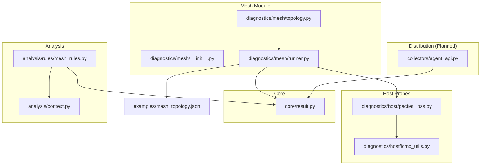
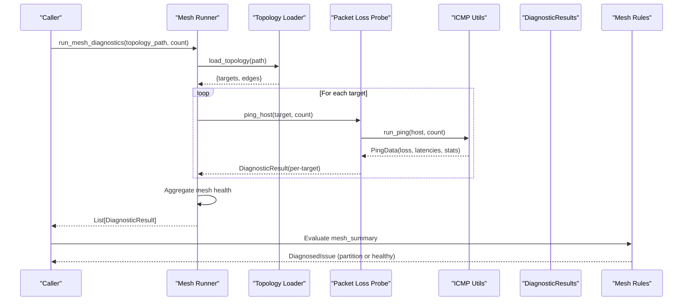
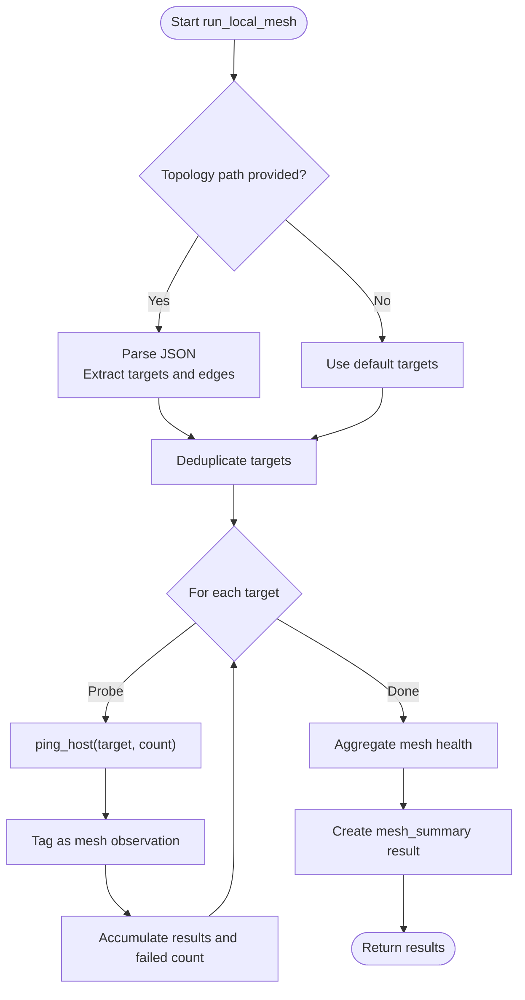
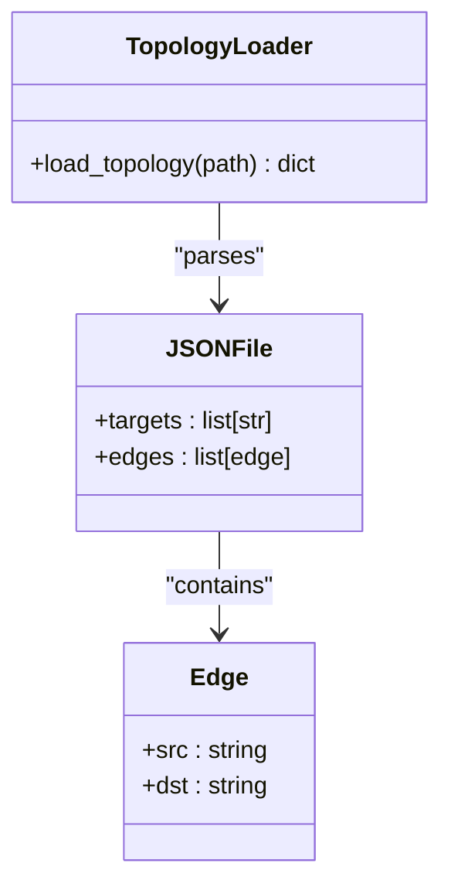
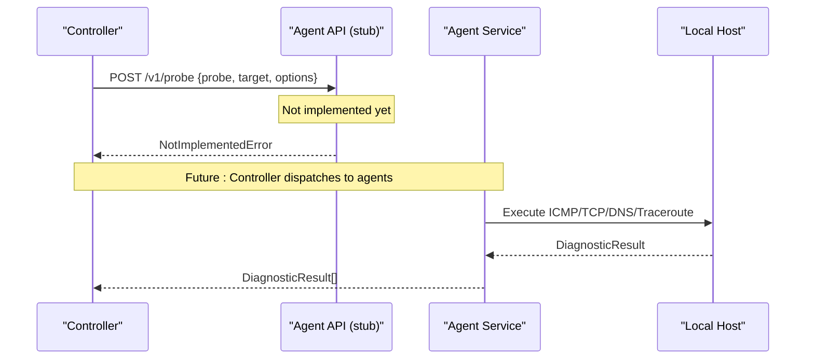
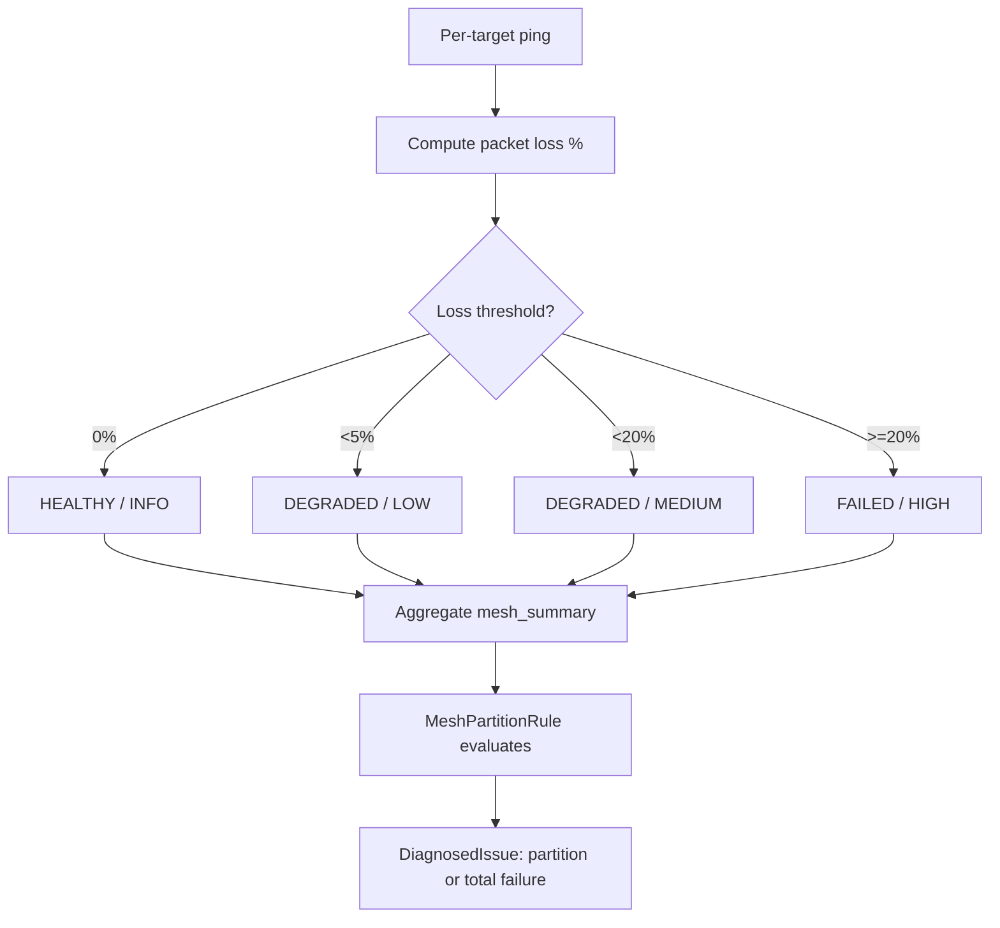
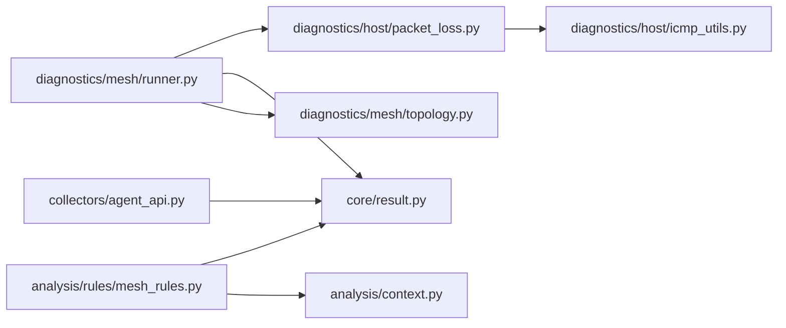

# Mesh Diagnostics

<cite>
**Referenced Files in This Document**
- [runner.py](file://diagnostics/mesh/runner.py)
- [topology.py](file://diagnostics/mesh/topology.py)
- [__init__.py](file://diagnostics/mesh/__init__.py)
- [packet_loss.py](file://diagnostics/host/packet_loss.py)
- [icmp_utils.py](file://diagnostics/host/icmp_utils.py)
- [result.py](file://core/result.py)
- [agent_api.py](file://collectors/agent_api.py)
- [mesh_rules.py](file://analysis/rules/mesh_rules.py)
- [context.py](file://analysis/context.py)
- [mesh_topology.json](file://examples/mesh_topology.json)
</cite>

## Table of Contents
1. [Introduction](#introduction)
2. [Project Structure](#project-structure)
3. [Core Components](#core-components)
4. [Architecture Overview](#architecture-overview)
5. [Detailed Component Analysis](#detailed-component-analysis)
6. [Dependency Analysis](#dependency-analysis)
7. [Performance Considerations](#performance-considerations)
8. [Troubleshooting Guide](#troubleshooting-guide)
9. [Conclusion](#conclusion)
10. [Appendices](#appendices)

## Introduction
This document explains the NetForge mesh diagnostics module, which provides distributed ping-based connectivity testing across multiple nodes and topology-driven probing. It covers:
- Distributed ping mesh functionality and multi-node connectivity testing
- Topology-based probing using JSON-defined targets and edges
- Mesh runner orchestration for single-vantage execution and a planned remote agent contract for distributed coordination
- Configuration options for mesh size, probe intervals, and failure detection
- Examples for setting up mesh networks, interpreting results, and diagnosing distributed network issues

The module integrates with NetForge’s shared result model and rule engine to produce actionable insights about partial or total mesh failures.

## Project Structure
The mesh diagnostics module is organized under diagnostics/mesh with supporting components in host diagnostics, core result modeling, analysis rules, and a stub for remote agent-based distribution.

**Diagram sources**
- [runner.py:1-114](file://diagnostics/mesh/runner.py#L1-L114)
- [topology.py:1-6](file://diagnostics/mesh/topology.py#L1-L6)
- [packet_loss.py:1-121](file://diagnostics/host/packet_loss.py#L1-L121)
- [icmp_utils.py:1-126](file://diagnostics/host/icmp_utils.py#L1-L126)
- [result.py:1-47](file://core/result.py#L1-L47)
- [mesh_rules.py:1-70](file://analysis/rules/mesh_rules.py#L1-L70)
- [context.py:41-68](file://analysis/context.py#L41-L68)
- [agent_api.py:1-40](file://collectors/agent_api.py#L1-L40)
- [mesh_topology.json:1-8](file://examples/mesh_topology.json#L1-L8)

**Section sources**
- [runner.py:1-114](file://diagnostics/mesh/runner.py#L1-L114)
- [topology.py:1-6](file://diagnostics/mesh/topology.py#L1-L6)
- [packet_loss.py:1-121](file://diagnostics/host/packet_loss.py#L1-L121)
- [icmp_utils.py:1-126](file://diagnostics/host/icmp_utils.py#L1-L126)
- [result.py:1-47](file://core/result.py#L1-L47)
- [mesh_rules.py:1-70](file://analysis/rules/mesh_rules.py#L1-L70)
- [context.py:41-68](file://analysis/context.py#L41-L68)
- [agent_api.py:1-40](file://collectors/agent_api.py#L1-L40)
- [mesh_topology.json:1-8](file://examples/mesh_topology.json#L1-L8)

## Core Components
- Mesh Runner: Orchestrates target discovery from a JSON topology and runs ICMP probes per target, aggregating results into a summary.
- Topology Loader: Parses a JSON file defining targets and edges to build the set of destinations to probe.
- Host Packet Loss Probe: Executes ICMP pings and computes loss, latency, jitter, and status.
- Result Model: Standardized DiagnosticResult used across modules for status, severity, metrics, evidence, and metadata.
- Analysis Rules: Detects partial or total mesh partitions based on aggregated mesh results.
- Remote Agent API (Planned): Contract for distributed probing via HTTP; not implemented yet.

Key responsibilities:
- Target resolution from explicit lists or topology files
- Execution of ICMP probes with configurable count
- Aggregation of per-target results into a mesh-wide health assessment
- Integration with analysis rules for automated diagnosis

**Section sources**
- [runner.py:18-94](file://diagnostics/mesh/runner.py#L18-L94)
- [topology.py:1-6](file://diagnostics/mesh/topology.py#L1-L6)
- [packet_loss.py:14-77](file://diagnostics/host/packet_loss.py#L14-L77)
- [icmp_utils.py:29-115](file://diagnostics/host/icmp_utils.py#L29-L115)
- [result.py:9-47](file://core/result.py#L9-L47)
- [mesh_rules.py:9-70](file://analysis/rules/mesh_rules.py#L9-L70)
- [agent_api.py:10-39](file://collectors/agent_api.py#L10-L39)

## Architecture Overview
The mesh diagnostics architecture combines local ICMP probing with a structured result pipeline and rule-based analysis. A future extension supports distributed probing through a remote agent API.

**Diagram sources**
- [runner.py:26-113](file://diagnostics/mesh/runner.py#L26-L113)
- [topology.py:1-6](file://diagnostics/mesh/topology.py#L1-L6)
- [packet_loss.py:14-77](file://diagnostics/host/packet_loss.py#L14-L77)
- [icmp_utils.py:68-115](file://diagnostics/host/icmp_utils.py#L68-L115)
- [mesh_rules.py:14-70](file://analysis/rules/mesh_rules.py#L14-L70)

## Detailed Component Analysis

### Mesh Runner Orchestration
- Loads topology from JSON, extracting targets and edges to form the destination set.
- Runs ICMP probes per target via packet_loss.ping_host, tagging results as mesh observations.
- Aggregates per-target results into a mesh_summary with overall status and severity.
- Provides a convenience function that prints a table of per-target loss and status.

**Diagram sources**
- [runner.py:26-94](file://diagnostics/mesh/runner.py#L26-L94)

**Section sources**
- [runner.py:18-113](file://diagnostics/mesh/runner.py#L18-L113)

### Topology Management
- The topology loader validates that the JSON contains either targets or edges.
- Edges can be objects with src/dst or tuples/lists where dst is the second element.
- Example topology defines a small set of targets and edges from a local source.

**Diagram sources**
- [runner.py:18-23](file://diagnostics/mesh/runner.py#L18-L23)
- [mesh_topology.json:1-8](file://examples/mesh_topology.json#L1-L8)

**Section sources**
- [runner.py:18-23](file://diagnostics/mesh/runner.py#L18-L23)
- [mesh_topology.json:1-8](file://examples/mesh_topology.json#L1-L8)

### Distributed Coordination Mechanisms
- Current implementation is single-vantage: all probes originate from the local host.
- A remote agent API contract is defined for future distributed probing, including endpoint, method, request schema, and response format.
- The agent service demonstrates how an agent could execute ICMP probes locally when requested by a controller.

**Diagram sources**
- [agent_api.py:10-39](file://collectors/agent_api.py#L10-L39)
- [agent/service.py:73-90](file://agent/service.py#L73-L90)

**Section sources**
- [agent_api.py:1-40](file://collectors/agent_api.py#L1-L40)
- [agent/service.py:73-90](file://agent/service.py#L73-L90)

### Failure Detection and Analysis
- Per-target ping results are converted to DiagnosticResult with status and severity based on packet loss thresholds.
- The mesh runner aggregates these into a mesh_summary indicating overall health.
- Mesh rules detect partial or total mesh partitions and provide recommendations.

**Diagram sources**
- [packet_loss.py:32-77](file://diagnostics/host/packet_loss.py#L32-L77)
- [runner.py:68-94](file://diagnostics/mesh/runner.py#L68-L94)
- [mesh_rules.py:14-70](file://analysis/rules/mesh_rules.py#L14-L70)

**Section sources**
- [packet_loss.py:32-77](file://diagnostics/host/packet_loss.py#L32-L77)
- [runner.py:68-94](file://diagnostics/mesh/runner.py#L68-L94)
- [mesh_rules.py:14-70](file://analysis/rules/mesh_rules.py#L14-L70)

## Dependency Analysis
The mesh module depends on host-level ICMP utilities and the shared result model. Analysis rules consume mesh results to generate diagnoses. The planned distributed layer depends on an HTTP contract for remote agents.

**Diagram sources**
- [runner.py:1-114](file://diagnostics/mesh/runner.py#L1-L114)
- [packet_loss.py:1-121](file://diagnostics/host/packet_loss.py#L1-L121)
- [icmp_utils.py:1-126](file://diagnostics/host/icmp_utils.py#L1-L126)
- [result.py:1-47](file://core/result.py#L1-L47)
- [topology.py:1-6](file://diagnostics/mesh/topology.py#L1-L6)
- [mesh_rules.py:1-70](file://analysis/rules/mesh_rules.py#L1-L70)
- [context.py:41-68](file://analysis/context.py#L41-L68)
- [agent_api.py:1-40](file://collectors/agent_api.py#L1-L40)

**Section sources**
- [runner.py:1-114](file://diagnostics/mesh/runner.py#L1-L114)
- [packet_loss.py:1-121](file://diagnostics/host/packet_loss.py#L1-L121)
- [icmp_utils.py:1-126](file://diagnostics/host/icmp_utils.py#L1-L126)
- [result.py:1-47](file://core/result.py#L1-L47)
- [topology.py:1-6](file://diagnostics/mesh/topology.py#L1-L6)
- [mesh_rules.py:1-70](file://analysis/rules/mesh_rules.py#L1-L70)
- [context.py:41-68](file://analysis/context.py#L41-L68)
- [agent_api.py:1-40](file://collectors/agent_api.py#L1-L40)

## Performance Considerations
- Probe count affects runtime and CPU usage; higher counts increase accuracy but also latency.
- ICMP output parsing uses regex; ensure system ping output matches expected patterns for reliable parsing.
- Local caching of ping results reduces redundant work within a short TTL window.
- Aggregation logic is linear in the number of targets; large meshes may benefit from parallelization in future versions.

[No sources needed since this section provides general guidance]

## Troubleshooting Guide
Common issues and resolutions:
- All mesh targets unreachable: Indicates local uplink failure or broad outage. Verify gateway reachability and local routing.
- Partial mesh partition: Suggests regional partition, selective ACL, or destination-specific outage. Compare failed vs healthy targets to localize boundaries.
- Unknown or missing packet loss: May indicate parsing issues or non-standard ping output; inspect raw output in metadata.
- Remote agent not available: The distributed API is a stub; until implemented, use local mesh runner for single-vantage tests.

Operational tips:
- Use topology files to define consistent target sets across environments.
- Inspect per-target results and the mesh_summary for quick triage.
- Leverage analysis rules to automatically identify partition scenarios and get recommendations.

**Section sources**
- [mesh_rules.py:24-69](file://analysis/rules/mesh_rules.py#L24-L69)
- [icmp_utils.py:68-115](file://diagnostics/host/icmp_utils.py#L68-L115)
- [agent_api.py:10-27](file://collectors/agent_api.py#L10-L27)

## Conclusion
The NetForge mesh diagnostics module provides a robust foundation for distributed ping-based connectivity testing. It supports topology-driven target selection, standardized result aggregation, and rule-based diagnosis of partial or total mesh failures. While the current implementation is single-vantage, the design includes a clear path to distributed coordination via a remote agent API. Operators can configure mesh size and probe intensity, interpret results through summaries and tables, and leverage analysis rules to diagnose network issues efficiently.

[No sources needed since this section summarizes without analyzing specific files]

## Appendices

### Configuration Options
- Targets: Provide a list of IP addresses or hostnames directly or via a JSON topology file.
- Count: Number of ICMP probes per target; controls accuracy and runtime.
- Topology Path: Optional JSON file containing targets and edges to define mesh structure.
- Remote Agent URL: Placeholder for future distributed probing; currently raises an error if used.

Example topology fields:
- targets: Array of destination IPs or hostnames
- edges: Array of connections, each with src and dst

**Section sources**
- [runner.py:26-44](file://diagnostics/mesh/runner.py#L26-L44)
- [mesh_topology.json:1-8](file://examples/mesh_topology.json#L1-L8)
- [agent_api.py:30-39](file://collectors/agent_api.py#L30-L39)

### Interpreting Connectivity Results
- Per-target results include packet loss percentage, status, and severity.
- The mesh_summary aggregates overall health and indicates whether all, some, or none of the targets are reachable.
- Failed targets can be extracted from per-target results to focus troubleshooting efforts.

**Section sources**
- [runner.py:47-94](file://diagnostics/mesh/runner.py#L47-L94)
- [packet_loss.py:32-77](file://diagnostics/host/packet_loss.py#L32-L77)

### Setting Up Mesh Networks
- Create a JSON topology file with targets and edges describing your desired mesh.
- Run the mesh diagnostics against the topology file to probe all configured destinations.
- Review the printed table and mesh_summary to assess connectivity.

**Section sources**
- [mesh_topology.json:1-8](file://examples/mesh_topology.json#L1-L8)
- [runner.py:97-113](file://diagnostics/mesh/runner.py#L97-L113)