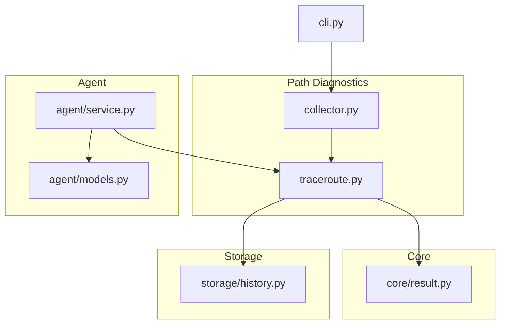
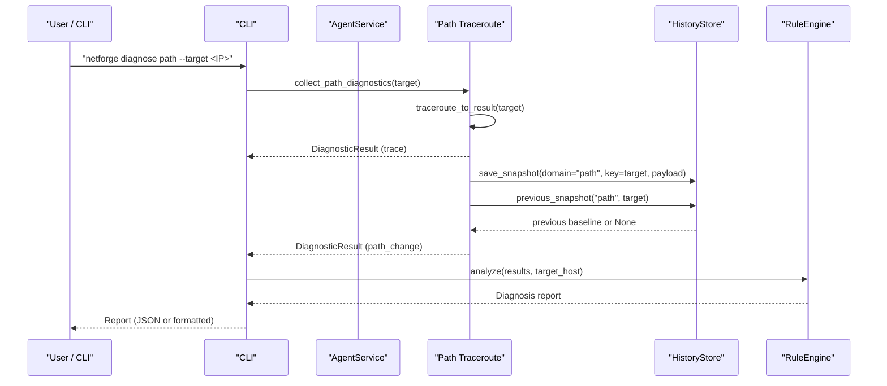
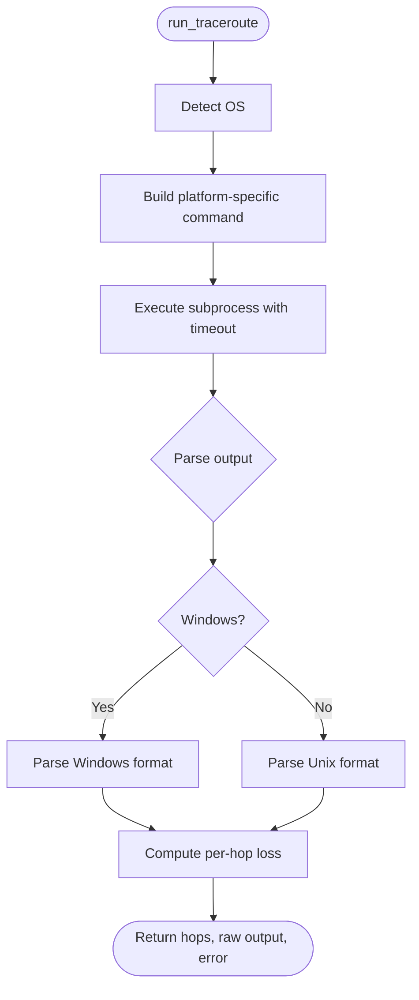
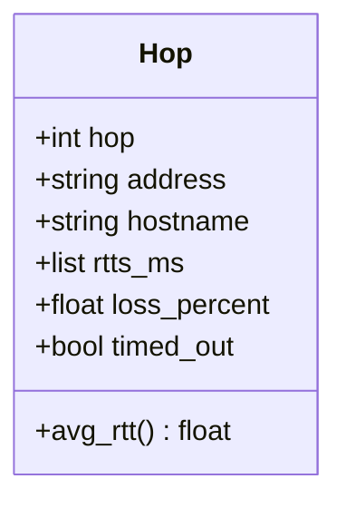
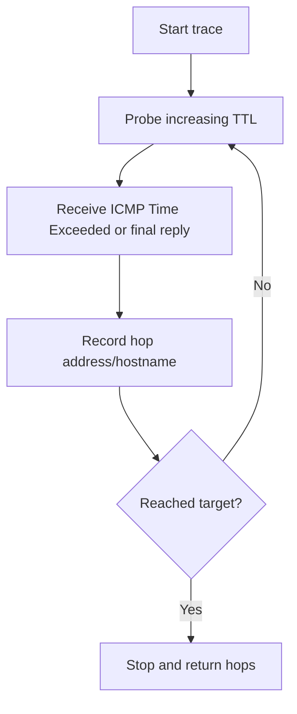
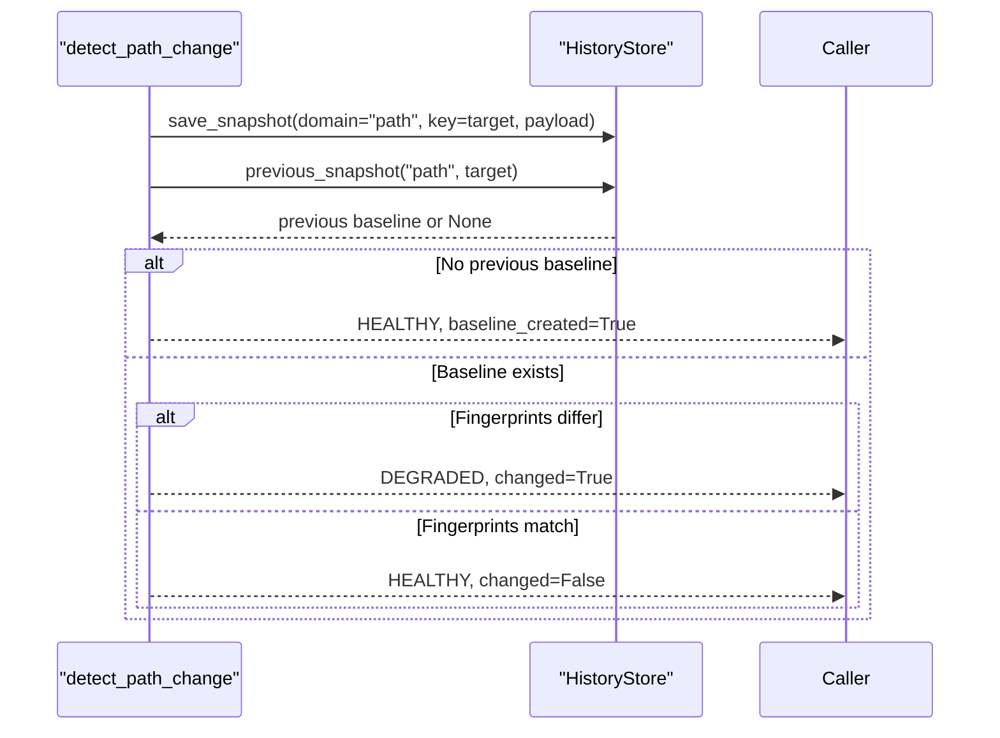
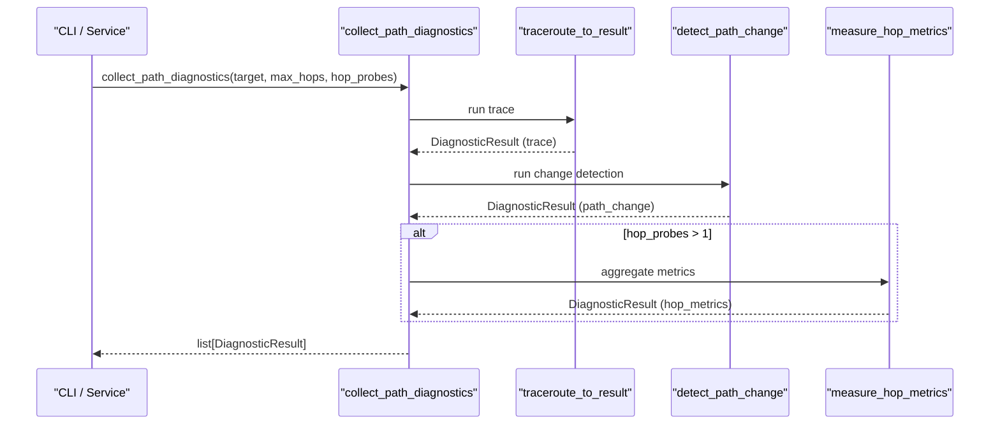
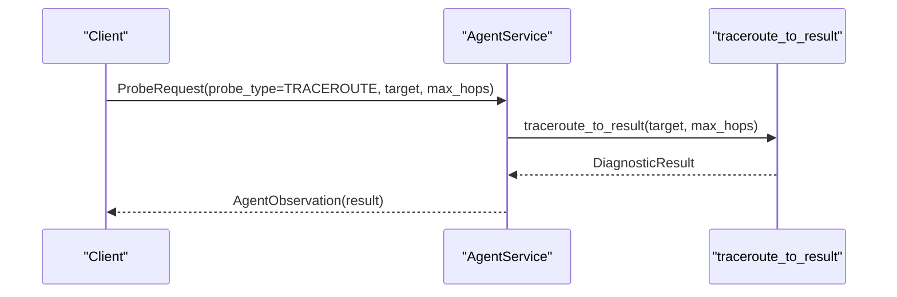
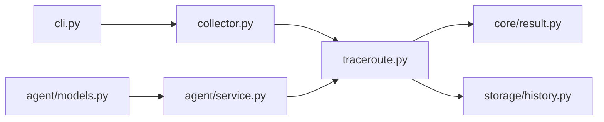

# Path Diagnostics

<cite>
**Referenced Files in This Document**
- [traceroute.py](file://diagnostics/path/traceroute.py)
- [collector.py](file://diagnostics/path/collector.py)
- [result.py](file://core/result.py)
- [history.py](file://storage/history.py)
- [service.py](file://agent/service.py)
- [models.py](file://agent/models.py)
- [cli.py](file://cli.py)
</cite>

## Table of Contents
1. [Introduction](#introduction)
2. [Project Structure](#project-structure)
3. [Core Components](#core-components)
4. [Architecture Overview](#architecture-overview)
5. [Detailed Component Analysis](#detailed-component-analysis)
6. [Dependency Analysis](#dependency-analysis)
7. [Performance Considerations](#performance-considerations)
8. [Troubleshooting Guide](#troubleshooting-guide)
9. [Conclusion](#conclusion)
10. [Appendices](#appendices)

## Introduction
This document explains the NetForge path diagnostics module, which performs path-level network analysis using traceroute-based probes. It covers hop-by-hop analysis, timing measurements, route discovery algorithms, and path change detection. It also documents configuration options for probe parameters, timeouts, and result formatting, and provides examples to analyze network paths, identify bottlenecks, and troubleshoot routing issues.

## Project Structure
The path diagnostics module is organized under diagnostics/path with a clear separation between:
- Traceroute execution and parsing
- Aggregation and collection orchestration
- Integration with core result structures and storage history

**Diagram sources**
- [traceroute.py:1-359](file://diagnostics/path/traceroute.py#L1-L359)
- [collector.py:1-24](file://diagnostics/path/collector.py#L1-L24)
- [result.py:1-47](file://core/result.py#L1-L47)
- [history.py:1-115](file://storage/history.py#L1-L115)
- [service.py:1-111](file://agent/service.py#L1-L111)
- [models.py:1-41](file://agent/models.py#L1-L41)
- [cli.py:490-578](file://cli.py#L490-L578)

**Section sources**
- [traceroute.py:1-359](file://diagnostics/path/traceroute.py#L1-L359)
- [collector.py:1-24](file://diagnostics/path/collector.py#L1-L24)
- [result.py:1-47](file://core/result.py#L1-L47)
- [history.py:1-115](file://storage/history.py#L1-L115)
- [service.py:1-111](file://agent/service.py#L1-L111)
- [models.py:1-41](file://agent/models.py#L1-L41)
- [cli.py:490-578](file://cli.py#L490-L578)

## Core Components
- Hop data model representing per-hop metrics (address, hostname, RTTs, loss, timeout).
- Traceroute runner that executes system traceroute/tracert with platform-specific flags and parses output into hops.
- Result builder that converts traceroute results into standardized DiagnosticResult objects with status, severity, metrics, evidence, and metadata.
- Hop metrics aggregator that runs multiple traces and aggregates per-hop latency and loss.
- Path change detector that compares current path fingerprints against stored baselines to detect routing changes.
- Collector that orchestrates running traceroute, path change detection, and optional hop metrics aggregation.

Key responsibilities:
- Execute cross-platform traceroute and parse outputs reliably.
- Compute per-hop average RTT and loss percentages.
- Generate structured diagnostic results suitable for rule engine consumption.
- Persist and compare path fingerprints to detect routing changes.

**Section sources**
- [traceroute.py:19-40](file://diagnostics/path/traceroute.py#L19-L40)
- [traceroute.py:42-135](file://diagnostics/path/traceroute.py#L42-L135)
- [traceroute.py:138-213](file://diagnostics/path/traceroute.py#L138-L213)
- [traceroute.py:216-276](file://diagnostics/path/traceroute.py#L216-L276)
- [traceroute.py:279-339](file://diagnostics/path/traceroute.py#L279-L339)
- [collector.py:11-23](file://diagnostics/path/collector.py#L11-L23)
- [result.py:9-47](file://core/result.py#L9-L47)
- [history.py:15-115](file://storage/history.py#L15-L115)

## Architecture Overview
The path diagnostics flow integrates with the agent service and CLI to collect observations and produce diagnosis reports.

**Diagram sources**
- [cli.py:490-517](file://cli.py#L490-L517)
- [collector.py:11-23](file://diagnostics/path/collector.py#L11-L23)
- [traceroute.py:138-213](file://diagnostics/path/traceroute.py#L138-L213)
- [traceroute.py:279-339](file://diagnostics/path/traceroute.py#L279-L339)
- [history.py:45-90](file://storage/history.py#L45-L90)

## Detailed Component Analysis

### Traceroute Implementation and Parsing
- Platform detection selects appropriate command-line tool and flags:
  - Windows: tracert with host resolution disabled and max hops parameter.
  - macOS/Linux: traceroute with numeric output and max hops parameter.
- Output parsing handles both Windows and Unix-like formats:
  - Extracts hop number, addresses/hostnames, and RTT values.
  - Detects timeouts and star responses.
  - Computes per-hop loss based on expected probe count (typically 3).
- Timeout handling wraps subprocess execution with an overall timeout.

**Diagram sources**
- [traceroute.py:115-135](file://diagnostics/path/traceroute.py#L115-L135)
- [traceroute.py:42-112](file://diagnostics/path/traceroute.py#L42-L112)

**Section sources**
- [traceroute.py:115-135](file://diagnostics/path/traceroute.py#L115-L135)
- [traceroute.py:42-112](file://diagnostics/path/traceroute.py#L42-L112)

### Hop-by-Hop Analysis and Timing Measurements
- Per-hop metrics include:
  - Address and hostname extraction.
  - List of RTT samples; average RTT computed when samples exist.
  - Loss percentage derived from missing responses relative to expected probes.
  - Timeout flag when no responses are received.
- Aggregated hop metrics across multiple probes:
  - Combines RTT samples across runs.
  - Recomputes loss over total expected samples (probes × 3).
  - Produces a summary including maximum hop loss and sample counts.

**Diagram sources**
- [traceroute.py:19-31](file://diagnostics/path/traceroute.py#L19-L31)

**Section sources**
- [traceroute.py:19-31](file://diagnostics/path/traceroute.py#L19-L31)
- [traceroute.py:138-213](file://diagnostics/path/traceroute.py#L138-L213)
- [traceroute.py:216-276](file://diagnostics/path/traceroute.py#L216-L276)

### Route Discovery Algorithms
- Uses native traceroute/tracert to discover intermediate routers toward the target.
- Parses each hop’s response to build ordered hop list.
- Derives path fingerprint by hashing hop sequence and addresses for change detection.

[No sources needed since this diagram shows conceptual workflow, not actual code structure]

**Section sources**
- [traceroute.py:115-135](file://diagnostics/path/traceroute.py#L115-L135)
- [traceroute.py:42-112](file://diagnostics/path/traceroute.py#L42-L112)
- [traceroute.py:33-39](file://diagnostics/path/traceroute.py#L33-L39)

### Path Change Detection
- Stores current path snapshot with fingerprint and hop details.
- Compares current fingerprint against previous baseline.
- Returns a DiagnosticResult indicating whether the path changed, with evidence and warnings.

**Diagram sources**
- [traceroute.py:279-339](file://diagnostics/path/traceroute.py#L279-L339)
- [history.py:45-90](file://storage/history.py#L45-L90)

**Section sources**
- [traceroute.py:279-339](file://diagnostics/path/traceroute.py#L279-L339)
- [history.py:45-90](file://storage/history.py#L45-L90)

### Collector Orchestration
- Runs traceroute to generate a base result.
- Performs path change detection against stored baseline.
- Optionally runs hop metrics aggregation if configured with multiple probes.

**Diagram sources**
- [collector.py:11-23](file://diagnostics/path/collector.py#L11-L23)
- [traceroute.py:138-213](file://diagnostics/path/traceroute.py#L138-L213)
- [traceroute.py:279-339](file://diagnostics/path/traceroute.py#L279-L339)
- [traceroute.py:216-276](file://diagnostics/path/traceroute.py#L216-L276)

**Section sources**
- [collector.py:11-23](file://diagnostics/path/collector.py#L11-L23)

### Integration with Agent and CLI
- Agent service supports TRACEROUTE probe type, invoking traceroute_to_result with max_hops from request.
- CLI exposes a path diagnostic command that collects results and runs rule analysis.

**Diagram sources**
- [service.py:73-83](file://agent/service.py#L73-L83)
- [models.py:10-29](file://agent/models.py#L10-L29)
- [traceroute.py:138-213](file://diagnostics/path/traceroute.py#L138-L213)

**Section sources**
- [service.py:73-83](file://agent/service.py#L73-L83)
- [models.py:10-29](file://agent/models.py#L10-L29)
- [cli.py:490-517](file://cli.py#L490-L517)

## Dependency Analysis
- The path module depends on:
  - core.result for standardized DiagnosticResult types and enums.
  - storage.history for baseline persistence and comparison.
  - agent.service and models for integration via API requests.
  - cli for user-facing commands and reporting.

**Diagram sources**
- [traceroute.py:1-359](file://diagnostics/path/traceroute.py#L1-L359)
- [collector.py:1-24](file://diagnostics/path/collector.py#L1-L24)
- [result.py:1-47](file://core/result.py#L1-L47)
- [history.py:1-115](file://storage/history.py#L1-L115)
- [service.py:1-111](file://agent/service.py#L1-L111)
- [models.py:1-41](file://agent/models.py#L1-L41)
- [cli.py:490-578](file://cli.py#L490-L578)

**Section sources**
- [traceroute.py:1-359](file://diagnostics/path/traceroute.py#L1-L359)
- [collector.py:1-24](file://diagnostics/path/collector.py#L1-L24)
- [result.py:1-47](file://core/result.py#L1-L47)
- [history.py:1-115](file://storage/history.py#L1-L115)
- [service.py:1-111](file://agent/service.py#L1-L111)
- [models.py:1-41](file://agent/models.py#L1-L41)
- [cli.py:490-578](file://cli.py#L490-L578)

## Performance Considerations
- Subprocess execution overhead: Each traceroute call invokes an external process; batch multiple probes only when necessary.
- Timeout settings: Ensure sufficient timeout for long paths or congested networks to avoid premature failures.
- Parsing efficiency: Regex-based parsing is straightforward but can be optimized if large outputs are expected.
- Storage operations: HistoryStore uses SQLite; frequent writes are acceptable but consider batching if many targets are monitored.
- Aggregation cost: measure_hop_metrics multiplies runtime by the number of probes; use conservative probe counts for routine checks.

[No sources needed since this section provides general guidance]

## Troubleshooting Guide
Common issues and resolutions:
- No hops discovered:
  - Indicates failure to execute traceroute or reach any hop; check permissions, firewall rules, and target reachability.
  - Inspect errors in DiagnosticResult.errors and metadata.raw_output.
- High per-hop loss:
  - Look for hops with high loss_percent; investigate upstream congestion or ACLs dropping probes.
  - Use measure_hop_metrics to confirm persistent loss across multiple traces.
- Path changes detected:
  - Compare current and previous fingerprints; verify if routing changes are expected (failover, ECMP).
  - Re-run diagnostics after stabilization to confirm transient behavior.
- Timeouts:
  - Increase timeout_sec for long paths or slow networks; ensure system traceroute tools are available.

Operational tips:
- Use JSON output for programmatic inspection of results and metrics.
- Combine path diagnostics with host and link diagnostics to localize issues.
- Leverage CLI strict mode to exit with non-zero status on degraded conditions.

**Section sources**
- [traceroute.py:138-213](file://diagnostics/path/traceroute.py#L138-L213)
- [traceroute.py:216-276](file://diagnostics/path/traceroute.py#L216-L276)
- [traceroute.py:279-339](file://diagnostics/path/traceroute.py#L279-L339)
- [cli.py:490-517](file://cli.py#L490-L517)

## Conclusion
NetForge’s path diagnostics module provides robust traceroute-based path analysis with hop-by-hop metrics, timing measurements, and path change detection. It integrates seamlessly with the agent service and CLI, producing standardized diagnostic results that feed into the rule engine for actionable insights. By tuning probe parameters and timeouts, operators can effectively analyze network paths, identify bottlenecks, and troubleshoot routing issues.

[No sources needed since this section summarizes without analyzing specific files]

## Appendices

### Configuration Options
- Target: IP or hostname to trace.
- Max hops: Maximum number of hops to probe (default varies by caller; agent defaults to 20; traceroute default 30).
- Probes: Number of traceroute runs for aggregation (used in measure_hop_metrics).
- Timeout: Overall timeout for traceroute execution (default 60 seconds in run_traceroute).
- Source interface: Optional source interface for outbound traffic (passed through agent observation context).

Where these options are used:
- CLI path command accepts target and produces results via collector.
- Agent service passes max_hops from ProbeRequest to traceroute_to_result.
- Collector optionally triggers hop metrics aggregation based on hop_probes.

**Section sources**
- [cli.py:490-517](file://cli.py#L490-L517)
- [models.py:23-29](file://agent/models.py#L23-L29)
- [service.py:73-83](file://agent/service.py#L73-L83)
- [collector.py:11-23](file://diagnostics/path/collector.py#L11-L23)
- [traceroute.py:115-135](file://diagnostics/path/traceroute.py#L115-L135)

### Examples
- Analyze a path to a public DNS resolver:
  - Run the path diagnostic command targeting the resolver IP.
  - Review hop_count, per-hop avg_rtt_ms, and loss_percent to identify latency spikes or packet loss.
- Identify bottlenecks:
  - Focus on hops with high loss_percent or elevated RTT.
  - Correlate with link diagnostics to determine if congestion is local or upstream.
- Troubleshoot routing issues:
  - Check path_change results for fingerprint differences.
  - Compare current hops with previous baseline to understand routing shifts.

[No sources needed since this section provides general guidance]