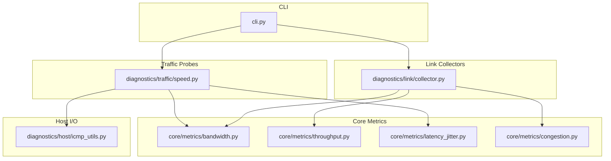
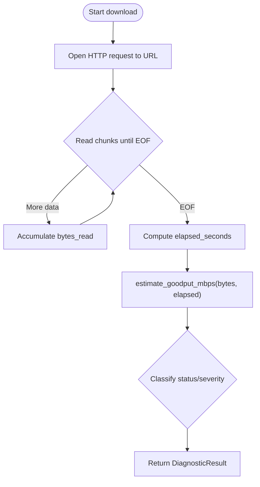
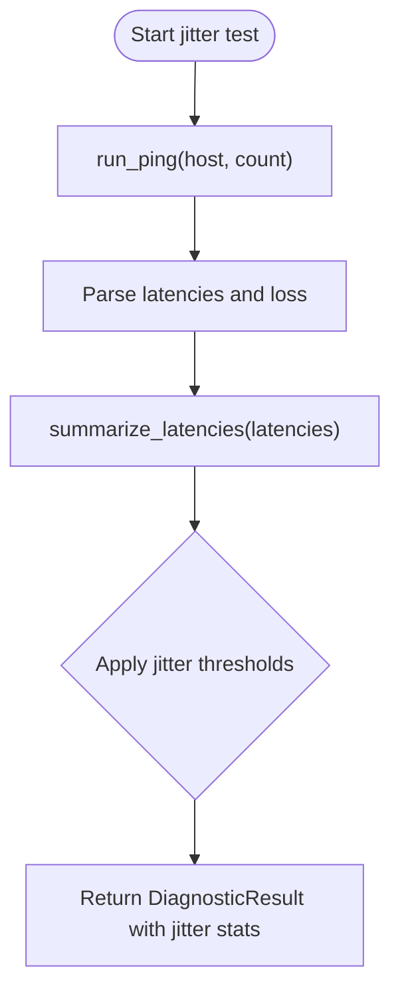
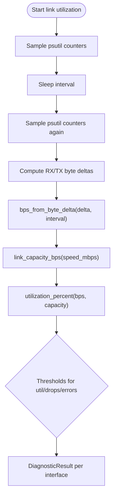
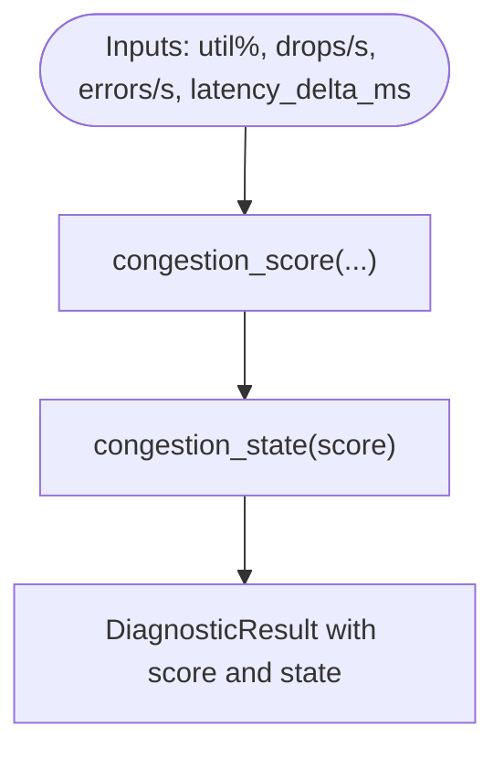
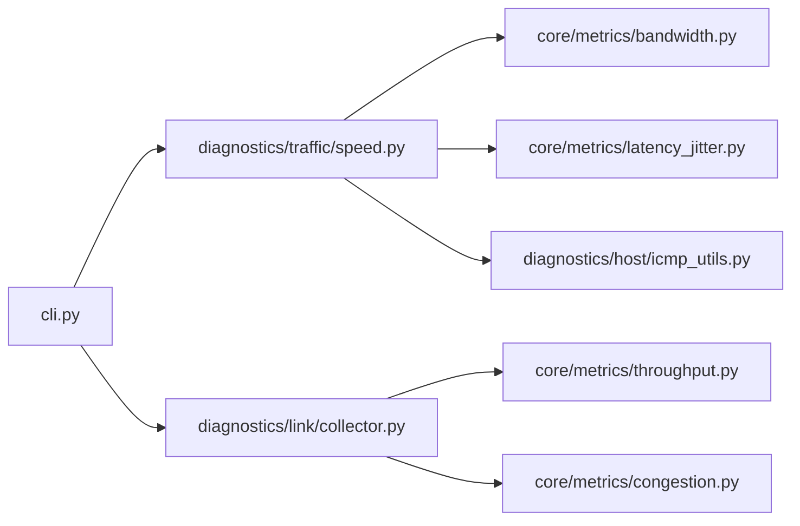

# Traffic Analysis

<cite>
**Referenced Files in This Document**
- [speed.py](file://diagnostics/traffic/speed.py)
- [bandwidth.py](file://core/metrics/bandwidth.py)
- [throughput.py](file://core/metrics/throughput.py)
- [latency_jitter.py](file://core/metrics/latency_jitter.py)
- [icmp_utils.py](file://diagnostics/host/icmp_utils.py)
- [collector.py](file://diagnostics/link/collector.py)
- [congestion.py](file://core/metrics/congestion.py)
- [cli.py](file://cli.py)
- [README.md](file://README.md)
</cite>

## Table of Contents
1. [Introduction](#introduction)
2. [Project Structure](#project-structure)
3. [Core Components](#core-components)
4. [Architecture Overview](#architecture-overview)
5. [Detailed Component Analysis](#detailed-component-analysis)
6. [Dependency Analysis](#dependency-analysis)
7. [Performance Considerations](#performance-considerations)
8. [Troubleshooting Guide](#troubleshooting-guide)
9. [Conclusion](#conclusion)
10. [Appendices](#appendices)

## Introduction
This document explains the NetForge traffic analysis module with a focus on bandwidth testing, speed measurement, and traffic pattern analysis. It covers the speed testing methodology, how throughput is calculated, and how to interpret results to identify bottlenecks. It also documents available configuration options for test duration, connection limits (as implemented), and measurement accuracy considerations.

## Project Structure
The traffic analysis capability spans several modules:
- Active speed and jitter probes under diagnostics/traffic
- Core metric helpers for bandwidth, throughput, latency/jitter, and congestion scoring
- Link-level utilization and error collectors that provide interface throughput and congestion signals
- CLI entry points to run traffic tests and link diagnostics



**Diagram sources**
- [speed.py:1-152](file://diagnostics/traffic/speed.py#L1-L152)
- [bandwidth.py:1-17](file://core/metrics/bandwidth.py#L1-L17)
- [throughput.py:1-24](file://core/metrics/throughput.py#L1-L24)
- [latency_jitter.py:1-41](file://core/metrics/latency_jitter.py#L1-L41)
- [congestion.py:1-51](file://core/metrics/congestion.py#L1-L51)
- [icmp_utils.py:1-126](file://diagnostics/host/icmp_utils.py#L1-L126)
- [collector.py:1-210](file://diagnostics/link/collector.py#L1-L210)
- [cli.py:340-388](file://cli.py#L340-L388)

**Section sources**
- [README.md:1-22](file://README.md#L1-L22)
- [cli.py:340-388](file://cli.py#L340-L388)

## Core Components
- Speed probe: measures download goodput by streaming data from a remote endpoint and computing Mbps using elapsed time and bytes transferred.
- Jitter probe: measures RFC 3550 jitter via ICMP ping samples and summarizes latency statistics.
- Link utilization: measures per-interface RX/TX throughput over a sampling interval and computes utilization against negotiated link speed when available.
- Congestion scoring: combines utilization, drops/errors, and latency delta into a heuristic score and state label.
- Throughput helpers: convert byte deltas to bits/sec and compute utilization percentages.

These components together enable bandwidth testing, speed measurement, and traffic pattern analysis across active probes and local link observations.

**Section sources**
- [speed.py:22-121](file://diagnostics/traffic/speed.py#L22-L121)
- [collector.py:29-179](file://diagnostics/link/collector.py#L29-L179)
- [bandwidth.py:4-16](file://core/metrics/bandwidth.py#L4-L16)
- [throughput.py:4-23](file://core/metrics/throughput.py#L4-L23)
- [congestion.py:4-50](file://core/metrics/congestion.py#L4-L50)

## Architecture Overview
The traffic analysis flow consists of two complementary paths:
- Active speed and jitter measurements that exercise the network stack and external endpoints
- Passive/local link metrics that observe interface counters to infer throughput and congestion

```mermaid
sequenceDiagram
participant User as "User"
participant CLI as "cli.py"
participant Speed as "speed.py"
participant BW as "bandwidth.py"
participant Lat as "latency_jitter.py"
participant ICMP as "icmp_utils.py"
participant Link as "link/collector.py"
participant Thru as "throughput.py"
participant Cong as "congestion.py"
User->>CLI : netforge traffic speed
CLI->>Speed : run_speed_diagnostics(url)
Speed->>Speed : measure_download_speed(url)
Speed->>BW : estimate_goodput_mbps(bytes, elapsed)
Speed-->>CLI : DiagnosticResult(goodput)
User->>CLI : netforge traffic jitter
CLI->>Speed : run_jitter_diagnostics(host, count)
Speed->>ICMP : run_ping(host, count)
ICMP->>Lat : summarize_latencies(latencies)
Speed-->>CLI : DiagnosticResult(jitter)
User->>CLI : netforge traffic bandwidth
CLI->>Link : measure_link_utilization(interval)
Link->>Thru : bps_from_byte_delta(delta, interval)
Link->>BW : link_capacity_bps(speed_mbps)
Link->>Cong : congestion_score(util, drops, errors, latency_delta)
Link-->>CLI : DiagnosticResults(util, errors, congestion)
```

**Diagram sources**
- [cli.py:340-388](file://cli.py#L340-L388)
- [speed.py:22-151](file://diagnostics/traffic/speed.py#L22-L151)
- [bandwidth.py:4-16](file://core/metrics/bandwidth.py#L4-L16)
- [latency_jitter.py:28-40](file://core/metrics/latency_jitter.py#L28-L40)
- [icmp_utils.py:68-115](file://diagnostics/host/icmp_utils.py#L68-L115)
- [collector.py:29-179](file://diagnostics/link/collector.py#L29-L179)
- [throughput.py:4-23](file://core/metrics/throughput.py#L4-L23)
- [congestion.py:4-50](file://core/metrics/congestion.py#L4-L50)

## Detailed Component Analysis

### Speed Measurement and Goodput Calculation
- The speed probe downloads a fixed-size payload and measures elapsed time to estimate application goodput in Mbps.
- Goodput is computed by converting transferred bytes to bits and dividing by elapsed seconds, then scaling to Mbps.
- Results include status and severity based on thresholds applied to the measured goodput.



**Diagram sources**
- [speed.py:22-70](file://diagnostics/traffic/speed.py#L22-L70)
- [bandwidth.py:11-16](file://core/metrics/bandwidth.py#L11-L16)

**Section sources**
- [speed.py:22-70](file://diagnostics/traffic/speed.py#L22-L70)
- [bandwidth.py:11-16](file://core/metrics/bandwidth.py#L11-L16)

### Jitter Measurement and Latency Statistics
- Jitter is measured by sending ICMP pings to a target host and parsing latencies from the output.
- Latency statistics are summarized including min, avg, max, jitter (RFC 3550), standard deviation, and sample count.
- Status and severity are derived from jitter thresholds.



**Diagram sources**
- [speed.py:73-110](file://diagnostics/traffic/speed.py#L73-L110)
- [icmp_utils.py:68-115](file://diagnostics/host/icmp_utils.py#L68-L115)
- [latency_jitter.py:28-40](file://core/metrics/latency_jitter.py#L28-L40)

**Section sources**
- [speed.py:73-110](file://diagnostics/traffic/speed.py#L73-L110)
- [icmp_utils.py:68-115](file://diagnostics/host/icmp_utils.py#L68-L115)
- [latency_jitter.py:28-40](file://core/metrics/latency_jitter.py#L28-L40)

### Link Utilization and Throughput Calculation
- Interface throughput is measured by sampling network I/O counters before and after a configurable interval.
- RX/TX bits per second are computed from counter deltas and converted to Mbps.
- Utilization percentage is calculated against the negotiated link speed when available; otherwise, raw throughput is reported.
- Errors and drops are counted per second and used to assess link health.



**Diagram sources**
- [collector.py:29-84](file://diagnostics/link/collector.py#L29-L84)
- [throughput.py:4-13](file://core/metrics/throughput.py#L4-L13)
- [bandwidth.py:4-8](file://core/metrics/bandwidth.py#L4-L8)

**Section sources**
- [collector.py:29-129](file://diagnostics/link/collector.py#L29-L129)
- [throughput.py:4-23](file://core/metrics/throughput.py#L4-L23)
- [bandwidth.py:4-8](file://core/metrics/bandwidth.py#L4-L8)

### Congestion Scoring and State Classification
- A heuristic congestion score aggregates utilization, drop/error rates, and latency delta.
- The score maps to coarse states: clear, mild, moderate, severe.
- Used to flag degraded or failed conditions when combined with other link metrics.



**Diagram sources**
- [congestion.py:4-50](file://core/metrics/congestion.py#L4-L50)
- [collector.py:132-179](file://diagnostics/link/collector.py#L132-L179)

**Section sources**
- [congestion.py:4-50](file://core/metrics/congestion.py#L4-L50)
- [collector.py:132-179](file://diagnostics/link/collector.py#L132-L179)

### CLI Entry Points and Usage Examples
- Speed test: runs an active download probe to estimate goodput.
- Jitter test: measures RFC 3550 jitter via ICMP.
- Bandwidth view: shows current interface bandwidth samples and utilization.

Examples:
- Run a speed test: `netforge traffic speed`
- Measure jitter: `netforge traffic jitter --host 1.1.1.1 --count 10`
- View bandwidth: `netforge traffic bandwidth --interval 1.0`

**Section sources**
- [cli.py:340-388](file://cli.py#L340-L388)
- [README.md:11-19](file://README.md#L11-L19)

## Dependency Analysis
Key dependencies and relationships:
- Speed probe depends on core bandwidth calculation and ICMP-based jitter utilities.
- Link collectors depend on throughput helpers, bandwidth capacity conversion, and congestion scoring.
- CLI wires user commands to these modules.



**Diagram sources**
- [cli.py:340-388](file://cli.py#L340-L388)
- [speed.py:1-152](file://diagnostics/traffic/speed.py#L1-L152)
- [collector.py:1-210](file://diagnostics/link/collector.py#L1-L210)
- [bandwidth.py:1-17](file://core/metrics/bandwidth.py#L1-L17)
- [throughput.py:1-24](file://core/metrics/throughput.py#L1-L24)
- [latency_jitter.py:1-41](file://core/metrics/latency_jitter.py#L1-L41)
- [icmp_utils.py:1-126](file://diagnostics/host/icmp_utils.py#L1-L126)
- [congestion.py:1-51](file://core/metrics/congestion.py#L1-L51)

**Section sources**
- [cli.py:340-388](file://cli.py#L340-L388)
- [speed.py:1-152](file://diagnostics/traffic/speed.py#L1-L152)
- [collector.py:1-210](file://diagnostics/link/collector.py#L1-L210)

## Performance Considerations
- Measurement accuracy:
  - Speed test accuracy depends on payload size and network stability; larger payloads reduce variance but increase test duration.
  - Jitter measurement relies on ICMP; packet loss or firewall policies can affect reliability.
  - Link utilization requires a suitable sampling interval; too short intervals may be noisy, too long may miss spikes.
- Concurrency:
  - The current speed probe uses a single sequential download stream; no concurrent connections are used.
  - Link utilization and error measurements operate on system counters and do not spawn additional threads.
- Throughput calculation:
  - Goodput is computed as bits divided by elapsed time; ensure elapsed time is strictly positive to avoid division issues.
  - Utilization is capped at 100% to prevent unrealistic values.

[No sources needed since this section provides general guidance]

## Troubleshooting Guide
Common issues and resolutions:
- Speed test failures:
  - Network unreachable or timeout: verify connectivity and firewall rules; adjust timeout if supported by your environment.
  - Low goodput: check for background traffic, ISP throttling, or server-side limitations.
- Jitter measurement failures:
  - ICMP blocked or rate-limited: use alternative hosts or adjust count; consider path-specific restrictions.
  - High packet loss: investigate upstream congestion or faulty links.
- Link utilization anomalies:
  - Unexpected high utilization: confirm sampling interval and check for bursty traffic patterns.
  - Drops/errors: correlate with congestion scores; investigate NIC drivers, cable quality, or switch port issues.

**Section sources**
- [speed.py:61-70](file://diagnostics/traffic/speed.py#L61-L70)
- [speed.py:73-110](file://diagnostics/traffic/speed.py#L73-L110)
- [collector.py:106-129](file://diagnostics/link/collector.py#L106-L129)
- [collector.py:132-179](file://diagnostics/link/collector.py#L132-L179)

## Conclusion
NetForge’s traffic analysis module provides practical tools for measuring download goodput, assessing jitter, and observing interface throughput and congestion. The speed probe offers a simple yet effective method to estimate real-world bandwidth, while link collectors deliver actionable insights into utilization and potential bottlenecks. By combining active probes with local link metrics, users can diagnose performance issues and identify where improvements are needed.

[No sources needed since this section summarizes without analyzing specific files]

## Appendices

### Configuration Options
- Speed test:
  - URL: configurable via CLI option; default targets a public speed endpoint.
  - Timeout: embedded in the download function; defaults to a reasonable value for large payloads.
- Jitter test:
  - Host: configurable via CLI option; default is a common DNS resolver.
  - Count: number of ICMP probes; higher counts improve statistical reliability.
- Link bandwidth:
  - Interval: sampling window for counter deltas; tune based on desired responsiveness vs. noise.

**Section sources**
- [cli.py:340-388](file://cli.py#L340-L388)
- [speed.py:22-70](file://diagnostics/traffic/speed.py#L22-L70)
- [speed.py:73-110](file://diagnostics/traffic/speed.py#L73-L110)
- [collector.py:29-84](file://diagnostics/link/collector.py#L29-L84)

### Interpreting Results and Identifying Bottlenecks
- Goodput thresholds:
  - Very low goodput (<1 Mbps) indicates significant constraints; investigate ISP, Wi-Fi, or server limitations.
  - Moderate goodput (1–5 Mbps) suggests partial constraints; check for background usage or routing inefficiencies.
- Jitter thresholds:
  - High jitter (>50 ms) often correlates with congestion or unstable links; examine link utilization and error rates.
- Link utilization:
  - Sustained high utilization (>75–90%) indicates capacity constraints; consider upgrading links or load balancing.
  - Elevated drops/errors point to physical layer issues or misconfiguration; inspect NIC and switch logs.
- Congestion state:
  - Severe congestion implies immediate action required; combine with path loss and latency trends to pinpoint root causes.

**Section sources**
- [speed.py:39-45](file://diagnostics/traffic/speed.py#L39-L45)
- [speed.py:87-92](file://diagnostics/traffic/speed.py#L87-L92)
- [collector.py:53-58](file://diagnostics/link/collector.py#L53-L58)
- [collector.py:106-111](file://diagnostics/link/collector.py#L106-L111)
- [congestion.py:42-50](file://core/metrics/congestion.py#L42-L50)