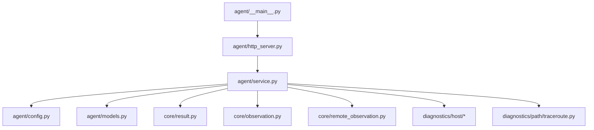
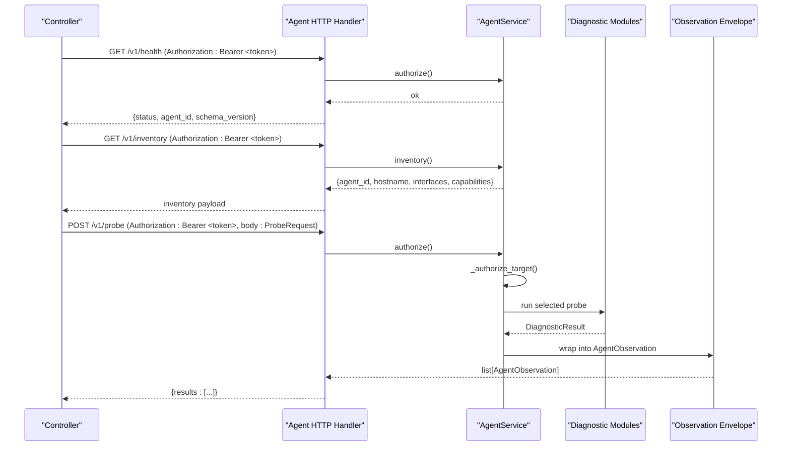
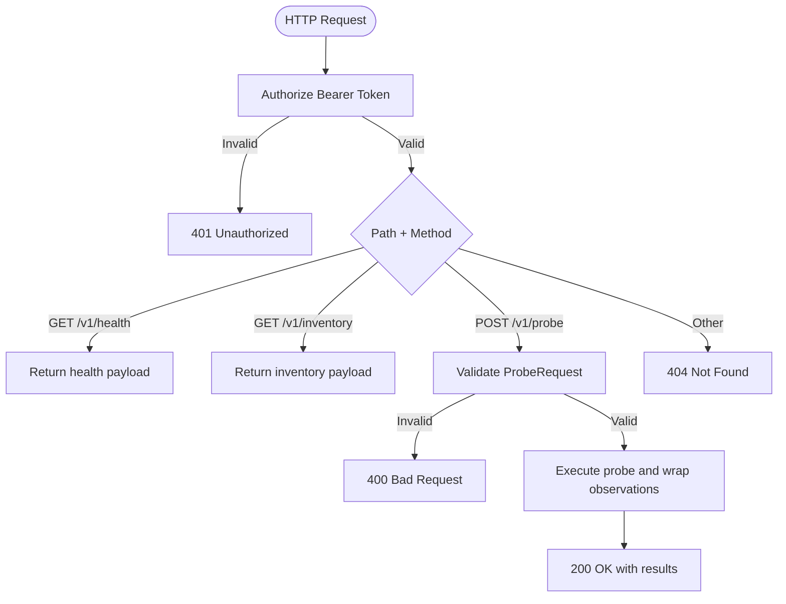
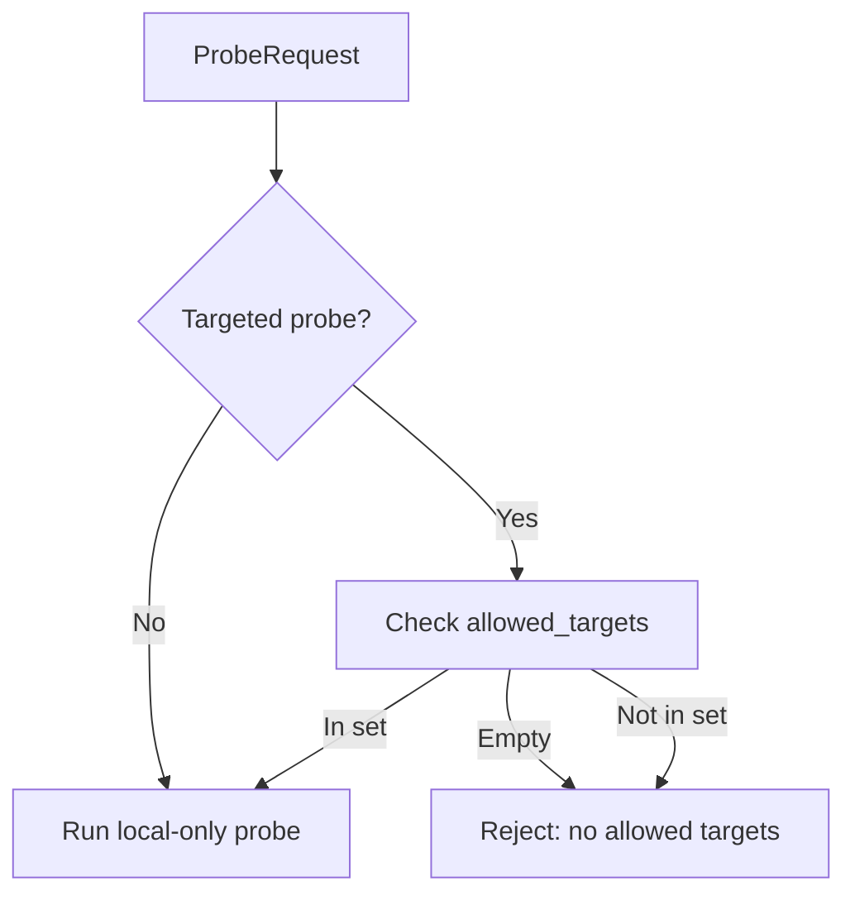
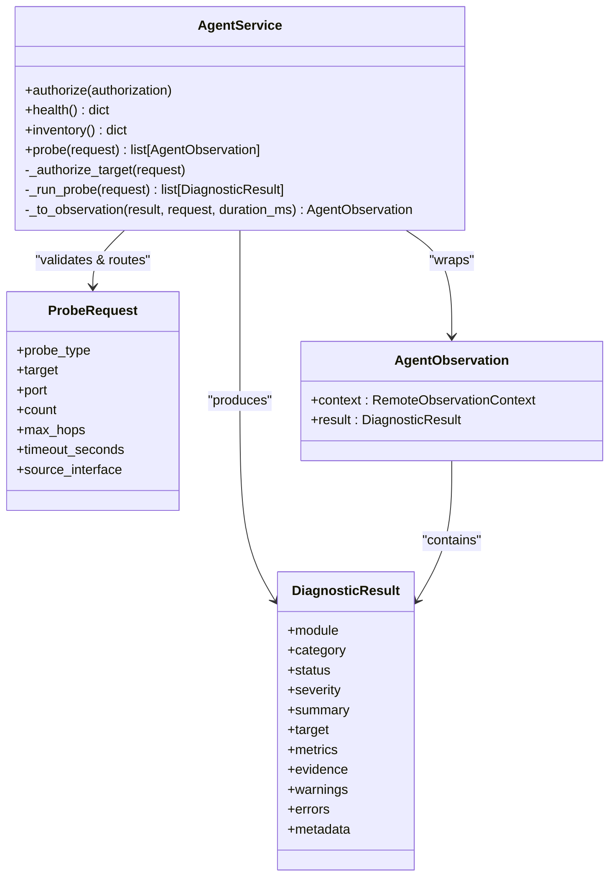
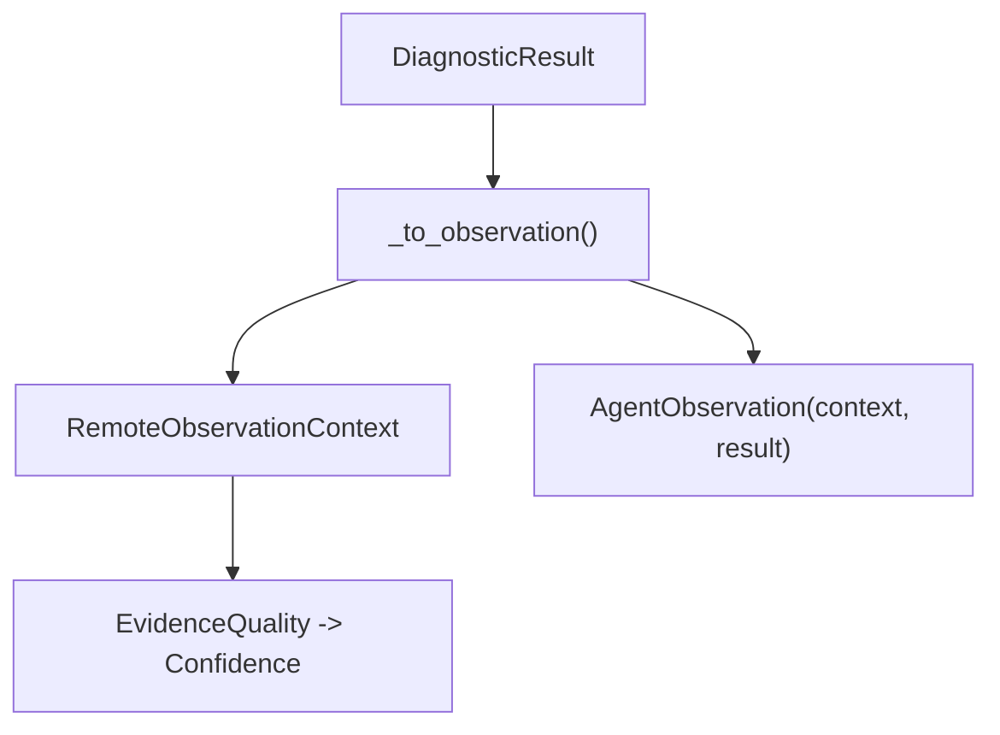
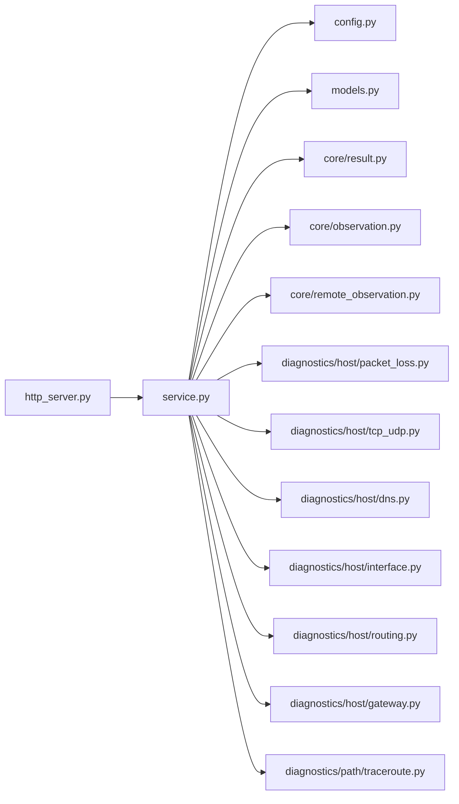

# Agent Service

<cite>
**Referenced Files in This Document**
- [__main__.py](file://agent/__main__.py)
- [config.py](file://agent/config.py)
- [http_server.py](file://agent/http_server.py)
- [models.py](file://agent/models.py)
- [service.py](file://agent/service.py)
- [observation.py](file://core/observation.py)
- [remote_observation.py](file://core/remote_observation.py)
- [result.py](file://core/result.py)
- [packet_loss.py](file://diagnostics/host/packet_loss.py)
- [tcp_udp.py](file://diagnostics/host/tcp_udp.py)
- [dns.py](file://diagnostics/host/dns.py)
- [interface.py](file://diagnostics/host/interface.py)
- [routing.py](file://diagnostics/host/routing.py)
- [gateway.py](file://diagnostics/host/gateway.py)
- [traceroute.py](file://diagnostics/path/traceroute.py)
- [test_agent_http.py](file://tests/test_agent_http.py)
</cite>

## Table of Contents
1. Introduction
2. Project Structure
3. Core Components
4. Architecture Overview
5. Detailed Component Analysis
6. Dependency Analysis
7. Performance Considerations
8. Troubleshooting Guide
9. Conclusion
10. Appendices

## Introduction
The NetForge Agent is a lightweight, authenticated HTTP service that runs on remote hosts to execute diagnostic probes and return standardized observations to the controller. It exposes minimal endpoints for health checks, inventory retrieval, and probe execution. The agent enforces Bearer token authentication, supports target authorization via an allowlist, and wraps all results into a versioned observation contract with provenance and evidence quality metadata.

## Project Structure
The agent is organized into focused modules:
- Entry point and process startup
- Configuration from environment variables
- HTTP transport with routing and error handling
- Request models and validation
- Business logic orchestrating diagnostics and wrapping results
- Shared core types for results and observations
- Diagnostic implementations for host and path domains

**Diagram sources**
- [__main__.py:12-17](file://agent/__main__.py#L12-L17)
- [http_server.py:15-62](file://agent/http_server.py#L15-L62)
- [service.py:33-111](file://agent/service.py#L33-L111)
- [config.py:10-35](file://agent/config.py#L10-L35)
- [models.py:10-41](file://agent/models.py#L10-L41)
- [result.py:24-47](file://core/result.py#L24-L47)
- [observation.py:32-63](file://core/observation.py#L32-L63)
- [remote_observation.py:15-59](file://core/remote_observation.py#L15-L59)

**Section sources**
- [__main__.py:1-22](file://agent/__main__.py#L1-L22)
- [http_server.py:1-63](file://agent/http_server.py#L1-L63)
- [service.py:1-111](file://agent/service.py#L1-L111)
- [config.py:1-35](file://agent/config.py#L1-L35)
- [models.py:1-41](file://agent/models.py#L1-L41)

## Core Components
- AgentConfig: Frozen configuration loaded from environment, including agent identity, bearer token, hostname, allowed targets, and topology tags.
- HTTP Transport: Minimal ThreadingHTTPServer-based handler that dispatches GET /v1/health, GET /v1/inventory, and POST /v1/probe, enforcing Bearer token authorization and returning JSON responses.
- ProbeRequest: Pydantic model validating probe type, target, port, count, max_hops, timeout, and source interface with scope rules per probe type.
- AgentService: Orchestrates authorization, target allowlisting, probe execution, timing, and result-to-observation wrapping.
- Diagnostics: Host and path modules implementing ICMP, TCP, DNS, Traceroute, Interfaces, Route, and Gateway probes.
- Observation Contract: Standardized context and result envelope ensuring provenance, confidence, and evidence quality across agents and controllers.

**Section sources**
- [config.py:10-35](file://agent/config.py#L10-L35)
- [http_server.py:15-62](file://agent/http_server.py#L15-L62)
- [models.py:10-41](file://agent/models.py#L10-L41)
- [service.py:33-111](file://agent/service.py#L33-L111)
- [observation.py:32-63](file://core/observation.py#L32-L63)
- [remote_observation.py:15-59](file://core/remote_observation.py#L15-L59)
- [result.py:24-47](file://core/result.py#L24-L47)

## Architecture Overview
The agent exposes a small set of authenticated endpoints. Requests are validated and dispatched to the service layer, which executes the appropriate diagnostic module and returns wrapped observations.

**Diagram sources**
- [http_server.py:15-62](file://agent/http_server.py#L15-L62)
- [service.py:37-111](file://agent/service.py#L37-L111)
- [models.py:23-41](file://agent/models.py#L23-L41)
- [remote_observation.py:54-59](file://core/remote_observation.py#L54-L59)

## Detailed Component Analysis

### HTTP Server and Routing
- Exposes three endpoints:
  - GET /v1/health: Returns agent identity and schema version after successful authorization.
  - GET /v1/inventory: Returns agent identity, hostname, topology tags, interface stats, and declared capabilities.
  - POST /v1/probe: Accepts a validated ProbeRequest, executes the probe, and returns a list of AgentObservation payloads.
- Authorization: All endpoints require a valid Bearer token; missing or invalid tokens yield 401 Unauthorized.
- Error handling:
  - Invalid JSON body returns 400 Bad Request.
  - Validation errors and target not allowed errors return 400 Bad Request.
  - Unknown paths return 404 Not Found.

**Diagram sources**
- [http_server.py:15-62](file://agent/http_server.py#L15-L62)
- [service.py:37-72](file://agent/service.py#L37-L72)
- [models.py:23-41](file://agent/models.py#L23-L41)

**Section sources**
- [http_server.py:15-62](file://agent/http_server.py#L15-L62)
- [test_agent_http.py:12-33](file://tests/test_agent_http.py#L12-L33)

### Authentication and Target Authorization
- Bearer token:
  - Expected format: "Bearer <token>"
  - Comparison uses constant-time comparison to mitigate timing attacks.
- Target authorization:
  - For targeted probes (ICMP, TCP, DNS, TRACEROUTE), the requested target must be present in the configured allowed_targets set.
  - If no allowed_targets are configured, any targeted probe is rejected.

**Diagram sources**
- [service.py:58-72](file://agent/service.py#L58-L72)
- [models.py:20-41](file://agent/models.py#L20-L41)

**Section sources**
- [service.py:37-72](file://agent/service.py#L37-L72)
- [models.py:20-41](file://agent/models.py#L20-L41)

### Probe Execution Engine
- Dispatch table maps ProbeType to diagnostic functions:
  - ICMP: packet loss measurement against a target host.
  - TCP: reachability and latency to a specific port.
  - DNS: hostname resolution with system DNS server discovery.
  - TRACEROUTE: path discovery with hop-level metrics and fingerprinting.
  - INTERFACES: enumeration of network interfaces and status.
  - ROUTE: parsing of the routing table to identify default gateway and route counts.
  - GATEWAY: reachability check of the default gateway using ICMP.
- Timing: Each probe execution is timed and reported as duration_ms in the observation context.
- Result wrapping: Each DiagnosticResult is wrapped into an AgentObservation with RemoteObservationContext including agent identity, hostname, probe type, target, sample_count, duration_ms, topology_tags, raw_evidence, and evidence_quality.

**Diagram sources**
- [service.py:33-111](file://agent/service.py#L33-L111)
- [models.py:23-41](file://agent/models.py#L23-L41)
- [result.py:24-47](file://core/result.py#L24-L47)
- [remote_observation.py:54-59](file://core/remote_observation.py#L54-L59)

**Section sources**
- [service.py:58-111](file://agent/service.py#L58-L111)

### Supported Probes: Parameters and Capabilities
- ICMP
  - Parameters: target (required), count (default 3, range 1–20).
  - Capability: Measures packet loss percentage and reports status based on thresholds.
  - Implementation reference: [packet_loss.py:14-77](file://diagnostics/host/packet_loss.py#L14-L77)
- TCP
  - Parameters: target (required), port (required, 1–65535), timeout_seconds (default 5, up to 30).
  - Capability: Attempts TCP handshake and measures latency; reports reachable/unreachable with error codes.
  - Implementation reference: [tcp_udp.py:16-86](file://diagnostics/host/tcp_udp.py#L16-L86)
- DNS
  - Parameters: target (required, hostname).
  - Capability: Resolves hostname and discovers configured DNS servers; includes resolution time and addresses.
  - Implementation reference: [dns.py:92-147](file://diagnostics/host/dns.py#L92-L147), [dns.py:21-89](file://diagnostics/host/dns.py#L21-L89)
- TRACEROUTE
  - Parameters: target (required), max_hops (default 20, range 1–64).
  - Capability: Discovers path hops, computes per-hop RTTs and loss, generates path fingerprint, and determines degraded/healthy status.
  - Implementation reference: [traceroute.py:138-213](file://diagnostics/path/traceroute.py#L138-L213)
- INTERFACES
  - Parameters: none (local host).
  - Capability: Enumerates interfaces, states, IP families, MAC, speed, MTU; marks overall system connectivity.
  - Implementation reference: [interface.py:16-109](file://diagnostics/host/interface.py#L16-L109)
- ROUTE
  - Parameters: none (local host).
  - Capability: Parses OS-specific routing tables to find default gateway, interface, and active route counts.
  - Implementation reference: [routing.py:81-161](file://diagnostics/host/routing.py#L81-L161)
- GATEWAY
  - Parameters: count (default 4).
  - Capability: Pings the default gateway (or explicit gateway) and reports loss and RTT; distinguishes local vs upstream issues.
  - Implementation reference: [gateway.py:15-94](file://diagnostics/host/gateway.py#L15-L94)

**Section sources**
- [models.py:10-41](file://agent/models.py#L10-L41)
- [service.py:73-90](file://agent/service.py#L73-L90)
- [packet_loss.py:14-77](file://diagnostics/host/packet_loss.py#L14-L77)
- [tcp_udp.py:16-86](file://diagnostics/host/tcp_udp.py#L16-L86)
- [dns.py:21-89](file://diagnostics/host/dns.py#L21-L89)
- [dns.py:92-147](file://diagnostics/host/dns.py#L92-L147)
- [traceroute.py:138-213](file://diagnostics/path/traceroute.py#L138-L213)
- [interface.py:16-109](file://diagnostics/host/interface.py#L16-L109)
- [routing.py:81-161](file://diagnostics/host/routing.py#L81-L161)
- [gateway.py:15-94](file://diagnostics/host/gateway.py#L15-L94)

### Observation Wrapping and Evidence Quality
- Every DiagnosticResult is wrapped into an AgentObservation with:
  - RemoteObservationContext containing agent_id, hostname, probe_type, target, source_interface, sample_count, duration_ms, topology_tags, raw_evidence, evidence_quality, and derived confidence.
- Evidence quality:
  - PARSED_EXTERNAL when raw output is included; otherwise SINGLE_SOURCE.
  - Confidence is automatically derived from evidence_quality unless explicitly provided and validated.
- Timestamps are enforced to be timezone-aware and normalized to UTC.

**Diagram sources**
- [service.py:92-111](file://agent/service.py#L92-L111)
- [observation.py:32-63](file://core/observation.py#L32-L63)
- [remote_observation.py:15-59](file://core/remote_observation.py#L15-L59)

**Section sources**
- [service.py:92-111](file://agent/service.py#L92-L111)
- [observation.py:32-63](file://core/observation.py#L32-L63)
- [remote_observation.py:15-59](file://core/remote_observation.py#L15-L59)

## Dependency Analysis
- HTTP layer depends on service and models for routing and validation.
- Service depends on config for credentials and policy, models for request validation, and diagnostics for probe execution.
- Diagnostics depend on core result types and OS utilities; some use subprocess calls and platform detection.
- Observations bridge service outputs to controller expectations via strict context models.

**Diagram sources**
- [http_server.py:15-62](file://agent/http_server.py#L15-L62)
- [service.py:11-23](file://agent/service.py#L11-L23)
- [config.py:10-35](file://agent/config.py#L10-L35)
- [models.py:10-41](file://agent/models.py#L10-L41)
- [result.py:24-47](file://core/result.py#L24-L47)
- [observation.py:32-63](file://core/observation.py#L32-L63)
- [remote_observation.py:15-59](file://core/remote_observation.py#L15-L59)
- [packet_loss.py:14-77](file://diagnostics/host/packet_loss.py#L14-L77)
- [tcp_udp.py:16-86](file://diagnostics/host/tcp_udp.py#L16-L86)
- [dns.py:21-89](file://diagnostics/host/dns.py#L21-L89)
- [interface.py:16-109](file://diagnostics/host/interface.py#L16-L109)
- [routing.py:81-161](file://diagnostics/host/routing.py#L81-L161)
- [gateway.py:15-94](file://diagnostics/host/gateway.py#L15-L94)
- [traceroute.py:138-213](file://diagnostics/path/traceroute.py#L138-L213)

**Section sources**
- [service.py:11-23](file://agent/service.py#L11-L23)
- [http_server.py:15-62](file://agent/http_server.py#L15-L62)

## Performance Considerations
- Probe timeouts: Use timeout_seconds for TCP and traceroute to avoid long hangs; defaults are conservative.
- Sample sizes: Keep count low for frequent polling; increase for accuracy during investigations.
- Max hops: Limit max_hops to reduce traceroute overhead on large networks.
- Concurrency: The HTTP server uses threading; ensure external tools (subprocess) do not block excessively.
- Evidence quality: Including raw_output increases payload size; include only when needed for debugging.

## Troubleshooting Guide
- 401 Unauthorized:
  - Ensure Authorization header contains "Bearer <token>" matching the configured token.
  - Verify NETFORGE_AGENT_TOKEN is correctly set on the agent.
- 400 Bad Request:
  - Validate JSON body structure and fields; ensure required fields per probe type are present.
  - For TCP probes, port must be provided and within range.
  - For targeted probes, target must be allowed by allowed_targets.
- 404 Not Found:
  - Only /v1/health, /v1/inventory, and /v1/probe are supported.
- No allowed targets:
  - Configure NETFORGE_ALLOWED_TARGETS with comma-separated allowed hostnames or IPs.
- Diagnostics failures:
  - ICMP/DNS/Gateway may fail due to permissions or firewall policies; check OS logs and tool availability.
  - Traceroute requires system traceroute/tracert; ensure it is installed and permitted.

**Section sources**
- [http_server.py:29-45](file://agent/http_server.py#L29-L45)
- [service.py:37-72](file://agent/service.py#L37-L72)
- [models.py:23-41](file://agent/models.py#L23-L41)
- [config.py:18-35](file://agent/config.py#L18-L35)

## Conclusion
The NetForge Agent provides a secure, extensible endpoint for executing distributed diagnostics. Its design separates concerns between HTTP transport, business logic, and diagnostic implementations while enforcing strong contracts for observations. With Bearer token authentication, optional target allowlisting, and rich metadata, it enables reliable remote monitoring and analysis across diverse environments.

## Appendices

### Configuration Options
- Environment variables:
  - NETFORGE_AGENT_ID: Unique agent identifier.
  - NETFORGE_AGENT_TOKEN: Bearer token used for authentication.
  - NETFORGE_ALLOWED_TARGETS: Comma-separated list of authorized targets for targeted probes.
  - NETFORGE_TAG_<key>: Topology tags propagated into observation contexts.
- Defaults:
  - Hostname auto-detected if not overridden.
  - Allowed targets empty by default (blocks targeted probes until configured).

**Section sources**
- [config.py:10-35](file://agent/config.py#L10-L35)

### API Endpoints Summary
- GET /v1/health
  - Requires: Authorization: Bearer <token>
  - Response: {status, agent_id, schema_version}
- GET /v1/inventory
  - Requires: Authorization: Bearer <token>
  - Response: {agent_id, hostname, topology_tags, interfaces, capabilities}
- POST /v1/probe
  - Requires: Authorization: Bearer <token>, Content-Type: application/json
  - Body: ProbeRequest (probe_type, target, port, count, max_hops, timeout_seconds, source_interface)
  - Response: {results: [AgentObservation...]}

**Section sources**
- [http_server.py:15-62](file://agent/http_server.py#L15-L62)
- [models.py:23-41](file://agent/models.py#L23-L41)
- [remote_observation.py:54-59](file://core/remote_observation.py#L54-L59)

### Example Workflows
- Agent registration:
  - Set NETFORGE_AGENT_ID and NETFORGE_AGENT_TOKEN; start the agent process.
  - Controller can call GET /v1/health to verify liveness and identity.
- Health check:
  - Send GET /v1/health with Authorization header; expect 200 with agent identity.
- Inventory retrieval:
  - Send GET /v1/inventory with Authorization header; inspect capabilities and interfaces.
- Probe execution:
  - Send POST /v1/probe with a valid ProbeRequest; review results and observation context for provenance and metrics.

**Section sources**
- [__main__.py:12-17](file://agent/__main__.py#L12-L17)
- [http_server.py:15-62](file://agent/http_server.py#L15-L62)
- [service.py:42-56](file://agent/service.py#L42-L56)
- [service.py:58-111](file://agent/service.py#L58-L111)