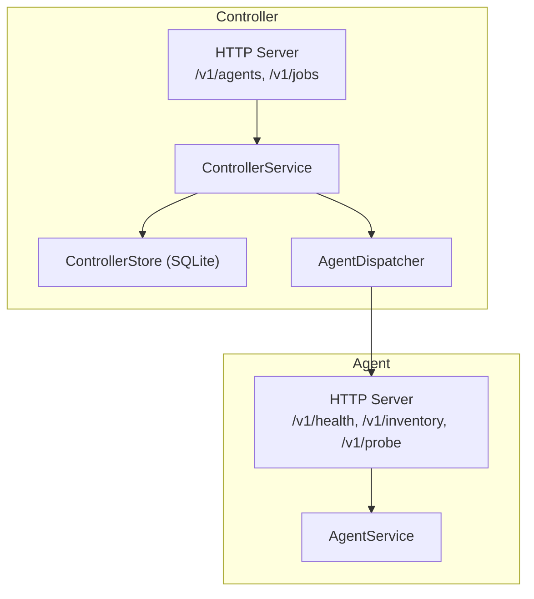
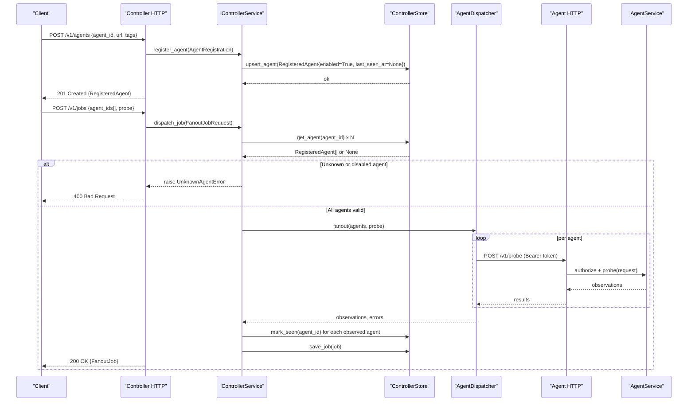
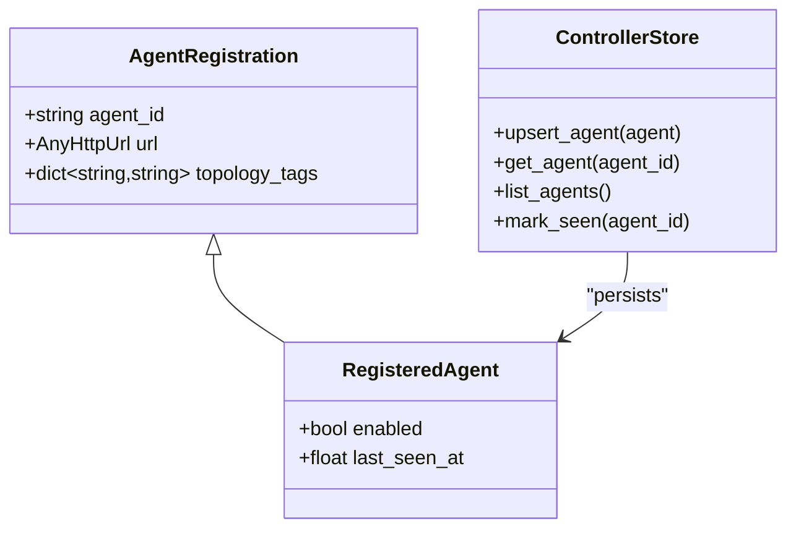
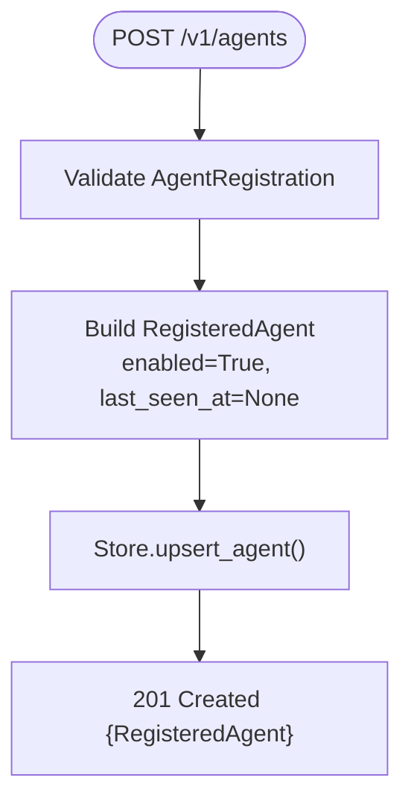
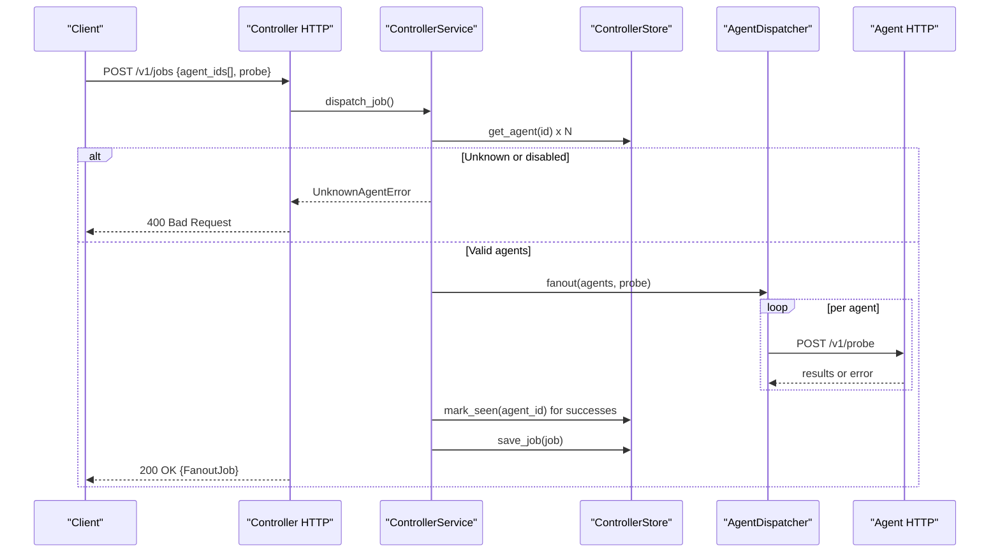
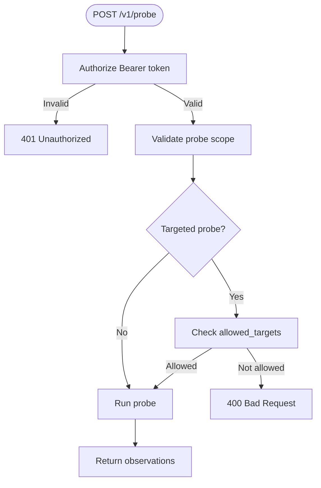
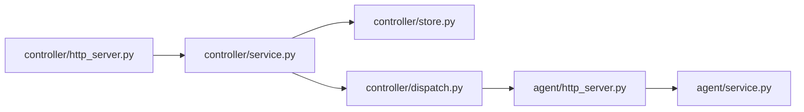

# Agent Management

<cite>
**Referenced Files in This Document**
- [controller/models.py](file://controller/models.py)
- [controller/service.py](file://controller/service.py)
- [controller/http_server.py](file://controller/http_server.py)
- [controller/store.py](file://controller/store.py)
- [controller/dispatch.py](file://controller/dispatch.py)
- [agent/models.py](file://agent/models.py)
- [agent/service.py](file://agent/service.py)
- [agent/http_server.py](file://agent/http_server.py)
- [tests/test_controller_service.py](file://tests/test_controller_service.py)
- [tests/test_agent_http.py](file://tests/test_agent_http.py)
</cite>

## Table of Contents
1. [Introduction](#introduction)
2. [Project Structure](#project-structure)
3. [Core Components](#core-components)
4. [Architecture Overview](#architecture-overview)
5. [Detailed Component Analysis](#detailed-component-analysis)
6. [Dependency Analysis](#dependency-analysis)
7. [Performance Considerations](#performance-considerations)
8. [Troubleshooting Guide](#troubleshooting-guide)
9. [Conclusion](#conclusion)
10. [Appendices](#appendices)

## Introduction
This document explains the NetForge Controller’s agent management functionality with a focus on how agents register, how their lifecycle is managed, and how health monitoring is tracked via last_seen_at. It also covers agent discovery through the controller’s API, enabled/disabled state management, validation during job dispatching, error handling for unknown or disabled agents, and best practices to maintain connectivity between the controller and agents. Data models for AgentRegistration and RegisteredAgent are detailed along with their relationships to the underlying SQLite storage layer.

## Project Structure
The agent management feature spans two main components:
- Controller side: HTTP API, service orchestration, persistence (SQLite), and concurrent dispatch to agents.
- Agent side: HTTP endpoints for health, inventory, and probe execution, plus authorization and target allow-list enforcement.

**Diagram sources**
- [controller/http_server.py:16-68](file://controller/http_server.py#L16-L68)
- [controller/service.py:17-51](file://controller/service.py#L17-L51)
- [controller/store.py:13-78](file://controller/store.py#L13-L78)
- [controller/dispatch.py:19-52](file://controller/dispatch.py#L19-L52)
- [agent/http_server.py:15-63](file://agent/http_server.py#L15-L63)
- [agent/service.py:33-111](file://agent/service.py#L33-L111)

**Section sources**
- [controller/http_server.py:16-68](file://controller/http_server.py#L16-L68)
- [controller/service.py:17-51](file://controller/service.py#L17-L51)
- [controller/store.py:13-78](file://controller/store.py#L13-L78)
- [controller/dispatch.py:19-52](file://controller/dispatch.py#L19-L52)
- [agent/http_server.py:15-63](file://agent/http_server.py#L15-L63)
- [agent/service.py:33-111](file://agent/service.py#L33-L111)

## Core Components
- AgentRegistration and RegisteredAgent define the contract for registering agents and tracking runtime state such as enabled status and last_seen_at.
- ControllerService orchestrates registration, listing, job dispatching, and job retrieval.
- ControllerStore persists agents and jobs in SQLite and updates last_seen_at when agents respond successfully.
- AgentDispatcher concurrently issues HTTP probes to multiple agents and aggregates results and errors.
- Agent HTTP server exposes health, inventory, and probe endpoints with bearer token authorization and target allow-list checks.

Key responsibilities:
- Registration: Create or update an agent record with default enabled=True and last_seen_at=None.
- Discovery: List registered agents via GET /v1/agents.
- Dispatch validation: Reject unknown or disabled agents before sending work.
- Health tracking: Update last_seen_at upon successful responses from agents.

**Section sources**
- [controller/models.py:13-22](file://controller/models.py#L13-L22)
- [controller/service.py:22-47](file://controller/service.py#L22-L47)
- [controller/store.py:38-63](file://controller/store.py#L38-L63)
- [controller/dispatch.py:24-52](file://controller/dispatch.py#L24-L52)
- [agent/http_server.py:29-45](file://agent/http_server.py#L29-L45)

## Architecture Overview
End-to-end flow for agent registration and job dispatch:

**Diagram sources**
- [controller/http_server.py:30-55](file://controller/http_server.py#L30-L55)
- [controller/service.py:22-47](file://controller/service.py#L22-L47)
- [controller/store.py:38-63](file://controller/store.py#L38-L63)
- [controller/dispatch.py:24-52](file://controller/dispatch.py#L24-L52)
- [agent/http_server.py:29-45](file://agent/http_server.py#L29-L45)
- [agent/service.py:37-63](file://agent/service.py#L37-L63)

## Detailed Component Analysis

### Data Models: AgentRegistration and RegisteredAgent
- AgentRegistration
  - Fields: agent_id (string, min length 1), url (valid HTTP URL), topology_tags (dict[str, str], default empty).
  - Purpose: Input model for registering an agent with the controller.
- RegisteredAgent
  - Extends AgentRegistration with:
    - enabled: bool (default True) — controls whether the agent can receive jobs.
    - last_seen_at: float | None — timestamp of last successful response; used for health monitoring.
- Relationship to storage
  - Stored in SQLite table agents with columns: agent_id (PK), url, tags (JSON), enabled (INTEGER), last_seen_at (REAL).
  - Upsert semantics ensure repeated registrations update fields without duplication.

**Diagram sources**
- [controller/models.py:13-22](file://controller/models.py#L13-L22)
- [controller/store.py:23-63](file://controller/store.py#L23-L63)

**Section sources**
- [controller/models.py:13-22](file://controller/models.py#L13-L22)
- [controller/store.py:23-63](file://controller/store.py#L23-L63)

### Registration Process
- Endpoint: POST /v1/agents
- Steps:
  - Validate request body into AgentRegistration.
  - Build RegisteredAgent with enabled=True and last_seen_at=None.
  - Persist via upsert_agent.
  - Return 201 Created with the registered agent payload.

**Diagram sources**
- [controller/http_server.py:40-42](file://controller/http_server.py#L40-L42)
- [controller/service.py:22-25](file://controller/service.py#L22-L25)
- [controller/store.py:38-46](file://controller/store.py#L38-L46)

**Section sources**
- [controller/http_server.py:40-42](file://controller/http_server.py#L40-L42)
- [controller/service.py:22-25](file://controller/service.py#L22-L25)
- [controller/store.py:38-46](file://controller/store.py#L38-L46)

### Agent Lifecycle Management and Enabled/Disabled State
- Lifecycle states:
  - Registered: created via registration endpoint.
  - Active: receives jobs if enabled=True and reachable.
  - Inactive: disabled or unreachable; not dispatched to.
- Enabled flag:
  - Defaults to True on registration.
  - Can be toggled by re-registering with enabled=False to prevent further dispatches while preserving history.
- Last seen tracking:
  - Updated only when the controller receives successful responses from the agent during job execution.
  - Enables operators to detect stale agents by inspecting last_seen_at.

Best practices:
- Use periodic re-registration or a dedicated heartbeat endpoint to refresh last_seen_at.
- Disable agents gracefully before maintenance by updating enabled=False.

**Section sources**
- [controller/models.py:19-22](file://controller/models.py#L19-L22)
- [controller/store.py:60-63](file://controller/store.py#L60-L63)
- [controller/service.py:30-47](file://controller/service.py#L30-L47)

### Health Monitoring Through last_seen_at
- The controller marks agents as seen after successful probe responses.
- Operators can query GET /v1/agents to view last_seen_at values and determine staleness.
- If last_seen_at remains None or old, investigate network connectivity, agent availability, or configuration mismatches.

**Section sources**
- [controller/store.py:60-63](file://controller/store.py#L60-L63)
- [controller/http_server.py:38-39](file://controller/http_server.py#L38-L39)

### Agent Discovery Mechanism
- Discovery endpoint: GET /v1/agents returns all registered agents including enabled status and last_seen_at.
- Consumers can filter by enabled=True to discover healthy candidates for job distribution.

**Section sources**
- [controller/http_server.py:38-39](file://controller/http_server.py#L38-L39)

### Job Dispatching and Validation
- Endpoint: POST /v1/jobs
- Validation:
  - For each requested agent_id, the controller retrieves the agent from storage.
  - If the agent is missing or disabled, raises UnknownAgentError and returns 400 Bad Request.
- Concurrency:
  - Uses a thread pool to fan out probes to multiple agents concurrently.
  - Observations and errors are aggregated per agent.
- Post-processing:
  - Updates last_seen_at for agents that responded successfully.
  - Persists job with status completed/partial/failed based on outcomes.

**Diagram sources**
- [controller/http_server.py:43-55](file://controller/http_server.py#L43-L55)
- [controller/service.py:30-47](file://controller/service.py#L30-L47)
- [controller/dispatch.py:40-52](file://controller/dispatch.py#L40-L52)
- [controller/store.py:60-72](file://controller/store.py#L60-L72)

**Section sources**
- [controller/http_server.py:43-55](file://controller/http_server.py#L43-L55)
- [controller/service.py:30-47](file://controller/service.py#L30-L47)
- [controller/dispatch.py:40-52](file://controller/dispatch.py#L40-L52)
- [controller/store.py:60-72](file://controller/store.py#L60-L72)

### Agent-Side Authorization and Target Allow-List
- Authorization:
  - Agent endpoints require a Bearer token matching the agent’s configured token.
  - Unauthorized requests return 401 Unauthorized.
- Target allow-list:
  - For targeted probes (ICMP, TCP, DNS, TRACEROUTE), the agent validates that the target is explicitly allowed.
  - Disallowed targets raise a specific error and return 400 Bad Request.

**Diagram sources**
- [agent/http_server.py:29-45](file://agent/http_server.py#L29-L45)
- [agent/service.py:37-72](file://agent/service.py#L37-L72)

**Section sources**
- [agent/http_server.py:29-45](file://agent/http_server.py#L29-L45)
- [agent/service.py:37-72](file://agent/service.py#L37-L72)

### Error Handling for Unknown or Disabled Agents
- Unknown or disabled agents trigger UnknownAgentError in the controller service.
- The HTTP handler converts this to a 400 Bad Request with a descriptive error message.
- Tests verify that dispatching to missing agents is rejected.

**Section sources**
- [controller/service.py:30-36](file://controller/service.py#L30-L36)
- [controller/http_server.py:54-55](file://controller/http_server.py#L54-L55)
- [tests/test_controller_service.py:27-33](file://tests/test_controller_service.py#L27-L33)

### Best Practices for Maintaining Agent Connectivity
- Ensure consistent bearer tokens between controller and agent configurations.
- Keep agent URLs reachable from the controller network.
- Periodically re-register agents to refresh last_seen_at or implement a heartbeat mechanism.
- Use enabled=False to gracefully take agents offline for maintenance.
- Monitor last_seen_at via GET /v1/agents to detect stale agents promptly.

[No sources needed since this section provides general guidance]

## Dependency Analysis
High-level dependencies among components involved in agent management:

**Diagram sources**
- [controller/http_server.py:16-68](file://controller/http_server.py#L16-L68)
- [controller/service.py:17-51](file://controller/service.py#L17-L51)
- [controller/store.py:13-78](file://controller/store.py#L13-L78)
- [controller/dispatch.py:19-52](file://controller/dispatch.py#L19-L52)
- [agent/http_server.py:15-63](file://agent/http_server.py#L15-L63)
- [agent/service.py:33-111](file://agent/service.py#L33-L111)

**Section sources**
- [controller/http_server.py:16-68](file://controller/http_server.py#L16-L68)
- [controller/service.py:17-51](file://controller/service.py#L17-L51)
- [controller/store.py:13-78](file://controller/store.py#L13-L78)
- [controller/dispatch.py:19-52](file://controller/dispatch.py#L19-L52)
- [agent/http_server.py:15-63](file://agent/http_server.py#L15-L63)
- [agent/service.py:33-111](file://agent/service.py#L33-L111)

## Performance Considerations
- Concurrent dispatch:
  - The dispatcher uses a bounded ThreadPoolExecutor to fan out probes to multiple agents simultaneously, improving throughput.
  - max_workers can be tuned based on expected agent count and resource constraints.
- Timeouts:
  - Probe timeouts are derived from the request’s timeout_seconds plus a small buffer to account for network latency.
- Storage:
  - SQLite operations are lightweight and suitable for moderate scale; consider connection reuse and indexing strategies if scaling beyond current needs.

[No sources needed since this section provides general guidance]

## Troubleshooting Guide
Common issues and resolutions:
- 401 Unauthorized on agent endpoints:
  - Verify the agent’s bearer_token matches the controller’s expected token.
  - Confirm Authorization header format is correct.
- 400 Bad Request for unknown or disabled agents:
  - Ensure the agent is registered and enabled before dispatching jobs.
  - Check agent_id spelling and case sensitivity.
- Stale last_seen_at:
  - Investigate network connectivity, firewall rules, and agent availability.
  - Re-register the agent or implement periodic heartbeats to refresh timestamps.
- Target not allowed:
  - Configure allowed_targets on the agent to include required destinations.
  - Adjust probe requests to match allowed targets.

**Section sources**
- [agent/http_server.py:42-45](file://agent/http_server.py#L42-L45)
- [agent/service.py:37-72](file://agent/service.py#L37-L72)
- [controller/service.py:30-36](file://controller/service.py#L30-L36)
- [controller/http_server.py:54-55](file://controller/http_server.py#L54-L55)
- [tests/test_agent_http.py:12-33](file://tests/test_agent_http.py#L12-L33)

## Conclusion
The NetForge Controller provides a robust agent management system with clear registration workflows, lifecycle control via enabled flags, and health monitoring through last_seen_at. Validation during job dispatch ensures only known and enabled agents receive work, while concurrent dispatch improves performance. Proper configuration of bearer tokens and target allow-lists on agents secures and scopes probe execution. Operators can rely on the provided APIs to discover agents, manage their states, and monitor connectivity effectively.

[No sources needed since this section summarizes without analyzing specific files]

## Appendices

### API Endpoints Summary
- Controller
  - POST /v1/agents: Register or update an agent.
  - GET /v1/agents: List all registered agents.
  - POST /v1/jobs: Dispatch a probe to one or more agents.
  - GET /v1/jobs/{job_id}: Retrieve job status and results.
- Agent
  - GET /v1/health: Health check with agent identity.
  - GET /v1/inventory: Agent capabilities and topology info.
  - POST /v1/probe: Execute a diagnostic probe.

**Section sources**
- [controller/http_server.py:36-51](file://controller/http_server.py#L36-L51)
- [agent/http_server.py:32-39](file://agent/http_server.py#L32-L39)

### Data Model Reference
- AgentRegistration
  - agent_id: string
  - url: AnyHttpUrl
  - topology_tags: dict[str, str]
- RegisteredAgent
  - enabled: bool
  - last_seen_at: float | None
- FanoutJobRequest
  - agent_ids: list[str]
  - probe: ProbeRequest
- FanoutJob
  - job_id: str
  - created_at: float
  - completed_at: float | None
  - request: FanoutJobRequest
  - status: str
  - observations: dict[str, list[AgentObservation]]
  - errors: dict[str, str]
  - metadata: dict[str, Any]

**Section sources**
- [controller/models.py:13-38](file://controller/models.py#L13-L38)
- [agent/models.py:23-41](file://agent/models.py#L23-L41)